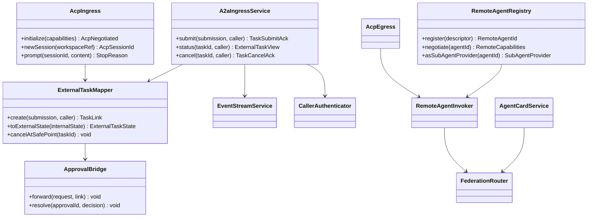
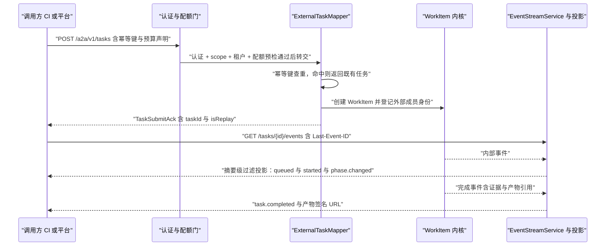
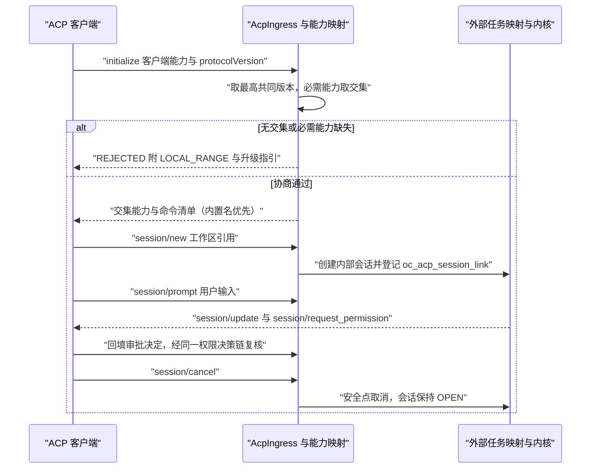
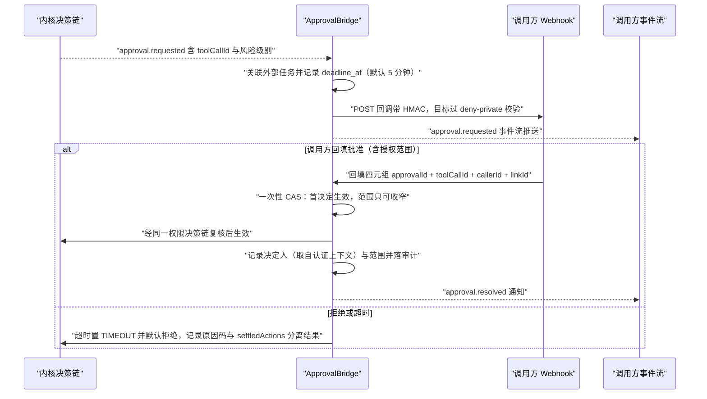
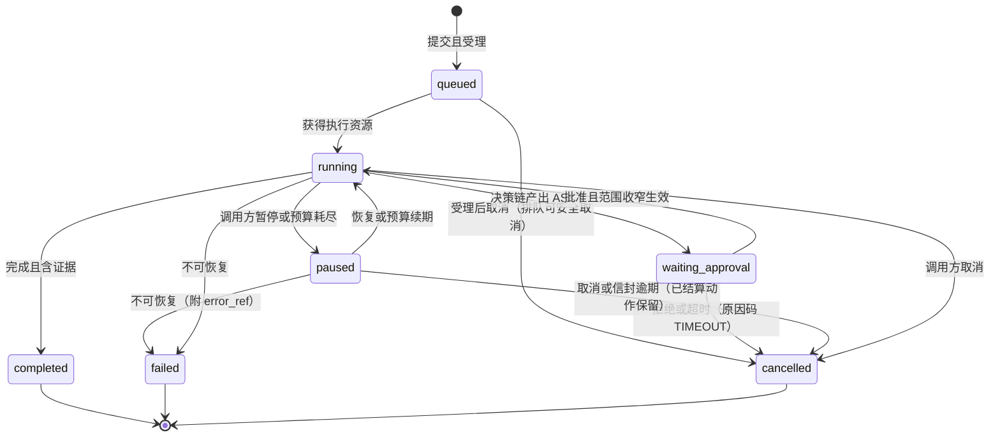
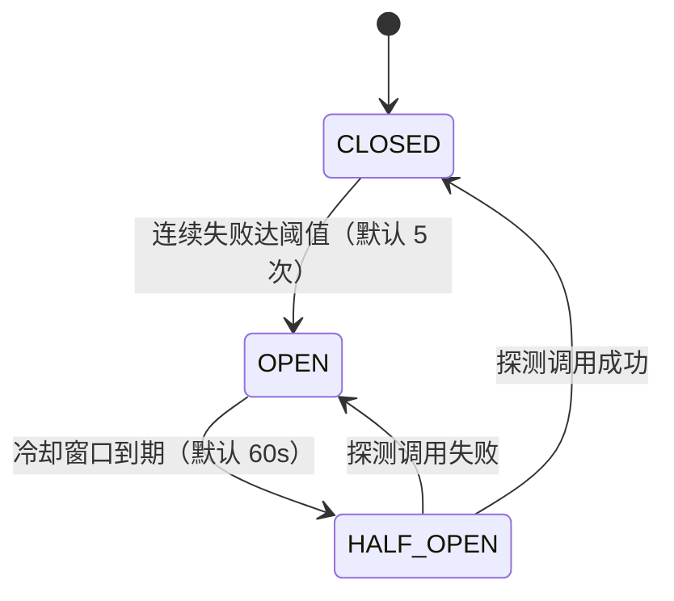

# C31 · RemoteAgentGateway（A2A/ACP 网关：入站服务面 + 出站 RemoteAgent 适配 + 版本协商）

> 组件编号 C31 ｜ 组件别名 RemoteAgentGateway（A2A/ACP 网关）｜ 归属域 协作与平台层（域编码 A2A）｜ 清单登记 P-27（A2aServer + RemoteAgentClient）/ P-28（FederationDirectory + AgentCardService）
> 上游系统方案：`impl/24-a2a-gateway-impl.md`（下称 impl/24）§1.1 五条线（L1–L5）、§2 REQ-A2A-11…34、§3 I-A2A-1…8、§5.1 契约、§6 时序、§7 状态机、§8 数据模型、§9 接口与扩展点、§10.2 版本矩阵、§10.7 降级
> 上游契约：卷 23 与 D-A2A-1…10、H-018（双向互操作）；附录 B §B.7（错误结构）/§B.8（版本协商）/§B.10（身份不接受请求体自声明）；依赖修订 X-51（ACP 适配线，impl/24 已按建议落地）
> 编号口径（本文件局部号段，须并入 `IMPL-DECISIONS.md` 后重编号）：`REQ-C-RAG-01…12`、`I-C-RAG-1…4`、`X-C31-1…3`（台账当前止于 X-82）
> 实现落点：`harness-contract/.../contract/a2a/`（零框架）+ `harness-host/host-a2a`（Spring 外壳，子包 ingress / acp / a2a / client / auth / approve / project / audit）；**不新增模块**；数据批次 B9 生态与互操作（R07 建议）
> 纪律：本组件方案不推翻系统级方案；凡与 impl/24 或台账口径冲突之处，一律在文末「修订建议」登记，不回改上游文件。

---

## ① 定位与边界

**一句话职责**：作为 OpenCoding 与外部世界之间**唯一的跨边界网关**——入站把外部任务收敛为内部 WorkItem（复用权限、审批、预算、审计与恢复全部治理），出站把外部 Agent 收敛为受预算与审计约束的「能力」；一切身份取自认证产物，一切跨界动作可还原审计链。

| 线 | 方向 | 组件内承载 |
| --- | --- | --- |
| L1 入站服务面 | 被调用 | `IngressController`（核心 REST 9 端点）+ `EventStreamService`（SSE/WS 游标续传）+ `ExternalEventProjection`（摘要级过滤投影） |
| L2 出站客户端面 | 调用 | `RemoteAgentRegistry` + `RemoteAgentInvoker`（工具 + 子代理双形态）+ `RemoteCallAuditor` |
| L3 ACP 兼容线 | 双向 | `AcpIngress`（stdio 服务端）+ `AcpEgress`（子进程 / 受控回环）+ `AcpCapabilityMapper` + `AcpCommandExposer` |
| L4 A2A 联邦线 | 双向 | `AgentCardService`（签名 Card）+ `FederationRouter`（驻留约束 + 跳数上限 + 环路检测） |
| L5 贯通 | 横切 | `CallerAuthenticator`（五类）+ `QuotaGate`/`RateLimiter`（三段式）+ `ApprovalBridge` + `CrossBoundaryAuditWriter` |
**不解决**：MCP 能力接入（卷 09，MCP 提供「能力」、A2A/ACP 提供「任务」，互补不互替）；内部会话协议与事件定义（卷 01 §4.5 / 卷 16，只做协议转换与过滤投影，**不新增内部原语**）；团队内部编排（卷 13，远程 Agent 只是 `SubAgentProvider` 的一个 Provider 形态）；企业身份体系（卷 24/25，消费既有主体模型，离职吊销走 25 §6.2 扇出）；审批决策本身（卷 06，只做转发、回填与超时策略）；工具与插件装载（卷 05/18，远端产物只作为证据/工件回流）。

| 方向 | 依赖对象 | 交互面 | 失败语义 |
| --- | --- | --- | --- |
| 上游 | 会话协议（`host-protocol`）、事件总线（卷 16）；Agent 运行时与工作对象（卷 12/14/06） | 外部任务以 `session.*` / `task.*` 语义落地；远程 Agent 以 `SubAgentProvider` 参与；WorkItem 创建/推进/验收；`ASK` 外发；超时默认拒绝对齐 | 内核不可用 → 停止受理（`DEPENDENCY_UNAVAILABLE`，不假受理）；信封不足 → 派生前拒绝；决策链拒绝 → 任务态如实投影 |
| 上游 | 沙箱（卷 07）、企业（卷 25/26/31） | 外部任务默认 L1+ 且强度**如实声明**；租户解析、配额预扣（26 `ReservationCounter` 同一 Lua 路径）、审计与 DLP 出站策略 | 强度不足 → 显式拒绝高危模式；配额判定失败 → fail-closed 拒绝 |
| 下游 | IDE / CI / 平台（外部）；桌面 / CLI（卷 22） | ACP/A2A 客户端、CI/工单系统；远程审批卡片、`remote_agent.*` 可视化 | 调用方按 `retryable` 逐码退避；端上不可用不影响受理 |
**模块落点与命名**：契约层 `harness-contract`（`contract/a2a`：`ExternalTaskState`、`CallerKind`、`ProtocolKind`、`AgentCard`、`A2AProtocolAdapterSPI`、`RemoteAgentTransportSPI`，禁止 Spring）；外壳层 `harness-host/host-a2a`（五条线全部实现类，`@Transactional(rollbackFor = Exception.class)`、`BusinessException(ErrorCode)`、`@Slf4j`）；`harness-host/{host-protocol,host-app}` 承载会话语义落地与用例编排。**装配与所有权**：`@ConditionalOnProperty(open-coding.a2a.enabled=true)` 装配，本地形态默认关闭服务面（仅回环）；`oc_acp_session_link` 归**本组件**（卷 25 只做吊销扇出引用），`oc_audit_event` 归 25（只写不建），`oc_usage_event` 归 26（只引用计量）；`oc_a2a_*` / `oc_remote_agent*` / `oc_federation_*` 建议批次 B9（R07 §2）。

---

## ② 功能需求清单（REQ-C-RAG-n）

| REQ | 需求描述 | 来源 | 优先级 | 验收要点 |
| --- | --- | --- | --- | --- |
| REQ-C-RAG-01 | 核心服务面 9 端点 + 外部可见 11 类事件落地；外部事件为内部事件的**过滤投影**（摘要级，无提示词全文、无完整工具参数、无内部路径） | impl/24 REQ-A2A-11、§9.1；卷 23 §4.1/§10；Gemini A2A 服务端 `[E1]` | P0 | 抽检 100 条外部事件全部通过白名单；`a2a.projection.redacted` 可审计 |
| REQ-C-RAG-02 | 任务生命周期与内部 WorkItem **双向映射**（映射表唯一真相）；取消按安全点语义停止，已结算动作保留、未结算动作单列 | impl/24 REQ-A2A-12、I-A2A-3、§7.1；卷 23 §4.2 | P0 | 映射表逐行用例；外部取消 = 内部安全点停止；回执分离 `settledActions` / `uncertainActions` |
| REQ-C-RAG-03 | 协议适配器 SPI + 每适配器独立版本矩阵；**版本协商取最高共同版本**，不兼容拒绝并返回 `LOCAL_RANGE` 与升级指引 | impl/24 REQ-A2A-13/31、I-A2A-4、§10.2；附录 B §B.8；DeepSeek ACP v1 独立演进 `[E1]` | P0 | 新增假适配器不改 ingress 代码；协商 8 条可证伪断言（§8.4）逐条有反对照 |
| REQ-C-RAG-04 | 五类调用方认证与授权（CI / 企业平台 / 可信 Agent / 不可信 Agent / 内部服务）；scope 与租户绑定；身份只取自认证产物 | impl/24 REQ-A2A-14、§9.5；卷 23 §4.4；MiniMax 工具租约 `[E1]` | P0 | 五类各有成功与拒绝用例；伪造租户头不生效；越租户一律 `CROSS_TENANT_DENIED` |
| REQ-C-RAG-05 | 幂等键 + 结果缓存 + 去重窗口：同键重复提交返回既有任务而非新建 | impl/24 REQ-A2A-15、D-A2A-8、§8.2 | P0 | 同键并发 10 次只产生 1 个任务，其余 `A2A_IDEMPOTENT_REPLAY`；同键异载荷 `CONFLICT` |
| REQ-C-RAG-06 | 审批回调协议：事件流 + Webhook 双通道 → 回填决定（含授权范围）→ 超时默认拒绝；四元组绑定、决定人取自认证上下文、自批禁止、回调目标 `deny-private` | impl/24 REQ-A2A-16/33、D-A2A-7、§6.3（R04 安全轮）；卷 06 L-005/L-008 | P0 | 三结局用例；超时产出 `RESOLVED_DENY`（原因码 `TIMEOUT`）；SSRF 与 DNS 重绑定被拒 |
| REQ-C-RAG-07 | 不可信调用方三层收窄：只读 scope + 沙箱 L1+ + 独立预算与并发上限（默认并发 1） | impl/24 REQ-A2A-17、D-A2A-9、§9.5；卷 07 L-015 | P0 | 未声明工具不可达；越权 `PERMISSION_DENIED` 并留痕；L1+ 强度如实声明 |
| REQ-C-RAG-08 | Agent Card 可发现且可签名；联邦目录（注册/审核）按驻留约束路由（第一排序键）；跨实例跳数上限（默认 3）与环路检测 | impl/24 REQ-A2A-18/25/26、D-A2A-5/10、I-A2A-7 | P0 | Card 篡改任一段即验签失败；A→B→A 环被拒；路由决策进审计 |
| REQ-C-RAG-09 | `RemoteAgent` 统一抽象：注册（端点/协议/认证引用/能力/预算/可信级别）→ 协商 → 执行 → 结果映射；**双形态**（工具 + 子代理）共享同一传输与审计 | impl/24 REQ-A2A-19、D-A2A-6、I-A2A-5；OpenHands ACP 后端能力差异 `[E1]` | P0 | 注册后即可在计划中被引用；能力缺失在**派生前**拒绝（`UNSUPPORTED_CAPABILITY`） |
| REQ-C-RAG-10 | 远端产出默认标记「未验证」，本地验证器复核通过才提升为「已验证」证据；不可信远端产出隔离存放 | impl/24 REQ-A2A-20、§6.4；卷 23 §4.3；Gemini 已确认远端清单 `[E1]` | P0 | 未复核结论不计入验收证据；`verified_by` 可追溯；隔离目录可审计 |
| REQ-C-RAG-11 | ACP 兼容线：入站（`initialize` → `session/new`｜`load` → `prompt` → `cancel`）+ 出站（子进程 stdio / 受控回环）；能力映射**响亮拒绝** + 命令暴露规则（内置名优先）；stdout 仅协议流量 | impl/24 REQ-A2A-21/22/23/24；DeepSeek / Grok / MiniMax `[E1]`/`[E2]` | P0 | 脚本化 ACP 客户端可完整驱动一轮（含审批与取消）；拒绝响应含 `alternatives[]`；协议帧与日志不混流 |
| REQ-C-RAG-12 | 事件流断线续传 + 产物引用化（签名 URL 默认 15 分钟可续签）+ 限流 429/`Retry-After` + 调用方生命周期吊销（≤ 5 分钟、未确认期 fail-closed） | impl/24 REQ-A2A-27/28/29/30、§8.4、§9.8 | P0 | 断连 30s 后补发完整；100MB 产物不进事件；吊销后残留令牌 5 秒内失败 |
本表是 impl/24 §2 的组件级细化视图（`REQ-A2A-n → REQ-C-RAG-n` 多对多），不新增系统级语义；与 impl/24 冲突时以后者为准并登记修订建议。

---

## ③ 关键设计决策（I-C-RAG-n）

| ID | 维度 | 选定分支 | 理由与代价 | 回退触发 |
| --- | --- | --- | --- | --- |
| I-C-RAG-1 | 三协议在组件内的承载 | **单入口收敛**：CORE / ACP / A2A 帧全部经适配器翻译进 `IngressController`，共用 `ExternalTaskMapper` 与 `oc_a2a_task_link`（唯一真相）；协议差异只存在于适配器层 | 治理（幂等/配额/审计/审批）只实现一次，三协议行为同源；代价是适配器需严格版本纪律（I-A2A-1/I-A2A-4 的组件级细化） | 适配器 > 8 个且加载时间显著 → SPI 延迟加载；A2A 破坏性演进无兼容层 → 联邦线降级为私有 Card + 任务 REST |
| I-C-RAG-2 | 审批回调去重与一次性决定 | **四元组绑定 + 首个有效决定生效**：回填必须绑定 `approvalId + toolCallId + callerId + linkId`，决定人取自认证上下文，范围只可收窄，重复回填 `CONFLICT` | 防冒充、防跨通道覆盖、防范围放大；代价是跨通道竞态需条件更新仲裁 | 出现合法「改主意」诉求 → 引入显式「撤销重提」动作（新 `approvalId`），**不**开放静默覆盖 |
| I-C-RAG-3 | 出站承载与结果可信 | **双形态共享底座**：工具形态用于单次取用、`SubAgentProvider` 形态用于多轮协作，共享同一 `RemoteAgentTransportSPI`、预算信封与审计；结果默认 `verified=false`，需本地验证器复核提升 | 形态差异只影响暴露方式，成本口径与授权链唯一；代价是复核门增加一次本地调用 | 远程调用成本不可控 → 收敛为仅工具形态（I-A2A-5 回退）；复核通过率异常低 → 调整判据并告警 |
| I-C-RAG-4 | 调用方认证与配额执行点 | **认证产物唯一身份 + 配额三段式复用**：身份只来自 `CallerAuthenticator` 产物（请求头不可信）；准入预扣 / 在途信封 / 事后结算全部走 26 `ReservationCounter`，**禁止本面自建计数器** | 与 26 §⑩.5 fail-open/fail-closed 对偶一致，账单单一事实源；代价是强依赖 26 的 Redis 路径 | Redis 长故障 → 配额降级为本地限流并显式可观测（`system.capability.degraded`），**不静默放行**；恢复后对账补偿 |

---

## ④ 类图



**装配纪律**：契约与 SPI 在 `harness-contract`（零框架，内核不得依赖本模块）；`IngressController` 之外的编排类为外壳 Bean。`ExternalTaskState` / `CallerKind` / `ProtocolKind` / `HopDisposition` 全部 `code + desc + of(String code)`（未知值显式失败，禁止回落默认态）；全部阈值进 `A2AProperties`（§7.4），代码内不得出现字面量。

```java
package com.hk.opencoding.contract.a2a;

/**
 * 核心服务面入口：外部任务的提交、查询与取消（P-27 契约面）。
 * 不变量：外部 task ↔ 内部 WorkItem 映射唯一（oc_a2a_task_link 唯一约束）；身份只取自认证产物。
 */
public interface A2aIngressService {

    /**
     * 提交外部任务（幂等）：写路径先过认证与配额（CallerContext 必填），再进映射层。
     *
     * @param submission 提交载荷（必填：幂等键、工作区、模式、预算声明）
     * @param caller     调用方上下文（必填，含租户、主体、scope 与受限标记）
     * @return 受理回执；幂等命中时 isReplay=true 并携带既有任务号与排队位置
     * @throws HarnessException 幂等冲突（CONFLICT）、跳数超限（A2A_DEPTH_EXCEEDED）、配额耗尽（RATE_LIMITED）、
     *                          工作区不可达（WORKSPACE_UNAVAILABLE）、能力缺失（UNSUPPORTED_CAPABILITY）
     */
    TaskSubmitAck submit(ExternalTaskSubmission submission, CallerContext caller);
}
```

`RemoteAgentTransportSPI`（`negotiate` + `invoke`，出站唯一出口）、`A2AProtocolAdapterSPI`（`descriptor` + `adapt`）、`CallerAuthenticatorSPI` 的签名与语义见 impl/24 §5.1 原样冻结，本组件不新增字段；任何适配器能力缺失一律返回 `UNSUPPORTED_CAPABILITY` + `alternatives[]`（禁止静默降级）。

---

## ⑤ 核心流程时序图

### 5.1 入站：提交（幂等）→ 映射 → 事件流 → 结果

**前置条件**：调用方已认证（五类之一）且配额预检通过；`uk(caller_id, idempotency_key)` 可用。**主路径**：幂等查重 → 创建外部任务与 TaskLink → WorkItem 创建（请求者登记为外部成员）→ 同步受理回执 → 订阅事件 → 摘要投影推送 → 终态结果 + 产物签名 URL。
**异常与补偿**：配额不足 429 + `Retry-After`；工作区不可达不排队直接失败；投影滞后只影响外部可见性，事实读取走 `result` 端点。**幂等与并发点**：同键并发由唯一约束兜底，败者读回既有行返回 `A2A_IDEMPOTENT_REPLAY`；`settled_at` 只在终态写一次。



### 5.2 ACP 入站：版本与能力协商 → 会话 → 审批 → 取消

**前置条件**：客户端以 stdio 或显式受控回环连接（回环需令牌，禁止裸监听）。**主路径**：`initialize` 取最高共同版本与必需能力交集 → `session/new`（或 `load`）→ `prompt` 走核心服务面同一路径 → `session/update` → 命中审批时 `request_permission` → 回填 → 终态或 `cancel`（安全点，会话保持 `OPEN`）。
**异常与补偿**：版本无交集或必需能力缺失 → `REJECTED` 并返回 `LOCAL_RANGE` 与升级指引；未授权 `fs/*`、`terminal/*` → `UNSUPPORTED_CAPABILITY` + `alternatives[]`；会话不存在 → 按恢复策略重建并告警（策略枚举见 X-C31-1）。**幂等与并发点**：同会话 `prompt` 串行化；`session/cancel` 幂等；重复 `initialize` 以最后一次协商为准（无状态）。



### 5.3 审批回调：双通道推送、四元组绑定与超时默认拒绝

**前置条件**：内核决策链产出 `ASK`；`oc_a2a_approval` 已落 `deadline_at`（默认 5 分钟，启动校验 `a2a.timeout ≤ kernel.timeout`）。**主路径**：`approval.requested` → 关联外部任务并记截止时间 → 双通道推送（Webhook 目标过 `deny-private` 并**以校验所得 IP 建连**、不跟随重定向）→ 回填四元组 → 一次性 CAS 首决定生效 → 经同一决策链复核 → `approval.resolved` + 审计。
**异常与补偿**：Webhook 不可达 → 事件流兜底 + 指数退避重试，最终超时拒绝；超时 → `reason_code=TIMEOUT`、`waiting_approval → cancelled`（禁止静默放行）；自批与跨调用方回填恒拒。**幂等与并发点**：`uk(approval_id)` + 首个有效决定；重复回填 `CONFLICT`；跨通道竞态以条件更新行数仲裁。



### 5.4 出站：注册 → 协商 → 双形态调用 → 「未验证」复核回流
**前置条件**：远端 Agent 已注册（可信级别 + 认证引用 + 预算上限）；本地验证器注册表可用。**主路径**：`negotiate` → 以工具或子代理形态暴露 → 携带简报与预算信封调用 → `RemoteOutcome`（`verified=false`）→ 标记 + 隔离存放 → 复核通过才提升为已验证证据。**异常与补偿**：能力缺失在**派生前**拒绝；超时按 `retryable` 分类重试；连续失败达阈值 → 熔断 `OPEN` 快速失败（不占本地预算与队列），冷却后 `HALF_OPEN` 探测；复核不通过 → 保持未验证并回流标注。**幂等与并发点**：远端调用沿用上游幂等键（跨实例同键同结果）；熔断计数与恢复均出事件；半开期探测并发去重。出站线不单列图——传输与审计底座与入站线同源（§7.3、§7.4），熔断态见 §6.2。

---

## ⑥ 状态机

### 6.1 外部任务映射态（与内部 WorkItem 双向映射）



**映射表（唯一真相 = `oc_a2a_task_link`；外部态机 = 内部态机投影 + 两处外部专有态）**：

| 外部态 | 内部 WorkItem 对应 | 说明与守卫 |
| --- | --- | --- |
| `queued` | `backlog` / `ready` | 外部专有：排队位置可见（`queuePosition`）；取消无守卫 |
| `running` | `in_progress` | 阶段（`phase`）为摘要级投影；取消走安全点 |
| `waiting_approval` | `in_progress` + 待审批标记 | 外部专有：等待外部审批；超时默认拒绝（`TIMEOUT`） |
| `paused` | `paused` | 预算耗尽/暂停；恢复需续期或追加信封 |
| `completed` | `verified` / `completed` | 完成必须含证据（无证据终态属缺陷）；`settled_at` 只写一次 |
| `failed` | `failed` | 必须附 `error_ref`（禁止无原因的失败态） |
| `cancelled` | `cancelled` | 安全点停止；已结算动作保留、未结算动作单列 |

**不变式**：① 未知外部态 `of(code)` 显式抛 `HarnessException(ErrorCode.INVALID_ARGUMENT)`，禁止回落默认态；② `completed` / `failed` / `cancelled` 为终态，取消请求对终态返回 `TASK_STATE_INVALID`；③ `running → failed` 是不可恢复错误的唯一出口；④ 拒绝或超时路径必须携带原因码（`TIMEOUT` / `SELF_APPROVAL_DENIED` / `CROSS_TENANT`），禁止空原因。

### 6.2 远端 Agent 熔断态（出站）


熔断期间快速失败——**不占用本地预算与队列**（成本失控是本组件主要风险，对齐 I-A2A-5 回退原则）；阈值与冷却进 `A2AProperties`（`egress.circuitThreshold` / `egress.circuitCooldownSeconds`）；熔断与恢复均产生事件与审计；半开期探测并发去重（只放行一次）。

---

## ⑦ 接口与依赖矩阵

### 7.1 入站核心服务面（REST + SSE/WS；`Idempotency-Key`、cursor 分页、ISO-8601）

| # | 方法与路径 | 入参 | 出参 | 错误码 |
| --- | --- | --- | --- | --- |
| 1 | `GET /a2a/v1/manifest` | 无（可选 `Accept-Signature`） | `AgentCard{capabilities, constraints, endpoints[], auth[], rateLimits, protocolVersion, signature}` | `INTERNAL_ERROR` |
| 2 | `POST /a2a/v1/tasks` | `idempotencyKey`、`workspaceRef`、`mode`、`budget`、`approvalCallback?`、`priority?`、`hopDepth` | `TaskSubmitAck{taskId, isReplay, queuePosition}` | `A2A_CALLER_UNAUTHORIZED`、`A2A_IDEMPOTENT_REPLAY`、`A2A_DEPTH_EXCEEDED`、`RATE_LIMITED`、`WORKSPACE_UNAVAILABLE`、`UNSUPPORTED_CAPABILITY` |
| 3 | `GET /a2a/v1/tasks/{id}` | `id` | `ExternalTaskView{state, phase, queuePosition, evidenceRefs[]}` | `NOT_FOUND`、`CROSS_TENANT_DENIED` |
| 4 | `GET /a2a/v1/tasks/{id}/events` | `Last-Event-ID?`（SSE/WS） | 事件流（11 类 + `acp.*`） | `NOT_FOUND`、`A2A_CALLER_UNAUTHORIZED` |
| 5 | `GET /a2a/v1/tasks/{id}/result` | `id` | `ExternalTaskResult{conclusion, evidence[], artifacts[], usage}` | `TASK_STATE_INVALID`（未终态）、`NOT_FOUND` |
| 6 | `POST /a2a/v1/tasks/{id}/cancel` | `{reason?}` | `TaskCancelAck{settledActions, uncertainActions[]}` | `TASK_STATE_INVALID`、`NOT_FOUND` |
| 7 | `POST /a2a/v1/tasks/{id}/messages` | `{kind: INSTRUCTION 或 APPROVAL_DECISION, content, approvalId?, decision?, scope?}` | `MessageAck` | `CONFLICT`（审批已被决定）、`APPROVAL_TIMEOUT`、`INVALID_ARGUMENT` |
| 8 | `GET /a2a/v1/tasks` | `state?`、`from?`、`to?`、`cursor`、`limit` | `Page<ExternalTaskView>` | `INVALID_ARGUMENT`、`RATE_LIMITED` |
| 9 | `GET /a2a/v1/artifacts/{id}` | `id`、`renew?` | `302` 签名 URL（默认 15 分钟，可续签） | `NOT_FOUND`、`PERMISSION_DENIED`（过期或调用方不匹配） |
**游标口径（与卷 16 §⑨.1 唯一对齐）**：`Last-Event-ID` 取该任务所属分区内 durable `seq`，**禁止**跨分区比较或拼装全局游标；live 帧不携带 `seq`、不得用作游标；窗口外（默认 7 天）下发「重新拉取结果」指令——不报错、不静默跳过。

### 7.2 ACP 入站方法表（stdio 或受控回环；stdout 仅协议流量，日志走 stderr/文件）

| ACP 方法 | 内部映射 | 入参要点 | 出参 / 通知 | 拒绝条件 |
| --- | --- | --- | --- | --- |
| `initialize` / `authenticate` | 认证 + 版本与能力协商 | 客户端能力、`protocolVersion`、凭证 | 交集能力 + `LOCAL_RANGE` | 版本无交集 → 拒绝并给区间；`A2A_CALLER_UNAUTHORIZED` |
| `session/new`、`session/load` | `session.create` / `session.attach` / `session.resume(fromSeq)` | 工作区引用、模式 / 会话标识、游标 | `sessionId` + 命令清单 / 快照或补发 | 工作区不可达；会话不存在 → 按恢复策略重建并告警（X-C31-1） |
| `session/prompt` | `session.sendMessage` | 内容块、附件引用 | 停止原因（`end_turn`/`cancelled`/`refusal`） | 配额不足 → `RATE_LIMITED` |
| `session/cancel` | `session.interrupt(SAFE_POINT)` | 会话标识 | 终止确认 | 状态非法 |
| `session/update`、`session/request_permission`（S→C） | 外部事件投影 / `ApprovalBridge.forward` | 阶段 / 进度 / 工具摘要 / `toolCallId` 与风险级别 | 通知帧 / 客户端决定（批准/拒绝/范围） | 超时 → 默认拒绝 |
| `fs/*`、`terminal/*` | 工作区文件代理或 PTY | 路径 / 命令 / 环境 | 内容或确认 | 路径越界 `WORKSPACE_PATH_DENIED`；未授权终端 `UNSUPPORTED_CAPABILITY` |
**命令暴露规则**（REQ-C-RAG-11）：内置命令名优先于冲突技能名；非法/重复名省略；技能发现失败时内置命令仍可用；安装或启用技能后须重开会话刷新菜单。**刻意不暴露**（对齐竞品「服务端省略专属呈现能力」）：内部 todo 面板、标题生成、轨迹查看、elicitation——以摘要或事件代替。

### 7.3 出站、联邦与管理面

| 端点 / 方法 | 形态 | 说明 | 失败分类 / 权限点 |
| --- | --- | --- | --- |
| `AcpEgress.handshake()` / `AcpEgress.call(method, params)` | 子进程 stdio 或受控回环（回环需令牌） | 与远端 ACP Agent 协商 / 驱动会话 | 不可达 `DEPENDENCY_UNAVAILABLE`（可重试）；能力缺失 `UNSUPPORTED_CAPABILITY`（不可重试） |
| `POST /a2a/v1/federation/nodes`、`GET /a2a/v1/federation/nodes`、`GET /a2a/v1/agents/{id}/card`、`POST /a2a/v1/federation/route` | REST（内部/受管） | 联邦节点注册（Card 与签名）、目录查询（Card 缓存 5 分钟）与路由转发（幂等键 + 跳数 + `correlationId`） | 签名无效 `A2A_CALLER_UNAUTHORIZED`；`NOT_FOUND`；`A2A_DEPTH_EXCEEDED`、`CROSS_TENANT_DENIED` |
| `RemoteAgentTransportSPI.negotiate/invoke` | SPI | 统一出站出口（ACP / A2A / 自定义） | `DEPENDENCY_UNAVAILABLE` / `UNSUPPORTED_CAPABILITY` |
| `/api/v1/a2a/callers`（CRUD + `rotate`/`suspend`/`resume`/`usage`）、`/api/v1/a2a/{remote-agents,quotas,approvals,federation/nodes}`、`/api/v1/audit/events?scope=cross-boundary` | REST | 调用方注册与密钥轮换（凭据只存摘要或 `credential_ref`）、远端 Agent 探测、配额（RPM/并发/日预算）、审批查询与强制解决、联邦节点审核、跨边界审计导出 | `project.manage`、`policy.edit`、`billing.read`、`plugin.manage`、`quota.manage`、`system.update`、`audit.read` |

### 7.4 依赖矩阵与配置项

| 关系 | 组件 / 端口 | 契约要点 | 失效影响 |
| --- | --- | --- | --- |
| 依赖 | 事件日志与分区流（卷 16）、WorkItem 内核（卷 14） | 外部事件 = 内部事件过滤投影；游标 = 分区 seq；映射唯一（唯一约束） | 投影滞后只影响外部可见性；内核不可用 → 停止受理（不假受理） |
| 依赖 | 决策链与审批（卷 06） | `ASK` 外发与 `RESOLVED` 回填；超时默认拒绝 | 审批桥不可用 → 任务滞留至超时拒绝（fail-closed） |
| 依赖 | 配额与计量（卷 26）、密钥服务（卷 27/30） | 预扣走同一 Lua 路径、`callerId` 附加归因；`credential_ref` 禁明文 | 判定失败 → 拒绝；密钥不可用 → 认证失败（均 fail-closed） |
| 被依赖 | 卷 22 端形态 / 卷 13 团队 | 远程审批卡片、`remote_agent.*` 可视化；远程成员以 Provider 参与 | 端上不可用不影响受理 |
配置项（`open-coding.a2a.*` → `A2AProperties`，纯数据类不加 `@Component`，由 `@ConfigurationPropertiesScan` 激活）：`enabled`（默认 false）、`ingress.defaultMode`（`CORE`）、`ingress.allowRemoteBind`（false）、`task.approvalTimeoutMinutes`（5，启动校验 ≤ 内核审批超时）、`task.artifactUrlTtlMinutes`（15）、`task.maxQueueSize`（200）、`task.maxHopDepth`（3）、`ratelimit.defaultRpm`（60）/`burst`（10）、`acp.exposeSkills`（true）、`acp.idleCloseMinutes`（30）、`egress.circuitThreshold`（5）/`circuitCooldownSeconds`（60）、`approval.allowSelfApproval`（false；`AGENT_UNTRUSTED` 恒 false）、`egress.callback-policy`（`deny-private`）、`credential.revocationCacheTtlSeconds`（60）、`federation.enabled`（false）/`residencyPriority`（true）、`projection.summaryMaxChars`（512，超限转引用）。**Fail-Fast**：`enabled=true` 必须存在至少一种认证配置；`allowRemoteBind=true` 强制 TLS + 认证；全部键以 `${ENV_VAR:default}` 声明并同步 `.env.example`。

---

## ⑧ 关键算法

### 8.1 任务生命周期映射与安全点取消

**映射**：外部态 → 内部态走显式不可变 `Map`（§6.1 表），未知态由 `of()` 显式失败；反向投影只读、不回写内部态（不产生第二套真相）。**取消**：`cancelAtSafePoint(taskId)` 先置「禁止新工具调用」再等待安全点；终态拒绝取消；回执分离 `settledActions`（保留）与 `uncertainActions`（含副作用且无法判定，标 `UNCERTAIN`）。**边界**：`hopDepth` 由服务端校验（不接受调用方声明的更大值）；`paused` 取消同样按安全点处理；预算逾期与用户取消共用同一停止路径。

```java
// 外部态 → 内部态：显式映射，未知态宁可显式失败，也不投影为 running（防状态失真）
ExternalTaskState external = ExternalTaskState.of(link.getState());
WorkItemState internal = TASK_STATE_MAP.get(external);
if (internal == null) {
    throw new HarnessException(ErrorCode.INTERNAL_ERROR, "外部任务态无映射：" + external.getCode());
}
log.info("外部任务态投影，externalTaskId={}, 外部态={}, 内部态={}", taskId, external.getDesc(), internal.getDesc());
```

### 8.2 审批回调去重与一次性决定

**四元组绑定**：`approvalId + toolCallId + callerId + linkId` 全部匹配才受理；**决定人取自认证上下文**（禁止请求体自声明 `decided_by`）；**自批禁止**（`AGENT_UNTRUSTED` 对自身任务恒拒，企业放开也仅限只读类工具与低风险等级）；**范围只可收窄**（≤ 调用方 scope、≤ 风险等级上限）；**一次性**——首个有效决定生效（条件更新行数必须为 1），回填后经同一决策链复核（不形成第二套审批语义）；**超时**由调度器扫 `deadline_at` 产出 `RESOLVED_DENY(reason=TIMEOUT)`。**回调目标防 SSRF**：目标必须过出站域名白名单 + 私有地址拒绝（回环 / 链路本地 / 私网段 / 云元数据 `169.254.169.254`）；解析后**以校验所得 IP 建连**（防 DNS 重绑定）、不跟随重定向；目标变更需重新登记并审计（`a2a.callback.registered`）。

```java
// 一次性决定：仅首个有效回填生效，重复回填按 CONFLICT 拒绝（防跨通道覆盖与重放）
ApprovalDecision decision = approved.requireWithinScope(caller.scopes(), riskLevel);
int updated = approvalStore.resolveWithCas(new ApprovalResolve(approvalId, toolCallId,
        caller.callerId(), linkId, decision));
log.info("外部审批决定回填，approvalId={}, decision={}, 更新行数={}", approvalId, decision.getCode(), updated);
if (updated != 1) {
    // 已决或超时（超时路径已由调度器置 TIMEOUT）：首决定不可被覆盖
    log.warn("外部审批重复回填被拒，approvalId={}, callerId={}", approvalId, caller.callerId());
    throw new BusinessException(ErrorCode.CONFLICT, "该审批已由其他通道决定，请刷新后重试");
}
```

### 8.3 调用方认证与配额

**认证**：五类调用方（CI/CD → 项目级 API Key；企业平台 → OAuth JWT 用户委托；可信 Agent → mTLS + Key；不可信 Agent → 受限 Key；内部服务 → 回环 + 短期令牌）→ 默认权限 / 沙箱档位 / 配额维度（impl/24 §9.5）；mTLS 在本地/桌面不可用时降级为「API Key + 强制回环源校验」并在 `AgentCard.auth[]` **如实声明**；**吊销即时生效**（本地吊销位 + 缓存 TTL ≤ 60s，离职经 25 §6.2 扇出级联吊销，未确认期 fail-closed）。**配额三段式**：① 准入预扣（`POST /tasks` 与 ACP `prompt` 前，RPM/突发桶 + 并发计数 + 日预算预扣，走 26 同一 Redis Lua 路径）；② 在途封顶（并发上限 + 单任务预算信封，与 26 软/硬阈值取更小者，`cost.budget.clamped`）；③ 事后结算（真实用量入 26 账本、差额释放，偏离基线 > 50% 告警）。超限一律 `RATE_LIMITED`（429 + `Retry-After`）或 `QUOTA_EXCEEDED`，**不降级为「少做」**。

```java
/**
 * 解析并校验调用方：五类认证的统一入口。
 * 身份只取自认证产物——请求头（含租户头）与请求体一律不可信（附录 B §B.10）。
 *
 * @param request 入站请求（必填；含凭证与路由信息，不参与身份推导）
 * @return 调用方上下文（含租户、主体、scope、受限标记与吊销状态）
 * @throws BusinessException 认证失败、凭据已吊销或租户上下文缺失时抛出
 */
public CallerContext authenticate(IngressRequest request) {
    // 1. 凭证解析：只存摘要比对，禁止明文落库与日志
    CallerCredential credential = credentialParser.parse(request);

    // 2. 吊销校验：吊销位优先于一切缓存命中，残留令牌一律失败（fail-closed）
    if (revocationIndex.isRevoked(credential.digest())) {
        log.warn("调用方凭据已吊销，callerId={}", credential.callerId());
        throw new BusinessException(ErrorCode.A2A_CALLER_UNAUTHORIZED, "凭据已吊销，请轮换后重试");
    }

    // 3. 租户与 scope 绑定：租户来自凭证归属，不被请求体覆盖
    CallerContext caller = credential.toContext();
    if (!StringUtils.hasText(caller.tenantId())) {
        throw new BusinessException(ErrorCode.INVALID_ARGUMENT, "请求缺少租户上下文，已拒绝");
    }
    return caller;
}
```

### 8.4 版本与能力协商

**输入 / 输出**：`NegotiationInput{LOCAL_RANGE, LOCAL_REQUIRED_CAPS, PEER_RANGE?, PEER_CAPS?}` → `ACCEPTED(version, sharedCaps, missingOptional[])` / `REJECTED(reason, LOCAL_RANGE)` / `UNSUPPORTED_CAPABILITY(missing[], alternatives[])` / `INCOMPATIBLE`。**规则**：取交集内**最高**共同版本；本端最低兼容位 = 当前大版本 − 2，低于即拒（不静默降档）；对端未声明版本按最低兼容位；版本号非语义化直接拒；必需能力缺失 → `UNSUPPORTED_CAPABILITY` + `alternatives[]`（如「降级为轮询式审批」需调用方显式接受）；协商结果落 `acp.capability.negotiated`（含交集与缺项），否则审计链断裂。**可证伪断言**：交集非空却 `REJECTED`、未取最高共同版本、低于最低兼容位仍接受、未声明版本按最新版协商、非语义化仍握手、必需能力缺失仍 `ACCEPTED`、联邦 Card 不交仍改投、协商结果未落事件——任一条成立即缺陷。

---

## ⑨ 错误处理与降级

| 场景 | ErrorCode | retryable | 对外文案要点 | 恢复动作 |
| --- | --- | --- | --- | --- |
| 认证失败 / scope 不足 / Card 签名无效 | `A2A_CALLER_UNAUTHORIZED` | 否 | 「认证失败或权限不足，请轮换凭证或修正 scope」 | 不重试；审计含真实原因 |
| 幂等键命中且载荷一致 | `A2A_IDEMPOTENT_REPLAY` | 否 | 「已返回既有任务 `<taskId>`」（非错误语义） | 直接读取既有任务 |
| 跳数超限或环路 | `A2A_DEPTH_EXCEEDED` | 否 | 「跨 Agent 委派链超限或成环，已拒绝」 | 改为本地执行或缩短链 |
| 终态操作 / 未终态读结果 | `TASK_STATE_INVALID` | 否 | 「任务当前为 `<state>`，无法执行该操作」 | 刷新状态后决策 |
| 审批窗口关闭 / 已被其他通道决定 | `APPROVAL_TIMEOUT` / `CONFLICT` | 否 | 「审批已超时默认拒绝」/「该审批已决定，请读取最新状态」 | 重新提交并携带回调可达性证明 / 读 `approval.list`；首决定不可覆盖 |
| 配额（RPM/并发/日预算）耗尽 | `RATE_LIMITED` | 是（带 `Retry-After`） | 「配额已用尽，请按 `Retry-After` 退避」 | 不降级为「少做」；排队位置可见 |
| 能力缺失 | `UNSUPPORTED_CAPABILITY` | 否 | 「不支持 `<capability>`；可选替代：`<alternatives>`」 | 换协议/能力；**禁止静默降级** |
| 工作区 / 远端不可达 | `WORKSPACE_UNAVAILABLE` / `DEPENDENCY_UNAVAILABLE` | 是 | 「目标暂不可达，稍后重试」 | 自动重试；熔断期快速失败；改投受驻留约束 |
| 跨租户访问（任务/产物/节点） | `CROSS_TENANT_DENIED` | 否 | 「无权访问该资源」 | 安全审计 + SEV2；不得重试 |
| 审批决定越界（范围放大/自批/跨调用方/回调目标非法） | `POLICY_OVERRIDE_DENIED` / `CONFLICT` / `INVALID_ARGUMENT` | 否 | 「决定超出授权范围、非本次审批的决定人，或回调地址不被允许」 | 拒绝并审计（含 `callerId` 与拒绝原因） |
**降级阶梯（由轻到重，任一级写事件与审计）**：① 投影降级——事件流超限 → 摘要级过滤投影（`a2a.projection.redacted`）；② 回调降级——Webhook 不可达 → 事件流 + 指数退避重试，最终超时拒绝；③ 客户端降级——mTLS 不可用 → API Key + 回环校验并如实声明；④ 熔断降级——远端连续失败 → `OPEN` 快速失败，冷却后半开探测；⑤ 路由降级——联邦目标不可达 → 排队或改投同能力节点（**驻留约束优先**，不得违规改投）；⑥ 收口（fail-closed）——不可信调用方只读 + L1+ + 独立预算；能力缺失一律显式拒绝。**跨租户越界即 SEV2**：命中任一隔离检查 → 记 `ent.cross_tenant.denied` + `oc_a2a_cross_tenant_denied_total`、冻结相关会话与调用方（按 25 §6.2）、自动取证快照（请求 ID、调用方、目标对象、上游 IP 段）；禁止以「调大缓存」压制告警。

---

## ⑩ 性能与并发

| 指标 | 预算 | 说明 |
| --- | --- | --- |
| 提交延迟（认证 + 幂等 + 映射三层） | ≤ 300ms P95（不含排队） | 超限告警并检查幂等窗口与配额路径 |
| 事件流延迟 / ACP 握手 / 单实例并发外部任务 | ≤ 500ms（跨网络）/ ≤ 200ms（本机 stdio）P95 / ≥ 200（按 `callerId` 分区水平扩展） | 游标滞后进 `oc_a2a_event_lag_ms`；与卷 23 §7 一致 |
| 联邦路由 / 远端调用本地开销 | ≤ 100ms P95（Card 缓存命中 ≤ 20ms）/ ≤ 远端超时 + 100ms | 驻留约束为第一排序键，次键成本/负载 |
| 事件流连接 | ≤ 500/实例、心跳 15s（引卷 16 §⑨.3，**本面不自定义**） | 超限拒绝新连接（429） |
**外部调用超时预算**：远端调用超时进入调用方提交的预算信封（`budget`），超时即取消远端任务并回收；Webhook 出站独立有界线程池（禁止阻塞事件流线程），队列满时 `submit` 返回 429 + `Retry-After`。**重试**：仅 `retryable` 错误重试（指数退避，默认上限 5 次），4xx 直接失败并告警；能力缺失**永不重试**。**熔断**：连续失败 5 次 → `OPEN`（60s 冷却 → `HALF_OPEN` 单探测）；熔断与恢复均出事件与审计。
**并发模型与正确性**：入站按 `callerId` 哈希分区，单调用方并发受配额限制，跨调用方互不阻塞；短请求与事件流写出用虚拟线程；ACP 子进程一对一生命周期管理（stdout 混入非协议输出必须被识别并告警）；慢消费者只产生游标滞后告警，不阻塞执行。要点：① 幂等键唯一约束兜底同键并发；② 审批决定 CAS（行数 ≠ 1 即拒绝）；③ 取消 vs 完成的终态条件更新；④ 联邦跳数与幂等键跨实例透传（`correlationId` 携带）；⑤ 调用方吊销与在途请求并发时以吊销位优先（fail-closed）。

---

## ⑪ 测试要点

**单元（纯逻辑，无 IO）**：状态映射（未知态 `of()` 抛错、正反向逐行）；幂等（同键并发 10 次只创建 1 个、同键异载荷 `CONFLICT`）；投影过滤（提示词、完整参数、内部路径剥离；摘要截断为引用）；深度与环路（跳数递增、A→B→A 拒绝）；配额与限流（窗口计数、突发桶、`Retry-After` 计算）；版本协商八条可证伪断言逐条反对照；命令暴露四类名冲突。
**契约与互操作（CI 硬项）**：脚本化 ACP 客户端驱动完整流程（`initialize` → `session/new` → `prompt` → 审批 → `cancel`，含能力缺失拒绝与 stdout 混流识别）；A2A 夹具对拍（任务映射、状态推进、产物引用三处语义一致）；门禁——端点清单 vs 测试清单差集为空、错误码表与实现常量差集为空、已发布码不改义。
**集成（Testcontainers：PG + Redis；假模型）**：五类调用方各自成功 + 拒绝路径 + mTLS 降级如实声明；**伪造调用方用例**（伪造租户头不生效、伪造 `decided_by` 被拒、`AGENT_UNTRUSTED` 自批恒拒、跨调用方回填他人审批 `CONFLICT`）；审批三结局（批准含范围 / 拒绝 / 超时默认拒绝，审计含原因码）；事件流断连 30s 补发完整；不可信三层收窄各一例；远端全链（注册 → 协商 → 调用 → 未验证 → 复核提升）与熔断恢复；产物授权（15 分钟过期、续签、越权、撤销后立即失效）；**跨租户泄漏矩阵逐行注入（DoD 硬项，任一组「通过」即阻断发布）**。
**故障注入**：调用方 webhook 5xx/超时/非法 JSON；**Card 签名篡改**（篡改能力段/端点段即验签失败并拒绝入目录）；ACP 子进程崩溃；联邦实例中途不可达（不得违规改投）；PG 抖动 / Redis 不可用（配额降级为本地限流必须显式可观测）；审批重放（已决审批再次回填 `CONFLICT`、首决定不被覆盖）；范围放大请求被拒；回调指向 `127.0.0.1` / `169.254.169.254` / 私网段被拒，DNS 重绑定（首解析公网、二次私网）以校验 IP 建连仍被拒；吊销后 5 秒内残留令牌认证失败。

```bash
# 网关模块（契约 + 集成 + 互操作 + 性能；Testcontainers 需本地 Docker）
mvn -pl harness-host/host-a2a -am test && mvn -pl harness-host/host-a2a test -Dgroups=interop
scripts/ci/a2a-fault-inject.sh --case webhook-5xx,acp-stdout-noise,peer-instance-down,tampered-card,pg-jitter
# 多租户隔离扫描（矩阵逐行对抗，任一组通过即失败）+ 契约面（协议/事件 Schema/错误码一致性）
scripts/ci/tenant-isolation-scan.sh --surface a2a && mvn -pl harness-contract -am test -Dgroups=contract
```

**DoD（impl/24 §11.6 的组件内切片）**：9 端点可用且 Card 可验签 ｜ 映射逐行 + 安全点取消 ｜ 事件流续传且投影无敏感字段 ｜ 五类认证与配额 429/`Retry-After` ｜ 审批回调三结局 + 四元组绑定 + 自批禁止 ｜ 幂等与不可信收窄 ｜ ACP 脚本化客户端全链 + 命令暴露四用例 ｜ 联邦驻留路由与深度限制 ｜ 跨租户矩阵逐行失败 ｜ 阈值全部入 `A2AProperties` 并同步 `.env.example`。

---

## 修订建议（本组件登记，编号待并入 `IMPL-DECISIONS.md` §4）

| 编号（待并号） | 冲突 / 缺口 | 证据 | 建议修订 |
| --- | --- | --- | --- |
| `X-C31-1` | ACP `session/load` 的恢复策略只有「按策略重建并告警」，**策略取值与配置键未定义**（重建 / 拒绝 / 仅快照恢复三选一不可判定），实现将各自发明 | impl/24 §6.2、§9.2；本组件 §8 需要确定的恢复语义 | `A2AProperties` 增 `acp.sessionRecoveryPolicy`（默认 `rebuild`，取值 `rebuild` / `reject`；`rebuild` 必须伴随 `acp.session.closed(close_reason=REBUILT)` 事件与告警），并在 impl/24 §9.2 表补列 |
| `X-C31-2` | 「未验证 → 已验证」的**复核载体与提升判据未定义**：REQ-A2A-20 要求本地验证器复核，但 impl/24 未指明验证器归属、证据条数与复核失败后的处置 | impl/24 REQ-A2A-20、§6.4；卷 12 K-31 `VerificationEngine` 已存在 | 绑定卷 12 `VerificationEngine` 作为唯一复核方；提升判据 = 至少一条本地可复算证据且无相反证据；`oc_remote_agent_call.verified_by` 记录验证器标识与复核时间；复核失败保持 `verified=false` 并回流标注 |
| `X-C31-3` | 「**外部成员身份**」缺落点：I-A2A-3 声明「请求者作为外部成员」参与任务与团队视图，但 §8.1 表族无该实体（`oc_a2a_caller` 只承载调用方治理属性） | impl/24 §3 I-A2A-3、§6.1、§8.1；卷 13/14 成员模型未登记外部成员类型 | 二选一：① `oc_a2a_task_link` 增 `requester_member_ref` 并在卷 13/14 成员视图登记「外部成员」一等类型；② 明确外部请求者在任务视图中以 `callerId + 委托者` 呈现、不进入团队成员模型（须在 impl/24 §8.1 显式声明） |
