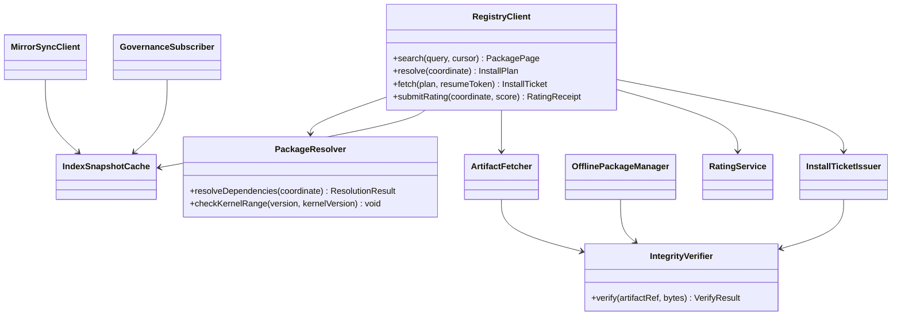
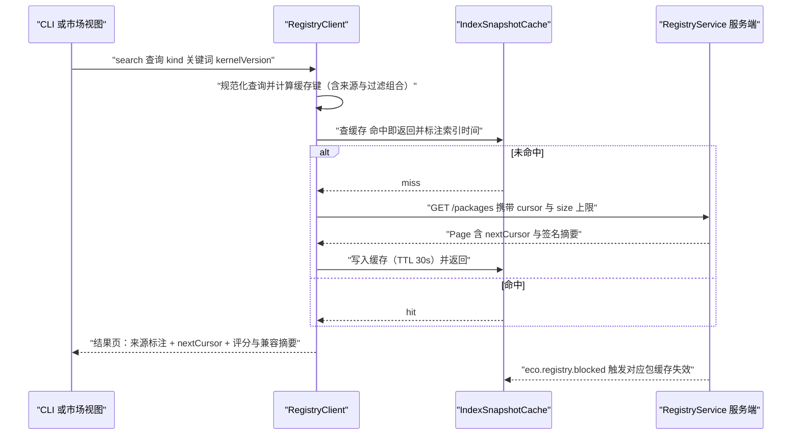
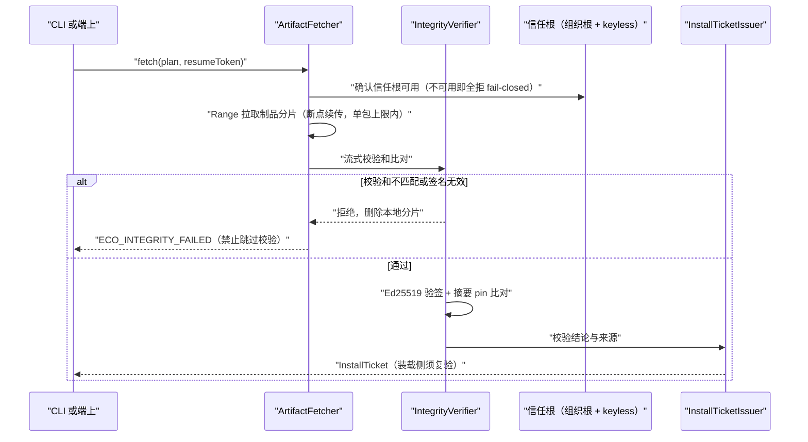
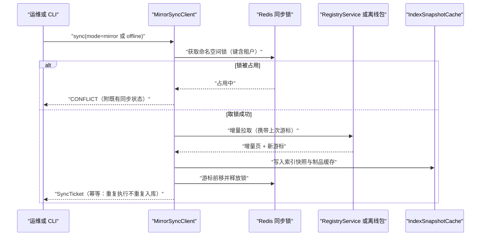
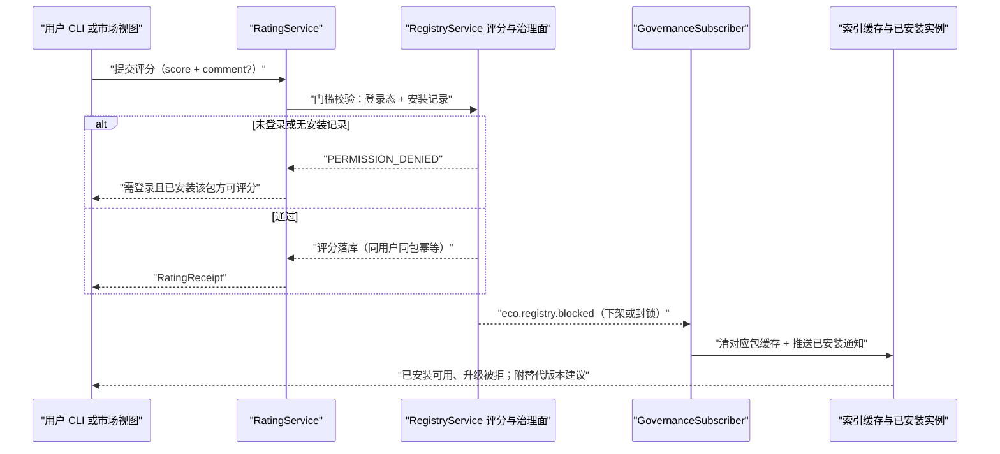
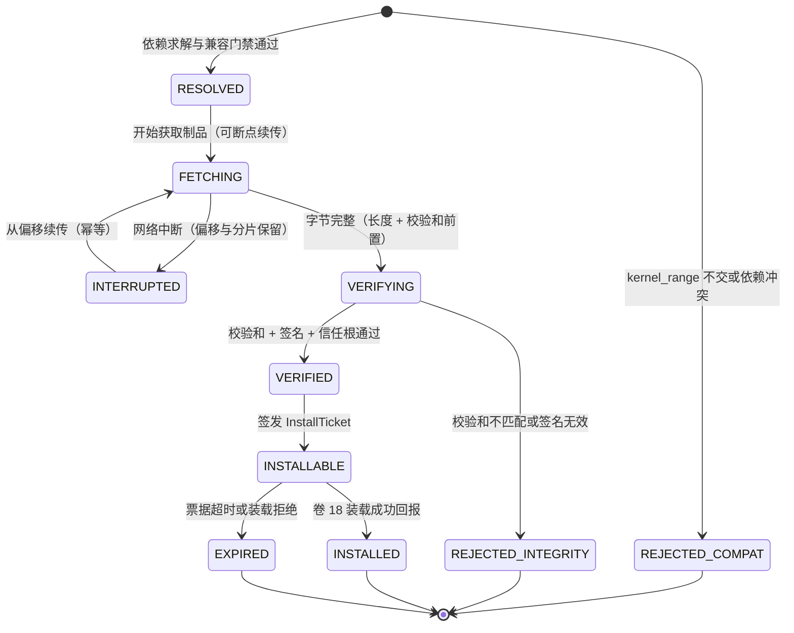
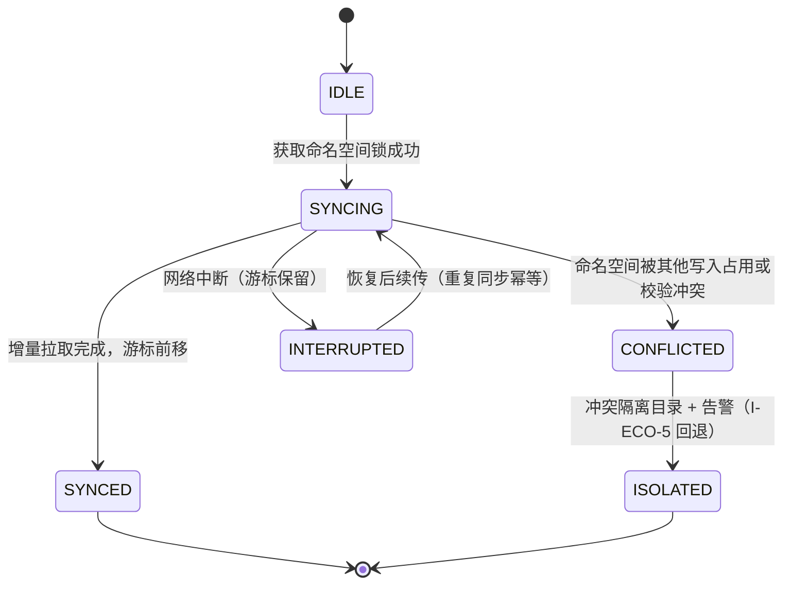

# C32 · RegistryClient（市场 / Registry 客户端：索引检索 + 签名校验 + 离线镜像 + 评分与治理信号）

> 组件编号 C32 ｜ 组件别名 RegistryClient（市场 Registry 客户端）｜ 归属域 企业·生态（域编码 ECO）｜ 清单登记 E-12 消费侧（服务端 RegistryService 同批次配对；离线镜像与 T-13 `RegistryMirrorTool` 配对）
> 上游系统方案：`impl/29-developer-ecosystem-impl.md`（下称 impl/29）§1.1/§1.2 边界、§2 REQ-ECO-04/15…18/31、§3 I-ECO-1…10（本组件主消费 I-ECO-5）、§6.1 时序、§8.1 表族、§8.2 Redis Key、§8.3 对象前缀、§8.5 隔离矩阵、§8.6 吊销、§9.1/§9.3/§9.4/§9.5/§9.6、§10.2/§10.3
> 上游契约：卷 29 D-ECO-7/10；卷 08 I-SKILL-2/I-SKILL-4/I-SKILL-5（`SKILL_SIGNATURE_INVALID`）；卷 18 I-PLG-4/I-PLG-6（`PLUGIN_SIGNATURE_INVALID`、签名四要素）；impl/28 I-DIST-7 与 T-13；附录 B §B.7/§B.8
> 编号口径（本文件局部号段，须并入 `IMPL-DECISIONS.md` 后重编号）：`REQ-C-REG-1…12`、`I-C-REG-1…4`、`X-C32-1…3`（台账当前止于 X-82）
> 实现落点：`harness-contract`（`contract/eco/registry`）+ `harness-kernel/kernel-eco`（纯逻辑：求解 / 校验 / 缓存策略）+ `harness-platform/platform-eco`（`registry/client` 子包）+ `harness-host/host-cli`（`oc registry` 子命令）；**不新增模块**；数据批次 B9 生态与互操作（R07 建议）
> 纪律：本组件方案不推翻系统级方案；凡与 impl/29 或台账口径冲突之处，一律在文末「修订建议」登记，不回改上游文件。

---

## ① 定位与边界

**一句话职责**：把「包」（插件 / 技能 / 团队模板）从公共或私有 Registry 安全取到本地并交给装载器——检索、解析、下载、校验、求解、票据、离线镜像与治理信号消费，全程以「可离线、可审计、fail-closed」为铁律；**只签发安装票据，不做装载**（装载与信任边界归卷 18/08）。

| 面 | 组件内承载 |
| --- | --- |
| 索引检索 | `RegistryIndexQuery`（消费服务端索引）：关键词/标签/兼容过滤 + cursor 分页 + 30s 缓存 |
| 版本解析与依赖求解 | `PackageResolver`：`kernel_range`/`protocol_range` 硬门禁 + 包依赖区间合并 + 拓扑排序 + 冲突诊断 |
| 制品获取 | `ArtifactFetcher`：Range 断点续传 + 私有源覆盖公共源 + 单包大小上限 |
| 完整性校验 | `IntegrityVerifier`：校验和 + Ed25519 签名 + 信任根 + 摘要 pin（服务端与客户端**双端校验**） |
| 安装票据 | `InstallTicketIssuer`：票据交卷 18 `PluginRuntime` / 卷 08 `SkillStore` 装载，本组件不装载 |
| 私仓与离线 | `MirrorSyncClient` + `OfflinePackageManager`：游标增量 + 重复同步幂等 + air-gapped 离线包 |
| 评分与治理 | `RatingService` + `GovernanceSubscriber`：评分门槛（登录 + 安装记录）+ 下架通知与缓存失效 |
**不解决**：装载与隔离（卷 18 `PluginRuntime`，含依赖回卷与逐文件哈希复核）；市场内容治理决策（评审/举报/下架策略归卷 08/18，本组件只消费治理信号并执行通知与缓存失效）；SDK 生成管线（impl/29 §6.1，构建期）；统一搜索投影（P-29，impl/29 §3 D-ECOIMPL-8、§8.1 `oc_search_document`）；分发与更新通道（卷 28）。

| 方向 | 依赖对象 | 交互面 | 失败语义 |
| --- | --- | --- | --- |
| 上游 | RegistryService（E-12 服务端）与公共源 | `/api/v1/eco/registry/*`；`oc_registry_*` 表；`oc-registry/` 对象前缀 | 不可达 → 只读降级（本地索引快照 + 制品缓存），**安装与升级仍强制签名校验与来源对账** |
| 上游 | 信任设施（卷 08/18 共用信任根，公共源 keyless 叠加） | 组织信任根清单 + 双钥并行窗口 + 摘要 pin | 信任根缺失或不可用 → 拒绝安装（fail-closed） |
| 上游 | 配额与成本（卷 26） | 安装 / 同步复用 `QUOTA_EXCEEDED` 判定，不自建计数器 | 判定失败 → 拒绝（不静默放行） |
| 下游 | 卷 18 `PluginRuntime` / 卷 08 `SkillStore` / 卷 34 模板库 | 只交付 `InstallTicket`（制品引用 + 来源 + 校验结论）；装载侧复验（防 TOCTOU） | 装载拒绝 → 票据作废并记录来源对账差异 |
| 下游 | CLI（卷 22 `host-cli`）/ IDE / 桌面 | `oc registry …` 子命令与市场视图（只读呈现） | 端上不可用不影响同步与镜像 |
**模块落点**：契约层 `harness-contract`（`contract/eco/registry`：`PackageCoordinate`、`PackageKind`、`InstallTicket`、`RegistrySourceSPI`，禁止 Spring）；内核层 `harness-kernel/kernel-eco`（`PackageResolver`、`IntegrityVerifier`、`IndexCachePolicy`，纯逻辑零框架）；平台层 `harness-platform/platform-eco`（`RegistryClient`、`ArtifactFetcher`、`MirrorSyncClient`、`OfflinePackageManager`、`GovernanceSubscriber`；`@Transactional(rollbackFor = Exception.class)`、`BusinessException(ErrorCode)`、`@Slf4j`）；外壳层 `harness-host/host-cli` 承载命令面，`host-bootstrap` 以 `@AutoConfiguration` + `@ConditionalOnMissingBean` 装配（企业私仓模式只切换 `RegistryBackendSPI` 实现，不改调用方）。

---

## ② 功能需求清单（REQ-C-REG-n）

| REQ | 需求描述 | 来源 | 优先级 | 验收要点 |
| --- | --- | --- | --- | --- |
| REQ-C-REG-1 | 索引检索：元数据索引（名称/标签/版本/签名/评分/安装量/兼容矩阵）+ 关键词/标签/兼容性过滤 + cursor 分页 | impl/29 REQ-ECO-15、§9.1；卷 29 §4.5；Codex cursor 分页 `[E1]` | P0 | 过滤组合矩阵用例；分页无重复无遗漏（含并发写入边界） |
| REQ-C-REG-2 | 下载与完整性：制品 + 签名 + 校验和；**校验和不匹配一律拒绝**；断点续传；私有镜像地址可覆盖公共源 | impl/29 REQ-ECO-16、§10.3；卷 29 §4.5/§7 | P0 | 从 50% 偏移恢复且字节一致；篡改一字节即拒绝 |
| REQ-C-REG-3 | 客户端签名与信任根**双端校验**：Ed25519 + 组织信任根 + 摘要 pin；公共源叠加 keyless（兼容读入）；双钥并行轮换窗口 | I-SKILL-4 / I-PLG-6；impl/08 §4.2、impl/18 §4.2 | P0 | 改载荷/改签名/换密钥三类篡改全部拒绝；轮换窗口内无感 |
| REQ-C-REG-4 | 依赖求解与兼容门禁：`kernel_range`/`protocol_range` 硬门禁 + 包依赖区间合并 + 拓扑排序 + 显式冲突诊断（约束来源链），冲突拒绝并给建议 | I-SKILL-2 / I-PLG-4（算法族复用）；impl/29 §9.5 | P0 | 同锁文件同顺序（确定性）；冲突输出「谁要求了哪个区间」 |
| REQ-C-REG-5 | 私仓与双向同步：自建优先；公共 → 私仓同步**游标可恢复、重复同步幂等**；可禁用公共源；命名空间绑定租户 | impl/29 REQ-ECO-18、I-ECO-5、§8.5 | P0 | 同步中断后续传不重复不遗漏；跨租户命名空间被拒 |
| REQ-C-REG-6 | 离线镜像包：制品 tarball + 索引快照 + 校验和清单；**无外网环境可安装**（air-gapped） | impl/29 REQ-ECO-18、§8.3；T-13 配对 | P0 | 断网安装成功；离线包导入校验清单逐项比对 |
| REQ-C-REG-7 | 评分与治理信号：评分需登录 + 安装记录（防刷）；下架 + 已安装通知；**下架 ≠ 断供**（已安装可用、升级被拒） | impl/29 REQ-ECO-17、§8.6、§9.6 | P1 | 无安装记录评分被拒；下架后缓存立即失效且升级被拒 |
| REQ-C-REG-8 | 安装票据语义：Registry 只发票据（含制品引用与校验结论），装载走卷 18 并做装载侧复验 | impl/29 §1.2、§9.1 | P0 | 票据不含明文凭证；装载侧复验缺失即缺陷 |
| REQ-C-REG-9 | 兼容矩阵与弃用：包语义化版本 + `kernel_range` 兼容门禁；已弃用包可安装但给迁移提示；兼容结论可查询 | impl/29 REQ-ECO-04、§9.6 | P1 | 不兼容返回区间与升级建议；弃用提示含替代版本 |
| REQ-C-REG-10 | 缓存与故障降级：索引 30s 缓存 + 事件驱动失效（`eco.registry.blocked`）；Registry 不可达 → 本地缓存/离线镜像**只读**降级 | impl/29 §10.2、§10.3；I-ECO-5 回退 | P0 | 降级期安装仍强制校验；恢复后同步幂等续传 |
| REQ-C-REG-11 | 多租户隔离：私仓命名空间绑定租户（同步锁与安装双重校验）；租户上下文缺失抛 `TENANT_CONTEXT_MISSING`；公共 Registry 为显式全局共享域（无租户数据） | impl/29 §8.5、§8.3 | P0 | A 租户镜像安装到 B → 拒绝 + 告警；公共制品发布前过敏感扫描 |
| REQ-C-REG-12 | 可观测：`oc_registry_sync_lag_seconds`、`oc_registry_mirror_sync_conflicts_total`、`oc_eco_cross_tenant_denied_total{surface}`；事件 `eco.registry.sync.completed` / `eco.registry.blocked` 全链打点 | impl/29 §8.4、§10.5、§10.6 | P1 | 指标名与 impl/29 一致；同步与校验耗时逐条打点 |
本表是 impl/29 §2 的组件级细化视图（`REQ-ECO-n → REQ-C-REG-n` 多对多），不新增系统级语义；与 impl/29 冲突时以后者为准并登记修订建议。

---

## ③ 关键设计决策（I-C-REG-n）

| ID | 维度 | 选定分支 | 理由与代价 | 回退触发 |
| --- | --- | --- | --- | --- |
| I-C-REG-1 | 客户端分层与「可离线」边界 | **薄服务端 + 本地可校验可求解**：索引/制品来自服务端，但完整性校验、依赖求解、离线快照全部落客户端本地能力（`kernel-eco` 纯逻辑） | 企业 air-gapped 与私仓场景不依赖云端；代价是客户端需维护信任根与求解器（与 I-SKILL-2/I-PLG-4 共用算法族） | 求解器维护成本失控 → 仅保留 `kernel_range` 硬门禁，包依赖交装载侧（卷 18）求解并登记 |
| I-C-REG-2 | 校验位置与信任根分级 | **双端校验**：服务端校验 + 客户端本地验签（组织信任根为基线，公共源 keyless 叠加读入）；公钥轮换用双钥并行窗口 | 供应链攻击面收敛在客户端；代价是信任根运维（轮换/吊销） | 误拒率 > 1% → 时钟容差 ±120s 并记拒绝原因（对齐 I-ECO-3 口径）；组织要求免自管 → 全量 keyless 并保留根兼容 |
| I-C-REG-3 | 依赖求解承载 | **获取前预求解 + 装载前复验**：`resolve` 冻结安装计划（含依赖闭包与冲突诊断），装载侧复验一次（防 TOCTOU）；算法族复用 I-SKILL-2/I-PLG-4，**不自造第四实现** | 冲突在下载前暴露，节省带宽与时间；代价是计划与锁文件需版本化 | 依赖图 > 200 节点或季度冲突工单 > 20 → 切换 PubGrub 类求解器（锁文件格式不变，同 I-SKILL-2 回退） |
| I-C-REG-4 | 缓存与离线降级边界 | **缓存/离线镜像仅用于已有包与已对账索引**；索引 30s 缓存 + 事件失效；Registry 不可达 → 只读降级，**安装与升级仍强制签名与来源对账（fail-closed）** | 避免「降级 = 放行」的供应链漏洞；代价是降级期新包不可安装（明确提示） | 同步冲突率 > 5% → 命名空间锁 + 冲突隔离目录（I-ECO-5 回退）；冲突持续 → 冻结自动同步转人工对账 |

---

## ④ 类图


**装配纪律**：契约与 SPI 在 `harness-contract`（零框架）；`PackageResolver` / `IntegrityVerifier` / `IndexCachePolicy` 在 `kernel-eco`（可无容器单测）；其余为 `platform-eco` 外壳 Bean。`PackageKind`（`PLUGIN` / `SKILL` / `TEAM_TEMPLATE`）、来源（`PUBLIC` / `MIRROR` / `OFFLINE`）全部 `code + desc + of(String code)`；阈值进 `EcoProperties`（§7.4），代码内不得出现字面量。
```java
package com.hk.opencoding.contract.eco.registry;

/**
 * 市场 Registry 消费入口：检索、解析、获取与安装票据签发。
 * 不变量：安装与升级路径必须过完整性校验（校验和 + 签名 + 信任根），校验不通过一律拒绝；
 * 公共 Registry 为显式全局共享域，私仓命名空间绑定租户（租户上下文缺失即拒绝）。
 */
public interface RegistryClient {

    /**
     * 解析并冻结一次安装计划（依赖求解 + 兼容门禁 + 完整性预检）。
     *
     * @param coordinate 目标坐标（必填：kind、namespace、name、version 或 versionRange）
     * @return 安装计划（依赖闭包、冲突诊断、制品清单与校验要求）
     * @throws BusinessException 版本与内核不兼容（ECO_VERSION_INCOMPATIBLE）、依赖冲突
     *                          （按 kind 映射 SKILL_DEPENDENCY_CONFLICT / PLUGIN_VERSION_CONFLICT）
     */
    InstallPlan resolve(PackageCoordinate coordinate);

    /**
     * 获取制品并签发安装票据（装载由卷 18 承担，本组件不装载）。
     *
     * @param plan        已冻结的安装计划（必填；复用 resolve 结果，防 TOCTOU）
     * @param resumeToken 断点续传令牌（可空；从已完成字节偏移继续）
     * @return 安装票据（含制品引用、来源、校验结论与装载侧复核要求）
     * @throws BusinessException 完整性校验失败（ECO_INTEGRITY_FAILED）、制品缺失（NOT_FOUND）、
     *                          配额不足（QUOTA_EXCEEDED）、来源不可达（DEPENDENCY_UNAVAILABLE，可重试）
     */
    InstallTicket fetch(InstallPlan plan, String resumeToken);
}
```

---

## ⑤ 核心流程时序图

### 5.1 索引检索与增量刷新（cursor 分页 + 缓存 + 事件失效）
**前置条件**：私仓来源已绑定租户；公共源未被禁用。**主路径**：查询规范化 → 缓存查（键含 kind/关键词/kernelVersion/来源）→ 未命中走服务端 cursor 分页 → 结果标注来源（public/mirror/offline）与缓存 → 返回 `nextCursor`。
**异常与补偿**：Registry 不可达 → 本地索引快照只读返回 + 「索引滞后」标记；`eco.registry.blocked` 到达 → 对应包缓存立即失效。**幂等与并发点**：检索只读可重入；同键并发查询合并（single-flight）；分页游标由服务端权威签发，客户端不本地推算。

### 5.2 获取与完整性校验（断点续传 + 校验和/签名双拒绝路径）
**前置条件**：`resolve` 已冻结安装计划（含期望校验和与签名要求）；信任根可用。**主路径**：Range 拉取（断点续传）→ 流式校验和比对 → Ed25519 验签（组织信任根，公共源叠加 keyless）→ 通过后签发 `InstallTicket`。
**异常与补偿**：校验和不匹配或验签失败 → `ECO_INTEGRITY_FAILED` 拒绝并删除本地落盘分片（**禁止跳过校验**）；网络中断 → 保留偏移与分片，重试从偏移继续；信任根不可用 → 全拒（fail-closed）。**幂等与并发点**：同 `(namespace,name,version)` 并发下载去重（同一临时文件互斥）；票据签发幂等（重复 `fetch` 返回既有票据）。

### 5.3 私仓同步与离线镜像（游标恢复 + 幂等 + air-gapped 安装）
**前置条件**：私仓命名空间归属当前租户；同步锁键 `RedisKeys.registrySyncLock(tenantId, namespace)` 可获取。**主路径**：取锁 → 增量拉取（游标）→ 索引写入 + 制品归档 → 游标前移 → 释放锁；离线包导入 = 校验清单逐项比对后落本地镜像目录。
**异常与补偿**：网络中断 → 游标保留，恢复后续传（幂等，重复同步不产生重复对象）；锁冲突 → `CONFLICT`（带既有同步状态）；校验清单不符 → 整包拒绝（不部分导入）。**幂等与并发点**：同步以 `(namespace, cursor)` 递增为幂等键；离线导入以「包指纹 + 清单哈希」为幂等键。

### 5.4 评分与治理信号闭环（评分门槛 + 下架通知 + 缓存失效）
**前置条件**：用户已登录且存在该包安装记录（`oc_registry_install`）；已安装实例可接收治理通知。**主路径**：评分提交（分数 + 可选评论）→ 门槛校验（登录 + 安装记录）→ 幂等写入 → 回执；下架 → `eco.registry.blocked` → 清缓存 + 通知已安装实例（**可用但升级被拒**）。
**异常与补偿**：无安装记录或未登录 → 403（防刷）；重复评分 → 409 返回既有；通知投递失败 → 重试，不可达则降级为应用内通知，**不阻塞下架生效**。**幂等与并发点**：评分以 `(userId, packageId, version)` 幂等；缓存失效为广播，重复失效无副作用。

---

## ⑥ 状态机

### 6.1 包获取态（单次安装的客户端状态）

**不变式**：① 未经 `VERIFIED` 不得进入 `INSTALLABLE`（校验是唯一入口，不存在旁路）；② `REJECTED_*` 为终态且必须删除本地分片（不留可执行残留）；③ 票据一次性（`EXPIRED` 后需重新 `resolve`）；④ 下架包（yanked）允许 `INSTALLED` 保持可用，但新 `resolve` 返回升级被拒语义。
### 6.2 私仓同步态（游标与冲突隔离）

**语义**：同步永不覆盖本地已安装实例（只更新镜像与索引快照）；冲突隔离目录中的对象**不参与安装**，须人工对账后合并；游标滞后 > 2 周期触发 `oc_registry_sync_lag_seconds` 告警（RB-ECO-02）。

---

## ⑦ 接口与依赖矩阵

### 7.1 消费的管理面端点（附录 B.3，`/api/v1`，全部要求认证与权限点）

| 方法与路径 | 入参 | 出参 | 错误码 |
| --- | --- | --- | --- |
| `GET /api/v1/eco/registry/packages` | `q`、`kind`、`kernelVersion`、`cursor`、`size≤50` | `Page<PackageSummary>`（含 `nextCursor`） | `INVALID_ARGUMENT`(400)、`PERMISSION_DENIED`(403) |
| `GET /api/v1/eco/registry/packages/{id}/versions/{v}` | — | `PackageDetail`（含签名与校验和） | `NOT_FOUND`(404)、`CONFLICT`(409 已下架且策略为拒升级) |
| `POST /api/v1/eco/registry/install` | `packageId`、`version`、`target` | `InstallTicket`（仅票据，装载走卷 18） | `ECO_VERSION_INCOMPATIBLE`(409)、`QUOTA_EXCEEDED`(402) |
| `POST /api/v1/eco/registry/sync` | `namespace`、`mode(mirror/offline)` | `SyncTicket` | `CONFLICT`(409 并发同步冲突) |
| `POST /api/v1/eco/registry/packages/{id}/versions/{v}/rating` | `score`、`comment?`；需登录 + 安装记录 | `RatingReceipt` | `PERMISSION_DENIED`(403 未登录或无安装记录)、`CONFLICT`(409 重复)（**端点待补登，X-C32-2**） |
| `POST /api/v1/eco/registry/offline/import` | `packageFile`、`indexSnapshot`、`checksumManifest` | `ImportReceipt`（离线包登记） | `ECO_INTEGRITY_FAILED`(422)、`CONFLICT`(409 命名空间归属不符)（**端点待补登，X-C32-2**） |
| `GET /api/v1/eco/registry/mirror/status` | `namespace` | 游标、滞后、冲突数与最近同步时间 | `NOT_FOUND`(404)（**端点待补登，X-C32-2**） |
### 7.2 客户端面（`host-cli` 扩展子命令，须在 22-impl §⑦ 命令表同步登记）

| 命令 | 入参 | 出参 | 退出码 / 错误 |
| --- | --- | --- | --- |
| `oc registry search <query>` | `--kind`、`--kernel-version`、`--cursor`、`--json` | `CliResult`（JSON 页） | 复用 22-impl `ExitCode`：0 成功 / 2 失败 + 细分码 |
| `oc registry info <coord>` | `--json` | 详情（签名、校验和、兼容矩阵、弃用状态） | `NOT_FOUND` |
| `oc registry install <coord>` | `--target`、`--dry-run` | 票据 + 装载委托 | `ECO_VERSION_INCOMPATIBLE` / `ECO_INTEGRITY_FAILED` |
| `oc registry rating <coord> --score` | `--comment` | `RatingReceipt` | 403（未登录/无安装记录）、409（重复） |
| `oc registry mirror sync <namespace>` / `oc registry offline import <file>` | `--mode`、`--dry-run` | `SyncTicket` / `ImportReceipt` | `CONFLICT` / `ECO_INTEGRITY_FAILED` |
| `oc doctor --deep --layers=eco` | — | Registry 可达 + 签名链 + 游标新鲜度结论 | 探针 `DOWN` 标记（不为命令失败） |
### 7.3 SPI、依赖矩阵与配置项

| SPI（卷 18 扩展点目录） | 说明 | 装配约束 |
| --- | --- | --- |
| `RegistryBackendSPI` | 后端来源（公共源/私仓镜像/离线目录） | 读接口幂等；写接口必须带游标（impl/29 §9.3） |
| `RegistrySourceSPI`（本组件契约） | 索引增量 `pull(namespace, cursor)` + 制品流 `open(artifactRef, offset)` | 三种来源共用同一消费契约；私仓命名空间绑租户 |
| `IntegrityVerifierSPI` | 验签实现（组织信任根 / keyless 叠加） | 拒绝必须 fail-closed；校验结论进票据 |
| 关系 | 组件 / 端口 | 契约要点 | 失效影响 |
| --- | --- | --- | --- |
| 依赖 | RegistryService（E-12）/ 公共源 | 索引与制品；`oc-registry/` 公共制品发布前过敏感扫描 | 不可达 → 只读降级（缓存与离线镜像），新包安装明确失败 |
| 依赖 | 信任根与密钥服务（卷 27/30） | 组织信任根 PEM、公钥轮换窗口、keyless 读入 | 不可用 → 安装全拒（fail-closed） |
| 依赖 | 配额与成本（卷 26） | 安装/同步复用 `QUOTA_EXCEEDED` 判定 | 判定失败 → 拒绝 |
| 被依赖 | 卷 18 `PluginRuntime` / 卷 08 `SkillStore` / 卷 34 模板库 | `InstallTicket` 与校验结论（装载侧复验） | 票据过期或装载拒绝 → 重新 `resolve` |
配置项（`open-coding.eco.*` → `EcoProperties`，纯数据类不加 `@Component`）：`registry-mirror-enabled`（默认 false）、`public-registry-url`（默认官方地址，可置空禁用）、`registry-sync-batch-size`（200）、`registry-cache-ttl-seconds`（30，**新增待登记**）、`registry-artifact-max-bytes`（52428800 = 50MB，**新增待登记**）、`registry-trust-root`（组织信任根 PEM/路径，**必填 Fail-Fast，新增待登记**，见 X-C32-1）、`feedback-retention-days`（180，离线包元数据保留复用）。全部键以 `${ENV_VAR:default}` 声明并同步 `.env.example`。

---

## ⑧ 关键算法

### 8.1 索引获取与增量（cursor 分页 + 缓存失效）
**算法**：查询规范化（kind、关键词、kernelVersion、来源）→ 缓存键 = `hash(规范化查询 + 租户 + 来源)` → 命中直接返回；未命中按服务端 `nextCursor` 逐页拉取，客户端**不本地推算游标**（服务端权威，保证无重复无遗漏）；结果页标注来源与索引时间。**缓存**：TTL 30s（公共源全局白名单键；私仓键含租户段，二次校验值的 `tenantId`）；失效由 `eco.registry.blocked`（下架/封锁）与同步完成事件驱动。**边界**：`size` 上限 `searchMaxPageSize` 同源配置；索引截断时返回滞后标记而非静默丢页。
```java
// 缓存键必须含权限指纹（租户 + 来源 + 过滤组合）：跨权限命中属越权泄漏
String cacheKey = RedisKeys.registryIndexCache(tenantId, queryFingerprint(query));
String cached = indexCache.get(cacheKey);
if (!StringUtils.hasText(cached)) {
    PackagePage page = registrySource.pull(query.namespace(), query.cursor()).toPage();
    // 读路径二次校验：命中值租户与上下文不一致即丢弃并告警（防历史遗留键泄漏）
    indexCache.put(cacheKey, serialize(page), properties.registryCacheTtl());
}
log.info("Registry 索引检索，kind={}, 关键词={}, 缓存命中={}", query.kind().getCode(), query.keyword(), cached != null);
```
### 8.2 签名与信任根（篡改检测链）
**校验链（顺序不可跳过）**：① 长度与校验和预检（字节级，失败即断流）；② **Ed25519 验签**——签名载荷 = 清单内容摘要，验证钥来自组织信任根集（含轮换窗口内旧钥）；③ **摘要 pin** 比对（同名包历史摘要变化需显式白名单，防「同名换马甲」）；④ 公共源 keyless 通道叠加（OIDC 身份 + 透明日志引用），组织信任根仍为基线；⑤ 装载侧复验一次（防 TOCTOU：票据 → 装载之间制品不得被替换）。任一环失败 → `ECO_INTEGRITY_FAILED`，**禁止「信任本机」类开关**。
```java
/**
 * 校验制品：校验和 → 签名 → 信任根 → 摘要 pin，任一失败即拒绝（fail-closed）。
 *
 * @param artifactRef 制品引用（必填：含期望校验和与签名）
 * @param bytes       流式内容句柄（必填，非空；按块消费，不整包驻留内存）
 * @return 校验结论（含用钥标识与摘要，写入安装票据）
 * @throws BusinessException 校验和不匹配、签名无效或信任根不匹配时抛出 ECO_INTEGRITY_FAILED
 */
public VerifyResult verify(ArtifactRef artifactRef, InputStream bytes) {
    // 1. 流式哈希：不整包驻留内存，100MB 级制品可校验
    String digest = Hashing.sha256Hex(bytes);
    if (!digest.equals(artifactRef.expectedDigest())) {
        throw new BusinessException(ErrorCode.ECO_INTEGRITY_FAILED, "制品校验和不匹配，已拒绝");
    }
    // 2. 验签与信任根：信任根集含轮换窗口旧钥；keyless 通道仅对公共源生效
    TrustRoot root = trustRootResolver.resolve(artifactRef.kind());
    if (!signatureVerifier.verify(digest, artifactRef.signature(), root)) {
        log.warn("Registry 制品签名校验失败，namespace={}, name={}", artifactRef.namespace(), artifactRef.name());
        throw new BusinessException(ErrorCode.ECO_INTEGRITY_FAILED, "制品签名无效或信任根不匹配，已拒绝");
    }
    return new VerifyResult(digest, root.keyId());
}
```
### 8.3 依赖求解与缓存
**区间合并 + 拓扑**：对 `dependencies[]` 做区间交集（同包多约束取交集，空集即冲突）→ 拓扑排序（环即硬冲突）→ 输出确定性锁文件（同输入同顺序）；冲突输出**约束来源链**（谁要求了哪个区间）与建议（升级/降级/换来源），**不做完整回溯**（多主版本并存直接拒绝，同 I-SKILL-2/I-PLG-4）。**兼容门禁**：`kernel_range`/`protocol_range` 与当前内核/协议区间取交，空集 → `ECO_VERSION_INCOMPATIBLE`（附区间与升级建议）。**缓存**：解析结果按 `(kind, namespace, name, versionRange, kernelVersion)` 缓存；锁文件复用卷 08/18 同一格式（复用而非新造）。**边界**：依赖图 > 200 节点或季度冲突工单 > 20 → 切 PubGrub 类求解器（锁文件格式不变）。

---

## ⑨ 错误处理与降级

| 场景 | ErrorCode | retryable | 对外文案要点 | 恢复动作 |
| --- | --- | --- | --- | --- |
| 版本与内核不兼容 | `ECO_VERSION_INCOMPATIBLE` | 否 | 「该包与当前内核版本不兼容；支持区间 `<range>`」 | 升级内核或改用兼容版本（附建议） |
| 依赖区间交集为空 / 多主版本 / 硬环 | `SKILL_DEPENDENCY_CONFLICT`（kind=SKILL）/ `PLUGIN_VERSION_CONFLICT`（kind=PLUGIN） | 否 | 「依赖冲突：`<约束来源链>`」 | 拒绝安装并输出约束来源链与建议 |
| 校验和不匹配 / 签名无效 / 信任根不匹配 | `ECO_INTEGRITY_FAILED` | 否 | 「制品完整性校验失败，已拒绝」（**不暴露具体差异细节**） | 删除本地分片；从受信来源重新获取；审计记录用钥与摘要 |
| 制品或版本不存在 / 已下架（拒绝升级） | `NOT_FOUND` / `CONFLICT` | 否 | 「未找到该版本」/「该版本已下架，升级被拒；已安装实例仍可用」 | 查询兼容替代版本；已安装实例不卸载 |
| 并发同步冲突 | `CONFLICT` | 是（稍后重试） | 「该命名空间正在同步中」 | 锁串行化；游标保留，重试续传 |
| 评分重复或无安装记录 | `CONFLICT` / `PERMISSION_DENIED` | 否 | 「该评分已提交」/「需登录且已安装该包方可评分」 | 返回既有评分；提示安装记录要求 |
| 配额不足（安装/同步） | `QUOTA_EXCEEDED` | 否（可申请） | 「配额不足，无法执行」 | 复用 26 配额判定与申请流程 |
| 公共源 / 私仓不可达 | `DEPENDENCY_UNAVAILABLE` | 是（带退避） | 「Registry 暂不可达，已切换只读缓存」 | 只读降级；连续失败 ≥ 3 次告警（RB-ECO-01）；恢复后同步续传 |
| 租户上下文缺失 / 跨租户命名空间 | `TENANT_CONTEXT_MISSING` / `CROSS_TENANT_DENIED` | 否 | 「缺少租户上下文，已拒绝」/「无权访问该命名空间」 | fail-closed；跨租户记 SEV2 与 `oc_eco_cross_tenant_denied_total` |
| 离线快照过期 / 清单不符 | `ECO_INTEGRITY_FAILED`（清单不符）；快照过期**不报错** | 否 | 「离线包校验清单不符，已整包拒绝」/「索引快照已滞后 `<N>` 天」 | 重新获取离线包；快照过期在结果页显式标注（不静默给旧数据） |
**降级矩阵（impl/29 §10.3 的组件内视图）**：① Registry 不可达 / 私仓同步中断 → 本地已安装缓存 + 最近索引快照**只读**（已有包可查看与装载，升级与新装明确失败）；② 公钥轮换 → 双钥并行校验窗口（旧钥接受到期），审计记录用钥；③ 签名校验失败 → **不做任何降级**（拒绝 + 告警 + 供应链事件）；④ IM/深链类相邻面故障不影响本组件（本组件无此类依赖）。**硬规则**：校验失败、信任根缺失、跨租户三类一律拒绝，禁止以「离线可用」为由绕过校验。

---

## ⑩ 性能与并发

| 指标 | 预算 | 说明 |
| --- | --- | --- |
| 索引检索（缓存命中） | ≤ 150ms P95 | impl/29 §9.6；缓存 TTL 30s，事件驱动失效 |
| 制品下载 | 单包 ≤ 50MB（超限拒绝发布/下载）；断点续传从任意偏移恢复 | Range 拉取；偏移 + 校验和二元组保证可恢复 |
| 完整性校验 | 单包（≤ 50MB）≤ 300ms；流式哈希不整包驻留内存 | 校验与下载重叠（边下边校验） |
| 私仓同步 | 批大小 200（背压）；游标滞后 > 2 周期告警 | `registry-sync-batch-size`；`oc_registry_sync_lag_seconds` |
| 缓存 TTL | 索引 30s；下架/封锁事件即时失效 | 失效事件 `eco.registry.blocked` 清对应包缓存 |
**外部调用超时预算与重试**：每次 Registry 调用独立超时（超时即断开并保留游标/偏移）；**仅 `retryable` 错误重试**（指数退避 + 上限，4xx 直接失败告警）；连续失败 ≥ 3 次打开「只读降级」（记事件 + 告警 RB-ECO-01），恢复由探针或下次成功调用触发；校验失败**永不重试**（重试不改结果，且需人工作判断）。**并发**：同步互斥走 `RedisKeys.registrySyncLock(tenantId, namespace)`（Redisson 租约 60s 自动续期）；同包并发安装以 `(namespace,name,version)` 幂等键去重（同一临时文件互斥）；离线导入以包指纹 + 清单哈希幂等；跨租户校验在同步与安装**双重执行**（fail-closed）。

---

## ⑪ 测试要点

**单元（纯逻辑，无 IO）**：cursor 分页无重复无遗漏（含并发写入边界与截断页）；过滤组合矩阵（kind × 标签 × kernelVersion × 来源）；区间合并/拓扑/环检测/冲突诊断（约束来源链可读）；`PackageKind.of` 与来源枚举非法值抛业务异常；缓存键权限指纹（含租户段，缺段即测试失败）。
**安全与篡改（DoD 硬项）**：**签名篡改用例**——① 改制品一字节（校验和不匹配）；② 改签名（验签失败）；③ 换公钥/信任根不匹配（拒绝）；④ 同名包换摘要（摘要 pin 拒绝，除非显式白名单）；⑤ 公共源 keyless 通道伪造 OIDC 身份（拒绝）；⑥ 票据 → 装载之间替换制品（装载侧复验拒绝）。任一「通过」即判定供应链缺陷并阻断发布。
**集成（Testcontainers：PG + Redis；私仓 + 离线目录夹具）**：私仓同步中断恢复与重复同步幂等（游标不重复不遗漏）；离线包 air-gapped 安装（无外网命名空间）；断点续传从 50% 恢复且字节一致；下架后已安装实例仍可用但升级被拒、缓存立即失效；评分门槛（无安装记录 403、重复 409）；兼容门禁（`kernel_range` 不交返回区间与建议）。
**跨租户泄漏（DoD 硬项）**：A 租户私仓命名空间镜像安装到 B 租户 → 拒绝 + 告警；缺租户段缓存键读取 → 二次校验拒绝；公共制品夹带租户标识/路径/凭证 → 发布前敏感扫描拦截。
**故障注入**：Registry 5xx 风暴（只读降级且安装仍强制校验）；公钥轮换窗口（双钥并行无感，审计记用钥）；信任根文件缺失（启动 Fail-Fast + 探针 `DOWN`）；缓存条目被篡改（读路径二次校验拒绝并丢弃）；同步锁被孤儿持有（租约到期自动接管）。
```bash
# 生态服务侧（Registry 客户端 + 私仓 + 离线镜像；Testcontainers 需本地 Docker）
mvn -pl harness-platform/platform-eco -am test
mvn -pl harness-platform/platform-eco test -Dtest='RegistryIntegrity*Test,RegistryOfflineMirror*Test'
scripts/ci/tenant-isolation-scan.sh --surface eco       # 隔离矩阵逐行对抗，任一组通过即失败
oc doctor --deep --format json --layers eco             # Registry 可达 + 签名链 + 游标新鲜度
```
**DoD（impl/29 §11.3 的组件内切片）**：索引检索含过滤组合与 cursor 分页 ｜ 完整性校验四拒绝路径 + 篡改六用例全拒 ｜ 私仓同步可恢复且幂等、离线包断网可装 ｜ 兼容矩阵与弃用提示可用 ｜ 评分门槛生效、下架语义为「不断供、拒升级」 ｜ 跨租户矩阵逐行失败 ｜ 信任根缺失启动 Fail-Fast ｜ 新配置键全部入 `EcoProperties` 并同步 `.env.example`。

---

## 修订建议（本组件登记，编号待并入 `IMPL-DECISIONS.md` §4）

| 编号（待并号） | 冲突 / 缺口 | 证据 | 建议修订 |
| --- | --- | --- | --- |
| `X-C32-1` | **完整性错误码与信任根配置键缺登记**：校验和/签名/信任根失败在 impl/29 §9.5 错误矩阵中无对应码（各装载域码 `SKILL_SIGNATURE_INVALID`/`PLUGIN_SIGNATURE_INVALID` 属装载侧口径）；`open-coding.eco.registry-trust-root`、`registry-cache-ttl-seconds`、`registry-artifact-max-bytes` 三个键未在 §9.4 配置表与 `.env.example` 清单 | impl/29 §9.4/§9.5；卷 18 I-PLG-6；附录 B「只增码、不改义」 | 附录 B 错误码表增补 `ECO_INTEGRITY_FAILED`（含 `kind` 字段；装载侧仍按 kind 映射各域码）；§9.4 增 `registry-trust-root`（必填 Fail-Fast，环境变量 `ECO_REGISTRY_TRUST_ROOT`）与 `registry-cache-ttl-seconds`（默认 30）、`registry-artifact-max-bytes`（默认 52428800）并同步 `.env.example` |
| `X-C32-2` | **评分与离线包两个执行面缺端点与命令登记**：REQ-ECO-17/18 要求评分门槛与离线包安装，但 §9.1 无评分提交与离线导入端点（§8.1 有 `oc_registry_install` 表但无对应 API）；`oc registry` 子命令族未在 22-impl §⑦ 命令表出现 | impl/29 §9.1、§8.1；REQ-ECO-17/18；卷 22 §4.4 | ① §9.1 增三条端点：评分提交、离线包导入、镜像状态查询（权限点分别为 `package.rate` / `registry.mirror` / `registry.read`）；② 22-impl §⑦ 命令表增 `oc registry search/info/install/rating/mirror sync/offline import` 六条（退出码复用 `ExitCode`） |
| `X-C32-3` | **包依赖声明字段与锁文件口径缺载体**：`oc_registry_version` 仅有 `kernel_range`/`protocol_range`，未定义包 → 包依赖声明列（`dependencies jsonb`）与求解产物的锁文件落点，I-SKILL-2/I-PLG-4 的求解器在获取前无法执行 | impl/29 §8.1；卷 08 I-SKILL-2、卷 18 I-PLG-4 | `oc_registry_version` 增 `dependencies jsonb`（含 Schema 版本号）与 `lockfile_digest`；明确锁文件复用卷 08/18 同一格式、`resolve` 与装载侧复验共用同一求解输出（禁止第二套格式） |
