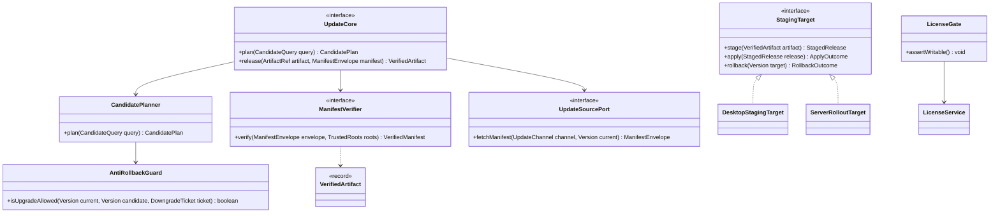
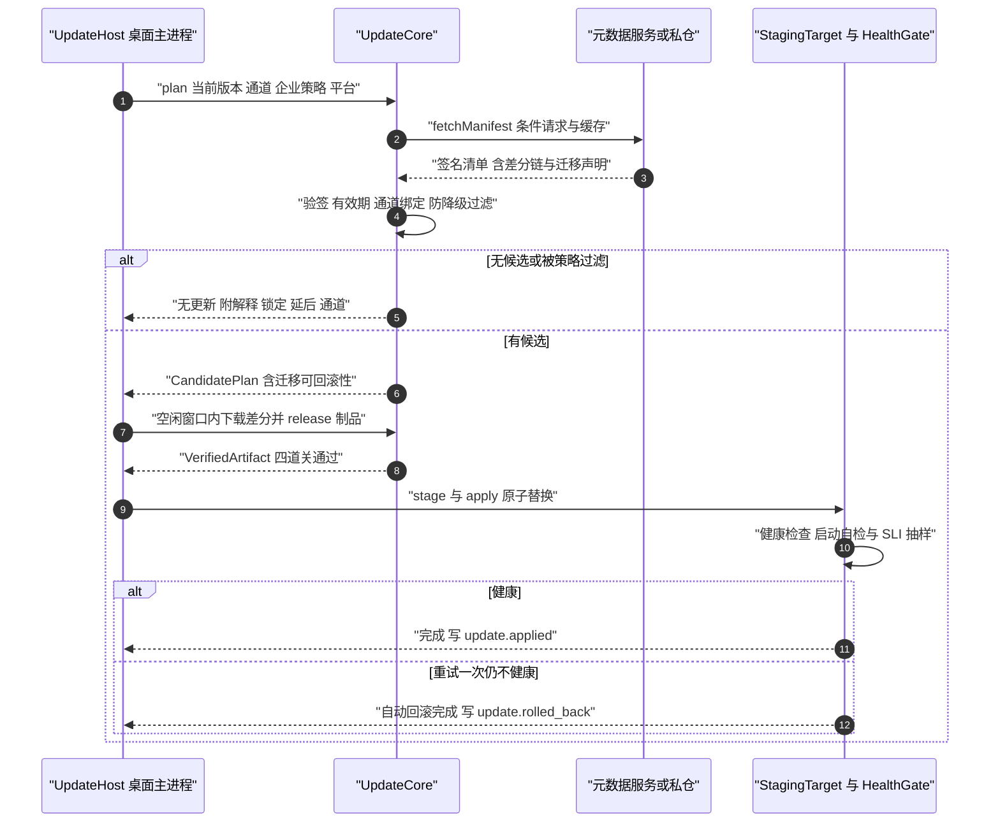
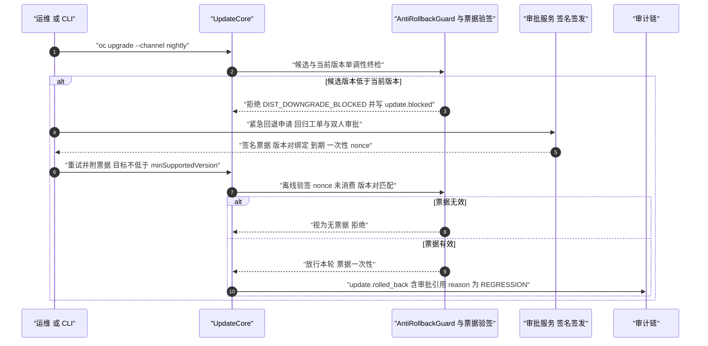
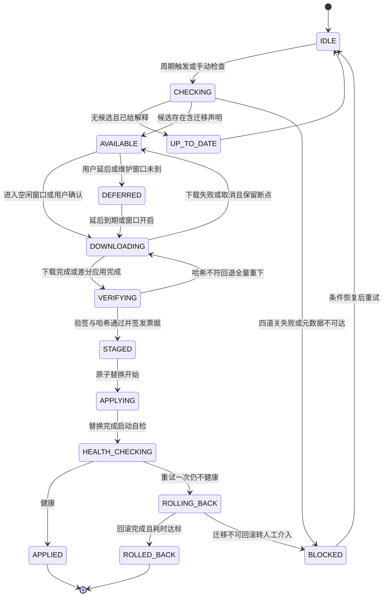

# C33 · UpdateManager（分发与更新器：三通道 / 签名 / 防降级 / 灰度回滚 / 许可）组件级实现方案

> 组件编号 **C33**（附录 D 的 E-23 组件级细化，含 E-26 许可与席位、T-11…T-14 发布工具链）｜ 归属域 分发、遥测与许可（DIST）
> 上游系统方案：`impl/28-distribution-telemetry-impl.md`（下称 impl/28）§1.1/§1.5（范围与三问答）、§2（REQ-DIST-1…22）、§3.1–§3.3/§3.6/§3.7（I-DIST-1/2/3/6/7）、§4.1–§4.2（三形态链路、四道关与裁决矩阵）、§5.1/§5.3（更新核心与许可契约）、§6.1/§6.2（时序）、§7（状态机）、§8.1/§8.2（表与 Redis Key）、§9.1–§9.6（接口 / 配置 / 错误矩阵）、§10（并发 / 性能 / 降级 / 安全门禁）、§11（DoD）。
> 上游契约：Phase A 卷 28 §3（D-DIST-1/3/4/5/11）、§4.2/§4.6；附录 B §B.12 版本兼容矩阵；`appendix-d-component-inventory.md` E-23/E-26/T-11…T-14；`impl/IMPL-DECISIONS.md` I-DIST-1/2/3/6/7。
> 竞品证据：Claude Code `autoUpdater.ts` 双通道 + 切通道防降级 `[E1]`（L-079，`competitors/01` §8#14）；DeepSeek NSIS + EV 代码签名、`strictDepBuilds` 默认拒绝安装脚本、CI 机械门禁 `[E1]`（`competitors/04` §2）；Codex 安全不变式写成可测谓词、daemon 更新循环与安装锁 `[E1]`（`competitors/03`）；MiniMax 源码 pin + 摘要校验 `[E1]`（`competitors/05`）。
> 边界说明：遥测聚合（E-24）、崩溃上报（E-25）、通知聚合（E-22）同属 impl/28，但**不在本组件边界**（见 §①.2）。
> 编号口径（本文件局部号段，须并入 `IMPL-DECISIONS.md` 后重编号）：`REQ-C-UM-01…10`、`I-C-UM-1…4`、`X-C33-1…5`（台账当前止于 X-82）。本组件不推翻系统级方案；凡与 impl/28 或台账口径冲突之处，一律在文末「修订建议登记」按 `X-C33-n` 自编号登记（待编排方分配正式号），不回改上游文件。

---

## ① 组件定位与边界

### 1.1 本组件解决什么

1. **一套更新内核、三种外壳落地**：候选选择 / 四道关 / 预检决策在 `UpdateCore` 纯逻辑单点实现，产物是验证票据 `VerifiedArtifact`；桌面（staging + 重启）、CLI（前台自替换 + 安全点）、服务端（滚动 + 健康检查）只消费票据（REQ-DIST-2/3）。
2. **三通道与兼容矩阵**：`stable / beta / nightly` + 每构件语义化版本 + 兼容区间；企业可锁定主版本只收补丁；跨大版本必须经中间版本门槛（REQ-DIST-1，附录 B §B.12）。
3. **交付安全四道关**：签名元数据（含证书固定与钉扎轮换）→ 制品哈希（下载后与应用前二次）→ 防降级单调谓词 → 通道绑定；任一失败即拒绝应用并留审计（REQ-DIST-3/17）。
4. **可证明的回滚**：保留前 2 个版本、一键回滚 ≤ 2 分钟、健康检查失败自动回滚；迁移不可回滚时**禁止**自动回滚、转人工（REQ-DIST-5，卷 19 判定为硬前置）。
5. **增量优先与离线兜底**：块级差分 ≤ 30% 全量、失败回退全量且不重试差分；介质包（全量 + 增量 + 校验清单 + 公钥 + 镜像归档）与私仓同步支撑无外网交付（REQ-DIST-4/7）。
6. **许可与席位不锁死用户**：离线签名许可 + 在线续期（7 天）+ 宽限 30 天 + 过期只读（可读可导出）；席位 30 天活跃口径、超限不中断既有会话；`CandidatePlan` 携带被过滤项与原因（`oc update explain` 同口径），候选来源、四关结论、豁免票据可重放（REQ-DIST-3/14/15）。

### 1.2 本组件不解决什么

| 不解决 | 归属 | 边界说明 |
| --- | --- | --- |
| 服务端部署拓扑与滚动发布编排 | 卷 24 D-ENT-8 | 只输出「兼容性与迁移清单」并触发部署系统 |
| 遥测同意 / 聚合 / 崩溃 / 诊断包；通知通道本体（邮件 / IM / Webhook） | impl/28 的 E-24/E-25（另组件）；卷 15/24、E-22 | 同域不同组件；egress 清单治理归卷 27；只产通知语义与门槛判定 |
| 迁移脚本的可回滚改写、沙箱镜像构建 | 卷 19、卷 07 | 只消费 `MigrationRollbackVerdict`；只做镜像分发与缓存治理 |

### 1.3 上下游依赖

| 方向 | 依赖对象 | 契约 | 失败语义 |
| --- | --- | --- | --- |
| 上游 | 卷 30 安全运行时 | 钉扎公钥表（内置根 + 企业根）、Ed25519 验签、脱敏器 | 验签链不可用 → 拒绝应用（fail-closed），不得降级为无签名 |
| 上游 | 卷 19 / 卷 24 | `MigrationRollbackVerdict` + 回滚前快照；强制通道 / 维护窗口 / 主版本锁定 / 席位口径 | 判定缺失 → 视为不可回滚转人工；策略不可读 → 按最近生效策略快照执行并告警 |
| 下游 | 外壳（桌面 / CLI / 服务端） | `UpdateHost`（空闲窗口）+ `StagingTarget`（替换原语）+ `HealthGate` | 外壳不接受未带票据的制品（类型强制） |
| 下游 | 端形态与运维（卷 22/23/32） | `update.*` 事件流、`oc update explain`、`oc doctor` 探针 | 事件写失败 → 决策即失败（审计先行） |

### 1.4 模块落点与命名

| 层带 | 模块 | 关键类 | Spring |
| --- | --- | --- | --- |
| 契约 | `harness-contract`（`contract/dist`） | `VerifiedArtifact`、`CandidatePlan`、`DowngradeTicket`、`UpdateChannel`、`DistErrorCode` | 禁止 |
| 内核 | `harness-kernel/kernel-dist`（纯逻辑，无 IO） | `UpdateCore`、`ManifestVerifier`、`AntiRollbackGuard`、`DowngradeTicketVerifier` | 禁止 |
| 平台 / 外壳 | `harness-platform/platform-dist` + `platform-persistence`；`harness-host/{host-protocol,host-cli,host-bootstrap}` + `client/*` | 下载器、差分应用、私仓同步器、`LicenseService`、`SeatTracker`、`DistributionProperties`；`UpdateHost` / `StagingTarget` 实现、`oc upgrade` 命令族、桌面 IPC | 允许（`@ConditionalOnMissingBean`） |

---

## ② 功能需求清单（REQ-C-UM-01…10）

| ID | 需求描述 | 来源 | 优先级 | 验收要点 |
| --- | --- | --- | --- | --- |
| REQ-C-UM-01 | 三通道 + 每构件语义化版本 + 兼容矩阵 + 候选计划与解释（`CandidatePlan` 含被过滤项与原因）；企业锁定主版本只收补丁；跨大版本经中间版本门槛 | impl/28 §3.1/§4.2/§5.1、REQ-DIST-1/2；附录 B §B.12 | P0 | 通道切换 / 锁定矩阵全过；解释字段与裁决同源；无候选返回 0 退出码 |
| REQ-C-UM-02 | 四道关票据制：验签 → 哈希（下载后 + 应用前二次）→ 防降级 → 通道绑定与证书固定；外壳只消费票据 | impl/28 §4.2、REQ-DIST-3、I-DIST-1 | P0 | 篡改用例全拒；`StagingTarget.stage` 只收票据；外壳自研校验 PR 视为缺陷 |
| REQ-C-UM-03 | 增量优先（差分 ≤ 30% 全量）+ 全量回退 + 断点续传 | impl/28 §3.2/§6.1、REQ-DIST-4、I-DIST-2 | P0 | 差分生成回归；差分后摘要不符 ⇒ 放弃差分重下全量（不重试差分） |
| REQ-C-UM-04 | 回滚：保留前 2 版本 + 一键 ≤ 2 分钟 + 健康检查失败自动回滚 + 迁移可回滚性硬前置 | impl/28 §6.1/§7.1、REQ-DIST-5；卷 19 | P0 | 回滚演练计时达标；不可回滚迁移禁止自动回滚并升级人工 |
| REQ-C-UM-05 | 更新时机与公告门槛：空闲窗口 + 可延后（默认 7 天，安全补丁不受限）+ 企业维护窗口；公告四级 + 低于 `minVersion` 拒绝连接服务端 + 一键迁移可回滚 | impl/28 §2 REQ-DIST-6/16、§4.2/§9.1 | P0 | 运行中任务不被中断；安全补丁无视 defer 与窗口；门槛用例与 `oc upgrade --migrate` 失败回滚 |
| REQ-C-UM-06 | 防降级单点谓词 + 签名豁免票据（版本对绑定 + 到期 + 一次性 nonce + 离线验签；CLI 参数不构成豁免） | impl/28 §4.2、REQ-DIST-17；L-079 | P0 | 伪造票据五类（无签名 / 过期 / nonce 复用 / 版本不匹配 / 越下限）全拒 |
| REQ-C-UM-07 | 离线与私仓：介质包（全量 + 增量 + 校验清单 + 公钥 + 镜像归档）、`oc dist sync` / `oc dist pack`、离线四照常执行 | impl/28 §3.7/§6.2、REQ-DIST-7、I-DIST-7 | P0 | 无外网完成安装与升级；介质包按摘要幂等；离线不得免检 |
| REQ-C-UM-08 | 发布治理：NSIS + EV 代码签名、制品 Ed25519 签名、安装脚本默认拒绝逐个 review、发布门禁机械校验 | impl/28 §2 REQ-DIST-18；竞品 DeepSeek `[E1]` | P1 | 签名缺失即构建失败；未 review 脚本阻断 |
| REQ-C-UM-09 | 许可与席位：离线签名许可 + 在线续期（7 天）+ 宽限 30 天 + 过期只读；席位 30 天活跃口径、超限不中断既有会话 | impl/28 §3.6/§5.3、REQ-DIST-14/15、I-DIST-6 | P0 | 第 29/30/31 天边界；席位一律哈希存储；只读态写全拒 |
| REQ-C-UM-10 | 决策全链审计与可观测：候选来源 / 四关结论 / 豁免票据可回放；`oc_update_*` 指标 + 中文日志（摘要前缀 12 位） | impl/28 §10.4/§10.5/§11.1 | P0 | 500 条决策重放同历史 ⇒ 同结论；日志零敏感字段 |

---

## ③ 关键设计决策（I-C-UM-1…4）

### 3.1 I-C-UM-1 票据签发与外壳消费的边界

| 分支 | 描述 | F/U/S/M | 加权 | 结论 |
| --- | --- | --- | --- | --- |
| B1 | 外壳各自实现下载与校验（贴近平台惯性） | 6/7/4/7 | 59.0 | 淘汰（四道关 ×3 实现、校验漂移） |
| B2 | 内核单点校验并签发 `VerifiedArtifact`，外壳只做替换原语（类型强制） | 9/8/9/8 | 86.0 | **选定** |

**选定 B2（与 I-DIST-1 同源）**：`stage` 只接受票据，未验签制品在类型层面不可达；票据自带四道关结论与证据摘要供审计回放。**回退触发**：某平台自研替换连续两版本出现文件锁问题 → 该平台退化为「引导用户下载安装包」（四道关与票据制保留）。

### 3.2 I-C-UM-2 差分链维护口径

| 分支 | 描述 | F/U/S/M | 加权 | 结论 |
| --- | --- | --- | --- | --- |
| B1 | 只维护相邻版本差分（跨版本多跳拼接） | 7/7/8/8 | 75.0 | 淘汰（多跳失败率高） |
| B2 | 保留前 2 版本 × 平台 × 形态差分链 + 缺链回退全量 + 中间版本门槛 | 9/8/8/8 | 83.0 | **选定**（CAS 增量作服务端备选） |

**选定 B2（与 I-DIST-2 一致）**：差分链缺失或应用后摘要不符一律回退全量并提示（安全优先，不重试差分）；跨大版本由 `minVersion` 链约束产生中间版本门槛（与 REQ-C-UM-01 联动）。**回退触发**：连续两个版本差分体积 > 30% 全量 → 该平台停发差分、只发全量。

### 3.3 I-C-UM-3 端侧放量（灰度）形态

| 维度 | 选定 | 理由与代价 | 回退触发 |
| --- | --- | --- | --- |
| 端侧放量与灰度回退 | **不做端侧百分比灰度**：靠通道分层 + 检查延迟窗口（7 天 defer + 0–10 分钟抖动）+ 私仓冻结版本实现灰度，服务端形态由卷 24 滚动编排承载；灰度期发现问题走**同一回滚链**（健康检查自动回滚 + 保留前 2 版本一键回滚） | 端侧无中心调度，自造 rollout 控制与「票据制单点校验」冲突，且避免「灰度回退」与「版本回滚」两套语义；代价是官方端侧无法按装机比例放量 | 需按装机比例灰度 → `UpdateSourceSPI` 增 `rollout`（百分比 + 暂停位）并登记 `update.rollout.paused` 事件（X-C33-4）；灰度冻结需撤销 → 元数据回退旧清单并冻结该版本入仓复核 |

### 3.4 I-C-UM-4 许可判定落点与 fail 方向

| 维度 | 选定 | 理由与代价 | 回退触发 |
| --- | --- | --- | --- |
| 判定落点与席位 | 本地判定优先（离线签名文件 + 快照缓存 1h），在线续期仅作增强（7 天一次）；席位 30 天活跃、超限拒绝新激活但**不中断**既有会话、一律哈希存储 | 许可服务故障不得阻断既有工作（显式 fail-open）；代价是弱控制力与短期席位超卖 | 许可服务长期不可用 → 人工审批签发「离线延期包」；对账偏差 > 1% → 席位口径收紧并告警 |
| 只读门槛 | `EXPIRED_READ_ONLY` 下写全拒、读与导出放行；校验点收敛到 `LicenseGate.assertWritable()` 单点（X-C33-5） | 防「各写路径各自判」漏点；代价是多一次短路调用 | 单点误伤 P0 路径 → 只读白名单化（配置）并复盘 |

---

## ④ 类图



**说明**：`VerifiedArtifact` 为票据 record（制品摘要、四道关结论、清单摘要、签发时刻），只由 `UpdateCore.release` 产出、只被 `StagingTarget.stage` 消费（I-C-UM-1）；`UpdateChannel`（`STABLE/BETA/NIGHTLY`）与 `UpdateState`（§6.1 全集）为契约枚举，均含 `code` + `desc` + `of()`，未知值显式失败、禁止回退 stable；`DowngradeTicketVerifier`（`isValidFor`）、`UpdateHost`（`isIdleWindow` / `deferUntil`）、`HealthGate`（`check`）、`LicenseService`（`evaluate` / `renew`）、`SeatTracker` 与 `ReleaseRetention`（保留前 2 版本）不在此图展开。`DowngradeTicket` 与验签器是 impl/28 §4.2 已引用但 §5 未定义的契约（X-C33-2）；`LicenseGate` 为本组件提出的写门槛单点（X-C33-5）。

---

## ⑤ 核心流程时序图

### 5.1 流程 A：检查 → 应用 → 健康检查 → 自动回滚（桌面形态）



- **前置条件**：`oc_dist_install_state` 存在（当前版本 / 通道 / 保留版本）；`updateLock(instanceId)` 单实例互斥；元数据缓存未过期或可拉取。
- **主路径与异常补偿**：候选计划 → 空闲窗口下载 → 四道关 → 票据 → 原子替换 → 健康检查 → `update.applied`；下载中断 ⇒ 断点续传，差分失败 ⇒ 重下全量（不重试差分），应用失败 ⇒ 恢复旧版本（原子性），迁移不可回滚 ⇒ 禁止自动回滚、转人工 + 快照恢复指引（卷 19），健康检查重试 1 次后才判定不健康；UI 只消费事件。
- **幂等与并发点**：`dist.updateLock` 租约 300s + 看门狗；同 `(version, platform)` 票据缓存复用；`ROLLING_BACK` 只允许从 `HEALTH_CHECKING` 进入（§6.1 不变式 b）。

### 5.2 流程 B：切通道防降级与签名豁免票据（回归紧急回退）



- **前置条件**：候选元数据已验签且在有效期内；企业锁定只过滤候选集，不构成降级授权；`--allow-downgrade` 本身**不构成豁免**。
- **主路径**：单调性终检 → 拒绝并解释 → 走审批 → 签名票据 → 离线验签 → 放行并审计；候选不低于当前时直接放行并记录 `update.channel.changed` 事件。
- **异常补偿与幂等**：票据缺失 / 验签失败 / nonce 复用 / 版本对不匹配 / 过期五类一律视为无票据；nonce 服务端记账（一次有效）、票据绑定版本对防挪用、并发校验以 `updateLock` 串行化；`minSupportedVersion` 为硬下限。

**流程 C（离线 / 私仓介质包升级，无外网，与流程 A 共用替换路径）**：管理员 `oc dist sync` 按通道与版本集合拉取（摘要与官方清单比对，不一致即冻结入仓）→ `oc dist pack` 生成介质包（全量 + 增量 + 校验清单 + 公钥 + 镜像归档）→ 目标机 `oc upgrade --offline` 导入并离线验签（内置根或企业根）→ 同一 `VerifiedArtifact` 票据 → 维护窗口 `stage` 与 `apply` → 事件本地落库、恢复网络后补报审计。**约束与幂等**：离线仍执行全部四道关（离线不等于免检），验签或清单不符即拒绝导入且不落盘；介质包以 `(channel, version, platform, digest)` 幂等，重复导入 no-op。

---

## ⑥ 状态机

### 6.1 更新状态机（三形态共用，外壳只映射为 UI 状态）



**迁移约束（实现为静态不可变 Map，非法迁移抛 `HarnessException(ErrorCode.CONFLICT, …)`）**：`APPLYING` 只入 `HEALTH_CHECKING`；`ROLLING_BACK` 只从 `HEALTH_CHECKING` 进入；安全补丁不受 defer 限制（`AVAILABLE` 直接入 `DOWNLOADING`）。**不变量**：① 进入 `APPLYING` 前必有 `VerifiedArtifact`；② 进入 `ROLLING_BACK` 前必须完成健康检查两次判定；③ 迁移不可回滚时禁止自动 `ROLLING_BACK` 转人工（`DOWNLOADING → AVAILABLE` 与 `ROLLING_BACK → BLOCKED` 两条边为本组件提出，见 X-C33-3）。

### 6.2 许可状态机

状态与迁移：`COMMUNITY`（社区形态，无许可）或 `VALID`（企业许可校验通过）→ `GRACE`（在线续期失败或超续期周期，默认 7 天）→ `EXPIRED_READ_ONLY`（宽限 30 天耗尽）→ 重新激活回 `VALID`；`COMMUNITY → VALID` 表示升级企业版。**不变量**：只读态下写全拒、读与导出放行（不锁死）；`GRACE` 功能完整（只倒计时与提醒）；状态迁移全部产 `license.state.changed` 审计事件；许可文件损坏时保持上一有效快照并告警（不立即只读）。

---

## ⑦ 接口与依赖矩阵

### 7.1 对外接口（内核契约，零框架依赖）

```java
package com.hk.opencoding.contract.dist;

/**
 * 更新核心。
 * 候选选择、四道关与预检决策的单点实现；外壳只消费 `VerifiedArtifact` 票据，不得自行接受未验证制品。
 */
public interface UpdateCore {

    /**
     * 计算候选更新计划（含被过滤项与原因，`oc update explain` 同口径）。
     *
     * @param query 候选查询（必填；含当前版本、通道、企业策略与平台）
     * @return 候选计划；无候选时返回空计划而非异常
     * @throws DistRuntimeException 元数据不可达且无缓存（DIST_MANIFEST_EXPIRED）；策略冲突（DIST_POLICY_CONFLICT）
     */
    CandidatePlan plan(CandidateQuery query);

    /**
     * 对已下载制品完成四道关并签发验证票据。
     *
     * @param artifact 制品引用（必填；含摘要与大小）；manifest 签名清单信封（必填；含通道、有效期与兼容区间）
     * @return 验证票据（不可伪造，含四道关结论与证据摘要）
     * @throws DistRuntimeException 验签失败（DIST_SIGNATURE_INVALID）、摘要不符（DIST_DIGEST_MISMATCH）、防降级拒绝（DIST_DOWNGRADE_BLOCKED）
     */
    VerifiedArtifact release(ArtifactRef artifact, ManifestEnvelope manifest);
}
```

`StagingTarget` / `UpdateHost` / `HealthGate` 签名见 impl/28 §5（§④ 已列 `StagingTarget`）。`DowngradeTicket` 为 impl/28 §4.2 已引用但 §5 未定义的契约（X-C33-2）：record 草案含 `currentVersion` / `candidateVersion` / `minSupportedVersion` / `expiresAt` / `nonce` / `signature` 六字段，由审批服务以 Ed25519 签发、客户端离线验签；五类无效形态（无签名 / 验签失败 / 版本对不匹配 / nonce 复用 / 过期）一律视为无票据。

**层次纪律**：内核抛 `HarnessException(ErrorCode, 中文文案)` 的域内子类 `DistRuntimeException`，Spring 外壳抛 `BusinessException(ErrorCode, 中文文案)`，全局处理器按 `ErrorCode` 映射（impl/28 §9.6）；**禁止**裸 `RuntimeException`。

### 7.2 依赖与被依赖矩阵

| 关系 | 组件 / 端口 | 契约要点 | 失效影响 |
| --- | --- | --- | --- |
| 依赖 | `UpdateSourcePort`（官方源 / 私仓 / 介质包） | 条件请求 + ETag 缓存；清单签名与有效期 | 元数据不可达 → 用未过期缓存；过期即拒绝应用（不降级无签名） |
 | 依赖 | `dist.updateLock` + 本地文件锁；卷 30 验签与钉扎；卷 19 迁移判定 | 单实例互斥（正确性锚点 = 本地文件锁，Redis 为加速）；Ed25519 验签 / 钉扎轮换；`MigrationRollbackVerdict` + 回滚前快照 | Redis 不可用 → 退化为本地文件锁单实例串行；验签链不可用 → 拒绝应用；判定缺失 → 视为不可回滚转人工 |
| 被依赖 | 端形态（卷 22/23）、部署（卷 24）、`oc doctor` 与 T-11 演练 | `update.*` 事件流、`oc upgrade` / 桌面 IPC、解释口径与回滚耗时证据 | UI 无法判定更新状态；部署失去兼容性输入；演练失去机械证据 |

### 7.3 配置项（`open-coding.dist.*` / `open-coding.license.*`）

| 配置键 | 含义 | 默认 | 必填 | 环境变量 |
| --- | --- | --- | --- | --- |
| `open-coding.dist.check-interval-hours` / `defer-max-days` / `keep-versions` | 检查周期（带抖动） / 延后上限（安全补丁不受限） / 保留版本数 | `6` / `7` / `2` | 否 | `OC_DIST_CHECK_INTERVAL_HOURS` 等 |
| `open-coding.dist.source` | 更新来源（`official` / `private`） | `official` | 否 | `OC_DIST_SOURCE` |
| `open-coding.license.grace-days` / `seat-activity-days` | 离线宽限 / 席位活跃口径 | `30` / `30` | 否 | `OC_LICENSE_GRACE_DAYS` 等 |

`OC_DIST_METADATA_URL` / `OC_DIST_PRIVATE_REPO` / `OC_DIST_UPDATE_PUBKEY`（元数据端点 / 私仓地址 / 企业签名根，私仓模式条件必填，仅环境变量注入）。**Fail-Fast**：`dist.source=private` 而 `OC_DIST_PRIVATE_REPO` 为空 → 启动失败并明确报错；钉扎公钥缺失 → 拒绝启动更新模块（禁止静默无签名）。全部键以 `${ENV_VAR:default}` 声明并同步 `.env.example`；配置类为纯数据类不加 `@Component`。

---

## ⑧ 关键算法

### 8.1 算法 A：通道选择与兼容矩阵过滤

过滤顺序**固定**为「通道绑定 → 企业锁定（只缩小候选集）→ 兼容矩阵（中间版本门槛）→ 防降级终检」；裁决优先级固定为「安全补丁强制 > 防降级 > 企业锁定 > 通道偏好」（impl/28 §4.2）。裁决矩阵 7 例（A1 安全补丁无视锁定 / A2 锁定过滤普通候选 / A3 切 nightly 回指旧版被拒 / A4 紧急回退放行 / A5 同版重修放行 / A6 跨大版本拒绝 / A7 仅私仓签名验根不符拒绝）为 `UpdateCoreTest` 权威输入，逐例断言解释字段与裁决同源。

```java
package com.hk.opencoding.kernel.dist;

/**
 * 防降级判定（安全不变式的唯一实现点）。
 * 版本单调不减不得被通道切换、企业锁定或人工参数旁路；唯一例外是登记在案的紧急回退豁免
 * （审批服务签名签发、客户端离线验签，见 DowngradeTicket）。
 */
@Slf4j
public final class AntiRollbackGuard {

    /** 豁免票据验签器（与元数据验签共用钉扎信任根，缺失即拒绝装配） */
    private final DowngradeTicketVerifier ticketVerifier;

    /**
     * @param ticketVerifier 豁免票据验签器（必填；与元数据验签共用钉扎信任根）
     */
    public AntiRollbackGuard(DowngradeTicketVerifier ticketVerifier) {
        this.ticketVerifier = Objects.requireNonNull(ticketVerifier, "ticketVerifier 不可为空");
    }

    /**
     * 判定候选版本是否允许应用。
     *
     * @param current 当前版本（必填）；candidate 候选版本（必填）；ticket 豁免票据（可空，为空即无豁免申请）
     * @return 放行与否；相等允许重装修复，更低版本一律拒绝
     */
    public boolean isUpgradeAllowed(Version current, Version candidate, DowngradeTicket ticket) {

        // 1. 豁免分支：签名 + 版本对绑定 + 未过期 + nonce 未消费缺一不可（本地开关不放行）
        if (ticket != null && ticketVerifier.isValidFor(ticket, current, candidate)) {
            log.warn("降级豁免生效，current={}, candidate={}, nonce={}", current, candidate, ticket.nonce());
            return true;
        }

        // 2. 恒等或升级放行：相等允许重装修复；禁止更低版本（防元数据回指旧版）
        boolean allowed = candidate.compareTo(current) >= 0;
        if (!allowed) {
            log.warn("防降级拦截，current={}, candidate={}", current, candidate);
        }
        return allowed;
    }
}
```

**复杂度**：O(1)（常数次版本比较 + 一次离线验签）；**边界条件**：`minSupportedVersion` 校验在验签器内完成（低于下限即无效）；企业锁定与通道偏好不影响谓词结果；票据无效不抛异常而是返回「视为无票据」，由上层统一返回 `DIST_DOWNGRADE_BLOCKED`。

### 8.2 算法 B：签名链验证与票据签发

步骤（`ManifestVerifier.verify`，失败即短路并留审计）：① 以钉扎公钥（内置根 ∪ 企业根）验签元数据信封，失败 → `DIST_SIGNATURE_INVALID`；② 校验元数据有效期（默认 7 天，时钟偏移容差 ±120s），过期 → `DIST_MANIFEST_EXPIRED`（**禁止**降级为无签名）；③ 校验钉扎轮换窗口（旧公钥仅在窗口内可用）；④ 通道绑定比对；⑤ 制品 / 差分逐段摘要校验（下载完成后一次、`stage` 前二次）；⑥ 全通过后签发 `VerifiedArtifact`。**边界条件**：验签与摘要校验在独立虚拟线程执行（不阻塞检查主链）；同一 `(version, platform)` 票据可缓存但不得超过元数据有效期。

### 8.3 算法 C：回滚触发判定与保留版本

① 健康检查 = 启动自检 + 关键 SLI 抽样，重试 1 次后仍不健康才置 `ROLLING_BACK`（防探针噪声）；② 回滚目标从 `ReleaseRetention.retained()`（保留前 2 版本）选最近健康版本；③ **迁移可回滚性硬前置**：判定不可回滚时禁止自动回滚，转 `BLOCKED` 并要求人工介入 + 快照恢复指引；④ 回滚计时从进入 `ROLLING_BACK` 至 `ROLLED_BACK` 落事件 ≤ 2 分钟（CI 门禁断言）。**边界条件**：保留版本不足 2 个（首装）时禁止自动回滚，改为「保持当前版本 + 提示重装」；回滚与 apply 并发以状态条件更新串行化（`updated != 1` 即放弃本地动作）。

---

## ⑨ 错误处理与降级

内核只产出 `DistRuntimeException(ErrorCode, 中文文案)`（域内子类，按层带继承 `HarnessException` / `BusinessException`）。

| 场景 | 错误码 | 可重试 | 对外文案（中文） | 处置动作 |
| --- | --- | --- | --- | --- |
| 元数据签名校验失败 | `DIST_SIGNATURE_INVALID` | 否 | 「更新包校验失败，已拒绝」 | 拒绝候选 + `update.blocked` + 告警 |
| 元数据过期 | `DIST_MANIFEST_EXPIRED` | 是 | 「更新元数据已过期，请稍后重试或使用离线介质」 | 拒绝应用；**不得**降级为无签名 |
| 防降级拦截 / 企业锁定过滤 | `DIST_DOWNGRADE_BLOCKED` / `DIST_POLICY_CONFLICT` | 否 | 「目标版本低于当前版本，已拒绝；紧急回退请走审批豁免」/「候选版本不在企业允许范围内」 | 审计含当前 / 候选版本与豁免缺失原因；提示锁定来源（策略引用） |
| 差分应用摘要不符 | `DIST_DIGEST_MISMATCH` | 是 | 「增量包校验失败，已切换全量」 | 放弃差分 + 重下全量（不重试差分） |
| 暂存失败 / 健康检查失败 | `DIST_STAGING_FAILED` / `DIST_HEALTHCHECK_FAILED` | 是 / 否 | 「更新准备失败（空间不足或被占用）」/「新版本健康检查失败，已自动回滚」 | 保留当前版本并提示重试 / 自动回滚 ≤ 2 分钟，迁移不可回滚转人工 |
| 许可过期（只读态写操作） | `DIST_LICENSE_EXPIRED` | 否 | 「许可已过期，当前为只读模式；可继续读取与导出」 | 拒写保读；附续期 / 离线延期包指引 |
| 席位超限 | `DIST_SEAT_LIMIT_REACHED` | 否 | 「活跃席位已达上限，无法激活新成员」 | 拒绝新激活，**不中断**既有会话；给释放建议 |
| 未知通道 / 契约违例 | `DIST_CONTRACT_VIOLATION` | 否 | 「分发契约违例」 | 显式失败，禁止回退 stable |

**闸门 fail 方向（显式）**：四道关与验签链一律 **fail-closed**（任一失败即拒绝应用，禁止无签名降级）；许可为**显式 fail-open**（宽限 30 天 + 过期只读不锁死，理由：许可服务故障不得阻断用户既有工作）。

**降级矩阵（本组件相关行）**：私仓不可用 / 元数据过期 → 回退官方源（若允许）或未过期缓存，离线介质包兜底；Redis 不可用 → 本地文件锁单实例；许可服务不可用 → 进入宽限（功能完整）；健康检查失败 → 自动回滚（迁移不可回滚时转人工）。

---

## ⑩ 性能与并发

**更新下载预算（可测门槛，对齐 impl/28 §10.2）**

| 指标 | 预算 | 测量点 |
| --- | --- | --- |
| 检查更新（缓存命中） / 差分包体积 | ≤ 1s / ≤ 30% 全量（目标） | `oc_update_check_latency_ms` / `oc_update_delta_ratio` |
| 应用更新（桌面 / 服务端滚动） | ≤ 60s / ≤ 5min | `update.applied` 间隔 |
| 回滚（一键 / 自动，含健康检查判定） | ≤ 2 分钟；健康检查桌面 ≤ 30s | `update.rolled_back` 与触发时间差 |
| 更新波峰（10 万装机，6h 周期 ±10min 抖动） / 私仓与缓存 | 均值 ≈ 4.6 检查/秒、波峰 ≤ 30/秒 / 私仓预留 ≥ 50GB、镜像缓存 ≤ 2GB | 元数据端点 QPS / `oc_image_cache_bytes` |

**并发模型**：单实例互斥 = 本地文件锁（正确性）+ Redis 锁（加速，租约 300s + 看门狗）；检查任务带 0–10 分钟随机抖动防雪崩；单制品 4 分片并行下载 + 断点续传；差分应用在独立虚拟线程执行；应用阶段单写者；私仓同步默认 2 个下载 worker（避免压垮企业带宽）。

**并发正确性要点**

| 路径 | 风险 | 控制 |
| --- | --- | --- |
| 双触发检查 / 应用 | 同实例两个流程交错 | `updateLock(instanceId)` + 状态条件更新（期望前置态） |
| 豁免票据重放 | 旧票据复用于另一次降级 | 一次性 nonce 服务端记账 + 版本对绑定 + 到期（§8.1） |
| 回滚 vs 应用 | 回滚期间又有新 apply | 状态机单向：`ROLLING_BACK` 只入不出（除终态），apply 重走全链 |
| 许可续期 / 介质包重复导入 | 并发续期写坏快照；重复落盘与重复事件 | 同 `license_no` 并发取最新（幂等）；介质包按 `(channel, version, platform, digest)` 幂等 no-op |

---

## ⑪ 测试要点

| 层级 | 用例 | 断言要点 |
| --- | --- | --- |
| 单元 | 候选矩阵 A1–A7 + 锁定 × 通道 × 防降级组合；签名链与有效期（含时钟偏移）、钉扎轮换窗口边界 | 裁决与解释字段一致（矩阵用例 ≥ 80 条）；篡改签名 / 过期 / 旧公钥超窗全部拒绝且错误码正确 |
| 单元 | 伪造降级票据五类 + 越 `minSupportedVersion`；许可宽限边界（第 29/30/31 天）、席位超限、许可文件损坏 | 伪造票据全部视为无票据、`--allow-downgrade` 单独使用被拒；第 30 天转只读、损坏保持上一快照、席位超限不中断既有会话 |
| 契约与回放 | `update.*` / `license.*` 事件 Schema、REST / IPC 帧、500 条决策重放 | 全端点覆盖（缺覆盖 CI 失败）；同历史重放 ⇒ 同候选结论 |
| 集成 | 三形态端到端：桌面 staging / 回滚、CLI 自替换、服务端滚动 | 3 组 × 2 分支（健康与不健康）；回滚计时 ≤ 2 分钟 |
| 故障注入 | 应用中途 kill、签名篡改、防降级尝试、差分摘要不符、介质包摘要不符、私仓与官方不一致、时间偏移、磁盘满 / 文件占用 | 幂等副作用不重复；`update.rolled_back` 必带 reason；冻结入仓与拒绝导入可证 |
| 性能 | §10 全部预算 | 达目标值；CI 门禁失败即阻断合并 |

```bash
mvn -pl harness-kernel/kernel-dist -am test -Dtest="UpdateCore*Test"      # 候选 / 防降级矩阵（纯内核）
mvn -pl harness-platform/platform-dist -am test -Pdist-integration       # 私仓 / 差分 / 许可集成
mvn -pl harness-host/host-bootstrap -am test -Pdist-e2e                  # 三形态端到端（含回滚计时断言）
```

---

## 修订建议登记（本文件提出，待编排方分配 `X-n` 并入台账 §4）

| 编号（待并号） | 冲突 / 缺口 | 证据 | 建议修订 |
| --- | --- | --- | --- |
| `X-C33-1` | 错误矩阵用了 7 个未在枚举声明的错误码，且同一语义两名：`DIST_METADATA_EXPIRED`（矩阵）vs `DIST_MANIFEST_EXPIRED`（枚举）；`DIST_VERSION_PINNED` / `DIST_DELTA_MISMATCH` / `DIST_STAGING_FAILED` / `DIST_HEALTHCHECK_FAILED` / `LICENSE_EXPIRED_READONLY` / `LICENSE_SEAT_EXCEEDED` 仅存在于矩阵 | impl/28 §5.4 vs §9.6 | 以 §5.4 为唯一枚举源补齐 7 个 code（只增不改），统一 `DIST_MANIFEST_EXPIRED` 命名；§9.6 逐行改为枚举引用（本文件 §⑨ 已按统一口径示例） |
| `X-C33-2` | `DowngradeTicket` 在 §4.2 被引用为「必须签名签发」的硬契约，但 §5 类图与契约清单均未定义该类与验签接口 | impl/28 §4.2 vs §5 | `harness-contract/contract/dist` 增 `DowngradeTicket`（record，六字段）与 `DowngradeTicketVerifier`；本文件 §7.1 已给出字段口径 |
| `X-C33-3` | 状态机缺两条必要边：`DOWNLOADING → AVAILABLE`（下载失败 / 取消保留断点）与 `ROLLING_BACK → BLOCKED`（迁移不可回滚转人工）；现图把「回滚完成 / 人工介入」并入同一出边，与 §6.1 文案「禁止自动回滚」不一致 | impl/28 §7.1 vs §6.1 | 卷 28 §6 与 impl/28 §7.1 补两条边并同步迁移表（本文件 §6.1 已落地） |
| `X-C33-4` | 端侧放量（灰度）无载体：卷 24 只覆盖服务端滚动；端侧仅靠通道 + defer 窗口，无法按装机比例灰度，也无「暂停灰度」事件 | 卷 28 §3/§4.2；卷 24 D-ENT-8 | 二选一并冻结口径：① `UpdateSourceSPI` 增 `rollout`（百分比 + 暂停位）并登记 `update.rollout.paused` 事件；② 明确「端侧不做百分比灰度」（本文件 §3.3 按 ② 落地） |
| `X-C33-5` | 只读态写门槛无单点：impl/28 §6.5 要求「各写路径前置校验」，但未定义统一端口，存在漏点风险 | impl/28 §6.5；`agents.md` 单点校验纪律 | `harness-contract` 定义 `LicenseGate.assertWritable()`（内核纯谓词 + 外壳装配），所有写路径经此单点；本文件 §④ 已按此列图 |
