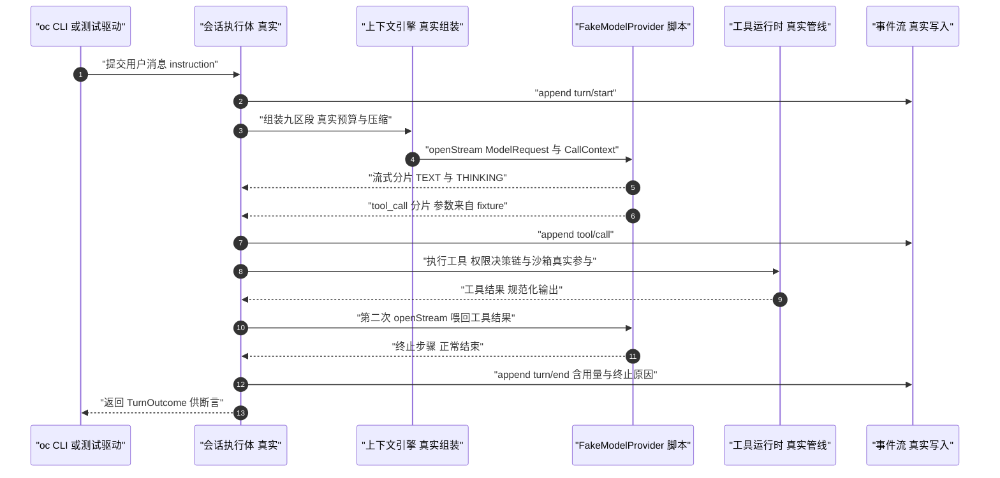
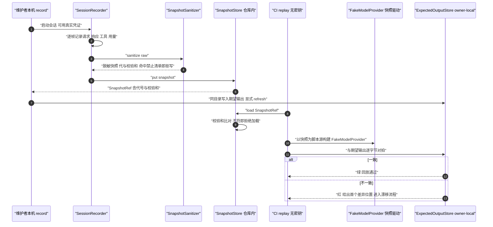
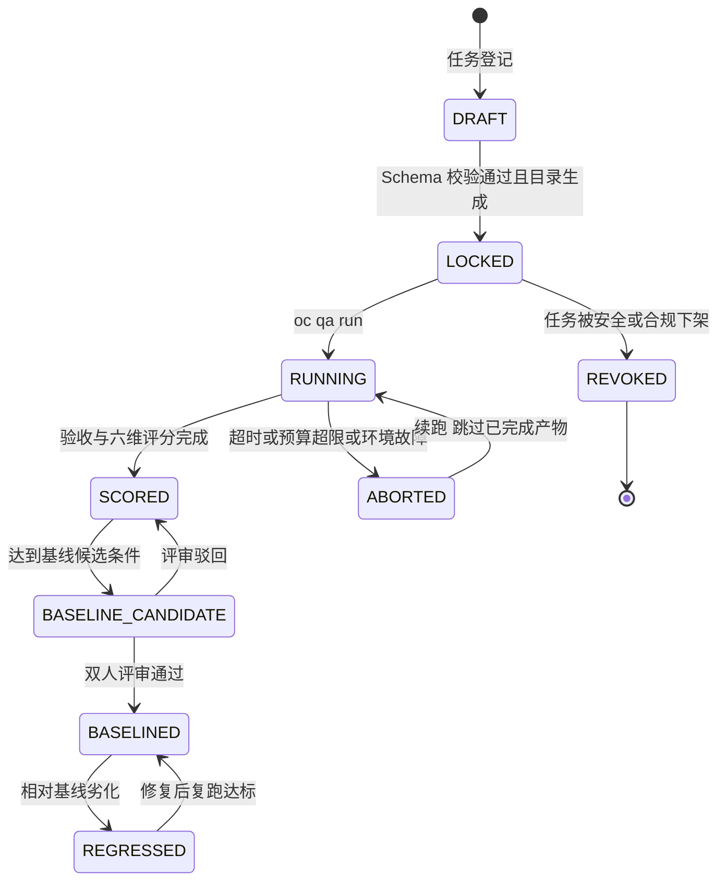

# C34 · QualityHarness（质量工装：假模型 / 故障注入 / 录制回放 / 基准运行器）组件级实现方案

> 组件编号 **C34**（附录 D 的 T-02/T-03/T-04/T-09/T-10 组件级细化；`harness-testkit` 测试基座为 Phase B 新增模块）｜ 归属域 质量、评测与门禁（QA）
> 上游系统方案：`impl/33-quality-eval-impl.md`（下称 impl/33）§①（范围与落点）、§②（REQ-QA-01…31）、§③（I-QA-1…10 分叉矩阵）、§④（架构）、§⑤（类图与契约）、§⑥.1–§⑥.5（时序）、§⑦（状态机）、§⑧（表 / Redis Key / 事件）、§⑨（接口 / 配置 / 错误矩阵）、§⑩（并发 / 性能 / 降级 / 回放确定性）、§⑪（DoD / 命令 / 时长预算）。
> 上游契约：Phase A 卷 26 D-QA-1…10；卷 16「事件为唯一事实源」；`appendix-d-component-inventory.md` T-02/T-03/T-04/T-09/T-10；`impl/IMPL-DECISIONS.md` I-QA-1…10；研究台账 L-029/L-050/L-052/L-073/L-077/L-081。
> 竞品证据：DeepSeek `vitest.snapshot.config.ts`（`DSH_SNAPSHOT=record|refresh`）与 `vitest.web.perf.config.ts`（`DSH_SNAPSHOT=replay`）、`vitest.expected.config.ts`、`session.jsonl[.zstd]` 代管理与「已提交代永不重命名」、`scripts/run-gates.ts` 单入口、`jscpd` 重复率检查、`verify-type-equiv` 文档签名块校验 `[E1]`（`competitors/04` §2/§4.24）；Codex `insta` 快照、SSE mock 与 `schema_fixtures.rs` 集成基座 `[E1]`（`competitors/03`）；gemini-cli 单一 `verify.mjs` 与退出码矩阵 `[E2]`（`competitors/08`）。
> 边界说明：评测任务集的内容创作（运营资产）、实验治理与灰度（卷 25/28）、生产在线指标采集管道（卷 16/24）**不在本组件边界**（见 §①.2）。
> 编号口径（本文件局部号段，须并入 `IMPL-DECISIONS.md` 后重编号）：`REQ-C-QH-01…12`、`I-C-QH-1…5`、`X-C34-1…5`（台账当前止于 X-82，待编排方分配正式号）。

---

## ① 定位与边界

### 1.1 本组件解决什么

1. **假模型可编程响应**：`ResponseScript` + `ScriptStep` + `FaultInjector`，与真实 `ModelProvider` 同接缝——组装层、上下文层、工具层、权限层的真实代码全部参与，仅模型出口被替换（REQ-QA-02/03）。
2. **无密钥可回放**：脱敏会话快照 + 内容校验和 + 代（generation）管理，CI 与任意开发机在无凭证、无出网条件下重放完整会话（REQ-QA-03/04）。
3. **故障注入与降级断言**：8 类故障（超时 / 限流 / 流截断 / 畸形 JSON / 网络抖动 / 凭证失效 / 空响应）按调用序号或概率注入，驱动错误翻译与重试纪律断言（REQ-QA-06/07）。
4. **离线基准与六维评分**：任务集（环境快照 + 验收脚本 + 权重）+ 目录即实验身份 + 可续跑 + 六维评分 + 基线版本化 + 回归阈值（REQ-QA-08/09/11/12）。
5. **声明式门禁与机械校验**：变更类型 × 检查矩阵（blocking / advisory 两档）、端点覆盖差集、契约漂移、覆盖率反作弊与包 hygiene（REQ-QA-13…20）。
6. **单一入口与时长可度量**：`scripts/ci/gate.mjs` 与 CI 同序执行，`fast ≤ 8min` / `full ≤ 20min`，本地零凭证（REQ-QA-30/31）。

### 1.2 本组件不解决什么

| 不解决 | 归属 | 边界说明 |
| --- | --- | --- |
| 各业务域 DoD 的明细判定 | 各卷册 | 本组件只提供「执行与判定」的机械装置（门禁矩阵消费各域检查项） |
| 评测任务集内容创作与标注 | 运营资产 | 本组件提供任务结构与 Schema 校验、目录生成 |
| 实验治理、灰度与毕业评估 | 卷 25 / 卷 28 | 本组件只输出评分与门禁输入，不做发布决策 |
| 生产在线指标采集 | 卷 16 / 卷 24 | 只消费事件派生指标做看板与门禁，不新增埋点 |

### 1.3 上下游依赖

| 方向 | 依赖对象 | 契约 | 失败语义 |
| --- | --- | --- | --- |
| 上游 | 卷 12 AgentRuntime / 卷 02 ModelProvider | 同一 `openStream` 接缝与事件流（回放驱动真实管线） | 接缝签名漂移 → 回放套件编译失败即门禁失败 |
| 上游 | 卷 19 持久化 / 卷 07 沙箱 | 运行产物落库；隔离沙箱（L1+）执行基准任务 | 沙箱不可用 → 基准任务拒绝启动（不降级到宿主直跑） |
| 上游 | 卷 16 事件总线 | `qa.*` 事件只增不改；「模型可见即可重建」对拍输入 | 事件写失败 → 运行判定失败（审计先行） |
| 下游 | CI 与开发者本机 | `scripts/ci/gate.mjs` 快 / 全两档与退出码矩阵 | 单入口不可用 → 回退到模块级命令（登记并告警） |
| 下游 | 卷 32 复盘闭环 / 卷 31 成本 | `qa.incident.*` 与六维中的成本维度输入 | 上报失败为 fail-open + WARN（不阻断 CI 判定） |

### 1.4 模块落点与命名

| 层带 | 模块 | 关键类 | Spring |
| --- | --- | --- | --- |
| 契约 | `harness-contract`（`contract/qa`，单模块） | `BenchmarkTask`、`SnapshotEnvelope`、`ScoreReport`、`GateResult` | 禁止 |
| 内核 | `harness-kernel/kernel-qa`（零框架，纯 Java） | `FakeModelProvider`、`FaultInjector`、`ScoreAggregator`、`GateEvaluator`、`CoveragePolicyEngine`、`ContractDriftChecker`、`PerfGate` | 禁止 |
| 平台 | `harness-platform/platform-qa` | `TaskRegistry`、`SnapshotStore`、`BenchmarkRunner`、`TrendStore`、`IncidentLedger`（`QaEvaluationProperties` 纯数据类不加 `@Component`） | 允许 |
| 测试基座 | `harness-testkit`（根级扩展模块，待卷 27 §4.1 登记） | `HarnessUnderTest`、SSE/HTTP 录制 mock、`EventAwait`、`PtyDriver`、`DesktopPlaywright` | 仅测试期依赖 |

---

## ② 功能需求清单（REQ-C-QH-01…12）

| ID | 需求描述 | 来源 | 优先级 | 验收要点 |
| --- | --- | --- | --- | --- |
| REQ-C-QH-01 | 五层测试基座（单元 / 集成 / 契约 / 端到端 / 混沌）各自独立 gate 入口；缺跑即失败；内核层断言零 Spring 依赖 | impl/33 REQ-QA-01、卷 26 D-QA-1 | P0 | 任一层 CI 缺跑即门禁失败；内核模块 import 检查零框架 |
| REQ-C-QH-02 | 假模型脚本引擎：8 种 `StepKind`（文本 / 思考 / 工具 / 结构化 / 拒答 / 长度截断 / 空 / 畸形）+ 流式分片；脚本耗尽显式失败 | impl/33 REQ-QA-02、§⑤/§⑥.1、I-QA-1 | P0 | 8 种终止形态各有用例；未匹配到步骤显式失败而非静默兜底 |
| REQ-C-QH-03 | 无密钥回放：出厂 profile 启动完整 harness，仅模型出口替换；CI 无 `*_API_KEY` 可跑通且零出网 | impl/33 REQ-QA-03；DeepSeek `DSH_SNAPSHOT=replay` `[E1]` | P0 | 无凭证环境全绿；网络断言证明零出网连接 |
| REQ-C-QH-04 | 快照录制台账：写入前脱敏 + 内容校验和 + 版本化代 + 撕裂尾修复；已提交代不可变 | impl/33 REQ-QA-04、I-QA-2；DeepSeek 代管理 `[E1]` | P0 | 快照内密钥 / 令牌模式命中 0；校验和不符拒绝加载；截断被识别为撕裂 |
| REQ-C-QH-05 | owner-local 期望输出：与用例同目录、由所有者维护；refresh 显式且留 diff，CI 强制禁止自动刷新 | impl/33 REQ-QA-05、I-QA-3；DeepSeek `vitest.expected.config.ts` `[E1]` | P1 | 路径同目录断言；CI 中 refresh 被拒；漂移进入 `REFRESH_PENDING` 流程 |
| REQ-C-QH-06 | 故障注入器：8 类故障按调用序号 / 概率注入；错误必须翻译为 `AiException(ErrorCode)`，重试只认 `retryable`，不静默降级 | impl/33 REQ-QA-06/07；卷 02 D33/D14；`agents.md` 规范四 | P0 | 每类注入有断言（不产生脏数据 / 错误码可重试标记正确）；SDK 原始异常零外溢 |
| REQ-C-QH-07 | 基准身份与续跑：目录编码 `taskId + commit + 镜像摘要 + seed`；默认跳过已完成、显式 `redo` / `--no-skip` 才重跑 | impl/33 REQ-QA-11、I-QA-4；L-050 | P0 | 目录名可反解身份；重复运行默认 0 次模型调用；跳过项清单输出 |
| REQ-C-QH-08 | 六维评分与回归判定：成功率 40% / 正确性 20% / 成本 15% / 时长 10% / 安全 10% / 轨迹 5%；回归 = 总分 -3% 或成功率 -2pp；基线双人评审 | impl/33 REQ-QA-09/12、I-QA-5；卷 26 D-QA-3 | P0 | 构造 -3.1% 与 -2.1pp 触发、-2.9% 与 -1.9pp 不触发；基线单人审批被拒 |
| REQ-C-QH-09 | 声明式门禁矩阵（10 类变更 × blocking/advisory）+ 端点覆盖差集 + 契约漂移（Schema / 生成目录 freshness / 文档签名块） | impl/33 REQ-QA-13/14/15/20、I-QA-6；L-073/L-081 | P0 | 新增端点未测即失败并列出差集；目录与签名块漂移即失败 |
| REQ-C-QH-10 | 覆盖率差异化 + 反作弊：核心域行 ≥ 80% / 分支 ≥ 70%；关键包逐文件 100% 清单显式维护；空断言 / 恒真断言静态检查 | impl/33 REQ-QA-17/18、I-QA-7 | P0 | 清单一文件未达 100% 即失败；清单外模块不失败；反作弊命中即告警条目 |
| REQ-C-QH-11 | UI 快照：TUI 文本缓冲快照（脱敏断言）+ 桌面 4 条关键旅程裁剪截图金样；刷新走 owner-local 同一纪律 | impl/33 REQ-QA-21、I-QA-8；Codex `insta` `[E1]` | P1 | TUI 快照无绝对路径 / 时间戳；桌面差异在阈值内；组件级回退触发明确 |
| REQ-C-QH-12 | 跨平台回放确定性 + 时长预算：五类非确定性源锁定（路径 / 行尾 / 时钟随机 / 集合序 / 环境）；`fast ≤ 8min`、`full ≤ 20min`、超 1.5× 告警 | impl/33 §⑩.11/§⑪.5.1、REQ-QA-31；I-QA-10 | P0 | 三平台 + CI 容器快照摘要一致；时长进 CI 对比并触发拆分回退 |

---

## ③ 关键设计决策（I-C-QH-1…5）

### 3.1 I-C-QH-1 假模型与真实管线的接缝

| 分支 | 描述 | F/U/S/M | 加权 | 结论 |
| --- | --- | --- | --- | --- |
| B1 | 纯打桩（Mockito / WireMock 匹配请求） | 7/8/6/6 | 66.5 | 淘汰（无法表达流式 / 分片 / 工具回放） |
| B2 | 脚本引擎 `ResponseScript` + 故障装饰器，与真实 `ModelProvider` 同接口 | 9/8/9/9 | 88.0 | **选定** |

**选定 B2（与 I-QA-1 同源）**：故障注入以装饰器叠加在假模型之上（与卷 02 装饰器链同构），因此重试与降级走的是**生产同款代码**；代价是脚本表达能力需持续维护。**回退触发**：脚本无法表达 ≥ 3 类协议行为 → 扩展 `ScriptStep` 类型枚举，而非更换方案。

### 3.2 I-C-QH-2 快照与期望输出形态

| 分支 | 描述 | F/U/S/M | 加权 | 结论 |
| --- | --- | --- | --- | --- |
| B1 | 明文快照提交仓库 | 7/9/4/7 | 66.5 | 淘汰（泄漏风险、体积失控） |
| B2 | 脱敏快照（代 + 校验和 + 压缩）+ owner-local 期望输出同目录 | 9/8/9/8 | 85.5 | **选定** |

**选定 B2（与 I-QA-2/3 一致）**：快照进仓库保证离线可评审（目录即身份的前置），对象存储只做长历史归档；refresh 必须显式并留下 diff（防「刷快照掩盖回归」）。**回退触发**：快照仓体积 > 200MB → 稀疏检出 + 对象存储分层（加载路径不变）；合并冲突率 > 10% → 按用例目录拆分文件粒度。

### 3.3 I-C-QH-3 基准运行身份与续跑

| 维度 | 选定 | 理由与代价 | 回退触发 |
| --- | --- | --- | --- |
| 运行身份 | 目录即身份（`taskId + commit + 镜像摘要 + seed`），`oc_qa_run.output_dir` 唯一索引机械保证；默认跳过已完成产物 | 可对账、可续跑（L-050）；代价是路径冗长与编解码需单点定义（见 X-C34-3） | 跳过语义导致假绿 → 发布前强制 `--no-skip` 并输出跳过项清单 |
| 并发 | 同任务不并行两次（`CONCURRENT_CONFLICT`）；全局并发上限 `max-concurrent`（默认 4） | 防 CI 资源打爆与结果互相污染 | 资源空闲且队列积压 → 提升上限（配置）而非放开同任务并行 |

### 3.4 I-C-QH-4 门禁入口与档位

| 维度 | 选定 | 理由与代价 | 回退触发 |
| --- | --- | --- | --- |
| 入口 | `scripts/ci/gate.mjs` 单入口、与 CI 同序；`--profile fast`（≤ 8min）/ `full`（≤ 20min，超集）两级；模块目录守卫拒绝仓库外执行 | 本地 / CI 结果一致（REQ-QA-30）；代价是入口脚本需与 CI 同步维护 | `fast` > 8min 或 `full` > 20min → 进一步拆分或引入按受影响模块裁剪的增量门禁（顺序不变） |
| 档位归属 | 确定性 + 快检查为 blocking；抖动类（性能趋势、覆盖率趋势）与文档门禁为 advisory / 独立 profile | 防「全阻塞」摧毁交付节奏；代价是告警需责任人关闭 | 告警关闭率 < 50% → 提升为阻塞或下线（禁止挂空） |

### 3.5 I-C-QH-5 覆盖率策略与判官降级

| 维度 | 选定 | 理由与代价 | 回退触发 |
| --- | --- | --- | --- |
| 覆盖率 | 域差异化 + 关键包逐文件 100% 清单（显式维护，禁止全局 blanket）+ 变更行优先 + 反作弊静态检查 | 逼出有意义测试；代价是白名单维护成本 | 清单维护成本失控 → 收敛为「核心域包级 90% + 清单收缩至 5 个包」 |
| 评分器 | 规则维度零模型调用；LLM 判官仅用于轨迹质量并记录判官版本 + 提示词哈希；人工抽样 ≥ 10% 对账 | 可复现、可归因；代价是主观维度覆盖窄 | 人工与机器偏差持续 > 1 分 → 暂停判官维度改为纯人工（总分重算） |

---

## ④ 类图

```mermaid
classDiagram
  class ModelProvider {
    <<interface>>
    +openStream(ModelRequest request, CallContext ctx) ModelStream
  }
  class FakeModelProvider {
    +openStream(ModelRequest request, CallContext ctx) ModelStream
  }
  class ResponseScript {
    +ScriptStep requireStep(int ordinal)
  }
  class ScriptStep <<record>>
  class StepKind <<enumeration>>
  class FaultInjector {
    +decorate(ModelStream raw, int callOrdinal) ModelStream
  }
  class SnapshotStore {
    <<interface>>
    +put(SessionSnapshot snapshot) SnapshotRef
    +load(SnapshotRef ref) SessionSnapshot
  }
  class ExpectedOutputStore {
    +load(CaseRef ref) byte[]
    +refresh(CaseRef ref, byte[] actual, RefreshReason reason) void
  }
  class BenchmarkRunner {
    +run(BenchmarkTask task, RunIdentity identity, RunOptions options) RunOutcome
  }
  class RunIdentity <<record>>
  class ScorerSPI {
    <<interface>>
    +score(ScoreContext ctx) DimensionScore
  }
  class ScoreAggregator {
    +aggregate(List~DimensionScore~ parts, BaselineRef baseline) BenchmarkScore
  }
  class GateMatrix {
    +evaluate(ChangeKind kind, GateInputs inputs) GateVerdict
  }
  class CoveragePolicyEngine {
    +check(CoverageReport report, CoveragePolicy policy) CoverageVerdict
  }
  class ContractDriftChecker {
    +check(ContractSet contracts) List~DriftFinding~
  }
  class PerfGate {
    +evaluate(PerfSample sample, PerfBaseline baseline) PerfVerdict
  }
  ModelProvider <|.. FakeModelProvider
  FakeModelProvider --> ResponseScript
  ResponseScript --> ScriptStep
  FakeModelProvider --> FaultInjector
  SnapshotStore --> ExpectedOutputStore
  BenchmarkRunner --> RunIdentity
  BenchmarkRunner --> ScorerSPI
  ScoreAggregator --> ScorerSPI
  PerfGate --> GateMatrix
```



**说明**：`FakeModelProvider` 与真实 Provider 实现同一 `ModelProvider` 接缝，回放路径中上下文组装、权限决策、工具管线、事件写入全部为真实实现（I-C-QH-1）；`StepKind` 取 8 值（`TEXT/THINKING/TOOL_CALL/STRUCTURED/REFUSAL/LENGTH_CUT/EMPTY/MALFORMED`），`FaultKind` 取 8 值（`TIMEOUT/RATE_LIMIT/STREAM_TRUNCATE/MALFORMED_JSON/NETWORK_JITTER/AUTH_EXPIRED/EMPTY_RESPONSE/PROTOCOL_ORDER`），`GateSeverity` 取 `BLOCKING/ADVISORY`——三者均为 `code` + `desc` 契约枚举；`SnapshotSanitizer`（写入前脱敏，命中禁止清单即拒写）、`QualityIncident` / `ImprovementItem`（改进项四类归属：代码 / 配置 / 测试 / 文档）与 `TrendStore` 不在此图展开；`ScorerSPI` 六个内置实现按 `ScoreDimension` 枚举分派。

---

## ⑤ 核心流程时序图

### 5.1 流程 A：假模型脚本驱动一次完整 Turn（含流式分片与工具调用回放）



- **前置条件**：本机与 CI 均无模型凭证；使用 `headless` 出厂 profile；脚本含 `TOOL_CALL` 步骤与终止步骤。
- **主路径**：提交指令 → 真实组装 → 按序回放分片与工具调用 → 工具经真实管线（权限 / 沙箱）执行 → 回喂结果 → 终止 → `turn/end` 落库。
- **异常补偿与幂等**：脚本耗尽 → `requireStep` 显式失败（视为用例未覆盖的新路径，禁止静默空响应）；工具参数不合法由真实校验器拒绝；`CallOrdinalCounter` 按会话隔离计数，保证并行用例互不污染。

### 5.2 流程 B：录制 → 脱敏 → 快照落盘 → CI 无密钥回放与漂移判定



- **前置条件**：录制发生在维护者本机（可用真实凭证）；回放发生在 CI 与任意开发机（无凭证、无出网）；快照格式版本 ≤ 当前读取版本。
- **主路径**：逐帧录制 → 脱敏 → 代 + 校验和落盘 → CI 加载（校验和闸门）→ 快照驱动重放 → 期望输出逐字节对拍。
- **异常补偿与幂等**：脱敏命中禁止清单 → 拒写并重录；校验和不符 → 拒绝加载并告警（防手改快照造成假绿）；漂移 → 进入 `REFRESH_PENDING`（显式 refresh + 评审 diff，CI 中 refresh 被强制关闭）；快照以「代 + 校验和」为键，同代内容相同则写入幂等。

---

## ⑥ 状态机

### 6.1 基准运行与基线状态机（用例执行态）



**迁移约束（实现为静态不可变 Map，非法迁移抛 `HarnessException(ErrorCode.CONFLICT, …)`）**：`SCORED` 只能经双人评审（`approved_by` ≥ 2）进入 `BASELINED`；`ABORTED` 续跑必须输出「跳过项清单」。**不变量**：① 任一运行可由 `RunIdentity` 反解实验身份（目录即身份）；② 回归判定（总分 -3% 或成功率 -2pp）只在与基线同机型、同镜像摘要时可判定，否则降级为「仅记录趋势」；③ `REVOKED` 任务不得再发起运行。

### 6.2 快照与期望输出生命周期

生命周期（`impl/33` §⑦.2 口径）：`RECORDED`（本机录制完成）→ `SANITIZED`（脱敏 + 校验和，命中禁止清单转 `REJECTED` 重录）→ `COMMITTED`（入仓，含代号）→ `DRIFTED`（期望输出与重放不一致）→ `REFRESH_PENDING`（显式 refresh 且需说明原因）→ 评审通过回 `COMMITTED` / 驳回回 `DRIFTED`；上游协议变更走 `DEPRECATED`（新代替代，旧代只读保留）。**不变量**：已提交代不可变（覆盖写入被拒）；`EXPECTED_OUTPUT_MISSING` 时拒绝 refresh（先录制）；CI 环境强制禁用 refresh 开关。

---

## ⑦ 接口与依赖矩阵

### 7.1 对外契约（内核零框架；Java 21 签名节选）

`CallOrdinalCounter`（`next(caseKey)`：按「用例 + 会话」隔离计数，并行用例互不污染，键为空抛 `HarnessException(ErrorCode.PARAM_INVALID, …)`）供脚本步骤选择与故障注入落点共用；核心契约如下：

```java
package com.hk.opencoding.kernel.qa;

/**
 * 假模型提供者：按脚本回放响应，绝不发起真实网络调用。
 * 与真实 Provider 实现同一接缝，因此组装层、上下文层、工具层的真实代码全部参与；
 * 脚本耗尽属「用例未覆盖的新路径」——必须显式失败，禁止静默返回空响应掩盖缺口。
 */
public final class FakeModelProvider implements ModelProvider {

    /**
     * @param script 响应脚本（必填，至少一个终止型步骤）
     * @param injector 故障注入器（可空；为空表示无注入）
     * @param ordinalCounter 调用序号计数器（必填，用于按序号注入故障并隔离用例）
     */
    public FakeModelProvider(ResponseScript script, FaultInjector injector, CallOrdinalCounter ordinalCounter) {
        this.script = Objects.requireNonNull(script, "script 不可为空");
        this.injector = injector;
        this.ordinalCounter = Objects.requireNonNull(ordinalCounter, "ordinalCounter 不可为空");
    }

    /**
     * 打开一次模型流（含流式分片与工具调用回放）。
     *
     * @param request 模型请求（由上下文引擎真实组装，不可为空）；ctx 调用上下文（含 traceId 与租户标识）
     * @return 模型流；注入生效时返回装饰后的流
     * @throws AiException 脚本耗尽（映射为不可重试错误）时抛出
     */
    @Override
    public ModelStream openStream(ModelRequest request, CallContext ctx) {
        int ordinal = ordinalCounter.next(ctx.caseKey());
        ScriptStep step = script.requireStep(ordinal);
        ModelStream raw = ScriptStreams.of(step, request, ctx);
        return injector == null ? raw : injector.decorate(raw, ordinal);
    }
}
```

`SnapshotStore` / `ExpectedOutputStore` / `BenchmarkRunner` / `ScorerSPI` / `GateMatrix` 签名见 impl/33 §⑤（§④ 类图已列）；`FaultProfile` 为 record（`rates` + `callOrdinals`，两者不可同时为空，否则构造期拒绝）。

### 7.2 命令与查询面（摘要）

`oc qa task validate --all`（Schema + 目录 freshness）｜`oc qa run --suite core`（目录即身份，默认跳过）｜`oc qa run --suite full --no-skip`（发布前强制）｜`oc qa replay --snapshot SNAP-…`（无密钥回放）｜`oc qa snapshot record/refresh`｜`oc qa gate check --change <kind>`｜`oc qa score report --format jsonl`。REST 查询面 `/api/v1/qa/{tasks,runs,baselines,snapshots/{no}/refresh,gates/evaluate,trends,incidents}` 与 CLI 同语义；退出码矩阵 `0 / 1 / 42 / 53`（成功 / 通用失败 / 输入错误 / 预算或轮次超限）由 CLI 契约测试覆盖。

### 7.3 依赖矩阵与配置项（`open-coding.qa.*`）

| 关系 | 对象 | 契约要点 | 失效影响 |
| --- | --- | --- | --- |
| 依赖 | `RedisKeys.lock(Module.QA, "benchmark-run", taskNo)` / `semaphore(Module.QA, "judge")` | 运行互斥（租约 30 分钟）+ 判官并发闸门（默认 2） | Redis 不可用 → 运行降级为单实例串行；判官维度转人工 |
| 依赖 | 卷 07 沙箱（L1+）与真实文件系统 | 基准任务隔离执行、默认拒绝出网 | 沙箱不可用 → 拒绝启动（不降级宿主直跑） |
| 被依赖 | CI / 开发者本机 / 卷 32 复盘 | `gate.mjs` 两档、JSONL 报告与退出码、`qa.incident.*` | 门禁不可用 → 合并阻断（blocking 档 fail-closed） |

配置：`suite.core`（`core`）、`run.lock-lease-minutes`（`30`）、`run.max-concurrent`（`4`）、`coverage.core-line-rate`（`0.80`）/`core-branch-rate`（`0.70`）、`coverage.per-file-packages`（逐文件 100% 清单，默认 5 个核心包）、`perf.relative-threshold-pct`（`10`）、`perf.machine-tag`（`${QA_MACHINE_TAG:unknown}`）、`judge.model`（空则轨迹维度转人工）、`judge.sample-rate`（`0.10`）、`snapshot.max-repo-mb`（`200`）、`artifact.access`（`tenant`）。环境变量：`QA_MACHINE_TAG`、`QA_JUDGE_API_KEY`（判官专用、默认留空、缺失即转人工）、`QA_SNAPSHOT_HOME`；全部同步 `.env.example`，敏感项禁止写入 yml 默认值。

---

## ⑧ 关键算法

### 8.1 算法 A：响应脚本驱动的假模型

① 取序号：`CallOrdinalCounter.next(caseKey)` 按用例隔离；② 选步骤：`script.requireStep(ordinal)` 按序取（不做模糊匹配兜底，耗尽即显式失败）；③ 造流：`ScriptStreams.of` 生成流式分片，支持 1 字节 / 超大分片边界与空分片（协议解析不得被破坏）；④ 装饰：`injector.decorate(raw, ordinal)` 在流上叠加故障（§8.2）；⑤ 终止：8 种 `StepKind` 表达 8 种终止形态（正常 / 长度截断 / 工具 / 拒答 / 空响应 / 畸形 / 超时 / 取消），`turn/end` 的终止原因可断言。**边界条件**：工具调用步骤的参数来自 fixture（非模型生成），保证回放确定性；`THINKING` 与 `TEXT` 分片序固定，JSON 键序固定。

### 8.2 算法 B：故障注入点清单

| 注入点 | 触发方式 | 期望行为（断言） | 依据 |
| --- | --- | --- | --- |
| 模型超时（+2s / +10s） | 按序号注入 `TIMEOUT` | 超时分类正确、`retryable=true`、退避区间符合配置、不产生脏数据 | REQ-QA-06/07 |
| 限流 429 | 按序号注入 `RATE_LIMIT` | 重试受上限约束；超限显式失败并联动预算告警（卷 31） | 同上 |
| 流截断 / 分片乱序 | `STREAM_TRUNCATE` / `PROTOCOL_ORDER` | 写盘后截断 → 协议错误且**不可重试**；不产生半条消息 | §⑪.3 |
| 畸形 JSON / 空响应 | `MALFORMED_JSON` / `EMPTY_RESPONSE` | 显式协议错误 + WARN（含 traceId，不含正文敏感字段） | REQ-QA-06 |
| 网络抖动（连接重置） | `NETWORK_JITTER` | 重试后成功；重试次数指标可观测 | 同上 |
| 凭证失效 401 | `AUTH_EXPIRED` | 立即失败（不重试）+ 运维手册 RB-06 关联提示 | §⑪.3 |
| 存储只读（事件写失败） | 环境级注入 | 主流程暂停（拿到确认才算提交）、显式报错 | 卷 26 §4.6 C3 |
| 消费者滞后 / Redis 清空 | 环境级注入 | 告警触发后追平；性能下降但功能正确、无数据不一致 | C4 / C6 |

**纪律**：注入画像（`FaultProfile`）空画像在构造期拒绝；注入按序号集合精确落点保证断言可复现；`FaultSourceSPI` 允许从外部声明式 YAML 注入画像（演练联动）。

### 8.3 算法 C：快照录制与跨平台重放

① 录制：逐帧记录请求 / 响应 / 工具 / 用量；② 脱敏：密钥 / 令牌 / 手机号模式扫描与掩码，命中「禁止清单」即**拒写**（不是掩码）；③ 落盘：代（generation）递增 + 内容校验和 + 压缩，已提交代不可变；④ 撕裂尾：截断文件识别为撕裂并修复或明确拒绝；⑤ 跨平台归一（五类非确定性源）：路径统一 POSIX 相对路径 + `PathNormalizer`；文本 UTF-8 + LF（`.gitattributes` 强制）；时间戳取脚本 `virtualClock`（种子固定），回放路径禁止 `Instant.now()` / 未播种 `Random`（架构断言扫描）；集合按插入序或显式排序、JSON 键序固定；locale / 时区 / `line.separator` 固定为 `C / UTC / \n`；⑥ 漂移判定：期望输出与重放逐字节对拍，差异输出首个差异位置并进入 `DRIFTED`。**验证门禁**：同一快照在 Windows / macOS / Linux 与 CI 容器四者摘要（SHA-256）一致，不一致即判定回放确定性缺陷并阻断；`seed` 缺失即拒绝运行。

### 8.4 算法 D：基准评分器

① 六维采集：规则维度（任务成功 40% / 正确性 20% / 成本 15% / 时长 10% / 安全 10%）零模型调用；轨迹维度（5%）由判官评分并记录判官版本与提示词哈希；② 归一：各维度按权重归一后求和为总分；③ 回归判定：`Δtotal < -3%` 或 `Δsuccess < -2pp` 触发 `REGRESSED`，且**仅在**同机型（`machine_tag`）+ 同镜像摘要时判定，否则输出「基线需重采」提示；④ 门禁联动：verdict 交 `GateMatrix`（blocking 失败合并被拒、advisory 仅告警并留档）。**边界条件**：回归阈值不是配置项（修改需评审并走基线流程）；构造用例必须覆盖 `-3.1% / -2.9%` 与 `-2.1pp / -1.9pp` 四组边界。

---

## ⑨ 错误处理与降级

内核（`kernel-qa`）抛 `HarnessException(ErrorCode, 中文文案)`；宿主与服务侧（`host-qa`）抛 `BusinessException(ErrorCode, 中文文案)`；SDK 异常经错误翻译层转 `AiException`（D33）；全局处理器按 `ErrorCode` 映射，**禁止**裸 `RuntimeException`。

| 场景 | 错误码 | 对外文案（中文，事实 + 原因 + 动作） | 处置 |
| --- | --- | --- | --- |
| 任务 / 运行不存在 | `RESOURCE_NOT_FOUND` | 「指定对象不存在：`<id>` 未找到或已过期清理；核对编号或从列表重新选择」 | 404 + 审计 |
| 无权限（跨租户 / 跨项目） | `FORBIDDEN` | 「无权访问该评测资产：该资产属于其他租户 / 项目；可走导出流程或申请授权」 | 403 + 安全审计 |
| 参数非法（分页 / 枚举） | `PARAM_INVALID` | 「请求参数不合法：`<field>` 超出允许范围 `<range>`；按提示收敛参数后重试」 | 返回合法范围 |
| 预算 / 并发超限；同任务并发运行 | `QUOTA_EXCEEDED` / `CONCURRENT_CONFLICT` | 「评测并发已达上限：当前有 `<n>` 个运行在执行；可等待或降低并发」/「该任务已在运行：同一任务不允许并行两次；可查看既有结果」 | `max-concurrent` 钳制；拒绝并返回运行引用 |
| 基线未审批 | `APPROVAL_INSUFFICIENT` | 「基线缺少第二人审批：需 ≥ 2 人评审；请另一名评审人批准后生效」 | 拒绝生效（双人原则） |
| 期望输出缺失 / 快照校验和不符 | `EXPECTED_OUTPUT_MISSING` / `SNAPSHOT_INTEGRITY_FAILED` | 「期望输出不存在：该用例尚未录制；先执行 `oc qa snapshot record`」/「快照校验失败：内容哈希与登记值不一致；重新录制，勿手改入仓文件」 | 拒绝 refresh / 拒绝回放 + 告警（防篡改） |
| 门禁输入不完整 | `GATE_INPUT_INCOMPLETE` | 「门禁输入缺失：缺少变更区间或变更类型；补齐后重新评估」 | 拒绝评估（不猜类型） |
| 判官不可用 / 超时 | —（降级） | 轨迹维度标注「转人工」，不静默给分 | 降级为人工抽样（advisory 不阻塞） |

**fail 方向（显式，对齐 impl/33 §⑩.5）**：**阻塞型门禁**（契约 / 依赖方向 / 密钥扫描 / 端点覆盖）判定链路不可用时一律 **fail-closed 阻断**（CI 非零码退出）；**advisory 门禁**、轨迹判官与性能环境异常（机型标签变化）时**显式降级并标注**（不静默通过、不静默给分）；评测结果上报失败为 fail-open + WARN（不影响 CI 判定本身）。

---

## ⑩ 性能与并发

**测试套件时长门禁（R06 口径，CI 实测对比预期）**

| 档位 / 命令 | 预算 | 超限动作 |
| --- | --- | --- |
| `gate.mjs --profile fast`（合并前必跑） | ≤ 8 min | > 1.5× 告警；超预算即阻塞并触发 I-C-QH-4 拆分 / 增量回退 |
| `gate.mjs --profile full --no-skip`（发布前） | ≤ 20 min | 同上（顺序不变，full 为 fast 超集） |
| 单模块级命令（改哪层跑哪组） | ≤ 8 min（逐项表见 impl/33 §⑪.5.1） | 逐项实测对比，超 1.5× 告警并进体验周报 |
| 首次克隆到首个绿灯 | ≤ 30 min（依赖下载 ≤ 15 min；命中镜像 ≤ 5 min） | 超出即视为入门体验退化 |

**运行预算**：单任务冷启动采集额外开销 ≤ 50ms；快照加载 P95 ≤ 200ms（10MB 级）；6 项性能基准采集开销 ≤ 场景耗时 3%；门禁评估（不含运行）≤ 5s；运行产物保留 90 天、趋势数据 365 天（按日聚合）；快照仓库上限 200MB（超限触发对象存储分层）。

**并发模型**：基准运行每任务一虚拟线程（`max-concurrent` 默认 4）；判官调用受 `RedisKeys.semaphore`（默认并发 2）限制，避免评测流量冲击生产配额；故障注入与快照加载为纯 CPU / IO 短路，不上线程池；运行互斥用 `RedisKeys.lock(Module.QA, "benchmark-run", taskNo)`（租约 30 分钟）；同任务不并行两次（`CONCURRENT_CONFLICT`），并发运行按 `taskId` 分片；跳过语义仅对「产物完整」的目录生效，跳过项必须出现在输出清单中（防假绿）。

---

## ⑪ 测试要点

| 层级 | 用例 | 断言要点 |
| --- | --- | --- |
| 单元 | `ResponseScriptTest`（8 种 `StepKind` + 分片边界 1 字节 / 超大）、`FaultInjectorTest`（序号与概率两式可复现、空画像被拒）、`FaultProfile` 构造校验 | 脚本耗尽显式失败；空分片不破坏协议解析；注入落点精确 |
| 单元 | `ScoreAggregatorTest`（六维权重和 = 100%；-3.1% / -2.9%、-2.1pp / -1.9pp 四组边界）、`GateMatrixTest`（10 类变更 × 两档）、`CoveragePolicyEngineTest`（清单内外 + 反作弊命中）、`ContractDriftDetectorTest`（端点差集 / Schema 破坏 / 目录 freshness / 签名块漂移）、`PerfGateTest`（抖动 ±15% 不假失败、真劣化 12% 触发）、`RunIdentityTest`（目录反解、重复身份拒绝） | 逐项断言；任一回归即阻断流水线 |
| 集成 | 无密钥回放（零 `*_API_KEY` + 零出网断言）；全链路真实参与（事件计数与工具执行证据，禁 mock 替换）；快照台账（脱敏 0 命中、校验和拒绝、撕裂修复、已提交代不可变）；端点覆盖差集；「模型可见即可重建」对拍（篡改一条事件 payload → 首个差异位置）；续跑语义（0 次模型调用 / `--no-skip` 全量 / 跳过项清单）；UI 快照脱敏与阈值；基座自检（禁 `Thread.sleep`，`EventAwait` 超时输出期望与实收事件） | 每项对应 REQ-C-QH 验收要点 |
| 漂移检测 | 三平台（Windows / macOS / Linux）+ CI 容器四摘要一致；路径 / 行尾 / 时钟 / 集合序 / 环境五类漂移各一用例；CI 中 refresh 被拒、本地 refresh 留 diff | 摘要不一致即阻断；refresh 纪律不可绕过 |
| 故障注入与混沌 | §8.2 八类注入点 + 存储只读 / 消费者滞后 / Redis 清空 / 磁盘配额打满四类环境故障 | 重试次数与退避区间、不可重试立即可见、不产生脏数据 |
| 性能 | §⑩ 全部预算与时长门禁 | 达目标值；超预算阻塞构建 |

```bash
mvn -pl harness-kernel/kernel-qa -am test                     # 脚本引擎 / 注入器 / 评分器 / 门禁判定（零 IO）
mvn -pl harness-platform/platform-qa -am test                 # 任务集 / 快照台账 / 运行器（PG + Redis 容器）
mvn -pl harness-testkit -am test                              # 基座自检（禁 sleep、等待原语诊断、SSE mock）
./scripts/ci/gate.mjs --profile fast                          # 单入口门禁（与 CI 同序：覆盖 / 差集 / 漂移 / 性能）
./scripts/ci/gate.mjs --profile full --no-skip                # 发布前全量（强制重跑 + 红队 + 性能门禁）
oc qa replay --suite core --snapshot-dir testkit/qa/snapshots # 无密钥回放
```

---

## 修订建议登记（本文件提出，待编排方分配 `X-n` 并入台账 §4）

| 编号（待并号） | 冲突 / 缺口 | 证据 | 建议修订 |
| --- | --- | --- | --- |
| `X-C34-1` | **重复率门禁缺失**：竞品 `jscpd` 类重复代码检查未落任何 REQ（hygiene 只覆盖依赖收敛 / 方向 / 消费者编译），大仓重构期复制粘贴无人拦截 | `competitors/04` §2 `[E1]`（`jscpd` + `run-gates.ts`）；impl/33 REQ-QA-18/19 无对应项 | hygiene 三件套补第四件「重复率检查」：阈值 + 白名单（生成物 / 测试夹具豁免）+ 机械门禁，与覆盖率反作弊同批落地 |
| `X-C34-2` | `harness-testkit` 未登记：impl/33 §1 自述「待卷 27 §4.1 登记」，但 §⑪.5 验收命令已依赖该模块（根级新增，卷 27 §4.1 未列） | impl/33 §1 与 §⑪.5；R07 扩展模块清单 | 卷 27 §4.1 与附录 D 补登 `harness-testkit`（仅测试期依赖、不得进生产 classpath），与 R07 S4 同批执行 |
| `X-C34-3` | 目录即身份缺编解码契约：`RunIdentity.outputDir()` 的编码规则（commit 短哈希长度、imageDigest 转义、Windows 260 路径上限）与反解校验器未定义，但 §11.1 已要求「目录名可反解身份」 | impl/33 §⑤/§⑪.1 对拍用例 | `harness-contract` 定义 `RunIdentityCodec`（唯一编解码点，含转义表与长度上限），目录名格式纳入契约测试 |
| `X-C34-4` | gate profile 三级缺口：`--profile docs` 出现在 §⑪.5.1 与验收命令，但 I-QA-10 只定义 fast / full 两级 | impl/33 §⑪.5.1 vs I-QA-10 | I-QA-10 或卷 27 §4.6 明确「docs 为独立可跑 profile（full 子集、非阻塞合并）」并登记与 CI 的对应关系 |
| `X-C34-5` | 判官校准队列无载体：REQ-QA-10 要求「偏差 > 1 分进入校准队列」，但 `oc_qa_*` 表族无对应表 / 端点 | impl/33 REQ-QA-10 vs §⑧.1 | 增 `oc_qa_judge_calibration`（或并入 `oc_qa_incident`）承载抽样对账记录，并在 `/api/v1/qa/trends` 暴露偏差趋势 |
