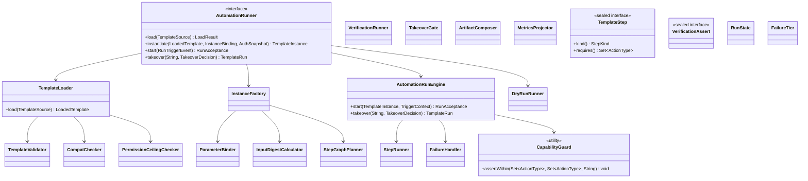
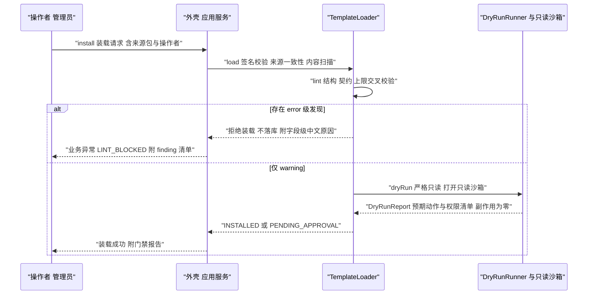
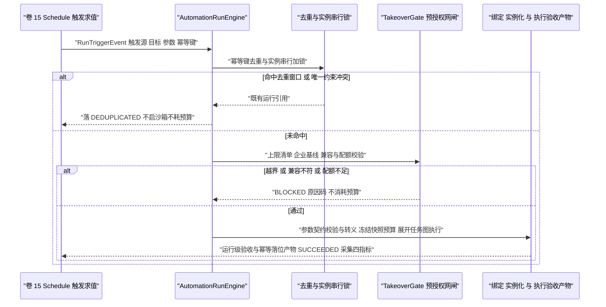
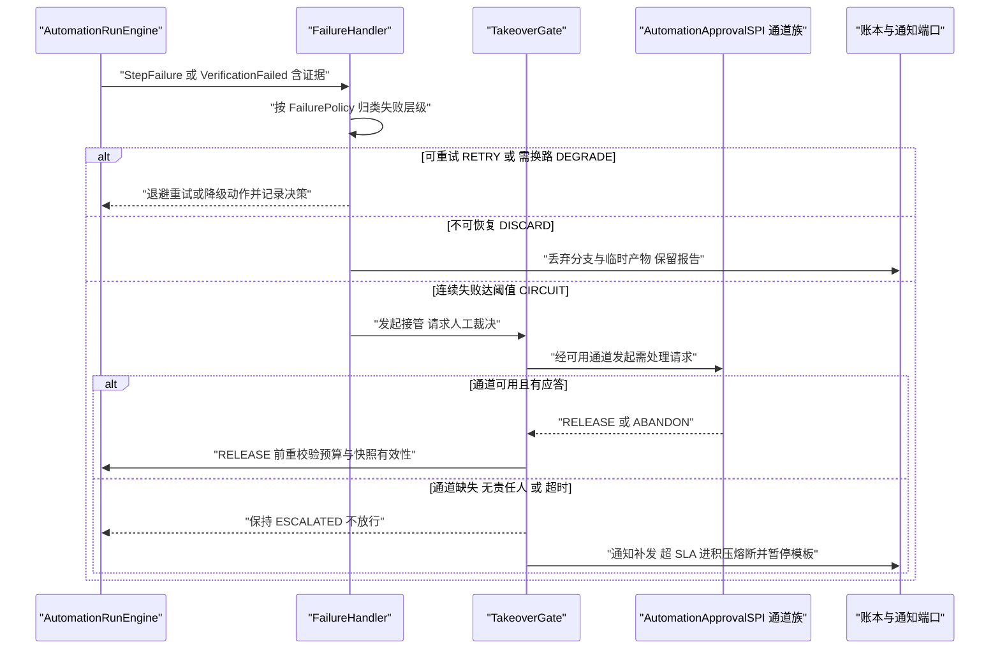
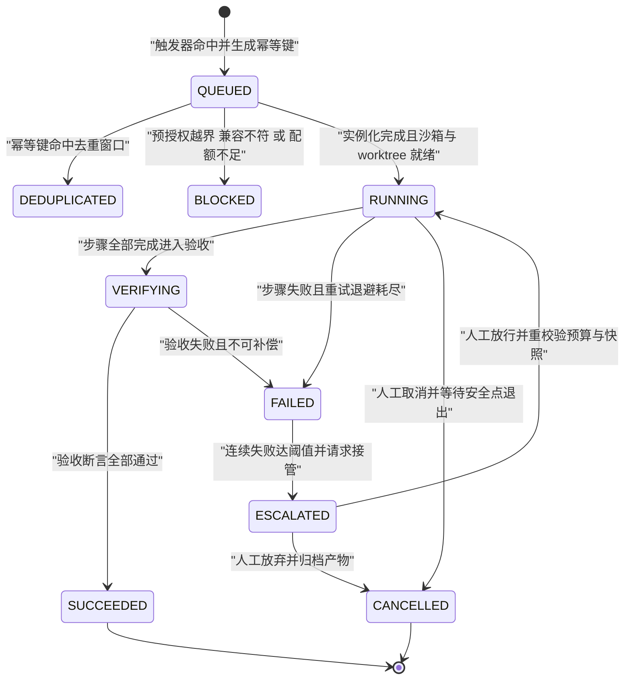

# C35 · AutomationRunner（自动化模板执行器）

> 组件编号 C35 ｜ 组件别名 AutomationRunner（解析 / 校验 / 实例化 / 绑定 / 预授权 / 失败升级）｜ 归属域 自动化模板库（AUTO）
> 上游系统方案：`impl/31-automation-library-impl.md`（下称 impl/31）§1.5 落点、§3.2（I-AUTO-1…8）、§5 类图与签名、§6 时序、§7 状态机、§8 表与事件、§9.2 配置、§10 非功能、§11 DoD；`34-automation-templates.md`（D-AUTO-1…8、§5.2 三层模型与幂等身份、§5.5 状态机、§5.7 权限约束）
> 上游契约：`impl/15`（`SchedulePort` / `RunTriggerEvent`）、`impl/14`（`WorkItemPort` / `StepGraphSpec`）、`impl/06`（`PermissionPort.decide`）、`impl/07`（`SandboxPort.open`）、`impl/21`（worktree 与 PR 通道）、`impl/19`（模板 / 实例 / 账本 / 产物端口）
> 组件清单：`appendix-d-component-inventory.md` P-31 `PlaybookEngine`——本组件为其**执行内核子集**（解析、校验、实例化、绑定、预授权网闸、失败升级），不含 `MarketSyncJob`、REST 面与通知传输
> 竞品证据：Goose `recipe/mod.rs:43-210` 字段集与 `scheduler.rs:275-320` cron/深链 `[E1]`；DeepSeek `workflow` 扇出与 PTC 子调用重入守卫、审批 fail-closed `[E1]`；Claude Code `PermissionRequest` 不可绕过 deny `[E1][E2]`；采纳台账 L-045 / L-046 / L-047 / L-052。编号口径：组件层 `REQ-C-AUTO-01…12`、`I-C-AUTO-1…4`；修订建议自编号 `X-C35-n`（台账止于 X-82，待编排方重编号）；纪律：不推翻系统级方案，冲突一律在文末登记

---

## ① 定位与边界

### 1.1 本组件解决什么

1. **装载与 Fail-Fast 校验**：声明式 YAML → 内核只读定义；签名与来源一致性、内容扫描（禁安装脚本 / 构建钩子 / 网络下载 / 超大文件）、字段级中文校验、兼容与权限上限交叉校验，error 即拒载且不落半成品记录（REQ-C-AUTO-01）。
2. **输入/输出双契约**：`inputs[]` 驱动绑定与五类规则校验（类型 / 枚举 / 范围 / 必填 / 正则）；`outputs[]` 驱动验收断言与产物落位，断言只引用输出 schema 的结构化字段——同一契约两处用，杜绝「响应 schema 与验收标准两套契约」（REQ-C-AUTO-02）。
3. **实例化与授权快照**：`InstanceFactory` 冻结「定义版本 + 参数 + 目标 + 授权快照 + 预算信封」，实例带 `revision` 乐观锁；升级不自动迁移运行中实例。
4. **预授权网闸与能力单调收窄**：装载期静态上限、实例化期 `AuthSnapshot`、动作期决策链三层校验 + `CapabilityGuard` 断言「步骤能力集 ⊆ 运行授权快照 ⊆ 实例化授予集」，越界即中止并产安全事件（REQ-C-AUTO-03）。
5. **步骤展开、幂等与失败升级**：受限步骤展开为卷 14 WorkItem 图（`for-each` 扇出、团队扇出、链式传递），每步 = 一次能力收窄的受限 Turn；幂等四层 + 子调用重入守卫；四级失败升级 + 接管 fail-closed；`DryRunRunner` 严格只读干跑（REQ-C-AUTO-04/05/06/07/10）。

### 1.2 本组件不解决什么

| 不解决 | 归属 | 边界说明 |
| --- | --- | --- |
| 触发求值、jitter、幂等唯一约束、并发策略、熔断状态机 | 卷 15 / `impl/15` | `triggers[]` → `ScheduleDefinition`；`ENABLED` 时注册、`DISABLED` / `DEPRECATED` 时注销 |
| WorkItem 七态状态机、DAG 求解、证据判定 | 卷 14 / `impl/14` | 只产出 `StepGraphSpec` 并回读任务状态驱动失败策略 |
| 权限裁决、审批编排、授权记忆 | 卷 06 / `impl/06` | 本组件声明上限、生成快照、断言收窄，不实现判定链 |
| 沙箱隔离与凭据代理、生成类智能能力 | 卷 07 / 卷 35 | 只消费档位声明与 `SandboxPort.open`；能力经工具 / 技能调用（`compat.requiresSkills[]` 缺失即拒绝） |
| 市场服务端、签名信任根、通知传输、存储 SQL | 卷 29 / 卷 28 / 卷 19 | 只做客户端签名校验收口与端口注入，内核零 IO |

### 1.3 上下游依赖

| 方向 | 依赖对象 | 契约要点 | 失效语义 |
| --- | --- | --- | --- |
| 上游 | 调度（卷 15）、任务（卷 14） | `SchedulePort.register`；`RunTriggerEvent` 幂等键必填；`createGraph` / `stateOf` / `markEvidence` | 注册失败停留 `INSTALLED`；缺幂等键即拒收；提交失败退避重试，仍失败 `FAILED` |
| 上游 | 权限 / 沙箱 / 工作区（卷 06/07/20/21） | `decide` / `open` / `worktreeFor` / `openPullRequest` | 决策链不可用不启动新动作；沙箱不可用不启动运行（不计健康度） |
| 上游 | 模型（卷 02）、持久化与运行时存储（卷 19 + `platform-runtime-store`） | 报告 / 归类 / 摘要；定义 / 实例 / 账本 / 产物端口与去重标记、租约、实例锁、在飞计数 | 模型不可用：报告类降级「数据摘要 + 待人工分析」、可写类 `FAILED`；存储不可写 → 只读模式；Redis 失效 → 语义归 DB 兜底 |
| 下游 | 事件 / 通知 / 端形态 / 评测（卷 16/28/22/23/26） | `automation.*` 全量追加（分区键 `runId`，code 只增不改）；聚合键路由；三端同名命令；门禁项「自动化模板」 | 追加失败即拒绝受理；通知失败降级界面提示；三端只读同一 `RunExplainProjection` |

### 1.4 模块落点与命名

| 层带 | 模块 | 关键类 | Spring |
| --- | --- | --- | --- |
| 契约 | `harness-contract`（`contract/automation`） | `TemplateDefinition`、sealed `TemplateStep` 族、sealed `VerificationAssert` 族、`PermissionCeiling`、`BudgetEnvelope`、`FailurePolicy`、`AuthSnapshot`、枚举 `StepKind` / `RunState` / `FailureTier` / `TemplateLifecycle` | 禁止 |
| 内核 | `harness-kernel/kernel-work`（子包 `work/automation`，复用第 14 步模块） | `AutomationRunner`（门面）、`TemplateLoader`、`TemplateValidator`、`CompatChecker`、`PermissionCeilingChecker`、`ParameterBinder`、`InputDigestCalculator`、`InstanceFactory`、`StepGraphPlanner`、`CapabilityGuard`、`AutomationRunEngine`、`StepRunner`、`VerificationRunner`、`FailureHandler`、`TakeoverGate`、`ArtifactComposer`、`MetricsProjector`、`DryRunRunner` | 禁止 |
| 外壳 / 平台 | `harness-platform/{platform-persistence,platform-runtime-store}`、`harness-host/host-automation`（扩展模块，待卷 27 §4.1 登记） | 仓储与去重适配器（`@Transactional(rollbackFor = Exception.class)`）、`AutomationApplicationService`（事务边界）、`AutomationController`、`MarketSyncJob` | 允许 |

**边界口径**：`AutomationRunner` ≡ impl/31 §⑤ `AutomationRunEngine` + `TemplateLoader` / `InstanceFactory` / `StepGraphPlanner` / `DryRunRunner` 子族的**门面聚合**（load / instantiate / start / takeover 四入口），**不新增第二套引擎**；`oc_automation_step_run` 是审计与成本投影，步骤状态权威仍在卷 14。内核零框架零 IO，DB 版 SPI 由 bootstrap 以 `@ConditionalOnMissingBean` 优先装配。

---

## ② 功能需求清单（REQ-C-AUTO-01…12）

| REQ | 需求描述 | 来源 | 优先级 | 验收要点 |
| --- | --- | --- | --- | --- |
| REQ-C-AUTO-01 | 装载期 Fail-Fast：缺 `steps` / `verification` / `permissions` / `budget` 任一即拒，字段级中文原因 + `automation.template.install.rejected` | impl/31 REQ-AUTO-2、§6.1；卷 34 §2/§9 | P0 | 四类缺字段各 1 例被拒；文案含字段名；拒绝不落库 |
| REQ-C-AUTO-02 | 双契约一致：输入五类规则校验；断言只引用输出 schema 字段，越界即装载失败；`freeform` 仅校验存在性与长度上限 | impl/31 REQ-AUTO-4、I-AUTO-3；卷 34 REQ-AUTO-4；Goose `Recipe.parameters/response` `[E1]` | P0 | 参数越界字段级提示；断言字段对齐有正反例 |
| REQ-C-AUTO-03 | 三层权限 + 不可自我提权：上限清单七项禁请求动作，运行时单调收窄 | impl/31 REQ-AUTO-5、I-AUTO-4；卷 34 §5.7；Claude Code `PermissionRequest` `[E1][E2]` | P0 | 四类越权模板装载被拒并产安全事件；抽样 100 次收窄断言全命中 |
| REQ-C-AUTO-04 | 幂等四层：触发（幂等键 + 去重窗口）/ 实例（串行租约）/ 产物（`(模板, 目标, 幂等键)` 更新而非新建）/ 预算（同 `runId` 去重） | impl/31 REQ-AUTO-6、§5.1；卷 34 §5.2 | P0 | 重复触发不产第二份产物；展示参数变化不改幂等键 |
| REQ-C-AUTO-05 | 四级失败升级 + 人工接管：重试退避 / 换路降级 / 丢弃产物并报告 / 熔断升级人工；通道缺失 **fail-closed**，超 SLA 进积压熔断 | impl/31 REQ-AUTO-7、§6.4；卷 34 D-AUTO-7；DeepSeek 封闭结果集 `[E1]` | P0 | 四级各有用例；通道缺失保持 `ESCALATED` 不放行 |
| REQ-C-AUTO-06 | 步骤展开与扇出：`for-each` 扇出上限入预算；链式模板产出作后序输入；每个子调用独立权限裁决与审计 | impl/31 REQ-AUTO-13、§5.2；卷 34 REQ-AUTO-13；DeepSeek `workflow` / PTC `[E1]` | P1 | 超 `max-step-fanout` 即拒；链式流转有端到端用例 |
| REQ-C-AUTO-07 | 发布门禁：干跑（严格只读、零副作用）+ 沙箱试运行 + 产出断言全过才可 `ENABLED`；报告含每步预期动作与权限清单 | impl/31 REQ-AUTO-11、§6.1；卷 34 REQ-AUTO-11 | P0 | 副作用断言为零（无分支 / PR / 通知）；未过门禁不可启用 |
| REQ-C-AUTO-08 | 产物与度量：四类产物幂等更新；四指标（节省时长 / 发现问题数 / 采纳率 / 单位成本）带缺口标记，缺口 > 20% 降级运行级统计 | impl/31 REQ-AUTO-8/9、I-AUTO-8；卷 34 §5.8 | P1 | 同 PR 评论为更新；缺基准标「估算」 |
| REQ-C-AUTO-09 | 默认只提 PR 不合并 + 每运行独立 worktree 与分支；推主干路径不存在（架构断言） | impl/31 REQ-AUTO-12、§10.6；卷 21 D-GIT-2 | P0 | 运行永不推主干；合并由人或 CI 承担 |
| REQ-C-AUTO-10 | 可控面四件套：三端可发现同名、可取消（安全点退出且保留已发布产物）、可解释（三问同源）、成本可见（三处与指标对账） | impl/31 REQ-AUTO-19、§9.1.1；`impl/30` §7.1 | P0 | 四控制各一条端到端用例；终态取消返回 `CONFLICT` |
| REQ-C-AUTO-11 | 全量审计与回放：触发源 / 步骤 / 裁决 / 产物 / 成本事件化，任取一次运行仅凭事件流可重建全过程 | impl/31 REQ-AUTO-14、§8.3、§11.4；L-052 | P0 | 回放逐段一致；`automation.*` code 只增不改 |
| REQ-C-AUTO-12 | 模板包安全：内容扫描禁安装脚本 / 构建钩子 / 网络下载 / 超大文件；导出包剥离凭证、绝对路径与内部地址 | impl/31 REQ-AUTO-18、§10.6；卷 30 供应链 | P0 | 违规包拒载并产 `automation.template.package.violation` |

> 本表为 impl/31 §② 与卷 34 §2 的**组件级细化视图**（语义同源，不新增系统级需求）；冲突以后者为准并登记修订建议。

---

## ③ 关键设计决策（I-C-AUTO-1…4）

| ID | 维度 | 选定分支（加权分） | 理由与代价 | 回退触发 |
| --- | --- | --- | --- | --- |
| I-C-AUTO-1 | 解析与校验依赖形态 | Jackson YAML 绑定 + 自研 Schema 子集校验器（**86.0**；淘汰全量 Schema 库 70.0、Spring 绑定 63.0） | 只做结构性规则、零运行时代码求值、离线可测、错误文案可控；代价是校验器自建与维护 | 误报率 > 2% → 引入成熟库但保留中文错误映射层（文案契约不变） |
| I-C-AUTO-2 | 运行账本与任务图权威 | 展开 WorkItem 图、卷 14 为步骤权威状态源（**86.0**；淘汰第二套引擎 62.5、无任务图 65.5） | 一套状态机与证据体系，避免双份恢复语义；代价是依赖卷 14 契约稳定 | 卷 14 状态机变更破坏展开语义 → 引入 `StepGraphSpec` 版本化适配层（不改账本口径） |
| I-C-AUTO-3 | 幂等与重入锚点 | DB 唯一约束为正确性锚点 + Redis 去重为快速路径（**87.5**；淘汰 Redis 主承载 72.5、进程内去重 69.5） | 正确性不依赖 Redis；代价是快路径失效时多一次 DB 冲突判定 | 去重窗口内重复率 > 10% → 缩短窗口并告警，**禁止**放宽唯一约束 |
| I-C-AUTO-4 | 接管失败方向 | fail-closed：保持 `ESCALATED` 并暂停后续触发（**86.0**；淘汰 fail-open 60.0、自动放弃 70.0） | 接管请求不静默丢失、失败不被吞掉；代价是通道故障期间模板停摆 | 接管积压 > 24h 未处理 → 降级「自动归档 + 日报聚合 + 告警」 |

**回退纪律**：四条回退触发与 impl/31 §3.2 逐条一致，且只允许「更保守」方向；任何放宽（放宽唯一约束、放行越界动作、静默失败）一律禁止。

## ④ 类图



**说明**：`TemplateStep` 八类 sealed 实现（detect / filter / for-each / apply / run / verify / open-pr / report）与卷 34 §5.1 步骤类型一一对应，新增类型必须实现 `TemplateStepSPI` 并声明风险级别与 `requires()` 供装载期交叉校验；`VerificationAssert` 四类实现（schema / command / scan / artifact）对应四种机械判据（`freeform` 输出仅允许 `exists` 与 `maxLength` 断言）；`RunState` 取值见 §6.1，`FailureTier` 取 `RETRY` / `DEGRADE` / `DISCARD` / `CIRCUIT`（§6.2）。组件对外只暴露 `AutomationRunner` 一门面（ArchUnit 禁止跨包引用实现类）；`CapabilityGuard` / `InputDigestCalculator` 为私有构造纯函数工具类，不持有端口；`StepRunner` / `VerificationRunner` / `ArtifactComposer` / `MetricsProjector` 分别承担逐步执行、断言判定、产物装配与四指标投影。

---

## ⑤ 核心流程时序图

### 5.1 流程 A：装载 → 校验 → 干跑门禁 → 启用

**前置**：签名可验（市场与私仓强制）、`compat` 命中当前契约版本、信任根已配置。**主路径**：装载 → 静态校验 → 兼容检查 → 只读干跑 → `(templateId, version, digest)` 落库为 `INSTALLED` / `PENDING_APPROVAL`。



- **异常与补偿**：校验失败不落库（无半成品）；干跑沙箱打开失败 → 装载挂起并给「稍后重试」入口；落库失败重试 3 次后转人工；签名失败产 `automation.template.signature.failed`。
- **幂等与并发**：同 `(templateId, version, digest)` 重复装载幂等（刷新结论），同版本不同 digest 拒绝（版本号必须自增）；干跑受 `dry-run-timeout-seconds` 与租户并发钳制，超时零副作用。

### 5.2 流程 B：触发 → 去重 → 预授权网闸 → 实例化 → 执行验收与产物

**前置**：模板 `ENABLED`、实例存在且未暂停、许可证与配额有效、责任人可解析。**主路径**：去重（Redis 快速路径 + DB 唯一约束兜底）→ 网闸 → 绑定 → 实例化 → 环境准备 → 任务图提交 → 逐步执行与验收 → 产物幂等落位。



- **异常与补偿**：`BLOCKED` 不消耗预算且保留「为什么没跑」解释；缺参 / 越界即时拒绝并给字段级提示；工作区准备失败按失败策略退避，仍失败落 `FAILED`。
- **幂等与并发**：同实例串行（租约 + 单活跃运行约束）；跨实例并发受租户上限与预算信封双重钳制；jitter 与错过触发由卷 15 负责。

### 5.3 流程 C：失败升级与人工接管（fail-closed）

**前置**：失败已归因（类别、步骤、证据引用）；`failure` 策略存在（缺失用安全默认）；接管责任人已登记。**主路径**：四级升级按序收敛；放行前必须重校验预算余量与快照有效性（快照过期即拒绝放行）。



- **异常与补偿**：接管通道不可用 → **fail-closed**：保持 `ESCALATED` 并暂停后续触发，绝不放行；超 `takeover-sla-minutes` 进积压熔断；人工放弃 → `CANCELLED` 并归档产物。
- **幂等与并发**：重试在同一步骤账本条目上累加 `attempt`（不改写历史）；接管决定幂等（同决定只记一次）；取消等待当前步骤到安全点退出（不强杀进程）。

---

## ⑥ 状态机

### 6.1 模板实例运行态（RunState）



| 当前态 | 允许目标 | 触发 | 备注 |
| --- | --- | --- | --- |
| QUEUED | DEDUPLICATED / BLOCKED / RUNNING / CANCELLED | 去重命中 / 网闸拒绝 / 实例化完成 / 排队中取消 | `BLOCKED` 与 `DEDUPLICATED` 不计入失败率 |
| RUNNING | VERIFYING / FAILED / CANCELLED | 步骤完成 / 退避耗尽 / 人工取消 | 取消 = 安全点退出，不强杀进程 |
| VERIFYING | SUCCEEDED / FAILED | 断言全过 / 失败不可补偿 | 失败必须携带实际值与证据引用 |
| FAILED / ESCALATED | ESCALATED / RUNNING 或 CANCELLED | 连续失败达阈值 / 人工放行 / 人工放弃 | 放行前重校验预算与快照有效性 |

**不变量**：① 终态不可逆，重跑一律新建 `runId`（不改写原记录，见 `X-C35-3`）；② 不得跳过 `QUEUED`（禁止绕过去重与网闸直接执行）；③ `SUCCEEDED` 必须锚定验收断言全通过的证据引用（L-042 双口径）；④ 迁移事件与账本写入同事务（内核出裁决、事务在外壳）。

**步骤执行态（StepState，与运行态共用同一账本）**：`PENDING` → `RUNNING` → `VERIFYING` → `DONE`；可重试失败进 `RETRY_WAIT`（退避后回 `RUNNING`，超上限转 `DISCARDED`）；策略声明换路时转 `DEGRADED` 并在报告标注降级原因；权限拒绝或能力越界断言命中直接 `DISCARDED`；前置不满足且策略允许跳过则 `SKIPPED`。**失败层级映射（`FailureTier`，静态不可变 Map，未知层级拒绝启动）**：`RETRY`（退避重试）→ `DEGRADE`（换路降级并记录决策）→ `DISCARD`（丢弃分支与临时产物、保留报告、`FAILED`）→ `CIRCUIT`（熔断打开、暂停模板触发、发起接管）。`DONE` 步骤产物可被后续步骤消费；`DISCARDED` / `SKIPPED` 必须出现在最终报告原因清单中（不静默）。

---

## ⑦ 接口与依赖矩阵

### 7.1 对外接口（内核契约，零框架依赖）

```java
package com.hk.opencoding.kernel.work.automation;

/** 自动化模板执行器门面：聚合装载、实例化、运行治理与接管四个子族（零框架零 IO，端口由外壳注入）。 */
public interface AutomationRunner {

    /**
     * 装载并校验模板来源包（签名 / 内容扫描 / 字段级校验 / 上限交叉校验）。
     * @param source 模板来源（内置 / 私仓 / 市场 / 离线镜像，必填）
     * @return 装载结论（含字段级发现与干跑门禁报告）
     * @throws HarnessException 校验失败抛 LINT_BLOCKED；签名无效抛 SIGNATURE_INVALID；兼容阻塞抛 COMPAT_BLOCKED
     */
    LoadResult load(TemplateSource source);

    /**
     * 冻结实例化：定义版本 + 参数 + 目标 + 授权快照 + 预算信封。
     * @param template 已装载模板（必填）
     * @param binding 实例绑定（参数、目标、幂等键、并发上限，必填）
     * @param snapshot 授权快照（授予人、动作集、上限与企业基线版本，必填）
     * @return 模板实例（含 revision 乐观锁版本号）
     * @throws HarnessException 预授权越界抛 PREAUTH_DENIED；配额不足抛 QUOTA_EXCEEDED
     */
    TemplateInstance instantiate(LoadedTemplate template, InstanceBinding binding, AuthSnapshot snapshot);

    /**
     * 触发求值命中后启动一次运行（幂等）。
     * @param event 触发事件（触发源、目标、参数与幂等键，必填）
     * @return 受理结果；幂等命中时返回既有运行引用（reused=true）且不消耗预算
     * @throws HarnessException 模板未启用或实例已暂停抛 CONFLICT；越界抛 PREAUTH_DENIED
     */
    RunAcceptance start(RunTriggerEvent event);

    /**
     * 人工接管裁决（放行 / 放弃），仅对 ESCALATED 状态有效。
     * @param runId 运行编号（必填）
     * @param decision 接管决定（RELEASE / ABANDON，必填）
     * @return 裁决后的运行快照
     * @throws HarnessException 当前状态不允许接管抛 CONFLICT（文案含当前态与期望态）
     */
    TemplateRun takeover(String runId, TakeoverDecision decision);
}
```

**层次纪律**：内核只抛 `HarnessException(ErrorCode, 中文文案)`，外壳服务抛 `BusinessException(ErrorCode, 中文文案)`，全局处理器按 `ErrorCode` 映射（`impl/README.md` §5.5 与 X-82）；禁止裸 `RuntimeException`。

### 7.2 依赖与被依赖矩阵

| 关系 | 组件 / 端口 | 契约要点 | 失效影响 |
| --- | --- | --- | --- |
| 依赖 | `SchedulePort`（卷 15）、`WorkItemPort`（卷 14） | 注册 / 注销 `ScheduleDefinition`（幂等键必填）；`createGraph` / `stateOf` / `markEvidence` | 注册失败停留 `INSTALLED`；提交失败退避重试，仍失败 `FAILED` |
| 依赖 | `PermissionPort` / `SandboxPort` / `WorkspacePort` / `CommitPort`（卷 06/07/20/21） | 决策链、沙箱档位、独立 worktree、PR 通道 | 决策链不可用不启动新动作；沙箱不可用不启动运行 |
| 依赖 | 存储端口族 + 运行时存储（卷 19）、`EventPort`（卷 16） | 定义 / 实例 / 账本 / 产物；去重标记、租约、锁、在飞计数；事件追加（分区键 `runId`） | 不可写 → 只读模式拒绝新运行；Redis 失效语义不丢；事件追加失败即拒绝受理 |
| 被依赖 | 三端形态（卷 22/23）、运维（卷 30）、卷 28 / 卷 26 / `impl/32` | `oc auto …` 命令族、运行解释投影；通知聚合键；门禁项；模板步骤调用能力（权限取交集） | 三端只读同一投影；通知失败降级提示；交集为空即模板装载失败 |

### 7.3 配置项（`open-coding.automation.*`，纯数据类不加 `@Component`）

| 配置键 | 含义 | 默认 | 环境变量 |
| --- | --- | --- | --- |
| `max-concurrent-runs-per-tenant` / `max-step-fanout` / `batch-fanout` | 租户并发上限（上限 32，超限排队）/ 团队扇出 / 跨仓批量扇出 | `4` / `8` / `32` | `OC_AUTOMATION_MAX_CONCURRENT_RUNS`、`OC_AUTOMATION_MAX_STEP_FANOUT` |
| `dedup-window-hours` / `default-budget-usd` | 触发去重窗口 / 未声明预算的安全默认 | `24` / `20` | `OC_AUTOMATION_DEDUP_WINDOW_HOURS`、`OC_AUTOMATION_DEFAULT_BUDGET_USD` |
| `min-trigger-interval-minutes` | 最小触发间隔下限（受组织基线钳制） | `5` | `OC_AUTOMATION_MIN_TRIGGER_INTERVAL_MINUTES` |
| `dry-run-timeout-seconds` / `takeover-sla-minutes` | 干跑超时 / 接管 SLA | `60` / `1440` | `OC_AUTOMATION_DRY_RUN_TIMEOUT_SECONDS`、`OC_AUTOMATION_TAKEOVER_SLA_MINUTES` |
| `retention-days` / `metrics-gap-threshold` / `market.signature-required` | 账本保留期 / 缺口阈值 / 强制签名 | `90` / `0.2` / `true` | `OC_AUTOMATION_RETENTION_DAYS`、`OC_AUTOMATION_METRICS_GAP_THRESHOLD`、`OC_AUTOMATION_MARKET_SIGNATURE_REQUIRED` |

**纪律**：全部键以 `${ENV_VAR:default}` 声明并同步 `.env.example`；信任根 `OPEN_CODING_AUTOMATION_MARKET_TRUST_ROOT` 为敏感项（默认留空，启动期 Fail-Fast）；**禁止配置化**：状态机定义、`StepKind` code、幂等键算法、上限清单内容（`config-extraction-rules.md` §8）。

---

## ⑧ 关键算法

### 8.1 算法 A：模板参数校验与响应 schema 契约对齐

① 装载期构建输出 schema 的结构化字段路径集；② 对 `verification[]` 逐条提取断言引用字段，凡不在集合内（且非 `freeform` 允许的 `exists` / `maxLength`）即报 error 级 finding——**断言与 schema 字段机械对齐**，从装载期消灭第二套契约；③ 运行期 `ParameterBinder.bind` 按 `inputs[]` 顺序执行必填 → 类型 → 枚举 → 范围 → 正则五类规则，错误定位到字段名与约束值；④ 绑定值进入命令行前统一转义（防注入），`source=probe` 的探测值标注来源并记审计；⑤ `InputDigestCalculator.digest` 仅对 `behavior=true` 的行为参数按名字字典序排序后取 SHA-256（纯函数，禁读时钟与随机源，保证幂等键可重放）。

**复杂度** O(p + a)（p 参数数、a 断言数）；**边界条件**：`freeform` 仅校验存在性与长度上限；正则编译失败按装载 error；默认值必须自身通过全部规则。

### 8.2 算法 B：权限上限强制（三层 + 单调收窄）

① 装载期 `PermissionCeilingChecker` 交叉校验 `riskLevel` 与 `permissions`（声明与步骤 `requires()` 并集不一致即拒），上限清单七项禁请求动作出现即拒并产 `automation.template.selfmodify.denied`；② 实例化期 `AuthSnapshot` 记录授予人、动作集、上限与企业基线版本，授予集 ∩ 上限后冻结；③ 动作期每步执行前双层断言：先断整图能力上界，再断单步 `requires()`，越界抛 `FORBIDDEN` 并中止整次运行（已落位产物保留）；④ 模板升级或基线变更后旧快照标记失效，失效快照不得放行新步骤。

```java
// 双层防线：计划展开前断言整图上界，每步执行前再断言单步（越界即中止，禁止静默跳过）
CapabilityGuard.assertWithin(instance.authSnapshot().actions(), graph.declaredCeiling(), runId);
CapabilityGuard.assertWithin(run.grantedActions(), step.requires(), runId);
log.info("步骤能力断言通过，runId={}, stepIndex={}, 动作数={}", runId, stepIndex, step.requires().size());
```

**复杂度**：差集 O(|requires|)；**边界条件**：`requires()` 为空集合视为声明错误（装载期拒绝，禁止「无声明即全权」）；决策链返回 `ask` 时按非交互档策略转拒绝并留痕；上限清单为常量（非配置），修改需发版。

### 8.3 算法 C：幂等与重入

① 幂等键 `SHA-256(templateId + version + targetRef + inputsDigest)`（仅行为参数参与）；② 快速路径 `RedisKeys.automationDedup(tenantId, idempotencyKey)` 命中即返回既有运行（不启沙箱、不耗预算）；③ 正确性锚点 `oc_automation_run.uk(tenant_id, idempotency_key)`：插入冲突读回既有行返回 `DEDUPLICATED`（**以 DB 为准**）；④ 实例串行 `RedisKeys.automationInstanceLock(instanceId)` + 30s 租约 / 10s 心跳，Redis 失效退化 PG advisory lock；⑤ `for-each` 子项以 `(runId, stepIndex, itemKey)` 生成子幂等键并继承预算信封，子调用重入完整受守卫管线（权限 + 沙箱 + 审计不旁路）。

```java
// 触发去重：Key 一律经统一工厂生成；去重命中不是失败，必须回填既有 runId 供「为什么没跑」解释
String key = RedisKeys.automationDedup(tenantId, idempotencyKey);
if (!dedupStore.tryMark(key, Duration.ofHours(dedupWindowHours))) {
    log.warn("触发命中去重窗口，templateId={}, 既有 runId={}", templateId, existingRunId);
    throw new HarnessException(ErrorCode.CONFLICT, "同一幂等键在窗口内已受理，已返回既有运行，runId=" + existingRunId);
}
```

**复杂度** O(1) 键查询 + 一次唯一索引冲突判定；**边界条件**：Redis 标记丢失不改变语义（DB 兜底）；去重命中禁止返回空引用；子调用幂等键必须含 `itemKey`，避免扇出项互相吞并。

---

## ⑨ 错误处理与降级

| 场景 | 错误码 | 可重试 | 服务端动作 | 用户可见文案（事实 + 原因 + 动作） |
| --- | --- | --- | --- | --- |
| 模板缺字段 / 契约非法 | `LINT_BLOCKED` | 否 | 拒绝装载 + `automation.template.install.rejected` | 「模板校验未通过：`<field>` 不符合契约；按报告修正该字段后重新装载」 |
| 模板请求越权动作 | `PERMISSION_CEILING_EXCEEDED` | 否 | 拒载或中止运行 + 安全事件 | 「模板请求了超出上限的动作，已拒绝：`<actions>` 不在授权快照内；收敛动作清单后重试」 |
| 未签名 / 签名无效；干跑超时 | `SIGNATURE_INVALID` / `TIMEOUT` | 否 / 是 | 强制模式下直接拒载；干跑超时零副作用并标记超时项 | 「模板签名无效或缺失：包内容与签名不匹配；请使用官方签名包或联系管理员调整信任根」/「干跑超时，发布门禁未通过：可缩小扫描范围后重跑」 |
| 重复触发（去重窗口内） | —（幂等命中） | 是（非错误语义） | 返回既有运行引用 | 「该触发已在窗口内受理；可直接查看既有运行结果 `runId=<id>`」 |
| 并发 / 队列上限 | `RATE_LIMITED` | 是 | 排队（队列 = 上限 × 3）；满则 `automation.run.blocked(QUEUE_FULL)` | 「并发已达上限，已排队：当前租户 `<n>` 个运行在执行；可等待或暂停其他实例后重试」 |
| 预算 / 配额不足 | `QUOTA_EXCEEDED` | 是 | 复用卷 26 准入，不产生部分运行 | 「预算不足，运行未启动：本次需要 `<need>`，剩余 `<left>`；可申请额度、缩小范围或调低模板预算」 |
| 验收断言失败 | `VERIFICATION_FAILED` | 视策略 | 按失败层级重试 / 降级 / 丢弃 + 报告 | 「产出未通过验收断言：`<assertName>` 实际值与期望不符；查看断言明细与证据后修正再重跑」 |
| 接管通道不可用 / 存储不可写 | `DEPENDENCY_UNAVAILABLE` | 是 | 接管 **fail-closed** 保持 `ESCALATED` 不放行（超 SLA 进积压熔断）；存储只读模式拒绝新运行，运行中实例检查点后暂停 | 「接管通道暂不可用：运行保持在待接管状态且不放行；通道恢复后自动补发」/「存储暂不可用：新触发已被拒绝，将在检查点后暂停」 |
| 运行不可取消 / 直达链未确认 | `CONFLICT` / `AUTH_REQUIRED` | 否 | 拒绝取消并返回既有状态；未签名深链拒绝 + 审计 | 「该运行已进入终态，无法取消：当前状态为 `<state>`」/「链接无效，请在应用内发起：签名缺失或未完成二次确认」 |

**降级矩阵**：模型不可用 → 报告类降级「数据摘要 + 待人工分析」，可写类直接 `FAILED`（不产半成品 PR）；Redis 不可用 → 去重归 DB 唯一约束、租约归 PG advisory lock、缓存跳过（WARN）；通知不可用 → 界面提示 + 日志，接管请求保留待办并补发；沙箱不可用 → 不启动运行（不计健康度失败率）；市场不可用 → 缓存目录 + 离线镜像（仍强制签名与清单校验）；**预算闸门 fail-closed**（判定失败即拒绝新运行），**度量 / 观测上报 fail-open**（有意吞异常 + WARN，对齐 M19 与 `impl/26` §⑩.5）。

---

## ⑩ 性能与并发

| 指标 | 预算 | 说明 |
| --- | --- | --- |
| 单模板解析 + 校验 | ≤ 50ms P95 | 12 内置 + 50 组织模板全量装载 ≤ 1.0s；列表查询 ≤ 80ms |
| 触发到实例化调度开销 | ≤ 2s P95 | 不含环境准备；超限即告警并输出分布 |
| 沙箱与 worktree 准备 | ≤ 8s P95（预热命中 ≤ 1s） | 复用预热会话时仍强制独立 worktree 与分支 |
| 干跑（只读） / 单模板度量聚合 | ≤ 60s（可配） / ≤ 200ms | 干跑超时零副作用；缺口 > 20% 降级运行级统计 |

**并发模型**：内核为**无状态裁决器 + 纯内存聚合**，外壳以虚拟线程（`Executors.newVirtualThreadPerTaskExecutor()`）承载单次运行；并发受三层钳制：① 租户级在飞上限（`max-concurrent-runs-per-tenant`，计数经 `RedisKeys.automationTenantInflight`）；② 单实例串行锁；③ 扇出上限（步骤级 8 / 批量 32）。背压：超限排队（队列 = 上限 × 3），队列满拒绝新触发并写 `automation.run.blocked(QUEUE_FULL)`，**绝不无限堆积、绝不丢已受理触发**。

**执行预算（四项硬上限）**：成本 / 时长 / 工具调用数 / 扇出全部来自模板 `budget`（缺省 `default-budget-usd`），超限即停并报告（`onLimitExceeded: stop-and-report`）；预算与租户配额**取更小者**并在事件中标注（`automation.cost.clamped`）；成本记账同 `runId` 幂等，三处显示（预估 / 进行中 / 结算）与 `oc_automation_cost_usd_total{template}` 对账一致。

---

## ⑪ 测试要点

| 层级 | 用例 | 断言要点 |
| --- | --- | --- |
| 单元（纯内核，假时钟） | 装载校验：缺 `steps` / `verification` / `permissions` / `budget` 各 1 例；含安装脚本或网络下载的包 1 例 | 均拒绝且文案含字段名；违规包产 `automation.template.package.violation` |
| 单元 | 契约对齐：五类规则正反例；断言引用非 schema 字段；行为 / 展示参数摘要差异 | 错误定位到字段；对齐失败即装载拒绝；展示参数变不改幂等键 |
| 单元 | 权限上限：`force-push` / 生产写 / 密钥读取 / 权限修改四类模板；`CapabilityGuard` 越界断言 | 装载期即拒（安全事件）；运行期越权中止且事件留痕 |
| 单元 | 失败分级：四类失败映射正确 `FailureTier`；接管通道缺失保持 `ESCALATED` | fail-closed 不放行；超 SLA 触发模板暂停 |
| 集成（Testcontainers：PG + Redis，假模型） | 端到端 12 模板干跑；依赖升级端到端（≤ 3 PR 全绿）；PR 巡检重复触发；幂等四层各 1 例；租户并发上限与队列满；接管闭环两路 | 干跑副作用为零；评论为更新而非新建；`QUEUE_FULL` 拒绝不丢触发；积压超 SLA 暂停模板 |
| 故障注入与回放 | 模型 / Redis / 通知 / 沙箱 / 市场不可用；PG 主库切换；时钟漂移；任取一次运行仅凭事件流重建全过程 | 各按降级矩阵收敛；无半成品 PR；回放逐段一致；`automation.*` code 只增不改 |
| 性能与可控面 | §⑩ 全部指标 + `AutomationControlSurface*Test`（三端同名 / 取消语义 / 解释同源 / 成本对账） | 超阈即失败并输出分布；四控制端到端全绿 |

```bash
# 契约与内核单测（纯 JVM）+ 模板引擎（假时钟、假沙箱）+ 外壳集成（Testcontainers：PG + Redis）
mvn -pl harness-contract -am test -Dgroups=contract
mvn -pl harness-kernel/kernel-work -am test -Dgroups=automation
mvn -pl harness-host/host-automation -am test -Dgroups=integration
# 性能门禁 + 可控面专项（三端入口同名 / 取消语义 / 解释字段同源 / 成本对账）
mvn -pl harness-kernel/kernel-work test -Dgroups=perf -Dperf.profile=automation
mvn -pl harness-host/host-automation -am test -Dgroups=integration -Dtest='AutomationControlSurface*Test'
```

**DoD**：REQ-C-AUTO-01…12 逐条有单测或集成用例；12 内置模板三要素（可执行验证 / 权限天花板 / 失败模式）各一例且纳入流水线阻断项；能力单调收窄不变量随机抽样 100 次全过；三条修订建议已登记待编排方裁决，未裁决前按本文结论施工且不改变任何系统级语义。

---
## 修订建议（本组件登记，待编排方分配 X-n）

1. **`X-C35-1` 扩展点归属补齐**：卷 34 §6 登记 `TemplateFormatSPI` / `TemplateLintRuleSPI` / `ArtifactRendererSPI` 三项，`impl/31` §9.3 SPI 表未收录（只列 8 项）。建议补齐三项的稳定性分级与落点，或明确「格式扩展并入 `TemplateLoaderSPI`、呈现扩展并入 `ArtifactSinkSPI`」。本组件按后者（合并）落地，待裁决。
2. **`X-C35-2` 串行粒度口径统一**：卷 34 §8 写「同一模板并发默认 1」，`impl/31` §6.2 写「同实例串行」。建议统一为「**串行粒度 = 实例（`instanceId`）**，同模板不同实例可并发（受租户上限与预算钳制）」，避免被误读为同模板全局串行而牺牲吞吐。
3. **`X-C35-3` 取消后的重跑语义**：`impl/31` §9.1.1 要求取消后「未产出部分给重跑入口」，但 `CANCELLED` 为终态、重跑必新建 `runId`。建议在卷 34 §5.5 补注「重跑 = 新 `runId`，原记录不改写；同幂等键需显式 `forceRerun` 授权」，避免重跑被误读为状态回退。
