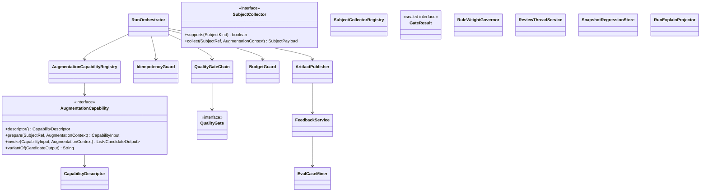
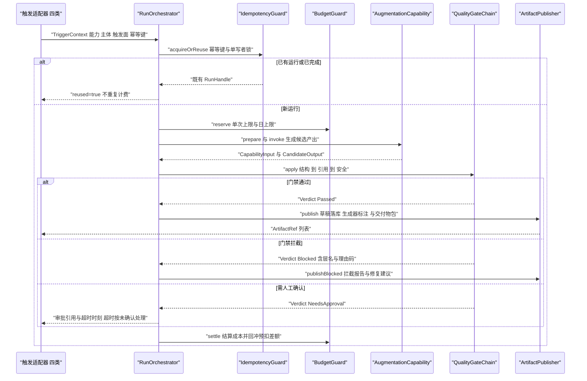
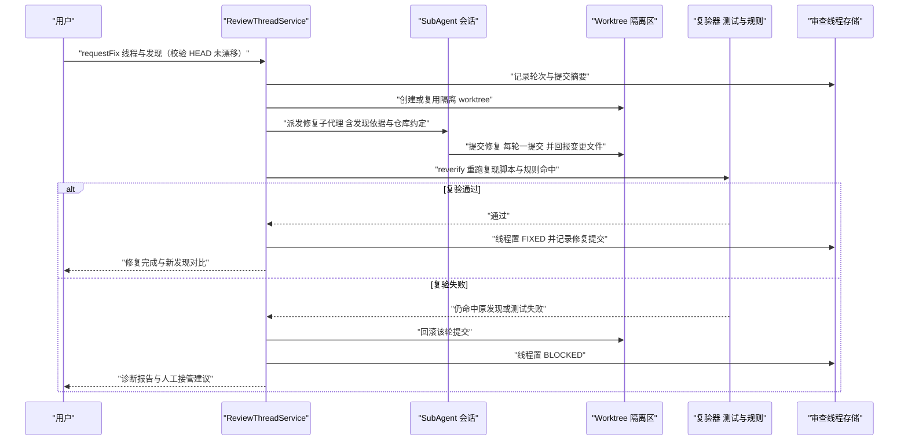
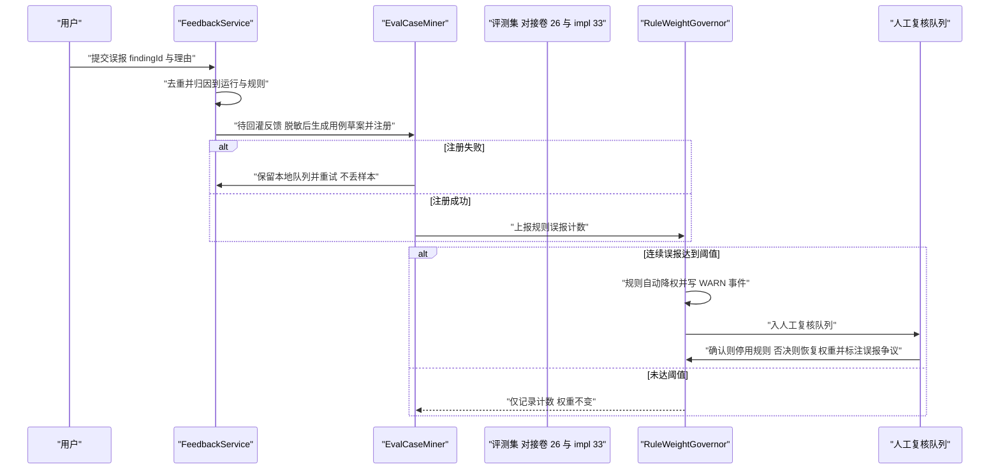
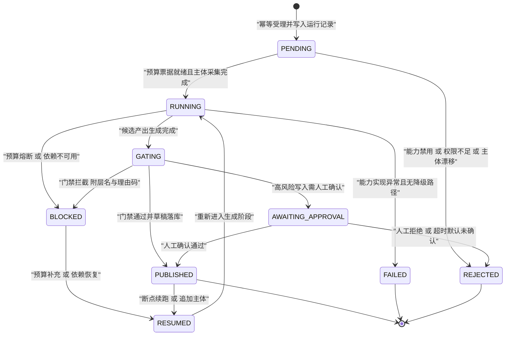

# C36 · AugmentationRunner（智能增强执行器）

> 组件编号 C36 ｜ 组件别名 AugmentationRunner（8 能力包框架：注册 / 触发 / 契约 / 门禁 / 预算 / 反馈）｜ 归属域 智能增强包（INTEL）
> 上游系统方案：`impl/32-intelligent-augmentation-impl.md`（下称 impl/32）§1.4 依赖域带、§3（I-INTEL-1…10）、§5 类图与契约、§6 时序、§7 状态机、§8 表与事件、§9 接口与错误矩阵、§10 非功能、§11 DoD；`35-intelligent-augmentation.md`（D-INTEL-1…8、§1.3 C1–C8 共性约束、§5.3 八项能力详设）
> 上游契约：`impl/12`（Agent 运行时 / `SubAgent`）、`impl/05`（工具管线）、`impl/11`（三路检索）、`impl/16`（事件双通道）、`impl/19`（持久化）、`impl/21`（worktree 与 PR）、`impl/06`（决策链）、`impl/26`（预算与计量，`Verifier` SPI 复用）、`impl/33`（`oc_qa_*` 评测用例台账）
> 组件清单：`appendix-d-component-inventory.md` P-32 `AiFeaturePack`——本组件为其**执行内核子集**（描述符注册、触发适配、输入输出契约、门禁挂钩、成本控制与反馈回灌），不含 REST/WS 装配与界面卡片
> 竞品证据：SWE-agent `review_on_submit_m` 复核环 `[E1]`；Aider `aider:` 前缀 + `/undo` 归属回退 `[E1]`；Qoder Repo Wiki 手工修改保护 `[E2]`；DeepSeek `deliverables/presented` 与 Vitest 期望输出快照 `[E1]`；Claude Code `bashSecurity.ts` 可枚举规则清单 `[E1]`
> 编号口径：组件层 `REQ-C-AUG-01…12`、`I-C-AUG-1…5`；修订建议自编号 `X-C36-n`（台账止于 X-82，待编排方重编号）。纪律：不推翻系统级方案，冲突一律在文末登记，不回改上游文件

---

## ① 定位与边界

### 1.1 本组件解决什么

1. **能力包框架**：一个编排服务 + 描述符 SPI——8 项能力以 `CapabilityDescriptor` 注册，框架只实现一次「注册 / 触发 / 输入契约 / 输出契约 / 门禁 / 预算 / 产出 / 反馈」八件事，治理面不重复实现（REQ-C-AUG-01）。
2. **四类触发同构**：命令 / 事件 / 计划 / 会话内联经适配器统一产出 `TriggerContext`（含幂等键四元组）；内联仅只读子集，写能力必须走命令 / 事件 + 预授权（REQ-C-AUG-02）。
3. **运行治理**：幂等受理（唯一约束 + 锁 + 复用不重复计费）、预算预扣与结算、主体采集（稳定摘要）、候选产出收集、门禁裁决、产出落库与草稿状态机（REQ-C-AUG-03/04/06）。
4. **输出质量门禁**：结构 → 引用 → 安全三层固定顺序 + 条件人工门；`GateResult` 封闭集（Passed / Blocked / NeedsApproval），拦截理由结构化（`gateName` + 理由码 + 中文 detail）；门禁不可用 **fail-closed**（REQ-C-AUG-04）。
5. **成本控制**：单次 / 单日上限、分级模型路由、上下文指纹缓存（TTL 900s）、三级降级（完整产出 → 只给建议 → 只报告），降级必须显式标注（REQ-C-AUG-05）。
6. **闭环与评测挂钩**：四类反馈归因到产出；误报样本回流评测集；规则两段式降权（自动降权 WARN → 人工复核停用）；≥ 4 项能力具备期望输出快照，提示词 / 模型改版前强制回归（REQ-C-AUG-07/08/11）。

### 1.2 本组件不解决什么

| 不解决 | 归属 | 边界说明 |
| --- | --- | --- |
| 任务 DAG、依赖求解、证据验收原语 | 卷 14 / `impl/14` | 增强运行可作为模板步骤被 WorkItem 挂载；挂载时以 WorkItem 为父状态源 |
| 触发器语义与模板库权限上限；评测基座与用例台账 | 卷 15 / 卷 34（`impl/15`、`impl/31`）；卷 26 / `impl/33` | 计划触发复用其触发对象；模板步骤引用能力 ID 时权限上限取交集（空集即装载失败）；只对接用例注册与门禁，不另建用例表（`oc_qa_*` 为权威） |
| 模型路由 / 计量 / 检索内核 / Skill 装载 / 界面呈现 | 卷 02、31、11、08、30 | 调用其预算守卫与计量器（`UsageRecorder` 失败有意吞异常 + WARN，M19）；只定义「哪些检索结果可被引用」；能力正文按 Skill 渐进披露加载 |

### 1.3 上下游依赖

| 方向 | 依赖对象 | 契约要点 | 失效语义 |
| --- | --- | --- | --- |
| 上游 | Agent 运行时（卷 12）、工具管线（卷 05） | `SubAgent` 会话、受限 Turn、工具调用与审批 | 运行时不可用 → 运行 `BLOCKED`（依赖不可用），不产半成品产出 |
| 上游 | 检索（卷 11）、知识权限（卷 24） | 三路混合检索 + 权限过滤 + 索引版本戳 | 检索不可用 → 问答类拒答（`INTEL_EVIDENCE_INSUFFICIENT`），禁止无依据回答 |
| 上游 | 权限（卷 06）、沙箱与工作区（卷 07/21） | 决策链裁决、worktree 隔离、每轮一提交、只提 PR 不合并 | 决策链不可用不启动新动作；worktree 创建失败 → `BLOCKED`（不计能力健康度失败率） |
| 上游 / 下游 | 事件与持久化（卷 16/19）；模板库（卷 34）、CI（卷 29）、端形态（卷 22/23/33） | `ai.*` 事件（`runId` 作 `correlationId`）；模板步骤调用能力 ID；`oc ai review --format sarif --fail-on high` 与退出码；四处入口同名 | 事件追加失败即拒绝受理；存储不可写拒绝新运行；退出码语义稳定；四处入口读同一 `RunExplainView`，禁止各自拼装 |

### 1.4 模块落点与命名

| 层带 | 模块 | 关键类 | Spring |
| --- | --- | --- | --- |
| 契约 | `harness-contract`（包 `contract/intel`，**单模块**） | `AugmentationCapability`、`CapabilityDescriptor`、`QualityGate`、sealed `GateResult`、`TriggerContext`、`CapabilityInput`、`CandidateOutput`、`SubjectRef`、枚举 `CapabilityCategory` / `TriggerKind` / `GateProfile` / `ModelTier` / `CapabilityForm` | 禁止 |
| 平台（外壳） | `harness-platform/platform-intel`（扩展模块，待卷 27 §4.1 登记） | `AugmentationCapabilityRegistry`、`RunOrchestrator`、`IdempotencyGuard`、`SubjectCollectorRegistry`、`QualityGateChain`、`BudgetGuard`、`ArtifactPublisher`、`FeedbackService`、`EvalCaseMiner`、`RuleWeightGovernor`、`ReviewThreadService`、`SnapshotRegressionStore`、`RunExplainProjector` | 允许 |
| 装配 | `harness-host/host-intel`（扩展模块，待登记；受阻则降为 `host-protocol` 的 `intel.*` 面 + `host-app` 装配） | `IntelAutoConfiguration`（`@ConditionalOnProperty(prefix = "open-coding.intel", name = "enabled")`）、能力 Provider 注册（`@ConditionalOnMissingBean` 允许企业覆盖）、`IntelCommandFacade`（CLI 动词注入） | 允许 |

**边界口径**：本组件**不改动 `harness-kernel`**（零内核改动，仅复用运行时 / 工具 / 事件）；`AugmentationRunner` ≡ impl/32 §5 的 `RunOrchestrator` + 注册表 / 门禁链 / 预算守卫 / 产出与反馈管道的**门面聚合**，方法语义与 impl/32 §5/§6 一致；契约零框架，装配与事务边界集中在 `host-intel` / `platform-intel`。

---

## ② 功能需求清单（REQ-C-AUG-01…12）

| REQ | 需求描述 | 来源 | 优先级 | 验收要点 |
| --- | --- | --- | --- | --- |
| REQ-C-AUG-01 | 描述符注册与校验：缺触发面 / 输入契约 / 输出契约 / 工具依赖 / 写范围 / 门禁档 / 预算档任一即注册失败；工具依赖须已注册；写能力 `inlineAllowed=false` | impl/32 REQ-INTEL-I01、§5.1；卷 35 REQ-INTEL-1、D-INTEL-7 | P0 | 启动期注册表断言；用例覆盖七类缺字段；描述符可导出 Skill 清单 |
| REQ-C-AUG-02 | 四类触发适配同构：命令 / 事件 / 计划 / 内联产出同一 `TriggerContext`；内联仅只读子集且可见标注「只读」 | impl/32 REQ-INTEL-I02、§9.3.1；卷 35 D-INTEL-2/D-INTEL-4 | P0 | 同一能力四种触发产出结构一致（契约测试）；写能力内联触发被拒 |
| REQ-C-AUG-03 | 运行幂等：幂等键 `(capabilityId, subjectRef, subjectDigest, promptVersion)` 唯一约束 + 分布式锁；命中返回既有运行且不重复计费 | impl/32 REQ-INTEL-I03、§5.1；卷 35 §5.2 | P0 | 并发同主体只产生一次计费；`reused=true` 复用既有 `RunHandle` |
| REQ-C-AUG-04 | 三层门禁链（结构 → 引用 → 安全）+ 条件人工门；拦截理由结构化且可解释；无生成器标注 / 无引用 / 含密钥三类被拦 | impl/32 REQ-INTEL-I04、§5.1；卷 35 §1.3 C1/C4、D-INTEL-3 | P0 | 门禁顺序固定、短路生效；拦截不抛异常而收敛为 `BLOCKED` 报告 |
| REQ-C-AUG-05 | 预算守卫与三级降级：单次 / 单日上限、进度可见、超限可断可续；降级链路可观测且在产出中显式标注 | impl/32 REQ-INTEL-I05/I23、I-INTEL-9；卷 35 D-INTEL-6 | P0 | 超限中断保留已完成部分并可续跑；无 `cost.degrade.applied` 事件即视为未降级 |
| REQ-C-AUG-06 | 产出状态机：DRAFT / EDITED / ADOPTED / REJECTED / SUPERSEDED；人工校订（EDITED）不被重生成覆盖，`SUPERSEDED` 保留历史 | impl/32 REQ-INTEL-I06/I12、§7；卷 35 D-INTEL-8、`07` 手工修改保护 `[E2]` | P0 | 重生成不覆盖 `EDITED`（用例）；`ADOPTED` 后不得再变 `SUPERSEDED` |
| REQ-C-AUG-07 | 反馈四类（采纳 / 编辑 / 驳回 / 误报）可归因到运行与产出；反馈以 `(findingId, submitter)` 去重 | impl/32 REQ-INTEL-I07、§6.5；卷 35 REQ-INTEL-14 | P0 | 反馈事件含 `runId` + `artifactId` / `findingId`；重复提交只记一次 |
| REQ-C-AUG-08 | 误报回流评测集 + 规则两段式降级：连续误报达阈值自动降权（WARN + 事件）→ 人工复核停用或恢复；样本脱敏入集 | impl/32 §6.5、§4.3；卷 35 C8、D-INTEL-5 | P0 | 自动降权与人工复核全链路走通；回灌队列积压 > 1000 暂停自动入集 |
| REQ-C-AUG-09 | 生成物归属与回退：产出带生成器标注（模型 + 提示词版本 + 能力版本）；生成类变更可一键撤销且撤销后工作区与提交一致 | impl/32 REQ-INTEL-I11、I-INTEL-3；卷 35 REQ-INTEL-15；Aider 归属契约 `[E1]` | P0 | 缺生成器标注被门禁拦；撤销后 `git status` 与 HEAD 断言一致 |
| REQ-C-AUG-10 | 审查多轮修复线程：发现 → 追问 → 修复 → 复验 → 关闭；每轮一提交、复验失败回滚该轮并置 `BLOCKED`；HEAD 漂移标记「基于旧版本」 | impl/32 REQ-INTEL-I10、I-INTEL-6、§6.2；卷 35 §5.3② | P0 | 端到端用例（发现 → 修复 → 复验通过）；轮次上限默认 6，超限不发第三次自动修复 |
| REQ-C-AUG-11 | 评测挂钩与快照回归：≥ 4 项能力（PR 描述 / 审查 / 测试生成 / 问答）具备期望输出快照；提示词 / 模型改版前强制回归，刷新需人工确认 | impl/32 REQ-INTEL-I20、I-INTEL-10；卷 35 REQ-INTEL-16 | P1 | 改版未过回归即拒绝发布；快照刷新留痕（防「刷快照」掩盖回归） |
| REQ-C-AUG-12 | 治理不旁路 + 可控面：全部运行过卷 06 决策链 / 卷 07 沙箱 / 卷 24 审计与 DLP（架构断言无 bypass）；取消在批次边界让出；`--explain` 三问与成本三处同源对账 | impl/32 REQ-INTEL-I24/I25、§9.3.1；卷 35 REQ-INTEL-17 | P0 | 架构断言测试通过；四处入口同名；成本三处与 `oc_ai_cost_usd_total{capability}` 对账一致 |

> 口径：本表为 impl/32 §②（`REQ-INTEL-I01…I25`）与卷 35 §2.3 的**组件级细化视图**（语义同源，不新增系统级需求，冲突以后者为准并登记修订建议）；八项能力清单（`pr.description` / `test.gen` / `code.migrate` / `review.bot` / `flaky.detect` / `doc.drift` / `digest.standup` / `repo.qa`）见卷 35 §5.3 与 impl/32 §5.2。

---

## ③ 关键设计决策（I-C-AUG-1…5）

| ID | 维度 | 选定分支（加权分） | 理由与代价 | 回退触发 |
| --- | --- | --- | --- | --- |
| I-C-AUG-1 | 框架宿主与层带 | 统一编排服务 + 描述符 SPI；契约零框架、实现在外壳（**87.5**；淘汰每能力独立服务类 68.5、每能力独立进程 65.0） | 治理只实现一次、新增能力边际成本最低；代价是抽象需一次到位 | 能力数 > 24 或出现跨租户硬隔离要求 → 抽独立 `intel-worker` 进程（接口不变） |
| I-C-AUG-2 | 运行承载 | 独立运行实体（`oc_ai_run` + 独立状态机）且可被 WorkItem 挂载（**85.5**；淘汰无实体直跑 SubAgent 70.0、复用 WorkItem 全量语义 76.0） | 度量 / 续跑 / 幂等三者可得，问答与内联场景不过重；代价是两套状态需同步（挂载时以 WorkItem 为父） | 运行表 > 2000 万行/年 → 按 `created_at` 分区 + 冷归档 |
| I-C-AUG-3 | 门禁位置与失败方向 | 平台侧门禁链 + 复用卷 26 `Verifier` SPI；门禁不可用 **fail-closed**（**85.5**；淘汰提示词自检 64.0、端侧门禁 62.5） | 三端一致、拦截理由结构化可解释；代价是内联场景 +100–400ms | 内联 P95 > 30s → 安全扫描异步后置（先出草稿，落盘前仍拦截） |
| I-C-AUG-4 | 误报回流承载 | 两段式：自动降权（WARN + 事件）→ 人工复核停用或恢复；样本脱敏入评测集（**85.5**；淘汰仅统计 66.5、达阈值直接停用 75.5） | 闭环收敛且不漏检（保守方向默认保持降权态）；代价是需人工复核队列与 SLA | 回灌队列积压 > 1000 → 暂停自动入集，仅保留人工标注 |
| I-C-AUG-5 | 内联子集与写能力边界 | 内联仅只读子集（问答 / 解释 / 汇总草稿）；写能力仅命令与事件面 + 预授权（**84.5**；淘汰全能力内联 70.5、内联完全不可用 69.0） | 会话内不做不可逆动作；代价是用户需切到命令面 | 写能力采纳率 < 30% 连续 2 周 → 收窄为「只给建议」，重新收集反馈 |

**回退纪律**：五条回退触发与 impl/32 §3.2（I-INTEL-1/2/4/8/7）逐条一致；回退只允许「更保守」方向（收窄写范围、扩充门禁、降低预算），任何放宽（跳过门禁、放宽预算、内联直达写入）一律禁止。

---

## ④ 类图



**说明**：`GateResult` 为 sealed 接口，三个 record 实现 `Passed` / `Blocked(gateName, reasonCode, detail)` / `NeedsApproval(approvalRef, expiresAt)`——用封闭集表达「拦截 / 需确认」的附加信息，避免布尔返回值退化（impl/32 §5.1）。`RunOrchestrator` 属**外壳层**（`platform-intel`，Spring 装配点与事务边界在此），其余契约类型属零框架契约层；`descriptor()` 是注册与门禁的唯一事实源（缺必填字段即注册失败）。`RuleWeightGovernor` 承担规则两段式降权的计数与状态迁移（§8.3），`EvalCaseMiner` 只产出用例草案（去重键 `(tenantId, capabilityId, input_digest)`），注册接口复用 `impl/33` 的 `oc_qa_*` 台账（不建第二套用例表）。`SnapshotsRegressionStore` 存期望输出快照（对象存储 + 人工确认刷新），`RunExplainProjector` 产出三问同源投影（`RunExplainView`）供 CLI / TUI / 桌面共用。

---

## ⑤ 核心流程时序图

### 5.1 流程 A：一次增强运行的完整生命周期

**前置**：能力已注册且启用；调用方具备触发面权限；幂等键四元组可计算；预算余量可预扣。**主路径**：触发 → 幂等受理 → 预算预扣 → 主体采集 → 能力调用 → 门禁三层 → 产出落库 → 成本结算。



- **异常与补偿**：主体采集失败 → 回滚运行记录（不产半成品）；门禁拦截转 `BLOCKED` 报告（非异常）；预算熔断 → `BLOCKED` 可续跑（保留已完成部分）。
- **幂等与并发**：幂等键唯一约束 + Redisson 锁（同主体并发只产生一次计费）；`reused=true` 复用既有 `RunHandle`；缓存命中不跳过门禁（门禁作用于产出而非输入）。

### 5.2 流程 B：审查机器人多轮对话式修复

**前置**：审查运行已产出发现（含 `ruleId` 与置信度）；用户选择「请修复」；隔离 worktree 可创建。**主路径**：requestFix → 校验 HEAD 未漂移 → 隔离 worktree → 修复子代理（每轮一提交）→ 复验（复现脚本 + 规则重跑）→ 置 `FIXED`。



- **异常与补偿**：worktree 创建失败 → 降级为「patch 提案」形态（`INTEL_WORKSPACE_UNAVAILABLE`，不计能力健康度失败率）；复验失败不自动重试第三次（轮次上限 `max-turns=6`）；HEAD 漂移 → 标记「基于旧版本」并要求重跑。
- **幂等与并发**：同一 `(threadId, findingId)` 的重复 `requestFix` 幂等返回既有轮次；每轮提交与回滚以提交摘要为身份，避免串轮；线程与工作区 HEAD 关联。

### 5.3 流程 C：误报回灌评测集与规则两段式降级

**前置**：发现带 `ruleId` 或可归因到模型通道；反馈者具备该运行可见性；评测集注册接口可用（不可用时本地队列不丢样本）。**主路径**：提交误报 → 归因 → 生成用例草案脱敏注册 → 规则误报计数 → 达阈值自动降权（WARN）→ 人工复核终止（停用或恢复）。



- **异常与补偿**：评测集注册失败 → 反馈仍保留在本地队列（不丢样本）并重试；人工复核超时 → 规则保持降权态（保守方向），不自动恢复；回灌队列积压 > 1000 → 暂停自动入集。
- **幂等与并发**：反馈以 `(findingId, submitter)` 去重；同一规则并发降权只产生一次状态迁移（计数和权重写入走事件，可回放）。

---

## ⑥ 状态机

### 6.1 能力运行态（AugmentationRunState）



| 当前态 | 允许目标 | 触发 | 备注 |
| --- | --- | --- | --- |
| RUNNING | GATING / BLOCKED / FAILED | 候选产出就绪 / 预算熔断或依赖不可用 / 实现异常 | `BLOCKED` 可续跑；`FAILED` 必须携带原因与证据；`PENDING` 阶段主体漂移释放预扣预算 |
| GATING | PUBLISHED / BLOCKED / AWAITING_APPROVAL | 三层全过 / 任一层拦截 / 高风险写入 | 顺序固定且短路；拦截不进入人类视野 |
| AWAITING_APPROVAL | PUBLISHED / REJECTED | 人工确认 / 人工拒绝或超时（默认 24 小时） | 超时按未确认处理（保留草稿，不落地） |
| PUBLISHED / BLOCKED | RESUMED → RUNNING / 终态 | 续跑或追加主体 | 产出保持草稿态，人工校订版本永不被覆盖 |

**不变量**：① 终态不可逆；② 门禁顺序固定（结构 10 → 引用 20 → 安全 30 → 人工 40，禁止配置化）；③ `PUBLISHED` 产出必带生成器标注（C1）；④ 运行事件全量（`runId` 作 `correlationId`），支持回放重建。

### 6.2 产出生命周期（AugmentationArtifactState）

`DRAFT`（门禁通过并落库）→ `EDITED`（用户校订）→ `ADOPTED`（采纳或合并）→ 终态；`DRAFT` / `EDITED` 可 `REJECTED`（驳回）或 `SUPERSEDED`（主体变更后重生成）；`REJECTED` 可 `INGESTED`（误报或驳回样本回灌评测集）→ 终态。**约束**：`ADOPTED` 之后不得再变 `SUPERSEDED`（已采纳产出必须保留引用，供审计与度量）；`EDITED` 版本在重生成时**不得被覆盖**——新建 `SUPERSEDED` 记录并保留人工版本（对齐卷 07 Repo Wiki 手工修改保护 `[E2]`）；`SUPERSEDED` 为逻辑历史保留，不物理删除（合规删除优先级更高）。

---

## ⑦ 接口与依赖矩阵

### 7.1 契约接口（零框架依赖）

```java
package com.hk.opencoding.contract.intel;

/** 增强能力 SPU：实现方只负责「把主体变成候选产出」，门禁 / 预算 / 产出 / 反馈由平台统一治理。 */
public interface AugmentationCapability {

    /** @return 能力描述符（注册与门禁的唯一事实源，不可为 null；缺必填字段即注册失败） */
    CapabilityDescriptor descriptor();

    /**
     * 采集主体并装配能力输入。
     * @param subject 主体引用（diff / 测试运行 / 文档目录 / 时间窗口 / 问题，必填）
     * @param ctx 运行上下文（只读视图、预算票据、权限端口，必填）
     * @return 能力输入（含主体摘要，供幂等与缓存使用）
     * @throws HarnessException 主体不可解析或已过期时抛出（内核层带，见 §⑨）
     */
    CapabilityInput prepare(SubjectRef subject, AugmentationContext ctx);

    /**
     * 执行生成并返回候选产出（尚未过门禁）。
     * @param input 能力输入（必填）
     * @param ctx 运行上下文（必填）
     * @return 候选产出列表（可为空列表表示无发现；不返回 null）
     * @throws HarnessException 预算耗尽、权限不足或依赖不可用时抛出
     */
    List<CandidateOutput> invoke(CapabilityInput input, AugmentationContext ctx);

    /** @param output 候选产出（必填）；@return 变体标识（默认返回提示词版本；无变体时返回基线标识） */
    default String variantOf(CandidateOutput output) {
        return output.promptVersion();
    }
}
```

> `GateResult` 的 sealed 定义（`Passed` / `Blocked(gateName, reasonCode, detail)` / `NeedsApproval(approvalRef, expiresAt)`）以 impl/32 §5.1 为权威，本组件原样引用，不新增第四种裁决形态。

**层次纪律**：契约层（`contract/intel`）与能力内核抛 `HarnessException(ErrorCode, 中文文案)`；`host-intel` / `platform-intel` 外壳服务抛 `BusinessException(ErrorCode, 中文文案)`；全局处理器按 `ErrorCode` 映射（`impl/README.md` §5.5 与 X-82），禁止裸 `RuntimeException`。`QualityGate.order()` 取值必须来自 `GateOrder` 常量（`PLAN` 见修订建议 `X-C36-1`）。

### 7.2 依赖与被依赖矩阵

| 关系 | 组件 / 端口 | 契约要点 | 失效影响 |
| --- | --- | --- | --- |
| 依赖 | Agent 运行时与工具管线（卷 12/05）、检索与权限（卷 11/24） | `SubAgent` 会话、受限 Turn、工具调用重入受守卫管线；三路混合检索 + 权限过滤 + 索引版本戳 | 运行时不可用 → 运行 `BLOCKED`；检索不可用 → 问答拒答；跨租户缓存永不命中 |
| 依赖 | 权限 / 沙箱 / Git（卷 06/07/21） | 决策链、worktree 隔离、每轮一提交、只提 PR | 决策链不可用不启动新动作；worktree 失败降级 patch 提案 |
| 依赖 | 事件 / 持久化 / 预算（卷 16/19/26） | `ai.*` 事件（`runId` 作 `correlationId`）；表族与对象存储；`Verifier` SPI 与预算守卫 | 事件追加失败即拒绝受理；存储不可写拒绝新运行；计量上报 fail-open（M19） |
| 被依赖 | 模板库（卷 34）、CI（卷 29）、端形态（卷 22/23/30） | 模板步骤引用能力 ID（权限上限取交集）；SARIF 与退出码；四处入口同名 + 解释与成本同源 | 交集为空即模板装载失败；退出码语义稳定；三端只读同一投影 |

### 7.3 配置项（`open-coding.intel.*`，纯数据类不加 `@Component`）

| 配置键 | 含义 | 默认 | 环境变量 |
| --- | --- | --- | --- |
| `run-budget-usd` / `daily-budget-usd` | 单次运行 / 租户日预算上限 | `2.0` / `50.0` | `OPEN_CODING_INTEL_RUN_BUDGET_USD`、`OPEN_CODING_INTEL_DAILY_BUDGET_USD` |
| `max-concurrent-runs` / `inline-timeout-seconds` | 并发运行上限（超出排队不拒绝）/ 内联时延上限 | `4` / `30` | `OPEN_CODING_INTEL_MAX_CONCURRENT_RUNS`、`OPEN_CODING_INTEL_INLINE_TIMEOUT_SECONDS` |
| `default-model-tier` / `gate.safety-async` | 默认模型档 / 安全扫描异步后置（仅内联，落盘前仍拦截） | `efficient` / `false` | `OPEN_CODING_INTEL_DEFAULT_MODEL_TIER`、`OPEN_CODING_INTEL_GATE_SAFETY_ASYNC` |
| `review.min-confidence-to-comment` / `review.max-turns` / `doc-drift.allowed-write-paths` / `migration.batch-size` | 最低评论置信度 / 轮次上限 / 文档修订写路径白名单 / 迁移批次大小（10–200） | `MEDIUM` / `6` / `docs/**` / `50` | `OPEN_CODING_INTEL_REVIEW_MIN_CONFIDENCE`、`_REVIEW_MAX_TURNS`、`_DOC_DRIFT_WRITE_PATHS`、`_MIGRATION_BATCH_SIZE` |
| `feedback.auto-downweight-threshold` / `cache.ttl-seconds` | 规则连续误报降权阈值 / 上下文缓存 TTL | `3` / `900` | `OPEN_CODING_INTEL_FEEDBACK_DOWNWEIGHT_THRESHOLD`、`OPEN_CODING_INTEL_CACHE_TTL_SECONDS` |

**纪律**：全部键以 `${ENV_VAR:default}` 声明并同步 `.env.example`；模型凭据走环境变量并在启动期 Fail-Fast；**禁止配置化**：能力 ID、规则 ID、事件类型名、门禁顺序、状态机定义、能力分类（`config-extraction-rules.md` §8）。Redis Key 一律经 `RedisKeys` 工厂生成（`intelRunProgress` / `intelIdempotent` / `intelLock` / `intelBudget` / `intelContextCache`），缓存键**必须含租户**、问答类**必须含权限指纹**。

---

## ⑧ 关键算法

### 8.1 算法 A：能力触发判定（触发面矩阵裁决）

① 能力可用性：`registry.require(capabilityId)` 不存在即拒绝（不静默降级到其他能力）；② 触发面校验：`trigger.kind() ∈ descriptor.triggers()`，否则 `INTEL_FEATURE_DISABLED`（附可用触发面清单）；③ 内联约束：`kind = INLINE` 时必须 `inlineAllowed = true` 且 `writeScopes` 为空集——写能力内联触发一律拒绝（越权用例）；④ 事件频控：单能力事件触发日频 > 200 → 自动降级为「手动 + 计划」（写 WARN 事件）；⑤ 幂等键：`SHA-256(capabilityId + subjectRef + subjectDigest + promptVersion)`，`subjectDigest` 由 `SubjectCollector` 提供稳定摘要（禁读时钟与随机源）；⑥ 能力形态：描述符可导出 Skill 清单（含界面描述与依赖工具声明，L-084），Skill 与内置实现差异率 > 5% 触发回退（关闭 Skill 覆盖层）。

`// 触发面裁决`：内联仅只读子集，写能力必须走命令或事件面——越权即拒（`FORBIDDEN`），禁止静默改道。

**复杂度** O(1) 判定位运算 + 一次摘要计算；**边界条件**：`subjectDigest` 变化（新提交）即缓存与幂等同时失效；触发面集合为空视为描述符非法（注册期拒绝）。

### 8.2 算法 B：输出质量门禁链（结构 → 引用 → 安全 → 人工）

① 固定顺序由 `order()` 常量决定（结构 10 → 引用 20 → 安全 30 → 人工 40），任一层返回 `Blocked` 即短路，整体裁决为 `GateVerdict.Blocked(gateName, reasonCode, detail)`；② 结构层校验输出 schema（六段 / 字段齐备）与生成器标注（C1：缺 `generator` 即拦）；③ 引用层校验引用存在性与可打开性：结论类输出强制引用（C4），无引用标注「推断」；问答类引用覆盖率为 0 即拦（`INTEL_EVIDENCE_INSUFFICIENT`），审计类每条发现须带 `evidenceRef`；④ 安全层为确定性规则清单（危险 API / 密钥模式 / 注入模式，`ruleId` 可查可单测可降权）+ 生成物回显密钥模式拦截；⑤ 人工门仅在「高风险写入（迁移 / 文档修订 PR / 自动隔离标记）」时追加，超时按未确认处理；⑥ **fail-closed**：门禁组件（规则库 / 引用解析器）加载失败时不放行、不降级门禁档位，运行置 `BLOCKED` 且产出留草稿；⑦ 缓存命中不跳过门禁（门禁作用于产出，不作用于输入）。

```java
// 门禁链：顺序固定且短路；拦截以 BLOCKED 收敛（WARN + 计数），不抛异常、不进入人类视野
GateVerdict verdict = gateChain.apply(runId, candidate);
if (verdict.blocked()) {
    log.warn("增强产出被门禁拦截，runId={}, gate={}, reason={}", runId, verdict.gateName(), verdict.reasonCode());
}
```

**复杂度** O(n·c)（n 候选产出、c 门禁层数，c ≤ 4 且短路）；**边界条件**：`GateOrder` 为常量（禁止配置化）；规则降权不改变「命中即拦」的默认处置（降权只影响评论呈现与阻塞等级）。

### 8.3 算法 C：误报回流评测集与规则两段式降级

① 反馈归因：`(findingId, submitter)` 去重后归因到 `runId + ruleId`（或模型通道），写 `ai.finding.false_positive`；② 样本脱敏：仅保留白名单字段（输入摘要、期望处置、来源运行 ID），评测用例**不含用户私有内容**；③ 用例草案去重键 `(tenantId, capabilityId, input_digest)`，注册失败入本地队列并重试（不丢样本）；④ 计数与阈值：规则误报计数按日滚动，达 `auto-downweight-threshold`（默认 3）触发**自动降权**（写 WARN 事件 + 入人工复核队列）；⑤ 人工复核：确认则停用规则（`DISABLED`），否决则恢复权重并标注「误报争议」；**超时保持降权态**（保守方向），不自动恢复；⑥ 积压熔断：回灌队列积压 > 1000 → 暂停自动入集，仅保留人工标注。

`// 两段式降权`：自动降权只到「降权（WARN + 事件）+ 入人工复核队列」，停用必须经人工确认（防自动误伤规则）。

**复杂度** O(1) 计数 + 一次 CAS 状态迁移；**边界条件**：同一规则并发降权只产生一次状态迁移（CAS 失败即弃本地动作）；权重与计数写入走事件可回放；阈值命中与人工结论均入审计。

---

## ⑨ 错误处理与降级

| 场景 | 错误码 | 可重试 | 服务端动作 | 用户可见文案（事实 + 原因 + 动作） |
| --- | --- | --- | --- | --- |
| 能力未注册 / 被禁用 | `INTEL_CAPABILITY_NOT_FOUND` / `INTEL_FEATURE_DISABLED` | 否 | 拒绝 + 审计（含能力 ID）；入口置灰并说明来源 | 「该能力不可用：`<capabilityId>` 未注册或被管理员策略禁用；可改用 `oc ai list` 中其他能力或联系管理员开通」 |
| 主体已变更（漂移） | `INTEL_SUBJECT_STALE` | 是 | 不消耗预算（预扣释放） | 「内容已更新：主体摘要与运行时不一致，可能已有新提交；刷新后基于最新版本重试」 |
| 预算耗尽 | `INTEL_BUDGET_EXCEEDED`（退出码 30） | 是（可续跑） | `BLOCKED` 可续跑，保留已完成部分 + `ai.budget.exhausted` | 「已达预算上限，本次运行未产出：本次需要 `<need>` 超过剩余 `<left>`；可提额、缩小范围或缩短时间窗后续跑」 |
| 门禁拦截 | —（`BLOCKED` 报告） | 是（修正后重跑） | 产出门禁报告（非异常），计数 `oc_ai_gate_block_total{gate}` | 「产出未通过门禁：`<gateName>` 判定「`<detail>`」；已保留草稿，按报告修正后可重新运行」 |
| 引用证据不足（问答） | `INTEL_EVIDENCE_INSUFFICIENT` | 是 | 以事件形式返回（非 HTTP 错误）；拒答率入指标 | 「依据不足，无法回答：检索未命中可引用片段；可缩小范围、改用关键词或指定文件路径后再问」 |
| worktree 不可用 | `INTEL_WORKSPACE_UNAVAILABLE` | 是 | 运行置 `BLOCKED`；不计能力健康度失败率；可降级 patch 提案 | 「隔离环境暂不可用：worktree 创建失败或不可写；稍后重试，或改用「patch 提案」形态查看修复内容」 |
| 门禁链自身不可用 | `INTEL_GATE_UNAVAILABLE` | 是 | **fail-closed**：不放行、不降级门禁档位；产出留草稿 | 「产出暂不可发布：校验组件不可用；稍后重试，期间产出保留为草稿且不会进入他人视野」 |
| 审查线程关闭 / 迁移规格歧义 | `INTEL_THREAD_CLOSED` / `INTEL_THREAD_BLOCKED` / `INTEL_SPEC_AMBIGUOUS` | 否 | 拒绝写入轮次 / 拒绝启动（fail-fast，不猜） | 「该线程已关闭或需人工接手：复验连续失败或线程已归档；可新建线程发起新一轮修复」/「迁移规格存在歧义项：`<items>` 无法唯一判定；按提示补全规格后重新启动」 |
| 运行不可续跑 / 不可取消 / 跨租户访问 | `INTEL_RUN_NOT_RESUMABLE` / `INTEL_RUN_NOT_CANCELLABLE` / `CROSS_TENANT_DENIED` | 否 | 状态校验拒绝（不假装成功）；跨租户拒绝 + 安全审计 | 「该运行状态不支持续跑或取消：当前状态为 `<state>`；可新建运行或对失败部分单独重跑」/「无权访问该运行：属于其他租户 / 项目；可走导出流程或申请查看」 |

**降级矩阵**：模型不可用 → 规则 / 模板降级路径（报告类转结构化清单）；Git 不可用 → 只读能力可用、写入能力暂停（`BLOCKED`）；检索不可用 → 问答拒答而非无依据回答；Redis 不可用 → 退化为 DB advisory lock 并下调并发；**预算闸门 fail-closed**（判定失败即拒绝新运行），**计量与观测上报 fail-open**（`UsageRecorder` / 引用观测写入失败有意吞异常 + WARN，不影响主链路，边界口径：闸门管「花不花」、上报管「记不记得」）；三级降级路径（完整产出 → 只给建议 → 只报告）必须显式标注（`cost.degrade.applied` 复用卷 26 口径，无事件即视为未降级）。

---

## ⑩ 性能与并发

| 场景 | 指标 | 目标 |
| --- | --- | --- |
| 内联（PR 描述 / 问答首字节） | P95 | ≤ 30s（可配 `inline-timeout-seconds`） |
| 单次运行受理 / 门禁链 / 安全扫描 / 产出落库 / 进度查询 | P95 | ≤ 200ms / ≤ 300ms / ≤ 400ms（100–400ms）/ ≤ 150ms / ≤ 1s 刷新粒度 |
| 单能力日均成本 | 门禁 | 不超预算 150%；超出即告警并自动关停待人工重开 |

**并发模型**：运行编排的 I/O 等待用虚拟线程承载（`Executors.newVirtualThreadPerTaskExecutor()`）；能力内部 Agent 调用复用卷 12 并发原语；单机并发上限 `max-concurrent-runs`（默认 4）**超出排队而非拒绝**；同一 `(capabilityId, subjectRef)` 串行化（锁 + 幂等键）；批量能力（迁移 / 覆盖补强）在**批次边界让出**：每批结束后检查预算与取消信号（取消保留已发布产出与草稿，未完成部分标 `CANCELLED` 可重跑）。

**执行预算与成本控制**：单次上限 `run-budget-usd`（默认 2.0）+ 租户日上限 `daily-budget-usd`（默认 50.0）双闸门；分级路由（能力 × 阶段）+ 上下文指纹缓存（`subjectDigest + promptVersion + 索引版本 + 权限指纹`，TTL 900s，命中不计费并单独打点 `oc_ai_cache_hit_ratio`）；三级降级触发条件：单次预算剩余 < 30% 且未完成关键阶段 → 一级降二级；模型连续 2 次调用失败或安全扫描不可用 → 二级降三级；容量按 10k 用户、20% 日活、人均 3 次/日测算 ≈ 6,000 次/日、`oc_ai_run` 年增 ≈ 220 万行（分区 + 冷归档），成本占卷 31 全量模型成本 0.22%–0.28%。

---

## ⑪ 测试要点

| 层级 | 用例 | 断言要点 |
| --- | --- | --- |
| 单元（纯逻辑） | 描述符七类缺字段；触发面矩阵（含写能力内联拒绝）；门禁链顺序与短路；假测试检测（无断言 / 恒真）；Flaky 三法交叉与六类归因；降级阶梯判定 | 注册失败字段级报错；内联写能力被拒；三层短路与 `GateResult` 封闭集；单次失败不标记 flaky |
| 集成（Spring + PG + Redis） | 一次运行端到端（四种触发面各一）；超预算中断与续跑；门禁拦截三场景（无引用 / 无生成器标注 / 含密钥）；`EDITED` 不被覆盖；反馈四类落库与回灌入集；并发同主体 | 四触发产出同构；超限保留已完成部分；拦截不进入人类视野；并发只产生一次计费 |
| 契约 | 交付物包 schema 版本；SARIF 输出结构；CLI JSON 与退出码（0/10/20/30/40/50）；Skill 清单与内置实现一致性；事件清单与卷 16 目录一致 | 包结构稳定；退出码语义稳定；差异率 > 5% 触发回退 |
| 回放（离线） | 以录制事件与假模型重放：审查线程完整修复轮次；迁移分批与失败批次隔离；问答拒答路径 | 回放逐段一致；失败批次回滚不影响已完成批次；无依据拒答率 100% |
| 快照回归与故障注入 | ≥ 4 项能力期望输出快照且改版前强制回归；模型超时 / 检索 / Git / worktree / 审批超时 / Redis 不可用（降级并降并发）；越界写路径拒绝；跨租户缓存不命中 | 未过回归即拒绝发布；各按降级矩阵收敛；问答不返回无权内容；门禁链不可用 fail-closed |
| 可控面 | 四处入口命令同名；`oc ai explain` 三问与桌面面板同源；`oc ai cancel` 批次边界生效且不丢已发布产出；成本三处对账；三级降级显式标注 | 终态返回 `INTEL_RUN_NOT_CANCELLABLE`；成本与 `oc_ai_cost_usd_total{capability}` 一致；无静默降级 |

```bash
# 契约与平台编译 / 单测 / 集成（Testcontainers：PG + Redis）
mvn -pl harness-contract,harness-platform/platform-intel -am compile
mvn -pl harness-platform/platform-intel -am test
# 外壳契约测试（CLI 与 REST）+ main 链路回归 + 端到端样例（迁移与审查线程）
mvn -pl harness-host/host-intel -am test
mvn -pl harness-host/host-bootstrap -am test
mvn -pl harness-platform/platform-intel -am verify -Dintel.e2e=true
# 可控面专项（入口同名 / 取消 / 解释同源 / 成本对账）
mvn -pl harness-host/host-intel -am test -Dtest='IntelControlSurface*Test'
```

**DoD**：REQ-C-AUG-01…12 逐条有单测或集成用例；8 项能力全部注册且四种触发面各有一个端到端用例；探索性架构断言（无跳过门禁 / 审计 / 沙箱的调用路径）在 CI 强制；≥ 4 项能力具备快照回归；三条修订建议已登记待编排方裁决，未裁决前按本文结论施工且不改变任何系统级语义。

---
## 修订建议（本组件登记，待编排方分配 X-n）

1. **`X-C36-1` `GateOrder` 常量类未登记**：impl/32 §5.1 `QualityGate.order()` 要求「取值必须来自 `GateOrder` 常量」，但 §5/§8/§9 均未收录该类，门禁顺序（10/20/30/40）也无登记位置。建议在 impl/32 §5.1 补 `GateOrder` 常量类定义并注明「顺序禁止配置化」，本组件暂按 10/20/30/40 落地待裁决。
2. **`X-C36-2` 内联时延与安全扫描开关的语义边界**：`inline-timeout-seconds`（默认 30s）与 `gate.safety-async`（默认 false）并存时，「内联 P95 ≤ 30s」的达成条件不清（模型往返为主项）。建议明确「内联仅只读子集 + 轻量门禁档」并把 30s 定义为**降级触发线**（超线转异步后置且落盘前仍拦截），而非硬 SLA。
3. **`X-C36-3` 产出「编辑」双轨口径统一**：产出状态机 `DRAFT → EDITED` 与反馈事件 `ai.artifact.edited` 均表达「编辑」语义，易出现两套事实源。建议统一为「状态迁移产生事件」的单向口径（禁止单独提交 edited 反馈），并在 `oc_ai_feedback.kind` 中显式固定 `ADOPT / EDIT / REJECT / FALSE_POSITIVE` 的写入路径与去重键。
