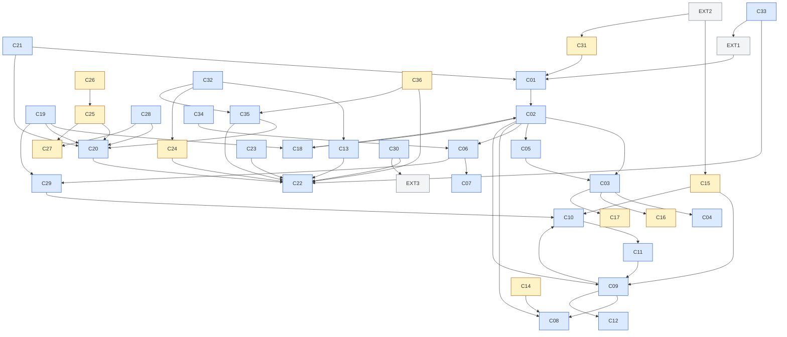

# 组件级实现方案索引（`docs/harness/impl/components/`）

> 本目录是 Phase B 实现层的**第三级交付**：在系统级方案（`impl/NN-*-impl.md`，35 份）之下，把「manager / 执行器 / 注册表 / 网关级」组件细化到类、算法、表、错误矩阵与 DoD 的施工粒度，共 36 份 `C01…C36`（每份 400–450 行，全中文）。
> 上游输入：36 卷 Phase A 设计（what/why）、`impl/NN-*-impl.md` 系统级方案（how 的骨架）、`research/`（9 家竞品源码级证据 `[E1]`–`[E4]`）。
> 纪律：组件方案**不推翻**系统级与 Phase A；凡冲突/缺口一律在各文件「修订建议」登记（本目录 §5 汇总），由编排方并入 `impl/IMPL-DECISIONS.md` §4，不回改上游文件。
>
> **索引收口（R10）**：本目录的上一层索引为 `docs/harness/README.md` §2 卷册地图（`impl/components/` 行）；组件 ↔ 附录 D 137 项的映射登记在 `docs/harness/appendix-d-component-inventory.md` 的「组件级方案」列（R10 新增；59 行命中 `components/Cxx-*.md`，78 行由系统级方案覆盖）；本目录的建议号段已并入 `impl/IMPL-DECISIONS.md` §4（X-83…X-89 为 R07 预占、X-90…X-96 为 C05/C06 候补、X-97…X-215 为本册余量 119 条）。

---

## 1. 本目录定位

### 1.1 与系统级方案的分工

| 维度 | 系统级方案（`impl/NN-*-impl.md`） | 组件级方案（本目录 `C*.md`） |
| --- | --- | --- |
| 回答的问题 | 该系统「怎么做」：域内架构、`I-<域>-n` 决策、与卷册契约的衔接 | 该组件「如何落到类与断言」：类族、算法、字段、错误矩阵、单测/故障注入 |
| 粒度 | 一个系统 = 一卷（400–450 行 × 35 份） | 一个组件 = 一类（manager / 执行器 / 注册表 / 网关）（400–450 行 × 36 份） |
| 决策编号 | `I-<域>-n`（只增不复用，登记于 `IMPL-DECISIONS.md` §2） | `I-C-<别名>-n`（组件内局部号段，待编排方裁决后并入台账） |
| 冲突处理 | 冻结口径，不因组件层回改 | 一律登记「修订建议」（`X-Cxx-n` / `R-Cxx-n` / `Cxx-Gn`），见 §5 |
| 权威性 | 组件的上游；组件只做细化与补充登记 | 在未裁决前按组件结论施工，**不得**改变任何系统级语义 |

### 1.2 写作模板摘要（11 节固定顺序 + 文末修订建议）

| 节 | 内容 | 硬性要求 |
| --- | --- | --- |
| ① 定位与边界 | 一句话定位；边界内/外；上下游依赖表；模块落点（契约/内核/平台/外壳） | 冲突登记指引必须写明「不回改上游」 |
| ② 功能需求清单 | `REQ-C-<别名>-n`：描述 + 来源（impl/卷/竞品证据）+ P0/P1/P2 + 验收要点 | 每条可指回系统级 REQ 或卷决策 |
| ③ 关键设计决策 | `I-C-<别名>-n`：≥2 分支比选 + 选定 + 代价 + 回退触发 | 与系统级 `I-<域>-n` 同源者显式声明 |
| ④ 类图 | Mermaid `classDiagram`；关键 Java 21 签名 | 签名禁止魔法值与裸异常 |
| ⑤ 核心流程时序图 | Mermaid `sequenceDiagram`（每份 2–4 个） | 配前置条件 / 主路径 / 异常补偿 / 幂等并发点 |
| ⑥ 状态机 | Mermaid `stateDiagram-v2`（每份 1–2 张） | 迁移表与非法迁移处置齐备 |
| ⑦ 接口与依赖矩阵 | 端口 / SPI / API / 事件 / 错误码 / 配置项 | 敏感项留环境变量 |
| ⑧ 关键算法 | 判定规则、阈值、恢复/降级算法 | 阈值可配置化或给出常量出处 |
| ⑨ 错误处理与降级 | 错误矩阵（场景 → ErrorCode → retryable → 动作 → 文案）+ 降级矩阵 | 文案中文；状态流转含两侧状态 |
| ⑩ 性能与并发 | 预算数字、并发模型、锁/背压/取消传播、可观测 | 数字须可核（指回系统级或本组件测算） |
| ⑪ 测试要点（DoD） | 单测/集成/契约/故障注入/性能门禁 + 可执行命令 | 每条断言可机械执行 |
| 文末 | 修订建议登记块（自编号，待并号） | 编号口径与影响面逐条列明 |

### 1.3 谁该读哪一层

- **架构/评审**：读每个组件 §①–§③（边界、REQ、比选结论与回退）+ 本目录 §3 依赖图 + §5 建议表；30–60 分钟可核对一个组件是否越界。
- **实现者**：按本目录 §4 的运行路径分组顺序通读目标组件的全文；先读其「上游系统方案」对应 `impl/NN` §3/§5/§8，再读组件 §④–§⑧ 落类与算法。
- **集成/装配**：读组件 §⑦（依赖矩阵）与 §①.4（模块落点），确认内核（零框架）与外壳/平台（Spring 装配）边界与 `@ConditionalOnMissingBean` 归属。
- **测试/运维**：读组件 §⑨–§⑪（错误矩阵、降级、DoD 命令）与各文件 DoD 勾选清单；运维面另读 C21/C25/C26/C29/C30/C33/C34 等治理类组件。

---

## 2. 组件索引总表

> **数据来源（全部为实跑命令，非人工估算）**：REQ 数 = `grep -oE 'REQ-C-[A-Z0-9]+-[0-9]+' FILE | sort -u | wc -l`；I-C 数 = `grep -oE 'I-C-[A-Z0-9]+-[0-9]+' FILE | sort -u | wc -l`；图数 = `grep -c '```mermaid' FILE`；状态机 = `grep -c 'stateDiagram-v2' FILE`（0 则无）；文末修订建议数 = 各文件「修订建议」登记块条目清点（编号口径行自声明区间交叉核对）。
> **全量复算**：`cat C*.md | grep -oE 'REQ-C-[A-Z0-9]+-[0-9]+' | sort -u | wc -l` = **411**（按文件求和 **425**，差额 14 为 C06/C26 共用 `MR`、C25/C32 共用 `RC` 的跨文件字符串重号，见 §6）；`I-C` 同式 = **140**（按文件求和 **148**，重号 8 处）；图合计 **186**（flowchart 2 + classDiagram 36 + sequenceDiagram 98 + stateDiagram-v2 50，复算 `cat C*.md | grep -c 'stateDiagram-v2'` = 50、`grep -c 'flowchart'` = 2）。

| 编号 | 组件 | 所属系统 | 职责一句话 | REQ 数 | I-C 决策数 | 图数 | 状态机有无 | 文末修订建议数 |
| --- | --- | --- | --- | --- | --- | --- | --- | --- |
| C01 | SessionManager | `impl/01` | 会话注册表、durable 准入回执、单飞队列策略、执行体状态机与断线续传编排 | 12 | 4 | 5 | 有（×2） | 3 |
| C02 | AgentLoop | `impl/12` | Thread/Turn/Item 原语与七阶段主循环、检查点与轨迹导出 | 12 | 4 | 6 | 有（×2） | 3 |
| C03 | ContextAssembler | `impl/03` | 九区段组装、逐段预算、来源三态与缓存断点 | 12 | 4 | 4 | 有（×1） | 4 |
| C04 | CompactionEngine | `impl/03` | 四级压缩管线、双水位熔断与压缩回灌 | 11 | 5 | 4 | 有（×1） | 4 |
| C05 | PromptAssembler | `impl/04` | 提示词五阶段确定性组装、作用域合并与静态边界快照 | 12 | 4 | 5 | 有（×1） | 3 |
| C06 | ModelRouter | `impl/02` | 规则路由、候选硬过滤、灰度滚动与档位映射 | 12 | 4 | 5 | 有（×1） | 4 |
| C07 | ModelAdapterFamily | `impl/02` | 四协议族五实例适配、三段流式解析与错误/用量归一 | 14 | 4 | 4 | 有（×1） | 3 |
| C08 | ToolRegistry | `impl/05` | 工具契约单点事实源：注册期 Fail-Fast、冻结与目录 | 12 | 4 | 4 | 有（×1） | 3 |
| C09 | ToolExecutor | `impl/05` | 工具执行管线与递归参数校验、围栏化执行接入 | 12 | 4 | 5 | 有（×1） | 2 |
| C10 | PermissionEngine | `impl/06` | 权限决策链 R0–R5、风险分级与策略求值 | 15 | 4 | 6 | 有（×2） | 3 |
| C11 | ApprovalOrchestrator | `impl/06` | 审批升级链、批量传播与端上应答裁决 | 12 | 4 | 7 | 有（×1） | 5 |
| C12 | SandboxRunner | `impl/07` | 五档隔离执行编排、围栏/网络/密钥代理与取消语义 | 13 | 4 | 7 | 有（×1） | 5 |
| C13 | SkillRegistry | `impl/08` | 技能包发现/激活/能力声明与组织覆盖裁决 | 10 | 4 | 4 | 有（×1） | 2 |
| C14 | MCPClientManager | `impl/09` | MCP 客户端连接生命周期、并行启动与隔离自愈 | 10 | 4 | 4 | 有（×1） | 3 |
| C15 | MCPServerExporter | `impl/09` | 以 MCP Server 对外暴露只读能力面（授权交集、撤销 drain） | 10 | 3 | 6 | 有（×2） | 2 |
| C16 | MemoryManager | `impl/10` | 记忆写入/召回双管线与文件化、候选择优与合规删除 | 14 | 3 | 5 | 有（×1） | 2 |
| C17 | KnowledgeIndexer | `impl/11` | 知识索引构建、三路检索与 repo map 符号索引 | 12 | 5 | 5 | 有（×1） | 3 |
| C18 | SubAgentRouter | `impl/12` | 子代理幂等派发、预算隔离与结构化失败回流 | 12 | 5 | 5 | 有（×1） | 3 |
| C19 | TeamOrchestrator | `impl/13` | 团队编制/拓扑/黑板/仲裁与预算熔断 | 11 | 4 | 6 | 有（×2） | 5 |
| C20 | WorkItemEngine | `impl/14` | 四层任务模型、七态状态机、DAG 与证据验收 | 9 | 5 | 6 | 有（×2） | 5 |
| C21 | GoalScheduler | `impl/15` | Goal 自治循环、达成判定与 Schedule 触发器仲裁 | 12 | 4 | 5 | 有（×2） | 3 |
| C22 | EventBus | `impl/16` | 事件信封、分区有序、双通道推送、回放与合规删除 | 12 | 4 | 5 | 有（×2） | 4 |
| C23 | HookEngine | `impl/17` | 钩子点匹配、阻断改写与脚本沙箱执行 | 12 | 4 | 5 | 有（×1） | 4 |
| C24 | PluginLoader | `impl/18` | 插件装载：类加载隔离、依赖求解与 disposer 语义 | 12 | 4 | 5 | 有（×1） | 4 |
| C25 | RecoveryCoordinator | `impl/19` | 崩溃恢复唯一扫描/判定入口与启动门禁 | 12 | 4 | 5 | 有（×2） | 5 |
| C26 | MigrationRunner | `impl/19` | 迁移计划与 expand-contract 三阶段执行、会话日志段代管理 | 11 | 4 | 5 | 有（×2） | 4 |
| C27 | WorkspaceProviderManager | `impl/20` | 本地/SSH/容器/云工作区连接池与命令通道 | 12 | 4 | 6 | 有（×2） | 5 |
| C28 | GitWorktreeManager | `impl/21` | worktree 隔离决策、提交护栏与合并队列 | 11 | 4 | 6 | 有（×2） | 5 |
| C29 | CostLedger | `impl/26` | 预扣/结算双式记账、成本归因与对账 | 12 | 4 | 5 | 有（×1） | 3 |
| C30 | AuditTrail | `impl/25` | 三级审计、哈希链、WORM 归档与篡改证据 | 12 | 4 | 5 | 有（×1） | 3 |
| C31 | RemoteAgentGateway | `impl/24` | A2A/ACP 入站服务面与出站 RemoteAgent 适配 | 12 | 4 | 6 | 有（×2） | 3 |
| C32 | RegistryClient | `impl/29` | 市场/Registry 检索、签名校验与离线镜像 | 12 | 4 | 7 | 有（×2） | 3 |
| C33 | UpdateManager | `impl/28` | 三通道更新、防降级、灰度回滚与许可 | 10 | 4 | 4 | 有（×1） | 5 |
| C34 | QualityHarness | `impl/33` | 假模型、故障注入、录制回放与基准运行器 | 12 | 5 | 4 | 有（×1） | 5 |
| C35 | AutomationRunner | `impl/31` | 自动化模板装载校验与实例化执行 | 12 | 4 | 5 | 有（×1） | 3 |
| C36 | AugmentationRunner | `impl/32` | 八项智能增强能力的统一编排、门禁与反馈 | 12 | 5 | 5 | 有（×1） | 3 |
| — | **合计（36 份）** | 29 个系统级文件 | — | **425** | **148** | **186** | 36/36 有 | **129**（去重 126，见 §5） |

---

## 3. 依赖关系图（内核 / 外壳 / 端侧）

> 箭头 = **调用/数据流方向（A → B 表示 A 调用 B，或把数据/事件交给 B）**；边取自各文件 §①/§1.3「上下游依赖」表与正文引用，省略逐条事件边（全部组件事件统一进 C22）。节点编号 → 组件名见 §2 索引表；底色 = 带归属（浅蓝 = 内核带 26 个：C01–C13 / C18–C23 / C28–C30 / C32–C35；浅黄 = 外壳带 10 个：C14–C17 / C24–C27 / C31 / C36；浅灰 = 端侧与外部触点 EXT1–3）。端侧（CLI/TUI/桌面，impl/22/23/30）不在本目录，仅以 EXT 触点出现；C33 另有端侧宿主 `UpdateHost`、C35/C36 有三端同名命令入口。



**读图要点**：① 主链路 = `EXT1 → C01 → C02`，C02 分叉四向：`C03 →（C04 压缩 / C16 记忆 / C17 符号图）`、`C05（提示词制品回流 C03 区段）`、`C06 → C07 → C29 计量`、`C09 →（C08 注册表互查 / C10 → C11 审批 / C12 沙箱）`；② C19/C21 向上编排 C18/C20、向下经 C29 记账；③ C25 是恢复唯一入口（C26 启动门禁 → C25 → C20/C27），任何组件不得自建第二扫描器；④ 全部组件的事件统一进 C22（图中为代表性连线，省略逐条）；⑤ 内核带与外壳带以端口/事件协作（如 C13 的平台侧实现 SkillSourcePort、C36 声明不改动内核），边为运行期协作而非编译依赖。

---

## 4. 按运行路径分组（阅读顺序）

> 五组即五条阅读路径；组内序号为推荐阅读序（依赖前置在前），组间无先后。

- **A 会话主链路（启动 → 回合 → 工具 → 审批 → 沙箱 → 结果）**：C01 → C02 → C03 → C04 → C05 → C06 → C07 → C08 → C09 → C10 → C11 → C12 → C13 → C14 → C15（准入/主循环 → 上下文/压缩 → 提示词 → 模型 → 工具 → 权限审批 → 沙箱 → Skill/MCP 扩展面）。
- **B 协作与自治（团队 / 任务 / Goal / 事件 / Hooks / 插件）**：C22 → C18 → C19 → C20 → C21 → C23 → C24（先读全量观测面事件总线，再读子代理—团队—任务—Goal 委派编排阶梯，最后读 Hooks 与插件两个扩展执行面）。
- **C 数据与恢复**：C16 → C17 → C27 → C28 → C25 → C26（上下文侧数据资产 → 执行侧数据面 → 崩溃恢复 → 迁移执行；后两者消费前四者的待重放队列/租约/段清单）。
- **D 企业治理（成本 / 审计 / A2A / Registry / 更新 / 质量）**：C29 → C30 → C31 → C32 → C33 → C34（治理基座 → 跨组织边界 → 制品分发链 → 质量门禁与回放）。
- **E 产品能力（自动化 / 增强）**：C35 → C36（复用任务引擎、模板库与事件面的产品化收口）。

---

## 5. 修订建议索引

> 范围：36 份组件文档中出现的全部本地建议（`X-Cxx-n` / `R-Cxx-n` / `Cxx-Gn` / 候补 `X-9x`）。**R10 更新**：以上建议已由编排方并入 `impl/IMPL-DECISIONS.md` §4 号段登记（X-83…X-89 为 R07 预占转正、X-90…X-96 为 C05/C06 候补自留、X-97…X-215 为本册余量 119 条；合计号段占用 215 条），并号规则见 `SUGGESTIONS.md` §1；各组件文件内「待并号」回填为正式 `X-n` 仍按各文件维护约定执行。此前口径（本册并入前）：该台账止于 X-82 且不含组件文件引用（`grep -n 'components/\|C0[0-9]' IMPL-DECISIONS.md` 零命中）。口径：文件登记共 **129** 条；3 对同源/重复登记合并为单行（`X-C09-2 = X-C10-3`、`R-SM-1 = R-AL-2`、`X-C23-4 = X-C24-1`）→ 唯一 **126** 条。严重度判据：**阻塞** = 原文自标阻塞或在 B4/B6 迁移冻结、启动门禁、全局错误映射前必须裁决；**重要** = 契约/表/配置/事件/错误码/安全缺口；**一般** = 措辞、命名、指针、计数、图示、口径澄清。明细与并号提案见 `SUGGESTIONS.md`。

| 建议编号 | 内容一句话 | 出处 | 严重度 | 建议落点 |
| --- | --- | --- | --- | --- |
| R-SM-1 | 输入表口径统一为同一物理表（会话/Agent 两表语义重叠） | C01 | 重要 | impl/01 §8.1、impl/12 §8.1、impl/19 B1 批次 |
| R-SM-2 | 会话执行权 Redis Key 收敛为单一命名族并注明不承载正确性 | C01 | 一般 | impl/01 §8.2、impl/12 §8.2 |
| R-SM-3 | 会话保留三态（L-083）在 oc_session 语义补归属说明 | C01 | 重要 | oc_session 语义、卷 15/19 |
| R-AL-1 | InputAdmission 同名双域重命名（Session/Turn 前缀） | C02 | 重要 | impl/01 §5.1、impl/12 §1.5、附录 C |
| R-AL-3 | 会话执行体态与 Turn 等待态补跨域映射表 | C02 | 重要 | 卷 01 §4.6、卷 12 §7.1 |
| R-CA-1 | 预算缩放模式取值集声明（四模式或按 AgentMode 枚举） | C03 | 重要 | 卷 03 §4.1、harness-common |
| R-CA-2 | 来源注册表类名统一为 ContextSourceRegistry | C03 | 一般 | impl/03 §4/§1.4/§9.2 |
| R-CA-3 | userTunableSections 默认 S4/S5/S7/S8，空集拒绝启动 | C03 | 重要 | impl/03 §5.2 |
| R-CA-4 | 熔断紧预算系数 tightBudgetRatio=0.75 配置化（与 R-CMP-2 同源） | C03 | 重要 | impl/03 §10.3/§5.2 |
| R-CMP-1 | 双水位语义成文（升级=软水位 0.80；硬水位=目标线） | C04 | 重要 | impl/03 §6.2/§11.1 |
| R-CMP-2 | 压缩回灌预算与文件数配置化（50000 / 5） | C04 | 重要 | impl/03 §5.2/§9 |
| R-CMP-3 | 门面 compact 与内部 compactIfNeeded 命名分层 | C04 | 一般 | impl/03 §5.2/§6.1 |
| R-CMP-4 | 膨胀判定阈值 inflateTolerance 判据补齐 | C04 | 重要 | impl/03 §11.1 |
| R-1（候补 X-90） | PromptArtifact 支持多缓存断点 List<CacheBreakpoint> | C05 | 重要 | harness-contract、卷 03/02 |
| R-2（候补 X-91） | 指令源三态「上次已接受值」补存储与端口归属 | C05 | 重要 | platform-persistence、X-84 表族 |
| R-3（候补 X-92） | 补 prompt.boundary.drift 事件与 VariableSource 枚举 | C05 | 重要 | harness-contract、事件 Schema |
| R-1（候补 X-93） | 灰度会话钉臂 Redis Key 归属（oc:mdl:gray:*） | C06 | 重要 | impl/02 §8.2、RedisKeys |
| R-2（候补 X-94） | oc_route_rule.gray 补 eval_binding / degrade_threshold | C06 | 重要 | impl/02 §8.1、卷 26 |
| R-3（候补 X-95） | ModelTier 契约定义与下线映射表归属 | C06 | 重要 | harness-contract、impl/02 §9.5 |
| R-4（候补 X-96） | 路由评分/灰度配置键并入系统级清单与 .env.example | C06 | 重要 | impl/02 §9.5 |
| C07-G1 | ModelErrorCode 与契约 ErrorCode 逐值映射表 | C07 | 重要 | 卷 02 附录、附录 B.11 |
| C07-G2 | 补登 MODEL_PROTOCOL_ERROR 与取消语义 | C07 | 重要 | 附录 B.11 |
| C07-G3 | 「4 协议族 / 5 适配器实例」计数口径澄清 | C07 | 一般 | 卷 02 §1 |
| C08-G1 | 工具域内码与附录 B.11 四码映射表 | C08 | 重要 | 附录 B.11、impl/05 §10.1 |
| C08-G2 | ToolSourceSPI 补覆盖声明位与层优先级枚举 | C08 | 重要 | 卷 05 §9.2 |
| C08-G3 | oc_tool_registration 补 layer/superseded_by/revoked_at 列 | C08 | 重要 | impl/05 §8.1 |
| X-C09-1 | 失败计数口径改为 (toolName, argsDigest) 会话滑动窗口 | C09 | 重要 | impl/05 §2.1 |
| X-C09-2 | 取消「权限预检」双入口（预检不得产权限结论） | C09 | 重要 | 卷 05 §4.1、D-PERM-3 |
| X-C10-1 | expressionRef 强制声明具体度/次序键 | C10 | 重要 | impl/06 §3.7.4 |
| X-C10-2 | 批量传播重算竞态以 CAS+终态不可迁移线性化 | C10 | 重要 | impl/06 §3.7.8 |
| X-C11-1 | 补注端上呈现态不属于内核终态 | C11 | 一般 | impl/06 §7.1 |
| X-C11-2 | 悬空引用 §7.3 修正为 §7.1 | C11 | 一般 | impl/22 §7.2、impl/30 §6.1 |
| X-C11-3 | 增补 GET /api/v1/approvals 运维查询端点 | C11 | 一般 | impl/06 §9.1 |
| X-C11-4 | oc_approval 补索引 (tenant_id, session_id, state) | C11 | 一般 | impl/06 §8 |
| X-C11-5 | APPROVAL_ESCALATED 并入 impl/06 错误枚举 | C11 | 重要 | impl/06 错误码表 |
| X-C12-1 | ExecutionIsolationPort 补 cancel 显式语义 | C12 | 重要 | impl/07 §5 |
| X-C12-2 | oc_sandbox_* 六表批次归属裁决（影响排期） | C12 | 阻塞 | 卷 27 §4.4 |
| X-C12-3 | IsolationProvider/enforcement 命名统一与 P-19 桥接 | C12 | 一般 | impl/07 §5/§8.1、附录 D |
| X-C12-4 | 提权降级呈现复用 sandbox.degraded | C12 | 一般 | impl/07 §10.3/§5 |
| X-C12-5 | macOS Seatbelt 弃用回退路径入能力矩阵 | C12 | 重要 | impl/07 §4.2 |
| R-C13-1 | 组织 enforced 覆盖不可用时「不回落」语义补登 | C13 | 重要 | 卷 08 §4.1 |
| R-C13-2 | 技能建议缓存 TTL 配置回填系统级表与模板 | C13 | 一般 | impl/08 §9.5、.env.example |
| R-C14-1 | capability.refresh-debounce-ms 回填系统级配置表 | C14 | 一般 | impl/09 §9.3 |
| R-C14-2 | McpStartupOrchestrator 补入系统级类图 | C14 | 一般 | impl/09 §5/§1.4 |
| R-C14-3 | 卷 09 §4.2 补登 QUARANTINED 隔离态与人工重试 | C14 | 重要 | 卷 09 §4.2 |
| X-C15-1 | 撤销两级语义拆分（即时失效 + drain + 租约回收） | C15 | 重要 | impl/09 §9.1/§10.5 |
| X-C15-2 | 写类工具外部审批通道回落与无审批人拒绝 | C15 | 重要 | impl/09 §9.1 |
| X-C16-1 | memory.drift.detected 增 cause 枚举字段 | C16 | 一般 | 卷 10 事件 Schema |
| X-C16-2 | 技能候选流向卷 08 的载荷契约补登记 | C16 | 重要 | 卷 08/10 交界 |
| X-C17-1 | 符号图归属单点化到 repomap/（删内核侧表述） | C17 | 重要 | impl/03 §3.4/§4、impl/11 §1.5 |
| X-C17-2 | repo map 预算与缓存 TTL 双轨统一（预算 1024） | C17 | 重要 | impl/11 §9.3/§8.2、impl/03 §9.3 |
| X-C17-3 | 知识删除贯通「旧代 + kb/raw」补可执行判据 | C17 | 重要 | 卷 11 §10.11、impl/19 §6.4 |
| X-C18-1 | oc_subagent_link 增 brief_digest 与唯一索引（幂等派发） | C18 | 重要 | impl/12 §8.1 |
| X-C18-2 | 补 queued/budget_paused/merged 三条事件与指标标签 | C18 | 重要 | impl/12 §8.3、卷 12 §6 |
| X-C18-3 | 单 Agent 场景最小验证门 MergeVerificationGate | C18 | 重要 | 卷 12 §4.3 |
| R-C19-1 | 死锁误报回落开关 deadlock-mode 入 TeamProperties | C19 | 重要 | impl/13 §9.3、.env.example |
| R-C19-2 | 人工接管锁 Key 与 TTL 补登 Redis Key 表 | C19 | 重要 | impl/13 §8.2 |
| R-C19-3 | verifier 独立性判据三元组与拒绝错误码 | C19 | 重要 | 卷 13 REQ-TEAM-15 |
| X-C19-1 | 团队账本结算幂等约束随 B4 批次落地 | C19 | 重要 | impl/13 B4、uk(member_id, usage_ref) |
| X-C19-2 | 补 team.message.delivered/consumed/expired 事件 | C19 | 重要 | impl/13 §8.3 |
| R-C20-1 | 验收表补独立验证承载（verified_by/verdict_ref） | C20 | 重要 | impl/14 §8.1、B4 |
| R-C20-2 | 完成信号双口径权威规则（事件为权威） | C20 | 重要 | impl/14 §10.7 |
| R-C20-3 | 计划模式不新增实体 + 补进出两条事件 | C20 | 重要 | impl/14 §10.4/§8.1 |
| X-C20-1 | 工作对象表名统一定名（R07 已登记 X-89） | C20 | 阻塞 | 附录 A.6、卷 27 §4.4 |
| X-C20-2 | 补登 workitem.execution.lease.rejected 事件 | C20 | 重要 | impl/14 §8.3 |
| X-C21-1 | 触发到启动 500ms 拆四段预算 + stage 指标标签 | C21 | 重要 | 卷 15 §7、impl/15 §10.2 |
| X-C21-2 | noProgress 相关配置键统一分组 | C21 | 重要 | impl/15 §9.3 |
| X-C21-3 | 会话归属三态解析由归档判定单点消费 | C21 | 重要 | impl/15 §8.1、卷 19 |
| X-C22-1 | 投影表恢复优先级条款（不进关键备份） | C22 | 重要 | 卷 19 §7 |
| X-C22-2 | live 保活参数由端侧统一引用 event.stream.* | C22 | 重要 | impl/22/23/24 |
| X-C22-3 | 卷 16 §4 补「先订阅后重放」等两条不变量 | C22 | 重要 | 卷 16 §4 |
| X-C22-4 | 合规删除后哈希链断点校验规则 | C22 | 重要 | 卷 16/24、oc_event_purge_proof |
| X-C23-1 | ExitCodeAdapter 兼容层落点与配置键 | C23 | 重要 | impl/17 §5/§9 |
| X-C23-2 | 关机类钩子二次阻断上限与人工裁决通道 | C23 | 重要 | impl/17 §4.2、卷 34 |
| X-C23-3 | 回放事实源以事件流为权威的口径 | C23 | 一般 | impl/17 §6.4 |
| X-C23-4 | 目录生成器与 freshness 门禁合并（= C24 X-C24-1） | C23 | 重要 | impl/17 §1.4、impl/18 §3.1 |
| X-C24-2 | 插件 SDK 模块命名（tools/plugin-sdk）与代际兼容表 | C24 | 重要 | 卷 27 §4.1/§4.8.1 |
| X-C24-3 | 类加载双前缀收敛判据（M8 后拒载 v1 前缀） | C24 | 重要 | 卷 27 §4.8.1 |
| X-C24-4 | unclean 确认端点与注册计划事实源（oc_extension_registry） | C24 | 重要 | impl/18 §9.1/§6.4 |
| R-RC-1 | 恢复事件命名族收敛为 system.* | C25 | 重要 | 卷 16 事件目录、impl/01 §3.5、impl/19 §8.4 |
| R-RC-2 | RecoveryCoordinator 同名类定名（BootDriver + Coordinator） | C25 | 重要 | impl/01 §3.5/§5、impl/19 §1.5 |
| R-RC-3 | 副作用账本状态取值冻结四值枚举 | C25 | 重要 | harness-contract、impl/12 §8.1 |
| R-RC-4 | 恢复扫描/重放/租约三参数配置化与模板同步 | C25 | 重要 | impl/19 §9.5、.env.example |
| R-RC-5 | 检查点形态收敛 + 三域 token 映射机械断言 | C25 | 重要 | impl/01 §8.1、impl/03 §6.4、ArchUnit |
| R-MIG-1 | 破坏性 DDL 锁预算与在线 DDL 白名单条款 | C26 | 重要 | 卷 19 §4.2、impl/19 §10 |
| R-MIG-2 | 段代级配置（retain/generations/hops）与模板 | C26 | 重要 | impl/19 §9.5、.env.example |
| R-MIG-3 | repair-* 解析单点实现（CI 复用同一实现） | C26 | 重要 | impl/19 §9.4、CI 门禁 |
| R-MIG-4 | 观察期时长与代际门禁合并登记 | C26 | 重要 | 卷 19 §4.2、impl/19 §9.5/§10.3 |
| X-C27-1 | 台账 §2.20 计数修正为 9（补 I-WS-9） | C27 | 一般 | IMPL-DECISIONS §2.20 |
| X-C27-2 | SSH 连接池容量口径与单实例上限公式统一 | C27 | 一般 | impl/20 §9.5/§10.2 |
| X-C27-3 | 主机密钥枚举 code 与配置取值不一致（启动误拒） | C27 | 阻塞 | impl/20 §10.6/§9.5 |
| X-C27-4 | 心跳阈值与退避参数配置化 | C27 | 重要 | impl/20 §9.5 |
| X-C27-5 | 待重放队列与恢复协调器回调契约闭合 | C27 | 重要 | impl/20 §10.3、卷 19 §10.3 |
| X-C28-1 | 台账 §2.21 计数修正为 10（补 I-GIT-10） | C28 | 一般 | IMPL-DECISIONS §2.21 |
| X-C28-2 | PREFLIGHT_NOT_CONFIGURED 补入错误矩阵与附录 B | C28 | 重要 | impl/21 §9.1、附录 B §B.7 |
| X-C28-3 | Git 错误码跨文件命名统一（防漏映射） | C28 | 阻塞 | 附录 B §B.7、impl/21 §9.1 |
| X-C28-4 | 合并状态机图补 BLOCKED_MANUAL 节点与边 | C28 | 一般 | impl/21 §7.2 |
| X-C28-5 | oc_git_* 批次归属与 preflight 审批落点（影响排期） | C28 | 阻塞 | 卷 27 §4.4、impl/21 §9.4 |
| X-C29-1 | 单条账本分录 P95 ≤ 10ms 预算与指标 | C29 | 一般 | impl/26 §10.2 |
| X-C29-2 | SETTLING 进入/退出条件与超时回收 | C29 | 重要 | impl/26 §7.2/§8.1 |
| X-C29-3 | 溢出账务口径 ADJUST(ESTIMATE_GAP) | C29 | 重要 | impl/26 §6.1 |
| X-C30-1 | 新增 oc_audit_segment 段表（封段状态载体） | C30 | 重要 | impl/25 §8.3、B3 |
| X-C30-2 | 写入降级阈值配置与队列深度指标 | C30 | 重要 | impl/25 §10.1/§10.7.1 |
| X-C30-3 | 补 ent.audit.archive.failed 失败事件 | C30 | 重要 | impl/25 §8.7 |
| X-C31-1 | acp.sessionRecoveryPolicy 配置键与恢复策略 | C31 | 重要 | impl/24 §6.2/§9.2 |
| X-C31-2 | 远程验证复核绑定 VerificationEngine 与提升判据 | C31 | 重要 | impl/24 REQ-A2A-20/§6.4 |
| X-C31-3 | 外部成员身份落点二选一 | C31 | 重要 | impl/24 §8.1、卷 13/14 |
| X-C32-1 | 完整性错误码 ECO_INTEGRITY_FAILED 与信任根配置键 | C32 | 重要 | 附录 B、impl/29 §9.4/§9.5 |
| X-C32-2 | 评分/离线包端点与 oc registry 六条子命令 | C32 | 重要 | impl/29 §9.1、impl/22 §7 |
| X-C32-3 | 包依赖声明列 dependencies jsonb 与锁文件口径 | C32 | 重要 | impl/29 §8.1 |
| X-C33-1 | 错误矩阵 7 码未声明与命名不一致 | C33 | 阻塞 | impl/28 §5.4/§9.6 |
| X-C33-2 | DowngradeTicket 契约类与验签接口 | C33 | 重要 | impl/28 §5、harness-contract |
| X-C33-3 | 更新状态机补两条边（下载失败保留 / 回滚转人工） | C33 | 重要 | impl/28 §7.1、卷 28 §6 |
| X-C33-4 | 端侧放量载体二选一冻结口径 | C33 | 重要 | 卷 28 §3/§4.2、卷 24 |
| X-C33-5 | LicenseGate.assertWritable 单点写门槛 | C33 | 重要 | harness-contract、impl/28 §6.5 |
| X-C34-1 | hygiene 补「重复率检查」第四件门禁 | C34 | 重要 | impl/33 REQ-QA-18/19 |
| X-C34-2 | harness-testkit 模块登记（卷 27 §4.1 与附录 D） | C34 | 重要 | 卷 27 §4.1 |
| X-C34-3 | RunIdentityCodec 编解码契约 | C34 | 重要 | harness-contract、impl/33 §11.1 |
| X-C34-4 | gate profile docs 级定义 | C34 | 一般 | I-QA-10、卷 27 §4.6 |
| X-C34-5 | 判官校准队列承载表与端点 | C34 | 重要 | impl/33 §8.1 |
| X-C35-1 | 三项 SPI 归属补齐或声明合并 | C35 | 重要 | 卷 34 §6、impl/31 §9.3 |
| X-C35-2 | 串行粒度统一为实例级 | C35 | 一般 | 卷 34 §8、impl/31 §6.2 |
| X-C35-3 | 取消后重跑语义（新 runId + forceRerun） | C35 | 重要 | 卷 34 §5.5 |
| X-C36-1 | GateOrder 常量类登记（顺序禁止配置化） | C36 | 重要 | impl/32 §5.1 |
| X-C36-2 | 内联时延 30s 定义为降级触发线 | C36 | 重要 | impl/32 §9 |
| X-C36-3 | 产出「编辑」双轨统一（状态迁移产生事件） | C36 | 重要 | impl/32、oc_ai_feedback.kind |

**统计（按严重度）**：阻塞 **6** 条（X-C12-2 / X-C20-1 / X-C27-3 / X-C28-3 / X-C28-5 / X-C33-1）；重要 **98** 条；一般 **22** 条；合计 **126** 条（登记 129 条 − 同源合并 3 对）。按组：会话主链路 47（阻塞 1）、协作与自治 27（阻塞 1）、数据与恢复 24（阻塞 3）、企业治理 22（阻塞 1）、产品能力 6。明细与并号提案见 `SUGGESTIONS.md`。

---

## 6. 维护约定

1. **新增组件文档规则**：文件名 `C<NN>-<kebab-别名>.md`，编号顺延（当前 C01–C36，下一份 C37）；正文必须含 11 节模板（见 §1.2）与文末「修订建议」登记块；全中文（专有名词保留英文）、Mermaid 必须合法、禁止 TODO/占位符；400–450 行为准。
2. **编号段规范**：需求 `REQ-C-<别名>-n`、决策 `I-C-<别名>-n`、建议 `X-C<NN>-n`（或 `R-<别名>-n`），别名全大写短码（如 `SM`/`TOOLREG`/`SANDBOX`）；只增不复用；**零填充写法必须全目录一致**（见第 4 条）。
3. **同一组件多份拆分**（如 C03/C04 同属上下文）时：各自独立号段，跨组件引用须写明「见 Cxx §n」，禁止复制口径。
4. **已知重号（R10 已按建议就地修复）**：① `REQ-C-MR-*` / `I-C-MR-*` 曾被 C06（ModelRouter）与 C26（MigrationRunner）共用 → **C26 改缀 `MIG`**（含 `R-MIG-n`），C06 维持 `MR`；② `REQ-C-RC-*` / `I-C-RC-*` 曾被 C25（RecoveryCoordinator）与 C32（RegistryClient）共用 → **C32 改缀 `REG`** 并去零填充（`REQ-C-REG-1…12` / `I-C-REG-1…4`），C25 维持 `RC`。全目录 `I-` 号段唯一性已复算通过；`X-C32-1…3` 仍为局部号，待编排方并入台账后回填正式 `X-n`。
5. **与系统级方案的同步义务**：新增/修订组件结论时，先在本文件 §5 与 `SUGGESTIONS.md` 登记建议号；编排方并入 `IMPL-DECISIONS.md` §4 后回填正式 `X-n`，组件文件**不回改上游**；上游 `impl/NN` 或卷册发生裁决变更时，责任组件须在下一轮同步修订其 §②/§③/§⑦ 并注明「依据 X-n 裁决」。
6. **索引同步**：新增组件后，必须同步更新本文件 §2 索引表、§3 依赖图、§4 分组与 `SUGGESTIONS.md` 分域表；各计数以本目录 §2 的复算命令为准，禁止人工估算。
7. **状态标记**：组件文档内 DoD 勾选清单（`- [ ]`）只在对应断言已落地后勾选；建议并入台账前保持「待并号」状态，不得自行改号。
