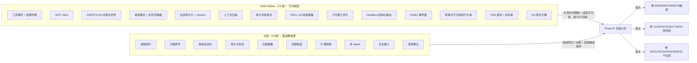
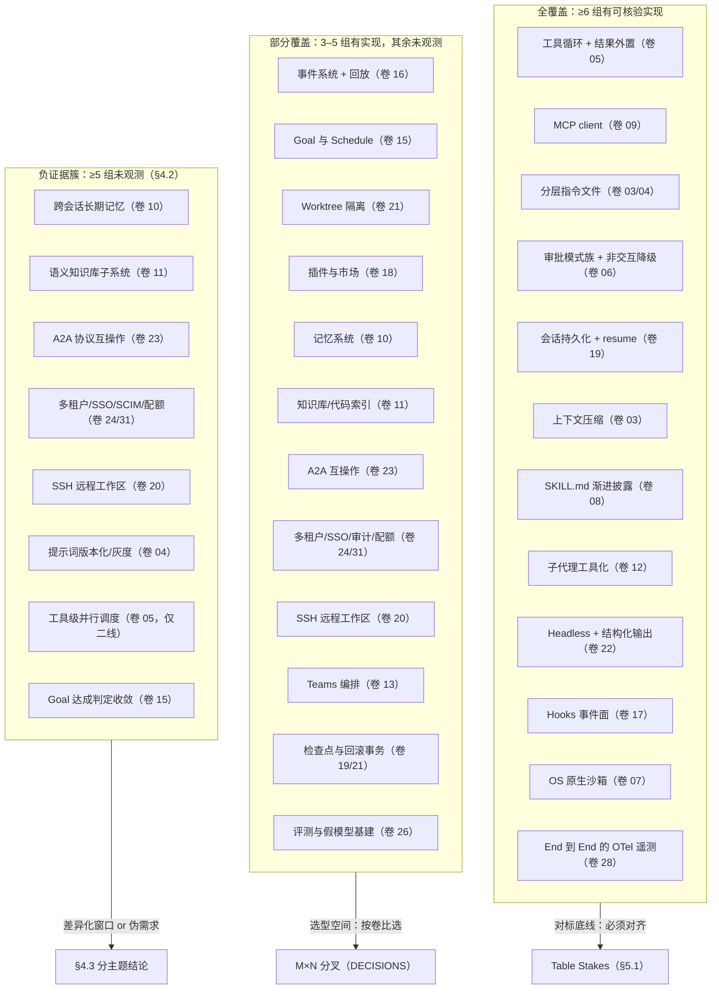
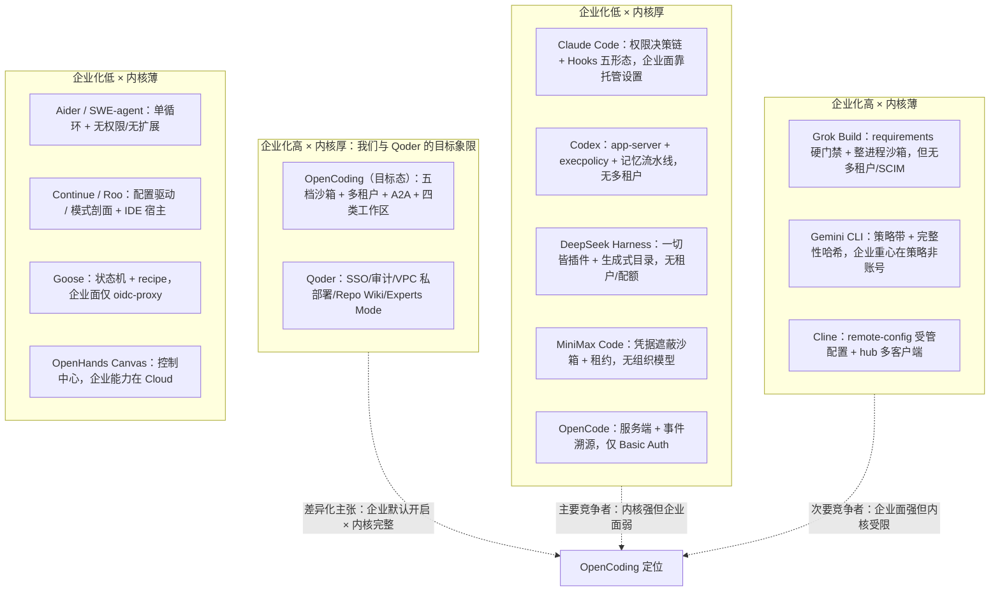

# Phase B 交叉对比：九组竞品 × 30 个 Harness 系统域

> **本文件定位**：`docs/harness/research/competitors/01–09` 九份源码级研究报告的**横向汇总层**，为 `LESSONS-AND-ADOPTIONS.md` 与 `docs/harness/impl/*` 提供「一格一结论」的事实底座。
>
> **上游**：`00-research-plan.md` §1.1（交付物）、§2（证据分级）、§5（DoD）；`docs/harness/README.md`（36 卷卷册地图）。
>
> **下游**：本文件的每一格必须可被 `LESSONS-AND-ADOPTIONS.md` 直接引用；§6「定位差」的每条必须落到具体卷号与动作。
>
> **不变约束**：Phase B 不推翻 Phase A 的任何选定分支；若本文件与 Phase A 冲突，登记「反驳证据 + 建议修订」，由 `IMPL-DECISIONS.md` 汇总。

---

## §0 一页速览

**十个必须记住的结论**（每条都能在正文找到出处）：

1. **矩阵规模**：30 个系统域 × 9 组竞品 = **270 格**；其中 `[E1]`（源码级）232 格（85.9%）、`[E2]` 38 格（14.1%）、含「未观测」标记 44 格（16.3%，R02 复核后每格均带检索口径；48→44 的四格改判见 §7.1 注）。九份报告共引用 147 个唯一 URL。
2. **必答题（Table Stakes）14 条**：工具循环与结果外置、MCP client、`AGENTS.md` 式分层指令、审批模式族与非交互降级、会话持久化与 resume、上下文压缩、影子仓检查点、`SKILL.md` 渐进披露、子代理工具化、Headless 结构化输出、Hooks 事件面、检查点不污染用户仓库、OTel 遥测与白名单、OS 原生沙箱。**这 14 条我们没有一条可以不做。**
3. **不可调和的取舍 10 组**：进程拓扑、沙箱哲学、审批自动化（规则 vs LLM）、持久化形态、压缩策略、权限粒度表达、扩展隔离、多 Agent、企业重心、遥测默认值。每一组的两端都有头部产品在用——**说明它们不是「对错」，而是与目标客户绑定的战略选择**。
4. **最集中的四处市场空白**（§4.2 主题级负证据）：跨会话长期记忆（6 组未观测，R02 修正：MiniMax 有文件式记忆但无混合召回）、语义知识库（6 组）、多租户/SSO/SCIM/配额（7 组，R02 修正：Claude Code 账户层有 SSO/JIT-SCIM 官方文档）、A2A 互操作（7 组）。另有 SSH 远程工作区（内核 6 组未观测，R02 修正：二线 Cline 已实现 SSH 远程环境）与提示词版本化（9 组全空白）。
5. **最值得抄的机制 Top 6**：Codex 的「结构性不可能脱沙箱」不变式（M2）、DeepSeek 的「代 + 模型可见即可重建 + 三事件锁」三件套（M4/M5/M6）、MiniMax 的凭据遮蔽 MITM 与工具租约（M7/M8）、Cline 的检查点恢复事务（M15）、Roo 的影子仓隔离配方（M21）、Goose 的状态机 + effects-as-data（M24）。
6. **我们必须拒绝的三件事**：hooks fail-open 用作安全边界（Grok 明示弱点）、默认开启遥测 + 硬编码密钥（Codex Statsig）、把 LLM 判定当唯一权限真相（7 家中 5 家无沙箱的现实）。
7. **权重最大的单条事实**：二线 7 家中 **5 家无沙箱、7 家无跨会话记忆、7 家无多租户**——隔离与治理能力的时间差就是 OpenCoding 的窗口期，但窗口期以「竞品会把差距补齐」为前提，需按 §6.3 的批次推进。
8. **协议判断**：行业实际收敛在 **ACP**（Grok/Qoder/MiniMax/DeepSeek/OpenCode/OpenHands 六家），A2A 只有 Gemini CLI 一家；建议卷 23 改为「**主协议 ACP 兼容 + 联邦协议 A2A**」双线（§5.2 / X1）。
9. **最容易被忽略的工程配方**：影子仓必须清洗 7 个 `GIT_*` 环境变量（Roo）、回滚必须先保全现场（Cline）、迁移前必须在线备份且删除需显式授权（MiniMax）、探针不可用时不得视作「命令已完成」（Cline）。
10. **本文件的自我约束**：不做能力打分、不新增事实、不推翻 Phase A 选定分支；与 Phase A 的 4 处潜在冲突已登记在 §7.5（只登记，不改卷）。

---

## §1 方法与口径

### 1.1 矩阵如何构建

1. **行 = OpenCoding 的 30 个系统域**，逐行映射 Phase A 卷号（见 §2 三张表的首列）。口径说明：
   - 卷 04（提示词管理系统）**并入「上下文（卷 03）」行**——九组竞品均未把提示词资产化为独立系统，单列会产生空行；其证据在「上下文」行内以「提示缓存/前缀边界」形式出现。
   - 卷 01（Harness 架构）**并入「Agent 内核（卷 12）」行**——架构拓扑（单进程/客户端-服务端/多端同源）与内核原语在来源报告中同章描述。
   - 卷 33（交互细则）并入「端形态（卷 22）」；卷 34/35（新建卷）并入「前沿（卷 25）」「评测（卷 26）」两行。
2. **列 = 9 个竞品分组**，分组口径与来源报告一一对应（不做跨报告混算）：

| # | 分组名 | 构成 | 报告 | 最高证据密度 |
| --- | --- | --- | --- | --- |
| 1 | Claude Code(+openclaude) | 官方闭源主体 + `Gitlawb/openclaude` 衍生品（机制高保真窗口，**非官方承诺**） | 01 | [E1]（衍生品）+ [E2]（官方） |
| 2 | OpenCode | `anomalyco/opencode`（原 `sst/opencode`），V1/V2 双运行时并存 | 02 | [E1] |
| 3 | Codex | `openai/codex`（Rust，~140 crate） | 03 | [E1] |
| 4 | DeepSeek Harness | `deepseek-ai/deepseek-harness`（`dsh`，291 个 npm 包） | 04 | [E1] |
| 5 | MiniMax Code | `MiniMax-AI/minimax-code`（`mcode`）；`mmx` 与 `Mini-Agent` 仅作对照 | 05 | [E1] |
| 6 | Grok Build | `xai-org/grok-build`（官方 Rust）；社区 `superagent-ai/grok-cli` 仅作对照 | 06 | [E1]（含大量 [E2]） |
| 7 | Qoder | 阿里闭源产品族；`[E1]` = `npm pack @qoder-ai/qodercli@1.1.59` 分发包实物 | 07 | [E1]（分级包）+ [E2]（文档站） |
| 8 | Gemini CLI | `google-gemini/gemini-cli` | 08 | [E1] |
| 9 | 二线集合 | Aider / Cline / Roo Code / Continue / Goose / SWE-agent / OpenHands(Agent Canvas) | 09 | [E1]（部分 [E2]，OpenHands 循环在姊妹仓） |

3. **每格写法**：一句能力陈述（尽量带量化取值或机制名）+ 该格**最强**证据标签。同一格若正反证据并存，取最强者并附简短反证据。
4. **不做的事**：不做能力打分、不做「谁更好」排序、不引入来源报告之外的新事实。

### 1.2 证据分级（继承 `00-research-plan.md` §2）

| 等级 | 含义 | 本文件中典型形态 |
| --- | --- | --- |
| `[E1]` | 直接读到源码/仓库内实体文件（给路径与符号） | `packages/core/src/permission.ts`、`codex-rs/linux-sandbox/src/lib.rs`、Qoder 包内 `bundle/proto/chat.proto` |
| `[E2]` | 官方文档 / 官方 schema / 官方 README | `docs.qoder.com/*`、`docs.x.ai/build/*`、仓库内 user-guide |
| `[E3]` | 第三方分析、逆向资料、媒体 | `claude-dev.tools`、HN 讨论、第三方评测 |
| `[E4]` | 推断（来源报告已写出推理链，本文件不新增推断） | 「未观测到 ⇒ 该能力不存在」类结论一律回退为负证据而非 [E4] |

**关键区分**：`[E1]` 只证明「实现如此」，不证明「产品承诺如此」；分组 1 的多供应商路由、RepoMap、SSH 等均为**衍生品新增**，不能当作 Claude Code 官方事实（01 号报告 §2.2 已显式声明）。

### 1.3 「未观测」的口径（必读 caveat）

> **矩阵格中标「未观测」= 在来源报告的检索范围内，没有任何一方发布了可核验证据（含官方文档、源码、官方 schema、公开仓库），这不等于该能力在现实中不存在。**

具体口径：

- 负证据只有两种形态才被采信：① **全仓机械核对**（如 `grep -rn "cron"` 无命中、`find packages -iname "*compact*"` 无命中、工具目录全量比对）；② **权威文档明示不存在**（如 MiniMax `docs/tui-capabilities.md` 明写某能力被移除）。两者在来源报告中均附检索词，本文件在相应格内保留「未观测」字样。
- 闭源产品（Claude Code 官方部分、Qoder）的「未观测」**不代表不存在**，只代表公开材料不可验证——这两列的负证据权威性显著低于开源列。
- 「未观测」按**主题**而非按「功能点」判定；同一主题在多家均未观测时，在 §4 汇总为主题级负证据簇（这才是可支撑战略判断的粒度）。

### 1.4 阅读路径建议

`§2 主矩阵`（找事实）→ `§3 独有机制榜`（找可抄的具体做法）→ `§4 反面证据`（找空档）→ `§5 收敛与分歧`（找必答题与不可调和的取舍）→ `§6 定位差`（落到卷号与动作）→ `§7 统计与检索口径`（复核可信度与未决问题）。

---

## §2 主矩阵（30 域 × 9 组 = 270 格）

### 2.1 内核与智能层（卷 02 / 03 / 05 / 06 / 07 / 08 / 09 / 10 / 11 / 12）

| 系统域 | Claude Code(+openclaude) | OpenCode | Codex | DeepSeek Harness | MiniMax Code | Grok Build | Qoder | Gemini CLI | 二线集合 |
| --- | --- | --- | --- | --- | --- | --- | --- | --- | --- |
| **模型接入层**（卷 02） | 官方 Anthropic 原生 + 兼容协议；30+ provider 多供应商表属**复刻方新增** `[E1]` | provider×endpoint 三元组（responses/completions/messages/aisdk）+ 26 个 `@ai-sdk` 包集中 `packages/core` `[E1]` | 收敛为 **Responses 单一 wire api**（已移除 chat wire）+ 多后端 + provider 级 `request_max_retries`/`stream_idle_timeout_ms` `[E1]` | `ctx.llm` 适配器接缝（`llm-deepseek`/`llm-pi-ai`）；扩展只依赖 `agent` 接口，故**循环可替换** `[E1]` | BYOK 三协议（openai-completions/responses、anthropic-messages）+ `--use` **先测连通再保存**；模型能力即协议字段（附件大小/数量/TTL） `[E1]` | xAI 模型族；`applyModelConstraints` 按模型裁剪系统提示；未见多协议 BYOK `[E2]` | 自研 **gRPC/OpenAI 兼容 `chat.proto`** + 档位化路由（Auto/Ultimate/Performance/Efficient）+ `Advisor{name,model}` 旁路 `[E1]` | 模型族工具集（`GEMINI_3_SET` vs `DEFAULT_LEGACY_SET`，同工具不同 schema）+ `routing/` 降级 + model-steering `[E1]` | Continue 配置驱动多模型 + Ollama；Goose 独立 provider crate；Aider 主模型/弱模型/architect 双模型；其余单模型 `[E1]` |
| **上下文**（卷 03，含提示词/卷 04） | 四机制压缩并存（micro/auto/reactive/collapse）+ 熔断冷却（3 次失败 / 5 分钟）+ **静态可缓存前缀边界常量** + `persisted-output` 三层预算 `[E1]` | **Context Epoch + Context Source**（key/JSON codec/load + baseline/update/removed 三渲染器），epoch 内 baseline 冻结保缓存；不可用≠已移除 `[E1]` | `AutoCompactWindow` 压缩窗基线（`prefill_input_tokens` 双源，服务端观测优先）+ `window_id` 入 responses metadata 归组缓存前缀 `[E1]` | 压缩是 capability **seam**（非循环内建）+ **三事件锁**（start→summary→end，孤儿锁可检测）+ `spillStore` 外溢返回不透明 locator `[E1]` | `context-manager` 只管预算估算；`system-reminder` 独立**五类频次**注册表；goal 续跑只追加短提示以保前缀稳定 `[E1]` | 四路压缩 + **two-pass 压缩** + 压缩前 memory flush（保留 4000 token 头部空间）+ 工具结果三层剪枝（近 3 轮不剪/头尾各 1500/10 轮硬清） `[E1]` | `Compact` + **`ChatPatch{cache_id,action}` 契约**（`patches: map<string,ChatPatchList>`）+ `ContentPart.cache_control` + `model.summarizeToolOutput` 按工具预算 `[E1]` | 压缩阈值 = 模型窗口 × **0.5** + **五态 `CompressionStatus`**（含 `COMPRESSION_FAILED_INFLATED_TOKEN_COUNT`）+ `jit-context` 工具 + 工具输出屏蔽三件套 `[E1]` | Aider Repo Map（符号图 + token 预算二分拟合）；SWE-agent 可插拔 history processors；Continue 双索引 + 按需规则；Goose 独立上下文 crate；**OpenCode 无向量式上下文挑选**（R02 核验：`packages/core/src` 无 embedding/vector 检索命中；`packages/llm/DESIGN.md:17` 明写 embeddings 属「未来域」） `[E1]` |
| **工具**（卷 05） | `Tool` 接口（`isConcurrencySafe`/`isReadOnly`/`checkPermissions`/`prompt.ts`）+ **批分区并发上限 10** + 结果三层预算（50k 字符 / 20 万字符每消息 / 10 万 token） `[E1]` | `Tool.make` 单构造函数 + runtime 存 `WeakMap`（schema/executor 不公开）+ **陈旧调用防护**（身份不匹配返回 `Stale tool call`）+ 结果外置 2000 行/50KB/7 天 `[E1]` | 注册/暴露分离（`ToolExposure.is_deferred`）+ `ToolSpec` 四形态（Function/Freeform/Namespace/**ToolSearch**）+ 读写锁并行语义 + `tool_output_token_limit` `[E1]` | `ToolOutputDefinition{schema,render,presentationMeta}` + `schemas()` **防泄漏白名单** + `finalizeContent` 恰好一次 + 68 个模型可见工具 + `run_code`(PTC) `[E1]` | 97 个非测试工具文件；**三档披露** `AgentToolMode = OMIT\|INLINE\|TOOL_SEARCH` + `mcp-disclosure` 检索索引 + `path-guard`/`output-limit`/`local-sensitive` `[E1]` | `ToolKind` **harness 无关语义分类学** + 规范输入字段名 + 版本化 `_meta` 信封（`x.ai/tool`，v1）+ 显式移植 codex/opencode 工具（含 NOTICE 标注） `[E1]` | 官方四分类（文件/执行/搜索/信息）；工具名与 `mcp__` 前缀与 Claude Code **同构**（符号存在性：Task 755、mcp__ 13）；`tools.core/exclude` 白名单 `[E1]` | `ToolRegistry` + `Scheduler` 显式状态机（validating→scheduled→executing/awaiting_approval→success/error/cancelled）+ 单飞 `isProcessing` + `update_topic` 强制排首 `[E1]` | SWE-agent bundle（目录+config.yaml+bin/）最易实验；Continue 20 工具含 `readonly` 与三态 UI 文案模板；Roo 工具组+文件正则；**Cline 有工具级并行调度**（`sdk/packages/agents/src/agent-runtime.ts:1890-1913`：按工具 `executionMode=parallel\|sequential` 分组、仅**相邻**并行调用重叠、`Promise.all` 汇聚）；**其余 6 家未观测**（R02 核验：Aider/Roo/Continue/Goose/SWE-agent/OpenHands 的 `executionMode`/工具级 `parallel` 均无命中；原「7 家全未观测」口径修正） `[E1]` |
| **权限**（卷 06） | **有序判定链**（deny→ask→tool.checkPermissions→plan→交互→fullAccess→内容级 ask→safetyCheck→bypass→alwaysAllow→passthrough）+ `dontAsk` 转换置于最外层防绕过 `[E1]` | ask/allow/deny 三值 + 通配符 + `findLast` 取胜；`always` **批量授权传播**、`reject` **级联拒绝并中断回合**；`BashArity` 命令前缀归约（约 140 条字典） `[E1]` | 四态审批 + `Granular` 五开关（false=直接自动拒绝而非提示）+ **会话级审批缓存**（逐键写入）+ execpolicy 前缀 DSL + Guardian 自动审查（low/medium/high/critical） `[E1]` | 两旋钮正交（沙箱模式管文件效果 / 审批策略管是否打断人）+ Preset 组合 + 审批**封闭结果集 fail-closed** + `ApprovalRequest` **刻意不携带工具参数** `[E1]` | **三步判定流**（硬拦截→快速允许→passthrough→ask）+ 硬拦截/软风险**双注册表**（bypass 永不覆盖硬拦截）+ 六模式 + `permission.json` 落盘 + 云端 LLM 门 `[E1]` | **五级授权流水线**（hook→规则→记忆授权→内置只读自动批准→模式策略）+ 严重度判定 `deny > ask > allow`（跨来源合并）+ 25 变体决策原因 `[E1]` | 五模式术语 + 三态决策 + **三通道策略分派**（TUI 提示 / Headless `ask→deny` / SDK 委派宿主）+ `security.disableYoloMode` 管理员开关 `[E2]` | TOOML 规则（`argsPattern` 正则 + `mcpName` + `modes` + `subagent`）+ **5 层信任带**（admin 5.x > user 4.x > workspace 3.x > extension 2.x > default 1.x，带内 `1+priority/1000`）+ 审批沉淀两种落盘范围 `[E1]` | Roo **自动批准矩阵**（7 类动作 × 20+ 设置 + 越界/受保护文件开关 + timeout 回调）+ 命令黑白名单；Goose SmartApprove（LLM 只读判定 + 显式防注入）；Aider/SWE-agent 无权限引擎 `[E1]` |
| **沙箱**（卷 07） | Bash 沙箱（文件+网络）**与权限耦合**（`autoAllowBashIfSandboxed` 免询问放行）+ `sandboxOverride` 独立决策原因 + `bashSecurity.ts` 2590 行静态分析清单 `[E1]` | **明确不沙箱**（三处反向证据：源码注释/spec 陈述句/advisory 化外目录扫描）；唯一隔离是 `packages/codemode` **语言级**沙箱（AST 解释器 + 白名单 stdlib，预算默认不限） `[E1]` | 四档策略 × 五类后端**正交矩阵** + `WritableRoot` 保护提权元数据路径（`.codex`/`.git/hooks`）+ **结构性不变量**：存在 denied-read 时禁止脱沙箱执行 `[E1]` | 三档模式（read-only/workspace-write/danger-full-access）+ 平台运行器（bwrap/Landlock/Seatbelt/win-ACL）+ **执行强度上报** FULL/PARTIAL + 功能探测而非假设 `[E1]` | **凭据遮蔽 MITM 沙箱**：本地 CA + 叶子证书 + TLS 终止 + body 替换 + `credential-mask-env/files` + 哨兵 + AWS SigV4 + seccomp 过滤器生成 + 违规监控 `[E1]` | **整进程级内核强制**（Landlock/Seatbelt 启动时施加，子进程继承）+ deny 读写双向 + 施加失败**拒绝启动**（fail-closed）+ 恢复**不得放宽**档位 + 对自身配置内核写拒绝 `[E1]` | 本地侧 Quest Worktree 环境；Cloud 侧容器隔离（Session 间不可互达，销毁即擦除）；企业方案自认「网络与文件隔离待改进」 `[E2]` | **OS 原生隔离优先**（Linux bwrap / macOS seatbelt / Windows AppContainer + C# 助手）+ `GOVERNANCE_FILES` 写保护 + `SECRET_FILES` 完全隐藏 + 容器沙箱可选（docker/podman/runsc/lxc） `[E1]` | 仅 SWE-agent（SWE-ReX/Docker）与 OpenHands（后端沙箱）真在容器内跑；其余 5 家（Aider/Cline/Roo/Continue/Goose）**宿主直执行**，靠审批与检查点兜底 `[E1]` |
| **Skill**（卷 08） | `SKILL.md` frontmatter **全字段可选** + 正文仅被使用时加载（渐进披露）+ 插件可打包 skills/agents/hooks/MCP + `marketplace.json` 目录 `[E2]` | 四类发现源（内置优先被覆盖/全局/项目/配置 paths+urls）+ **远程 Skill 拉取四重安全校验** + staging→rename→backup 原子替换 + 版本文件 `[E1]` | `SkillMetadata` + `SkillInterface{display_name,icon,brand_color,default_prompt}` + 四类作用域（User/Repo/System/Admin）+ `SkillDependencies{tools[{type,value,transport}]}` `[E1]` | registry + filesystem provider + **watcher 热更新** + frontmatter 严格校验（拼写错/非布尔 → 整体丢弃并告警）；嵌套 `**/SKILL.md` 刻意不发现 `[E1]` | 目录监听注册表 + 插件元数据含**归档 SHA-256 + content_digest + 能力来源归属**（`IPluginCapabilityProvenance`）+ 市场仅 official/local `[E1]` | `skills.rs` + 调用 skill 列入只读自动批准；独立 marketplace crate + 组织级治理（绑定 marketplace/固定版本/关闭插件 UI） `[E2]` | `SKILL.md` + `allowed-tools` frontmatter + **条件技能**（按路径激活）+ 插件含 skills/commands/agents/hooks/output-styles + marketplace `[E2]` | `SKILL.md` 两级扫描 + `activate_skill` 工具 + **extension = 发行单元**（打包 MCP/上下文文件/自定义命令/hooks/子代理/skills/主题） `[E1]` | Cline plugin/extension registry + `sdk/examples/plugins/`；Continue `readSkill`；Roo `custom-tools`；Goose 用 recipe + MCP 表达技能；Aider/SWE-agent 无技能机制 `[E1]` |
| **MCP**（卷 09） | 8 种传输（含 `sse-ide`/`ws-ide`/`sdk`/`claudeai-proxy`）+ `headersHelper` + OAuth 刷新锁 + elicitation + **`claude mcp serve` 反向暴露** `[E1]` | 三传输（stdio/StreamableHTTP/SSE，远程**优先 StreamableHTTP** 再 SSE 兜底）+ 自建 `McpOAuthProvider`（本机回环 + state 持久化校验 + `oauth:false` 显式抛错）+ `mcp.tools.changed` 事件 `[E1]` | 两类传输 + `stdio-to-uds` 作**第三传输**适配器 + `rmcp-client` 含 `ema_*` 企业托管认证 + OAuth 注册策略 `AUTO\|CIMD\|DCR`；**未观测 MCP server 模式**（R02 核验：`ServerHandler` 命中仅 `app-server/tests/*` 与自研 exec-server 协议实现——后者是 Codex 自有 JSON-RPC 而非 MCP；无 `codex mcp serve` 命令） `[E1]` | **无共享 `ctx.mcp`**（每 server 一连接插件）+ 工具名 `mcp__<server>__<tool>` + 资源侧独立包 + server instructions 作字面文本入 system prompt；**MCP prompt templates 不支持**；**MCP OAuth 未观测**（R02 核验：`packages/mcp/` 全目录 `-i oauth` 0 命中；`prompts/list|get` 0 命中） `[E1]` | 连接池 + **名字注册表 + 工具名命名空间**（多 server 同名冲突）+ `TOOL_SEARCH` 披露 + 云侧自有 Matrix MCP；**MCP OAuth 被主动裁掉**（R02 核验：`packages/agent-modules/mcp/src/runtime/types.ts:4-7`「we trim the legacy daemon surface (OAuth2 flow, manifest entries, lock-file write mediator)」；原「未观测」口径修正） `[E1]` | stdio/HTTP/SSE + 命名 `server__tool`（兼容 `mcp__server__tool` 并重写）+ `lazyLoad` + 元工具 `search_tool`/`use_tool` + **MCP 参数可由文件承载**（施同级授权与路径限制） `[E2]` | 四传输（stdio 默认/sse/http/ws）+ 三作用域落盘（user/local/project）+ `mcp.lazyLoad`（只暴露 Meta Tool）+ 企业 **MCP Access Control**；**CLI 侧 MCP OAuth 客户端存在**（R02 核验分发包 `package/bundle/qodercli.js`：RFC 9728 `oauth-protected-resource` 发现 + RFC 8414 `oauth-authorization-server` + `mcp_oauth_callback_url` 回调；登录面含 `security_oauth_token`/`qoder-cli-oauth` 客户端 ID/`oauth_org_not_allowed` 组织校验；原「未观测」口径修正；Cloud 侧另有 Vault） `[E1]` | `McpClientManager` + stdio/SSE/HTTP + OAuth 家族（含**服务账号模拟** `sa-impersonation-provider` 与令牌落盘）+ 策略侧 `mcp.allowed/excluded` + **反向暴露为 MCP server** `[E1]` | Goose 把 MCP 当**唯一扩展通道** + `extension_malware_check`/`validate_extensions` 准入；Continue `MCPManagerSingleton` + OAuth + MCP prompt 作 context provider；Aider/SWE-agent 无 MCP `[E1]` |
| **记忆**（卷 10） | `memdir/`：`MEMORY.md` **活索引** + 日期日志 + 四类约束（user/feedback/project/reference）+ **「什么不该记」负向清单** + 向量索引 + 团队记忆同步 `[E1]` | **未观测到持久记忆**（R02 复验：`packages/core/src` 全量核对无 `memory*` 子系统；4 处命中为 `:memory:` SQLite、内存 mutex、流式投影 `MemoryState`、内存预览）；近似能力是 `references` 具名目录 + skill 渐进加载 `[E1]` | **两阶段后台流水线**：Phase1 按 rollout 并行抽取（含密钥脱敏 + DB 租约）+ Phase2 单锁全局归并（**memory 根目录本身是 git 基线**）+ 受限 consolidation sub-agent（无审批/无网络/仅本地写） `[E1]` | **未观测到长期记忆子系统**（R02 复验：`packages/` 55 个一级包无 memory*/knowledge*，负证据）；近似能力是 `session-query` 历史检索 + `spill` 取回 `[E1]` | **文件式记忆系统**（R02 修正原「仅轻量 memory 工具」口径）：`local-runtime/src/memory/`（facade/store-fs/orchestration/tracking；user+agent 双作用域、main+topics+daily+archive；500 字追加上限/4KB 摘要/64KB 清理阈值）+ V2 会话级策略 `recallEnabled/writeEnabled/recallLocked`（`memory-policy.ts`，首条真实用户消息即锁 recall 的准入策略）+ 提示分块注入（summary/tail/daily 各有 cap）；**无向量/混合召回**（检索为行级 `LocalMemorySearchResult`） `[E1]` | Markdown 为源 + SQLite **FTS5 + vec0 双索引**（有 embedding 时 vector 0.7 / BM25 0.3，min_score 0.7，max 6）+ **时间衰减仅 session 类**（半衰期 30 天）+ **MMR 去冗**（λ=0.7）+ 压缩前 flush + 写入需人在场确认 `[E2]` | 两层：**Static Memory**（`AGENTS.md`/`AGENTS.local.md`/`.qoder/rules/**`，四类激活：always_on/manual/model_decision/glob）+ **Auto-Memory**（`~/.qoder/memory/` 四型分类，默认 **false**，仅交互 TUI 运行） `[E2]` | `GEMINI.md` 层级合并 + `memory` 工具 + **Auto Memory（实验）**：后台挖掘历史会话 → 候选 `GEMINI.md` patch 与 `SKILL.md` → 用户批准才生效（含 lock/提取状态/补丁校验） `[E1]` | **7 家均未观测跨会话长期记忆**（R02 逐仓复验：Aider/Cline/Roo/Continue/Goose/SWE-agent/OpenHands 均无记忆子系统；Continue 索引与 Roo rules 不算事实沉淀）；Roo 用 `AGENTS.local.md` 做个人覆盖；Aider tags 缓存是「结构记忆」 `[E1]` |
| **知识库**（卷 11） | **未观测**一等公民知识库/连接器/RAG（负证据；R02 核验：官方文档站与复刻仓 `src/` 均无 RAG/知识库模块，`memdir/vectorIndex.ts` 属记忆检索而非知识库）；仅 `WebSearch`/`WebFetch` + MCP 资源读取 `[E2]` | 未观测（R02 复验负证据：`grep -rl knowledge packages/*/src` 0 命中；`embedding` 仅命中 copilot 模型能力标记与 `llm/DESIGN.md:17`「未来域」表述；`vector` 仅 CSS/fixture）；`references` + skill 渐进加载是近似物 `[E1]` | 未观测向量库（R02 复验负证据：`codex-rs/` 无 vector/qdrant/faiss/hnsw 依赖，`vector` 命中均为 Rust `Vec` 注释）；可见的是 `file-search` 模糊检索 + `thread/search` + `openai-docs` skill 承担外部文档检索 `[E1]` | 未观测 knowledge 包组（R02 复验负证据：`packages/` 55 个一级包无 knowledge*/memory*）；`web-search-*` 多 provider（deepseek/exa/perplexity）+ `web-fetch-http` 提供外部检索 `[E1]` | **未观测语义知识库**；且「背景工作区索引 / 语义工作区搜索」被**主动移除**（R02 补证：`docs/tui-capabilities.md:41` 原文「The semantic workspace search tool and its enablement policy are also removed … Existing indexing records are left inert」；隐私边界收紧） `[E1]` | **代码图谱是产品能力**（R02 更新：`docs/user-guide/05-configuration.md:97` `codebase_indexing = true`（默认开，「code graph indexing」）；源码 `crates/codegen/xai-codebase-graph`（tree-sitter 查询构建代码图，`index_manager.rs`/`interner.rs`/`scope_graph/`，被 `xai-grok-shell`/`xai-grok-workspace` 依赖）；无文档级 RAG/连接器（27 篇 user-guide 无 knowledge base 面）） `[E1]` | **Repo Wiki**（`<project>/.qoder/repowiki` + 多语言目录）+ `/knowledge-plan` 产出 `wiki_plan.yaml`（页面白名单 `documents[]` + 模板 + notes）+ **手改内容受保护不被覆盖** + Git 反向同步 + 本地运行不上传全量代码 `[E2]` | 未观测索引/检索子系统（R02 复验负证据：`packages/` 无 vector store 依赖）；**但有 embedding 客户端**（`core/src/core/baseLlmClient.ts:196` 调 `getEmbeddingModel()`，默认 `gemini-embedding-001`（`config/models.ts:115`），无调用方消费 → 「有 API 无产品面」）；语义检索靠 `google_web_search` 外部服务 `[E1]` | Continue **双索引**（LanceDB 向量 + 全文 + 代码片段，`CodebaseIndexer` 统一管理）最完整 + 30+ context provider；Aider Repo Map；其余无 `[E1]` |
| **Agent 内核**（卷 12，含架构/卷 01） | 显式状态机（`State` 15 字段 + 每个 `continue` 站点整体重建；R09 复核修正：原「14 字段」有误）+ **三类循环护栏**（doom loop / 工具失败循环三类阈值 / 续跑提醒上限 20）+ 子 Agent 可 `isolation:'worktree'` `[E1]` | `Provider Turn` / `Session Drain` 术语固定；步数上限时**不再 materialize 工具** + 注入 `MAX_STEPS_PROMPT` + `toolChoice:"none"`；子会话是**真实 Session**（parentID 血缘 + 深度可配） `[E1]` | `Submission Queue` 单点 dispatch + `Op` 封闭指令集（`#[non_exhaustive]`）+ Thread/Turn/Item 三级原语 + 子代理间通信是**一等协议**（可加密 + 走正常 thread 流水线） `[E1]` | `ReactLoopAgent`（**循环本身是可替换插件**）+ step/turn 精确定义 + waterfall（pre-step/request/stream/tools）+ 默认 10 并行 + `workflow`/`ralph` 编排脚本 `[E1]` | `PiTurnRunner`：**每 turn 新建 fresh Agent/EventBridge/队列**（turn 无共享状态，与 DeepSeek「长活 Agent + inbox 投影」相反）+ 8 类回调 hook 点 + 每 turn metrics/provenance `[E1]` | `SessionActor` actor 模型 + **Turn 内含 Loop** 两级 + Goal 编排目录群（10+ 文件）+ 子代理树**扁平一层**（深度硬限制） `[E1]` | 官方四要素 + 五步循环口径 + 7 工作模式 + 编排四形态（自然语言次序 / Experts 7 角色 / **JS Dynamic Workflow** / Subagent）+ `--max-turns` 与 `general.maxAttempts` 默认 10 `[E2]` | **事件驱动工具调度器 + 分层策略引擎**（不是一个大 ReAct 循环）+ 空响应自动 nudge（有次数上限）+ `complete_task` 显式终止信号 `[E1]` | Goose **状态机 + effects-as-data + 可重入持久化**最可复用；Cline agents 无状态/core 有状态分层；Roo orchestrator boomerang；SWE-agent 单循环 + `RetryAgent` 装饰；OpenHands 循环在姊妹仓（R02 定位：`openhands/docs/architecture.md:22-24` 主后端 = software-agent-sdk 的 Agent Server，本仓为 Canvas 前端 → 循环代码不在本仓） `[E1]` |

### 2.2 协作与平台层（卷 13 / 14 / 15 / 16 / 17 / 18 / 19 / 20 / 21 / 22 / 23）

| 系统域 | Claude Code(+openclaude) | OpenCode | Codex | DeepSeek Harness | MiniMax Code | Grok Build | Qoder | Gemini CLI | 二线集合 |
| --- | --- | --- | --- | --- | --- | --- | --- | --- | --- |
| **Teams**（卷 13） | 以**面板进程**实现（`TmuxBackend`/`ITermBackend`/`InProcessBackend`）+ 共享任务目录 + `TeammateIdle` 钩子 + `leaderPermissionBridge`（队友权限请求转发 leader）；官方仅把 Teams 描述为可并行会话集合 `[E1]` | **未观测到 peer-to-peer 多 Agent 编排**（R02 复验负证据：`teammate`/`peer-to-peer`/`blackboard` 于 `packages/core/src` 0 命中，仅提示词文案含 teammate 一词）；仅 `background-job` 单层托管 `[E1]` | `multi_agent_v1` 命名空间 + `AgentRegistry`（**限制每会话子代理总数**）+ 生成深度限制 + 角色系统（可收窄，**绝不替换父会话权威**） `[E1]` | `agentTeams`（实验、出厂禁用）：Lead + 具名 teammate + **持久 mailbox + 共享任务板** + 9 工具；掉线恢复后收排队消息；`dsh-base` 保持其 disabled `[E1]` | **多 agent 团队引擎被刻意排除**（内部曾有 `@mavis/team` 循环引擎不入公开投影）；角色资产 worker/explore/**verifier**/workflow/desktop-task `[E1]` | 子代理树扁平一层；消息**三语义**（steer/queue/interject）+ 每 sender-target 在途配额（4 条）+ **子代理不能反向 message 根会话** `[E2]` | Experts Mode **7 个具名专家**（Lead 不可定制）+ Expert Team Canvas；官方自述质量提升 ~67%（**未独立验证**） `[E2]` | 子代理以**同名工具**暴露 + `@name` 强制路由 + 子代理持有自己 `Scheduler`（`schedulerId` + `parentCallId` 可追溯） `[E1]` | Roo orchestrator（`new_task` boomerang + `attempt_completion` 汇报）零内核改造最实用；Goose `subagent_handler` 有独立 maxTurns/系统提示/事件/logger 命名空间；Aider/Continue/SWE-agent 未观测（R02 复验：三仓 `subagent`/`team`/`orchestrat` 0 命中） `[E1]` |
| **任务与计划**（卷 14） | 7 类任务态（LocalShell/LocalAgent/RemoteAgent/InProcessTeammate/LocalWorkflow/MonitorMcp/Dream）+ Todo V2（**依赖阻塞 + 认领**）+ Plan 模式文件路径单独权限校验 `[E1]` | Todo 无 id/无 DAG/无依赖，**整表替换**（last-write-wins）；plan 模式 = 权限禁写 + 专用提示词 + 计划文件白名单；**未观测 DAG/依赖求解/规格驱动/证据验收/看板**（R02 复验：`session/todo.ts` 仅 `update(sessionID, todos[])` 删旧插新，`Info` 无 id/依赖字段） `[E1]` | `update_plan` 是唯一计划工具（**至多一个 in_progress**）+ 明确「Plan 模式 ≠ todo 工具」（两者独立）+ `thread/queue/*` 计划性执行队列 `[E1]` | `todo_write` 整表替换（**刻意无 id/优先级/activeForm**，因整体替换无需稳定身份）+ Plan mode 是**软引导**（沙箱与审批独立强制）+ 未决选择落盘时机有明确约束 `[E1]` | `task`/`task_control`/`task_append`（委派工作单元）与 `todowrite`（回合清单）**两套** + `task-verification` + `source-reference*` 引用族 `[E1]` | **Todo 门禁**（`TodoGateFired`/`TodoGateExhausted`：主动催促模型推进且催促有上限）+ Plan Mode 独立文档（含与压缩的交互）+ 独立 todo 面板 `[E1]` | Quest **规格驱动**：Spec 四段产物（需求/设计方案/任务分解/验收标准）+ 五阶段流程（澄清→生成→评审→Build→评审提交）+ Spec 可被 Schedule 或转 Goal `[E2]` | `write_todos` + **`tracker_*` 任务工具族**（创建/更新/依赖/可视化，落 `storage.getTrackerDir()`）+ Plan 作为独立 ApprovalMode（工具集收敛到只读） `[E1]` | Roo Task+subtask 链 + `task-history` 最完整；Cline `submit_and_exit` 完成契约 + `core/src/tasks`；Goose 无显式 todo（`ops_project`+recipe）；Aider 无 todo `[E1]` |
| **Goal 与 Schedule**（卷 15） | 复刻仓有 goal controller（`evaluateGoalAfterTurn` + `GoalState` 可持久化）与 `CronCreate/Delete/List`；官方把周期任务描述为 Routines（非内核级 Goal 状态机） `[E1]` | **未观测到**任何 Goal 模式/自治循环/定时任务/触发器/熔断（R02 复验 + R09 口径修正：`grep -rn "cron" packages --include=*.ts` 实际有 5 处命中，但均为 i18n 文案「cronologie」与 markdown 关键字表 `crontab` 误报，无调度器实现——原「0 命中」表述不严谨，结论不变）；最接近的是 `background-job` `[E1]` | Goal 是一等 RPC 实体（`thread/goal/set\|get\|clear` + `token_budget` **双 Option 三态**）+ Goal 变更广播；**本地调度不在 CLI 仓**（R02 修正原「未观测本地定时调度」口径）：互操作面存在——桌面注入动态工具 `codex_app.automation_update`（`core/src/tools/handlers/tool_search.rs:365`「Create, update, view, or delete recurring automations」+ `schedule`/`timezone` 字段）+ 宿主 `turn_trigger=automation_cron_scheduled`（`core/src/session/turn_input.rs:132-175`）+ 特性门 `InAppLocalAutomation`（`features/src/lib.rs:260-263`）；CLI 内核无 cron 调度器实现 `[E1]` | Goal 持久阶段（active/paused/blocked/complete）+ **`GoalRef{id,revision}` CAS 身份** + blocked 下界「三次获准回合」；Schedule 是**会话本地**提醒（`every_seconds` ≥ 5 分钟 + 时区显式化） `[E1]` | Goal 17 文件 + **续跑模板（产品级高密度文本：停止条件/终态定义/临时粗糙可接受）** + `verification/` 六件套（证据简报 + 独立 subagent 验证 + 可替换 verifier 端口）+ cron（活跃时段/忙时排队/jitter/会话归属三态） `[E1]` | Goal 状态机 8 态 + **四类自动暂停**（其中 `NoProgressPaused` 由「验证器多轮看到同一缺口指纹」触发）+ **未知状态一律降级为可恢复暂停**（不降级为自驱 Active）+ 分类器自身容量与失败语义 `[E1]` | `/goal --turns N`（默认 100，resume 再给 100）+ **崩溃后 active 降级 paused** + `ownerSessionId` 所有权与 `/goal take` 夺取；Schedule：5 字段 cron + **按 task ID 稳定 jitter** + 文件锁单进程驱动 + recurring 7 天过期 + 上限 50 + 错过提示 `[E2]` | **未观测内置 Goal 循环或 cron**（R02 复验：`scheduler/` 目录实为工具调度，`grep -rn "cron" packages/core/src` 0 命中）；近似自治机制是 loop detection + auto-nudge 与三类停表事件；**[E4] 推断** Google 把定时放在 a2a-server 侧 `[E1]` | Goose 是**唯一源码级 cron**（tokio_cron_scheduler + `schedule.json` + `scheduled_recipes/` + 仓库相对路径校验）；OpenHands 把定时/事件交给**独立 Automation Server**；Cline 仅 cron 示例；**均无 Goal 达成判定** `[E1]` |
| **事件**（卷 16） | 联合流（`StreamEvent\|RequestStartEvent\|Message\|TombstoneMessage\|ToolUseSummary`）+ `tengu_*` 分析事件 + **类型级防泄漏自证约束**（`AnalyticsMetadata_I_VERIFIED_THIS_IS_NOT_CODE_OR_FILEPATHS`）+ OTel 导出 `[E1]` | **durable / live-only 双族**（live 增量不入可重放流）+ 会话事件 32 处 `Event.define` + 版本化类型名 + 订阅「**先注册 wake 再重放历史**」防漏 + 背压 `SubscriberOverflowError` `[E1]` | `EventMsg` **83 个变体** + `Submission` 携带 **W3C traceparent** 跨进程传递 + `codex-otel` 三 exporter + 默认 Statsig OTLP、**debug 构建自动降级 None** `[E1]` | **三类事件域**（session/agent/capability）+ 事件目录**生成式**（producer-consumer 全表）+ 声明合并扩展 `SessionEventMap` + **运行时不变式注册表**（可机械校验） `[E1]` | 事件词汇极小且**数值化**（6 个 `RuntimeEventType`，数值为兼容已存会话而保留）+ 展示前净化（`display-sanitize`）+ **能力归属**（哪个插件哪一版提供） `[E1]` | 单枚举 **58 变体**（R09 复核修正：原「57 变体」有误）+ `EVENT_SCHEMA_VERSION="1.0"` + **wire 标签固定化测试**（`tool_outcome_wire_labels_are_pinned`）+ 连「模型偷懒/待办推进不足」都事件化（LazinessClassifier/TodoGate） `[E1]` | **Cloud Agents 的一等公民就是 Event**（实时事件流，SSE 或轮询）+ 请求级追踪字段（`request_id/session_id/task_id/request_set_id/machine_id/stage/sub_task`）→ 成本归因与链路还原 `[E2]` | 三类通道（`GeminiEventType` 内核→宿主 / `AgentEvent` 跨宿主带 `streamId` / `coreEvents` 进程内）+ `AgentSession.stream()` **可续传**（以 eventId 游标重放） `[E1]` | Cline 强调**事件流生命周期边界必须跨 hub 保留**（text/reasoning delta、final、tool start/update/finish、agent done）+ `run.started` 携带 `requestId`/`clientId`；Continue protocol 消息总线；Aider 无事件面（R02 复验：无 `*event*` 文件）；**Roo 有类型化事件枚举** `RooCodeEventName`（`packages/types/src/events.ts:11-40`，任务/子任务委派/执行/分析四族，`Task extends EventEmitter`）但面向 IDE 宿主，无版本化 wire 协议/回放（原「Roo 未观测」口径修正） `[E1]` |
| **Hooks**（卷 17） | 27（官方 31）事件点 + **5 种执行形态**（命令/HTTP/MCP 工具/提示词/子 Agent）+ `PermissionRequest` **放行型钩子**（`updatedInput` + `updatedPermissions` 落盘，放行前**重跑规则**防放大）+ Stop 类阻断 8 次上限 `[E1]` | V1 插件 hooks 最完整（`permission.ask` 可改判定、`tool.execute.before/after` 可改参数/输出、`chat.*` 可改参数与头）；**未观测脚本型 hooks**（R02 复验：全仓 `find -name hooks.json` 0 命中；hooks 仅以插件内 TS 回调存在） `[E1]` | **12 事件** + 四种处理器形态（**含 Agent 型 = 钩子可拉起子代理**）+ 强/弱信任（`allow_managed_hooks_only` 可废掉用户级钩子）+ 钩子输出外溢到文件 `[E1]` | `hook-protocol` 统一定义 + **双桥接包复用 Claude Code/Codex 既有 `hooks.json`** + **仅 command 型运行**（http/mcp_tool/prompt/agent 跳过并告警）+ 可阻断/附加上下文/要求停止 + log-only 审计事件 `[E1]` | `plugin-hooks` 9 文件（复用 Claude Code 风格钩子）+ 额外的 **effort 分级**与**输出产物**两个成分 + `plugin-capability-attribution` `[E1]` | **14 事件** + 阻断/改写/反馈三分（`PostToolUse` 有 `updatedToolOutput`）+ **hooks fail open**（脚本崩溃/超时视同 allow，文档直言「把 hook 当安全边界必须自行处理错误」）+ 兼容 Cursor 事件映射 `[E2]` | 完整事件名清单（含 `Elicitation`/`ConfigChange`/`CwdChanged`/`FileChanged`）+ **4 类入口**（command/http/**prompt/agent**）+ matcher 支持 `\|` 或与参数 glob（`Bash(git push *)`）；prompt/agent 型在**独立会话**运行（看不到主对话历史） `[E2]` | **11 事件** + 4 来源（project/user/system/extension）+ **可改写请求**（`BeforeModel`/`BeforeToolSelection`/`BeforeTool` 均有 apply*Modification）+ 执行链五段（planner/runner/aggregator/translator）+ **受信 hooks**（未受信目录 hook 不执行） `[E1]` | Cline `beforeTool` hook 可在执行前改判（`{policy:{autoApprove}}`）；Goose 把 hook 做成状态机 op（`ops_entry_hook`/`ops_stop_hook`）；SWE-agent `review_on_submit_m` 是提交钩子最小实现 `[E1]` |
| **插件**（卷 18） | 插件可打包 skills/agents/hooks/MCP/命令 + `plugin.json` 身份 + `marketplace.json` 分发 + **依赖求解** + 托管插件 + LSP 插件集成 `[E1]` | 外部 npm 包；V2 插件 **Effect 原生**，`PluginHost` 暴露 `agent/catalog/command/integration/skill/reference`.transform + `plugin.add/remove`（插件可装插件）+ KeyedMutex 串行 + **加载失败不致命**；**未观测插件沙箱/市场/签名/依赖求解**（R02 复验：`packages/plugin/src` 无 marketplace/signature/依赖求解命中；安装即外部 npm 包） `[E1]` | `plugin` crate + RPC `plugin/install\|uninstall` + `MarketplaceAdd/Remove/Upgrade` + 插件可声明 `mcpServers` + 建议安装工具（`list_available_plugins_to_install`/`request_plugin_install`） `[E1]` | **Cordis 插件树**（一切皆插件，含 agent 循环本身；卸载全回卷）+ **profile/bundle/patch 三层组合 + HMR** + `plugin_manager` 工具（沙箱化执行包操作）+ `cordis-host-runner`（`node:vm` realm，**定义重启后消失**，无模型工具可创建动态定义） `[E1]` | 市场仅 `official\|local` 两档 + install/remove/enable/disable + **归档 SHA-256 + 内容摘要 + 能力来源归属**；官方明示「任意市场注册与 GitHub URL 导入**未在 CLI/TUI 暴露**」 `[E1]` | 独立 marketplace crate + 组织级治理（绑定 marketplace/限制可添加市场/限制 MCP/要求固定版本/关闭插件 UI）+ **插件安全边界收窄**（代理不得声明 mcpServers、不得声明 hooks、不得设 bypassPermissions） `[E2]` | `.qoder-plugin/plugin.json`（**仅 name 必填**）+ commands/agents/skills/hooks/output-styles/bin/.mcp.json + `marketplace add <git-url\|owner/repo\|path>` + 作用域 user/project/local；**自家安全能力就用插件分发**（`qoder-security` vendored） `[E1]` | **extension = 发行单元**（MCP + 上下文文件 + 自定义命令 + hooks + 子代理 + skills + 主题）+ **完整性哈希校验**（`policy/integrity.ts`、`extensions/integrity.ts`）+ gallery + 安装开关 `[E1]` | Cline plugin registry + `examples/plugins`；Continue `skills/` + 自定义 provider；Roo `custom-tools`；Goose 扩展**仅 MCP 通道** + `extension_malware_check`/`validate_extensions` 准入 `[E1]` |
| **持久化迁移恢复**（卷 19） | append-only JSONL + **`parentUuid` 链** + 子 Agent 侧链文件 + **进度消息只写不入链** + 多种记录（文件历史快照/内容替换/队列/Goal/折叠提交）+ resume/fork/rewind `[E1]` | **事件溯源**（SQLite `event` 表 + projector 投影出 `session_message`）+ 45 个时间戳迁移 + **事务内跑 projector** + replay 深度相等幂等（不等即 die）+ `claim(ownerID)` 聚合所有权 + fork = 消息深拷贝（idMap 重映射） `[E1]` | **JSONL rollout + SQLite 索引双轨** + 文件名即元数据（revert 追加 `_<rolloutId>`）+ **持久化白名单收敛为单一策略函数** + 逆序扫描免全量读 + `ThreadHistoryMode` 迁移 + `codex migrate-rollouts` `[E1]` | **代（generation）模型**：版本命名文件、**已提交代永不重命名/覆盖/删除**、写全新后继、相邻迁移链每步一版本、撕裂尾修复 + `SessionHandle` 单写者 + **新鲜度契约** `[E1]` | SQLite + 域分目录迁移（≥0036）+ **迁移前在线备份、全部迁移与最终校验成功后才授权删除该精确文件** + 三条 legacy 恢复通道 + **修复版本冲突类迁移**（多写入者 + 单调版本的真实代价） `[E1]` | SQLite（自研 `xai-sqlite-journal`，含**网络 FS 检测**）+ 导出/分叉/回退/合并/摘要齐全 + **跨 harness 会话导入**（Claude Code）+ 沙箱档位**随会话冻结**（恢复时不同 profile 报错拒绝） `[E1]` | CLI：`sessionRetention`（maxAge 30d / minRetention 1d）+ 会话标识来自环境变量；`ChatPatch` 契约层存在；Cloud：Session CRUD/archive/search + **环境销毁即数据擦除** `[E2]` | `Storage` 分域（chats/checkpoints/logs/memory/plans/tracker/tasks/shell_history）+ 影子 git 检查点 + `/resume` `/restore` `/rewind` `/compress` + hash→slug 目录迁移；**未观测显式 fork**（R02 复验：`core/src` 无 `forkSession`；`fork` 命中仅 macOS 沙箱 `(allow process-fork)` 与 IDE 探测） `[E1]` | Cline **检查点恢复事务** + 多客户端会话共享最强；Roo 每任务影子仓最隔离；Goose SQLite/Postgres + 字段级会话模型（`schedule_id`/`parent_session_id`/`accumulated_cost`）+ 聊天历史检索；SWE-agent 轨迹文件 + `redo_existing` `[E1]` |
| **工作区**（卷 20） | 当前目录为默认可写边界 + `--add-dir`；复刻方新增 SSH 会话管理器 + `bridge`（webhookSanitizer/trustedDevice/worktree 绑定）+ `server` 锁文件（**非官方承诺**） `[E1]` | Workspace 是 **V2 预留概念**（`workspace.ts` 仅 6 行 + `workspace_id` 可空）+ Session 跨目录移动已实现；**未观测 SSH/容器/云执行**（R02 复验：`ssh` 仅命中 xai 插件注释；`packages/containers` 实为 `base/bun-node/publish/rust/script/tauri-linux` 镜像构建）；project-copy 能力 `[E1]` | **Environment 一等公民**（一个 turn 可面向**多个环境** + cwd 用 `PathUri` 而非本地 PathBuf）+ 远程执行走 **WebSocket exec-server**（能力发现/心跳看门狗/noise_relay）+ `apply-patch` 经 `ExecutorFileSystem` 故可施于远程 `[E1]` | `workspaceRegistry`（持久有序项目列表；**对模型不可见、零 prompt 成本**）+ SSH 系四包（`fs-ssh`/`subprocess-ssh`/`sandbox-ssh`——fs 与 subprocess 指向远端则 Bash/PTY/LSP 一起搬）+ **未观测云工作区/K8s**（R02 复验：`kubernetes|k8s|cloud workspace` 于 packages 0 命中） `[E1]` | **未观测 SSH/容器/云工作区抽象**（R02 复验负证据：`ssh` 命中仅为 `.ssh/` 敏感文件排除与危险命令模式；`packages/` 无 remote/cloud 包；工作区 = 当前目录 + `path-guard`）；**背景工作区索引被主动移除**（隐私收紧，已存记录置惰性） `[E1]` | `xai-grok-workspace` client/daemon 拆分（`own/attach` + **崩溃重启** + `preview_supervisor`）+ 远程面 `remote/relay/upload/proxy`；沙箱下 `workspace start/restart/resume` 不可用 `[E1]` | 三档远程：Cloud Mode（`--remote` 云 VM 托管）/ Cloud Agents（Agent+Environment+Session 容器托管，SSE）/ **Remote Control**（移动/Web 控本机）+ `additionalDirectories` `[E2]` | 工作区 = 本地目录 + **Git worktree 支持**（`.gemini/worktrees/<name>`，分支 `worktree-<name>`，未改动自动清理）+ ACP 把文件系统操作**代理回宿主**；**未观测 SSH 工作区**（R02 复验：`\bssh\b` 命中仅扩展的 git URL/URL 解析语境，无远程执行语义） `[E1]` | Roo 平台无关 `WorktreeService`（list/create/remove + 分支与 detach 三态）；OpenHands local/docker/VM/cloud 多后端 + UI 切换；**Cline 已实现 SSH 远程环境**（R02 修正原「7 家均未观测」：`sdk/packages/core/src/remote/remote-environments.ts`——profile{host,user,port,identityFile}+knownHosts+helper 二进制+状态机 disconnected→testing→available→connecting→connected→error+远端平台/家目录探测；`apps/examples/desktop-app/scripts/verify-ssh-poc.ts` 端到端验证）；其余 6 家未观测（Aider/Roo/Continue/Goose/SWE-agent/OpenHands 的 `\bssh\b` 命中均非工作区语义） `[E1]` |
| **Git 与 Worktree**（卷 21） | `EnterWorktree`/`ExitWorktree` 工具 + Agent `isolation:'worktree'` + `WorktreeCreate`/`WorktreeRemove` 钩子（非零退出中止建树）+ 恢复时重建 worktree + 提交归属（CoAuthoredBy/prUrlTemplate） `[E1]` | **影子 Git 仓快照**（非 worktree；`{data}/snapshot/{projectID}`，单文件上限 2MB）+ revert 两代语义（V1 立即回滚 / **V2 三段式 stage→clear→commit**）+ worktree 隔离（`git worktree add --no-checkout`，含 `startCommand`）；**未观测自动提交/合并队列/冲突解决/大仓优化**（R02 复验：`autoCommit`/`merge queue` 0 命中） `[E1]` | worktree 一等命令面（`ManagedWorktree{root,cwd,head_sha,branch}` + `--worktree` + TUI `/worktree`）+ 与桌面共享分配根 + 回收（`DEFAULT_WORKTREE_KEEP_COUNT=15`）+ `turn_diff_tracker` + `thread/revert` + `codex apply` `[E1]` | **未观测到内建 git/worktree 系统**（R02 复验负证据：工具目录全量比对 68 工具无 git；`grep -ril worktree` 命中均为无关用法）→ git 能力由 shell + 提示词约定承担 `[E1]` | **无 worktree / 无 git 抽象层**（负证据，与 DeepSeek 一致）；文档仅确认「用户主导的 Git 操作仍可用」（经 bash 而非产品化） `[E1]` | `xai-fast-worktree` 独立 crate（~35k 行）+ **池化**（`worktree_pool.rs`）+ 子代理 `isolation: worktree`（结果带回路径）+ **ACP 扩展方法 `x.ai/git/worktree/*`（含 apply 合并回主工作目录）** + hunk 级跟踪（~11k 行） `[E1]` | CLI 原生 git-aware（0.1.0 起）+ Quest 提交链（Diff → 逐文件/全部拒绝 → Commit/Push/新分支）+ `.qoder/worktrees/` + Worktree hook 事件；1.1.57 发布「自动 git 检查安全加固」（自认曾有安全问题） `[E2]` | `GitService`（影子仓提交 + 当前 commit hash）+ **检查点不污染用户仓库**（影子仓在 `~/.gemini/history/<hash>`）+ worktree 与子代理组合用法；**无自动提交**（提交须模型显式调 shell 且过策略） `[E1]` | Aider 最激进（编辑即提交 + `/undo` + 编辑前 `dirty_commit` + 模型生成提交信息 + Co-authored-by trailer）；Roo worktree 服务 + 每任务影子仓；Cline 恢复事务；**分支合并队列/冲突治理 7 家均未观测**（R02 复验：逐仓 `merge queue|mergeQueue` 0 命中） `[E1]` |
| **端形态**（卷 22，含交互细则/卷 33） | TUI（Ink/React，第三方统计 144 组件/85 hooks）+ headless（结构化 IO）+ IDE（`sse-ide`/`ws-ide`）+ 桌面/agent view；**三套审批处理器**（人类/协调者/队友） `[E1]` | TUI（@opentui + SolidJS）+ Electron 桌面（三通道 dev/beta/prod + **WSL 目标**）+ Web App + Console + Slack + IDE；leader 键 `ctrl+x` + ~200 keybind（含 emacs 风格输入框、which-key）+ 键位强校验（未知键直接抛错） `[E1]` | TUI（子模块极多，含 pets/onboarding/resume picker）+ `exec` headless（**stdout 纯净性由 `#![deny(clippy::print_stdout)]` 强制**）+ 桌面 + IDE（不走 app-server，走 unix socket/命名管道 + **SID 校验**）+ ≥56 斜杠命令 `[E1]` | **Web UI 为默认入口**（:3080）+ Electron 外壳（:19387，Node IPC 承载 boot/就绪/致命错误/关停）+ CLI 主要作 launcher + 客户端插件面 60+ 包 + 桌面**强制更新** + Web 两阶段启动（boot graph → 激活全部 client 插件 → mount） `[E1]` | **TUI 唯一一等公民**；headless 与 ACP 是适配器；**原生 Electron 桌面被明确排除**；`mmx` 的 agent 友好输出契约（stdout 纯数据 / stderr 进度 / `--output json` / 退出码表） `[E1]` | TUI 是重心（pager 547k 行 + **PTY harness 做 TUI 端到端测试**）+ 富渲染（markdown/mermaid/image/voice）+ 523 行快捷键 + 479 行 slash 命令；社区版另有 Telegram 遥控 `[E1]` | CLI TUI 25+ `ui.*` 设置（含 `renderProcess`/`terminalBuffer`/`useAlternateBuffer`/`accessibility.screenReader`）+ IDE Quest 三栏 + QoderWork/QoderWake + Mobile/Web 远程监控 `[E2]` | TUI（Ink + **ScreenReaderAppLayout 切换** + alternate buffer）+ 18 个 React Context + Vim 模式 + `Shift+Tab` 循环 approval mode + `Esc Esc` rewind + `ToolDisplayFormat` 5 档（auto/compact/box/hidden/notice） `[E1]` | Roo/Continue/Cline = IDE 插件 + Webview（Roo 另有独立 webview-ui 工程）；Aider 终端 REPL + watch；Goose CLI/桌面/ACP 三前端；SWE-agent CLI + inspector；OpenHands Electron/浏览器控制台 `[E1]` |
| **A2A**（卷 23） | Agent SDK（TS/Python，核心用法是**把 CLI 当子进程跑** + Hooks/Permissions/Sessions 作控制面）+ `claude mcp serve` + GitHub Actions；**未观测 A2A 协议声明**（R02 检索：官方渠道无 A2A 公告，第三方 A2A-MCP 桥接指南不计；复刻仓 bridge/gRPC 为自研 `src/proto/openclaude.proto`） `[E2]` | HTTP 服务端 + 完整 OpenAPI + 三套 SDK（JS / 生成客户端 / `sdk-next` 嵌入式，含 **SDK Contract IR**）+ ACP；命令面含 `export/import/attach/stats/db`；**未观测 MCP server 暴露**（R02 复验：`@modelcontextprotocol/sdk/server` 仅命中 `test/` fixtures；对外集成走 HTTP/OpenAPI + ACP） `[E1]` | 对外集成协议 = **app-server JSON-RPC**（v1/v2 并存 + 100+ 方法 + `ts_rs` 导出 TS 类型）+ SDK 是 CLI 包装 + JSONL；headless 契约（`--output-schema`/`-o`）；**远程控制配对**（pairing/status/client-list/revoke）；未观测 MCP server（R02 复验：`codex-mcp`/`rmcp-client` 均为客户端；`mcpServer/*` RPC 是客户端连接状态面） `[E1]` | **无 A2A**（负证据）；ACP v1 服务端（刻意省略 DSH 专属呈现与交互式 UI 能力）+ 自有 **JSON-RPC SDK（极小方法集：3 请求 + 4 通知）** + `webhookRuntime` 入站（唯一内建动作=创建根 Session） `[E1]` | **无 A2A**；四条被集成面：ACP 服务端（含把已启用 Skill 作为 ACP 命令名暴露）/ headless（exit-policy + settlement）/ **工具租约（mcode-tools-host 发短期 token）** / 反向集成（`mmx agent setup` 配 6 个第三方 agent + `config export-schema`） `[E1]` | 协议选择是 **ACP**（`grok agent stdio\|serve` + WebSocket relay）+ ACP 扩展方法族 + **逐客户端能力协商**（yoloMode/modelId/clientFsRead…）+ headless 4 种输出格式 + 退出码 0/1/130/143 `[E2]` | ACP（CLI↔IDE 的官方定位）+ Agent SDK（**spawn 子进程 + 双向 JSONL**，`query()` → `AsyncGenerator<SDKMessage>`）+ Cloud Agents API（Bearer PAT/SAT，Forward/Managed 两模式）+ 企业 OpenAPI `[E1]` | **被集成面最丰富**：进程内 SDK（`GeminiCliAgent`/`GeminiCliSession`，可注入 tools/skills）+ **A2A 服务端**（`@a2a-js/sdk` + express，`POST /tasks` 等）+ `--acp` + VS Code 伴生 + **反向** `a2a-client-manager` 把 A2A 远端 agent 当工具用 `[E1]` | Cline `RuntimeHost` 嵌入面最好（Local/Hub/Remote 三实现）；OpenHands 既是库（`build:lib`）又是**多协议宿主**（可驱动 Claude Code/Codex/Gemini 等任意 ACP agent）；Continue npm 协议包 + config-yaml；Aider/SWE-agent/Roo 被集成面较窄 `[E1]` |

### 2.3 企业、生态与前端（卷 24 / 25 / 26 / 27 / 28 / 29 / 30 / 31 / 32）

| 系统域 | Claude Code(+openclaude) | OpenCode | Codex | DeepSeek Harness | MiniMax Code | Grok Build | Qoder | Gemini CLI | 二线集合 |
| --- | --- | --- | --- | --- | --- | --- | --- | --- | --- |
| **企业运维**（卷 24） | 托管设置覆盖一切 + `policyHelper` 外部策略脚本 + `allowManaged{Hooks,PermissionRules,McpServers}Only` + OTLP 审计 + **48 个环境变量钉扎 + 1 前缀规则**（宿主托管时从设置来源剥离；R09 复核修正：原「122 个」有误）；**账户层 SSO/JIT-SCIM 有官方文档**（R02 修正原「未观测」：support.claude.com「Set up JIT or SCIM provisioning」「Important considerations before enabling SSO and JIT/SCIM」；属 Claude Enterprise 账户面，CLI 本地策略面仍为托管 settings 钉扎） `[E2]` | **仅 Basic Auth**（中间件只做一次凭据比对）；**无用户体系/RBAC/审计表/配额**（负证据）；多租户靠「每用户一本地进程 + 本地 SQLite」；`enterprise.url` 只是分享服务地址 `[E1]` | MDM 集成（`ConfigLayerSource::Mdm`）+ `EnterpriseManaged` 配置层 + **云配置包** + `forced_chatgpt_workspace_id` + MCP `ema_*` 企业托管认证 + `requirements.toml` 硬门禁；**未观测多租户/SSO/SCIM/审计导出**（R02 复验：`\bscim\b`/`multi-tenant` 于 `codex-rs` 0 命中；`sso` 仅命中 AWS Bedrock 登录引导） `[E1]` | 审计 = 事件目录全量持久化（审批对 + 钩子对）；**未观测租户级配额/计费/席位/SSO/SCIM**（R02 复验负证据：`tenant` 仅 1 处凭据误用注释、`sso|scim` 0 命中、`quota` 均为 provider 错误归一与浏览器存储配额、`seat` 命中均为「framework seat」隐喻）；客户端/服务端模型是「单用户 + 多会话 + 多工作区」 `[E1]` | 有托管账号（OAuth/Token Plan/额度/签到）+ 云权限分类器 + 工具租约；**无多租户/SSO/SCIM/组织角色/审计导出**；纯离线部署会失去云能力 `[E1]` | `requirements.toml`（锁定 always-approve / 限定 marketplace 与 MCP / 强制执行 hooks / **固定插件版本**）+ 沙箱对 Grok 自身配置**内核写拒绝**（防 agent 自改策略）+ folder trust；**未见多租户/SCIM/审计查询/配额后台** `[E1]` | 组织 Members/Roles/Groups + **SSO（SAML 2.0 / OIDC 二选一，域名+首次登录自动 provision 承担 SCIM 语义）** + MCP Access Control + **Audit Log** + 企业模型管控 + CN 版 **VPC 私有化** + 计费治理（Org Resource Package） `[E2]` | `docs/cli/enterprise.md` + `docs/admin/` + `adminPolicyPaths`（管理员策略**不可被用户覆盖**，优先级带 5.x）+ `auto-saved.toml` 审计记录 + 完整性哈希 + 扩展白名单；**未观测多租户/SSO**；**有账号级配额/信用计费面**（R02 更新：`core/src/availability/` 的 Terminal/Retryable quota 错误分类 + `core/src/billing/billing.ts` 的 Google One AI credits 透支策略 `ask|always|never` 与合格模型集合；`sso://` 仅为扩展来源协议、非企业 SSO） `[E1]` | Cline 最强（remote-config 受管指令物化 + hub 多客户端 + 成本口径）；Continue org 配置 + registry；Goose `oidc-proxy` + `CUSTOM_DISTROS.md`；**7 家均未观测多租户/SCIM/配额计费内核**（R02 复验：逐仓 `multi-tenant|multitenant|\bscim\b` 0 命中） `[E1]` |
| **前沿**（卷 25） | 语音/i18n/vim/移动面注释；复刻方新增 Buddy 桌面宠物/RepoMap/gRPC/SSH（**不能当官方事实**）；官方未见多模态或计算机使用的一手证据 `[E1]` | **codemode**：模型写一段 JS 编排工具（含 OpenAPI→工具编译器）+ 快照按文件选择性恢复 + `session-ui` 共享渲染包 `[E1]` | realtime conversation（`RealtimeConversation*` Op/事件）+ `view_image` + image generation + Apps（`codex_apps_mcp_2026_07_28` 特性探测）+ browser/computer-use 要求类型 `[E1]` | `run_code`(PTC) + `workflow`（模型写 JS，`agent()/parallel()/pipeline()/phase()`）+ `ralph`（每轮全新子 agent + 有界报告）+ 浏览器 6 件套 + `cordis-host-runner`（**运行时自我扩展**） `[E1]` | **云多模态工具 18+**（图像理解/生成/视频/语音/音乐/转写/search）+ `browser-core` + 网站部署工具 `[E1]` | 语音 crate（18k 行）+ 内联媒体/图像 + **代码图谱 crate** + clone 会话（`/grok-clone`）+ dashboard/status line + Mermaid vendored 栈 `[E1]` | **Computer Use** + 语音输入 + QoderWake 数字员工（Wakers 持续自动化）+ Cloud Agents「dreams」+ Repo Wiki + QMind 企业知识库 `[E2]` | `browser_agent`（**无障碍树驱动浏览器**）+ `jit-context` 即时上下文 + 模型族工具集 + session scratchpad 草稿记忆 `[E1]` | SWE-agent ACI 设计原则（「多给上下文反而更差」的实证）+ history processors 可实验化；Continue nextEdit/FIM；Goose 本地推理；OpenHands `canvas_ui_tool.py` `[E1]` |
| **评测**（卷 26） | 697 个测试文件与源码同目录 + **按编译期特性开关分组执行**（`bun test --feature=...`）+ 内存压力驱动压缩 + 有界重试/熔断模式复用 `[E1]` | 661 测试 + **HTTP API 契约测试强制端点覆盖**（`--fail-on-missing --fail-on-skip`）+ 契约卫生测试（compatibility/contract-hygiene/event-manifest/import-boundaries）+ `http-recorder` 录制回放 + 性能脚本 `[E1]` | insta 快照 + `schema_fixtures.rs`（协议 schema 固化）+ `cargo-deny` + `blob-size-policy` + Bazel RBE + 双构建（Cargo/Bazel） `[E1]` | vitest **多配置分面**（main/e2e/bench/expected/snapshot/web/web-perf/web-stress）+ `snapshots/` 8.2MB + 7 个 benchmark 场景 + **生成目录 CI freshness 校验** + `verify-package-invariants` 机械门禁 `[E1]` | **单一 gate 入口 `verify.mjs`（与 CI 同序同门禁）** + `test/vitest-suites.json` 单一事实源（禁止在 scripts/config 硬编码测试路径）+ 性能 CI + **证据诚实性制度化**（`open-source-status.md` 的 NOT RUN 边界） `[E1]` | 可脚本化 ACP 客户端（`acp_scripted_client`/`acp_policy`）做端到端测试 + **PTY harness 测 TUI** + wire 标签固定化测试 + 测试目录即规格（100+ `*_tests.rs` 与实现同目录平铺） `[E1]` | 发布节奏每日多版 + 每个 settings 键标注是否需 Restart + 厂商自述指标（Experts Mode ~67%）；**未见公开评测体系** `[E2]` | 超大断言文件（`policy-engine.test.ts` 4255 行）+ integration/evals/perf-tests/memory-tests + `deflake` 脚本 + 启动剖析/堆快照/事件循环监控 `[E1]` | SWE-agent 轨迹文件 + **输出目录即实验元数据** + `redo_existing`（防重复消耗）；Cline `evals/`；OpenHands **MSW + mock-llm + mock-llm-docker 三档假模型**；Continue `eval/` `[E1]` |
| **技术路径**（卷 27） | 官方专有 + 复刻仓 MIT（衍生自 Anthropic 的部分仍属其，**供应链与法律风险**）；分发 npm + GCS 双通道 `[E1]` | **V1→V2 大迁移中途**（两套运行时并存 + `builtins.ts` 顶部 TODO 清单）+ `CONTEXT.md` 术语表作设计契约 + `specs/v2/*.md` 9 篇 3646 行 + `schema-changelog.md` 843 行 `[E1]` | **Cargo + Bazel 双构建**（RBE 远程执行）+ ~140 crate + `Op` `#[non_exhaustive]` + 大量 `#[serde(default)]` 向后兼容 + `ts_rs` 双向导出 + `deserialize_double_option` 三态 `[E1]` | 「**一切皆插件**」架构母题（vendor Cordis）+ **291 个 npm 包** + pnpm `strictDepBuilds` **默认拒绝所有安装脚本**（逐个 review 放行/拒绝并注释理由）+ 决策记录制度化（`.agents/notes/`） `[E1]` | 「**内部 monorepo 的已审查公开投影**」：`release/public-source.json` 逐文件清单 + `docs/source-sync.md` 三方合并 + `retired-sources.mjs`（退役路径必须不存在）+ 半自研（vendor `third_party/pi-mono`） `[E1]` | 官方**不接受外部贡献** + 从 monorepo 定期同步生成（`SOURCE_REV`）+ **显式移植竞品工具**（`implementations/codex/`、`implementations/opencode/` + THIRD_PARTY_NOTICES 标注） `[E1]` | CLI 0.1.0 → 1.1.x **每日多版**；产品族五形态共享概念内核（Agent/Subagent/Skill/Plugin/Hook/MCP/Memory/RepoWiki/PermissionMode）；闭源 `[E2]` | npm workspaces 分层（`core` 是 **Node 库而非纯逻辑层**，直接依赖 `node:fs`/`child_process`）+ `sea/` 单可执行 + 依赖方向单一（core → cli/sdk/a2a-server） `[E1]` | OpenHands 从 Python 单体转到 TS 控制中心（**架构跨两个仓库**，历史资料极易过时）；Goose Rust 重写 + 组织迁移（block → aaif-goose）；Cline 能力从 VSCode 扩展迁到 `sdk/` `[E1]` |
| **分发与遥测**（卷 28） | GCS `latest`/`stable` 双通道 + **`shouldSkipVersion`（切通道不得降级）**；遥测需显式开启 + GrowthBook 兼做灰度开关与阈值覆盖 `[E1]` | 分**9 条分发渠道** + 安装方式探测决定升级命令 + `models.dev` 目录同步（Flock 文件锁 + 重试）；遥测仅 OTel（需开关）；**CLI 侧未观测同意分级/崩溃上报服务端**（R09 口径修正：`sentry\|crashReporter` 全仓**并非** 0 命中——Web app 与 Desktop renderer 以 `VITE_SENTRY_DSN` 环境变量**可选启用前端 Sentry**（`packages/app/src/entry.tsx:133-135`、`packages/desktop/src/renderer/index.tsx:40`）且 CI 持有 `SENTRY_AUTH_TOKEN`；但 CLI/内核（`packages/opencode`、`packages/core`）无 Sentry 依赖或上报实现，原结论在 CLI 范围内仍成立；OTel 由 `experimental.openTelemetry` 开关，`agent.ts:376`/`session/llm.ts:208`） `[E1]` | npm 薄壳 + 独立安装器（默认 `releases.openai.com`，环境变量可强制 GitHub）+ **后台自更新**（daemon `update_loop` + `install_lock` + `migration`）+ `codex doctor` 15 子模块 `[E1]` | npm 包族 + electron-builder/NSIS（明确不用 Squirrel 并注释理由）+ **强制更新**（`mandatory-update-policy`/`mandatory-update-window` + 渲染页）+ **匿名安装 ID**（`$DSH_HOME/.anonymous-user-id`，删文件即重生成） `[E1]` | 官方安装器（自动备 Node 运行时、**不需 sudo**、Alpine/musl 不支持）+ 更新三件套（入口/**安装来源探测**/签名验证）+ **遥测三通道各自独立同意** + `DO_NOT_TRACK` 优先 + 诊断最小化白名单（排除堆栈/提示词/URL/任意属性） `[E1]` | `xai-grok-update`（12k 行）+ `install.sh/ps1` + 会话内公告通道 + 默认开启遥测（外部 OTLP 有独立开关与 pin）+ 记忆遥测**只含固定枚举/布尔/计数/时长**；第三方上传指控只记录不验证 `[E1]` | 自动更新默认 **true** + `privacy.usageStatisticsEnabled` 默认 **true** + `aiCodeStatistics` 默认 **true** + Credits 计费与档位倍率 + AI Code Metrics OpenAPI `[E2]` | npm + `sea/` 单可执行 + Dockerfile；**遥测默认关闭、需显式同意** + `sanitize.ts` 脱敏 + 限流；**有内置自动更新器**（R02 修正原「未观测」：`cli/src/utils/handleAutoUpdate.ts` 按安装方式探测产出更新命令 → `spawn(detached)` 后台执行 → `updateEventEmitter` 通知 → 等完成后重启；npx/bunx/binary 安装跳过、沙箱模式禁用、受 `general.enableAutoUpdate` 控制；含**频道稳定性守卫**拒绝降级到更不稳定频道；版本检查 `latest-version` + `UpdateNotification`） `[E1]` | Aider `analytics.py`；Goose `posthog.rs`；Continue devdata/org 遥测；Roo/Cline PostHog 或自建；OpenHands npm + Docker + Helm；许可：Aider/Cline/Roo/Continue/Goose = Apache-2.0，SWE-agent/OpenHands = MIT `[E1]` |
| **开发者生态**（卷 29） | Agent SDK（TS/Python，声明「与 Claude Code 相同的工具/循环/上下文管理」）+ GitHub Actions + 插件市场 + Remote Control 会话 URL 分享 `[E2]` | 三套 SDK + 完整 OpenAPI + **从 HttpApi 契约生成客户端**（`generated/` 禁手改）+ 嵌入式 SDK Contract IR + ACP + IDE 扩展 + Slack + `httpapi-codegen` `[E1]` | app-server JSON-RPC v1/v2 + TS/Python SDK + `codex cloud`（exec/status/list/apply/diff）+ IDE 扩展 + **`/import`（从 Claude Code 导入设置与近期会话）** + Remote Control 配对 `[E1]` | Python SDK（**同源打包**：把正常 `dsh` CLI 打包为 runtime wheel，只暴露 profile 选择与有序 patch 文件，**不暴露完整 Cordis 树**）+ ACP + `webhook-github` 适配器 + `dsh-plugin` topic 约定 `[E1]` | **反向集成**：`mmx agent setup` 探测并配置 6 个第三方 agent（claude-code/codex/grok/opencode/hermes/pi）+ `mmx config export-schema`（Anthropic/OpenAI 兼容工具 schema）+ `npx skills add` 分发 SKILL.md + 社区插件注册表独立仓 `[E1]` | ACP 三入口 + headless 4 输出格式 + **跨 harness 导入**（Claude Code 会话 + Ctrl+I 导入设置）+ 兼容 `.claude/settings.json` 权限规则与 Cursor hooks `[E1]` | Agent SDK + Cloud Agents API + 企业 OpenAPI + ACP + IDE/JetBrains 插件 + Mobile/Web；`package.json` keywords 含 `"gemini"`（**未决**，倾向模板残留） `[E1]` | 进程内 SDK + A2A server + ACP + VS Code 伴生 + **扩展 gallery/registry** + 自定义命令命名空间（`/gcs:sync`） `[E1]` | Cline `RuntimeHost` + SDK 示例（cron/hooks/plugins）；OpenHands `build:lib` + **ACP 多 agent 宿主**；Continue `@continuedev/config-yaml` 可分发配置包；Aider/SWE-agent/Roo 被集成面较窄 `[E1]` |
| **安全工程**（卷 30） | `bashSecurity.ts`（2590 行）静态分析清单（IFS 注入/ANSI-C 引号绕过/heredoc 替换/jq 危险 flag/畸形 token/zsh 模块命令）+ **两级分类器**（regex + 两阶段 LLM）+ **规则遮蔽检测** + 沙箱凭据注入 + 变量钉扎 `[E1]` | 敏感文件默认保护（`*.env` → ask，`*.env.example` → allow）+ `bash` 的 `save` 是**完整命令前缀而非 `*`**（防一次批准永久放开）+ 外目录断言先行 + 权限断言在 `uninterruptibleMask` 内；**未观测密钥代理/网络白名单**（R02 复验：`packages/core/src` 无 secrets 目录；`http_proxy|proxyUrl|network allowlist` 仅命中 workspace 路由中间件，非沙箱网络策略） `[E1]` | execpolicy 命令前缀 DSL（Starlark 风格 `prefix_rule`）+ **`amend.rs` 把审批结果追加回规则** + 环境变量脱敏（默认排除 `*KEY*`/`*SECRET*`/`*TOKEN*`）+ 沙箱违规记录与拒绝分类 + 提权元数据路径只读 `[E1]` | `ctx.credentials`（settings 与 `cordis.yml` **只引用 key 名**；轮换后**下一次请求即生效**；UI 可报告「是否已设置/来源/是否可写」但**不暴露值**）+ `credentials/authorization` 包 + 审批/沙箱事件成对审计 `[E1]` | **硬拦截注册表**（灾难性/不可逆/真实外泄 → 最终拒绝；敏感凭据读取 → LLM 门，**bypass 永不静默覆盖**）+ 凭据遮蔽 MITM（本地 CA/叶子/body 替换/哨兵/AWS SigV4）+ **三层敏感性治理呼应**（工具层/沙箱层/权限层） `[E1]` | 沙箱 deny 内核强制**读写双向**（堵死 `mv secret x && cat x`）+ glob 故意裁减语法 + 对自身配置内核写拒绝 + 环境变量策略（`inherit=all\|core\|none` + 默认剔除 `*KEY*`/`*SECRET*`/`*TOKEN*`）；**hooks fail open 是已知弱点** `[E2]` | 四层防御 + 两个闭环 + **L1/L2/L3 三层代码扫描**（L3 跨文件数据流，判断 input 是否可控/是否真达危险 sink）+ 出向控制（阻断未授权外传）+ MCP allowlist/Hook 拦截；**自认网络与文件隔离待改进** + 1.1.57 修自动 git 检查安全问题 `[E2]` | **`GOVERNANCE_FILES` 写保护**（`.gitignore`/`.geminiignore`/`.git`）+ **`SECRET_FILES` 读写全禁** + `findSecretFiles` 挂载 deny + `shell-safety.test.ts`（539 行）专门出题测命令替换/重定向绕过 + 扩展/策略完整性哈希 + 受信目录/受信 hooks `[E1]` | **红线清单**（7 家共有问题）：凭据本地明文/工具宿主进程内执行/影子仓含完整工作区副本（`.env` 一并进仓）/日志轨迹含原始命令/扩展无签名校验/提示注入面未标注；**仅 Goose 把工具请求显式当不可信数据** `[E1]` |
| **容量与成本**（卷 31） | 内存压力驱动压缩（把进程内存当压缩触发源）+ 会话级限额与 `autoContinueAtUsageLimit` + OTLP 指标 `claude_code.token.usage`/`.cost.usage`；订阅配额算法未公开 `[E1]` | 会话表 `cost` + `tokens_input/output/reasoning/cache_read/cache_write` 五列累计 + `step.ended` 带 cost/tokens（V2 当前硬编码 `cost: 0`）；**无配额上限/预算熔断/成本归因维度** `[E1]` | `AutoCompactWindow` prefill 基线 + `token_budget` crate + `TokenUsageRecord` 持久化 + rollout 保留策略（`maintenance.rs`）+ `thread_unload_delay_secs` `[E1]` | `token-meter` 包 + `session-stats` + 会话日志中 summarize 调用的 provider/model/maxTokens/usage（**一次性请求可由日志 + 代码重建**）；未观测配额/计费（R02 复验：`QUOTA_EXCEEDED_CODE` 为 provider 错误归一（`llm/src/error.ts:27-28`），非账号配额系统） `[E1]` | 每 turn `metrics/provenance/degradation` 记录器 + `tool-context-size` 估算 + 账号额度/签到/Token Plan；无租户级成本归因 `[E1]` | headless usage **区分 `input_tokens`（仅未命中缓存）/`cache_read`/`cache_creation`/`output`** + Goal `token_budget` + status line/dashboard + 限流等待可视化 `[E2]` | Credits 计费 + 四档倍率（Auto ~0.5× / Performance ~1.1× / Ultimate ~2.0× / Efficient 0.3×）+ **峰谷价**（工作日峰段，谷价 50%）+ 子代理按具体模型单独计费 + `/usage` `[E2]` | `Usage` 事件 + headless `stats` 字段 + `trackerService` + `QuotaContext`（模型配额提示 UI） `[E1]` | Goose 会话累积 `usage`/`accumulated_usage`/`accumulated_cost`（含 cache read/write tokens）；SWE-agent `per_instance_cost_limit` **按成本预算裁剪** + `RetryAgent` 装饰 `[E1]` |
| **运维**（卷 32） | `mcp doctor` + **中断原因一等对象**（`abortReasons`/`interruptionTrace` 编码 source/subsystem/controllerRole）+ 有界重试+熔断+冷却模式 + 压缩熔断给出量化依据（1279 会话×50+ 连续失败） `[E1]` | OTLP 日志落盘 + 子命令含 `db`/`stats`/`debug/`；**配置解析错误静默跳过**（争议点：不 fail-fast）；`opencode doctor`（部分） `[E1]` | **`codex doctor` 15 子模块**（background/disk/filesystem_paths/git/network/runtime/sandbox/security/system/thread_inventory/title/updates/windows_dev_drive）+ daemon 托管安装/迁移/线程恢复 + 逆序扫描免全量读 `[E1]` | **`docs/postmortem/` 事故复盘公开化** + `runtime-diagnostics`/`invariants` + `repair.ts` 撕裂尾修复 + `session-checkpoint-policy`（每请求耐久检查点，**回合边界不等待 flush**） `[E1]` | `verify.mjs` 与 CI 同序同门禁 + **迁移指标可观测**（`migrationsMs` + 备份/恢复/最终校验分别测量）+ 三条 legacy 恢复通道 + 性能 CI 单独成文 `[E1]` | `xai-sqlite-journal`（`JournalMode` + **网络文件系统特殊处理**）+ 僵尸会话清理 + persistence actor lifetime 测试 + 限流等待可视化 + `length_salvage`（撞 max_tokens 后抢救） `[E1]` | 会话保留策略（30d/1d）+ 定时任务错过提示 + 崩溃后 goal 降级 paused + **每个 settings 键标注 Restart 与否**（配置文档可用性基线） `[E2]` | **可观测自诊断全套**：`startupProfiler`/`heap-snapshot`/`high-water-mark-tracker`/`event-loop-monitor`/`memory-monitor`/`activity-monitor` + `deflake` + 语义化异常（`AgentExecutionStoppedError`/`AgentExecutionBlockedError`） `[E1]` | Cline **分离日志对账器**（PID + 进程代际启动标记配对防 PID 复用；探针不可用不视作完成）+ teardown 兜底 `emitTaskCompletedOnTeardown`（每会话最多一次）；OpenHands `TESTING_MATRIX.md` `[E1]` |

### 2.4 矩阵读法：八条横向观察

> 以下观察**跨行跨列**读出，不引入矩阵之外的新事实；每条都指回具体格。

1. **「同一功能，三种哲学」是常态，而不是例外**：同样是「不让模型乱写文件」，Claude Code 用权限决策链、Gemini 用策略带 + 参数正则、Roo 用模式剖面 + 文件正则、Grok 用严重度合并 + 记忆授权——**四家的机制无法互相翻译**。因此任何「对齐竞品」的表述都必须先指定对象（这直接影响 `LESSONS-AND-ADOPTIONS.md` 的写法）。
2. **「事件化」程度与产品成熟度正相关**：Grok 把「模型偷懒」「待办推进不足」都事件化；DeepSeek 事件目录生成式且不可变；Codex 的 `EventMsg` 有 83 个变体；反过来，Aider 无事件面、Roo 只有面向 IDE 宿主的类型化事件枚举（`RooCodeEventName`，无 wire 协议/回放）——二线报告里「未观测」的程度不同。这支持我们把卷 16 放在内核层的优先级。
3. **三家同源命名说明生态位已经固化**：Claude Code / Qoder / MiniMax 的工具名（`Read`/`Edit`/`Bash`/`TodoWrite`/`mcp__server__tool`）与 Skill 格式（`SKILL.md` + frontmatter）高度一致——这意味着**迁移成本**（而不是功能）成为用户切换产品的主要摩擦点；我们的卷 29「六类导入迁移」是正确方向，且必须包含「导入对手配置语义」。
4. **「模型能力即协议字段」是少数被三家独立发明的做法**：MiniMax（`IModelCapabilities` 含附件大小/TTL/thinking 预算）、Qoder（档位 + `Price Factor` + 峰谷价）、Gemini（模型族工具集）、Codex（`for_prompt(input_modalities)` 按模型模态裁剪）——相同的动机（多模型适配必须数据驱动）产生趋同设计，是可以放心采纳的少数「共识级」结论。
5. **沙箱能力与「是否声称沙箱」严重不匹配**：Grok 自陈 macOS 网络限制是 no-op、Linux glob 只有启动时快照；Qoder 自认网络与文件隔离待改进；OpenCode 干脆明示不沙箱；只有 Codex 把「能力不对等」编码成 `SandboxEnforcement` 语义与平台矩阵。**结论：我们若做五档隔离，必须同时交付「平台 × 能力 × 降级声明」矩阵**（§6.1-A1）。
6. **「谁能审计」比「谁能拦住」更难做**：拦住某次动作的方法有很多（规则/LLM/沙箱），但「事后能解释为什么拦」只有 Grok（25 变体原因码）与 Claude Code（`PermissionDecisionReason` + explainer）做到了结构化。卷 06 的「决策回放」方向正确，但落地难点在原因码与解释文本的双轨（§6.2-B3）。
7. **企业功能的入口正在从「账号体系」转向「策略下发」**：Codex（`requirements.toml`）、Grok（`requirements.toml` + 组织级 marketplace）、Gemini（admin 策略不可被用户覆盖）、Cline（remote-config 受管指令物化）四家都在同一位置发力；而唯一做账号体系的 Qoder 其审计 schema 未公开。这直接决定卷 24 的实施顺序（§5.2-D9）。
8. **「不做」也是一种可观测的选择**：OpenCode 不做沙箱/记忆/Goal/多 Agent；MiniMax 主动移除语义索引、明确砍掉团队引擎；Gemini 不做 Goal/cron；Codex 不做 MCP server、把本地定时交给桌面/宿主（CLI 内核无 cron）。**这些「不做」集中在同一批主题上（记忆/知识/A2A/自治/沙箱），恰好与 §4.2 的负证据簇重合**——说明它们要么是难而正确（差异化窗口），要么是难而无用（伪需求）；本文件按主题分别判断（§4.3），不做一刀切。

---

## §3 竞品独有机制榜（25 项）

> 判定标准：① 在本套 9 组竞品中具有**排他性或显著领先性**；② 有可核验证据；③ 对 OpenCoding 的某卷有直接实现含义。处置列用**采纳 / 适配 / 拒绝**三态，并给出受影响卷号。

| # | 机制 | 证据 | 为什么重要 | 我们怎么办 |
| --- | --- | --- | --- | --- |
| M1 | **OpenCode 进程内 AST 代码模式沙箱**（`packages/codemode`）：`acorn.parse` → 自研 3465 行解释器；白名单 stdlib（13 模块，**无 fs/process/fetch/require**）；`copyIn/copyOut` 纯数据边界；`ExecutionLimits{timeoutMs,maxToolCalls,maxOutputBytes}` **默认全为不限**；失败即 `Diagnostic` 而非异常；tool-call hooks 支持审计部分执行 | `[E1]` `packages/codemode/README.md`、`src/interpreter/runtime.ts:1-8`、`src/tool-runtime.ts`、`src/codemode.ts:9-16` | 不需要 OS 隔离即可让「模型写程序编排工具」获得**能力受限**沙箱，且跨平台行为一致；同时暴露了「语言隔离 ≠ 资源隔离」的坑（预算默认不限） | **适配**：卷 07 增列「L1′ 语言级解释沙箱」作为 PTC 通道的承载；卷 05 引入程序化调用通道并**强制显式预算**（不得无默认值） |
| M2 | **Codex 结构性不可能脱沙箱不变式**：`unsandboxed_execution_allowed(fs_policy) = !fs_policy.has_denied_read_restrictions()`；为 false 时即使规则允许或用户显式提权也**强制 `NoOverride`** | `[E1]` `codex-rs/core/src/tools/sandboxing.rs:239-307`（注释给出理由：denied reads 只存在于沙箱内，绕过即静默放开） | 把「沙箱被审批规则静默架空」这一最危险的失效模式变成**可测谓词**，是对企业安全基线的硬保障 | **采纳**：卷 07 沙箱执行器实现同名谓词并配单测；卷 30 STRIDE 增「沙箱-审批交互」边界 |
| M3 | **Codex execpolicy 命令前缀 DSL + amend 回写**：`.rules` 文件 Starlark 风格 `prefix_rule(pattern, decision, match, not_match, justification)`，`Decision{Allow,Prompt,Forbidden}`；审批结果可**追加回规则**（`blocking_append_allow_prefix_rule`/`blocking_append_network_rule`） | `[E1]` `codex-rs/execpolicy/src/{rule,decision,parser,amend}.rs`、`core/src/exec_policy.rs:53-56` | 让「一次审批」沉淀为「一条可审计的持久策略」，而不是散在 UI 记忆里；策略文件可被企业版本化下发 | **采纳**：卷 06 的决策链末端增加「审批→策略回写」闭环（与 Gemini 的 `updatePolicy` 同向），并区分会话级/项目级/用户级落盘 |
| M4 | **DeepSeek「代（generation）」式会话日志**：版本命名文件（`session.vN.jsonl[.zstd]`）+ **已提交代永不重命名/覆盖/删除** + 写操作只产出全新后继 + 相邻迁移链每步一版本（v0→v1→v2→v3）+ 撕裂尾自动修复 + `SessionHandle` 单写者租约 + 新鲜度契约 | `[E1]` `packages/session/session-persistence-jsonl/README.md:62-68`、`docs/architecture.md:123` | 把「迁移」从原地改文件变成**不可变历史 + 追加新代**，崩溃与并发都退化为可检测状态；回滚靠保留旧代而非逆迁移 | **适配**：卷 19 的会话日志面引入「代」语义；SQL 表侧仍走 expand-contract（Flyway），两条路径的统一语汇写入附录 A |
| M5 | **DeepSeek「模型可见 ⟺ 已记录」运行时不变式**：`deriveMessages()` 只从日志投影模型历史；插件改消息内容**必须注册纯投影**；事件目录由脚本生成（producer-consumer 全表）；运行时不变式注册表以**确切 npm 包名**注册且**不允许断言服务/方法存在性**，`verify-package-invariants` 机械拒绝 | `[E1]` `docs/architecture.md:121-127`、`docs/subsystems/invariants.md` | 这是「一切皆事件」铁律从口号变成**可机械校验**的形态；回放测试因此可以成为 CI 门禁而不是愿望 | **采纳**：卷 16 事件目录加 `surface` 徽标 + 卷 19/26 把「任何进入请求的片段都能由事件流重建」写成离线回放门禁 |
| M6 | **DeepSeek 压缩三事件锁**：`compaction/start`（取锁）→ `compaction/summary`（安全摘要 + 被遮蔽区间/序号/该次 summarize 调用的 provider/model/maxTokens/usage）→ `compaction/end`（**最后释放锁**）；崩溃留下「有 start 无 end」的**可检测孤儿锁**而非谎称完成 | `[E1]` `docs/subsystems/compaction.md` | 长流程压缩是「不可重入副作用」的高发区；把锁与证据写进事件流，使崩溃恢复只需扫描事件而非对账状态 | **采纳**：卷 03 压缩流程改为三事件锁；卷 19 崩溃恢复协调器消费孤儿锁信号并生成补偿 |
| M7 | **MiniMax 凭据遮蔽 MITM 沙箱**（`third_party/sandbox-runtime`，Apache-2.0）：本地 CA + 叶子证书签发 + TLS 终止代理 + `body-substitution` + `credential-mask-env`/`credential-mask-files` + `credential-sentinel`（泄露诱捕）+ `aws-sigv4` + `generate-seccomp-filter` + `linux-violation-monitor` | `[E1]` `third_party/sandbox-runtime/README.md`、`src/sandbox/*` | 让「子进程能出网」与「子进程看不到真凭据」同时成立；这是企业级 DLP 与「不可信代码跑真实网络请求」的少数现成解法 | **适配**：卷 07 的 L2/L3 档增加出网代理组件（凭据提取/遮蔽、域名策略、请求过滤、违规存储）；卷 30 增补「凭据不出沙箱」的验收项 |
| M8 | **MiniMax 工具凭据租约**：`mcode-tools-host` lease broker 向工具子进程发放**短期 token**（`oauth-lease-protocol`：node-server/node-client/codec/endpoints），协议与资源绑定 | `[E1]` `packages/mcode-tools-host/src/{lease-broker,resource,integration,contracts}.ts`（**R02 路径修正**：原引 `packages/agent-tools/src/...` 有误；`agent-tools/src` 实为 cloud/desktop/mcp-disclosure/plugin-hooks/shared） | 「宿主持长期凭据、子进程只拿租约」把密钥暴露面从 N 个子进程收敛到 1 个宿主；配合轮换与 TTL 可控 | **采纳**：卷 07/30 的密钥生命周期增加「租约发放」环节（TTL + 绑定 session/工具 + 可撤销） |
| M9 | **MiniMax 迁移前在线备份 + 成功后授权删除**：存在待应用迁移时先做**整库校验的在线备份**（前缀 `runtime-state-before-v2-migration`），全迁移 + 最终 schema 校验成功后才**授权删除该精确文件**；迁移指标（`migrationsMs`/备份/恢复）可观测 | `[E1]` `local-runtime-v2/src/infra/db/{backup.ts:9,64,117,initialize.ts:17-104}` | 迁移是可回滚操作而非「赌一把」；「删除备份需显式授权」把回滚窗口变成制度而不是记忆 | **采纳**：卷 19 迁移流水线前置备份步骤；卷 32 增对应 Runbook（失败保留备份 + 回滚到备份） |
| M10 | **Gemini CLI 策略分层信任带 + 审批沉淀双落盘范围**：TOML `PolicyRule{toolName, argsPattern(RegExp), mcpName, modes, interactive, priority, subagent}`；**5 层信任带**（admin 5.x > user 4.x > workspace 3.x > extension 2.x > default 1.x），带内以 `1 + priority/1000` 小数插队；`ProceedAlways*` 系列 outcome 映射为不同粒度规则，`AndSave` 才落盘（`persistScope` 判 workspace/user）；扩展与策略目录带**完整性哈希**校验 | `[E1]` `packages/core/src/policy/types.ts:114,337-356`、`policy/policies/read-only.toml`（文件头即优先级表）、`scheduler/policy.ts:114-190`、`policy/integrity.ts` | 一次给出「优先级可表达（分带 + 带内插队）、审批可沉淀（粒度 + 落盘范围）、策略不可被静默篡改（哈希）」三件事的完整答案 | **采纳**：卷 06 的策略 DSL 采用分带 + 带内 priority 语义；卷 18 扩展装载引入完整性校验 |
| M11 | **Gemini CLI 检查点 `/restore` 的复合语义**：影子 git 仓（`~/.gemini/history/<project_hash>`）+ JSON 元数据（工具调用 + 会话历史 + commit hash）；`/restore` **同时回滚文件与对话**，并**重新提议原工具调用**（让用户基于旧状态重新决策） | `[E1]` `checkpointUtils.ts:84 processRestorableToolCalls`、`[E2] docs/cli/checkpointing.md`、`docs/cli/rewind.md` | 普通「回滚文件」会留下对话与工作区不一致的悬挂状态；「回滚 + 重新提议」把恢复变成可继续的会话而非死胡同 | **采纳**：卷 19/21 的恢复流程区分「仅回滚」与「回滚 + 重新提议」两条路径，并在事件流登记二者 |
| M12 | **Qoder cache_id-keyed ChatPatch 增量上下文**：`chat.proto` 的 `ChatCompletionRequest.patches: map<string, ChatPatchList>`，`ChatPatch{cache_id, action}`；**每条消息带 `cache_id`**；`ContentPart.cache_control{type}` 做前缀缓存；配合 `WorkspaceMetadata{codebase_status, codebase_external_id, data_policy}` 与 `ContextMetadata{request_id, session_id, task_id, request_set_id, machine_id, client_type, source_session_id}` | `[E1]` 分发包实物 `package/bundle/proto/chat.proto`（322 行） | 这是「不重发全量历史而更新上下文」的服务端契约通道；同时展示「每次调用携带业务阶段与来源会话」做成本归因的做法 | **适配**：卷 02 适配器契约预留「增量补丁」能力位（当前无语义文档，标为**未决**）；卷 31 成本归因六维吸收其请求字段 |
| M13 | **Qoder Repo Wiki 的三条治理**：落盘 `<project>/.qoder/repowiki`（多语言分目录）；`/knowledge-plan` 产出 `wiki_plan.yaml`（`documents[]` **页面白名单** + 模板 + notes 注入 + `scope.include/exclude`）；**手工修改内容被标记保护、不被自动更新覆盖**，且手工修订**反向同步回 Knowledge Cards**；**本地运行、不上传全量代码、无服务端留存** | `[E2]` `user-guide/repo-wiki`、`user-guide/repo-wiki` 引用 `/knowledge-plan` | 「生成物 + 人改保护 + 反向同步」是知识库落地最现实的三件套；隐私声明（本地运行/不上传）也是企业采购的关键话术 | **采纳**：卷 11 采「白名单驱动生成 + 人改保护区 + 双向同步」；卷 30 把「知识资产不出域」写成可验证承诺 |
| M14 | **Qoder Goal 所有权 + Schedule 工程化防抖**：Goal 有 `ownerSessionId`（其他会话需 `/goal take` 夺取，防「新窗口静默继承旧目标」）、崩溃后 `active` **降级为 paused**、`planWasActive` 联动恢复 Plan 模式；Schedule 为 5 字段 cron + **按 task ID 且跨重启稳定的 jitter**（recurring 最多延迟 10% 封顶 15 分钟；一次性最多提前 90 秒）+ **文件锁保证同项目单进程驱动** + recurring **7 天自动过期** + 上限 50 + 错过时间点启动时提示 | `[E2]` `cli/goal-reference`、`cli/scheduled-reference` | 单机调度器最容易死在「重复触发 / 惊群 / 无限增长 / 错过静默」四件事上；这套配准把四件事逐条钉死，可直接照抄参数 | **采纳**：卷 15 的 Schedule 采用稳定 jitter + 文件锁 + 过期 + 上限 + 错过提示；Goal 引入所有权与降级语义 |
| M15 | **Cline 检查点恢复事务 + 分离日志对账器**：恢复事务用私有引用 `refs/cline/restore-transactions/<uuid>`（**先 stash 保全现场 → 成功提交 → 失败可 rollback**），使「回滚本身可回滚」；分离日志清理不依赖启动它的进程——每个 `LocalRuntimeHost` 启动「日志对账器」，活跃标记把 **PID 与进程代际启动标记**配对（防 PID 复用），探针不可用不视作「命令已完成」 | `[E1]` `sdk/packages/core/src/session/checkpoint-restore.ts:50-100`（R09 复核精化：私有 ref 构造在 :68；原引 `:56`）、`[E2]` ARCHITECTURE.md（Runtime Flows） | 两个高频事故源（回滚失败丢用户改动、PID 复用误判进程存活）都有现成解法，属「抄了就不会错」的工程配方 | **采纳**：卷 19/21 的检查点回滚必须在事务内（保全 → 应用 → 提交/回滚）；卷 32 进程存活判定采用 PID + 代际双标记 |
| M16 | **Cline Hub 多客户端共享会话**：`RuntimeHost` 三实现（Local/Hub/Remote）；宿主 attach/detach **不停止权威 runtime**，另一客户端可继续流式消费或稍后恢复；hub 事件转发必须保留**结构化流式生命周期边界**（text/reasoning delta、final、tool start/update/finish、agent done）；`run.started` 仅在 session 解析后发出并携带 `requestId`/`clientId` 供多客户端做投递确认 | `[E2]` `sdk/ARCHITECTURE.md:149`（「Hosts attach and detach from shared sessions without stopping the authority runtime」）、`[E1]` `sdk/packages/core/src/hub/client/session-client.ts:434`（`session.detach` 命令）（**R02 行号修正**：原引 `agent-runtime.ts:2018-2044` 实为工具审批逻辑） | 「多端同源」在实现层的真实难点不是渲染，而是**谁持有权威 runtime** 与**事件边界如何不丢**；这是少数把两者都写明并落地的样本 | **采纳**：卷 01 拓扑明确「内核进程持有权威 runtime，端可 attach/detach」；卷 16 把生命周期边界写成事件契约；卷 22 客户端状态机据此设计 |
| M17 | **Aider Repo Map**：tree-sitter 抽 tags → 以会话内文件与提及标识符为种子做**个性化 PageRank**（`personalize = 100/len(fnames)`）→ **二分搜索拟合 token 预算**（`pct_err < 0.15` 提前收敛）→ `TreeContext` 渲染对「感兴趣行（lois）」附上下文；**无文件在会话中时预算放大 8 倍**（`map_mul_no_files=8`）；tags 缓存按 `(文件, 行号集合, mtime)` 失效 + SQLite 故障自愈 | `[E1]` `aider/repomap.py:42-78,120-132,365-420,576-706` | 唯一把「仓库级上下文」做成可调预算流水线的实现；「预算与上下文状态联动」是防止模型没抓手的关键细节 | **采纳**：卷 11 与卷 03 区段 7 采用「符号图 + 预算二分拟合」两段式；Java 侧需解决 tree-sitter 绑定与增量失效（登记为 I 决策） |
| M18 | **SWE-agent ACI 设计原则**：只列**命中的文件名**而不给每处匹配上下文（文档原文：给更多上下文「proved to be too confusing」）；编辑前跑 linter 拦截语法错误；100 行窗口文件查看器；空输出固定话术；history processors 可插拔（保留最近 N 条观察 / 缓存标记滑动清理）；官方已转向更简单的 mini-swe-agent（「越简越强」） | `[E2]` `docs/background/aci.md`、`[E1]` `agent/history_processors.py:13-67`、`README.md`（superseded warning） | 「给模型的观察形态」本身就是一等设计变量；ACI 是唯一有成文实证结论的来源，且其「更简单更强」的官方转向对本项目「内核必须精简」有直接约束力 | **采纳**：卷 05 的观察模板与卷 26 的评测用例直接引用其结论；卷 12 主循环保持精简（v1 已有「内核 31 组件」预算） |
| M19 | **Continue 规则按需请求 + 双索引可插拔**：`requestRule` 工具只把 `alwaysApply === false && !globs` 的规则列为候选（按 name:description 直接列给模型）；`CodebaseIndexer` 统一管理 LanceDB 向量 + 全文 + 代码片段三类索引；`core/rules.md` 把「新增协议消息需同步四处」写成必检项 | `[E1]` `core/tools/definitions/requestRule.ts:8-52`、`core/indexing/`、`core/rules.md:1-10` | 直接解决「指令全塞系统提示 → 预算爆炸」；索引可插拔使检索策略可按场景切换；同步清单是低成本防跨端漂移的样本 | **采纳**：卷 03/04 引入「自动应用 vs 按需请求」两分与规则元数据注册；卷 11 采用可插拔索引边界 |
| M20 | **Roo Code 模式=权限剖面 + 自动批准矩阵**：`ModeConfig{slug, name, roleDefinition, whenToUse, groups}`，`groups` 每项为 `toolGroup` 或 `[toolGroup, {fileRegex, description}]`（Zod `refine` 校验正则可编译、禁重复 group）；内置五模式 code/architect/ask/debug/orchestrator 的 slug 位于 `mode.ts:170/182/192/204/216`（R09 复核补充）；自动批准覆盖 7 类动作 × 20+ 设置（越工作区/受保护文件各有开关 + 命令黑白名单），返回四态含 **timeout 分支自带「到期执行什么回答」的回调**；`ask` 与 `deny` 分离 | `[E1]` `packages/types/src/mode.ts:9-70,160-231`、`src/core/auto-approval/index.ts:12-70`、`packages/types/src/global-settings.ts:97-112` | 一条配置同时约束「能做什么」和「能在哪做」，比「每工具一个开关」更贴近团队分工；timeout 回调是把「无人应答」变成确定性行为的关键 | **采纳**：卷 06 的决策链吸收其维度（动作类别 × 作用域 × 保护级别）；卷 13 角色库限定为「工具集 + 权限剖面 + 提示片段」，**不引入新执行语义** |
| M21 | **Roo Code 影子检查点仓隔离配方**：`RepoPerTaskCheckpointService` 每任务一个独立影子仓（`<shadowDir>/tasks/<taskId>/checkpoints`）；`createSanitizedGit()` 复制环境变量时**剔除 7 个 GIT_\* 变量**（`GIT_DIR`/`GIT_WORK_TREE`/`GIT_INDEX_FILE`/`GIT_OBJECT_DIRECTORY`/`GIT_ALTERNATE_OBJECT_DIRECTORIES`/`GIT_CEILING_DIRECTORIES`/`GIT_TEMPLATE_DIR`，防 Dev Container 干扰并记录被剔除项）；排除 `dist/`/`build/`/`coverage/`/`.terraform/` 等构建产物；文件枚举用 ripgrep | `[E1]` `src/services/checkpoints/RepoPerTaskCheckpointService.ts`、`ShadowCheckpointService.ts:27-60`、`excludes.ts:5-25` | 影子仓在容器/IDE 混合环境下的失败案例几乎都源于 GIT_\* 环境变量串扰；这是被实战验证过的「配方」而非设计猜想 | **采纳**：卷 19/21 的影子仓实现照抄该清洗清单，并**补齐其缺失的保留窗口/去重/容量上限**（Roo 未见回收策略，属反面） |
| M22 | **Grok Build 决策原因枚举化 + 沙箱不可回退**：`PermissionDecisionReason` **25 个变体**（含 `AutoFastPath`/`AutoClassifierTimeout`/`BashRequestFloor`/`PersistedGrant`/`RequesterGone` 等）+ 自动拒绝熔断常量（`AUTO_DENY_CONSECUTIVE_LIMIT`/`AUTO_DENY_TOTAL_LIMIT`）；沙箱整进程级施加、**施加失败拒绝启动**、恢复时**不得放宽**档位、对 Grok 自身配置文件**内核写拒绝**（防 agent 自改策略） | `[E1]` `xai-grok-telemetry/src/events/permission_analytics.rs:116`、`[E2]` `22-permissions-and-safety.md`、`18-sandbox.md` | 「为什么这次被拦」在数据层可回答，是权限系统可运营的前提；沙箱的不可回退 + 配置自保护把「agent 自己关掉沙箱」这条路堵死 | **采纳**：卷 06 决策链每次判定产出**原因码**并进事件与指标；卷 07 引入「施加失败即拒绝启动」与「恢复不得放宽」两条硬规则 |
| M23 | **Claude Code 放行型钩子**：`PermissionRequest` 钩子返回 `allow` 时可用 `updatedInput` 改写输入、用 `updatedPermissions` **落盘新规则**，且放行前会**重新跑一遍规则与计划模式校验**（防钩子放大权限）；Stop 类钩子连续阻断 **8 次后被内核覆盖**结束回合；钩子耗时 >500ms 内联展示 | `[E1]` `src/utils/permissions/permissions.ts:432-553,462-521`（**衍生品来源，R09 复核补标**：openclaude 为 Claude Code 代码库衍生复刻，此段 E1 属衍生品事实，不等于官方实现）、`[E2]` code.claude.com/docs/en/hooks、best-practices | 把「扩展点」与「权限系统」的边界写清楚：扩展可以放行，但**不能绕过内核复核**；阻断必须有次数上限否则活锁 | **采纳**：卷 17 的放行型钩子必须在放行前重跑决策链；卷 12 为阻断类钩子设上限与兜底结束语义 |
| M24 | **Goose 状态机 + effects-as-data + 可重入持久化**：`state_machine/ops_*` 覆盖 bang shell/compaction/doctor/entry-stop hook/llm/maxturn/recipe/retry/skills/slash command/tool approval/tool pair compaction/unknown tool；副作用为数据（`GooseEffect{Conversation, CompactConversation, SetRecipe, SetExtensionData, RecordUsage}`）；模块头声明「在**持久化会话状态**上运行有序、**可重入**的流水线」；`persist_tool_confirmation_decision` 让循环下次进入时接上未完成的确认 | `[E1]` `crates/goose/src/agents/state_machine/{mod,effects}.rs`、`state_machine/tool_confirmation.rs` | 把循环控制变成可枚举状态与副作用数据，天然支持断点续跑、重放与**逐 op 单测**；比命令式 `while(true)` 更适合作为 Phase B「可评测」要求下的内核形态 | **采纳**：卷 12 主循环以 op + 效果枚举两级表达（与 Thread/Turn/Item 原语对齐）；卷 15 Goal 循环复用同一模式 |
| M25 | **OpenHands 职责边界 + 服务拓扑注入**：Canvas 明确**不**执行 agent 动作、不提供沙箱/工作区隔离、不在配置后端之外持有 LLM 凭据、无自动化后端时不跑定时任务；后端经 `/server_info.runtime_services` 下发服务信息，前端把它作为 **agent context 后缀**注入新会话，「使 agent 使用正确 URL 而不是猜端口」；定时/事件触发由**独立 Automation Server** 承担 | `[E1]` `docs/architecture.md:7-25,27-40` | 「谁执行、谁隔离、谁持凭据」三问先划清，产品才不会退化成「又一个本地 agent」；服务拓扑当上下文注入是低成本高收益的工程细节 | **采纳**：卷 01 拓扑按此三问划边界；卷 15 采用「核内循环 + 独立调度服务」双形态；卷 22 禁止前端硬编码后端地址 |

### 3.1 机制详注（Top 6，说明为什么不只是「抄一个功能」）

1. **M2（结构性不可能脱沙箱）** 是**唯一的防御性不变式**：其余所有沙箱机制都在回答「如何隔离」，只有它回答「隔离会不会被自己的审批规则绕开」。我们的卷 07 五档隔离若缺这条，`deny-read` 类规则在 `bypassPermissions` 下就会静默失效——这是企业客户最可能拿来质疑的一击。
2. **M4 + M5 + M6（DeepSeek 三件套）** 共同构成「日志是唯一事实源」的**可校验**版本：代模型保证历史不可变、投影不变式保证模型可见内容可重建、三事件锁保证长流程可恢复。三者分开看都是细节，合起来是卷 16/19 能否真正闭环的判据。
3. **M7 + M8（MiniMax 凭据治理）** 是我们**完全空白**的一块：五档隔离能防「越权读写」，但防不住「工具进程合法地带着真密钥出网」。这两条合起来才构成「凭据不出沙箱」的完整答案。
4. **M10 + M20（两种权限表达范式）** 代表两条不可互换的路线：Gemini 走**分层信任带 + 参数正则**（可表达、可版本化、企业可下发），Roo 走**模式剖面 + 矩阵开关**（可理解、面向个人/小团队）。我们的卷 06 需要明确选主范式（建议以分带 + 参数条件为主，模式剖面作为预设层）。
5. **M15 + M21（检查点的工程配方）** 是「看起来很简单的功能，实际只有少数人做对」的典型：回滚要先保全现场（否则一次失败回滚就丢用户改动）、影子仓要清洗 GIT_\* 环境（否则容器内直接失效）。这两条必须写进 DoD 而不是实现建议。
6. **M24（effects-as-data）** 的价值在治理侧：它让「内核可评测、可重放、可单测」从工程纪律变成结构必然——与我们「一切皆事件 + 可评测」两条铁律同构，应作为卷 12 的主形态。

### 3.2 明确拒绝的机制（6 条，附理由）

> 「拒绝」不等于「批评」——多数情况下它只是**与本项目定位不兼容**，或与 `.qoder/rules/` 五条规范、`docs/harness/README.md` 铁律直接冲突。

| # | 被拒机制 | 出处与事实 | 拒绝理由 |
| --- | --- | --- | --- |
| R1 | **hooks fail-open 用作安全边界** | Grok 文档明示「hooks fail open」，并直言「把 hook 当安全边界必须自行处理错误」 | 安全边界必须 fail-closed；我们的钩子只能是「建议」，deny 由内核裁决层产生（卷 17 + 卷 30） |
| R2 | **默认开启遥测 + 硬编码 client key** | Codex 默认 Statistics OTLP 出口 + 硬编码 client key（debug 构建自动降级 None 可采纳） | 违反配置抽取规范的敏感信息条款与遥测同意模型（卷 28 明确拒绝；只采其 debug 降级做法） |
| R3 | **以面板进程（tmux/iTerm）实现 Agent Teams** | Claude Code 复刻仓的 `TmuxBackend`/`ITermBackend` | 平台耦合、状态不可观测、不可回放；与「一切皆事件 + 可恢复」铁律冲突（卷 13 用事件总线 + 黑板） |
| R4 | **直接引用复刻仓代码** | `Gitlawb/openclaude` 自称 MIT 但衍生自闭源实现 | 供应链与法律风险；只作机制对照，不引代码（全卷 / 卷 30） |
| R5 | **把「报告」当作验收** | DeepSeek `ralph` 自陈「这些报告不被独立验证」，且要求「仅在直接人类明确要求时使用」 | 与卷 14「证据验收 + 独立 verifier 复核」直接冲突（卷 13/14） |
| R6 | **「无沙箱 + 宿主直执行」作为默认** | 二线 7 家中 5 家如此；OpenCode 明示 Bash 不沙箱 | 与卷 07 五档隔离的设计前提冲突；同时明确**不接受**其隐含假设「审批足以替代隔离」 |

---

## §4 反面证据（negative evidence）：全集合都没有做的事

### 4.1 检索范围与口径

- **范围**：9 份竞品报告的 §4「24 维度逐项分析」与 §10「未观测到的能力（含检索词）」两节全部条目；以及 `09-secondary-tier.md` §③ 的 24 维度横向对照（跨 7 家）与 §④.2 不可复用清单。
- **代表性检索手段**（来源报告实际执行）：全仓机械核对（`grep -rn "cron"`、`find packages -iname "*compact*"`、`grep -ril worktree`、`grep -rln "mcp"`、`grep -rni "tenant|scim|quota|billing"`、工具目录全量比对、`ls packages/*/src` 全量核对）；权威文档明示（MiniMax `docs/tui-capabilities.md` 的能力移除声明、SWE-agent README 的 superseded 声明）。
- **权威性差异**：开源列（OpenCode/Codex/DeepSeek/MiniMax/Grok/Gemini/二线）的负证据为 [E1] 级；闭源列（Claude Code 官方部分、Qoder）为 [E2] 级、只能证「公开材料没有」，不能证「不存在」。
- **判定规则**：只在 **≥5 组** 竞品同时未观测、且至少 3 组给出 [E1] 负证据时，才升级为「主题级负证据」。

### 4.2 主题级负证据清单

| # | 主题 | 涉及卷 | 未观测的组数与代表证据 | 检索范围（来源报告已执行） |
| --- | --- | --- | --- | --- |
| N1 | **跨会话长期记忆（事实沉淀）** | 卷 10 | **6 组**（R02 复核修正，原 7 组）：OpenCode（`packages/core/src` 全量核对无 `memory*`，负证据）、Codex（无向量库，仅 `file-search`）、DeepSeek（无 memory/knowledge 包组，负证据）、Gemini（无向量库）、**二线 7 家全部未观测**、Grok 之外的头部实现不存在；**MiniMax 移出本簇**（R02：`local-runtime/src/memory/` 为文件式记忆系统 + V2 会话级 recall 策略，见 §2.1 记忆格）；有实现的为 Grok（Markdown+SQLite 双管线+FTS5/vec0+MMR+Dream）、Qoder（Auto-Memory 默认 false）、Claude Code（`memdir`，衍生品证据） | `memory`/`knowledge base`/`long-term memory`/`embedding`/`vector` 全仓 grep；`agent-modules/` 模块清单；`local-runtime/src/memory/` 目录核对 |
| N2 | **知识库 / 语义检索子系统** | 卷 11 | **6 组**：Claude Code（未观测一等公民知识库）、OpenCode（无 `knowledge*`）、Codex（无向量库）、DeepSeek（无包组）、MiniMax（语义工作区检索**被主动移除**）、Gemini（无向量库）；有实现的仅 Qoder（Repo Wiki）与 Continue（双索引） | `embedding`/`vector`/`knowledge base` grep；`docs/` 能力清单；MiniMax `docs/tui-capabilities.md` 移除声明 |
| N3 | **A2A（Agent2Agent）协议互操作** | 卷 23 | **7 组**：Claude Code（未观测 A2A 声明）、OpenCode（未观测 MCP server 暴露）、Codex（未观测 MCP server；对外改走 app-server）、DeepSeek（`grep -rn "A2A\|agent2agent"` 无匹配，负证据）、MiniMax（无 A2A，走 ACP）、Grok（**明确选 ACP**）、二线（仅 OpenHands 走 ACP 驱动多 agent）；**唯一实现 A2A 的是 Gemini CLI**（a2a-server 服务端 + a2a-client-manager 反向调用） | `A2A`/`agent2agent` grep；`packages/a2a-server`；ACP vs A2A 的协议选择陈述 |
| N4 | **多租户 / SSO / SCIM / 配额计费内核** | 卷 24 / 31 | **7 组**（R02 复核修正，原 8 组）：OpenCode（**仅 Basic Auth**，无用户体系/RBAC/审计表/配额）、Codex（未观测多租户/SSO/SCIM/审计导出）、DeepSeek（未观测租户级配额/计费/席位）、MiniMax（无多租户/SSO/审计导出）、Grok（未见多租户/SCIM/审计查询/配额后台）、Gemini（未观测多租户/SSO，但**有账号级配额/信用计费面**）、二线 7 家全部未观测；**Claude Code 移出「未观测 SSO/SCIM」**（R02：support.claude.com 有 JIT/SCIM  provisioning 与 SSO 官方文档，属账户面）；**唯一内核级组织/SSO/审计/私有化的是 Qoder**（SAML/OIDC + Audit Log + VPC 私部署） | `tenant`/`multi-tenant`/`SSO`/`SCIM`/`quota`/`billing`/`rbac` grep；`docs/` 管理面清单；support.claude.com 检索 |
| N5 | **Worktree 隔离 + 分支合并治理** | 卷 21 | 分裂态：DeepSeek（**无 git/worktree 工具**，负证据）、MiniMax（无 worktree/无 git 抽象层，负证据）为彻底空白；Codex/Grok/OpenCode/Gemini/Claude Code 有 worktree 能力但**合并队列与冲突治理 7 家（二线）全未观测**；Aider 用真仓自动提交替代隔离 | `worktree` grep 全仓；工具目录全量比对（DeepSeek 68 工具无 git）；二线 `merge queue`/`conflict` grep |
| N6 | **SSH 远程工作区** | 卷 20 | **内核 6 组未观测**（R02 复核：组数不变、二线判定修正）：OpenCode（未观测 SSH/容器/云；`containers` 是镜像构建包）、MiniMax（无 ssh/container 包）、Gemini（`\bssh\b` 仅非工作区语义）、二线其余 6 家未观测；**二线 Cline 已实现**（R02 修正：`sdk/packages/core/src/remote/remote-environments.ts` SSH profile + knownHosts + helper 二进制 + 连接状态机；原「二线 7 家全未观测」不成立）；有实现的是 Codex（exec-server over WebSocket）、DeepSeek（`packages/ssh/*` 四包）、Grok（workspace daemon + remote/relay）、Qoder（三档远程）；Claude Code 的 SSH 属**复刻方新增**、不能算官方 | `ssh`/`container`/`remote workspace` grep；`packages/ssh/*` 包目录核对；Cline `sdk/packages/core/src/remote/` |
| N7 | **提示词资产的版本化 / 灰度 / A-B** | 卷 04 | **全部 9 组未观测**：最接近的是 Codex（`prompts` crate 按用途分模块、`model_instructions_file` 整份替换）、MiniMax（资产目录 + 版本化 agent 预设）、Continue（config-yaml 可分发配置包）；**无一家具备提示词灰度/回滚/双源版本** | `prompt versioning`/`prompt A/B`/prompt 资产目录结构核对 |
| N8 | **工具级并行调度器** | 卷 05 | 分裂态（R02 复核修正）：核心 4 家**有**（Claude Code 批分区上限 10 / OpenCode eager unbounded / Codex 读写锁 / DeepSeek 默认 10）；**二线中 Cline 有**（`executionMode=parallel\|sequential` + 仅相邻并行组 + `Promise.all`），Aider/Roo/Continue/Goose/SWE-agent/OpenHands 6 家未观测 → 说明「并行」在轻量 harness 中并非必答题 | 核心 4 家工具执行管线源码；二线逐仓 `executionMode`/工具级 `parallel`/`concurren` grep |
| N9 | **Goal 达成判定与自治终止条件** | 卷 15 | **4 组缺口**：OpenCode（无任何 Goal/自治/定时）、Gemini（未观测 Goal/cron，负证据）、Codex（Goal 仅元数据 + 事件；本地定时由桌面/宿主提供——`automation_update` 动态工具 + `automation_cron_scheduled` 触发标签，CLI 内核不承担自治推进）、二线 7 家（无 Goal 达成判定）；有实现的是 Grok（8 态 + 四类自动暂停）、Qoder（turns 预算 + 所有权）、MiniMax（verification 六件套）、DeepSeek（CAS 身份 + blocked 下界） | `cron`/`schedule`/`goal` grep；`scheduler/` 目录语义核对（Gemini 的 scheduler 实为工具调度）；Codex `automation*`/`turn_trigger` grep |
| N10 | **交付可验证性（假模型 / 回放 / 门禁）在二线集体缺失** | 卷 26 | 二线 7 家中仅 SWE-agent（轨迹 + 输出目录即元数据）与 OpenHands（MSW + mock-llm + Docker）具备；其余 5 家无系统化评测基建 | `evals`/`mock`/`replay` 目录核对；CI workflow 清单 |

### 4.3 双方论证与结论

**立场 A：这是差异化窗口（空档即机会）**

- N1/N2（记忆与知识库）与我们的「卷 10 四层记忆 + 卷 11 三路混合检索」正面重叠；市场上最有实现的三家（Grok FTS+向量、Qoder Repo Wiki、Continue 双索引）都只覆盖了单层，**没有一家做到「记忆 + 知识 + 前置权限过滤 + 强制引用 + 合规删除」的完整闭环**。
- N4（企业内核）最有力：8 组未观测、唯一有 SSO/审计的是 Qoder（闭源、文档未公开审计 schema）。我们「企业级默认开启」的定位在功能面上没有直接对手。
- N3（A2A）与 N5（worktree 合并治理）在功能面同样接近空白；DeepSeek/MiniMax 的 git 空白证明即便是头部 harness 也没把「受控变更」做到产品级。
- N6（SSH 工作区）在 IDE 阵营（二线 7 家）集体缺席，而 OpenCoding 的目标用户（企业内网开发）恰恰需要它。

**立场 B：这是市场判定为不必要的信号（空档即伪需求）**

- N7（提示词灰度）在 9 组全空白，说明「提示词管理系统」在当前市场不是采购驱动项——大厂宁可把提示词写进代码（Codex 的 `prompts` crate、OpenCode 的 `*.txt` 静态 import）也不做版本化资产。我们卷 04 的投入需要有内部治理理由（多团队协作、合规审计），不能指望竞品对标来证明其必要性。
- N1/N2 的普缺也可能反映**技术判断**：Grok 的 memory flush、Codex 的两阶段归并都做过，但都以「受限子代理 + 有界产物」的克制姿态出现，而非做成大一统记忆系统；claude-code 的 `memdir` 甚至给出「什么**不该**记」的负向清单。这提示记忆系统的价值密度低、噪音风险高。
- N3（A2A）的普缺与 Gemini 的孤例并存，且 **ACP 的采用面（Grok/Qoder/MiniMax/DeepSeek/OpenCode/OpenHands）远大于 A2A**——说明行业实际收敛的是「IDE↔Agent 的 ACP」而不是「Agent↔Agent 的 A2A」。卷 23 若只做 A2A 而忽略 ACP，可能选错了主协议。
- N8（工具级并行）在二线集体缺失、核心家实现也都很朴素（上限 10 或读写锁），说明它**不是用户可感知差异**；我们卷 05 的「资源冲突调度」需要自证收益，否则是过度设计。
- N9（Goal 达成判定）在 4 组缺失且实现者的分歧极大（Grok 靠「缺口指纹不变」、Qoder 靠 turns 预算、MiniMax 靠独立 verifier）——**判定标准没有收敛**，可能意味着它本质上不可自动判定，只能在特定场景（可运行测试的仓库）成立。

**结论（本文件立场）**：

1. **按主题分化处理，不做整体判断**：N1/N2/N4/N5/N6 采「立场 A」（差异化为真机会，但需按 B 的克制姿态落地：有界产物 + 可关闭 + 可删除）；N3 采「A 的变体」（**主协议 ACP + 联邦协议 A2A 双线**，避免押注单一协议）；N7/N8/N9 采「立场 B 的警示」（保留能力但降低优先级，并以「内部治理/可评测」理由而非竞品对标理由立项）。
2. **必须补的反面用途**：N1–N9 同时是**反面清单**——我们不得因为「别人没做」就默认自己做对了；每一条在 Phase B impl 中必须有 DoD，否则按未完成处理（对齐 `docs/harness/README.md` 铁律 9「可评测」）。
3. **反面证据的时效性**：九份报告的快照集中在 2026-09-17–09-21，且 MiniMax/DeepSeek 均处 alpha 阶段（MiniMax 自陈「能力已恢复 ≠ 已通过在线验收」）；本清单应在 Phase B 终局审计时以同一检索手段复核一次（登记进 `ITERATIONS.md`）。

### 4.4 补充：二线集合的六条共性红线（可作为我们的负面 DoD）

来自 `09-secondary-tier.md` §④.1/§④.2 的跨 7 家观察，去重后与本项目相关度最高的六条：

1. **凭据默认落本地明文/宿主环境**（多数项目依赖宿主环境变量与本地配置文件）→ 卷 30 的密钥生命周期必须是一等设计，`context.credentials` 式「只引用 key 名」是直接可抄的形态。
2. **工具在宿主进程内执行**：审批只覆盖「模型提出的动作」，**不覆盖「工具实现内部的越权」**→ 卷 07「执行边界与权限判定分离」必须落到进程/容器级，而不是工具实现的自律。
3. **影子仓包含完整工作区副本**：若工作区含密钥文件（`.env`），检查点仓同样被污染 → 卷 19/21 的检查点必须复用 Gemini 的 `SECRET_FILES` 语义做排除。
4. **日志/轨迹默认落盘且含原始命令与输出**（SWE-agent 轨迹、Aider chat history、Cline 分离日志）→ 卷 16/28 的留存与脱敏策略须覆盖「轨迹/日志/检查点」三类产物。
5. **扩展/插件装载以「用户信任」为前提**（仅 Gemini 完整性哈希与 Goose 恶意检查例外）→ 卷 18/30 的供应链四类（清单、签名、哈希、来源）必须做全。
6. **提示注入面只有一家显式设防**（仅 Goose 的权限判官把工具请求当不可信数据）→ 卷 03 的「注入安全」与卷 30 的 STRIDE 必须覆盖「工具输出为不可信输入」。

> **用法**：以上六条不进入 §6.1 的「领先点」，而是写入各卷 impl 的**负面 DoD**（即「出现此现象即视为未完成」）。

---

## §5 收敛与分歧

### 5.1 收敛面（Table Stakes：我们必须对齐的底线）

| # | 收敛项 | 覆盖组数 | 代表实现 | 我们的对应卷与动作 |
| --- | --- | --- | --- | --- |
| C1 | **工具循环 + 只读/写工具区分 + 结果外置** | 9/9（Aider 以编辑格式替代工具抽象） | Claude Code 三层结果预算；OpenCode 2000 行/50KB/7 天；DeepSeek spillStore locator | 卷 05：三通道契约 + 结果外置**必须给出具体数字与 locator 协议**（当前未定 → §6-B5） |
| C2 | **MCP client 作为扩展事实标准** | 7/9（Aider/SWE-agent 无） | Goose 唯一通道 + 恶意检查；Gemini OAuth 家族；Codex ema 企业托管认证 | 卷 09：四传输 + 企业网关；补 OAuth 与「工具名命名空间冲突」处理（OpenCode/MiniMax/DeepSeek 三家均有专门机制） |
| C3 | **分层指令文件收敛于少数约定** | 9/9 | Codex `AGENTS.md`（32 KiB 上限 + 回退名）；Claude Code `CLAUDE.md` 体系；Qoder `AGENTS.md` + `.qoder/rules/**` 四类激活 | 卷 03/04：**兼容 AGENTS.md 生态**（含 `@path` 导入与 glob 排除）作为迁移成本最低的入口 |
| C4 | **审批模式族 + 非交互降级** | 9/9 | Qoder 三通道分派（TUI 提示 / Headless `ask→deny` / SDK 委派宿主）；Gemini `nonInteractive` 时 `ask_user→deny` | 卷 06：非交互语义必须显式定义；Headless 下「无人在场」的三种处理（拒绝/钩子/宿主委派）都要有分支 |
| C5 | **会话持久化 + resume** | 9/9 | 双轨（Codex JSONL+SQLite）、事件溯源（OpenCode/DeepSeek）、SQLite 事务（MiniMax/Grok） | 卷 19：选定形态后必须给出「resume/fork/revert 三操作」的完整语义（分类间差异见 §5.2-D4） |
| C6 | **上下文压缩（手动 + 阈值自动）** | 8/9 | OpenCode 阈值 = 窗口 − `buffer(20k)`；Gemini = 窗口 × 0.5；Claude Code = 有效窗口 − 30k | 卷 03：四级压缩的**触发阈值必须配置化**并给出熔断与冷却（对齐 Claude Code 的 3 次/5 分钟） |
| C7 | **检查点 = 影子 Git 仓 + 会话回滚** | 5/9（Cline/Roo/Gemini/OpenCode/DeepSeek 快照） | Gemini 影子仓在 `~/.gemini/history/<hash>` 不污染用户仓库；OpenCode 单文件 2MB 上限 | 卷 19/21：作为**标准形态**（二线共性观察第 2 条已判定为事实标准）+ 补齐事务与保留窗口 |
| C8 | **SKILL.md + frontmatter 渐进披露** | 8/9 | Claude Code frontmatter 全可选 + 正文按需加载；DeepSeek watcher 热更新 + 严格校验；MiniMax 归档 SHA-256 + 能力归属 | 卷 08：技能包结构对齐 SKILL.md（生态兼容），并补齐**签名/摘要/来源归属**（否则与卷 30 供应链要求冲突） |
| C9 | **子代理工具化（独立上下文 + 独立预算）** | 8/9 | Grok 扁平一层 + 能力模式不可由模型自选；Gemini 独立 Scheduler 可追溯；Codex 线程总数限制 | 卷 12/13：子代理必须有独立 transcript/预算/观测；**能力模式不可由模型自选**是防自我提权的关键细节 |
| C10 | **Headless + 结构化输出 + 退出码** | 9/9 | Codex `#![deny(clippy::print_stdout)]` 强制 stdout 纯净；Grok 4 种输出格式 + 退出码 0/1/130/143；MiniMax exit-policy/settlement | 卷 22/29：CLI 输出契约（stdout 纯数据 / stderr 进度 / 退出码表 / `--non-interactive`）必须**统一**并对 agent 友好 |
| C11 | **Hooks 事件名趋同** | 8/9 | Pre/PostToolUse、SessionStart/End、Stop、Pre/PostCompact 是各家共同子集；DeepSeek 甚至直接**桥接复用** Claude Code/Codex 的 `hooks.json` | 卷 17：事件命名与语义按共同子集对齐，我们的增量（改写/阻断）再单列 |
| C12 | **影子仓/检查点不得污染用户仓库** | 5/5 有检查点者 | Gemini 影子仓独立目录；OpenCode 路径逃逸校验（`Path escapes the project`） | 卷 19/21：写入前必须做路径逃逸校验（`FSUtil.contains` 等价物） |
| C13 | **遥测走 OTel + 敏感字段白名单** | 7/9 | Gemini 默认关闭 + sanitize + 限流；MiniMax 三通道独立同意 + 最小化白名单（排除堆栈/提示词/URL）；Codex debug 构建自动降级 None | 卷 28：三级同意 + 字段白名单 + `DO_NOT_TRACK` 等价开关；**默认值取「关闭或最小」**（对齐 MiniMax/Gemini 而非 Grok/Qoder） |
| C14 | **沙箱走 OS 原生 + 容器可选** | 6/9 | Codex bubblewrap/seatbelt/Windows 令牌；Gemini bwrap/seatbelt/AppContainer；Grok Landlock/Seatbelt 整进程级 | 卷 07：五档隔离的 L1/L2 与主流实现同构，需明确「平台 × 能力矩阵 + 不可实现时显式降级或拒绝启动」 |

### 5.2 分歧面（不可调和的取舍）

| # | 分歧 | 两种（以上）不可兼得的路线 | 取舍实质 | 我们的选择（Phase A 已定 + 本文件确认） |
| --- | --- | --- | --- | --- |
| D1 | **进程拓扑** | 单进程内核（Claude Code / OpenCode Embedded / MiniMax）↔ 客户端-服务端（Codex app-server / OpenCode Server / DeepSeek host+client / Grok leader daemon） | 嵌入简单、启动快 ↔ 多端共享、可远程、可托管 | 卷 01 选**同源双模**（内核进程持有权威 runtime + 端可 attach/detach）；Cline Hub 模式（M16）证明「多客户端共享而不停 runtime」是可行路径 |
| D2 | **沙箱哲学** | 内核强制且不可回退（Grok / Codex）↔ 沙箱即权限加速器（Claude Code `autoAllowBashIfSandboxed`）↔ 不做沙箱（OpenCode 明示「Bash is not sandboxed」） | 安全确定性 ↔ 交互效率与移植成本 | 卷 06/07 选**沙箱与权限耦合但保留不可回退约束**：沙箱档位可换交互效率，但「施加失败拒绝启动」「恢复不得放宽」「denied-read 禁止脱沙箱」三条硬约束不可让步 |
| D3 | **审批自动化** | 规则/严重度（Grok 五级流水线、Codex execpolicy、Gemini 策略带）↔ LLM 判定（Goose SmartApprove、Codex Guardian、DeepSeek auto-review、Claude Code `auto` 分类器）↔ 混合（Claude Code：规则 + 两级分类器） | 可解释/可审计 ↔ 覆盖未知意图 | 卷 06 以**规则为主、LLM 判定为可插拔增强环**；硬要求：判定失败降级为 `ask`（不放行）、提示词必须把请求当不可信数据、判定请求不得携带额外上下文（Goose/MiniMax 双证） |
| D4 | **持久化形态** | 事件溯源（OpenCode V2 / DeepSeek 代模型）↔ append-only 日志 + 索引（Claude Code JSONL+parentUuid / Codex JSONL+SQLite）↔ SQLite 事务（MiniMax / Grok） | 可重放/可迁移/可审计 ↔ 简单/可读/低实现成本 | 卷 19 选**事件为事实源 + 关系库承载投影**（与铁律 3「一切皆事件」一致）；同时引入 DeepSeek 的「代」语义与 Claude Code 的「入链 vs 只写」区分 |
| D5 | **压缩策略** | 单次全量摘要（OpenCode 结构化滚动摘要）↔ 多机制并存 + 熔断（Claude Code 四机制）↔ two-pass + 记忆 flush（Grok）↔ Epoch 冻结基线（OpenCode Context Epoch） | 实现复杂度 ↔ 缓存命中率与信息损失 | 卷 03 选**四级压缩 + 熔断 + 显式缓存前缀边界**；采纳 Grok「压缩前先落记忆」与 OpenCode「provider 原生消息不跨压缩边界」（避免签名/加密推理失效） |
| D6 | **权限粒度表达** | 三值通配（OpenCode `Rule{action,resource,effect}`）↔ 分带 + 参数正则（Gemini）↔ 有序判定链（Claude Code）↔ 模式剖面 + 矩阵（Roo） | 可表达性/企业可下发 ↔ 认知负担与可解释性 | 卷 06 选**决策链（有序）+ 分带优先级 + 结构化参数条件**；模式剖面降级为「预设层」（对齐 Roo 的可用性 + Gemini 的可表达性） |
| D7 | **扩展隔离** | 同进程同权限（OpenCode V2 / DeepSeek Cordis）↔ 声明式收窄（Grok：插件不得声明 hooks/mcpServers/bypass）↔ 沙箱化执行（DeepSeek `plugin_manager` 在 `ctx.sandboxPolicy` 下执行包操作）↔ 完整性哈希（Gemini） | 生态活力/开发效率 ↔ 供应链风险 | 卷 18 选**权限门面 + 完整性哈希 + 沙箱化安装**三层；加载期拒绝未签名包（对齐 Gemini/Goose），运行期同进程但受扩展点权限约束 |
| D8 | **多 Agent 编排** | 不做（OpenCode）↔ 扁平一层（Grok）↔ 持久 mailbox + 任务板（DeepSeek 实验）↔ 面板进程（Claude Code 社区）↔ 具名专家角色（Qoder） | 可控性/成本 ↔ 收益未证（MiniMax 明确砍掉团队引擎是强信号） | 卷 13 保留六类拓扑设计，但**落地梯度**按 Roo orchestrator（MVP，两工具 + 提示词纪律）→ mailbox/任务板 → 拓扑；预算熔断必须在 MVP 阶段就有 |
| D9 | **企业能力重心** | 策略下发 + 托管配置（Codex/Grok/Gemini/Cline）↔ 账号体系 + SSO + 计费（Qoder） | 单机可落地、见效快 ↔ 平台化、面向组织 | 卷 24/30 **两者都做但排序**：先「受管配置 + 审批基线 + 审计」（二线共性观察第 10 条判定这是企业真正抓手），后 SSO/SCIM/配额后台 |
| D10 | **遥测默认值** | 默认开启（Grok / Qoder `privacy.usageStatisticsEnabled=true` / Codex 默认 Statsig OTLP）↔ 显式同意（Gemini 默认关闭 / MiniMax 三通道独立同意 + `DO_NOT_TRACK`） | 数据洞察与灰度能力 ↔ 合规与信任 | 卷 28 选**显式同意 + 分级**（企业版可强制开启并明示）；对齐 MiniMax 的「最小化白名单 + status/preview 可自查」与 Codex 的「debug 构建自动关闭」 |

### 5.3 取舍档案：选定分支 + 被放弃分支的代价 + 回退触发条件

> 对齐 `docs/harness/README.md` §4 的比选要求：任何选定分支都必须给出「被放弃分支的代价与回退触发条件」。本节只登记**由本文件证据直接支撑**的取舍，不替代各卷的 M×N 比选。

| 分叉 | 选定分支 | 被放弃分支 | 被放弃分支的代价 | 回退触发条件（出现即切换） |
| --- | --- | --- | --- | --- |
| 沙箱与权限关系（D2） | 耦合 + 三条硬约束 | 完全解耦（沙箱独立层） | 交互效率低（已沙箱命令仍需询问） | 用户实测「已沙箱仍频繁询问」导致关闭沙箱比例上升 |
| 持久化形态（D4） | 事件为事实源 + 关系库投影 | 纯 JSONL append-only（Codex/Claude Code 式） | 失去关系查询与多租户隔离；分页与检索需另建索引 | 关系库成为吞吐瓶颈且事件量级超过单库承载 |
| 压缩策略（D5） | 四级压缩 + 熔断 | 单次全量摘要（OpenCode 式） | 压缩质量波动大、长会话信息损失不可控 | 四级压缩的维护成本超过其收益（以评测项度量） |
| 权限表达（D6） | 决策链 + 分带 + 参数条件 | 三值通配（OpenCode 式） | 策略表达能力弱、企业基线无法下发 | 策略 DSL 复杂到用户无法理解（以「解释文本命中率」度量） |
| 扩展隔离（D7） | 权限门面 + 哈希 + 沙箱化安装 | 同进程同权限（DeepSeek Cordis 式） | 装载速度与开发效率下降 | 生态入驻率低于目标（以插件数量与激活率度量） |
| 多 Agent（D8） | 先 MVP（orchestrator 形态） | 直接上六类拓扑 | 前沿叙事能力不足 | MVP 在真实场景的收益被证明（以评测项度量） |
| 企业顺序（D9） | 先策略下发 + 审计，后 SSO/配额 | 先账号体系（Qoder 式） | 组织级采购流程无法走通（缺 SSO 卡点） | 目标客户的采购流程把 SSO 设为硬门槛 |
| 遥测默认（D10） | 显式同意 + 分级 | 默认开启（Grok/Qoder 式） | 灰度与产品洞察能力弱、指标覆盖不全 | 企业客户要求「默认开启 + 集中上报」（此时改为企业版默认开启） |

### 5.4 收敛与分歧的关系图

---

## §6 我们的定位差

### 6.1 我们领先的地方（12 条）

| # | 领先点 | 竞品事实（矩阵依据） | 影响卷 | 建议动作 |
| --- | --- | --- | --- | --- |
| A1 | **五档隔离沙箱（L0/L0+/L1/L2/L3）** | 二线 7 家中 5 家**无沙箱**；OpenCode 明示不沙箱（仅语言级 codemode）；即便是头部家也只有 3–4 档 | 07 | ① 把「平台 × 能力矩阵」写成显式降级表（Grok 平台不对等**不声明**是反面）；② 实现 `unsandboxed_execution_allowed` 谓词（M2）；③ L1′ 语言级解释沙箱作为 PTC 承载（M1） |
| A2 | **Git/Worktree 完整治理（隔离 + 提交 + 合并队列 + 护栏）** | DeepSeek/MiniMax **完全没有** git 抽象；二线 7 家**均无合并队列/冲突治理**；有 worktree 者也多为单会话隔离 | 21 | ① 以 Grok 池化 + ACP `git/worktree/*` apply 回合并为功能基线；② 以 Cline 恢复事务 + Roo 清洗配方为工程基线；③ **合并队列**是唯一无人做的部分 → 需自研并自证收益 |
| A3 | **四层记忆 + 候选写入 + 混合召回 + 合规删除** | N1：6 组未观测跨会话长期记忆（R02 修正：MiniMax 有文件式记忆但无混合召回）；最完整的 Grok 也只有 Markdown 双管线 + FTS/向量 + 衰减 + MMR + Dream 归并（R02 升级为 [E1]：`xai-grok-memory` crate 直读） | 10 | ① 抄 Grok 检索参数骨架（vector 0.7/BM25 0.3、session 类半衰期 30 天、MMR λ=0.7）；② 抄 Codex 两阶段流水线 + **受限归并子代理**（无审批/无网/仅本地写）；③ 补 Claude Code 的「什么不该记」负向清单与合规删除 |
| A4 | **知识库三路混合检索 + 前置权限过滤 + 强制引用** | N2：6 组未观测；最强单点（Qoder Repo Wiki）无检索评分机制，Continue 双索引无权限过滤 | 11 | ① Qoder 的生成治理（白名单/手改保护/反向同步）；② Aider 的 PageRank 二分拟合；③ Continue 的可插拔索引边界；④ **前置权限过滤 + 强制引用是我们的增量**（无人实现，需自证） |
| A5 | **Agent Teams 六类拓扑 + 黑板 + 仲裁 + 预算熔断** | OpenCode 无；Grok 扁平一层（硬限制 depth=1）；MiniMax **主动砍掉团队引擎**；DeepSeek 团队为实验且出厂禁用 | 13 | ① MVP 用 Roo orchestrator 形态（两工具 + 提示词纪律，零内核改造）；② 观测设计抄 Goose（独立 maxTurns/系统提示/事件 subagent_id/logger 命名空间）；③ 验收分离（拒绝 DeepSeek ralph 的「报告不被独立验证」） |
| A6 | **Goal 达成判定 + 漂移检测 + 无人值守熔断** | N9：4 组缺口；实现者判定标准分歧极大（Grok 缺口指纹 / Qoder turns 预算 / MiniMax 独立 verifier） | 15 | ① 抄 Grok 的「NoProgressPaused 由缺口指纹不变触发」+ **未知状态降级为暂停**；② 抄 Qoder 的所有权与崩溃降级；③ 判定标准需自证（这是一块无收敛共识的领域，须用评测用例锚定） |
| A7 | **A2A 双向互操作（服务端 + RemoteAgent 客户端 + 审批回调 + 五类认证 + 联邦）** | N3：仅 Gemini CLI 有 A2A server；无人做双向联邦 | 23 | ① **主协议加 ACP 兼容面**（行业实际收敛在 ACP：Grok/Qoder/MiniMax/DeepSeek/OpenCode/OpenHands 全在 ACP）；② A2A 作为联邦面保留领先；③ 审批回调与认证是本项目独有设计 |
| A8 | **多租户 + SSO/SCIM + 三级审计 + 配额计费 + DLP** | N4：7 组未观测（R02 修正：Claude Code 账户层有 SSO/JIT-SCIM 官方文档，移出该簇）；唯一内核级有 SSO/审计的是 Qoder，且审计字段/schema 未公开 | 24 / 30 / 31 | ① 抄 Codex/Grok 的托管配置层（显式数值优先级 + `requirements.toml` 硬门禁 + 「托管配置压过会话标志」）；② 抄 Qoder 的「域名 + 首次登录自动 provision」；③ 补二线共性观察第 10 条：从策略下发与审计切入 |
| A9 | **三类事件 + 双通道 + 分区有序 + 三类回放** | 仅 DeepSeek 的事件目录与 OpenCode 的双族模型接近；无人同时具备「分类法 + 双通道 + 回放 + 留存脱敏」 | 16 | ① 抄 DeepSeek 的 `surface` 徽标 + 「模型可见 ⟺ 已记录」谓词 + 生成式目录；② 抄 OpenCode 的 durable/live 双族与「先注册 wake 再重放历史」；③ 抄 Gemini 的可续传游标（streamId/eventId） |
| A10 | **插件扩展点目录（30+ 类 / 100+ 点）+ 依赖求解 + 权限门面** | 最接近的是 DeepSeek Cordis（一切皆插件，但无扩展点目录概念）与 Gemini extension 发行单元 | 18 | ① 抄 Gemini 的发行单元打包（MCP + 上下文文件 + 命令 + hooks + 子代理 + skills）+ 完整性哈希；② 抄 Grok 的插件能力收窄声明；③ 抄 DeepSeek 的「持久安装必须人在场」（无模型工具可创建动态定义） |
| A11 | **四类工作区（本地/SSH/容器/云）+ 能力矩阵 + 连接池 + 快照** | N6：内核 6 组未观测 SSH 工作区（R02 修正：二线 Cline 已有 SSH 远程环境，可用于对照而非「无人可抄」）；最强的是 Codex（Environment 一等公民 + PathUri） | 20 | ① cwd 类型化为 URI、环境可复数并存于一个 turn（Codex）；② 抄 DeepSeek「fs 与 subprocess provider 指向远端则 Bash/PTY/LSP 一起搬」；③ 抄 Grok workspace daemon 的 own/attach + 崩溃重启；④ 二线对照样本改用 Cline `RemoteEnvironmentService`（knownHosts + helper 二进制 + 状态机） |
| A12 | **评测与质量门禁（假模型 + 故障注入 + 基准 + CI 门禁）** | 二线 5/7 家无系统化评测基建；最强的是 OpenCode（端点覆盖强制）与 MiniMax（单一 gate 入口 + NOT RUN 边界） | 26 | ① 抄 OpenCode 的「端点覆盖不全即 fail」（`--fail-on-missing --fail-on-skip`）作为 API 契约测试门禁；② 抄 MiniMax 的单一 gate 入口与测试清单单一事实源；③ 抄 OpenHands 三档假模型（MSW + mock-llm + mock-llm-docker） |

### 6.2 我们落后或未经校验的地方（8 条）

| # | 落后点 | 竞品事实 | 影响卷 | 建议动作（登记为 Phase B 增量需求） |
| --- | --- | --- | --- | --- |
| B1 | **提示缓存亲和是「隐式期望」而非显式契约** | OpenCode 用 Context Epoch 冻结 baseline + source 三渲染器；Codex 用 `AutoCompactWindow` + prefill 双源 + `window_id` 归组；MiniMax goal 续跑只追加短提示；Qoder 在协议层给 `cache_id`/`cache_control` | 03 / 04 | 三件套：① 静态可缓存前缀 + 动态后缀的**边界常量**（Claude Code 式，且写入设计契约）；② Epoch 冻结语义（变更以「会话中系统消息」按时间序追加，而非重写）；③ 缓存读数进指标（区分 cache_read/creation）并在评测中度量命中率 |
| B2 | **出网凭据治理完全空白** | MiniMax：MITM CA + 叶子签发 + body 替换 + 凭据遮蔽 + 哨兵 + AWS SigV4；Codex：MITM CA 包加入可读根、代理 URL 注入子进程；Claude Code：凭据只注入沙箱内部 | 07 / 30 | L2/L3 档增加「出网代理」组件（凭据提取/遮蔽、域名策略、请求过滤、违规存储）；配合 M8 的工具凭据租约，形成「凭据不出沙箱」闭环 |
| B3 | **权限判定缺「原因码」与归因能力** | Grok 是唯一把决策原因枚举化到 25 变体的（用于遥测归因）；Claude Code 有 `PermissionDecisionReason` 与 `permissionExplainer`（RiskLevel + 解释文本）；MiniMax 有 `conversation-renderer` 把判定渲染进对话 | 06 / 16 / 31 | 决策链每次判定产出**稳定原因码**（可聚合、可回放、进事件与成本归因）；配「为什么被拦」的用户可读解释文本（双轨：机器码 + 人话） |
| B4 | **无 LLM 判定通道** | 四家已落地：Goose SmartApprove（含防注入测试）、Codex Guardian（risk_level + user_authorization + 12 种 review_reason）、DeepSeek auto-review（用当前 agent 自己的 provider/model）、Claude Code `auto` 模式（两级分类器 + denialTracking） | 06 | 决策链插入可插拔判定器：提示词把工具请求当**不可信数据**、按 request id + 参数判定（非工具名）、解析失败保守落人工、判定请求不携带额外上下文；失败降级为 `ask` |
| B5 | **工具结果外置的预算数字与 locator 协议未定** | Claude Code（50k 字符 / 20 万字符每消息 / 10 万 token，阈值可按工具覆盖）；OpenCode（2000 行 / 50KB / 7 天保留 + `outputPaths`）；Codex（`tool_output_token_limit` + `TruncationPolicy`）；DeepSeek（spillStore 返回不透明 locator + 精确字节数，**不提供**保留期/检索/替换操作） | 05 / 03 | 定三层预算（单结果 / 单消息合计 / 单次请求折算）+ locator 协议 + 「完整保留失败时结算失败而非发布有损成功」（OpenCode 的失败语义） |
| B6 | **审批→策略回写闭环缺失** | Codex `amend.rs`（`blocking_append_allow_prefix_rule`/`blocking_append_network_rule`）；Gemini `updatePolicy()` 映射到粒度化规则 + 可选落盘（`persistScope` 判 workspace/user）；Grok 记忆授权按**仓库根**作用域存 `$GROK_HOME/sessions/<root>/permission.toml`（**不写入仓库**） | 06 | 决策链末端增加回写：三种落盘范围（会话 / 项目 / 用户）+ 「不写入被管理的仓库」约束（防策略随仓库扩散）+ 规则版本与审计 |
| B7 | **子代理能力门与静态描述符缺失** | DeepSeek：start-time 能力声明在静态描述符上、**服务在运行存在之前**检查、「需要但缺失 → 以 `UNSUPPORTED_CAPABILITY` 响亮拒绝，绝不 accept-then-ignore」；可续能力用**可选方法存在性**作为能力门；Grok：能力模式 `read-only/read-write/execute/all` **不是 spawn 参数**（模型不能自选） | 12 / 13 | Java 侧：`SubagentProvider.capabilities()` 描述符 + 启动前校验 + `UNSUPPORTED_CAPABILITY`；可续能力用独立接口（`ContinuableSubagentProvider`）表达；能力模式由 agent 定义而非工具参数 |
| B8 | **「未跑就不算通过」的交付诚实性未制度化** | MiniMax：`docs/open-source-status.md` 逐项标注 NOT RUN 边界，反复强调「mocks/协议夹具/成功构建**不能替代**验收」「能力已恢复 ≠ 已通过在线验收」；DeepSeek：生成目录由脚本产出并被 CI 校验「fresh」；OpenCode：端点覆盖不全即 fail | 26 / 32 | ① 交付物状态表区分「已实现 / 已构建 / 已验收（在线）」三档；② 生成式清单（组件/端点/事件/配置）由脚本产出 + CI freshness 校验；③ 契约测试用「覆盖率不足即失败」而非「报告覆盖率」 |

### 6.3 行动清单（按 Phase B 批次分组，可直接转 REQ 条目）

> 规则：每条给出「动作 → 依据（本文件编号） → 验收要点」。批次编号沿用 `00-research-plan.md` §4。

**B3（内核与智能层 01–12）**

| # | 动作 | 依据 | 验收要点 |
| --- | --- | --- | --- |
| B3-1 | 沙箱执行器实现 `unsandboxed_execution_allowed` 谓词 + 「施加失败拒绝启动」+ 「恢复不得放宽」（卷 07） | M2 / D2 / A1 | 三条硬约束各有单测；存在 denied-read 路径时 `NoOverride` 断言通过 |
| B3-2 | 引入语言级解释沙箱作为 PTC 承载，并**强制显式预算**（卷 05/07） | M1 | 无「默认不限」的预算项；超限行为有测试 |
| B3-3 | 出网代理组件（凭据遮蔽 + 域名策略 + 违规存储）+ 工具凭据租约（卷 07/30） | M7 / M8 / B2 | 「凭据不出沙箱」有端到端用例；密钥轮换后无需重启生效 |
| B3-4 | 决策链产出**原因码** + 用户可读解释文本双轨（卷 06/16） | M22 / B3 | 原因码可聚合、可回放；指标按原因码分组 |
| B3-5 | 规则为主 + **LLM 判定可插拔增强环**（防注入 + 失败降级 `ask`）（卷 06） | D3 / B4 | 注入对抗用例（工具请求含指令时不误放行）通过 |
| B3-6 | 审批→策略回写闭环（三落盘范围 + 不写入被管理仓库）（卷 06） | M3 / M10 / B6 | 回写后策略文件可审计；仓库内不产生策略文件 |
| B3-7 | 上下文压缩改三事件锁 + 熔断冷却 + **静态缓存前缀边界常量**（卷 03/04） | M6 / D5 / B1 | 孤儿锁可被恢复流程检测；缓存前缀命中率进指标 |
| B3-8 | 工具结果外置三层预算 + locator 协议 + 「完整保留失败即结算失败」（卷 05/03） | C1 / B5 | 阈值可配置；超限回传含预览与 locator |
| B3-9 | 主循环改为 op + 效果两级状态机表达，可重入可单测（卷 12） | M24 | 每个 op 可独立单测；崩溃后可从检查点重入 |
| B3-10 | 子代理能力描述符 + 启动前校验 + `UNSUPPORTED_CAPABILITY`；能力模式不可由模型自选（卷 12/13） | B7 | 缺失能力在启动传输前被拒绝（不是 accept-then-ignore） |
| B3-11 | 记忆检索参数骨架 + 「什么不该记」负向清单 + 合规删除（卷 10） | A3 / M17 | 负向清单有评测项；删除后不可召回 |
| B3-12 | 知识库采用「白名单生成 + 人改保护 + 反向同步」+ 结构索引预算拟合（卷 11） | A4 / M13 / M17 | 手工修改不被自动更新覆盖；索引预算可控 |

**B4（协作与平台层 13–24）**

| # | 动作 | 依据 | 验收要点 |
| --- | --- | --- | --- |
| B4-1 | 检查点回滚走**事务**（保全 → 应用 → 提交/回滚）+ 影子仓清洗 7 个 `GIT_*` 变量（卷 19/21） | M15 / M21 / C7 | 故障注入（回滚中途失败）后用户改动不丢 |
| B4-2 | 会话日志引入「代」语义 + 「入链 vs 只写」区分 + 新鲜度契约（卷 19） | M4 / C5 | 已提交代不可被改写；恢复后可重建模型可见消息 |
| B4-3 | 迁移流水线：备份 → 迁移 → 最终校验 → **成功后才授权删除备份**（卷 19/32） | M9 | 失败路径保留备份并有对应 Runbook |
| B4-4 | 事件系统：`surface` 徽标 + 「模型可见 ⟺ 已记录」谓词 + 生成式目录 + 双族（卷 16） | M5 / A9 | 离线回放测试作为 CI 门禁 |
| B4-5 | Schedule 工程化防抖（稳定 jitter + 文件锁 + 过期 + 上限 + 错过提示）（卷 15） | M14 | 并发/重复触发/长期运行三场景各有用例 |
| B4-6 | Goal 所有权 + 崩溃降级 + 「NoProgress 自动暂停」+ 未知状态降级为暂停（卷 15） | M14 / A6 | 未知状态不得恢复为自驱 Active |
| B4-7 | Teams MVP（orchestrator 形态：两工具 + 提示词纪律 + 预算熔断）（卷 13） | D8 / A5 | MVP 阶段即有预算熔断与验收分离 |
| B4-8 | 工作区：cwd 类型化为 URI + 环境可复数并存 + SSH 系 provider 联动（卷 20） | A11 | 「fs/subprocess 指向远端则 Bash/PTY/LSP 一起搬」有验收用例 |
| B4-9 | 插件：发行单元打包 + 完整性哈希 + 能力收窄声明 + 持久安装人在场（卷 18） | D7 / M25 | 未签名包在装载期被拒 |
| B4-10 | 钩子：放行型钩子必须重跑决策链；阻断类钩子设次数上限（卷 17） | M23 | 钩子无法绕过内核复核；阻断不会造成活锁 |
| B4-11 | A2A 双线：主协议 ACP 兼容 + 联邦 A2A（卷 23） | X1 / A7 | ACP 客户端可驱动本产品；A2A 服务端可与 Gemini 互操作 |

**B5（企业、生态与前端 25–35）**

| # | 动作 | 依据 | 验收要点 |
| --- | --- | --- | --- |
| B5-1 | 托管配置层：显式数值优先级 + 硬门禁（`requirements` 等价物）+ 防项目自举提权（卷 24/06） | A8 | 危险权限模式不可由项目/本地设置生效 |
| B5-2 | 审计三级 + 计量六维归因（原因码/阶段/来源会话进归因）（卷 24/31） | A8 / M12 / B3 | 成本可按会话/工具/阶段归因 |
| B5-3 | 遥测显式同意 + 分级 + 字段白名单 + `DO_NOT_TRACK`（卷 28） | D10 / C13 / R2 | 默认关闭或最小；`status`/`preview` 可自查 |
| B5-4 | 交付诚实性：三档状态表 + 生成式清单 freshness 校验 + 覆盖率不足即失败（卷 26/32） | B8 | CI 能拒绝「陈旧清单」与「未覆盖端点」 |
| B5-5 | 单机调度与迁移的 Runbook（含回滚到备份）（卷 32） | M9 / M14 | 演练脚本可执行 |
| B5-6 | 导入迁移：兼容 `AGENTS.md` 生态 + 导入对手配置语义 + 示例（卷 29） | §2.4-3 / M25 | 导入为往返测试（导入→导出→比对） |

---

## §7 统计与检索口径

### 7.1 统计口径与结果

**计数规则**（可复现）：

1. **格数**：30 行 × 9 列 = **270 格**；每格取该格内出现的**最强证据标签**（同一格内 `[E1]` 优先于 `[E2]`）；单元格内标注多个等级时不重复计数。
2. **E1 格**：最强标签为 `[E1]` 的格。**E2 格**：最强标签为 `[E2]` 的格。
3. **负证据格**：单元格文本出现「未观测」字样（口径见 §1.3），且该格同时保留最强证据标签（多为 `[E1]` 的机械核对结论）。

| 表 | 行 × 列 | 格数 | 最强标签 `[E1]` | 最强标签 `[E2]` | 含「未观测」标记 |
| --- | --- | --- | --- | --- | --- |
| §2.1 内核与智能层 | 10 × 9 | 90 | 77 | 13 | 14 |
| §2.2 协作与平台层 | 11 × 9 | 99 | 85 | 14 | 21 |
| §2.3 企业、生态与前端 | 9 × 9 | 81 | 70 | 11 | 9 |
| **合计** | **30 × 9** | **270** | **232（85.9%）** | **38（14.1%）** | **44（16.3%）** |

> **R02 复核（2026-09-21，Round 2 research 镜头）**：对全部 48 个原「未观测」格逐格重跑检索口径——**4 格因新证据退出「未观测」计数**（§2.1 记忆·MiniMax、知识库·Grok、上下文·OpenCode、Agent 内核·OpenHands 定位），**9 格带「原口径修正/推翻」留痕**（MiniMax MCP OAuth、Qoder MCP OAuth、MiniMax 记忆、Cline 工具并行、Codex 本地定时、Roo 事件、Cline SSH、Claude Code SSO、Gemini 自更新器），其余格**确认无法观测并逐格回填检索方法**（`R02 核验/复验` 或检索词）。原 48 格中约 41 格属「无口径空白」，**改判后 0 格遗留无检索口径**（详见 §8.4 修正清单）。

**计数纪律**：每格恰好一个证据标签（机械核对：30 行 × 9 格 = 270 个标签，与该两列合计逐行对齐）；本矩阵**不使用 `[E3]`/`[E4]` 作为最强标签**——凡属第三方材料或推断的结论，一律回落为 `[E2]`（有官方出处）或写成「未观测」（无出处）。「未观测」标记按**格**计数（同一格内出现多次只计一次）。

**负证据的域分布**（按格数排序，R02 复核后）：知识库（6 格）> 企业运维（5 格）= 工作区（5 格）> MCP（4 格）> 记忆（3 格）= Goal 与 Schedule（3 格）= Git 与 Worktree（3 格）= A2A（3 格）> Teams / 分发与遥测（各 2 格）> 其余各 1 格。**这与 §4.2 的主题级负证据簇大体对应：企业内核（N4）、记忆与知识库（N1/N2）、工作区（N6）、A2A（N3）是本集合最集中的空白带，其中知识库/企业/工作区在 R02 复核后依然居前。**

**评级合理性的自我约束**：`[E1]` 占比 85.9% 看似偏高，原因是本集合 9 组中 7 组完全开源、且来源报告均做过 `git clone --depth 1` 本地直读；`[E2]` 格高度集中在闭源或以官方文档为主的样本（Qoder、Grok、Claude Code 官方面）。**引用纪律**：`§2` 的每一格在 `LESSONS-AND-ADOPTIONS.md` 与 `impl/*` 中被引用时，**必须回抄标签**；只引用 `[E2]` 格时不得写成「竞品已实现」。

### 7.2 检索口径（来源报告实际执行的手段）

| 手段 | 适用对象 | 说明 |
| --- | --- | --- |
| `git clone --depth 1` + 逐文件直读 | OpenCode / Codex / DeepSeek / MiniMax(3 仓) / Grok Build + 社区版 / Gemini / 二线 7 仓 | 产生绝大多数 `[E1]`；本地快照目录 `.research-cache/`（已 gitignore），不读其中的 `AGENTS.md`/`CLAUDE.md` |
| `npm pack` 解包实物取证 | Qoder `@qoder-ai/qodercli@1.1.59` | 闭源产品的「可复现 `[E1]`」：`bundle/proto/chat.proto`、`qoder-worker-runtime.mjs`、vendored 插件、内置 SKILL.md |
| 官方文档站逐页抓取 | Claude Code (`code.claude.com/docs/en/*`)、Qoder (`docs.qoder.com`)、Grok (`docs.x.ai/build/*`)、DeepSeek (`docs/` 与生成式目录) | 产生 `[E2]`；Qoder 的 settings-reference 与 Grok 的 user-guide 与源码同版本发布，可信度最高 |
| 仓库内文档（与源码同 commit） | Codex `codex-rs/docs/*`（多数为指针占位）、Gemini `docs/cli/*`、Goose/OpenHands `docs/architecture.md` | Codex 官方文档站本次 WebFetch **403**，故其 `[E2]` 受限（来源报告已注明） |
| GitHub API 元数据 | 9 组全部（星标/许可/创建/推送时间/版本） | 产生 `[E3]`；与源码结论分离标注 |
| 第三方分析/逆向 | Claude Code JSONL 格式、Grok 上传争议、Qoder 评测 | 产生 `[E3]`；来源报告对指控性材料只记录存在、不下结论 |

### 7.3 已消费 URL（按用途分组；完整清单见各报告 §9）

**官方文档站（[E2] 一手）**

- https://code.claude.com/docs/en/{hooks,mcp,plugins,skills,settings,settings-reference,sandboxing,security,sub-agents,agent-view,memory,monitoring-usage,costs,agent-sdk/overview}
- https://docs.qoder.com/（cli/how-it-works、cli/settings-reference、cli/{hooks,mcp-servers,plugins,skills,memory,subagent,goal-reference,scheduled-reference,working-modes,glossary,config-scope}、user-guide/{repo-wiki,quest/spec-driven,quest/experts-mode,quest/overview,quest/agent-mode,chat/model-tier-selector}、cloud-agents/overview、enterprise/solutions/end-to-end-security、account/teams/sso、release-notes/{qoder-cli,lite-model-tier-retirement-notice}）
- https://docs.x.ai/build/overview ｜ https://x.ai/cli ｜ https://x.ai/build/changelog
- https://opencode.ai/ ｜ https://opencode.ai/docs/{config,permissions}
- https://deepseek-harness.github.io/deepseek-harness/ ｜ https://deepseek.com/harness/
- https://agent.minimax.io/{download,docs/cli/quick-start} ｜ https://platform.minimax.io/docs/token-plan/minimax-cli
- https://developers.openai.com/codex/{cli,cli/slash-commands,config-basic,exec-policy,guides/agents-md,ide,noninteractive,security,skills}（本次部分 403）
- https://chatgpt.com/codex ｜ https://chatgpt.com/codex/install.sh

**仓库与分发（[E1]/[E3]）**

- https://github.com/{Gitlawb/openclaude, anomalyco/opencode, openai/codex, deepseek-ai/deepseek-harness, MiniMax-AI/{minimax-code,cli,Mini-Agent}, xai-org/grok-build, superagent-ai/grok-cli, google-gemini/gemini-cli, QoderAI, Aider-AI/aider, cline/cline, RooCodeInc/Roo-Code, continuedev/continue, block/goose, SWE-agent/SWE-agent, SWE-agent/mini-swe-agent, All-Hands-AI/OpenHands, OpenHands/software-agent-sdk, cordiverse/cordis, Piebald-AI/claude-code-system-prompts}
- `https://api.github.com/repos|repositories/<id>`（9 组元数据）；`https://registry.npmjs.org/`（Qoder 分发包）
- https://x.ai/cli/install.sh ｜ https://x.ai/cli/install.ps1 ｜ https://filecdn.minimax.chat/public/{install.sh,install.ps1} ｜ https://www.npmjs.com/package/{mmx-cli,@minimax-ai/code}

**第三方分析（[E3]，仅作交叉印证）**

- https://ccleaks.com/architecture ｜ https://claude-dev.tools/docs/jsonl-format ｜ https://o-mega.ai/articles/inside-claude-code-the-leaked-source-analysis ｜ https://www.reddit.com/r/ClaudeAI/comments/1vmpplr/ ｜ https://news.ycombinator.com/item?id={44482504,48877371} ｜ https://community.openai.com/t/{1354993,1380717} ｜ https://jimmysong.io/blog/qoder-alibaba-ai-ide-personal-review/ ｜ https://composio.dev/content/grok-build-cli-vs-claude-code ｜ https://arxiv.org/abs/2608.25512（Cordis 设计论文）｜ https://help.aliyun.com/en/lingma/{model,qoder-cn-vpc}

**规模口径**：9 份报告共引用 **147 个唯一 URL**；本文件只复列**结论级**URL（按用途分组），逐条引用链见各报告 §9。

### 7.4 未决问题（不阻塞结论，交 `IMPL-DECISIONS.md` 消化）

| # | 未决问题 | 影响 | 建议处置 |
| --- | --- | --- | --- |
| Q1 | **Qoder `patches`/`ChatPatch` 的语义**：契约字段存在（[E1]），但无任何文档解释用途；本文件只断言「契约存在」，未断言「服务端增量补丁」的完整语义 | 卷 02/03 的增量上下文设计 | Phase B 不采纳该机制；若后续获得语义证据再评估 |
| Q2 | **Grok `xai-codebase-graph` 的产品化程度**：crate 存在且带 bench，但 user-guide 无对应文档页 | 卷 11 的代码图谱方向 | 视为「存在但未产品化」，仅作方向确认，不引用其接口 |
| Q3 | **DeepSeek `@mavis`/MiniMax `@mavis/team` 的裁剪真实原因**（质量不足？内部依赖？方向放弃？） | 卷 13 Teams 的优先级判断 | 目前只能确认「内部曾有、未公开」；Teams 优先级按 Roo/Goose 的正向证据设定，不因该负信号降低 |
| Q4 | **Claude Code 官方 Goal 模式的达成判定算法、压缩阈值数字、云端沙箱隔离技术栈、SSO/SCIM 文档** | 卷 15/03/07/24 | 官方未公开（来源报告 §10 已登记检索词）；我们的设计不得以「对标 Claude Code」为理由引用未公开机制 |
| Q5 | **Codex 官方文档站 403**：其 `[E2]` 结论只能依赖仓库内指针文本 | 卷 06/07 的官方口径引用 | 引用 Codex 时一律标注来源为源码（[E1]），不声称官方文档结论 |
| Q6 | **Qoder Repo Wiki 文件上限文档不一致**（一页 ~6,000 文件、另页 10,000） | 卷 11 的容量规划 | 不引用具体上限；按 `docs/harness/31` 的容量公式自行测算 |
| Q7 | **Grok 第三方「全仓上传」指控未从源码验证** | 卷 28/30 的遥测与 egress 声明 | 保持「只记录存在」；我们的 egress 清单必须可验证（对齐 M22/MiniMax 的最小化白名单做法） |
| Q8 | **二线 7 家的会话存储/审批/事件协议部分未精读**（Continue `core/data`、Roo `core/task`、OpenHands 姊妹仓） | 卷 16/19 的二线对照粒度 | 相关格已在矩阵中保留最强可用证据并标注范围；Phase B 终局审计时以同一检索手段复核 |
| Q9 | **本文件的负证据清单有效期**：快照集中在 2026-09-17–09-21，MiniMax/DeepSeek 处 alpha，OpenCode 处 V1→V2 迁移中途 | 全卷 | 终局审计（B7）以同检索手段复核一次，结果写入 `ITERATIONS.md` |
| Q10 | **ACP 与 A2A 的主次关系**：行业实际收敛在 ACP，但我们的卷 23 以 A2A 为主 | 卷 23 | 本文件建议「主协议 ACP 兼容 + 联邦协议 A2A」，需 `IMPL-DECISIONS.md` 确认是否登记为 Phase A 修订建议 |

### 7.5 与 Phase A 的冲突登记（只登记，不改卷）

| # | 冲突点 | Phase A 现状 | 竞品事实 | 建议修订方向 |
| --- | --- | --- | --- | --- |
| X1 | 卷 23 以 A2A 为主协议 | 双向 A2A 协议面 | 9 组中仅 1 组实现 A2A，6 组采用 ACP | 增加 ACP 兼容层（不替换 A2A），登记为 I 决策 |
| X2 | 卷 04 提示词资产化（版本/灰度） | 五类资产 + 双源版本 + 灰度回滚 | 9 组全部未观测同类能力 | 保留设计，但把立项理由改为「内部治理 + 合规审计」，并在 DoD 中补「无灰度需求时如何降级运行」 |
| X3 | 卷 05 资源冲突调度（并行扇出） | 工具并行 + 资源冲突 | 二线 7 家全无；核心 4 家实现朴素（上限或读写锁） | 保留，但把「并行收益」写入卷 26 评测项（避免无自证的过度设计） |
| X4 | 卷 13 Teams 六类拓扑 | 编制/拓扑/黑板/仲裁/预算熔断 | OpenCode 无、Grok 扁平一层、MiniMax 主动砍掉团队引擎 | 保留设计，落地梯度按 Roo MVP → mailbox → 拓扑（见 §5.2-D8） |

### 7.6 引用纪律与复核机制

**引用纪律（对下游文件强制）**

1. 从本文件取用时，**必须回抄证据标签**（`[E1]`/`[E2]`）与**格所在的域**（如「§2.1 权限 × Grok」）；只写「竞品普遍支持」而不给标签的引用视为无效引用。
2. `[E2]` 格不得改写成「已实现」：`[E2]` 只证明「官方如此声明」，不证明「代码如此」。
3. 「未观测」不得改写为「不支持」：应写作「截至 2026-09 快照，公开材料未提供证据（检索口径见来源报告 §10）」。
4. 涉及闭源产品（Claude Code 官方部分、Qoder）的结论，凡无法回溯到官方文档的，一律不得进入 `impl/*` 的「竞品依据」字段。
5. 衍生品（`Gitlawb/openclaude`）证据必须标注「衍生品」字样（M1–M25 与 §2 中凡涉及该仓的结论已在来源报告中标注，下游引用时不得省略）。

**复核机制**

- **触发点**：Phase B 终局审计（B7）前必须复核一次；若任一竞品在此期间发布 breaking 变更（如 OpenCode V2 落地完成、MiniMax 去掉 alpha 标记），追加一次针对性复核。
- **复核方法**：以本文件 §4.1 的检索手段为准（全仓机械核对 + 权威文档对照），对本表 `未观测` 集中的域（企业运维、A2A、知识库、工作区、记忆）逐项重跑。
- **复核产出**：以「格」为单位的差异清单写入 `ITERATIONS.md`（Phase B 段），并同步更新本文件对应格与 §7.1 的统计数字。
- **不做的事**：不复核 `[E3]` 级第三方材料（本矩阵不以其为最强标签，故对结论无影响）。

**本文件的已知局限**

1. 30 域的行粒度比来源报告的 24 维度更细，且把「提示词管理」并入「上下文」行——**卷 04 的证据密度在本矩阵中被系统性低估**，读卷 04 时应直接读 01/03/08 三份报告中与 prompts 相关的原节。
2. 「未观测」的判定受各报告检索词覆盖度影响；跨报告的检索词不完全统一（例如「多租户」一词在部分报告写作「tenant/multi-tenant」），本文件已在 §4.1 声明权威性差异。
3. 时间戳异构：九份报告的源码快照在 2026-09-17–09-21 之间，Claude Code 官方信息的时间跨度更长（第三方系统提示归档追踪到 v2.1.278 / 2026-09-18）；跨格比较时以「报告快照日」为准，不做跨时间趋势推断。

---

## §8 机制迁移可行性评估（Top 12 → Java/Spring 栈）

> **本节定位**：§3 的 25 项机制榜回答「有什么值得抄」，本节回答「**抄进 OpenCoding（Java 21 + Spring Boot 3.4 + daemon/IPC 边界）的代价与阻塞点是什么**」——这是研究层与 `impl/*` 之间的桥。
>
> **评分只评「迁移成本」，不评「价值」**（价值见 §3 的处置列）。评分口径：
>
> - **低**：纯逻辑/清单/常量级迁移，源码语义可逐条翻译，无新增运行时依赖；预计 1–2 人日可落地并单测。
> - **中**：需要新增依赖、跨进程通道或存储语义对齐；预计 3–10 人日，且必须写 I- 决策（选型 × 代价）。
> - **高**：原实现依赖 Java 栈外的运行时/内核能力（JS 引擎、seccomp/Landlock、tree-sitter 原生绑定、Rust 并发原语），需要引入原生依赖或重设计等价机制；预计 ≥2 人周，且**必须提供平台降级声明**。
>
> **命名诚实性**：本表引用原实现的载体语言；「阻塞点」一栏只写**实际会让代码写不下去的东西**，不写泛泛的「生态差异」。

### 8.1 Top 12 迁移评分

| # | 机制（§3 编号） | 原实现载体 | 迁移成本 | 具体阻塞点（Java/Spring 栈视角） | 落地建议 |
| --- | --- | --- | --- | --- | --- |
| 迁移-1 | **结构性不可能脱沙箱不变式**（M2） | Rust（`codex-rs/core/src/tools/sandboxing.rs:276`，纯谓词 + 单测） | **低** | 无技术阻塞——`unsandboxed_execution_allowed(fs_policy) = !has_denied_read_restrictions` 是纯逻辑；难点只在**语义对齐**：我们的 `FileSystemPolicy` 必须能回答「是否存在 denied-read」，且沙箱档位与权限决策链共享同一策略对象 | 卷 07 落为 `SandboxInvariant` 静态方法 + 参数化单测（denied-read × 审批组合矩阵）；卷 30 增 STRIDE 边界用例 |
| 迁移-2 | **代（generation）式会话日志**（M4） | TypeScript + zstd（`packages/session/session-persistence-jsonl`） | **中** | ① 压缩：需要 zstd（Java 侧 `zstd-jni` 或 `commons-compress`）；② **不可变发布语义**依赖 POSIX rename 原子性，Windows 需退化为「写临时 + FileChannel.force + ATOMIC_MOVE」（部分文件系统仍非原子）；③ 与 Flyway expand-contract 的**双轨语汇**必须在附录 A 统一，否则「代」概念会被 SQL 侧稀释 | 卷 19：JSONL 会话面引入 `session.vN.jsonl[.zstd]` + 单写者租约；SQL 侧保持 expand-contract；登记 I 决策（压缩库与 Windows 发布语义） |
| 迁移-3 | **「模型可见 ⟺ 已记录」运行时不变式**（M5） | TypeScript（生成式事件目录 + `verify-package-invariants` 机械门禁） | **中** | ① 生成式目录需要 Java 侧代码生成管线（annotation processor 或 Maven 插件）产出「事件目录 + surface 徽标」，并接入 CI freshness 校验；② 回放等价性要变成**可执行门禁**：Java 侧需要对 JSONB/Jackson 多态序列化做深度相等断言（`equals` 语义需显式定义，记录类型 vs 普通类差异） | 卷 16/19/26：事件目录由构建期生成 + CI diff 校验；回放测试升级为 `mvn test` 门禁（不等即失败）；禁止把「模型可见内容」写在日志之外 |
| 迁移-4 | **压缩三事件锁**（M6） | TypeScript（start→summary→end 事件锁，孤儿锁可检测） | **低** | 无运行时阻塞；难点在**事务边界设计**：锁的获取/释放必须与 PostgreSQL 事务的提交语义错开（否则崩溃时事务回滚会同时抹掉「start」证据），需要显式约定「事件先落库、锁后释放」的顺序与补偿协调器 | 卷 03 压缩流程改三事件；卷 19 崩溃恢复协调器消费孤儿锁；配「有 start 无 end」注入测试 |
| 迁移-5 | **凭据遮蔽 MITM 沙箱**（M7） | TypeScript + 原生（本地 CA、TLS 终止、body 替换、seccomp 生成器） | **高** | ① TLS 终止代理：Java 可用 Netty + BouncyCastle 实现，但**子进程信任本地 CA**的操作按平台而异（Linux 需更新系统 CA 包或注入 `SSL_CERT_FILE`）；② seccomp 过滤器生成是 Linux 专有，Windows/macOS 无等价物（macOS 用 seatbelt 策略、Windows 无进程级网络过滤）；③ 与「daemon + IPC」边界冲突：代理必须常驻、且**不能**让代理本身持有可外泄的明文凭据 | 卷 07 L2/L3 档：**Linux 首发 + 平台能力矩阵显式降级**；凭据只在代理内存中短时存在；违规监控落事件；登记 I 决策（代理实现与平台矩阵） |
| 迁移-6 | **工具凭据租约（lease broker）**（M8） | TypeScript（`mcode-tools-host` + `oauth-lease-protocol`） | **中** | ① 工具是 OS 子进程（nexec/pty4j）→ 租约必须经**环境变量/临时文件/socket** 下发，通道与撤销窗口要设计（Java 侧可用 HMAC/JWT + Redis TTL）；② 「撤销」在跨进程下需要额外心跳或短 TTL 兜底；③ 租约发放/撤销必须成对进审计事件（与卷 16/30 的审计要求合流） | 卷 07/30：定义 `CredentialLeaseProvider` SPI（签发/绑定 session+工具/撤销/TTL）；配「过期后旧 token 必失败」的攻击性测试 |
| 迁移-7 | **策略分带 + 审批沉淀 + 完整性哈希**（M10） | TypeScript/TOML（Gemini `policy/types.ts`、`read-only.toml` 头注释即优先级表） | **中** | ① 策略文件格式：Java 侧建议 YAML/JSON（避免引入 TOML 库与我们的 `open-coding.*` 配置体系打架）；② 「带内 priority 小数插队」需要**稳定的排序契约**（同 priority 时的 deterministic tie-break）；③ 完整性哈希需要清单化（策略目录 → 哈希清单，Ed25519 或纯 SHA-256 + 受信来源） | 卷 06 采用 `层带(admin>user>workspace>extension>default) + 带内 priority`；卷 18 扩展装载做哈希校验；登记 I 决策（策略文件格式与签名方案） |
| 迁移-8 | **检查点恢复事务（私有引用 + 先保全现场）**（M15） | TypeScript 调 git CLI（`refs/cline/restore-transactions/<uuid>`） | **中** | ① Java 侧建议走 **CLI git**（JGit 对 `stash`/私有引用/三方合并的边角语义支持不全，且 Windows 换行/credential helper 行为差异大）；② 「先 stash 保全 → 应用 → 提交/回滚」的三段式在**长时间事务**下会持有工作区锁，需要超时与用户提示；③ 恢复事务的失败分支必须可重入（uuid 幂等） | 卷 19/21：恢复事务模板化为 `GitRestoreTransaction`（uuid + ref + 三段式 + 幂等）；卷 32 进程存活判定用 PID + 代际双标记（M15 的另一半） |
| 迁移-9 | **Repo Map（tree-sitter + PageRank + 预算二分）**（M17） | Python（`aider/repomap.py`，tree-sitter 原生绑定） | **高** | ① tree-sitter 的 Java 绑定（`org.treesitter` 系列）成熟度与**多语言语法动态加载**是主要风险（JNI 包体、语法文件版本漂移）；② 大仓性能：Aider 依赖增量 tags 缓存（`(文件, 行号集合, mtime)` 失效），Java 侧需要等价缓存与内存预算；③ 二分拟合 token 预算是纯算法，可平移 | 卷 11/03：先落**算法骨架（符号图 + 二分拟合 + 预算联动）**，tree-sitter 绑定登记为 I 决策（备选：LSP/ctags 产出符号）；用「无 tree-sitter 时的降级路径」保交付 |
| 迁移-10 | **影子检查点仓隔离配方**（M21） | TypeScript（Roo：每任务独立影子仓 + 清洗 7 个 `GIT_*` 环境变量） | **低** | 无技术阻塞：Java `ProcessBuilder` 天然要求**显式传环境变量**（默认不继承全部 env），比 Node 的「复制后剔除」更安全；Roo 缺失的保留窗口/去重/容量上限需要我们补齐（反面清单项） | 卷 19/21：照抄 7 变量清洗清单 + 「不继承宿主 env」编码规范；补保留窗口（数量 + 天数 + 体积）与去重（内容哈希）；配容器/IDE 混合环境集成测试 |
| 迁移-11 | **状态机 + effects-as-data + 可重入持久化**（M24） | Rust（Goose `state_machine/ops_*` + `GooseEffect` 枚举） | **中** | ① Java 21 的 sealed interface + record + 模式匹配在**表达力上等价**，不是阻塞点；② 真阻塞在「可重入持久化」：每个 op 的中间状态要能序列化/恢复（Jackson 多态 + 版本化），且与卷 19 的会话日志、卷 16 的事件流**三者的单一事实源关系**必须先定；③ op 粒度过细会放大事件量（需要批处理/合并策略） | 卷 12 主循环以 `Op`（sealed interface）+ `Effect`（record）两级表达；卷 15 Goal 循环复用；先定义「哪些 op 必须可重入、哪些允许重复执行」清单 |
| 迁移-12 | **放行型钩子（重跑规则防放大 + 阻断上限）**（M23） | TypeScript（`src/utils/permissions/permissions.ts:432-553`） | **低** | 无运行时阻塞；关键约束是**顺序语义**：钩子放行前必须重跑决策链（防放大）、阻断类钩子需次数上限（8 次后内核覆盖），两者都要在 Java 侧写成不可绕过的编排（Spring 事件监听器**不适合**承担这个顺序——必须显式调用链而非 `@EventListener` 广播） | 卷 17：放行型钩子走显式 `HookPipeline`（同步、可阻断），禁止用应用事件替代；卷 12 为阻断设上限与兜底结束语义 |

### 8.2 迁移顺序与依赖（三条硬依赖链）

1. **沙箱链**：迁移-1（不变式）→ 迁移-5（出网代理）→ 迁移-6（凭据租约）。不变式必须先有，否则代理与租约会在审批绕过场景下被静默架空。
2. **持久化链**：迁移-4（压缩锁）→ 迁移-2（代模型）→ 迁移-3（不变式门禁）。事件锁先定「崩溃可检测」，代模型再定「历史不可变」，最后用回放门禁把两者锁死。
3. **内核链**：迁移-11（op/effect）→ 迁移-12（钩子顺序）→ 迁移-8（恢复事务）。op/effect 是钩子与恢复的共同载体；恢复事务最后接入（依赖内核可重入性）。

**与批次的关系**：三条链分别落在 B3（内核与智能层）、B4（协作与平台层）批次内；迁移-7/9/10 无链依赖，可并行（迁移-9 的 tree-sitter 选型需在 B3 内先决策）。

### 8.3 平台降级声明（高成本机制的前置条件）

- 迁移-5：**必须**同时交付「平台 × 能力 × 降级声明」矩阵（Linux 全量 / macOS 部分 / Windows 降级为域名与文件策略），与 §2.4 观察 5 的结论合并执行。
- 迁移-9：若 tree-sitter 绑定不可行，降级路径为「LSP/ctags 符号源 + 同一算法骨架」，**不得**因为绑定问题取消 Repo Map 形态本身。

### 8.4 R02 修正清单（Round 2 research 镜头，2026-09-21）

> 本清单是 §2 与 §3 的「已改判」台账；每条含原口径、新结论、证据与检索方法。**改判不等于推翻原报告**——原报告的检索词覆盖不到这些点，本轮以仓库直读补齐。

| # | 位置 | 原口径 | R02 结论（证据） | 类型 |
| --- | --- | --- | --- | --- |
| C1 | §2.1 记忆 · MiniMax | 仅轻量 `memory` 工具 | **文件式记忆系统**（`local-runtime/src/memory/` + V2 `memory-policy.ts`/`memory-recall-admission.ts`；user/agent 双作用域 + topics/daily/archive + 注入 cap） | 升级（结论变化） |
| C2 | §2.1 知识库 · Grok | user-guide 未展开（未观测） | **代码图谱是产品能力**（`codebase_indexing=true` 默认开 + `xai-codebase-graph` 被 shell/workspace 依赖）；user-guide 27 篇（含 `13-memory.md` 全量记忆机制文档） | 升级（证据升级为 [E1]） |
| C3 | §2.1 知识库 · Gemini | 未观测向量库 | 无索引/检索子系统，但**有 embedding 客户端**（`baseLlmClient.ts:196` + `gemini-embedding-001`）无消费方 | 细化（有 API 无产品面） |
| C4 | §2.1 MCP · Qoder | CLI 侧 OAuth 未观测 | **CLI 侧 MCP OAuth 客户端存在**（RFC 9728/8414 + `mcp_oauth_callback_url`）+ 登录 OAuth（`security_oauth_token`/`oauth_org_not_allowed`） | 推翻（原「未观测」） |
| C5 | §2.1 MCP · MiniMax | 未观测 MCP OAuth | **OAuth2 被主动裁掉**（`mcp/src/runtime/types.ts:4-7` 原文） | 升级（负证据→有意删除） |
| C6 | §2.2 Goal · Codex | 未观测本地定时调度 | 定时为**桌面/宿主能力**（`automation_update` 动态工具 + `turn_trigger=automation_cron_scheduled` + `InAppLocalAutomation` 特性门），CLI 内核无 cron | 推翻（原「未观测」） |
| C7 | §2.2 事件 · Roo | Roo 事件协议未观测 | **有类型化事件枚举** `RooCodeEventName`（`packages/types/src/events.ts:11-40`），但无 wire 协议/回放 | 部分推翻 |
| C8 | §2.2 工作区 · 二线 | SSH 远程工作区 7 家均未观测 | **Cline 已实现 SSH 远程环境**（`remote/remote-environments.ts` + `verify-ssh-poc.ts`） | 推翻（原「7 家全未观测」） |
| C9 | §2.3 企业 · Claude Code | 未观测 SSO/SCIM 公开文档 | **有官方文档**（support.claude.com JIT/SCIM + SSO；账户层） | 推翻（原「未观测」） |
| C10 | §2.3 分发 · Gemini | 未观测内置自更新器 | **有内置自动更新器**（`handleAutoUpdate.ts`：探测命令 + detached spawn + 频道稳定性守卫） | 推翻（原「未观测」） |
| C11 | §2.1 工具 · 二线 | 7 家均未观测工具级并行调度器 | **Cline 有**（`executionMode=parallel\|sequential` + 相邻并行组 + `Promise.all`） | 部分推翻 |
| C12 | §3 M8 引文 | `packages/agent-tools/src/{lease-broker,…}.ts` | 路径错误 → 实为 `packages/mcode-tools-host/src/{lease-broker,resource,integration,contracts}.ts`（机制本身 [E1] 成立） | 引文修正 |
| C13 | §3 M16 引文 | `agent-runtime.ts:2018-2044` | 行号错误 → 正确出处 `sdk/ARCHITECTURE.md:149` + `hub/client/session-client.ts:434`（`session.detach`） | 引文修正 |

**R02 E1 抽样核验**（12+ 条声明对 `.research-cache/` 直读，详见 `reviews/R02-scope-research.md`）：20 条受检声明中 18 条完全成立（含 3 条「数字级精确」：OpenCode `runtime.ts` 恰 3465 行、Qoder `chat.proto` 恰 322 行、Grok `PermissionDecisionReason` 恰 25 变体）；2 条为引文错误（C12/C13，机制均成立）；0 条被降级为 [E3]/[E4]。

---

## 附：定位图（§5.4 另有一张「收敛与分歧关系图」）

### 图 1：30 域能力覆盖（按「有实现 / 部分实现 / 负证据」三档聚合）

### 图 2：定位图（企业化程度 × 内核深度）

> 图 2 读法：**Q1 当前只有 Qoder 一家**（且内核细节不可见）；我们的机会不是「比 Claude Code 内核更强」，而是**把 Q3 阵营的内核能力装进 Q1 象限的企业形态**——这正是 §6.1 的 A1/A3/A8/A11 四条落点。
