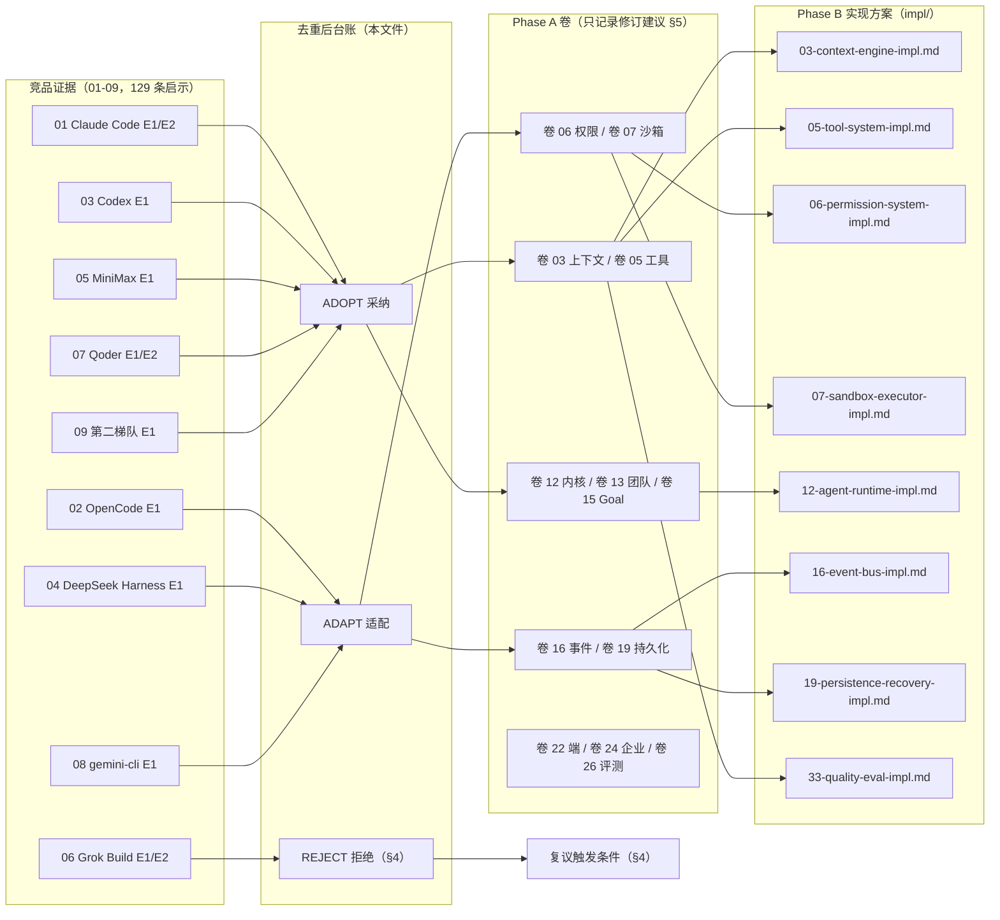
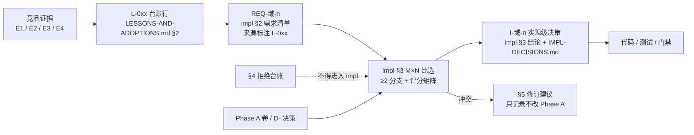

# 竞品研究采纳台账（LESSONS & ADOPTIONS）

> Phase B / B2 交付物。上游输入：`docs/harness/research/competitors/01…09`（9 份源码级竞品研究，共 129 条「启示」）。
> 本文件**不复述**任何竞品报告，只做三件事：**去重合并**、**定级定落点**、**记录对 Phase A 的修订建议**。
>
> 上游设计契约：`docs/harness/`（Phase A，36 卷 / 420 决策登记口径，只读）。Phase B 的 impl 文件清单与编号见 `00-research-plan.md` §1.2。
> 铁律：本文件**不改动 Phase A 任何卷册**；发现冲突只记录（§5），由 `impl/IMPL-DECISIONS.md` 汇总裁决。

---

## 目录

0. §0 摘要（一页速览）
1. §1 汇总口径（合并规则 / 处置词汇 / 映射规则）
2. §2 采纳台账（ADOPT / ADAPT，86 行）
3. §3 关键采纳项展开说明（18 项）
4. §4 拒绝台账（REJECT，14 项）
5. §5 对 Phase A 的修订建议（15 项）
6. §6 与决策体系的关系（L- → REQ- → I-）
7. §7 参考与检索口径（去重 URL + 开放问题）

---

## 0. 摘要（一页速览）

**产出是什么**：把 9 份竞品研究报告的 129 条「启示」压缩为 **86 行去重机制**（§2）+ **14 条拒绝**（§4）+ **15 条 Phase A 修订建议**（§5），每行机制都带「竞品证据等级 → Phase A 卷/决策号 → Phase B impl 文件与章节 → 优先级 → 风险」。

**结构性结论（10 条）**：

1. **权限/沙箱是竞品差距最大的域，也是我们最大的差异化窗口**：9 份报告中 6 份把权限列为最成熟子系统；第二梯队 7 家里 5 家「无沙箱 + 宿主直执行」（09 §④.2 `[E1]`）。→ §2.1 一次性落了 18 行机制，其中 15 行为 P0。
2. **「有序决策链 + 免疫项 + 失败关闭」三件套是 Phase A 卷 06 的主要缺口**：Phase A 已选「风险分级 + 多层策略求值」（D-PERM-1/2/10），但缺「决策链顺序语义」「bypass 免疫清单」「审批 UNAVAILABLE 一等结果」——见 L-001/L-005/L-009，并已写入 §5 的 D-PERM-4 修订建议。
3. **工具系统的高价值项集中在「边界」而非「能力」**：三层结果预算（L-020）、输出契约与恰好一次收尾（L-021）、披露三档（L-023）、注册身份快照（L-025）——全部是「防泄漏 / 防漂移 / 防误执行」类机制，实现成本低、收益直接。
4. **上下文系统的可借鉴项是「工程护栏」而非「算法」**：压缩熔断 + 冷却（L-028）、状态码 + token 校验（L-029）、三事件锁 + 孤儿检测（L-030）、缓存前缀契约（L-032）——Phase A 的「四级压缩」是算法侧更强，护栏侧是缺的。
5. **「一切皆事件」在我们这边是铁律，在竞品那边是稀缺品**：只有 OpenCode（事件溯源）与 Claude Code（JSONL 链）接近；因此 L-051/L-052 的「durable/live 双族 + 先订阅后重放 + code 永不重编号」属于**我们输出标准、竞品提供反面证据**的条目（越晚做越贵）。
6. **多 Agent 的正确起点是「差集与上限」，不是「拓扑与角色」**：子代理能力模式不可模型自选（L-038）、子 ≤ 父 deny 差集（L-039）、独立可观测（L-041）、报告独立验证（L-043）——四条不变量应先于任何编排拓扑落地。
7. **自治（Goal/Schedule）的成败取决于「暂停语义」**：空转检测、未知状态降级暂停、崩溃降级、固定预算、调度 jitter / 锁 / 过期（L-044/L-045）——全部是「防僵尸自驱」的机制，与 Phase A D-GOAL-2/4 同向但更具体。
8. **恢复与检查点已有事实标准**：影子 Git 仓 + 事务化回滚 + per-task 隔离 + 保留窗口（L-048/L-049）是第二梯队 7 家的共识形态（Aider 走真提交、Cline/Roo 走影子仓），Phase A 卷 19/21 只需补齐「事务 + 回收」。
9. **企业能力的抓手是「策略下发与钉扎」，不是「账号体系」**：设置分层 + 托管覆盖 + 环境变量钉扎 + 防项目自举（L-058）；第二梯队调研亦得出同向结论（09 §④.1-10 `[E1][E4]`）。
10. **必须拒绝的核心是「假设迁移」**：拒绝台账 14 条里有 6 条本质是「上游假设不可迁移」——无沙箱（R6）、同进程全权限（R8）、单文件存储（R10）、单 wire 协议（R3）、隐式降级（R5）、历史改写式压缩（R13）。

**最高影响单条（若只允许采纳一条）**：**L-001 有序权限决策链 + bypass 免疫清单 + 最外层转换**。理由：它是唯一一条「不采纳即存在静默提权路径」的机制，且改动面限于卷 06 决策链内部，不牵动数据模型与部署形态。
**最贵的一条（若只允许延后一条）**：**L-052 已发布 code 永不重编号 + compat 读取器**——延后意味着历史会话与集成方契约断裂，事后不可补救。

---

## 1. 汇总口径

### 1.1 输入统计与合并规则

**输入**：9 份竞品报告的 §8「对我们（OpenCoding）的启示」，原始条目 **129 条**（01:15 / 02:15 / 03:15 / 04:15 / 05:15 / 06:12 / 07:12 / 08:15 / 09:15），另加各家 §0/§1 结论速览与 §5–§7（工程亮点 / 局限）作为**证据补充**。

**去重口径（强制，写入本文件即生效）**：

| # | 规则 | 说明 |
| --- | --- | --- |
| D1 | **一行一个「机制」**，不按「结论句」切分 | 同一机制在多份报告出现时合并为一行，来源列并列（例：L-007 合并 03 §8#3 与 08 §⑧ G2）。 |
| D2 | **一个来源条目含多个独立机制时拆行** | 例：06 §8-2 含「fail-closed 施加」「自配置不可写 / 恢复不放宽」「平台 × 能力矩阵」三个机制 → 拆为 L-014 / L-015；02 §⑧ L11 的「拒绝无沙箱」入 §4（R6），「能力隔离代码模式」入 L-026。 |
| D3 | **同族但语义不同不合并** | 例：「审批三作用域沉淀」（L-007）与 Phase A 的「六级记忆授权」是不同持久化语义，两行并存并在落点注明映射关系。 |
| D4 | **反面清单（不可复用 / 局限）不进 §2** | 统一进 §4，且必须写「复议触发条件」。 |
| D5 | **与 Phase A 无对应者标「空缺」** | 空缺 ≠ 冲突：缺口作为增量需求进入对应 impl 的 §2 REQ 清单。 |
| D6 | **禁止推论升级** | 竞品报告标 `[E4]` 的推断不得在台账中升格为事实；`[E3]` 类指控（如「全仓上传」）只允许出现在 §7 开放问题。 |
| D7 | **阈值必须配置化** | 凡台账要求「照抄参数」的行（并发上限、字符预算、冷却时间、jitter 比例等），落点一律为 `open-coding.*` 配置项，不得写成代码常量（对齐 `config-extraction-rules.md` §6）。 |

**证据等级**：沿用 `00-research-plan.md` §2 —— `[E1]` 源码级（含文件路径/行号）、`[E2]` 官方文档/官方 schema、`[E3]` 第三方、`[E4]` 推断。本文件所有引用**回溯到原报告**，不回读源码；机制名歧义时按 §7.2 的检索口径回原报告 grep。

### 1.2 处置词汇（三段式）

| 处置 | 含义 | 判据 | 落点要求 |
| --- | --- | --- | --- |
| **采纳 ADOPT** | 机制语义可直接落地，含参数、常量、清单 | 与 Phase A 已选分支同向，或仅为缺口补齐 | impl §2 REQ + §3 比选中作为**选定分支**参与评分 |
| **适配 ADAPT** | 方向正确，但必须按 **Java 21 / Spring Boot / PostgreSQL / 常驻内核 + IPC** 边界改造 | 上游是 Rust 所有权、TS Effect-Service、单进程内嵌、Bun/Node 专有假设 | impl §3 必须给出 ≥2 分支与「放弃上游形态」的代价 |
| **拒绝 REJECT** | 明确不做 | 许可风险 / 安全红线 / 与 Phase A 铁律冲突 / 上游自陈未验证 | 进 §4，含复议触发条件；不得进入 impl（除被放弃分支说明） |

**三条适配铁律**（贯穿全部 ADAPT 行）：

1. **不是进程内**：我们有 Daemon + IPC + 多端。上游「单进程直接调用」的机制必须回答「跨进程后语义如何保持」（如审批、事件、工具注册身份）。
2. **不是无事务**：PostgreSQL 事务 + Flyway + 行级多租户是底座。上游 SQLite / 单 JSONL 文件的假设一律需重述为「事务边界 + 分域写入者」。
3. **不是无审批**：一切动作过统一权限决策链（H-008）。上游「工具直接执行 + 事后审计」需前置到决策点。

### 1.3 映射规则（台账 → Phase A 卷 → Phase B impl）

每行固定映射三段：

- **我们现状**：Phase A 卷号 + 决策号（有则引用，无则「空缺」）。决策号取自 `DECISIONS.md` §0 域编码表与各卷 §9 域内决策汇总。
- **落点**：Phase B impl 文件名 + 章节，章节号沿用 `00-research-plan.md` §3 的 11 节骨架（§2 REQ 清单 / §3 M×N 比选 / §5 类图 / §6 时序 / §7 状态机 / §8 数据模型 / §9 接口与配置 / §10 非功能 / §11 验收）。
- **优先级**：`P0` = 不落地则核心闭环不可用或不安全；`P1` = 显著提升质量 / 成本 / 企业可交付性；`P2` = 增强项，可延后但仍需在 impl 中登记。

### 1.4 台账结构总览

---

## 2. 采纳台账（ADOPT / ADAPT）

> 共 **86 行**：P0 **59 行** / P1 **19 行** / P2 **8 行**；「结论」列取值 `采纳`（57 行，含 1 行「反面转正」）或 `适配`（29 行）。排序即优先级顺序（P0 → P1 → P2），编号连续不跳号（L-001…L-086）。

### 2.1 P0 · 权限与安全（卷 06 / 07 / 30）

> 本组是全台账最高价值区：9 份报告中有 6 份把权限 / 沙箱列为最成熟子系统；第二梯队 7 家中 5 家「无沙箱 + 宿主直执行」（09 §④.2 `[E1]`），隔离能力的时间差即我们的窗口期。

| 编号 | 机制 | 来源（竞品 + 证据等级） | 我们现状（Phase A 卷/决策号 or 空缺） | 结论 | 落点（impl 文件 + 章节） | 优先级 | 风险 |
| --- | --- | --- | --- | --- | --- | --- | --- |
| L-001 | 权限判定是**有序决策链**：deny → ask → 工具自身校验 → 计划模式 → 交互强制 → 内容级 ask（可穿透 bypass）→ safetyCheck（**bypass 免疫**）→ alwaysAllow → passthrough；`dontAsk` 的 ask→deny 转换置于**最外层**防提前 return 绕过 | 01 §8#1 `[E1]`（permissions.ts:556/1524） | 卷 06 D-PERM-1/3（动作网关 + 旁路检测，无「免疫项」概念） | 适配 | `06-permission-system-impl.md` §7 决策链、§3 选型 | P0 | 免疫项若做成配置开关即静默提权；须代码级硬约束 + 链条顺序快照测试 |
| L-002 | 五级授权流水线（PreToolUse hook → 规则 → 记忆授权 → 只读自动批准 → 模式策略）；规则跨来源合并按**严重度**判定 `deny > ask > allow`，而非声明顺序 | 06 §8-1 `[E1]+[E2]` | 卷 06 D-PERM-1/2（多层策略求值，未规定合并律） | 采纳 | `06-permission-system-impl.md` §7、§3 | P0 | 与 L-004 信任带的语义重叠；需一次性定义「严重度 vs 信任带」唯一裁决序 |
| L-003 | **决策原因枚举化**（25 个 `PermissionDecisionReason` 变体）入事件 Schema，使「为什么被拦」在指标与审计层可聚合、可回放 | 06 §8-1 `[E1]`（permission_analytics.rs:116） | 卷 06 D-PERM-4（含原因与策略引用，但为文案非枚举）/D-PERM-12 | 采纳 | `06-permission-system-impl.md` §8 事件类型、§10 指标 | P1 | 枚举发布后只增不改（见 L-053）；原因数膨胀拖慢热路径，需懒构造 |
| L-004 | 策略规则用**信任带** `admin > user > workspace > extension > default` + 带内小数优先级，满足「企业基线不可被个人覆盖，个人仍可在自己带内细化」 | 08 §⑧ G1 `[E1]`（policy/policies/*.toml） | 卷 06 D-PERM-2（声明式规则）/D-PERM-10（企业基线不可覆盖） | 采纳 | `06-permission-system-impl.md` §3、§7 | P0 | 需给出「信任带」与既有作用域继承（组织→项目→用户→会话）的唯一映射表，否则双模型并存 |
| L-005 | 审批结果是**封闭集** `ALLOWED_ONCE / REJECTED / CANCELLED / UNAVAILABLE`；应答者缺失 / 非持有 / 抛异常 / 不合规一律降级 `UNAVAILABLE`，调用方 fail-closed | 04 §8 L4 `[E1]`（docs/subsystems/approval.md） | 卷 06 D-PERM-4（四值 ALLOW / ALLOW_ONCE / ASK / DENY，无 UNAVAILABLE） | 采纳 | `06-permission-system-impl.md` §7 状态机、§9 DTO | P0 | 缺 UNAVAILABLE 会把「无人应答」误判为拒绝或放行；决策链末端必须显式含该分支 |
| L-006 | 审批请求**不携带工具参数**，只以 `toolCallId` 关联已流式的工具调用 | 04 §8 L5 `[E1]` | 卷 06 D-PERM-5（通道无关协议，未言明参数归属） | 采纳 | `06-permission-system-impl.md` §9 审批 DTO、§6 时序 | P0 | UI 若自行取参会形成「两份参数漂移」；审批事件体也会被长参数撑爆 |
| L-007 | 审批结果**三作用域沉淀**（会话 / 工作区 / 用户）+「仅本次」与「并保存」分离 + 结果**回写为可复用规则**（含到期时间与记录人） | 03 §8#3 `[E1]`（tools/sandboxing.rs、execpolicy/amend.rs）+ 08 §⑧ G2 `[E1]`（scheduler/policy.ts:114） | 卷 06 D-PERM-6（六级范围 once/session/project/workspace/pattern/dir）/D-PERM-7（规则即代码） | 采纳 | `06-permission-system-impl.md` §6 时序、§7；`30-interaction-ux-impl.md` §6 | P0 | 三作用域与六级范围是两套词汇，必须给映射表；回写规则缺到期 / 记录人即永久提权 |
| L-008 | 同一决策在不同外壳语义不同：交互 = ask 转提示；**Headless = ask 转拒绝**；被集成（SDK/ACP）= **交宿主决策** | 07 §8-4 `[E2]` | 卷 06 D-PERM-5（通道无关 + 多端呈现 + 超时策略） | 采纳 | `06-permission-system-impl.md` §3、§9；`22-cli-tui-impl.md` §7 | P0 | 三档必须由内核裁决（壳只上报能力位），否则同一任务跨壳权限语义分叉 |
| L-009 | **两套分类器 + 明示失败语义**：确定性硬拦截（bypass 不可覆盖）与需 LLM 判断的软风险（强制离开快速路径）分离；敏感凭据读取**单独路由**到 AI 门 | 05 §8 M4 `[E1]` | 卷 06 D-PERM-10（企业基线技术强制不可覆盖） | 采纳 | `06-permission-system-impl.md` §7、`27-security-runtime-impl.md` §6 | P0 | 硬拦截清单必须作为**数据文件**独立发布并可审计，写进代码即无法版本化 |
| L-010 | 自动批准做成**多维矩阵 + 名单 + 超时兜底 + 模式剖面**：动作类别 × 越工作区 × 受保护文件开关；命令白 / 黑名单；追问可倒计时自动应答；ask 与 deny 分离；「角色提示词 + 工具组 + 文件正则」打包为可分发模式 | 09 §⑤ S4 `[E1]`（roo-code auto-approval/index.ts、mode.ts:9-70） | 卷 06 D-PERM-7/9（六档模式 + 自动批准规则）、卷 13 D-TEAM-1 | 采纳 | `06-permission-system-impl.md` §7、`13-agent-teams-impl.md` §7 | P0 | 上游 20+ 设置项的组合爆炸；需剖面打包 + 组合合法性校验 + 默认值收敛 |
| L-011 | 沙箱与权限**联动**：已沙箱命令跳过 ask 直接放行；「逃逸沙箱」做成独立决策原因（`sandboxOverride`）与带批准的专用参数 | 01 §8#2 `[E1]+[E2]` | 卷 06 + 07 D-SBOX-2（风险驱动自动选档；未定义「沙箱换效率」） | 采纳 | `06-permission-system-impl.md` §7、`07-sandbox-executor-impl.md` §7 | P0 | 免询问必须绑定「档位可证明生效」（结合 L-012），否则等于静默降权 |
| L-012 | 平台隔离器**上报执行强度** `FULL / PARTIAL`；要求绝对边界的消费方（密钥代理、DLP）在 PARTIAL 下自行拒绝或降级 | 04 §8 L6 `[E1]`（sandbox-local/src/index.ts:2,141,160） | 卷 07 D-SBOX-11（跨平台能力矩阵 + 降级留痕） | 采纳 | `07-sandbox-executor-impl.md` §7、§10 | P0 | Windows ACL 类后端若谎报 FULL，密钥与 DLP 边界整体失效 |
| L-013 | 安全不变式「存在 denied-read 路径时禁止脱沙箱执行」实现为**单点可测谓词**（而非散落 if） | 03 §8#4 `[E1]`（tools/sandboxing.rs:270-296） | 卷 07 D-SBOX-3（只读根 + 显式读写区）**空缺此不变式** | 采纳 | `07-sandbox-executor-impl.md` §7、§11 单测 | P0 | 散落实现会随迭代静默失效；需单点函数 + 属性测试 |
| L-014 | 文件边界三层：**提权元数据路径**（`.git/hooks`、`.qoder/`、沙箱自配置）在策略数据结构层标记不可写 + 「**写保护文件**」与「**完全隐藏文件**」两分法（`.git*` / ignore 文件 vs `.env*`） | 03 §8#5 `[E1]` + 08 §⑧ G12 `[E1]`（sandboxManager.ts:198-228）+ 06 §8-2 `[E2]` | 卷 07 D-SBOX-3（路径白名单语义）、卷 21 D-GIT-7 | 适配 | `07-sandbox-executor-impl.md` §8 文件边界、§7 | P0 | L0 档无法真正隐藏 → 必须降级为「掩蔽 + 出网阻断 + 违规事件」并留痕；路径需反绕过规范化 |
| L-015 | 沙箱 **fail-closed**（自定义档位施加失败即拒绝启动）+ 恢复时禁止放宽档位 + **平台 × 能力矩阵**显式声明（对无法实现的能力显式降级或拒绝，拒绝「沉默的不对等」） | 06 §8-2 `[E1]/[E2]/[E4]` | 卷 07 D-SBOX-2/11（能力矩阵 + 可强制拒绝） | 采纳 | `07-sandbox-executor-impl.md` §6 状态机、§7 矩阵、§10 | P0 | 桌面端无虚拟化时 fail-closed 导致完全不可用 → 需 L0+ 兜底档 + 明确告知；矩阵须按平台分别表述 |
| L-016 | **工具 / 插件凭据租约**：宿主长期持有凭据，向工具子进程只发短期 token（TTL、绑定 session/工具、可撤销） | 05 §8 M9 `[E1]`（credential lease broker） | 卷 07 D-SBOX-5（密钥代理注入短期凭证）、卷 30 D-SEC-4 | 采纳 | `27-security-runtime-impl.md` §5、`07-sandbox-executor-impl.md` §9 | P0 | 缺撤销与绑定即等价长期凭据；每次发放 / 撤销须进审计事件 |
| L-017 | Bash 安全 = **静态分析清单**（IFS 注入、ANSI-C 引号绕过、heredoc 替换、危险 flag、畸形 token、zsh 模块命令）+ 两级分类器 + **规则遮蔽检测** | 01 §8#13 `[E1]`（bashSecurity.ts、shadowedRuleDetection.ts） | 卷 07 D-SBOX-7（解析 + 规则库 + 高风险模型二次判定）、卷 30 | 采纳 | `07-sandbox-executor-impl.md` §9、`27-security-runtime-impl.md` §6 | P0 | 清单须以**用例库**维护并回归；规则遮蔽检测对企业策略治理必要但极易漏 |
| L-018 | 扩展准入前置：清单校验 + 恶意检查 + 官方 / 平台扩展分级 + 完整性哈希（供应链四类：清单 / 签名 / 哈希 / 来源） | 09 §⑤ S14 `[E1]` + 08 §⑧ G9 `[E1]`（integrity.ts） | 卷 18 D-PLG-3/8、卷 30 D-SEC-6 | 采纳 | `18-plugin-runtime-impl.md` §6、`27-security-runtime-impl.md` §7 | P0 | 哈希须覆盖全部载荷（脚本 / 主题 / 提示）；私有化需离线信任根 |

### 2.2 P0 · 工具与执行管线（卷 05）

> 本组特征是「机制小、边界大」：全部 8 行都不改变 Phase A 的工具模型（三通道契约 + 执行管线），只在契约上补「输出/失败/身份/披露」四类边界。

| 编号 | 机制 | 来源（竞品 + 证据等级） | 我们现状（Phase A 卷/决策号 or 空缺） | 结论 | 落点（impl 文件 + 章节） | 优先级 | 风险 |
| --- | --- | --- | --- | --- | --- | --- | --- |
| L-019 | 工具调度按 `isReadOnly` / `isConcurrencySafe` **分区成批**（连续只读并行、遇写切批串行）+ 并发上限可覆盖 + 判定异常时**保守默认不安全**；等价实现可用**读写锁语义**（并行共享 / 非并行独占） | 01 §8#3 `[E1]`（toolOrchestration.ts:8-11,94-119）+ 03 §8#6 `[E1]`（tools/parallel.rs:44-64） | 卷 05 D-TOOL-4（资源声明 + 冲突图调度） | 采纳 | `05-tool-system-impl.md` §6 时序、§7、§10 | P0 | 进程内常量上限在 Server 形态失控 → 需池化 + 配额 + 背压；与资源冲突图并存时须定义优先级 |
| L-020 | 工具结果**统一边界**：三层预算（单结果 50k 字符 / 单消息聚合 200k 字符 / 100k token 折算，`BYTES_PER_TOKEN=4`）+ 超限落盘 + **标签化预览** + 工具级覆盖阈值；「producer 侧捕获限制」与「model-output 有界化」显式分离；**保留失败即失败** | 01 §8#4 `[E1]`（constants/toolLimits.ts:11,25,30,46）+ 02 §⑧ L6 `[E1]`（tool-output-store.ts:12-15） | 卷 05 D-TOOL-5（分级：<4k token 内联 / ≥4k 外置引用）；**无单消息聚合上限** | 适配 | `05-tool-system-impl.md` §8、`03-context-engine-impl.md` §8 | P0 | 阈值须配置化（`open-coding.tool-output.*`）；缺聚合上限时 N 个并行工具可同时打爆一回合；清理失败静默会导致对象存储无限增长 |
| L-021 | 工具面**输出契约** `ToolOutputDefinition{schema, render, presentationMeta}` 与模型面 schema 分离 + 注册表**显式白名单**剥离宿主字段（execute/presentation 不得泄漏进模型请求）+ 结果「**恰好一次收尾**」语义（含全部绕过 post-execute 的失败路径） | 04 §8 L1/L2 `[E1]`（packages/core/tools/src/index.ts） | 卷 05 D-TOOL-1/2（三通道 → 统一 ToolSpec）、D-TOOL-9 | 采纳 | `05-tool-system-impl.md` §5 类图、§6 时序、§7；附录 B | P0 | `render()` 必须是纯函数并配测试；漏掉异常路径会出现「有调用无结果」的审计空洞 |
| L-022 | 失败**四分法**：期望内模型可见失败 / 中断 / 未知与陈旧调用（不调 handler 但产生模型可见错误）/ defect（走运维失败策略）；叶子工具只翻译自己刻意分类的错误 | 02 §⑧ L10 `[E1]` | 卷 05 D-TOOL-9、卷 12 D-AG-8（四级失败恢复） | 适配 | `05-tool-system-impl.md` §3、§7；`12-agent-runtime-impl.md` §7 | P0 | 必须与 Java 异常体系（业务异常 / 中断 / 系统异常）建立唯一映射表，否则「catch 把中断与缺陷吞成模型可见文本」 |
| L-023 | 工具**披露三档** `OMIT / INLINE / TOOL_SEARCH` + MCP 检索披露（默认先检索后注入；单 server 工具数低于阈值内联） | 05 §8 M6 `[E1]` | 卷 05 D-TOOL-6（模式子集 + 按需加载 + 语义检索发现）、卷 09 D-MCP-3 | 采纳 | `09-mcp-gateway-impl.md` §7、`05-tool-system-impl.md` §8 | P0 | 检索披露引入「工具发现失败」新失败模式 → 需全量列表兜底 + 命中率指标 |
| L-024 | 工具调用是**显式状态机（7 态）**，作为 UI / 遥测 / 恢复的唯一事实源（UI 禁止自行拼状态） | 08 §⑧ G3 `[E1]`（scheduler/types.ts:26） | 卷 05 D-TOOL-3（混合执行模型）、卷 16 | 采纳 | `05-tool-system-impl.md` §7 状态机、`16-event-bus-impl.md` §8 | P0 | 状态数须与卷 12 的 Item 原语对齐，避免两套状态并行 |
| L-025 | **工具注册身份快照**：materialize 时冻结注册身份，settle 时比对；插件热替换后旧回合调用被**明确拒绝**而非执行新实现 | 02 §⑧ L2 `[E1]`（tool/registry.ts:47-61） | 卷 05 D-TOOL-6、卷 18 D-PLG-6（热重载） | 采纳 | `05-tool-system-impl.md` §7、§11 | P0 | 需定义「工具已变更，请重试」业务异常文案与重试语义；静默执行属数据损坏级缺陷 |
| L-026 | **程序化工具调用 / 代码模式**：模型写程序编排工具（N 次 tool-call → 1 段程序），子调用**重入完整受守卫管线**（权限 / 审计 / 沙箱不旁路）；语言级隔离使代码无 ambient fs / process / network 权限；执行限额（超时 / 子调用数 / 输出字节 / 并发）**必须显式设置安全默认**（上游默认不限制是缺陷） | 02 §⑧ L11 `[E1]`（packages/codemode）+ 04 §8 L12 `[E1]` | 卷 05 D-TOOL-11（外部工具统一注册、共享管线）、卷 12 | 适配 | `05-tool-system-impl.md` §8、§10；`07-sandbox-executor-impl.md` §9 | P0 | 不引入 JS 解释器 → 用受限指令序列 DSL；限额留空会在无人值守下耗尽预算；审计须逐条产出子调用事件 |

### 2.3 P0 · 上下文、提示词与知识检索（卷 03 / 04 / 11）

> 本组把「缓存亲和」与「压缩可解释」拆成了可验收的工程护栏（熔断/状态码/锁/频次/按需加载）；唯一的知识检索行（L-027）是第二梯队唯一「把仓库级上下文做成可调预算流水线」的实现。

| 编号 | 机制 | 来源（竞品 + 证据等级） | 我们现状（Phase A 卷/决策号 or 空缺） | 结论 | 落点（impl 文件 + 章节） | 优先级 | 风险 |
| --- | --- | --- | --- | --- | --- | --- | --- |
| L-027 | **Repo Map 式结构索引**：tree-sitter 符号 → 会话文件 / 提及标识符为种子 → 图排序（PageRank 个性化）→ **按 token 预算二分拟合渲染**；索引 / 检索与 agent 解耦为可插拔多索引（向量 + 全文并存） | 09 §⑤ S1 `[E1]`（aider repomap.py:365-706、continue CodebaseIndexer.ts） | 卷 11 D-KB-4（三路混合 + 融合重排）/D-KB-5（符号级 + 结构图 + 模块摘要） | 适配 | `11-knowledge-system-impl.md` §7、`03-context-engine-impl.md` §8 | P0 | 照抄排序参数与本仓语言分布不符 → 需按仓库校准；须补索引失效 / 刷新策略 |
| L-028 | 压缩**多机制并存 + 熔断 + 冷却**：microCompact（清旧工具结果）→ autoCompact（阈值触发）→ reactiveCompact → contextCollapse；连续 3 次失败熔断 + 5 分钟冷却（**冷却下限防误配**） | 01 §8#5 `[E1]`（services/compact/*、contextCollapse/*） | 卷 03 D-CTX-2（四级压缩管线）/D-CTX-7 | 采纳 | `03-context-engine-impl.md` §7、§10 | P0 | 熔断状态须持久化（跨重启 / 跨端），否则重启即重试坏路径；下限值写法（拒绝小值）值得照抄 |
| L-029 | 压缩结果**状态化**：NOOP / 成功 / 截断 / 空摘要 / 膨胀；压缩前后 token **必须校验** | 08 §⑧ G6 `[E1]`（chatCompressionService.ts:426,469） | 卷 03 D-CTX-2/11 | 采纳 | `03-context-engine-impl.md` §7、§8 事件 | P0 | 无状态码则「压坏了」无法被门禁或 UI 捕获，只表现为质量下降 |
| L-030 | 压缩 / 长任务「**三事件锁 + 孤儿锁可检测**」：start 先写、end 最后写；「有 start 无 end」即崩溃证据并可生成补偿 | 04 §8 L3 `[E1]` | 卷 03 D-CTX-8（事件驱动检查点）、卷 19 D-PERS-7 | 采纳 | `03-context-engine-impl.md` §6 时序、`19-persistence-recovery-impl.md` §6 | P0 | 须定义补偿动作与告警；否则孤儿状态只能人工清理 |
| L-031 | 压缩前 **memory flush**（保留约 4000 token 头部空间先落记忆再丢弃）+ **two-pass 压缩**（超长会话分段摘要防坍缩） | 06 §8-3 `[E1]`（compaction.rs、two_pass.rs） | 卷 03 D-CTX-2、卷 10 D-MEM-2 | 采纳 | `03-context-engine-impl.md` §7、`10-memory-system-impl.md` §7 | P0 | flush 失败必须阻止压缩（否则知识静默丢失）；two-pass 分段比例须配置化 |
| L-032 | **缓存前缀契约**：系统提示切「静态可缓存前缀 + 动态后缀」并用**源码级常量**标记边界（含「改这里须同步改缓存逻辑」注释）；审批 / 模式 / 沙箱等运行时变更**不改写系统提示节点**，只以追加式 sourced 消息承载；Goal 契约 **kickoff 一次注入、续跑仅追加短提示**，命中率进指标 | 01 §8#6 `[E1]`（constants/prompts.ts:103-116）+ 04 §8 L10 `[E1]` + 05 §8 M8 `[E1]` | 卷 03 D-CTX-6（稳定前缀分区 + 断点标记） | 适配 | `04-prompt-manager-impl.md` §7、`03-context-engine-impl.md` §7、`15-goal-scheduler-impl.md` §7 | P0 | 多协议下 `cache_control` 语义各异，须按 Provider 能力协商后再复用；续跑若改写契约则前缀失效、成本不可预测 |
| L-033 | **Context Epoch / Context Source**：系统提示建模为「带 key / codec / load / baseline-update-removed 三渲染器的类型化源集合」，epoch 内 baseline 冻结，变化以**持久化的会话中系统消息按时间序注入**；`Unavailable`（临时不可观测，保留旧值）与 `Incompatible`（历史快照无法解码）语义分离 | 02 §⑧ L1 `[E1]`（system-context/index.ts:32-39,198-206,218-280） | 卷 03 D-CTX-1（九区段 + 每段预算）/D-CTX-9 | 适配 | `03-context-engine-impl.md` §7、`04-prompt-manager-impl.md` §7 | P0 | 只作**九区段内部填充单元**，不得替换区段模型；Key 命名空间正则与 DuplicateKeyError 可直接采纳为规范 |
| L-034 | **系统提醒频次类型学** `FIRST_TURN_ONLY / EVERY_TURN / TURN_BACKOFF / COOLDOWN / ONE_SHOT`，把「何时再提醒一次」从散落 if 变为声明式注册表 | 05 §8 M7 `[E1]`（system-reminder 模块） | 卷 03 D-CTX-11、卷 04 | 采纳 | `03-context-engine-impl.md` §8、`04-prompt-manager-impl.md` §7 | P0 | 频次声明须与实际注入位置绑定，否则同一条提醒重复计费 / 重复触发 |
| L-035 | 指令 / 规则**按需加载**：模型用工具按 name + description 请求规则，仅 `alwaysApply` 规则常驻系统提示 | 09 §⑤ S2 `[E1]`（continue requestRule.ts:8-40） | 卷 03 D-CTX-9（五级分层指令装载）、卷 04 | 采纳 | `04-prompt-manager-impl.md` §7、§4 架构图 | P0 | 按需加载使「必须始终生效」的规则有遗漏风险 → 需 alwaysApply 白名单 + 注入失败兜底 |
| L-036 | **主循环显式状态机**：跨迭代字段集中声明、每个 `continue` 站点整体重建状态、终态联合类型；**三类循环护栏**（doom loop 按 Agent 维度、工具失败循环按路径 / 签名 / 类别阈值、续跑提醒上限 20）+ 循环检测「启发式 + 独立模型复核 + 批量操作显式豁免」 | 01 §8#10 `[E1]`（query.ts:629-654、MAX_CONTINUATION_NUDGES）+ 08 §⑧ G7 `[E1]`（loopDetectionService.ts:68-101） | 卷 12 D-AG-1（混合状态机 + 可插拔策略）/D-AG-9（多维上限 + 进展度量 + 重复检测） | 采纳 | `12-agent-runtime-impl.md` §6 状态机、§7 | P0 | 阈值须配置化并按 Agent 维度隔离统计（全局计数会误伤并行 SubAgent）；模型复核带来额外成本，需阈值区间 |

### 2.4 P0 · Agent 内核与协作（卷 12 / 13 / 14 / 15 / 19 / 21）

> 本组 14 行的共同结构是「**不变量 + 护栏**」：子代理四条（能力模式/差集/描述符/独立观测）、自治三条（空转/所有权/调度护栏）、恢复三条（事务/影子仓/回收）、验收三条（双口径完成信号/独立验证/规格必填）。

| 编号 | 机制 | 来源（竞品 + 证据等级） | 我们现状（Phase A 卷/决策号 or 空缺） | 结论 | 落点（impl 文件 + 章节） | 优先级 | 风险 |
| --- | --- | --- | --- | --- | --- | --- | --- |
| L-037 | 循环用 **effects-as-data + 可重入持久化** 表达：`ops_*` 覆盖全部控制点（shell / compaction / hook / llm / maxturn / retry / tool approval…），每步可单测、可续跑、可重放 | 09 §⑤ S11 `[E1]`（goose state_machine/{mod,effects}.rs） | 卷 12 D-AG-1、D-AG-12（检查点 + 可暂停续跑 + 跨端接管） | 采纳 | `12-agent-runtime-impl.md` §5 类图、§7 | P0 | Java 侧须用 sealed interface + record 显式定义 state / effect 两族，否则退化为命令式 while（收益归零） |
| L-038 | 子代理**能力模式**（read-only / read-write / execute / all）由 agent **定义**声明，**不可由 spawn 参数或模型自选** | 06 §8-5 `[E2]` | 卷 12 D-AG-13（声明式定义 + 四级作用域）、卷 13 D-TEAM-10 | 采纳 | `12-agent-runtime-impl.md` §8、`13-agent-teams-impl.md` §7 | P0 | 模型可自选能力即自我提权；须硬编码在内核并与卷 06 决策链交汇 |
| L-039 | **子代理权限差集不变量**：子会话权限 = 父的 deny 集合 + 外部目录规则 + 默认补丁（新增能力默认 deny、显式声明解除）；父的限制只管自己 | 02 §⑧ L14 `[E1]`（agent/subagent-permissions.ts:20-27） | 卷 12 D-AG-5（选择性继承）、卷 13 D-TEAM-10（权限上限单调） | 采纳 | `13-agent-teams-impl.md` §7、`06-permission-system-impl.md` §7 | P0 | 须作为**基线不变量**（断言 `SubAgentPerms ⊆ ParentDenySet`）而非可配开关；配错即越权 |
| L-040 | 子代理 provider 的**静态能力描述符 + 运行前校验 + 响亮拒绝**（`UNSUPPORTED_CAPABILITY`）；可续 / 可恢复能力用「可选接口存在性」表达（Java 侧独立 SPI 接口），而非布尔配置 | 04 §8 L11 `[E1]` | 卷 12 D-AG-4（子会话形态）/D-AG-12、卷 02 D-MDL-5 | 采纳 | `12-agent-runtime-impl.md` §8、§9 SPI | P0 | 描述符与实现漂移会「以为支持」→ 须启动期 + 派生前双重校验；接口存在性需在 SPI 版本协商中可见 |
| L-041 | 子代理**独立可观测**：独立 maxTurns、独立系统提示、事件带 `subagent_id`、独立 logger 命名空间 + **消息投递三语义**（steer / queue / interject）+ 每 sender-target **在途配额** | 09 §⑤ S13 `[E1]`（goose subagent_handler.rs:25-46,291-346）+ 06 §8-5 `[E2]` | 卷 12 D-AG-14（轨迹全量事件级）、D-AG-7（人工介入三时机）、卷 13 D-TEAM-4 | 采纳 | `12-agent-runtime-impl.md` §8、`16-event-bus-impl.md` §8、`13-agent-teams-impl.md` §7 | P0 | 共用 logger / 无 subagent_id 时长任务排障不可定位；三语义优先级须在黑板（D-TEAM-4）统一定义 |
| L-042 | **完成信号显式化**：完成落到「工具 + 事件」双口径（各家分别用 submit / attempt_completion / final_output_tool）；并区分 ask 与 deny、空输出固定话术 | 09 §④.1-6 `[E1]` | 卷 12 D-AG-11（三级验证 + 证据强制）、卷 14 D-TASK-7 | 采纳 | `12-agent-runtime-impl.md` §7、`14-task-plan-engine-impl.md` §7 | P0 | 双口径不一致会「UI 说完成、内核仍在跑」；须由状态机级约束 |
| L-043 | 子代理报告**必须独立验证**（verifier 不得与被验证者共享上下文；把上游「报告不被独立验证」作为反面教材） | 04 §8 L15 `[E1]`（ralph 自陈） | 卷 14 D-TASK-7（证据驱动 + 验收标准强制） | 采纳（反面转正） | `13-agent-teams-impl.md` §7、`14-task-plan-engine-impl.md` §7 | P0 | 无独立 verifier 时「有界报告」被当事实，长任务质量不可控 |
| L-044 | Goal 空转判定：**连续多轮「缺口指纹」不变即自动暂停**（NoProgressPaused）；**未知状态一律降级为可恢复暂停**（新版本状态被旧版本读到 → 暂停而非自驱） | 06 §8-4 `[E1]`（goal_tracker.rs:41-110） | 卷 15 D-GOAL-2（多重终止）/D-GOAL-4（漂移检测） | 采纳 | `15-goal-scheduler-impl.md` §7、§8 事件 | P0 | 指纹算法须防抖（否则长任务误暂停）；「未知即暂停」是前向兼容安全默认，不可反转为自驱 |
| L-045 | Goal / Schedule 自治护栏：`ownerSessionId` + 显式 `/goal take` 夺取 + **崩溃后 active→paused** + resume 给回**固定预算**（默认 100 回合）；调度侧「按 ID **稳定** jitter（recurring ≤10% 封顶 15 分钟 / 一次性 ≤90 秒）+ 文件锁单进程 + recurring 7 天过期 + 任务数上限 50 + 错过提示」全部配置化 | 07 §8-3 `[E2]` | 卷 15 D-GOAL-1/6、D-SCH-1…7（五类触发器 + 幂等 + 熔断）；**现无 jitter / 文件锁 / 过期 / 上限** | 采纳 | `15-goal-scheduler-impl.md` §6 状态机、§7、§9 配置项 | P0 | jitter 若随机（非按 ID 稳定）会造成同时刻风暴；文件锁在集群形态须升级 Redisson 锁；固定预算与卷 24 配额叠加取更小者并产生「预算钳制」事件 |
| L-046 | **Recipe / 模板 = 可调度资产**：instructions + prompt + parameters + response(JSON schema) + sub_recipes + cron + deeplink，字段集与「模板库 + 触发面 + 分享面」一一对应 | 09 §⑤ S12 `[E1]`（goose recipe/mod.rs:43-210、scheduler.rs:275-320） | 卷 34 D-AUTO-1/2（声明式 YAML + 内置 12 模板）、卷 15 D-SCH-2 | 采纳 | `31-automation-library-impl.md` §5 类图、§8 数据模型、§9 | P0 | 响应 schema 与验收标准须统一（避免两套契约）；deeplink 须签名 + 二次确认（卷 29 D-ECO-11） |
| L-047 | **规格驱动**：四段 Spec（需求描述 / 设计方案 / 任务分解 / **验收标准**）+ 评审通过后才执行 + 执行中可追加需求并触发重规划；**验收标准设为必填节** | 07 §8-2 `[E2]` | 卷 14 D-TASK-9（规格文件：可选但推荐）/D-TASK-2、卷 12 D-AG-3（自适应重规划） | 适配 | `14-task-plan-engine-impl.md` §6 时序、§8 | P0 | 上游「编辑历史消息 = 回滚工作区」代价大 → 我们用检查点式部分回滚（L-049）+ 卷 33 确认文案；必填节需模板 + 默认生成降门槛 |
| L-048 | 检查点回滚必须是**事务**：回滚前保全现场（stash / 私有 ref `refs/.../restore-transactions/<uuid>`）、成功才提交、失败可回滚、回滚动作留审计 | 09 §⑤ S7 `[E1]`（cline checkpoint-restore.ts:56-100） | 卷 19 D-PERS-6/7 | 采纳 | `19-persistence-recovery-impl.md` §7、`21-git-worktree-impl.md` §7 | P0 | 无事务保护时一次失败回滚即丢用户改动（不可逆） |
| L-049 | **影子 Git 仓快照**：独立 git directory 内容寻址、不污染用户仓库（不 stash / 不建临时 commit）、`preview()` 不改工作区即返回 diff；与 worktree 目录分离；**per-task 隔离 + git 环境变量清洗 + 构建产物排除 + 保留窗口 / 去重 / 容量上限** | 02 §⑧ L5 `[E1]`（snapshot.ts:94-122）+ 08 §⑧ G5 `[E1]`（checkpointUtils.ts）+ 09 §⑤ S8 `[E1]`（RepoPerTaskCheckpointService、createSanitizedGit） | 卷 21 D-GIT-2（按需分层隔离）/D-GIT-8、卷 19 D-PERS-6 | 采纳 | `21-git-worktree-impl.md` §7、§10 容量；`19-persistence-recovery-impl.md` §7 | P0 | 检查点仓会复制工作区内容（含 `.env`）→ 必须做机密文件排除（结合 L-014）；上游未见回收策略，回收由我们补齐，否则无限膨胀 |
| L-050 | 批量运行**可续跑**语义：已有产物默认跳过、显式 redo、**输出目录编码实验身份**（目录即实验元数据） | 09 §⑤ S10 `[E1]`（swe-agent run_batch.py:75-127） | 卷 26 D-QA-2（环境快照 + 验收脚本 + 权重）/D-QA-7 | 采纳 | `33-quality-eval-impl.md` §7、§11 | P0 | 「目录即身份」须写入 CI 门禁，否则评测结果无法复现 / 对账 |

### 2.5 P0 · 事件、持久化、模型网关与端（卷 16 / 19 / 02 / 22 / 24）

> 本组是「**我们输出标准、竞品提供反面证据**」密度最高的一组：事件兼容纪律（L-052）、迁移安全序列（L-053）、读侧纪律（L-054）三条一旦做错无法事后补救；Tier 抽象（L-055）与 CLI 契约（L-057）则直接决定集成方体验。

| 编号 | 机制 | 来源（竞品 + 证据等级） | 我们现状（Phase A 卷/决策号 or 空缺） | 结论 | 落点（impl 文件 + 章节） | 优先级 | 风险 |
| --- | --- | --- | --- | --- | --- | --- | --- |
| L-051 | 事件分 **durable / live-only 两族**（live-only 增量**不得推进 durable 游标**）+ durable tail **必须先订阅再重放**（wake 用滑动容量 1 边沿触发，靠 DB 行而非内存通知保证不丢）；提交侧同为**单队列** `Submission{id, op, trace}` → `Event{id, msg}`，Submission 携带 W3C trace 与 parent / root turn id | 02 §⑧ L7 `[E1]`（specs/v2/session.md:175-183）+ 03 §8#2 `[E1]`（protocol.rs:191-216） | 卷 16 D-EVT-3/4/5（双阶段总线、至少一次 + 位点、分区有序）/D-EVT-10 | 采纳 | `16-event-bus-impl.md` §6 时序、§7、§8 事件信封 | P0 | 把 live 增量误当发布边界会造成重连后投影缺口；单队列在 Server 形态须分区键，否则跨会话相互阻塞 |
| L-052 | **不变式与兼容纪律**：「模型可见即可重建」（Model-visible means logged）作为运行时不变式 + 断言 + 离线回放门禁；已发布枚举 / 事件 code **永不重编号**、只增不改 + compat 读取器与 legacy 恢复通道 + **wire 标签固定化测试** | 04 §8 L9 `[E1]`（docs/architecture.md:121-127）+ 05 §8 M13 `[E1]`（compat/v1）+ 06 §6-8 `[E1]` | 卷 16 铁律 3 / D-EVT-2（Registry + 版本 + 兼容校验）；卷 19、卷 26 D-QA-1 | 采纳 | `16-event-bus-impl.md` §7、§8、§11；`33-quality-eval-impl.md` §7 | P0 | 事后无法补救（改号即破坏历史会话）→ 必须由 Schema Registry 机械门禁；断言限定在组装边界防拖慢热路径 |
| L-053 | 迁移**安全序列**：有待应用迁移 → 创建并校验在线备份 → 应用迁移 → 最终 schema 校验 → **成功后才授权删除该精确备份**；失败保留备份并暴露「可回滚到备份」Runbook | 05 §8 M1 `[E1]`（backup.ts：创建→校验→迁移→最终校验→授权删） | 卷 19 D-PERS-2（迁移即代码 + CI 校验）/D-PERS-4/13 | 采纳 | `19-persistence-recovery-impl.md` §6、`32-operations-runbook.md` | P0 | 「授权删除」须绑定 R4 权限与 Runbook，否则形同虚设；备份文件须带唯一身份 |
| L-054 | 迁移按**域分目录** + 单调版本 + **repair-\* 类单列**；「**输入面严格 / 读取面宽容**」：DTO 校验拒绝遗留别名，历史解读继续接受并规范化（配「遗留别名权威表 + 终态迁移期限」） | 05 §8 M2/M3 `[E1]` + 06 §6-11 `[E1]` | 卷 19 D-PERS-2/3（expand-contract）、卷 23 | 采纳 | `19-persistence-recovery-impl.md` §6、§7、§8 | P0 | repair 迁移若无审计会掩盖根因；宽容面若无期限会永久膨胀 |
| L-055 | **Tier（档位）抽象**作为用户面向的稳定接口，后端模型可自由替换；契约层 `patches + cache_id + cache_control` 支持增量会话更新与前缀缓存标记 | 07 §8-1 `[E1]/[E2]`（chat.proto、model-tier-selector） | 卷 02 D-MDL-5（能力协商 + 显式失败 + 授权降级留痕）/D-MDL-6/D-MDL-8 | 适配 | `02-model-gateway-impl.md` §7 路由、§8 契约 | P0 | 拒绝「档位与 credit 倍率同文耦合」「下线时各外壳处置不一致」；`patches` 上游无文档，我们**不实现服务端改历史**（与 L-052 冲突），只保留断点标记 |
| L-056 | headless 与桌面 / TUI **共用同一服务端协议**，headless 是「进程内客户端」而非独立实现 | 03 §8#1 `[E1]`（exec/src/lib.rs:20-40） | 卷 01 D-ARC-3（sidecar 默认 + embedded / remote 同源）/D-ARC-5 | 采纳 | `01-kernel-runtime-impl.md` §7、`22-cli-tui-impl.md` §7 | P0 | 双模须协议层零依赖（Phase A 已定）；需验证同一 Op / Event 契约在 Sidecar 下行为一致 |
| L-057 | CLI 的 **agent 友好输出契约**：stdout 纯数据 / stderr 进度 / `--output json\|stream-json` / `--quiet` / `--non-interactive` / `--dry-run` / **稳定退出码矩阵**（输入错 42 / 轮次超限 53 类细分）/ `export-schema` 导出工具 schema | 05 §8 M14 `[E1]` + 08 §⑧ G11 `[E2]` | 卷 22（已有 `--json` / `--quiet` / 非零退出码）；**无退出码表、无 dry-run / non-interactive / export-schema** | 采纳 | `22-cli-tui-impl.md` §8、§9；`29-developer-ecosystem-impl.md` §7 | P0 | 退出码表一旦发布不可改语义（见 L-052）；`--dry-run` 须覆盖全部写类命令 |
| L-058 | 企业管控组合：**设置来源分层**（user < project < local < flag < policy，后者覆盖前者）+ **托管策略覆盖** + **环境变量钉扎**（托管时从设置来源剥离供应商 / 认证类变量）+ **危险权限模式禁止由项目设置自举** + 托管配置**显式数值优先级**与 `/debug-config` 式诊断 | 01 §8#11 `[E1]+[E2]`（managedEnvConstants.ts）+ 03 §8#10 `[E1]`（config_layer_source.rs:33-51） | 卷 24 D-ENT-9（能力门控 + 多维灰度 + 变更审计）、卷 06 D-PERM-10 | 适配 | `25-enterprise-iam-audit-impl.md` §7、`01-kernel-runtime-impl.md` §9 | P0 | 钉扎清单须为唯一权威并与 `.env.example` 同步；托管配置应入库而非单机文件（多租户） |
| L-059 | 扩展定义的**最小权限切分**：只读检视（inspect）类工具可给模型；「创建动态定义」不暴露给模型；持久化安装必须经过**人在场**的 Plugin Manager 通道（R4/R5） | 04 §8 L13 `[E1]`（cordis-host-runner、plugin_manager） | 卷 17 D-HOOK-2、卷 18 D-PLG-1/7 | 采纳 | `18-plugin-runtime-impl.md` §7、`17-hook-engine-impl.md` §7 | P0 | 「人在场」须落到审批通道而非提示语，否则无人值守下可被绕过 |

### 2.6 P1 · 记忆、知识治理与钩子（卷 10 / 11 / 17 / 18）

> 本组是 Phase A 的能力空白区：第二梯队 7 家「无一家提供跨会话长期记忆」（09 §④.1-8 `[E1]`），唯一对标是 gemini-cli 的 Auto Memory（L-063）；钩子组（L-065…L-067）则解决「钩子与权限职责边界」这一 Phase A 需显式成文的题目。

| 编号 | 机制 | 来源（竞品 + 证据等级） | 我们现状（Phase A 卷/决策号 or 空缺） | 结论 | 落点（impl 文件 + 章节） | 优先级 | 风险 |
| --- | --- | --- | --- | --- | --- | --- | --- |
| L-060 | 记忆需**先定义「什么不该记」**（可从仓库推导的代码模式 / 架构 / git 历史不入记忆）+ 区分私有 / 团队作用域，并升级为租户 / 项目 / 团队三级 + 接合规删除 | 01 §8#12 `[E1]` | 卷 10 D-MEM-2（候选 + 策略过滤）/D-MEM-7（隐私） | 适配 | `10-memory-system-impl.md` §7 | P1 | 负向清单过宽会削弱记忆价值 → 需可配置 + 可申诉 + 命中率度量 |
| L-061 | 记忆流水线用 **git 基线 + 工作区 diff** 判脏（非时间戳 / 水位线）；归并子代理跑在**受限配置**下（无审批 / 无网络 / 仅本地写），重置基线前删除敏感工件 | 03 §8#8 `[E1]`（memories/README.md:70-122） | 卷 10 D-MEM-2/8（组织治理：提案-评审-发布） | 采纳 | `10-memory-system-impl.md` §7、`07-sandbox-executor-impl.md` §9 | P1 | 无 git 工作区需降级为内容哈希；「无审批」子代理须由沙箱档位强制而非配置约定 |
| L-062 | 记忆存储与召回：**Markdown 为源 + FTS / 向量双索引**；时间衰减**只作用于会话层**（半衰期 30 天）；结果做 **MMR 去冗**（λ=0.7）；**同仓 worktree 共享一份工作区记忆**（origin remote 归一 —— 隔离的是文件，不是记忆） | 06 §8-3 `[E1]/[E2]`（docs/user-guide/13-memory.md） | 卷 10 D-MEM-3（文件为源 + DB 索引）/D-MEM-4（规则 + 全文 + 向量 + 重排裁剪） | 适配 | `10-memory-system-impl.md` §8、`21-git-worktree-impl.md` §8 | P1 | origin remote 可伪造 → 须校验归属再共享，否则记忆串租户；衰减参数须配置化 |
| L-063 | 会话挖掘产出「**记忆补丁 + 技能候选**」，**人工审批后生效**，带锁 / 过期 / 校验状态；记忆分**两层**（静态指令 + 自动记忆）+ **四类内容**（user / feedback / project / reference）+ 索引读取上限（200 行或 ~25KB）+ 可视化治理；**适配为支持 CI / 无头写入与跨机同步** | 08 §⑧ G10 `[E1]`（memoryService.ts）+ 07 §8-8 `[E2]` | 卷 10 D-MEM-1（四层记忆）/D-MEM-2、卷 08 D-SKILL-9 | 适配 | `10-memory-system-impl.md` §7、§8；`08-skill-system-impl.md` §7 | P1 | 候选自动生效会污染长期记忆；锁与过期在 Server 形态须分布式实现；跨机同步引入一致性与权限问题（走卷 19 / 24） |
| L-064 | 知识页**三件套**：可共编（手工修改被标记保护、不被自动更新覆盖）+ 反向同步（人工修订回写知识卡片）+ 生成计划文件（页面白名单 + 每页 goal + 模板 + 范围 include/exclude） | 07 §8-7 `[E2]`（repo-wiki、wiki_plan.yaml） | 卷 11 D-KB-10（版本化生成 + 可编辑 + 溯源标注） | 适配 | `11-knowledge-system-impl.md` §8 | P1 | 反向同步需冲突策略（人改优先 + 版本链）；上游文件上限文档冲突（6,000 vs 10,000）不可引用为容量依据 |
| L-065 | 钩子护栏：阻断类钩子需**次数上限**（连续 8 次阻断后内核覆盖并结束回合）防活锁 + 钩子处理器可为 **SubAgent** 且评估型钩子在**隔离会话**运行（看不到主对话历史）+ 钩子输出可**外溢到文件** | 01 §8#8 `[E2]` + 03 §8#9 `[E1]`（protocol.rs:1594-1601、hooks/output_spill.rs）+ 07 §8-5 `[E2]` | 卷 17 D-HOOK-6（按类型失败策略 + 熔断）、D-HOOK-1/2（8 类 30+ 点、四形态） | 适配 | `17-hook-engine-impl.md` §7、§10 | P1 | 上限计数须按钩子实例（全局会互相抵消）；子代理型钩子需预算熔断 + 沙箱，否则成为逃逸通道 |
| L-066 | 钩子与权限的**职责边界**：`PermissionRequest` 钩子**不支持 ask**（要 ask 用 `PreToolUse` 的 `permissionDecision`）；钩子入口四类（command / http / prompt / agent）；**改写型钩子降级使用**（`PostToolUse.updatedToolOutput` 标注为需审计动作并**默认关闭**） | 07 §8-5 `[E2]` + 06 §8-7 `[E2]` | 卷 06 D-PERM-5、卷 17 D-HOOK-2/3（观察 / 阻断 / 改写白名单） | 适配 | `06-permission-system-impl.md` §7、`17-hook-engine-impl.md` §7、§8 事件 | P1 | 边界不清导致 hook 与权限系统职责重叠、决策不可解释；改写默认关闭会削弱能力，需显式开启 + 全量审计 + 差异留痕 |
| L-067 | **策略型插件范式**：企业安全能力（扫描 / 护栏）以「插件 + hooks」分发而非写进内核（L1 绑编辑后 / L3 绑 push 前）；插件面**借形状不借实现**——收敛为「一批命名空间 transform + reload + 少量命令式动作」+ 类加载隔离 + 受限 API 面 + 能力门面 | 07 §8-6 `[E1]/[E2]`（.qoder-plugin、qoder-hooks.json）+ 02 §⑧ L13 `[E1]`（plugin/host.ts:20-218） | 卷 18 D-PLG-1/3/5/7、卷 30 D-SEC-6 | 适配 | `18-plugin-runtime-impl.md` §5 类图、§6、`27-security-runtime-impl.md` §7 | P1 | 策略插件须声明权限与作用域并签名；进程外插件引入 IPC 延迟 → 按扩展点分级（热路径走进程内受限 API） |
| L-068 | **runaway 防护的模块边界自律**：turn-local、无 Agent、无生命周期注册、无宿主 IO、不写记忆、不持久化 —— 纯检测 + 建议，仅工作在事件流上 | 05 §8 M11 `[E1]`（runaway-guard 模块声明） | 卷 03、卷 12 D-AG-9、卷 17 | 采纳 | `12-agent-runtime-impl.md` §7、`03-context-engine-impl.md` §7 | P1 | 检测器若直接写库或调宿主 API，将不可单测且破坏回放；须禁止 |
| L-069 | AI 审阅（Smart approval）**必须可离线降级**，审阅者用当前会话模型，失败降级为 `ask`（而非放行）；LLM 判定通道**防注入**硬约束：请求当不可信数据（系统提示不含注入内容）、按 request id + 参数判定（非工具名）、解析失败保守落人工、输出三分 | 05 §8 M5 `[E1]` + 09 §⑤ S5 `[E1]`（goose permission_judge.rs:145-245） | 卷 06 D-PERM-7、卷 02 D-MDL-5、卷 30 D-SEC-3 | 适配 | `06-permission-system-impl.md` §7、§11 红队用例 | P1 | 云端判定依赖破坏私有化 → 本地规则为默认兜底；判定键含工具名可被伪造 |

### 2.7 P1 · 模型、端、企业、评测与生态（卷 02 / 05 / 18 / 20 / 22 / 24 / 26 / 29）

> 本组 9 行大都要求「**换承载物**」：模型族路由要挂 catalog 元数据（L-070）、工作区要升级为一等实体（L-072）、测试基座要自建 Java 侧客户端（L-073）、遥测要白名单化（L-074）——都不是能力缺口，而是承载方式改造。

| 编号 | 机制 | 来源（竞品 + 证据等级） | 我们现状（Phase A 卷/决策号 or 空缺） | 结论 | 落点（impl 文件 + 章节） | 优先级 | 风险 |
| --- | --- | --- | --- | --- | --- | --- | --- |
| L-070 | 提示词 / 工具集按**模型族**分化：在模型 catalog 声明 `promptFamily` 驱动提示选择（拒绝代码里字符串包含匹配 `includes("gpt")` 的误命中）；工具 schema 按**能力协商**分化而非硬编码模型名 | 02 §⑧ L15 `[E1]`（session/system.ts:28-51）+ 08 §⑧ G8 `[E1]`（tools/definitions/model-family-sets/） | 卷 02 D-MDL-5（能力矩阵 + 显式失败）、卷 04 D-PRM-1、卷 05 D-TOOL-2 | 适配 | `04-prompt-manager-impl.md` §7、`05-tool-system-impl.md` §8 | P1 | catalog 缺字段需确定性回退（默认族），不可静默选错；「skill 描述在系统提示写 verbose、工具描述写简版」的实证可采纳 |
| L-071 | 工具**规范分类学 + 版本化 `_meta` 信封**（工具名可变、语义种类稳定，UI 与审计只依赖后者）+ 只读命令白名单**逐条论证并显式排除危险项**（写明理由）+ Bash 审批 **arity 归约**（命令前缀 → token 数）**但必须换成真 shell 解析器**：上游自陈字典 + 正则不安全，arity 表只作「人类可读命令名」生成规则 | 06 §8-6 `[E1]/[E2]`（tool_taxonomy.rs、TOOL_META_VERSION）+ 02 §⑧ L4 `[E1]`（arity.ts:1-161、V2 TODO） | 卷 05 D-TOOL-1/6、卷 06 D-PERM-1（参数级判定：AST 解析映射 R0–R5） | 适配 | `05-tool-system-impl.md` §5、§8；`06-permission-system-impl.md` §7 | P1 | 白名单缺「为什么排除」注释与回归用例会随迭代被悄悄放宽；arity 若作安全边界即高危 |
| L-072 | **工作区升级为一等实体**：环境（Environment）可多实例并存于一个 Turn；cwd 类型化为 `PathUri`；远端执行经独立 exec-server（心跳 + 能力发现） | 03 §8#13 `[E1]`（protocol.rs:150-178、exec-server/） | 卷 20 D-WS-1（统一 Provider + 四类实现 + 能力矩阵）/D-WS-9（持久连接池 + 心跳 + 重连） | 适配 | `20-workspace-provider-impl.md` §5 类图、§7 | P1 | 独立执行服务增加运维面；本地形态需内嵌降级（与 D-ARC-3 双模一致） |
| L-073 | 测试基座双件套：**端点覆盖强制门禁**（契约测试 100% 端点覆盖，缺覆盖即 CI 失败）+ **脚本化协议客户端 + PTY 端到端**基座；测试与实现同目录、测试名即行为契约 | 02 §⑧ L8 `[E1]`（httpapi-exercise.ts）+ 06 §8-12 `[E1]`（acp_scripted_client） | 卷 26 D-QA-1（端到端层）/D-QA-5（门禁矩阵）、D-PATH-6 | 采纳 | `33-quality-eval-impl.md` §6、§7、§11 | P1 | 自研脚本易腐化 → 基于生成 OpenAPI 做「端点清单 vs 测试清单」差集；Rust harness 不可照搬，Java 侧自建 JSON-RPC / ACP 客户端 |
| L-074 | **遥测字段白名单**（只上报固定枚举 / 布尔 / 计数 / 时长）+ 外部 OTLP 导出**独立开关** + 默认关闭 / 最小 + **可验证 egress 清单**（回应「默认开启遥测 + 上传指控」的信任问题）；采纳「debug 构建自动关闭遥测」 | 06 §8-10 `[E1]/[E2]/[E3]` + 03 §8#12 `[E1]`（otel/src/config.rs） | 卷 28 D-DIST-6（默认关 + 三级同意 + 企业可强制 / 全禁） | 采纳 | `28-distribution-telemetry-impl.md` §7、§9 | P1 | 白名单若无类型级约束会随时间漂移（可借上游「类型自证」手法）；egress 清单须机器可校验 |
| L-075 | SDK 采用「**子进程 + 双向 JSONL**」复用 CLI 运行时（`query()` 返回 AsyncGenerator），能力面自动与 CLI 对齐；作为协议 SDK 之外的第二形态 | 07 §8-10 `[E1]/[E2]`（sdk SKILL.md、cli/glossary） | 卷 29 D-ECO-1（官方 TS + Java SDK）/D-ECO-2（独立语义化 + 兼容矩阵） | 适配 | `29-developer-ecosystem-impl.md` §7 | P1 | 进程开销与版本耦合；主推仍为协议 SDK，子进程形态作为「与 CLI 零漂移」补充 |
| L-076 | 只读**计划模式**作为独立 approval mode + 计划文件落盘 + 进出计划的专用工具 | 08 §⑧ G13 `[E1]`（enter-plan-mode.ts、docs/cli/plan-mode.md） | 卷 14 D-TASK-9、卷 06 D-PERM-9（六档含 plan） | 适配 | `06-permission-system-impl.md` §7、`14-task-plan-engine-impl.md` §7 | P1 | 应实现为权限模式的**投影**而非新实体（否则状态双源）；须与 Plan / Todo / WorkItem 语义对齐 |
| L-077 | 「不稳定 / 偷懒行为也事件化」（TodoGate、LazinessClassifier 类信号进事件流），作为质量观测的落地样本 | 06 §8-12 `[E1]` | 卷 26 D-QA-4（在线指标）/D-QA-8（反馈闭环）、卷 16 | 适配 | `33-quality-eval-impl.md` §7、`16-event-bus-impl.md` §8 | P1 | 信号定义不稳会造成误报 → 需基线 + 阈值 + 人工复核闭环 |
| L-078 | 策略 / 覆盖继承的**组合校验**：把「角色提示词 + 工具组 + 文件正则」打包为可分发模式（一条配置同时约束「能做什么」与「能在哪做」）+ 规则按需加载与继承不可覆盖清单 | 09 §⑤ S4 `[E1]`（roo ModeConfig.groups）+ 08 §⑧ G1 `[E1]` | 卷 13 D-TEAM-1（声明式编制 + 角色库）、卷 04 D-PRM-4（覆盖继承 + 不可覆盖清单） | 适配 | `13-agent-teams-impl.md` §7、`04-prompt-manager-impl.md` §7 | P1 | 文件正则表达力有限（上游自陈 argsPattern 为正则，复杂命令靠特例 + 回归兜底）；组合需合法性校验 |

### 2.8 P2 · 增强与治理（卷 08 / 19 / 26 / 28 / 29 / 30）

> 本组 8 行可延后但**不可省略**：其中 L-086（读侧纪律）是防止「本地存储回潮」的显式约束，L-085（注释契约）是唯一一行纯工程实践类机制。

| 编号 | 机制 | 来源（竞品 + 证据等级） | 我们现状（Phase A 卷/决策号 or 空缺） | 结论 | 落点（impl 文件 + 章节） | 优先级 | 风险 |
| --- | --- | --- | --- | --- | --- | --- | --- |
| L-079 | 更新分发**双通道 + 切通道防降级**（切 stable / latest 时不得回退到更低版本） | 01 §8#14 `[E1]`（autoUpdater.ts） | 卷 28 D-DIST-1（三通道 + 兼容矩阵 + 企业主版本锁定）/D-DIST-3 | 采纳 | `28-distribution-telemetry-impl.md` §6 | P2 | 与企业主版本锁定叠加时须给出冲突裁决规则（锁定优先 vs 防降级优先） |
| L-080 | **跨 harness 导入**（Claude Code 会话与设置）作为迁移入口，并把「导入对手配置语义」当作兼容层测试面 | 06 §8-11 `[E1]/[E2]`（claude_import.rs） | 卷 29 D-ECO-6（六类来源 + 迁移报告 + 凭证引用化） | 采纳 | `29-developer-ecosystem-impl.md` §6、§11 | P2 | 导入语义依赖对手版本 → 须版本矩阵锁定 + 失败降级为「部分导入报告」 |
| L-081 | **生成式目录 + 文档漂移门禁**：tool / persistence / config / event 目录由脚本生成、CI 校验 freshness，文档内类型块与源码比对；**单一事实源表**（每个关注点只在一处声明、多方消费） | 04 §8 L14 `[E1]` + 05 §8 M12 `[E1]` | 卷 26 D-QA-5、附录 B/D | 适配 | `33-quality-eval-impl.md` §6、附录 B 校验脚本 | P2 | 上游自陈：复制文档体制而缺 CI 门禁会比不复制更糟 → Java 侧用注解处理器 / 测试断言替代 `type-equiv` |
| L-082 | **出网代理凭据遮蔽**：MITM CA + body 替换 + 环境 / 文件凭据遮蔽 + 哨兵诱捕 + 域名策略 + 违规事件存储（仅 L2 / L3 启用，避免 MITM 复杂度过早进入） | 05 §8 M10 `[E1]`（credential-mask-*、mitm-ca、body-substitution） | 卷 07 D-SBOX-4（白名单默认 + 代理审计叠加）、卷 30 D-SEC-5 | 适配 | `27-security-runtime-impl.md` §6、`07-sandbox-executor-impl.md` §9 | P2 | 证书代理会破坏部分客户端 → 需固定与例外清单 + 关闭代理仍保留文件保护 |
| L-083 | Schedule / Goal 的**会话归属三态**：默认保留 N（=3）、`null` 全留、`>=1` 保留并归档更早，避免「隐式无限增长」 | 05 §8 M15 `[E1]`（keepSessions 判别联合） | 卷 15 D-SCH-2（触发对象四类）、卷 19 D-PERS-9 | 采纳 | `15-goal-scheduler-impl.md` §8、§9 配置 | P2 | 缺省若为「无限保留」会造成存储失控；三态语义须进配置文档与默认值表 |
| L-084 | 技能元数据内置**界面描述**（display_name / icon / brand_color / default_prompt）+ **依赖工具声明**（type / value / transport） | 03 §8#14 `[E1]`（skills/src/model.rs:1-90） | 卷 08 D-SKILL-1（技能包结构）/D-SKILL-4（工具集 / 必需工具声明）/D-SKILL-8 | 采纳 | `08-skill-system-impl.md` §8、§9 | P2 | 品牌色等展示字段须过无障碍（对比度）校验（卷 33）；依赖声明须与卷 18 依赖求解一致 |
| L-085 | 安全约束写成**可测谓词 + 源码级注释契约**（缓存边界常量配「改这里必须同步改 X」警告；安全判断单点函数化） | 01 §6-1/§8#6 `[E1]` + 03 §6-3 `[E1]` | 卷 03 / 卷 07 工程实践（**空缺制度**） | 采纳 | `03-context-engine-impl.md` §10、`07-sandbox-executor-impl.md` §10 | P2 | 注释契约无门禁保护会失效 → 须配回归测试与代码评审清单（`.qoder/rules/comment-rules.md` 已覆盖「为什么」注释） |
| L-086 | 存储兼容的**读侧纪律**：本地轻量存储（SQLite `user_version` 线性迁移 + STRICT 表 + append-only 消息日志 + 网络 FS 检测）**只作只读参考与导入源**；平台事实源仍为 PostgreSQL；协议数值枚举为兼容已保存会话而保留 | 06 §8-9 `[E1]` + 06 §6-11 `[E1]` | 卷 19 H-005（PG 事实源 + Redis 运行态 + 对象存储）、D-PERS-2/3 | 适配 | `19-persistence-recovery-impl.md` §6、§8 | P2 | 若把本地 SQLite 当平台存储将无法支撑多租户 / 审计 / RPO-RTO（见 §4 R10）；「保留数值枚举」须配 compat 读取器 |

> 台账计数（上表逐行核对，按块汇总）：2.1=18 / 2.2=8 / 2.3=10 / 2.4=14 / 2.5=9 / 2.6=10 / 2.7=9 / 2.8=8 → 共 **86 行**；R02 增补 §2.9 = **7 行**（L-087…L-093）→ 全台账 **93 行**。
> 优先级分布：P0 **60 行**（2.1–2.5 + L-093）、P1 **22 行**（2.6–2.7 + L-087/090/091）、P2 **11 行**（2.8 + L-088/089/092）。结论分布：`采纳` **60 行**（含 1 行「反面转正」）、`适配` **33 行**（适配占比 35.5%，全部集中在「上游为 Rust / TS-Effect / 单进程 / Bun」的机制上）。
> 覆盖率：129 条原始启示 → 93 行去重机制 + 14 条拒绝（§4）；合并率 ≈ 1.39 条原始启示 / 机制行；另有 29 条原始「局限」条目被吸收进 §4 或作为反向证据写入 §2 的「风险」列。

---

### 2.9 R02 增补 · 研究复核新增机制（Round 2 research 镜头，2026-09-21）

> **来源**：`CROSS-COMPARISON.md` §8.4 修正清单 + 各报告 §11 深化补记（06/07）。本节 7 行均为 **Round 1 未收进台账**的机制：5 行来自「原「未观测」改判」（Cline SSH / Cline 工具并行 / Gemini 自更新器 / Codex 定时拓扑），2 行来自「原证据升级后的新读法」（MiniMax 会话级记忆策略 / Grok 记忆写入两档 / Qoder MCP OAuth）。
>
> **修订声明（已采纳行的修正）**：
> - **L-062（Grok 记忆存储与召回）证据升级**：`[E2]` → `[E1]`（直读 `crates/codegen/xai-grok-memory`：legacy/v2 **双管线互不读取**、8 步检索管线、Dream 门 `enabled/min_hours/min_sessions`、向量不可用回落 FTS-only 且权重归一）；检索参数不变（0.7/0.3、半衰期 30 天、MMR λ=0.7、`min_score` 0.7）。**新增口径澄清**：工作区记忆目录在文档中写作 `<project-slug>-<hash8>`、代码中为 `blake3(cwd)[..16]`，**以代码为准**。写入面分档见 L-091。
> - **L-049（影子仓配方）不修订**：Roo 的「清洗 7 个 `GIT_*` + 排除构建产物 + per-task 隔离」原行已覆盖；R02 仅确认其缺失的「保留窗口/去重/容量上限」仍由我们补齐（原风险列已写明）。
> - **§7.3 开放问题 Q7 部分关闭**：OpenHands 循环位置已定位（`openhands/docs/architecture.md:22-24`：主后端为姊妹仓 `software-agent-sdk` 的 Agent Server），但代码级 `[E1]` 校验仍不可得。

| 编号 | 机制 | 来源（竞品 + 证据等级） | 我们现状（Phase A 卷/决策号 or 空缺） | 结论 | 落点（impl 文件 + 章节） | 优先级 | 风险 |
| --- | --- | --- | --- | --- | --- | --- | --- |
| L-087 | SSH 远程工作区的**最小可用形态**：profile（host / user / port / identityFile）+ knownHosts 校验 + 独立 helper 二进制 + 连接状态机（disconnected→testing→available→connecting→connected→error）+ 远端平台 / 架构 / 家目录探测 | 09 §2.2（R02 新增）`[E1]`（cline `sdk/packages/core/src/remote/remote-environments.ts`；`apps/examples/desktop-app/scripts/verify-ssh-poc.ts`） | 卷 20 D-WS-1（统一 Provider + 四类实现）/D-WS-9；Phase A 原无 SSH 对照样本（R02 前记录为「二线全未观测」） | 采纳 | `20-workspace-provider-impl.md` §5 类图、§9 配置 | P1 | helper 二进制引入平台分发与供应链问题（卷 28/30）；knownHosts 校验必须 fail-closed，否则形成 MITM 面；连接状态机须与卷 19 的会话恢复对齐 |
| L-088 | 工具级并行的**保守形态**：per-tool `executionMode`（parallel / sequential）+ 只允许**相邻**并行调用成组重叠 + 组间严格顺序 + 组内 `Promise.all` 汇聚 | 09 §2.2（R02 新增）`[E1]`（cline `sdk/packages/agents/src/agent-runtime.ts:1890-1913`） | 卷 05 D-TOOL-3（并行调度器为自研项）；Phase A 缺「最小并行」降级形态 | 适配 | `05-tool-system-impl.md` §3、§7 | P2 | 相邻分组要求模型把并行调用**连续**发出，跨组乱序即退化为串行 → 需提示词配合 + 观测指标；per-tool 标记不能替代资源冲突调度（L-019） |
| L-089 | 内置自更新器的**安全前置**：按安装方式探测产出更新命令；npx/bunx/单二进制安装**跳过**自更新；沙箱模式禁用；detached spawn + 事件通知 + 完成等待；**拒绝更新到更不稳定频道** | 08 §4.22（R02 新增）`[E1]`（gemini-cli `packages/cli/src/utils/handleAutoUpdate.ts`） | 卷 28 D-DIST-1（三通道 + 兼容矩阵）/D-DIST-3；L-079 已采「切通道防降级」 | 适配 | `28-distribution-telemetry-impl.md` §6、§10 | P2 | 自更新在受管环境下必须可被托管配置关闭（与 L-058 钉扎存在冲突面）；「等完成后重启」需定义超时与失败回滚 |
| L-090 | 会话级记忆**读写策略 + 召回锁**：per-session `recallEnabled / writeEnabled / recallLocked(+lockedAtMs)` 持久化于会话行；准入策略在**首条真实用户消息**到达时把 recall 置锁（该会话此后不再注入旧记忆） | 05 §4.18（R02 新增）`[E1]`（minimax-code `local-runtime-v2/src/application/session/memory-recall-admission.ts`、`.../service/session-system/sessions/memory-policy.ts`） | 卷 10 D-MEM-2（候选 + 策略过滤）/D-MEM-7（隐私）；Phase A 缺「会话级开关 + 锁定时机」语义 | 采纳 | `10-memory-system-impl.md` §7、§8 | P1 | 锁语义与「手动召回」并存时需给优先级；策略字段并入会话行引入迁移（卷 19 expand-contract） |
| L-091 | 记忆写入**两档制**：会话结束默认只写**元数据摘要**（消息计数 + 前 5 条实质提示 + 时间戳，**不调用 LLM**；少于 3 条提示 / <50 字节文本则跳过；**不记工具使用 / 文件路径 / 命令**）；深层内容仅在显式触发（`/flush` 式）时做 LLM 摘要 | 06 §11.2（R02 新增）`[E1]+[E2]`（`xai-grok-memory/src/lib.rs`、`docs/user-guide/13-memory.md:110-140`） | 卷 10 D-MEM-2（候选写入）；L-060（「什么不该记」）与 L-062（存储/召回）未覆盖**写入分档** | 适配 | `10-memory-system-impl.md` §7、§10 | P1 | 元数据摘要价值密度低 → 须与「检索命中率」指标联动评估；「不记路径/命令」削弱排障类记忆，与 L-060 负向清单合并裁决 |
| L-092 | 定时自动化的**拓扑分离**：内核不实现调度器——宿主/桌面以**动态工具**（`codex_app.automation_update`，含 `schedule`/`timezone` 字段）注入增删改查能力，并以**回合触发标签**（`turn_trigger=automation_cron_scheduled`）启动回合做归因；本地执行由宿主特性门（`InAppLocalAutomation`）控制 | 03 §11（R02 新增）`[E1]`（openai-codex `core/src/tools/handlers/tool_search.rs:365`、`core/src/session/turn_input.rs:132-175`、`features/src/lib.rs:260-263`） | 卷 15 D-SCH-1（调度为内核能力）；Phase A 将 Goal/Schedule 定为内核级 | 适配 | `15-goal-scheduler-impl.md` §3、§7；`01-kernel-runtime-impl.md` §3 | P2 | 「调度在外壳」与 D-SCH-1 张力 → 采「内核提供触发标签 + 执行原语，调度器可外置」双形态并登记 I- 决策；跨进程触发必须幂等（重复触发防护） |
| L-093 | MCP OAuth **全链路**（RFC 9728 资源元数据发现 → RFC 8414 授权服务器发现 → 动态注册 → 本机回环回调 + state 校验 → 令牌刷新 → 撤销）纳入权限/密钥治理；凭据落盘位置 / 权限（`0600`）/ 全盘加密建议写入用户文档与安全验收项 | 07 §11.2（R02 新增）`[E1]` + 01/02/03/06/08 各 MCP 格 `[E1]/[E2]`（9 组中 7 组已具备：Claude Code / OpenCode / Codex / Gemini / Grok / Qoder / Continue） | 卷 09 D-MCP-2（传输与凭据）/D-MCP-6；卷 30 D-SEC-5 | 采纳 | `09-mcp-gateway-impl.md` §7、§9；`27-security-runtime-impl.md` §6 | P0 | 回调端口须本机回环且校验 state/nonce，否则本地任意进程可劫持授权码；令牌明文落盘必须与卷 30 的 DLP 验收联动 |

---

## 3. 关键采纳项展开说明（18 项）

> 选入标准：**改动面最大 / 最易抄错 / 与 Java-Spring-PostgreSQL 栈张力最强**。每条回答三问：抄什么、为我们的栈改什么、天真照抄的失败模式。

### 3.1 L-001 有序权限决策链 + bypass 免疫清单

- **抄什么**：判定顺序本身（deny → ask → 工具自身 → 计划模式 → 内容级 ask → safetyCheck → alwaysAllow → passthrough），以及两条结构性技巧——「免疫项」硬编码在链条中段（任何模式不能跳过）、「ask→deny 转换」放在最外层（防内层提前 `return` 使其失效）。
- **为我们改什么**：卷 06 的 R0–R5 在链条**前置**做归一化（高风险动作强制 ask，不允许被通配 allow 覆盖）；immunity 用 Java 枚举 + 有序 `List<DecisionRule>` 表达，注册期 Fail-Fast 校验顺序常量，测试断言链条快照。
- **天真照抄的失败模式**：把免疫项做成「配置里的开关」——企业策略一次配错即静默提权；把转换逻辑写成内层分支——后续任何早退出都会绕过且无测试可发现。

### 3.2 L-005 + L-006 审批封闭结果集与「不带参数的审批请求」

- **抄什么**：`UNAVAILABLE` 作为一等结果；审批 DTO 只带 `toolCallId`，参数从已流式的 `tool/call` 事件取；`REJECTED` 级联拒绝同会话内被同一规则覆盖的待审批请求。
- **为我们改什么**：Spring 侧审批走 `@TransactionalEventListener(AFTER_COMMIT)` + 事件表；`UNAVAILABLE` 覆盖「响应者离线 / 通道不可用 / DTO 解码失败」三类；审批 UI 从 WS 事件流取参，禁止二次查库；决策链末端默认值 = `UNAVAILABLE`。
- **天真照抄的失败模式**：把「无人应答」当 `REJECTED`——用户在移动端断线会看到无解释的拒绝；把参数塞进审批请求——长参数撑爆事件体且与执行侧形成两份真相。

### 3.3 L-008 + L-057 外壳差异分派与 agent 友好 CLI 契约

- **抄什么**：`interactive → ask 提示` / `headless → ask 转拒绝` / `被集成 → 交宿主决策`；CLI 的 stdout-stderr 分流、`--output json|stream-json`、`--quiet`、`--non-interactive`、`--dry-run`、稳定退出码矩阵、`export-schema`。
- **为我们改什么**：三档语义由内核裁决（外壳只上报能力位 `canPrompt` / `canDelegate`），否则同一任务跨端权限语义分叉；退出码抽 `ExitCode` 枚举（常量抽取规范）；`--dry-run` 输出「将要做的动作清单」且覆盖全部写类命令。
- **天真照抄的失败模式**：把分派写进每个外壳——三端行为漂移且审计无法解释「同一动作为何一处被拒一处被问」；退出码用裸数字——一旦发布即不可变，改号破坏 CI 集成。

### 3.4 L-012 + L-015 执行强度上报与平台能力矩阵

- **抄什么**：`FULL / PARTIAL` 二值上报 + 消费方责任（要求绝对边界的组件在 PARTIAL 下拒绝）；能力矩阵按**平台 × 能力**逐格声明「已实现 / 部分 / 不可实现」，禁止用一句「已沙箱化」概括；施加失败即拒绝启动。
- **为我们改什么**：`SandboxExecutionPolicy` 携带 `Enforcement` 枚举（code + desc），密钥代理与 DLP 读到 PARTIAL 时**拒绝**并产生审计事件；矩阵进 `open-coding.sandbox.capability-matrix` 并由启动自检校验（对齐 D-SBOX-11）。
- **天真照抄的失败模式**：Windows ACL 后端默默标 FULL——密钥代理以为有内核隔离而注入真凭据；矩阵只写在文档里——部署时无人核对，安全评估被文档误导（Grok 的 macOS 网络限制 no-op 就是这么发生的）。

### 3.5 L-016 凭据租约（lease broker）

- **抄什么**：宿主是唯一长期凭据持有者；工具 / 插件子进程只拿短期 token；租约带 TTL、绑定（session + 工具 + 资源范围）、可撤销；每次发放与撤销进事件流。
- **为我们改什么**：由 `SecretPort`（卷 30 D-SEC-4）发放，租约存 Redis（TTL + 撤销位）而非进程内存；沙箱内子进程只看到哨兵值 + 代理端点（与 L-082 联动）；发放纳入 R3 审计。
- **天真照抄的失败模式**：把「短期 token」实现为「启动时注入一次的环境变量」——长任务里它事实上等价于长期凭据；不实现撤销——一旦泄漏只能全量轮换。

### 3.6 L-019 工具调度（分区批 + 读写锁）

- **抄什么**：以 `isReadOnly` / `isConcurrencySafe` 把连续只读工具合成一批并行、遇写切批串行；等价实现可用一把读写锁；判定异常时保守默认「不安全（串行）」。
- **为我们改什么**：与 D-TOOL-4「资源声明 + 冲突图调度」合并——批内按资源（路径 / 端口 / 子进程 / 域名）二次冲突检测；并发上限从进程常量升级为按租户配额（`open-coding.tool.concurrency.*`）并接入卷 31 容量模型；虚拟线程下 `ReentrantReadWriteLock` 有 pinning 风险，实际用「批内 `StructuredTaskScope` + 信号量」。
- **天真照抄的失败模式**：照搬「上限 10」常量——Server 形态下多租户共享进程池互相饿死；忽略资源维度——两个「只读」工具（大文件遍历 + 索引构建）并行打满磁盘 IO。

### 3.7 L-020 + L-021 工具结果的统一契约与收尾

- **抄什么**：三层预算（单结果 / 单消息聚合 / token 折算）；超限落盘 + 标签化预览（`<persisted-output>`）；`output` 契约（schema / render / presentationMeta）与模型面分离 + 白名单剥离宿主字段；结果「恰好一次」收尾（含异常路径）。
- **为我们改什么**：阈值全部配置化（`open-coding.tool-output.*`），默认按 50k / 200k / 100k 起算；落盘走对象存储内容寻址（D-PERS-12）；预览头由 `ToolResultBounder` 统一生成（禁止工具自行截断）；`finalizeContent` 等价物用 `try-with-resources` + `finally`，并配故障注入测试。
- **天真照抄的失败模式**：预算写成常量——企业换 1M 窗口模型后仍按 50k 截断；让每个工具自己截断——截断语义不一致，「省略量」不可信；收尾只在成功路径——出现「有调用无结果」的审计空洞。

### 3.8 L-026 程序化工具调用 / 代码模式

- **抄什么**：模型写一段程序编排工具（N 次 tool-call → 1 段程序），子调用**重入完整受守卫管线**；语言级隔离使程序无 ambient fs / process / network 权限；父回合阻塞至结算、只见最终结果；执行限额显式设置。
- **为我们改什么**：Java 侧不嵌入 JS 引擎（无成熟等价物 + 供应链面 + 与「内核无框架依赖」冲突），改以「受限指令序列 + 白名单算子」DSL 表达，内核解释执行并逐条产出子调用事件；`ExecutionLimits`（超时 / 子调用数 / 输出字节 / 并发）给**安全默认值**并允许按租户覆盖。
- **天真照抄的失败模式**：为 1:1 复刻而嵌入任意语言解释器——引入任意代码执行面与跨语言调试成本；限额留空——模型写出无限子调用扇出，无人值守下耗尽预算。

### 3.9 L-028 + L-029 压缩的熔断、状态化与可解释

- **抄什么**：多级压缩管线（micro → auto → reactive → collapse）+ 连续失败熔断 + 冷却；压缩结果状态码（NOOP / 成功 / 截断 / 空摘要 / 膨胀）；压缩前后 token 校验。
- **为我们改什么**：熔断状态持久化（Redis / DB，跨重启与跨端共享）；冷却与阈值配置化，且**冷却下限**校验拒绝过小值（上游明写「防误配」）；状态码进事件 `context.compacted`（status + 前后 token），UI 与门禁消费同一字段。
- **天真照抄的失败模式**：熔断只存在进程内——Sidecar 重启后立刻重试坏路径形成风暴；只记「压缩成功」不记状态码——质量下降时无法归因（压坏了还是模型差）。

### 3.10 L-032 + L-033 缓存前缀契约与 Context Source

- **抄什么**：静态可缓存前缀 + 动态后缀，边界用**源码级常量**标记并配「不可重排」警告；运行时变更（审批、模式、沙箱档位）以**追加式消息**承载，不动系统提示节点；Context Source 三元渲染器（baseline / update / removed）+ epoch 冻结 + `Unavailable` / `Incompatible` 语义分离。
- **为我们改什么**：保留九区段模型（强于扁平 Source 列表），把 Source 作为**区段内部填充单元**；`Unavailable` 映射为「源临时不可观测 → 保留上一版 baseline 并告警」，`Incompatible` 映射为「历史快照无法用当前 codec 解码 → 事件标记并降级为摘要」；缓存语义按 Provider 能力协商。
- **天真照抄的失败模式**：审批结果直接改写系统提示——每轮 cache miss，成本翻倍且历史审计对不上；把 `Unavailable` 与「源被移除」都当 baseline 失效——瞬时故障导致系统提示残缺，行为不可复现。

### 3.11 L-036 + L-037 主循环：状态机 + effects-as-data

- **抄什么**：跨迭代字段集中声明、每个 `continue` 站点整体重建状态、终态联合类型；三类循环护栏；`ops_*`（可枚举控制点）+ effects（可枚举副作用数据），每步可单测、可续跑、可重放。
- **为我们改什么**：Java 21 用 **sealed interface + record** 表达 state 与 effect 两族；主循环 = `while (state 非终态) { effect = decide(state); state = apply(effect); persistCheckpoint(state); }`，持久化点由 D-AG-12 检查点策略驱动（不是每步都写）；护栏阈值配置化并按 Agent 维度隔离。
- **天真照抄的失败模式**：把 TS 联合类型照搬为可变对象——状态泄漏导致跨迭代字段被静默复用（Claude Code 的「整体重建」正是为此）；每步都持久化——事件洪泛，DB 写入成为瓶颈。

### 3.12 L-038 + L-039 子代理能力模式与权限差集

- **抄什么**：能力模式（read-only / read-write / execute / all）写在 **agent 定义**里，spawn 参数与模型都无法提升；子代理权限 = 父的 deny 集合 + 外部目录规则 + 默认补丁（新增能力默认 deny、显式声明解除）；父的限制只管自己。
- **为我们改什么**：作为**基线不变量**实现（断言 `SubAgentPerms ⊆ ParentDenySet`），与卷 13 D-TEAM-10「权限上限单调 + 责任链」合并（Team 模式叠加团队级上限）；工具集差异用「默认 deny + 显式解除」表达而非硬编码白名单；嵌套深度（Phase A 默认 3）配每层预算 + 上溯循环检测。
- **天真照抄的失败模式**：允许 `spawn(capabilities=[...])`——模型自选 execute 即自我提权；把差集规则做成可配开关（企业为「效率」关掉）——越权通道上线即失去审计意义。

### 3.13 L-045 Goal / Schedule 的自治护栏

- **抄什么**：Goal 的「缺口指纹连续不变 → NoProgressPaused」、「未知状态 → 可恢复暂停」、「ownerSessionId + 显式 take」、「崩溃 active→paused」、「resume 固定预算」；Schedule 的「按 ID 稳定 jitter / 文件锁 / 过期 / 上限 / 错过提示」。
- **为我们改什么**：阈值与开关进 `open-coding.goal.*` / `open-coding.schedule.*`（对齐 config-extraction-rules §6）；固定预算与卷 24 配额叠加取**更小者**并产生「预算钳制」事件；文件锁在集群形态升级为 Redisson 锁 + 租约。
- **天真照抄的失败模式**：随机 jitter（非按 ID 稳定）——100 个任务在整点抖动到同一秒；「未知状态自驱继续」——版本回滚后旧内核把新状态当 default 分支继续跑（这正是上游把它做成安全默认的原因）。

### 3.14 L-048 + L-049 检查点：事务、影子仓、回收

- **抄什么**：回滚前保全现场（stash / 私有 ref `refs/.../restore-transactions/<uuid>`）、成功才提交、失败可回滚、动作留审计；影子 Git 仓内容寻址、不污染用户仓库、preview 不改工作区；per-task 隔离 + git 环境变量清洗 + 构建产物排除 + 保留窗口。
- **为我们改什么**：影子仓目录与 worktree 目录分离（`{data}/snapshot/{tenant}/{project}/{hash}` vs `{data}/worktree/...`），快照走 `git hash-object` / `mktree` 批量（与 D-GIT-1「CLI 为主 + 库兜底」一致）；机密文件排除复用 L-014 的隐藏文件集合；**回收策略是我们对上游的必要补强**（上游未见）。
- **天真照抄的失败模式**：用 `git stash` 做回滚——与用户 stash 冲突且不可审计；影子仓建在项目目录内——触发 git status 噪音与 IDE 索引污染；无排除清单——`.env` 被复制进检查点并被导出包带出（供应链事故级）。

### 3.15 L-051 + L-052 事件总线四件套

- **抄什么**：durable / live-only 双族 + live 不推进 durable 游标 + 先订阅后重放；Submission 单队列 + trace 上下文 + parent / root turn id；「模型可见即可重建」不变式 + 断言；已发布 code 永不重编号 + compat 读取器 + wire 标签固定化测试。
- **为我们改什么**：live-only 映射为 WS 推送（不落库，卷 16 已有此约定），durable 事件写事件表（分区键 = 会话 / 团队 / 计划）；「先订阅后重放」= 先注册 SSE / WS 订阅再查历史，避免重连窗口丢事件；不变式断言放在上下文组装边界；code 纪律进 Schema Registry 门禁。
- **天真照抄的失败模式**：把流式增量也落库以求「完整回放」——事件表膨胀 10 倍（卷 31 容量模型直接崩）；重放时先查历史再订阅——窗口期事件永久丢失且不可察觉；无 registry 门禁——某次「顺手改个枚举名」破坏全部历史会话。

### 3.16 L-055 Tier 抽象与增量会话契约

- **抄什么**：用户选档位（Auto / Ultimate / Performance / Efficient），后端自由换模型；契约层 `patches + cache_id + cache_control` 支持增量更新会话与缓存标记。
- **为我们改什么**：档位映射为「模型别名」并进 `open-coding.model.aliases` 配置（不写死代码）；下线必须走四级公告 + 显式错误 + 兼容映射 + 过渡期（对手 Lite 停服教训）；`patches` 语义上游无文档，我们**不实现服务端改历史**（会破坏 L-052 不变式），只保留断点标记类能力。
- **天真照抄的失败模式**：让服务端 patch 会话历史——事件流无法重建模型实际看到的输入，fork / resume / 审计全部失真；档位下线按「未知模型 → 静默回落默认」处理——用户成本与质量不可预测。

### 3.17 L-058 企业配置分层与钉扎

- **抄什么**：设置来源显式分层 + 托管策略覆盖 + 托管时剥离供应商 / 认证类环境变量 + 危险权限模式禁止由项目设置自举；托管配置显式数值优先级 + 可诊断（`/debug-config`）。
- **为我们改什么**：托管配置入库（`oc_tenant_policy`），层级求值在服务端完成（客户端只上报能力）；钉扎清单是**唯一权威表**（Java 常量 + 生成 `.env.example` 同步片段）；`oc doctor config` 输出各配置项来源层与最终值。
- **天真照抄的失败模式**：优先级写成「后写覆盖前写」的隐式顺序——运维无法解释某策略为何不生效；托管配置放单机文件——多租户下谁都能改，管控形同虚设。

### 3.18 L-027 Repo Map 式结构索引

- **抄什么**：以会话文件 + 提及标识符为种子，在符号图上做个性化 PageRank，再按 token 预算**二分拟合**渲染（上游可收敛到约 15% 误差）；索引与检索解耦为可插拔多路。
- **为我们改什么**：语言支持按客群取前 N 种（Java / TS / Python / Go），解析器用 Java 侧 tree-sitter 绑定或 JavaParser；图与索引落 PostgreSQL（D-KB-2 默认 PG）；**渲染器独立于索引器**（预算化渲染是卷 03 的区段填充器）；索引失效按变更事件去抖（D-KB-6）。
- **天真照抄的失败模式**：直接搬 PageRank 参数与收敛阈值——与本仓语言分布 / 规模不符，表现为「要么超预算、要么信息量不足」；索引器与检索器耦合——无法在九区段里按预算裁剪。

---

## 4. 拒绝台账（REJECT）

> 判据：许可 / 合规风险、安全红线、与 Phase A 铁律（`README.md` §7 十条）冲突、上游自陈未验证。**拒绝 ≠ 不研究**：每条给出复议触发条件。

| # | 拒绝对象 | 来源（证据等级） | 拒绝理由 | 复议触发条件 |
| --- | --- | --- | --- | --- |
| R1 | 直接引入开源复刻仓（`Gitlawb/openclaude`）代码 | 01 §7-2/§8#15 `[E1]` | 该仓自称 MIT 但声明衍生自闭源实现，许可链不洁；直接引入有供应链与法律风险。只允许作为**机制研究材料** | 若其许可链被独立法律意见澄清为可商用，且完成 SBOM / 来源审计（卷 30 D-SEC-6）后可复议 |
| R2 | 以 tmux / iTerm「面板进程」实现 Agent Teams | 01 §7-3/§8#15 `[E1]+[E4]` | 绑定终端复用器与本地系统（macOS iTerm 专有 API），状态不可观测、平台耦合；与卷 13「事件总线 + 黑板 + 预算熔断」的可回放诉求冲突 | 不复议（架构方向性冲突）；仅当「终端复用器成为一等跨平台标准」时重估 |
| R3 | 单一 wire 协议（仅 Responses API）的模型适配 | 03 §8#11 `[E1]`（model-provider-info/src/lib.rs:95-129） | 依赖 OpenAI 生态收敛，与我们的四协议适配（Anthropic / OpenAI / Gemini / Ollama）**直接冲突**；Phase A D-MDL-2/5 已选适配器 + codec 路线 | 不复议（产品定位级冲突） |
| R4 | 默认开启遥测 / 硬编码 client key / 默认 OTLP 出口 | 03 §8#12 `[E1]`（otel/src/config.rs:9-35）+ 06 §8-10 `[E3]` | 违反配置抽取规范（敏感信息禁硬编码）与卷 28「遥测默认关 + 三级同意」；在与第三方上传指控无法自证时更须默认最小 | 不复议；仅采纳其「debug 构建自动关闭遥测」单点做法（L-074） |
| R5 | **无声明的隐式**模型回退 / 静默降级 | 03 §8#12 `[E1]` + 07 §8-1 `[E2]` + 卷 02 D-MDL-5 | 用户成本与质量不可预测；我们只允许**显式回退链**（D-MDL-6：规则路由 + 显式回退 + 授权降级留痕），学习型路由保持 P3 实验 | 若 D-MDL-6 的显式回退链在评测中覆盖不足，可在**显式声明 + 留痕**前提下扩展回退维度（不得引入静默降级） |
| R6 | 无 OS 沙箱 + `bash` 默认以宿主用户全权限执行 + 外目录扫描仅「advisory warnings」 | 02 §⑧ L11 `[E1]`（tool/bash.ts:109、specs/v2/session.md:204） | 与 H-009 分级隔离、卷 07 五档隔离、卷 30 信任边界直接冲突；企业场景不可用 | 仅采纳其**能力隔离代码模式**作为补充层（L-026）；「无沙箱」本身不复议 |
| R7 | 配置解析静默失败（JSON / schema 解码失败即跳过该文件） | 02 §⑧ L12 `[E1]`（config.ts:147-160） | 与「必填配置缺失 Fail-Fast 启动失败」相反；会造成「配置写了但没生效」的难排查故障 | 不复议；可采纳其**多文件合并顺序**与「保留用户书写顺序」作为层级设计参考 |
| R8 | Bun 强绑定与「插件与应用同进程同权限」 | 02 §⑧ L13 `[E1]`（package.json、plugin/host.ts） | 运行时不可移植（我们是 Java / Spring）；插件全权限与卷 18 D-PLG-5/7 的隔离与能力门面冲突 | 不复议；仅借其插件面**接口形状**（命名空间 transform + reload）（L-067） |
| R9 | 「子代理报告即事实」（有界报告不做独立验证） | 04 §8 L15 `[E1]`（ralph 自陈） | 与卷 14 D-TASK-7「证据驱动 + 验收标准强制」冲突；长任务质量不可控 | 不复议（已转为反面教材 → L-043 验收分离） |
| R10 | 用本地文件型存储（SQLite / JSONL）**取代**平台级 PostgreSQL 事实源 | 06 §8-9 `[E1]` | 与 H-005、卷 19（PITR / RPO ≤ 1min / RTO ≤ 15min / 多租户审计）不可调和；本地形态只作 local-lite 只读参考与导入源 | 若出现「单机 local-lite 且明确不承诺多租户 / 审计」的独立产品档，按卷 19 迁移表引入（L-086） |
| R11 | 平台能力不对等却**不声明**（macOS 网络限制 no-op、Linux glob 仅启动时快照） | 06 §7-3/§8-2 `[E1]/[E2]` | 安全声明必须按平台分别表述；沉默的不对等会误导企业安全评估 | 不复议；已转为正向机制（L-015 平台 × 能力矩阵 + 显式降级 / 拒绝启动） |
| R12 | hooks **fail-open** 作为安全边界 | 06 §7-4/§8-1 `[E2]` | 钩子结果只能是「建议」；deny 必须由内核裁决层产生且 fail-closed（与卷 17 D-HOOK-6「安全 closed / 观察 open」一致，须落到代码） | 不复议；观察型钩子可保持 open（L-066 改写降级默认关闭） |
| R13 | 不可审查的**历史改写式压缩**（摘要作为新事实源直接改写历史，无 diff / 确认 / 回滚到原始 span） | 01 §7-8 `[E1]+[E4]` | 与卷 03 D-CTX-7（关键节点预览 + 摘要可编辑）、L-052 不变式冲突；摘要污染历史后不可回滚 | 若实现「摘要 diff + 人工确认 + 回滚到原始 span」三件套（复刻仓 `contextCollapse` 有部分补偿思路），可降级为「可审阅改写」后复议 |
| R14 | 娱乐化 / 无关能力默认开启（终端宠物、加密支付钱包、把 agent 暴露到第三方 IM 遥控） | 03 §7-8 `[E1]`（tui/src/pets/）+ 06 §7-8 `[E1]`（src/payments/、src/telegram/） | 面向企业编码场景，默认开启会扩大合规与 DLP 面；`AgentKit / x402` 属加密支付域，与企业编码 Agent 合规面冲突 | 娱乐能力不复议；IM 遥控在完成 DLP 评估且默认关闭前提下可作为 P3 实验（卷 25 前沿阶梯） |

> 拒绝计数：**14 条**，其中「不复议（方向性 / 红线）」10 条、「附条件复议」4 条（R1 / R5 / R10 / R13）。

---

## 5. 对 Phase A 的修订建议

> **只记录，不修改**任何 Phase A 文件。判据为「竞品证据 + 我们既有决策」的差异或缺口。
> 「是否阻塞」= 是否必须先裁决才能写对应 impl 的 §3 比选。

| 决策号 | 现状（Phase A） | 建议 | 依据（证据等级） | 影响卷 | 是否阻塞 |
| --- | --- | --- | --- | --- | --- |
| D-SCH-1…7 | Schedule 五类触发器 + 幂等 + 熔断；**无** jitter / 文件锁 / 任务过期 / 任务数上限 / 错过提示 | 补「按任务 ID 稳定 jitter（recurring ≤10% 封顶 15 分钟、一次性 ≤90 秒）、文件锁单进程驱动、recurring 7 天过期、任务数上限 50、错过时间点启动提示」，全部配置化 | 07 §8-3 `[E2]` | 15 / 32 | 否（增量，进 15 impl §7/§9） |
| D-PERM-4 | 决策结果四值 `ALLOW / ALLOW_ONCE / ASK / DENY`（附原因与策略引用） | 增补第 5 值 `UNAVAILABLE`（应答者缺失 / 异常 / 不合规统一降级），决策链末端默认 `UNAVAILABLE` 且 fail-closed | 04 §8 L4 `[E1]` | 06 / 33 | 否（增量，进 06 impl §7） |
| D-PERM-2 / D-PERM-10 | 声明式规则为主 + 企业基线「技术强制不可覆盖」 | 增「信任带（组织 > 用户 > 工作区 > 扩展 > 默认）+ 带内小数优先级」排序键，并给出与「作用域继承」的唯一映射表，以及与跨来源**严重度判定** `deny > ask > allow` 的先后裁决序 | 08 §⑧ G1 `[E1]` + 06 §8-1 `[E1]` | 06 | **是**（两套优先级模型不先裁决，06 impl §3 会出现双源语义） |
| D-PERM-12 | 决策回放（完整输入 + 求值轨迹 + 重放命令） | 决策原因**枚举化**进事件 Schema（20+ 变体），作为指标与审计的可聚合维度；枚举发布后只增不改 | 06 §8-1 `[E1]` | 06 / 16 | 否（增量） |
| D-CTX-6 / D-CTX-7 | 稳定前缀分区 + 断点标记；压缩自动 + 关键节点预览 + 摘要可编辑 | 补三条硬约束：① 缓存边界标记为源码级常量并配「不可重排」说明；② 审批 / 模式 / 沙箱等运行时变更**不改写系统提示节点**，一律以追加式 sourced 消息承载；③ Goal 契约 kickoff 一次注入、续跑仅追加短提示 | 01 §8#6 `[E1]` + 04 §8 L10 `[E1]` + 05 §8 M8 `[E1]` | 03 / 04 / 15 | 否（增量，但需在 04 impl §7 显式成文） |
| D-TOOL-5 | 分级（<4k token 内联 / ≥4k 外置引用） | 升级为三层预算（单结果 / 单消息聚合 / token 折算）+ 工具级覆盖阈值 + 强制标签化预览 + 「保留失败即失败」；阈值配置化 | 01 §8#4 `[E1]` + 02 §⑧ L6 `[E1]` | 05 / 03 / 19 | 否（增量） |
| D-PERS-2 / D-PERS-3 | 版本化脚本（迁移即代码）+ expand-contract 三阶段 | 会话日志面与导出包引入「**代（generation）**」语义：已提交代不可变、写新代不原地改、相邻迁移链每步一版本、回滚靠保留旧代而非逆迁移；迁移前置「备份并校验 → 迁移 → 最终校验 → 才授权删备份」 | 04 §8 L8 `[E1]` + 05 §8 M1 `[E1]` | 19 | 否（增量，进 19 impl §6） |
| D-EVT-4 / D-EVT-7 | 至少一次 + 位点；三类回放 + 审计重放 | 补两条不变量与一条门禁：① live-only 事件**不得推进 durable 游标**；② durable tail **先订阅后重放**（wake 边沿触发，靠 DB 行不丢）；③ 已发布 code **永不重编号**进 Schema Registry 门禁 + wire 标签固定化测试 | 02 §⑧ L7 `[E1]` + 05 §8 M13 `[E1]` + 06 §6-8 `[E1]` | 16 | 否（增量；③ 越晚做成本越高） |
| D-AG-4 / D-AG-5 + 卷 12「嵌套深度默认 3」 | SubAgent 子会话 + 选择性继承；嵌套深度默认 3，企业可配 | 保持深度 3，但补三项：① 能力模式（read-only / read-write / execute / all）由 **agent 定义**声明且模型不可自选；② 子 ≤ 父 deny 差集不变量；③ 上溯循环检测 + 每层预算；并记录「上游多数取深度 1（确定性）」的反向证据与我们的取舍理由 | 06 §8-5 `[E2]` + 02 §⑧ L14 `[E1]` | 12 / 13 | **是**（能力模式与 D-AG-10「自主度三档」的关系须先裁决，否则 12/13 impl 各写一套） |
| D-KB-4 / D-KB-5 | 三路混合 + 融合重排；符号级 + 结构图 + 模块摘要 | 增「按 token 预算的**渲染器**」（种子 = 会话文件 + 提及符号 → 图排序 → 二分拟合）与索引失效 / 刷新策略；渲染器独立于索引器，供卷 03 区段填充 | 09 §⑤ S1 `[E1]` | 11 / 03 | 否（增量） |
| D-UI-1 / 卷 22 CLI 面 | Picocli + JLine3；已有 `--json` / `--quiet` / 非零退出码语义 | 补**退出码矩阵**（输入错 / 轮次超限 / 预算超限等细分）、`--dry-run`（写类命令全覆盖）、`--non-interactive`、`export-schema`（工具 schema 导出，供外部 agent 调用） | 05 §8 M14 `[E1]` + 08 §⑧ G11 `[E2]` | 22 / 29 | 否（增量；退出码表越晚冻结成本越高） |
| D-ENT-9 / D-ENT-2 | 能力门控 + 多维灰度 + 变更审计；SSO（OIDC/SAML）+ LDAP + SCIM；组织策略不可被下级覆盖 | 补「宿主托管模式下剥离供应商 / 认证类环境变量的**钉扎清单**」（唯一权威表，与 `.env.example` 同步）+ 托管配置**显式数值优先级** + `oc doctor config` 诊断面（对齐「环境变量钉扎 + 防自举」） | 01 §8#11 `[E1]/[E2]` + 03 §8#10 `[E1]` | 24 / 28 | 否（增量） |
| D-MDL-6 | 规则路由 + 显式回退链（学习型为 P3 实验） | 补产品化约束：档位 / 模型别名作为用户面稳定接口；**下线必须显式报错 + 兼容映射 + 过渡期**（对手 Lite 停服导致 headless 直接报错的教训）；`patches` 类服务端改历史语义明确不做（与「模型可见即可重建」冲突） | 07 §8-1 `[E2]` + 04 §8 L9 `[E1]` | 02 / 33 | 否（增量） |
| D-QA-5 / D-QA-7 | 变更门禁矩阵（10 类）；性能容量 8 场景基准 | 增两类机械门禁：① **端点清单 vs 契约测试清单差集**（缺一即失败）；② 批量评测**可续跑**（输出目录即实验身份 + 显式 redo + 已有产物默认跳过） | 02 §⑧ L8 `[E1]` + 09 §⑤ S10 `[E1]` | 26 | 否（增量） |
| H-005 / D-WS-1 | PG 事实源 + Redis 运行态 + 对象存储；Workspace 四类后端统一抽象 | 两处补强：① 明确「本地轻量存储（SQLite 类）只作只读参考 / 导入源，不得取代平台事实源」（写入 §4 R10）；② Workspace 增「环境可多实例并存于一个 Turn + cwd 类型化为 PathUri + 远端执行独立服务（心跳 / 能力发现）」 | 06 §8-9 `[E1]` + 03 §8#13 `[E1]` | 19 / 20 | 否（增量；① 是防回退约束，建议显式写死） |

> 修订建议计数：**15 条**；其中「阻塞（须先裁决）」**2 条**（D-PERM-2/10、D-AG-4/5），其余 13 条为增量建议。
> 处理规程：本表由 `impl/IMPL-DECISIONS.md` 汇总为 Phase A 回改工单（Phase B 不改 Phase A）；阻塞项须在对应 impl 动工前完成裁决记录。

---

## 6. 与决策体系的关系（L- → REQ- → I-）

### 6.1 三段追溯链

### 6.2 登记规则（强制）

| # | 规则 |
| --- | --- |
| G1 | 每条 ADOPT / ADAPT 行在对应 impl 中至少生成 1 条 `REQ-<域>-n`，来源字段写 `research/LESSONS-AND-ADOPTIONS.md L-0xx`（含上游证据等级）。 |
| G2 | **任何被采纳 / 适配的机制，必须出现在该 impl 的 §3「M×N 比选」中**，作为候选分支之一（可与 Phase A 已选分支或其他竞品机制同台评分）；未出现即视为未闭环，Phase B DoD #4/#5 不通过。 |
| G3 | §3 的每个选定分支登记为 `I-<域>-<n>`：域编码沿用 `DECISIONS.md` §0（PROD/ARC/MDL/CTX/PRM/TOOL/PERM/SBOX/SKILL/MCP/MEM/KB/AG/TEAM/TASK/GOAL/EVT/HOOK/PLG/PERS/WS/GIT/UI/A2A/ENT/…），`n` 从 1 递增且**不复用**；与 Phase A 的 `D-` 编号互不覆盖、互不重编号。 |
| G4 | 被放弃分支必须写「代价 + 回退触发条件」，格式对齐 `ALTERNATIVES.md`；被放弃分支若来自某条 L- 行，需注明「不采纳该竞品形态」的理由（例如「Rust 所有权 / TS Effect-Service 不可移植」）。 |
| G5 | **REJECT 行不得出现在 impl 正文**（除「被放弃分支」说明中引用其拒绝理由）；确需引入时必须先回写 §4 的复议结论（含触发条件满足证据），再进 impl。 |
| G6 | 冲突处理：impl 写作中发现与 Phase A 冲突 → 只写本文件 §5 修订建议，并在 impl §1「实现目标与范围」标注「依赖修订 X」；**禁止**直接修改 Phase A 卷册。 |
| G7 | 密度门禁：每份 impl `≥3` 个 `I-` 决策；来自竞品证据的 `REQ` `≥2` 条（对齐 `00-research-plan.md` §5 的 DoD #4/#5）。 |
| G8 | 反向校验：`IMPL-DECISIONS.md` 汇总时须能回答「本文件 §2 的 86 行中，哪些尚未落到任何 impl」；未落地的行要么补 impl，要么降级说明（不得静默消失）。 |

### 6.3 优先级与 Phase B 批次的关系

| 优先级 | 行数 | 预期落位批次（对齐 `00-research-plan.md` §4） | 覆盖的 impl 文件（示例） |
| --- | --- | --- | --- |
| P0 | 59 | B3（01–12）+ B4（13–24）主线 | 03 / 05 / 06 / 07 / 12 / 13 / 14 / 15 / 16 / 19 / 21 / 22 |
| P1 | 19 | B4 + B5 | 08 / 10 / 11 / 17 / 18 / 20 / 25 / 28 / 29 / 33 |
| P2 | 8 | B5 | 08 / 15 / 19 / 28 / 29 / 33 |

> 说明：P0 中「卷 31 容量」「卷 24 企业」相关行通过 `26-quota-cost-impl.md` / `25-enterprise-iam-audit-impl.md` 落位；跨批次的行以**首次出现该机制的 impl** 为准登记 `I-`，后续 impl 引用而不重复登记。

### 6.4 落点覆盖矩阵（impl 文件 ← 台账行）

> 用途：B3–B5 各 impl 动工前按此表取「必须消化的 L- 行」；未消化完不得进入 §3 比选结论。此表是 §6.2 G8 反向校验的输入。

| impl 文件 | 应消化的 L- 行（P0 优先） | 行数 |
| --- | --- | --- |
| `01-kernel-runtime-impl.md` | L-056、L-058 | 2 |
| `02-model-gateway-impl.md` | L-055、L-070、L-069 | 3 |
| `03-context-engine-impl.md` | L-020、L-027、L-028、L-029、L-030、L-031、L-032、L-033、L-034、L-068 | 10 |
| `04-prompt-manager-impl.md` | L-032、L-033、L-034、L-035、L-070、L-078 | 6 |
| `05-tool-system-impl.md` | L-019、L-020、L-021、L-022、L-023、L-024、L-025、L-026、L-071、L-088 | 10 |
| `06-permission-system-impl.md` | L-001、L-002、L-003、L-004、L-005、L-006、L-007、L-008、L-009、L-010、L-011、L-039、L-066、L-069、L-071 | 15 |
| `07-sandbox-executor-impl.md` | L-011、L-012、L-013、L-014、L-015、L-016、L-017、L-026、L-061、L-082 | 10 |
| `08-skill-system-impl.md` | L-063、L-084、L-078 | 3 |
| `09-mcp-gateway-impl.md` | L-023、L-018、L-093 | 3 |
| `10-memory-system-impl.md` | L-031、L-060、L-061、L-062、L-063、L-090、L-091 | 7 |
| `11-knowledge-system-impl.md` | L-027、L-064 | 2 |
| `12-agent-runtime-impl.md` | L-022、L-026、L-036、L-037、L-038、L-039、L-040、L-041、L-042、L-068 | 10 |
| `13-agent-teams-impl.md` | L-010、L-038、L-039、L-041、L-043、L-078 | 6 |
| `14-task-plan-engine-impl.md` | L-042、L-043、L-047、L-076 | 4 |
| `15-goal-scheduler-impl.md` | L-032、L-045、L-046、L-083、L-092 | 5 |
| `16-event-bus-impl.md` | L-024、L-041、L-051、L-052、L-074、L-077 | 6 |
| `17-hook-engine-impl.md` | L-059、L-065、L-066 | 3 |
| `18-plugin-runtime-impl.md` | L-018、L-025、L-059、L-067、L-069 | 5 |
| `19-persistence-recovery-impl.md` | L-030、L-048、L-049、L-050、L-053、L-054、L-086 | 7 |
| `20-workspace-provider-impl.md` | L-072、L-087 | 2 |
| `21-git-worktree-impl.md` | L-048、L-049、L-062 | 3 |
| `22-cli-tui-impl.md` | L-008、L-056、L-057 | 3 |
| `25-enterprise-iam-audit-impl.md` | L-058 | 1 |
| `27-security-runtime-impl.md` | L-009、L-016、L-017、L-018、L-067、L-082、L-093 | 7 |
| `28-distribution-telemetry-impl.md` | L-074、L-079、L-089 | 3 |
| `29-developer-ecosystem-impl.md` | L-057、L-075、L-080 | 3 |
| `31-automation-library-impl.md` | L-046 | 1 |
| `33-quality-eval-impl.md` | L-029、L-050、L-052、L-073、L-077、L-081 | 6 |

> 矩阵说明：一行可落在多个 impl（如 L-032 跨 03/04/15），矩阵允许重复计数；**首次落点登记 `I-`**，其余 impl 以「引用 `I-` + 引用 L- 行」方式落地。逐 impl 的最终 REQ/`I-` 编号在各自 impl §2/§3 中定义，并由 `IMPL-DECISIONS.md` 汇总核对。

---

## 7. 参考与检索口径

### 7.1 去重 URL 清单（只列入口级；逐文件路径清单见各报告 §9，不在此重复）

**Claude Code / openclaude（01）**
- https://github.com/Gitlawb/openclaude
- https://code.claude.com/docs/en/settings ｜ `/settings-reference` ｜ `/hooks` ｜ `/sub-agents` ｜ `/skills` ｜ `/plugins` ｜ `/mcp` ｜ `/memory` ｜ `/sandboxing` ｜ `/security` ｜ `/monitoring-usage` ｜ `/costs` ｜ `/common-workflows` ｜ `/agent-view` ｜ `/best-practices` ｜ `/agent-sdk/overview`
- https://ccleaks.com/architecture ｜ https://claude-dev.tools/docs/jsonl-format
- https://github.com/Piebald-AI/claude-code-system-prompts

**OpenCode（02）**
- https://github.com/anomalyco/opencode（`sst/opencode` 301 重定向）｜ https://api.github.com/repos/anomalyco/opencode
- https://opencode.ai/ ｜ https://opencode.ai/docs ｜ https://opencode.ai/docs/config ｜ https://opencode.ai/docs/permissions
- https://github.com/opencode-ai/opencode（同名不同仓库，用于区分）｜ https://news.ycombinator.com/item?id=44482504

**Codex（03）**
- https://github.com/openai/codex

**DeepSeek Harness（04）**
- https://github.com/deepseek-ai/deepseek-harness ｜ https://deepseek.com/harness/
- https://deepseek-harness.github.io/deepseek-harness/ ｜ https://github.com/deepseek-ai/awesome-deepseek-agent
- https://github.com/cordiverse/cordis ｜ https://arxiv.org/abs/2608.25512

**MiniMax（05）**
- https://github.com/MiniMax-AI/minimax-code ｜ https://agent.minimax.io/download ｜ https://agent.minimax.io/docs/cli/quick-start
- https://filecdn.minimax.chat/public/install.sh ｜ https://www.npmjs.com/package/@minimax-ai/code
- https://github.com/MiniMax-AI/cli ｜ https://platform.minimax.io/docs/token-plan/minimax-cli ｜ https://www.npmjs.com/package/mmx-cli
- https://github.com/MiniMax-AI/Mini-Agent

**Grok Build / Grok CLI（06）**
- https://github.com/xai-org/grok-build ｜ https://github.com/superagent-ai/grok-cli
- https://x.ai/cli ｜ https://x.ai/build ｜ https://docs.x.ai/build/overview ｜ https://x.ai/open-source ｜ https://x.ai/news/grok-code-fast-1

**Qoder（07）**
- https://docs.qoder.com/cli/overview ｜ `/cli/how-it-works` ｜ `/cli/settings-reference` ｜ `/cli/memory` ｜ `/cli/subagent` ｜ `/cli/plugins` ｜ `/cli/hooks` ｜ `/cli/goal-reference` ｜ `/cli/scheduled-reference` ｜ `/user-guide/quest/overview` ｜ `/user-guide/repo-wiki`
- https://qoder.com/ ｜ https://qoder.com/cli ｜ https://qoder.com/blog/qoder-cli ｜ npm：`@qoder-ai/qodercli@1.1.59`
- 第三方（E3）：https://jimmysong.io/blog/qoder-alibaba-ai-ide-personal-review/ ｜ https://elite-ai-assisted-coding.dev/p/agentic-coding-workflows-with-qoder ｜ https://help.aliyun.com/en/lingma/qoder-cn-vpc

**gemini-cli（08）**
- https://github.com/google-gemini/gemini-cli ｜ https://api.github.com/repos/google-gemini/gemini-cli
- https://raw.githubusercontent.com/google-gemini/gemini-cli/main/package.json

**第二梯队（09）**
- https://github.com/Aider-AI/aider ｜ https://github.com/cline/cline ｜ https://github.com/RooCodeInc/Roo-Code
- https://github.com/continuedev/continue ｜ https://github.com/SWE-agent/SWE-agent ｜ https://github.com/SWE-agent/mini-swe-agent
- https://github.com/block/goose（301 → `aaif-goose/goose`）｜ https://github.com/All-Hands-AI/OpenHands（301 → `OpenHands/OpenHands`）
- https://github.com/OpenHands/software-agent-sdk ｜ 元数据：`https://api.github.com/repos/<owner>/<repo>`（含 301 处理的 `repositories/<id>` 形式）

**本地证据快照**：各报告要求 `git clone --depth 1` 落到 `.research-cache/<owner>-<repo>/`（已 gitignore，可留作证据）；复现命令见 09 §⑥ 与各报告 §9。

### 7.2 检索口径（本文件的编写方法，供复核）

1. **输入面**：只读 9 份报告的 §8（启示）+ §0/§1（结论速览）+ §5–§7（亮点 / 局限）；**未回读任何竞品源码**。每条引用的最终证据以原报告为准（E1 行号指向原报告给出的源码位置）。
2. **去重方式**：以「机制名」为键人工合并（规则见 §1.1 D1–D7）；合并后如对某条机制语义有疑问，回到原报告 grep 其机制名（例：`grep -n "arity" 02-opencode.md`、`grep -n "keepSessions" 05-minimax-cli.md`）。
3. **不升格原则**：本文件不新增任何竞品事实；§3 的「天真照抄的失败模式」属**工程推断**（`[E4]` 性质），仅在「我们的栈约束」范围内成立，不作为竞品缺陷主张。
4. **计数口径**：129 条原始启示 → 86 行机制（合并率 ≈ 1.30）+ 14 条拒绝；同一行可覆盖多份报告（来源列并列）。
5. **待复核项**：若后续发现某行合并了语义不同的两个机制，应按 D2 拆行并在 `IMPL-DECISIONS.md` 记录拆分。

**复核用检索词（按报告，可直接执行）**：本文件的每一行都能被下列命令回溯到原报告；括号内为报告内对应章节。

| 报告 | 建议检索命令（在 `competitors/<报告>.md` 上执行） |
| --- | --- |
| 01 Claude Code | `grep -n "permission\|compact\|sessionStorage\|hookLimits\|managedEnv" 01-claude-code-purpose-built.md`（§4/§8） |
| 02 OpenCode | `grep -n "system-context\|findLast\|codemode\|snapshot\|tool-output-store" 02-opencode.md`（§④/§⑧） |
| 03 Codex | `grep -n "sandboxing\|parallel\|rollout\|requirements\|Submission" 03-codex.md`（§4/§5/§8） |
| 04 DeepSeek | `grep -n "approval\|generation\|PTC\|tool-catalog\|invariants" 04-deepseek-harness.md`（§1/§8） |
| 05 MiniMax | `grep -n "keepSessions\|lease\|credential-mask\|reminder\|OMIT" 05-minimax-cli.md`（§6/§8） |
| 06 Grok Build | `grep -n "goal_tracker\|permission_analytics\|tool_taxonomy\|hook\|glob" 06-grok-cli-and-build.md`（§1/§8） |
| 07 Qoder | `grep -n "tier\|spec-driven\|goal-reference\|scheduled\|repo-wiki\|\.qoder-plugin" 07-qoder.md`（§1/§8） |
| 08 gemini-cli | `grep -n "policy\|loopDetection\|chatCompression\|integrity\|enter-plan-mode" 08-gemini-cli.md`（§⑥/§⑧） |
| 09 第二梯队 | `grep -n "repomap\|checkpoint\|permission_judge\|recipe\|auto-approval" 09-secondary-tier.md`（§①/§⑤） |

> 检索纪律：本文件是**聚合层**，任何机制争议以原报告为准；对 `[E3]`/`[E4]` 类条目不得作为 impl 的设计依据（`00-research-plan.md` §2 的证据分级仍然有效）。

### 7.3 开放问题（12 条，来自各报告 §10 / §⑦，按影响面排序）

| # | 开放问题 | 来源 | 对台账/落点的影响 |
| --- | --- | --- | --- |
| Q1 | MiniMax `@mavis/team` 被排除的真实原因未知（质量 / 内部依赖 / 方向放弃） | 05 §10-1 | 影响「多 Agent / 团队能力是否值得投 P0」的整体判断（影响 L-038…L-043 的优先级复核） |
| Q2 | DeepSeek PTC 运行时的隔离边界是否等同 `ctx.sandbox`（文档只说「语言与隔离描述符不承诺安全边界」） | 04 §10-3 | 影响 L-026 的限额与隔离实现选型 |
| Q3 | `pi-mono` 上游的身份与许可细节未核对 | 05 §10-2 | 影响「主循环设计可否借鉴其循环语义」的合规判断（L-036/L-037 只借结构不借实现） |
| Q4 | Qoder Repo Wiki 文件上限文档冲突（6,000 vs 10,000） | 07 §10-3 | 影响卷 11 容量假设与知识页模板设计（L-064） |
| Q5 | Qoder `chat.proto` 的 `patches` 字段语义无官方文档 | 07 §10-6 | L-055 只保留 cache 断点标记，不做服务端改历史；若语义澄清可复议 |
| Q6 | Qoder 企业审计字段 schema / SCIM 支持 / 多租户实现均未观测 | 07 §10-12 | 卷 24 须自建（Phase A D-ENT-2/4 已含），不构成增量 |
| Q7 | OpenHands 的循环 / 事件流 / 沙箱实现不在本次克隆仓库（在 `software-agent-sdk`） | 09 §⑦-1 | **R02 部分关闭**：位置已定位（`openhands/docs/architecture.md:22-24` 明示主后端为姊妹仓 Agent Server + `/server_info.runtime_services` 注入机制），代码级 `[E1]` 仍不可得 → L-051/L-052/L-019 的对照样本维持现状 |
| Q8 | mini-swe-agent「极简 ACI」声称性能相当而实现大幅简化 | 09 §⑦-2 | 可能给「工具集最小必要集」的边界证据，影响 L-023 披露阈值与 L-035 规则加载 |
| Q9 | Roo Code per-task 影子仓的体量与回收策略未见文档 | 09 §⑦-5 | L-049 的回收 / 保留窗口只能自建（we 已列为必须项） |
| Q10 | Grok Build 品牌 `SpaceXAI / xAI` 差异成因不定 | 06 §0 | 兼容层 / 导入器**不得硬编码其品牌字符串**；以仓库路径与二进制名 `grok` 为稳定标识 |
| Q11 | 各家「无人值守 / 长跑」失败模式（会话挂死、预算失控、检查点爆盘）缺公开复盘 | 09 §⑦-10 | 卷 15 / 32 的 runaway 用例只能自建（结合 L-068 + 卷 26 故障注入） |
| Q12 | Continue 会话持久化与 IDE 侧审批交互未精读；Cline `sdk` 与 `apps/vscode` 能力重叠未量化 | 09 §⑦-4/§⑦-8 | 影响 L-076（计划模式投影）与 L-078（组合校验）的取舍细节 |

**补充观察**（不改台账结论，仅记录为我们的差异化机会）：Claude Code 的 `feature()` 编译期开关 + 远端灰度组合导致「同版本行为不同」，对企业要求的「策略快照可回放」不友好（01 §7-4 `[E4]`）；我们的 D-ENT-9 能力门控 + D-EVT-7 回放应显式覆盖「开关状态本身也是可回放事件」——此项已隐含在 L-052，尚未单列台账行。

---

> **文件状态**：Phase B / B2 交付物，单一文件产出；未修改任何 Phase A 卷册（修订建议仅登记于 §5）。R02 增补（2026-09-21）：新增 §2.9 七行（L-087…L-093）+ L-062 证据升级声明 + Q7 部分关闭注记。
> **自报计量**：§2 台账 **93 行**（P0 60 / P1 22 / P2 11；采纳 60 / 适配 33），其中 R02 增补 7 行；§4 拒绝 **14 条**（不复议 10 / 附条件复议 4）；§5 修订建议 **15 条**（其中阻塞 2 条：D-PERM-2/10、D-AG-4/5）；Mermaid 图 **2 张**（§1.4 台账结构图、§6.1 L→REQ→I 追溯链图）；§3 展开说明 **18 项**；§7.3 开放问题 **12 条**。
> **下游动作**：按 §6.2 G1–G8 执行；阻塞项在 `impl/IMPL-DECISIONS.md` 完成裁决记录后方可动工对应 impl。
