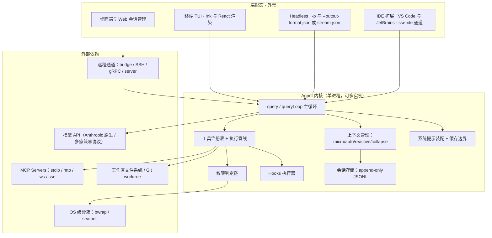
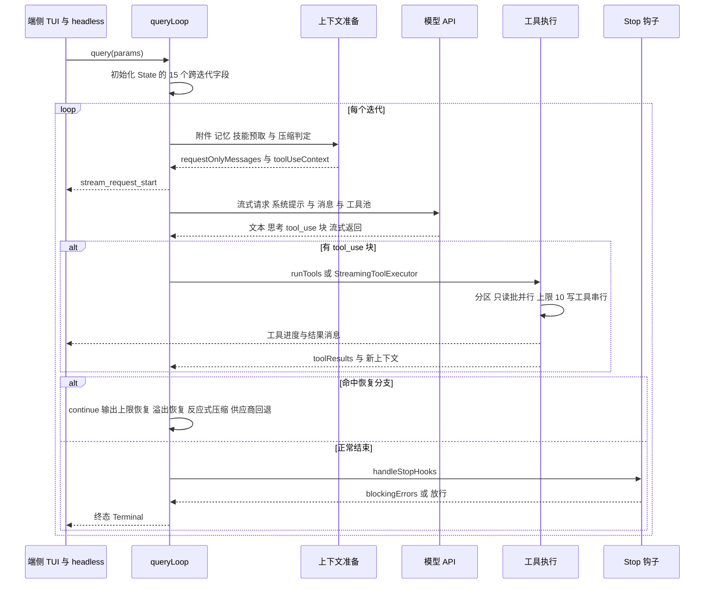
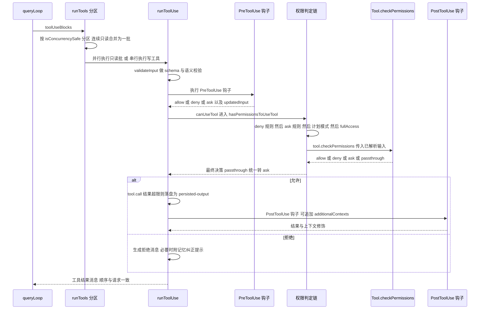

# 01 · Claude Code（Anthropic，闭源）+ 开源复刻参考 `Gitlawb/openclaude`

> **研究对象**：① Claude Code（官方产品，闭源，Anthropic）；② `Gitlawb/openclaude`（社区开源复刻，自述「originated from the Claude Code codebase and has since been substantially modified」）。
> **证据分级**：`[E1]` 直接读源码（给仓库/文件/符号）；`[E2]` 官方文档/官方 schema；`[E3]` 第三方分析或逆向资料；`[E4]` 推断（写明推理链）。
> **本地证据快照**：`git clone --depth 1` 至 `.research-cache/Gitlawb-openclaude`，HEAD = `d16318a47f48a7e6c674b1df9ccb4f3a873886d2`（2026-09-16，`@gitlawb/openclaude` v0.30.0）。下文凡标 `[E1]` 的路径均相对于该仓库根。
> **证据时点（R09 补）**：克隆 commit `d16318a`（2026-09-16 提交）；官方文档与第三方资料的抓取集中在 2026-09-17–09-21 研究窗口（闭源主体的能力快照随官方发布持续变化，引用时以本时点为准）。
> **重要声明**：`openclaude` 是**衍生品**（其 README 明确声明是 Claude Code 代码库的衍生并做了大量改造，且声明与 Anthropic 无关联）。因此它的源码可以作为「Claude Code 机制的高保真窗口」，但**不能**当作 Anthropic 官方实现或官方承诺；本报告对所有来自该仓库的结论标 `[E1]`（源码事实）并额外标注「衍生品」，凡属官方承诺的结论一律以 `[E2]` 出处为准。Claude Code 自身的**闭源**行为（云端 sandbox、订阅配额、Remote Control 服务端等）在本报告中一律标 `[E3]/[E4]` 或「未观测到」。
> **不重复**：`docs/harness/00-vision-and-product.md` §4.1 已给出 Claude Code 的高层定位基线；本报告只做下钻，不做定位复述。

---

## 1. 结论速览（12 条）

1. **Claude Code 的权限系统是「有序判定链」而非「矩阵」**：`deny 规则 → ask 规则 → 工具自身 checkPermissions → 计划模式 → 交互强制 → fullAccess → 内容级 ask（可穿透 bypass）→ safetyCheck（bypass 免疫）→ bypassPermissions → alwaysAllow 规则 → passthrough 转 ask`，且 `dontAsk` 的 ask→deny 转换放在**最外层**以避免被提前 return 绕过。`[E1] src/utils/permissions/permissions.ts:1524 hasPermissionsToUseToolInner / :556 hasPermissionsToUseToolWithModeHandling`（衍生品）
2. **沙箱与权限是耦合的**：`autoAllowBashIfSandboxed + shouldUseSandbox(input)` 可以让被沙箱包裹的 Bash 命令**跳过 ask 规则直接放行**，把「沙箱」做成权限系统的加速器而不是独立层。`[E1] src/utils/permissions/permissions.ts:1207-1213, 1553-1563`（衍生品）；官方文档确认 `sandbox.autoAllowBashIfSandboxed` 存在 `[E2]`
3. **工具并发不是全局线程池，而是「按批分区 + 上限 10」**：把连续只读工具（`isConcurrencySafe(input)`）合并为一批并行执行，遇到写工具即切批串行；默认上限 `10`，可经 `CLAUDE_CODE_MAX_TOOL_USE_CONCURRENCY` 覆盖。`[E1] src/services/tools/toolOrchestration.ts:8-11, 94-119`（衍生品）
4. **工具结果有三层外置预算**：单结果 `50_000` 字符（系统级上限）→ 单条消息内工具结果合计 `200_000` 字符 → 结果按 `100_000` token / `BYTES_PER_TOKEN=4` 折算；超限即落盘为 `<persisted-output>` 并把文件路径 + 预览回传模型。`[E1] src/constants/toolLimits.ts:11, 25, 30, 46`（衍生品）
5. **压缩是四机制并存 + 熔断**：`microCompact`（清理旧工具结果，保留最近 N 条）→ `autoCompact`（阈值 `有效上下文 − 30_000` token）→ `reactiveCompact` → `contextCollapse`（用子 Agent 折叠 span 为摘要占位）；连续失败 `3` 次即熔断并进入 `5` 分钟冷却（下限 `10` 秒）。`[E1] src/services/compact/{microCompact,autoCompact,reactiveCompact,compact}.ts、src/services/contextCollapse/`（衍生品）
6. **系统提示显式切成「静态可缓存前缀 + 动态后缀」**，并用常量 `SYSTEM_PROMPT_DYNAMIC_BOUNDARY` 标记边界，源码注释直接警告「删除或重排该标记必须同步更新缓存逻辑」；压缩请求还会刻意复用父对话的 prompt cache 前缀。`[E1] src/constants/prompts.ts:103-116、src/services/compact/compact.ts:465-482`（衍生品）
7. **Hooks 有 27 个事件点、5 种执行形态**，且 `PermissionRequest` 钩子可以**直接放行**工具（带 `updatedInput` 与 `updatedPermissions` 落盘），`Stop` 类钩子的阻断有次数上限（官方文档写明 8 次后强制结束回合）。`[E1] src/entrypoints/sdk/coreTypes.ts:25-52 HOOK_EVENTS`、`[E2] code.claude.com/docs/en/hooks 与 best-practices`
8. **会话是一行一 JSON 的 append-only JSONL + `parentUuid` 链**，落在 `~/.claude/projects/<路径编码>/<session-uuid>.jsonl`，子 Agent 走独立侧链文件 `agent-<agentId>.jsonl`，恢复/分叉/回退都靠这条链重建。`[E1] src/utils/sessionStorage.ts:527-582, 2057 recordTranscript`（衍生品）；格式细节被第三方逆向文档独立佐证 `[E3]`
9. **主循环是显式状态机而非 while(true)+flag 堆叠**：`State` 记录 15 个跨迭代字段（自动压缩跟踪、输出上限恢复计数、供应商回退次数、连续续跑提醒计数……），每个 `continue` 站点做整体重建，并配多道循环护栏（doom loop、工具失败循环、续跑提醒上限 20）。`[E1] src/query.ts:629-654, 306 MAX_CONTINUATION_NUDGES`（衍生品；R09 复核：逐字段清点为 **15** 个，原文「14 个」有误）
10. **企业面靠「设置分层 + 环境变量钉扎」**：设置来源 `userSettings < projectSettings < localSettings < flagSettings < policySettings`（后者覆盖前者），且 `permissions.defaultMode` 的 `auto`/`bypassPermissions` **不允许从项目/本地设置生效**（防仓库自我提权）`[E2]`；另有 48 个供应商/认证类环境变量（+1 条 `VERTEX_REGION_CLAUDE_*` 前缀规则）在宿主托管模式下从设置来源中被剥离 `[E1] src/utils/managedEnvConstants.ts:14-75`（衍生品；R09 复核修正：逐条清点 `PROVIDER_MANAGED_ENV_VARS` = **48** 项 + 1 前缀，原文「122 个」无来源可复现）
11. **Bash 安全是「静态分析清单」而非黑名单几条正则**：IFS 注入、ANSI-C 引号绕过、heredoc 替换、`jq` 危险 flag、畸形 token 注入、zsh 模块命令等各自独立检测；另有两级 LLM/regex 分类器与「危险模式确认」流程。`[E1] src/tools/BashTool/bashSecurity.ts:2590 bashCommandIsSafe_DEPRECATED、src/utils/permissions/{bashClassifier,yoloClassifier,dangerousPatterns}.ts`（衍生品）
12. **以「面板进程」实现 Agent Teams 是社区方案而非通用架构**：openclaude 用 `TmuxBackend/ITermBackend/InProcessBackend` 把队友 Agent 起成 tmux/iTerm 面板进程，靠 `TeammateIdle` 钩子与共享任务目录协调。`[E1] src/utils/swarm/backends/、src/utils/swarm/constants.ts TEAM_LEAD_NAME`（衍生品）；官方仅把 Teams 描述为可并行的会话集合 `[E2] code.claude.com/docs/en/agent-view`

---

## 2. 产品与仓库事实

### 2.1 Claude Code（闭源主体）

| 项 | 事实 | 证据 |
| --- | --- | --- |
| 定位 | 终端原生编码 Agent，官方形态覆盖 CLI / IDE 扩展 / 桌面端 / Web / SDK | `[E2]` |
| 官方文档入口 | `code.claude.com/docs/en/*`（旧 `docs.claude.com`、`docs.anthropic.com` 301 跳转至此） | `[E2]` 实测重定向 |
| 设置文件 | 用户 `~/.claude/settings.json`；项目 `.claude/settings.json`；项目本地 `.claude/settings.local.json`；组织 `managed settings`；全局配置 `~/.claude.json` | `[E2]` settings / settings-reference |
| 设置优先级 | `managed > 命令行参数 > 项目本地 > 项目共享 > 用户` | `[E2]` settings |
| Hooks 形态 | shell 命令、HTTP 端点、MCP 工具调用、LLM 提示、子 Agent；共 31 个事件名（含 PreModelSwitch/PostModelSwitch/MessageDisplay/TaskCreated 等） | `[E2]` hooks |
| 沙箱 | Bash 沙箱：文件系统 + 网络隔离，`sandbox.enabled` 开启，细项含 allow/deny read/write、allowedDomains/deniedDomains/strictAllowlist、credentials 注入、bwrapPath/socatPath、failIfUnavailable | `[E2]` sandboxing / settings-reference |
| MCP 传输 | stdio、HTTP（推荐）、SSE（已弃用）、WebSocket；作用域 local/project(`.mcp.json`)/user(`~/.claude.json`)；`claude mcp serve` 反向暴露自身 | `[E2]` mcp |
| 会话存储 | `~/.claude/projects/<编码路径>/<session-uuid>.jsonl`，append-only，每行一个 JSON 对象 | `[E2]` 结构性事实 + `[E3]` 逆向文档 |
| 可观测 | `CLAUDE_CODE_ENABLE_TELEMETRY=1` + OTLP；指标 `claude_code.session.count` / `.token.usage` / `.cost.usage`；事件 `claude_code.user_prompt` / `.assistant_response` / `.tool_result` | `[E2]` monitoring-usage |
| 版本节奏 | 第三方系统提示归档仓记录到 `v2.1.278`（2026-09-18），自 `v2.0.14` 起已追踪 295 个版本 | `[E3]` Piebald-AI 仓库页 |
| 系统提示规模 | 社区归档把系统提示与**每个工具**的提示分别落成文件（`system-prompts/` 与 `tools/`，命名含 `agent-prompt-<name>.md`、`data-<topic>.md`） | `[E3]` Piebald-AI |

未观测到（检索词见 §10）：官方公开的压缩阈值数字、云端 sandbox 隔离技术栈、订阅配额算法的具体公式、SSO/SCIM 文档页。

### 2.2 `Gitlawb/openclaude`（开源复刻参考）

| 项 | 事实 | 证据 |
| --- | --- | --- |
| 包名/版本 | `@gitlawb/openclaude` **0.30.0**，bin `openclaude` | `[E1] package.json` |
| 语言/运行时 | TypeScript，Bun 构建（`bun:bundle` 的 `feature()` 编译期开关），Node 运行 | `[E1] package.json scripts、src/query.ts:1` |
| 许可 | 仓库根 `LICENSE` 实为 **NOTICE 声明**（非纯 MIT）：「contains code derived from Anthropic's Claude Code CLI」；贡献者修改部分在「法律允许范围内」按 MIT 提供；**衍生代码版权仍属 Anthropic**，且原文明确「This project does not have Anthropic's authorization to distribute their proprietary source. Users and contributors should evaluate their own legal position.」（R09 复核精化：原表述「LICENSE 为 MIT」低估了该风险声明） | `[E1] LICENSE + README:514-520` |
| 来源声明 | 「OpenClaude originated from the Claude Code codebase and has since been substantially modified to support multiple providers and open use.」 | `[E1] README:516` |
| 规模 | `src/` 下 3227 个文件 / 3202 个 TS(TSX) 文件 / **697 个 `*.test.ts(x)`**；`src/tools/` 56 个目录（其中 53 个 `*Tool`）；`commands/` 133 项 | `[E1]` 本地统计 |
| 活跃度 | HEAD 提交 2026-09-16，含 release-please、CodeRabbit 配置、PR Checks CI；`docs/` 内含 architecture/、hook-chains.md、agent-routing.md、repo-map.md | `[E1]` |
| 与官方的差异（关键） | 多供应商接入（30+ provider 表）、本地模型（Ollama/Atomic Chat）、`gRPC Server`、`SSH` 会话、Repo Map、Buddy 桌面宠物、i18n —— 这些是**复刻方新增**，不能当作 Claude Code 事实 | `[E1] README「Supported Providers」、`src/grpc/`、`src/ssh/`、`src/buddy/`` |
| 保留的官方内部痕迹 | 权限模式含 `fullAccess`/`dontAsk`/`bubble`；大量 `tengu_*` 分析事件名；`USER_TYPE === 'ant'` 内部分支；`CLAUDE_CODE_*` 环境变量族 | `[E1] src/utils/permissions/PermissionMode.ts、src/query.ts:2710` |

> **证据可信度评估**：`[E1]` 密度高（我们在本报告引用了 30+ 个文件与符号），但存在三类偏差：① 衍生品已被改造，凡涉及「多供应商/路由」的代码不能等同于官方；② 部分模块被构建期「noop 桩」替换（例：`src/daemon/main.ts` 自述是 inert stub），说明**并非所有逻辑都完整可读**；③ 内部代号（`tengu_*`、`USER_TYPE==='ant'`）说明该仓库是内部构建的镜像，其对外行为可能与公开版不同。凡涉及对外承诺的结论，本报告一律回落到 `[E2]`。

---

## 3. 架构总览

### 3.1 进程与形态拓扑

**拓扑要点**（`[E1]` 衍生品 + `[E2]` 官方）：
- **内核是单进程、事件驱动的异步生成器**，没有常驻服务端；`query()` 是 `AsyncGenerator`，UI 逐条消费流事件。
- 官方把「多会话并行」放在**客户端层**：`agent view` 管理多个后台会话（「每个后台会话都是一段完整对话，可在无终端附着时继续运行」）`[E2]`；子 Agent 与队友**不在** agent view 的行里单列 `[E2]`。
- 复刻方新增了远程面：`src/bridge/`（replBridge、webhookSanitizer、jwtUtils、trustedDevice、sessionRunner）、`src/server/`（sessionManager、lockfile、parseConnectUrl、connectHeadless）、`src/grpc/server.ts`、`src/ssh/SSHSessionManager.ts`、`src/daemon/main.ts`（noop 桩）—— 这组能力**不代表** Claude Code 官方形态，但与我们的「Server + 多端」设计可做机制对照 `[E1]`。
- IDE 通道在 MCP 配置里体现为专用传输 `sse-ide` / `ws-ide` 与 `ideRunningInWindows` 字段 `[E1] src/services/mcp/types.ts:60-85`。

### 3.2 源码目录映射（复刻仓）

| 关注面 | 路径 | 说明 |
| --- | --- | --- |
| 主循环 | `src/query.ts`（3204 行）、`src/QueryEngine.ts`（1555 行）、`src/query/*` | 回合预算、续跑、自动压缩、停止钩子 |
| 工具契约 | `src/Tool.ts`（827 行）、`src/tools.ts`、`src/tools/<Name>Tool/` | 56 个工具目录（53 个 `*Tool`），含 `prompt.ts`（工具提示词独立文件） |
| 工具执行 | `src/services/tools/{toolOrchestration,toolExecution,toolHooks,StreamingToolExecutor}.ts` | 分区并发、权限、钩子、结果外置 |
| 权限 | `src/utils/permissions/*`（30+ 文件）、`src/hooks/toolPermission/` | 规则、分类器、判定链、审批交互 |
| 上下文 | `src/services/compact/*`、`src/services/contextCollapse/*`、`src/utils/analyzeContext.ts` | 四级压缩与上下文可视化 |
| 提示词 | `src/constants/prompts.ts`、`src/constants/systemPromptSections.ts`、`src/utils/systemPrompt.ts`、`src/utils/claudemd.ts` | 装配优先级、缓存边界、指令文件层级 |
| Hooks | `src/utils/hooks/*`（含 `execAgentHook/execHttpHook/execPromptHook`）、`src/entrypoints/sdk/coreTypes.ts` | 事件清单与 5 种执行形态 |
| 会话 | `src/utils/sessionStorage.ts`、`sessionPersistence.ts`、`sessionRestore.ts`、`src/history.ts` | JSONL 写入、恢复、分叉 |
| 记忆 | `src/memdir/*` | `MEMORY.md` 索引 + 日更日志 + 向量索引 |
| 团队 | `src/utils/swarm/*`、`src/tools/TeamCreateTool/`、`src/tasks/*` | tmux/iTerm 面板后端、任务认领 |
| 企业面 | `src/services/{policyLimits,remoteManagedSettings,settingsSync}/`、`src/utils/managedEnvConstants.ts` | 托管策略与环境变量钉扎 |

### 3.3 关键常量表（复刻仓，可直接作为实现取值参考）

| 常量 | 值 | 用途 |
| --- | --- | --- |
| `DEFAULT_MAX_RESULT_SIZE_CHARS` | 50_000 | 单工具结果落盘阈值 |
| `MAX_TOOL_RESULTS_PER_MESSAGE_CHARS` | 200_000 | 单条消息内工具结果合计预算 |
| `MAX_TOOL_RESULT_TOKENS` / `BYTES_PER_TOKEN` | 100_000 / 4 | 结果 token 上限换算 |
| `AUTOCOMPACT_BUFFER_TOKENS` | 30_000 | 自动压缩触发余量 |
| `AUTOCOMPACT_FLOOR_BUFFER_TOKENS` | 13_000 | 小窗口模型的阈值下限保险 |
| `WARNING_/ERROR_THRESHOLD_BUFFER_TOKENS` | 20_000 / 20_000 | 上下文告警/错误阈值 |
| `MANUAL_COMPACT_BUFFER_TOKENS` | 3_000 | 手动压缩余量 |
| `MAX_OUTPUT_TOKENS_FOR_SUMMARY` | 20_000 | 压缩摘要预留（p99.99 实测 17_387） |
| `POST_COMPACT_MAX_FILES_TO_RESTORE` / `POST_COMPACT_TOKEN_BUDGET` | 5 / 50_000 | 压缩后文件回灌预算 |
| `POST_COMPACT_SKILLS_TOKEN_BUDGET` | 25_000 | 压缩后技能回灌预算 |
| `MAX_CONSECUTIVE_AUTOCOMPACT_FAILURES` / 冷却 | 3 / 5 分钟（下限 10 秒） | 压缩熔断 |
| `MAX_CONTINUATION_NUDGES` | 20 | 连续续跑提醒上限 |
| 工具并发上限 | 10（`CLAUDE_CODE_MAX_TOOL_USE_CONCURRENCY`） | 只读批并行度 |
| `MODEL_CONTEXT_WINDOW_DEFAULT` / 覆盖下限 | 200_000 / 33_000 | 上下文窗口与用户覆盖校验 |
| `MAX_TRANSCRIPT_READ_BYTES` | 50 MB | 会话文件读取上限 |
| 子 Agent 嵌套深度 | 3 层（默认，可经环境变量调整） | `[E2]` sub-agents |
| Stop 钩子连续阻断上限 | 8 次后强制结束回合 | `[E2]` best-practices |

---

## 4. 24 维度逐项分析

### 4.1 进程与运行拓扑

- **单进程内核 + 多外壳**：CLI/TUI 与 headless 共用同一内核；IDE 通过 `sse-ide`/`ws-ide` 传输接入；远程/桌面通过 `bridge`+`server`（复刻方新增）接入。`[E1] src/entrypoints/{cli.tsx,mcp.ts,sdk/}`、`src/bridge/*`、`[E2]`
- **启动快路径**：第三方分析指出 `--version` 等简单参数会走零重依赖的 fast-path，鉴权先于任何 API 交互，随后再装载 GrowthBook 远端开关 `[E3] ccleaks.com/architecture`。
- **无守护进程**：`src/daemon/main.ts` 自述为 inert stub，说明官方构建中 `daemon` 子命令不承担监督职责 `[E1]`。
- **团队/多 Agent 的进程模型**：队友 Agent 是**真实子进程**（tmux/iTerm 面板）或**同进程任务**（`InProcessBackend`），由 `TEAMMATE_COMMAND_ENV_VAR`（默认取当前可执行文件）启动，附带 `TEAMMATE_COLOR_ENV_VAR` 等环境变量 `[E1] src/utils/swarm/constants.ts`。
- 未观测到：官方 IPC 协议公开文档；云端会话与本地会话的同步协议。

### 4.2 Agent 主循环与回合模型

- `query(params)` → `queryLoop(params, consumedCommandUuids)`，返回 `Terminal` 终态（`max_turns` / `hook_stopped` / `tool_failure_loop` / `agent_step_limit` 等）`[E1] src/query.ts:656-676`。
- 跨迭代状态显式化：`State = { messages, toolUseContext, autoCompactTracking, maxOutputTokensRecoveryCount, hasAttemptedReactiveCompact, hasAttemptedContextOverflowRecovery, maxOutputTokensOverride, providerMaxOutputTokensCap, pendingToolUseSummary, stopHookActive, hasAttemptedProviderFallback, turnCount, continuationNudgeCount, transition, agentStepLimit }` `[E1] src/query.ts:629-654`。
- **回合预算**：`createQueryTurnBudget(maxTurns)` 维护 `turnsStarted`，跨调用共享；同一回合的重试允许复用已占用的回合号，避免重复扣预算 `[E1] src/query.ts:569-573, 781-784`。
- **恢复与降级分支**（都在循环内以 `continue` 站点实现）：输出上限恢复、上下文溢出恢复、`prompt_too_long` 截断重试、供应商限流回退（一次性）、反应式压缩、续跑提醒（上限 20）、Agent 步数上限强制总结 `[E1] src/query.ts:306, 494-568, 2540-2640, 2869-2885`。
- **循环护栏**：`resetDoomLoop(agentId)` 按 Agent 维度重置死循环检测；`createToolFailureLoopGuardState` 按「路径/签名/错误类别」三类阈值判定工具失败循环并终止 `[E1] src/query.ts:689-693, 2839-2867`。
- **回合结束语义**：`handleStopHooks` 在回合末尾触发；`hook_stopped_continuation` 附件可阻止继续 `[E1] src/query/stopHooks.ts:90, src/query.ts:2736-2741`。

### 4.3 工具系统

- **注册**：`getAllBaseTools()` 汇总内置工具（含条件编译工具），`getTools(permissionContext)` 先按 `isEnabled()` 过滤、再按 **deny 规则** 过滤（`filterToolsByDenyRules`），最后与 MCP 工具合并成池 `[E1] src/tools.ts:183, 253-262, 343-382`。
- **契约**：`Tool` 接口含 `name / inputSchema(zod) / call / description / isEnabled / isConcurrencySafe / isReadOnly / validateInput / checkPermissions / requiresUserInteraction / userFacingName / prompt / render*`；`buildTool` 为缺省实现，缺省策略是**保守**：`isEnabled=true`、`isConcurrencySafe=false`、`isReadOnly=false`、`checkPermissions` 默认 allow 并把决策交给通用权限系统 `[E1] src/Tool.ts:414-560, 784-824`。
- **Schema**：工具入参用 `zod/v4` 风格 `lazySchema`；Bash 工具含 `dangerouslyDisableSandbox` 与内部字段 `_dangerouslyDisableSandboxApproved`（由用户批准后回填）`[E1] src/tools/BashTool/BashTool.tsx:246-268`。
- **执行**：`runToolUse` → `checkPermissionsAndCallTool`；管线顺序为 `validateInput → PreToolUse 钩子 → 权限判定（canUseTool）→ tool.call → PostToolUse / PostToolUseFailure 钩子`，钩子耗时 >500ms 会在结果下方内联展示 `[E1] src/services/tools/toolExecution.ts:783, 947, 1064, 1607-1769`。
- **并发**：按批分区（见 §1 第 3 条），只读批内并行、写工具独占；`StreamingToolExecutor` 支持「边流式边执行」并把结果按收到顺序缓冲回吐，含 `queued/executing/completed/yielded` 状态与 `discard()`（流式回退时丢弃在途结果）`[E1] src/services/tools/StreamingToolExecutor.ts:20-90`。
- **结果外置**：见 §1 第 4 条；`<persisted-output>` 标签包裹落盘提示，阈值可按工具覆盖（`Infinity` 表示硬退出，Read 工具自限 `maxTokens`）`[E1] src/utils/toolResultStorage.ts:30-60`。
- **工具提示词**：每个工具目录带 `prompt.ts`，与系统提示分离管理 `[E1] src/tools/*/prompt.ts`。

**内置工具清单（复刻仓目录级统计，供卷 05 做功能对照）** `[E1] src/tools/`（衍生品）：

| 族 | 工具 | 备注 |
| --- | --- | --- |
| 文件 | FileRead、FileWrite、FileEdit、NotebookEdit | 编辑工具带 diff 状态缓存（`FileStateCache`）与文件历史快照 |
| 检索 | Glob、Grep、RepoMap | RepoMap 为复刻方新增，PageRank 排序 + 默认 2048 token |
| 执行 | Bash、PowerShell、REPL、TerminalCapture | Bash 含沙箱参数与静态安全分析 |
| Agent | Agent、SendMessage、TeamCreate、TeamDelete、TaskCreate/Get/List/Update/Output/Stop | 对应 SubAgent、队友通信、团队与任务面 |
| 计划 | TodoWrite、EnterPlanMode、ExitPlanMode、VerifyPlanExecution | 计划模式有独立文件路径与权限校验 |
| 工作区 | EnterWorktree、ExitWorktree、Monitor、Sleep | worktree 隔离与主动模式节流 |
| 外部 | WebFetch、WebSearch、WebBrowser、MCP、McpAuth、ListMcpResources、ReadMcpResource、firecrawl | 外部信息面与 MCP 资源面 |
| 技能与元 | Skill、DiscoverSkills、ToolSearch | 技能发现与「工具检索」式元工具 |
| 交互 | AskUserQuestion、Brief、SendUserFile、PushNotification | 面向人的澄清与投递 |
| 调度 | CronCreate、CronDelete、CronList、RemoteTrigger、SubscribePR | 定时与事件触发面 |
| 诊断/内部 | LSP、CtxInspect、ReviewArtifact、SyntheticOutput、OverflowTest、Tungsten、Workflow、SuggestBackgroundPR | 部分为条件编译（内部/实验）工具 |

### 4.4 权限与审批

- **模式**：用户可寻址集合 `EXTERNAL_PERMISSION_MODES = [acceptEdits, bypassPermissions, default, dontAsk, fullAccess, plan]`；内部另有 `auto`（由 `TRANSCRIPT_CLASSIFIER` 开关控制）与 `bubble`；`isDangerousPermissionMode` 仅将 `bypassPermissions`/`fullAccess` 视为危险 `[E1] src/types/permissions.ts:14-38、src/utils/permissions/PermissionMode.ts:138-142`。
- **决策链**：见 §1 第 1 条；`passthrough` 语义是「工具不自决，交回通用系统」，最终统一转成 `ask` `[E1] src/utils/permissions/permissions.ts:1711-1722`。
- **规则来源分层**：`userSettings / projectSettings / localSettings / flagSettings / policySettings / cliArg / command / session`，落盘目的地含 `userSettings/projectSettings/localSettings/session/cliArg` `[E1] src/types/permissions.ts:52-64, 76-82`。
- **内容级规则**：`Bash(npm publish:*)` 这类内容级 ask 规则**穿透 bypassPermissions**，而路径安全（`.git/`、`.claude/`、`.vscode/`、shell 配置）标为 `safetyCheck` 且 `classifierApprovable` 区分「可交分类器裁决」与「必须人工」`[E1] src/utils/permissions/permissions.ts:1261-1273, 1650-1674；src/types/permissions.ts PermissionDecisionReason`。
- **自动化路径**：`auto` 模式用分类器代替人工；连续拒绝计数（`denialTracking`）在成功放行时归零；`dontAsk` 把 ask 直接变 deny `[E1] src/utils/permissions/permissions.ts:565-620、src/utils/permissions/denialTracking.ts`。
- **Headless 审批**：无 UI 场景走 `PermissionRequest` 钩子；钩子放行时会把 `updatedPermissions` 落盘并刷新 live context，钩子失败则「fall through 到自动拒绝」而不是崩溃 `[E1] src/utils/permissions/permissions.ts:432-553`。
- **可解释性**：`src/utils/permissions/permissionExplainer.ts` 产出 `RiskLevel(LOW|MEDIUM|HIGH)` 与解释文本 `[E1] src/types/permissions.ts PermissionExplanation`。
- **官方基线**：`permissions.defaultMode` 的 `auto`/`bypassPermissions` 不生效于项目/本地设置；`permissions.disableBypassPermissionsMode` 可整体禁用；`permissions.blockReadsOutsideWorkingDirectories` 限制越目录读取 `[E2] settings / settings-reference`。

### 4.5 上下文管理

- **窗口与覆盖**：默认 `200_000`，用户覆盖有 `33_000` 下限校验，运行时可用 `CLAUDE_CODE_AUTO_COMPACT_WINDOW` 进一步压低；有效窗口 = 窗口 − 摘要预留（≤`20_000`），并有 `13_000` 的地板保险 `[E1] src/utils/context.ts:17, 56, 90；src/services/compact/autoCompact.ts:38-70`。
- **触发点**：自动压缩阈值 = 有效窗口 − `30_000`；告警/错误阈值各再低 `20_000`；手动压缩留 `3_000` 余量 `[E1] src/services/compact/autoCompact.ts:98-107, 197-255`。
- **四机制**：`microCompact` 按「计数触发 + 保留最近 N 条」清理可压缩工具结果（占位串 `[Old tool result content cleared]`，`COMPACTABLE_TOOLS` 白名单），另有时间型触发；`autoCompact` 做全量摘要；`reactiveCompact` 作为溢出后反应式兜底；`contextCollapse` 用子 Agent 把长 span 折叠成摘要占位并持久化 `[E1] src/services/compact/{microCompact,autoCompact,reactiveCompact}.ts、src/services/contextCollapse/{index,spanSelection,spawnCtxAgent}.ts`。
- **熔断**：连续失败 `3` 次暂停自动压缩，冷却 `5` 分钟（可经环境变量覆盖，下限 `10` 秒），源码注释给出量化依据（1 279 个会话曾出现 50+ 次连续失败，浪费约 25 万次 API 调用/天）`[E1] src/services/compact/autoCompact.ts:109-135`。
- **压缩后的回灌**：摘要生成后重建消息（`buildPostCompactMessages`），并按预算回灌文件（`POST_COMPACT_MAX_FILES_TO_RESTORE=5`、`POST_COMPACT_TOKEN_BUDGET=50_000`、单文件 `5_000`）、技能（`25_000`）、计划模式附件和有界异步 Agent 附件 `[E1] src/services/compact/compact.ts:131-139, 348-367, 1559-1720`。
- **缓存亲和**：压缩请求仅在「未换模型 + 供应商兼容 + 开关开启」时复用父对话 prompt cache 前缀；源码给出实验数据（false 路径 98% 缓存未命中，约占全舰队 cache_creation 的 0.76%）`[E1] src/services/compact/compact.ts:465-482`。
- **摘要提示词**：`services/compact/prompt.ts` + `getCompactPrompt(customInstructions)` 支持用户自定义压缩指令，并在 PTL（prompt too long）时从头部截断重试 `[E1] src/services/compact/{compact,prompt}.ts:261, 506-520`。

### 4.6 提示词组织

- **装配优先级（0–4）**：`override`（替换一切）> `coordinator` 模式 > `agentSystemPrompt`（主线程 Agent；主动模式下追加而非替换）> `--system-prompt` 自定义 > 默认系统提示；`appendSystemPrompt` 最后追加 `[E1] src/utils/systemPrompt.ts:41-101`。
- **缓存边界常量**：`SYSTEM_PROMPT_DYNAMIC_BOUNDARY` 之前的段落视为「跨组织可缓存」，之后的段落含用户/会话态不得缓存；源码显式警告移除或重排该标记必须同步更新缓存逻辑 `[E1] src/constants/prompts.ts:103-116`。
- **不可缓存段落逃生舱**：`DANGEROUS_uncachedSystemPromptSection(...)` 用于会破坏缓存的段落（如晚连接的 MCP），命名上带强制提醒 `[E1] src/constants/prompts.ts:54, 507-510`。
- **分层指令文件**：官方按「托管策略 → 用户 → 项目（向上遍历到工作目录）」由文件系统根向下叠加，支持 `@path` 导入，官方建议单个文件 **<200 行**，并可用 `/memory` 查看、`claudeMdExcludes` 排除 `[E2] memory`；复刻仓的实现顺序为「托管 `/etc/claude-code/CLAUDE.md` → 用户 `~/.openclaude/CLAUDE.md` → 项目 `AGENTS.md`（优先）或 `.openclaude/CLAUDE.md` + `.openclaude/rules/*.md` 逐目录检查」`[E1] src/utils/claudemd.ts:4-17, 1285-1299`。
- **附件式上下文**：记忆与技能发现以「附件」形式在回合中拼装，并做了预取（`startRelevantMemoryPrefetch`、`startSkillDiscoveryPrefetch`），源码注释说明技能发现从「阻塞在附件阶段」改为「与流式/工具执行重叠」，并给出证据（97% 的历史调用什么都没找到）`[E1] src/query.ts:866-878；src/utils/attachments.ts`。
- **附件目录（从测试文件反推的能力面）**：上下文效率对照（`attachments.contextEfficiency`）、被编辑图像（`attachments.editedImage`）、外部抽取器（`attachments.extractors`）、**LSP 诊断**（`attachments.lspDiagnostics`）、嵌套目录（`attachments.nestedDirs`）、性能门槛（`attachments.performance`）、推理强度档（`attachments.ultracode` / `attachments.ultrathink`）——说明「动态上下文 = 一组有类型、可单测的附件生成器」，而不是散在各处的字符串拼接 `[E1] src/utils/attachments.*.test.ts`。
- **推理强度作为请求级参数**：`ultrathink_effort` 附件只在「最新人类回合之后、且中间无元用户消息」时生效，保证历史附件与系统生成提示不污染当前请求的 effort `[E1] src/query.ts:575-608`。

### 4.7 MCP

- **传输**：`stdio / sse / sse-ide / http / ws / ws-ide / sdk / claudeai-proxy`，另含 `headersHelper`（动态取头）、`oauth` 配置块与 `authServerMetadataUrl` 强制 HTTPS 校验 `[E1] src/services/mcp/types.ts:24-118`。
- **官方口径**：HTTP 为推荐传输，SSE 已弃用；作用域 local/project/user；`/mcp` 面板与 `claude mcp login <name>`；支持 `list_changed` 通知自动刷新能力 `[E2] mcp`。
- **客户端工程**：分页（`client.pagination.ts`）、会话内连接管理（`MCPConnectionManager.tsx`）、进程内传输（`InProcessTransport.ts`）、诊断（`doctor.ts`）、OAuth 刷新锁（`auth.refreshLock.ts`）、跨应用访问（`xaa.ts`/`xaaIdpLogin.ts`）、elicitation 处理（`elicitationHandler.ts`）、渠道权限与白名单（`channelPermissions.ts`/`channelAllowlist.ts`）`[E1] src/services/mcp/`。
- **反向暴露**：`src/entrypoints/mcp.ts` 把内核当作 MCP Server 暴露（对应官方 `claude mcp serve`）`[E1] / [E2]`。

### 4.8 Skill / 插件机制

- **Skill 加载**：`src/skills/loadSkillsDir.ts` 解析 Markdown frontmatter（描述、模型、effort、允许工具、shell 开关等），并处理 `.claude/skills` 等目录、gitignore 判定、上级目录截断到 git 根 `[E1] src/skills/loadSkillsDir.ts:1-60；src/utils/markdownConfigLoader.ts:34, 288`。
- **内置技能**：`src/skills/bundled/` 含 batch、loop、pdf、simplify、debug、updateConfig、claudeInChrome、scheduleRemoteAgents 等，另有 `services/skillSearch/` 做技能检索与预取、`mcpSkillBuilders.ts`/`mcpSkills.ts` 把技能与 MCP 打通 `[E1] src/skills/bundled/`。
- **官方口径**：Skill = `SKILL.md`，frontmatter **全部字段可选**，正文**仅在被使用时加载**（渐进披露），自定义斜杠命令已合并进 Skill 体系 `[E2] skills`。
- **插件**：可打包 skills/agents/hooks/MCP servers/命令（官方另提到 background monitors）；身份在 `plugin.json`，分发靠 `marketplace.json` 目录，安装 `/plugin install`，本地测试 `--plugin-dir`（官方提醒只指向可信归档）`[E2] plugins`。
- **插件的实现面**：`src/utils/plugins/` 含依赖求解（`dependencyResolver.ts`）、安装计数、托管插件（`managedPlugins.ts`）、LSP 插件集成与推荐、遥测（`fetchTelemetry.ts`）；`src/plugins/builtinPlugins.ts` 定义内置插件注册表（ID 形如 `{name}@builtin`，与市场插件 `{name}@{marketplace}` 区分）`[E1]`。

### 4.9 SubAgent / 多 Agent 编排

- **定义面**：`AgentTool/loadAgentsDir.ts` 的 JSON/Markdown 双通道 schema 含 `description / prompt / tools / disallowedTools / model / permissionMode / hooks / skills / memory(user|project|local) / background / isolation('worktree') / mcpServers / maxTurns` `[E1] src/tools/AgentTool/loadAgentsDir.ts:75-131`。
- **官方口径**：`.claude/agents` 与 `~/.claude/agents`；优先级 托管 > CLI > 项目 > 用户 > 插件，同目录内「更靠近工作目录者胜」；子 Agent 上下文隔离、默认加载 CLAUDE.md 与 git 状态；嵌套默认最多 **3 层**；`CLAUDE_CODE_MAX_CONCURRENT_SUBAGENTS` 调并发 `[E2] sub-agents`。
- **Fork 模式**：省略 `subagent_type` 触发隐式 fork，子 Agent 继承父对话与系统提示；fork 与 coordinator 模式互斥，且非交互会话禁用 `[E1] src/tools/AgentTool/forkSubagent.ts:20-45`。
- **Agent 记忆**：Agent 可声明 memory scope 并在启动时从项目快照初始化 `[E1] src/tools/AgentTool/agentMemory.ts / agentMemorySnapshot.ts`。
- **Teams（社区方案）**：`TeamCreateTool` 入参 `team_name/description/agent_type`；后端 `TmuxBackend / ITermBackend / InProcessBackend`；常量 `TEAM_LEAD_NAME='team-lead'`、`SWARM_SESSION_NAME='claude-swarm'`、隐藏会话 `claude-hidden`；协调靠共享任务目录 + `TeammateIdle` 钩子 + `leaderPermissionBridge`（把队友的权限请求转发给 leader 决策）`[E1] src/tools/TeamCreateTool/、src/utils/swarm/`。
- **官方口径**：agent view 只管后台会话，明确「session 派生的 subagents 与 teammates 不单列成行」`[E2] agent-view`。

### 4.10 任务 / 计划 / Todo 机制

- **任务对象**：`src/tasks/types.ts` 定义 7 类任务态：`LocalShellTask / LocalAgentTask / RemoteAgentTask / InProcessTeammateTask / LocalWorkflowTask / MonitorMcpTask / DreamTask`，并有「后台任务指示器」判定 `[E1] src/tasks/types.ts`。
- **待办（Todo V1/V2）**：`TodoWrite` 工具 + `utils/tasks.ts` 的 V2 任务模型：`TASK_STATUSES = [pending, in_progress, completed]`，任务落盘在任务目录，支持 **依赖阻塞**（未完成的任务阻塞后继）与**认领**（`claimTask` / `ClaimTaskOptions`）`[E1] src/utils/tasks.ts:69-89, 488-590`；`isTodoV2Enabled()` 控制新旧模型切换 `[E1] :133`。
- **计划模式**：`EnterPlanModeTool` / `ExitPlanModeV2Tool`，计划文件路径由权限层单独校验（`planFilePath.ts`、`isActivePlanFileForContext`）`[E1] src/tools/ExitPlanModeTool/、src/utils/permissions/{planFilePath,permissions}.ts`。
- **官方口径**：Todo/计划由内置工具驱动，`/compact` 后计划会作为附件回灌（对应 `createPlanModeAttachmentIfNeeded`）`[E2] + [E1]`。

### 4.11 Goal / 自治循环 / Schedule

- **社区/复刻面**：`src/services/goal/controller.ts` 存在 `evaluateGoalAfterTurn` 与 `isMainThreadGoalSource`，说明「回合后评估目标是否继续」是一等流程；`GoalState` 可持久化（`recordGoalState`）`[E1] src/services/goal/controller.ts:41, 132；src/utils/sessionStorage.ts:2156`。
- **调度**：`ScheduleCronTool` 提供 `CronCreate / CronDelete / CronList`；`RemoteTriggerTool`（受 `AGENT_TRIGGERS_REMOTE` 开关）用于远端触发；`SleepTool` 让 Agent 在主动模式（`PROACTIVE`/`KAIROS`）下控制等待节奏，其提示词明确权衡「每次唤醒都花钱、prompt cache 5 分钟失效」`[E1] src/tools.ts:14-30；src/constants/prompts.ts:876`。
- **官方口径**：官方文档把周期性任务描述为 Routines / 桌面端计划任务，而非内核级 Goal 状态机 `[E2] common-workflows`。
- 未观测到：官方 Goal 模式的公开文档与达成判定算法（检索词见 §10）。

### 4.12 会话持久化与恢复

- **路径与格式**：`~/.claude/projects/<sanitizePath(projectDir)>/<sessionId>.jsonl`，子 Agent 侧链为 `agent-<agentId>.jsonl` 并配 `*.meta.json`；读取上限 50 MB `[E1] src/utils/sessionStorage.ts:527-582, 554`；每行一个 JSON 对象、字段含 `type/uuid/parentUuid/sessionId/cwd/gitBranch/message`，内容块为 `text/thinking/tool_use`，`message.usage` 记 token 用量 `[E3] claude-dev.tools jsonl-format + [E2] 结构性事实`。
- **写入语义**：`recordTranscript` 只追加「尚未在会话消息集合中出现的链参与者」，并用 `startingParentUuid` 维护父链；进度类消息写入但**不参与链**（`isChainParticipant`）`[E1] src/utils/sessionStorage.ts:467-482, 2057-2099`。
- **可回退的额外记录**：`recordFileHistorySnapshot`（文件历史快照）、`recordContentReplacement`（内容替换，对应工具结果外置）、`recordQueueOperation`（队列操作）、`recordContextCollapseCommit/Snapshot`（上下文折叠）`[E1] src/utils/sessionStorage.ts:2125-2230`。
- **恢复/分叉**：`processResumedConversation`、`restoreSessionStateFromLog`、`createForkSessionInfoMessage`、`restoreWorktreeForResume`、`adoptResumedSessionFile` 构成恢复面 `[E1] src/utils/sessionRestore.ts:105-429`。
- **逐行记录类型**（`[E3]` 逆向 + `[E1]` 复刻仓常量相互印证）：

| 记录类型 | 作用 | 证据 |
| --- | --- | --- |
| `user` / `assistant` / `system` | 主对话链参与者，assistant 内 `message.content` 为 `text/thinking/tool_use` 块数组 | `[E3] claude-dev.tools jsonl-format`、`[E1] src/utils/sessionStorage.ts:482 isChainParticipant` |
| 工具结果（user 角色携带 `toolUseResult`） | 以 `tool_use_id` 关联请求，晚于 assistant 记录写入 | `[E3]` |
| 压缩边界 / 摘要 | 压缩点标记与摘要插入，恢复时以边界切分「压缩前/压缩后」 | `[E1] isCompactBoundaryMessage`、`[E3]` |
| 进度消息 | 写入 JSONL 但**不参与父链**（`isEphemeralToolProgress`） | `[E1] src/utils/sessionStorage.ts:523, 2095-2098` |
| 文件历史快照 / 内容替换 | 支撑 `/rewind` 与结果外置的可回放性 | `[E1] recordFileHistorySnapshot / recordContentReplacement` |
| 队列操作 / 目标状态 / 折叠提交 | 队列、Goal 状态与上下文折叠的持久化 | `[E1] recordQueueOperation / recordGoalState / recordContextCollapseCommit` |
- **官方口径**：`--resume`/`/resume` 续接、`/rewind` 把「对话 + 代码」回退到检查点、`/compact` 支持自定义指令、`/clear` 清空 ` [E2] costs`
- 未观测到：官方 JSONL 字段的权威 schema 文档（第三方逆向已给出字段集，标 `[E3]`）。

### 4.13 事件与可观测

- **流式协议**：内核产出 `StreamEvent | RequestStartEvent | Message | TombstoneMessage | ToolUseSummaryMessage` 的联合流，SDK 侧有 `controlSchemas`/`coreSchemas` 定义控制帧 `[E1] src/query.ts:658-664、src/entrypoints/sdk/`。
- **消息类型**：`AssistantMessage / UserMessage / AttachmentMessage / SystemMessage / ProgressMessage / ToolUseSummaryMessage / TombstoneMessage`，附件类型覆盖 `max_turns_reached`、`hook_stopped_continuation`、`hook_non_blocking_error`、`ultrathink_effort`、各类诊断消息 `[E1] src/types/message.ts、src/query.ts:809-813, 2640-2740`。
- **分析事件**：以 `tengu_*` 命名（如 `tengu_streaming_tool_execution_used`、`tengu_tool_failure_loop_guard_tripped`、`tengu_auto_mode_decision`、`tengu_compact_failed`），并有**类型级防泄漏**：分析元数据参数被标注为 `AnalyticsMetadata_I_VERIFIED_THIS_IS_NOT_CODE_OR_FILEPATHS`，本质是一道编译期自证约束 `[E1] src/services/analytics/metadata.ts、src/query.ts:2710-2720, 2852`。
- **官方 OTel**：指标与事件名见 §2.1；洞察/审计导出走 OTLP `[E2] monitoring-usage`。
- **Hooks 事件流**：`emitHookStarted/Progress/Response` 三段式，默认只推 `SessionStart`/`Setup`，其余需显式开启 `[E1] src/utils/hooks/hookEvents.ts:18, 84-90`。

### 4.14 Hooks / 生命周期扩展点

- **事件清单（复刻仓）27 项**：`PreToolUse, PostToolUse, PostToolUseFailure, Notification, UserPromptSubmit, SessionStart, SessionEnd, Stop, StopFailure, SubagentStart, SubagentStop, PreCompact, PostCompact, PermissionRequest, PermissionDenied, Setup, TeammateIdle, TaskCreated, TaskCompleted, Elicitation, ElicitationResult, ConfigChange, WorktreeCreate, WorktreeRemove, InstructionsLoaded, CwdChanged, FileChanged` `[E1] src/entrypoints/sdk/coreTypes.ts:25-52`。
- **官方事件清单 31 项**（多出 `UserPromptExpansion, PostToolBatch, MessageDisplay, DirectoryAdded, PreModelSwitch, PostModelSwitch`）`[E2] hooks`。
- **执行形态**：命令 / HTTP / MCP 工具 / 提示词 / 子 Agent 五种 `[E2]`；复刻仓对应 `src/utils/hooks/{execHttpHook,execPromptHook,execAgentHook}.ts` 与命令执行路径 `[E1]`。
- **语义**：退出码 2 = 阻断错误；`PermissionRequest` 忽略退出码，必须用 JSON `decision`；`WorktreeCreate` 非零退出即中止建树 `[E2] hooks`；`Stop` 类钩子连续阻断在 8 次后被内核覆盖并结束回合 `[E2] best-practices`。
- **可放行与落盘**：`PermissionRequest` 钩子返回 `allow` 时可用 `updatedInput` 改写输入、用 `updatedPermissions` 落盘新规则，且放行前会**重新跑一遍规则与计划模式校验**，防止钩子放大权限 `[E1] src/utils/permissions/permissions.ts:462-521`。
- **配置面**：`hooks` 键 → 事件名 → `matcher[]` → `hooks[]`（每项含 `type`、可选 `if`、`timeout`），支持 `${CLAUDE_PROJECT_DIR}` 占位 `[E2] hooks`；复刻仓按设置来源顺序合并 + session 级钩子追加，并做排序/去重 `[E1] src/utils/hooks/hooksSettings.ts:131-155, 241-278`。
- **失败策略**：钩子异常被包裹为 `hook_non_blocking_error`（非阻断）或 `blockingError`（阻断）两类，分别走不同附件通道 `[E1] src/query/stopHooks.ts:263-305, 384-390`。

### 4.15 沙箱与安全执行

- **隔离技术**：官方沙箱以文件系统 + 网络策略为核心，可用 `bwrapPath`（Linux bubblewrap）、`socatPath`、`enableWeakerNestedSandbox`、`enableWeakerNetworkIsolation` 等参数降级适配容器内场景；`failIfUnavailable` 决定沙箱不可用时是否失败 `[E2] settings-reference`。
- **网络策略**：`allowedDomains/deniedDomains/strictAllowlist/allowLocalBinding/allowManagedDomainsOnly/allowUnixSockets/allowAllUnixSockets/allowMachLookup/httpProxyPort/socksProxyPort/tlsTerminate` `[E2] settings-reference`。
- **凭据注入**：`sandbox.credentials.{envVars,files,awsPairs,sigv4,allowPlaintextInject}` —— 允许把密钥**只注入沙箱内部**而非写在进程环境 `[E2] settings-reference`。
- **权限耦合**：`autoAllowBashIfSandboxed` 让「已沙箱」的命令免询问放行；`allowUnsandboxedCommands`/`excludedCommands` 定义逃逸面；Agent 侧有 `dangerouslyDisableSandbox` 参数，但复刻仓把它与「用户已批准」标志 `_dangerouslyDisableSandboxApproved` 分离，并单独判定 `sandboxOverride` 决策原因 `[E1] src/utils/permissions/permissions.ts:1207-1213；src/types/permissions.ts 'sandboxOverride'`。
- **Bash 静态分析**：`bashSecurity.ts`（2590 行）覆盖 zsh 危险模块命令、未转义字符、heredoc 安全替换、`jq` 危险 flag、dangerous-context 变量、IFS 注入、畸形 token 注入、ANSI-C 引号绕过等独立检测项 `[E1] src/tools/BashTool/bashSecurity.ts`。
- **分类器**：正则分类器（带 `confidence: high|medium|low`）与「两阶段 LLM 分类器」（fast → thinking，记录两阶段 token/耗时/request_id）分别见 `bashClassifier.ts` / `yoloClassifier.ts`；危险模式有独立确认流程 `dangerousModePrompt*.ts` `[E1] src/utils/permissions/`。
- **规则遮蔽检测**：`shadowedRuleDetection.ts` 检测被更宽规则遮蔽的窄规则 —— 这是「规则可解释性」的少见工程细节 `[E1]`。

### 4.16 工作区 / 远程执行

- **官方**：工作区以「当前目录」为默认可写边界（security 文档明确写访问限于启动目录），支持 `--add-dir` 追加；云会话不读取用户与项目本地设置 `[E2] security / settings`。
- **复刻方新增**：`src/ssh/SSHSessionManager.ts` + `commands/remote-setup`、`commands/remote-env` 提供 SSH 远程工作区；`src/bridge/*` 提供「远端驱动本地/本地接入远端」的桥接（含 `webhookSanitizer`、`worktree` 绑定、`trustedDevice`）；`src/server/` 提供无头连接与锁文件 `[E1]`。
- 未观测到：官方工作区后端的公开能力矩阵（检索词见 §10）。

### 4.17 Git 与 worktree 集成

- **工具**：`EnterWorktreeTool` / `ExitWorktreeTool`；Agent 定义支持 `isolation: 'worktree'`，即子 Agent 可强制在独立 worktree 内运行 `[E1] src/tools/EnterWorktreeTool/、src/tools/AgentTool/loadAgentsDir.ts:101`。
- **钩子**：`WorktreeCreate`（非零退出即中止）与 `WorktreeRemove` 官方事件 `[E2] hooks`。
- **恢复联动**：`restoreWorktreeForResume` / `exitRestoredWorktree` 在会话恢复时重建/退出 worktree `[E1] src/utils/sessionRestore.ts:352-400`。
- **提交与归属**：官方设置含 `attribution.commit/pr/sessionUrl`、`includeCoAuthoredBy`、`prUrlTemplate`；复刻仓有 `utils/commitAttribution.ts`、`attributionTrailer.ts`、`commands/commit.ts` 与 `autofix-pr/` `[E2] + [E1]`。
- **并行方案对照**：官方文档把 worktree 作为并行会话的隔离手段，Agent view 统一监控 `[E2]`；社区分析给出的实践是 worktree + 多终端 `[E3]`。

### 4.18 记忆 / 知识库

- **记忆（复刻仓 `memdir/`）**：自动记忆有独立目录，入口 `MEMORY.md` 作**活索引**，同时追加日期命名的日志文件；记忆被约束为四类 `user / feedback / project / reference`，并明确「可从当前项目状态推导的内容（代码模式、架构、git 历史、文件结构）**不应**存为记忆」 `[E1] src/memdir/{paths,memoryTypes}.ts:1-40, 278-293`。
- **检索与治理**：`findRelevantMemories.ts`、`vectorIndex.ts`（向量索引）、`memoryScan.ts`、`autoExtractFacts.ts`（自动抽取）、`memorySecurity.ts`（记忆安全）、`memoryAge.ts`（时效）、`teamMemPaths.ts` + `services/teamMemorySync/`（团队记忆同步）、`memoryShapeTelemetry.ts`（形态遥测）`[E1] src/memdir/`。
- **官方口径**：`CLAUDE.md` 作为「事实性指令文件」与「自动记忆」并存；`autoMemoryDirectory`/`autoMemoryEnabled` 设置项存在 `[E2] memory / settings-reference`。
- **知识库**：未观测到 Claude Code 的一等公民知识库/连接器/RAG 能力（检索词见 §10）；官方仅有 `WebSearch`/`WebFetch` 与 MCP 资源读取 `[E2]`。

### 4.19 A2A / 被集成能力

- **作为库**：官方 Agent SDK 提供 TypeScript/Python 包，声明「与 Claude Code 相同的工具、Agent 循环与上下文管理」，核心用法是**把 CLI 当子进程跑**（`-p` + `--output-format json`），并用 Hooks/Permissions/Sessions 做控制面，明确卖点是「不必自己实现工具循环」 `[E2] agent-sdk/overview`。
- **作为 MCP Server**：`claude mcp serve` `[E2] mcp`。
- **作为自动化组件**：GitHub Actions / CI 场景 `[E2]`；官方支持「Remote Control」与会话 URL 分享（`attribution.sessionUrl`）`[E2] settings-reference`。
- **协议化 A2A**：未观测到 Claude Code 实现或声明 A2A（Agent2Agent）协议（检索词见 §10）；复刻仓的 `bridge`/`grpc` 是自研通道而非行业协议 `[E1]/[E4]`。
- **反向集成**：`src/entrypoints/sdk/{v2,query,permissions}.ts` 把内核能力暴露成 SDK 控制面，其中权限面单独成模块，说明「权限回调」是 SDK 的头等接口 `[E1]`。

### 4.20 客户端形态与交互细节

- **TUI**：Ink/React 渲染（`src/ink.ts`、`src/components/`），组件与 hooks 数量级大（第三方统计 144 组件 / 85 hooks）`[E1] + [E3]`；含 vim 键位（`src/vim/`）、i18n（`src/i18n/`）、语音（`src/voice/`）、粘贴文本引用折叠（`formatPastedTextRef`）`[E1]`。
- **headless**：`src/cli/print.ts`、`src/cli/structuredIO.ts` 是 -p 模式入口，权限在无 UI 时走钩子/结构化 IO `[E1]`。
- **IDE**：`vscode-extension/` 目录 + MCP 的 `sse-ide`/`ws-ide` 传输 + `useIDEIntegration`/`useIdeConnectionStatus` 钩子 `[E1]`。
- **桌面/Web**：`commands/desktop/`、`agent view` 式后台会话列表 `[E1]/[E2]`；`web/` 目录只是 Astro 站点（文档/落地页），**不是** Agent UI `[E1] web/package.json`。
- **交互细节**：权限请求 UI 走 `components/permissions/PermissionRequest.tsx` 与 `hooks/toolPermission/handlers/{interactive,coordinator,swarmWorker}Handler.ts` 三套处理器，说明「人类审批 / 协调者审批 / 队友审批」三分流 `[E1]`。
- 未观测到：移动端官方形态（复刻仓出现 mobile UI 注释与 `disableMobileSimulatorTools` 设置，指向存在移动面）`[E1]/[E4]`。

### 4.21 配置面与层级

- **设置来源与覆盖顺序**：`userSettings → projectSettings → localSettings → flagSettings → policySettings`（后者覆盖前者），另有 session 级与 CLI 参数 `[E1] src/utils/settings/constants.ts:5-25`；官方口径一致（managed > CLI 参数 > 项目本地 > 项目共享 > 用户）`[E2] settings`。
- **设置项规模**：官方 settings-reference 按主题列出 200+ 键（模型、会话、远程、MCP、插件与技能、钩子、Git 归属、权限、认证、界面、记忆、隐私、更新、工具、企业、沙箱共 16 组）`[E2]`。
- **环境变量钉扎**：`managedEnvConstants.ts` 维护 48 个受保护变量（供应商选择、endpoint、认证密钥、模型默认值）+ 1 条 `VERTEX_REGION_CLAUDE_*` 前缀规则，在宿主托管模式下会被从「设置来源的 env」中剥离，防止用户设置覆盖宿主路由 `[E1] src/utils/managedEnvConstants.ts:14-83`（R09 复核修正：原「122 个」不成立）。
- **托管策略**：`services/remoteManagedSettings/`（远端托管设置 + 安全检查）、`services/policyLimits/`、`services/settingsSync/`（设置同步）、`utils/plugins/managedPlugins.ts` `[E1]`。
- **安全例外**：官方明确 `permissions.defaultMode` 的 `auto`/`bypassPermissions` 不能由项目/本地设置生效；`allowManagedPermissionRulesOnly`/`allowManagedMcpServersOnly` 只允许托管规则 `[E2] settings / settings-reference`。

### 4.22 更新 / 分发 / 遥测 / 许可

- **更新通道**：`utils/autoUpdater.ts` 从 GCS 取 `latest` 与 `stable` 版本，npm dist-tag 对应 `channel === 'stable' ? 'stable' : 'latest'`；`shouldSkipVersion` 实现「切到稳定通道时不得降级」`[E1] src/utils/autoUpdater.ts:36, 175, 351-353, 446-467`。
- **安装形态**：npm 全局包（`@gitlawb/openclaude` / 官方 `@anthropic-ai/claude-code`），bin 脚本做堆参数与 Node compile cache 优化 `[E1] bin/openclaude`。
- **遥测**：分析管道（`services/analytics/{index,sink,growthbook,datadog}`）+ 官方 OTel 导出（需显式设置环境变量）`[E1] + [E2]`；`GrowthBook` 既做灰度开关也做阈值覆盖（例：工具结果外置阈值可被 `tengu_hawthorn_window` 覆盖、压缩缓存前缀由 `tengu_compact_cache_prefix` 控）`[E1]`。
- **许可**：复刻仓 MIT（含「衍生自 Claude Code 的部分仍属 Anthropic」声明）；官方为专有软件 + 商业订阅 `[E1] + [E3]`。

### 4.23 企业能力

- **组织管控**：托管设置（managed settings）覆盖一切；`policyHelper` 可执行外部策略脚本并设刷新间隔/超时；`parentSettingsBehavior` 处理父子设置；`allowManagedHooksOnly`、`allowManagedPermissionRulesOnly`、`allowManagedMcpServersOnly` 收紧扩展面 `[E2] settings-reference`。
- **审计与洞察**：官方以 OpenTelemetry 指标/事件支撑「合规与审计用途」与使用洞察 `[E2] security / monitoring-usage`。
- **密钥存放**：macOS Keychain 等系统凭据库 `[E2] security`。
- **配额与限流**：复刻仓有 `services/claudeAiLimits.ts`、`rateLimitMessages.ts`、`policyLimits/`、`extra-usage` 命令；限额相关行为（含继续策略 `autoContinueAtUsageLimit`）在官方设置面存在 `[E1] + [E2]`。
- **多租户 / SSO / SCIM**：未观测到官方公开文档（检索词见 §10）；企业身份能力通过 `awsAuthRefresh`、`gcpAuthRefresh`、`forceLoginOrgUUID`、`forceLoginMethod`、`apiKeyHelper` 等间接体现 `[E2] settings-reference`。
- **数据驻留**：官方提到有限留存周期，未见零留存开关的公开说明 `[E2] security`。

### 4.24 显著工程细节

- **可测试性**：697 个测试文件与源码同目录；测试按**特性开关**分组执行（`bun test --feature=UNATTENDED_RETRY`、`--feature=CONVERSATION_ARC --feature=MULTI_TURN_CONTEXT`），说明编译期特性被当成测试维度 `[E1] package.json scripts`。
- **失败处理**：多处「有界重试 + 熔断 + 冷却」模式（压缩熔断、PTL 头部截断重试、供应商回退一次性、续跑提醒 20 次上限、工具失败循环三类阈值）`[E1]`。
- **性能**：内存压力驱动的压缩（`utils/memoryPressure.ts`、`consumeCompactionRequest`）把「进程内存」当作压缩触发源之一；`headlessProfilerCheckpoint` 做无头延迟打点；`apiPreconnect` 预连接；`boundedAsync` 有界并发 `[E1]`。
- **可中断性**：`abortReasons`/`interruptionTrace` 把中断原因编码为一等对象（`source/subsystem/controllerRole`），并在流式与工具执行两侧发射统一的中断事件；`siblingAbortController` 让 Bash 出错时立即杀死兄弟子进程而不终止整个回合 `[E1] src/utils/{abortReasons,interruptionTrace}.ts、src/services/tools/StreamingToolExecutor.ts:58-70`。
- **上下文可视化**：`utils/analyzeContext.ts` 与 `commands/ctx_viz`、`commands/context` 提供上下文占用分析 `[E1]`。
- **代码智能**：`LSPTool`（LSP 集成）+ 复刻方新增的 `RepoMap`（PageRank 排序的仓库结构图，默认 2048 token，可经环境变量开启）`[E1] src/tools/LSPTool/、README「Codebase intelligence」`。

---

## 5. 核心流程源码走读

### 5.1 主循环：`queryLoop` 的单回合结构

**要点**（`[E1] src/query.ts`）：
1. 回合开始即 `resetDoomLoop(agentId)`（按 Agent 维度），避免子 Agent 清空主线计数 `:689-693`。
2. 每次迭代顶部整体解构 `State`，`continue` 站点写 `state = { ... }` 而不是散落赋值 —— 这是「状态机化」的关键手法 `:840-858`。
3. 请求只读消息（`requestOnlyMessages`）在注入后可能被「整段对话重写」失效，因此放在循环外维护 `:763-765`。
4. 工具派发有两条路：未启用流式工具执行时用 `runTools(...)`，启用时用 `StreamingToolExecutor.getRemainingResults()`；两者都消费同一个 `canUseTool` 与 `toolUseContext` `:2723-2730`。
5. 收尾处有多个**终态**而非单一 return：`hook_stopped`、`tool_failure_loop`、`agent_step_limit`、`max_turns`、`aborted_tools` `:2769-2885`。

### 5.2 工具派发 + 权限判定

**要点**：
- 分区函数对 `isConcurrencySafe` 抛异常的处理是「保守视为不安全」，防止 shell-quote 解析失败导致误并发 `[E1] src/services/tools/toolOrchestration.ts:101-111`。
- 权限链中 `safetyCheck` 类型专门把「敏感路径」标成 bypass 免疫，并用 `classifierApprovable` 决定是否允许分类器在 `auto` 模式下裁决 `[E1] src/utils/permissions/permissions.ts:1261-1273, 1664-1674`。
- 工具返回 `passthrough` 时统一转 `ask`，这是「工具不自决则必问人」的兜底 `[E1] :1711-1722`。
- 上下文修饰（`contextModifier`）在并行批内**先收集后串行应用**，保证并行批的可确定性 `[E1] src/services/tools/toolOrchestration.ts:31-63`。

### 5.3 会话持久化 + 压缩

**写入路径**（`[E1] src/utils/sessionStorage.ts`）：
1. 消息经 `cleanMessagesForLogging` 清理后与既有 `messageSet` 比对，只挑「新消息」；
2. 用前缀跟踪推算 `startingParentUuid`，保证压缩后 `messagesToKeep` 的父链正确；
3. `getProject().insertMessageChain(...)` 追加写 JSONL；
4. 返回「最后一条真正入链的消息 UUID」给调用方维护父链，进度类消息只写不链 `:2057-2099`；
5. 附加记录通道：文件历史快照、内容替换（外置结果）、队列操作、上下文折叠提交/快照、目标状态 `:2125-2230`。

**压缩路径**（`[E1] src/services/compact/compact.ts:419-520`）：
1. 空消息直接抛 `ERROR_MESSAGE_NOT_ENOUGH_MESSAGES`；
2. 记录压缩前 token 数；
3. 执行 `PreCompact` 钩子（`trigger: auto|manual` + 自定义指令），钩子可**注入/合并自定义压缩指令**与用户可见消息；
4. 判定「是否可复用父对话缓存前缀」（未换模型 + 供应商兼容 + 开关）；
5. 以 `getCompactPrompt(customInstructions)` 构造摘要请求并流式生成；
6. 若摘要本身命中 `prompt_too_long`，走 `truncateHeadForPTLRetry` 截断头部重试（有上限）；
7. 生成后走 `buildPostCompactMessages` + 回灌（文件≤5 个/合计 50k token/单个 5k；技能 25k）+ `runPostCompactCleanup`；
8. 失败进入熔断计数与冷却。

### 5.4 Hooks 执行链（附加走读）

- `executePreCompactHooks`（压缩前后）→ `runPreToolUseHooks` → `runPostToolUseHooks` / `runPostToolUseFailureHooks`（工具级）→ `handleStopHooks`（回合级，含 TeammateIdle 与 Goal 延续判定）`[E1] src/query/stopHooks.ts:90-583、src/services/tools/toolHooks.ts`。
- 钩子结果被归为「阻断错误 / 非阻断错误 / 额外上下文 / 输入改写 / 权限决策」几类，分别落到不同附件类型上，从而让 UI、模型与审计看到不同粒度的信息 `[E1] src/query/stopHooks.ts:263-305`。
- `PermissionRequest` 钩子在 headless 下作为人工审批的替代者，且**只能在规则与计划模式之上做收紧/放行，不能绕过 deny** `[E1] src/utils/permissions/permissions.ts:432-553`。

---

## 6. 工程亮点与可借鉴点

1. **把「缓存边界」写成源码级常量并配警告**（`SYSTEM_PROMPT_DYNAMIC_BOUNDARY` + 「改这里必须同步改缓存逻辑」注释）——把性能契约显式化，比写在文档里更抗腐化 `[E1]`。
2. **压缩四机制 + 熔断 + 冷却**：从「单一摘要」升级为「多级手段 + 失败熔断」，并给出量化依据（1 279 个会话曾连续失败 50+ 次）`[E1]`。
3. **工具结果外置三层预算**（单结果 / 单消息 / token 折算），并且允许工具声明更小阈值、`Infinity` 表示硬退出 —— 分层预算比单一阈值更能防「N 个并行工具同时打爆一回合」`[E1]`。
4. **权限决策链里把「沙箱」当加速器**：已沙箱命令免询问，让安全能力换回交互效率 `[E1] + [E2]`。
5. **环境变量钉扎表**（48 项 + 1 前缀规则，R09 复核修正）体现「宿主托管模式下设置来源不可越权」——企业部署的关键护栏 `[E1]`。
6. **分析元数据的类型级防泄漏**（`AnalyticsMetadata_I_VERIFIED_THIS_IS_NOT_CODE_OR_FILEPATHS`）——把「不要把代码/文件路径上报」变成类型自证，是治理遥测泄漏的巧妙手法 `[E1]`。
7. **中断语义一等化**：`abortReasons` + `interruptionTrace` 把「谁中断、为什么中断」结构化，便于多端与恢复 `[E1]`。
8. **兄弟进程短路**：工具出错时只中止兄弟工具而不结束回合（`siblingAbortController`），减少无谓重跑 `[E1]`。

---

## 7. 局限与不可照搬点

1. **复刻仓不等于官方**：多供应商路由、gRPC、SSH、Buddy、Repo Map 均为复刻方新增；`tengu_*`、`USER_TYPE==='ant'` 等内部痕迹说明镜像的是内部构建。任何「机制」结论在对外承诺层面必须回落 `[E2]`。
2. **许可与合规风险**：复刻仓自称 MIT 但声明衍生自闭源代码 —— 其代码**不能**直接引入我们的产品（法律风险），只能作为机制研究材料。这本身是一条工程教训（见 §8 第 14 条）。
3. **tmux/iTerm 面板式 Agent Teams 不可照搬**：它把「多 Agent」绑定到终端复用器能力与本地系统（macOS iTerm 专用 API），且依赖心跳/空闲钩子协调；我们的目标是 Server + 多端 + 事件总线，此类「面板进程」会引入平台耦合与不可观测状态 `[E1] + [E4]`。
4. **大量 `feature()` 编译期开关 + 远端灰度开关组合**导致「同一版本行为不同」，对可重现性与审计不友好；企业场景需要「策略快照可回放」而非「远端开关随机翻转」`[E4]`。
5. **JSONL 单文件 append-only 的规模天花板**：单文件读取上限 50 MB、无分片与索引（`sessions-index.json` 另存），长会话与高并发会话的查询/导出能力受限 `[E1]`。
6. **工具并发上限为进程内常量（10）**，没有全局调度器与背压；在 Server 形态下需要替换为池化与配额 `[E1] + [E4]`。
7. **钩子能力虽强但结算模型简单**：「退出码 2 = 阻断」这类 UNIX 语义在多端（桌面/Web/远程）下难以表达为结构化审批，需要在我们侧升级为事件驱动的阻断/改写协议 `[E2] + [E4]`。
8. **压缩摘要不可审查**：摘要由模型产出且作为新事实源写入历史，缺少「摘要 diff / 人工确认 / 回滚到原始 span」的治理面（复刻仓有 `contextCollapse` 持久化作为部分补偿）`[E1] + [E4]`。

---

## 8. 对 OpenCoding 的启示（15 条，映射 Phase A 卷号）

| # | 启示 | 映射卷 | 处置 | 理由 |
| --- | --- | --- | --- | --- |
| 1 | 权限判定改为**有序决策链**并显式列出「bypass 免疫项」（敏感路径 `safetyCheck`、内容级 ask 规则）与「不可被提前 return 绕过」的外层转换（`dontAsk`） | 卷 06 权限系统 | **adopt** | 我们的 R0–R5 风险分级需要执行顺序语义；`safetyCheck` + `classifierApprovable` 正好补上「哪些可交 AI 裁决」的空白 `[E1]` |
| 2 | **沙箱与权限耦合**：已沙箱动作免询问放行，并把「逃逸沙箱」做成独立决策原因（`sandboxOverride`）与带批准的专用参数 | 卷 06 + 卷 07 | **adopt** | 与我们的「五档隔离 + 决策链」天然契合，可用沙箱档位换交互效率，同时保留审计语义 `[E1] + [E2]` |
| 3 | 工具批调度用 `isReadOnly`/`isConcurrencySafe` **分区 + 上限并发**，并为「判定抛异常」定义保守默认（视为不安全） | 卷 05 工具系统 | **adopt** | 实现成本低、收益直接；我们只需把上限与资源维度（磁盘/端口/子进程）纳入资源冲突调度 `[E1]` |
| 4 | 工具结果**三层预算 + 落盘外置 + 标签化预览**（50k 字符 / 20 万字符每消息 / 10 万 token），并允许按工具覆盖阈值 | 卷 05 + 卷 03 | **adopt** | 我们的「结果外置」需要具体数字起算；标签化（`<persisted-output>`）可让模型明确「这是被截断的文件引用」`[E1]` |
| 5 | 压缩**多机制并存 + 熔断 + 冷却**（micro/auto/reactive/collapse；连续 3 次失败 + 5 分钟冷却，冷却下限防误配） | 卷 03 上下文系统 | **adopt** | 我们的「四级压缩」正需要这套工程护栏；熔断下限值的写法（拒绝小值）值得照抄 `[E1]` |
| 6 | 系统提示切**静态可缓存前缀 + 动态后缀**并用常量标记边界；压缩请求在供应商兼容时**复用父对话缓存前缀**，把命中率做成指标 | 卷 04 提示词 + 卷 03 | **adapt** | 边界常量化可把性能契约写成代码约束；但多协议适配器下「缓存前缀」语义各异，需按 Provider 能力协商后再决定复用 `[E1] + [E4]` |
| 7 | Hooks 事件面扩到 27–31 个点、**五种执行形态**（命令/HTTP/MCP/提示词/子 Agent），并保留「放行型钩子」（PermissionRequest 可改写输入 + 落盘规则） | 卷 17 Hooks | **adapt** | 事件清单可直接作为竞品基线；但「退出码 2 阻断」的 UNIX 语义在多端场景要换成结构化决策协议 `[E1] + [E2]` |
| 8 | 阻断类钩子需要**次数上限**（连续 8 次阻断后内核覆盖并结束回合），否则钩子可造成活锁 | 卷 17 + 卷 12 | **adopt** | 我们的钩子支持阻断/改写，必须定义「谁最终说了算」与熔断 `[E2]` |
| 9 | 会话持久化用 **append-only + parentUuid 链 + 侧链文件**，并区分「入链消息」与「只写不入链的进度消息」 | 卷 19 持久化 | **adapt** | 链式父指针便于回放/分叉，但我们需要分片、索引与多租户隔离；「入链 vs 只写」的区分可直接采纳 `[E1]` |
| 10 | 主循环**状态机化 + 三类循环护栏**：跨迭代字段集中声明、`continue` 站点整体重建状态、终态联合类型；doom loop 按 Agent 维度、工具失败循环按路径/签名/类别阈值、续跑提醒上限 20 | 卷 12 Agent 内核 + 卷 14 | **adopt** | 与 Thread/Turn/Item 原语一致，且把「恢复分支」与「自旋防护」变成可测试单元；Task/Goal 循环同样需要 `[E1]` |
| 11 | 企业管控：**设置来源分层 + 托管策略覆盖 + 环境变量钉扎**（宿主托管时剥离 48 个路由/密钥变量 + 1 前缀规则，R09 复核修正）+ 危险权限模式禁止由项目设置自举 | 卷 24 企业 + 卷 06 | **adopt** | 直接对应我们「企业基线 + 最小权限」；「防仓库自我提权」是必须显式实现的规则 `[E1] + [E2]` |
| 12 | 记忆系统需**先定义「什么不该记」**（可从仓库推导的代码模式/架构/git 历史不入记忆），并区分私有/团队作用域 | 卷 10 记忆系统 | **adapt** | 该「负向清单」能显著压低噪音；但我们要把作用域升级为租户/项目/团队三级并接合规删除 `[E1]` |
| 13 | Bash 安全需**静态分析清单**（IFS 注入、ANSI-C 引号绕过、heredoc 替换、危险 flag、畸形 token）+ 两级分类器 + 规则遮蔽检测 | 卷 30 安全 + 卷 07 | **adopt** | 这是可直接转化为用例清单的资产；「规则遮蔽检测」尤其少见但对企业策略治理必要 `[E1]` |
| 14 | 更新分发采用**双通道（stable/latest）+ 防降级**，切通道时不得回退到更低版本 | 卷 28 更新与分发 | **adopt** | 我们已有三通道设计，缺的正是「切通道不得降级」的判定语义 `[E1]` |
| 15 | **不要照搬**：以 tmux/iTerm 面板实现 Agent Teams（平台耦合、状态不可观测）；以及直接引用复刻仓代码（自称 MIT 但衍生自闭源实现，供应链与法律风险） | 卷 13 + 全卷 / 卷 30 | **reject** | 我们的事件总线 + 黑板 + 预算熔断可给出可回放的多 Agent；面板进程与不可引用的许可形态都与之冲突 `[E1] + [E4]` |

---

## 9. 参考来源清单（实际抓取）

### 9.1 源码（本地 clone，`[E1]`）

- 仓库克隆：`https://github.com/Gitlawb/openclaude` → `.research-cache/Gitlawb-openclaude`（HEAD `d16318a4`，2026-09-16）
- 主要读取路径：`package.json`、`README.md`、`LICENSE`、`bin/openclaude`、`web/package.json`
- `src/query.ts`、`src/QueryEngine.ts`、`src/query/stopHooks.ts`、`src/query/{agentStepLimit,tokenBudget,transitions}.ts`
- `src/Tool.ts`、`src/tools.ts`、`src/tools/BashTool/{BashTool.tsx,bashSecurity.ts,bashPermissions.ts,shouldUseSandbox.ts}`、`src/tools/AgentTool/{AgentTool.tsx,loadAgentsDir.ts,forkSubagent.ts,agentMemory.ts}`、`src/tools/TeamCreateTool/TeamCreateTool.ts`、`src/tools/ExitPlanModeTool/`
- `src/services/tools/{toolOrchestration,toolExecution,toolHooks,StreamingToolExecutor}.ts`
- `src/utils/permissions/{permissions,PermissionMode,denialTracking,shadowedRuleDetection,permissionExplainer}.ts`、`src/types/permissions.ts`
- `src/services/compact/{compact,autoCompact,microCompact,reactiveCompact,prompt}.ts`、`src/services/contextCollapse/{index,spanSelection,spawnCtxAgent}.ts`
- `src/constants/{prompts,systemPromptSections,toolLimits}.ts`、`src/utils/{systemPrompt,claudemd,context,autoUpdater}.ts`、`src/utils/settings/{constants,types}.ts`
- `src/utils/sessionStorage.ts`、`src/utils/sessionPersistence.ts`、`src/utils/sessionRestore.ts`、`src/history.ts`、`src/utils/messages.ts`
- `src/utils/hooks/{hookEvents,hooksSettings,execAgentHook,execHttpHook,execPromptHook}.ts`、`src/entrypoints/sdk/coreTypes.ts`
- `src/skills/{loadSkillsDir.ts,bundled/}`、`src/utils/plugins/*`、`src/plugins/builtinPlugins.ts`
- `src/services/mcp/{types,client,auth,xaa,elicitationHandler}.ts`、`src/entrypoints/mcp.ts`
- `src/memdir/{paths,memoryTypes}.ts`、`src/utils/swarm/{constants.ts,backends/*}`、`src/tasks/types.ts`、`src/utils/tasks.ts`
- `src/services/analytics/{index,sink,growthbook,metadata}.ts`、`src/utils/managedEnvConstants.ts`、`src/integrations/`、`src/grpc/server.ts`、`src/daemon/main.ts`、`src/ssh/SSHSessionManager.ts`、`src/bridge/*`

### 9.2 官方文档与官方口径（`[E2]`）

- https://code.claude.com/docs/en/settings （实测由 `docs.claude.com` 301 跳转）
- https://code.claude.com/docs/en/settings-reference
- https://code.claude.com/docs/en/hooks
- https://code.claude.com/docs/en/sub-agents
- https://code.claude.com/docs/en/skills
- https://code.claude.com/docs/en/plugins
- https://code.claude.com/docs/en/mcp
- https://code.claude.com/docs/en/memory
- https://code.claude.com/docs/en/sandboxing
- https://code.claude.com/docs/en/security
- https://code.claude.com/docs/en/monitoring-usage
- https://code.claude.com/docs/en/costs
- https://code.claude.com/docs/en/best-practices （由 `anthropic.com/engineering/claude-code-best-practices` 308 跳转）
- https://code.claude.com/docs/en/common-workflows
- https://code.claude.com/docs/en/agent-view
- https://code.claude.com/docs/en/agent-sdk/overview （经 `docs.claude.com`/`platform.claude.com` 多次 301/307 跳转）

### 9.3 第三方分析与逆向资料（`[E3]`）

- https://ccleaks.com/architecture —— 架构总览与量化统计（2000+ 文件、43 工具、39 服务、Auto-compact 约 80% 触发等）
- https://claude-dev.tools/docs/jsonl-format —— JSONL 逐行字段与回放语义
- https://github.com/Piebald-AI/claude-code-system-prompts —— 系统提示与逐工具提示的持续归档（记录到 v2.1.278 / 2026-09-18，295 个版本）
- https://o-mega.ai/articles/inside-claude-code-the-leaked-source-analysis （搜索命中，未逐页抓取）
- https://simonw.substack.com/p/a-new-way-to-extract-detailed-transcripts 、https://www.reddit.com/r/ClaudeAI/comments/1vmpplr/psa_your_claude_code_sessions_are_on_disk_as/ （会话可读性旁证，未逐页抓取）
- https://heeki.medium.com/collaborating-with-agents-teams-in-claude-code-f64a465f3c11 、https://www.mindstudio.ai/blog/claude-code-agent-teams-parallel-workflows 、https://www.aibuilderclub.com/blog/claude-code-worktree-parallel-agents （Agent Teams / worktree 并行实践，未逐页抓取）

---

## 10. 检索词与未决问题

### 10.1 实际使用的检索词

| 目标 | 检索词 |
| --- | --- |
| 会话存储格式 | `Claude Code session JSONL transcript format ~/.claude/projects reverse engineering sidechain` |
| 系统提示与工具清单 | `Claude Code system prompt leaked analysis tools list "TodoWrite" "Task" subagent teardown 2026` |
| Agent Teams | `Claude Code docs "agent teams" run agents in parallel subagents worktrees official` |
| 官方设置面 | 直接抓取 `code.claude.com/docs/en/settings[-reference]` |
| 官方钩子面 | 直接抓取 `code.claude.com/docs/en/hooks` |

### 10.2 未决问题（不阻塞本报告结论）

1. **官方 Goal 模式的达成判定算法**：仅观测到复刻仓 `services/goal/controller.ts` 与官方 Routines/计划任务的描述，未找到判定与终止条件的权威说明。检索词：`Claude Code goal mode autonomous loop termination criteria`（未观测到）。
2. **官方压缩阈值数字**：复刻仓给出 30k/20k/3k 等常量，但官方未公开；两者可能随版本漂移。检索词：`Claude Code auto-compact threshold context window percentage official`（未观测到官方数字，仅有第三方「约 80%」的说法 `[E3]`）。
3. **云端 sandbox 的实现技术栈**：官方只公开能力与策略字段，未公开隔离技术（VM/容器/gVisor）。检索词：`Claude Code web sandbox implementation virtualization technology`（未观测到）。
4. **SSO/SCIM 与多租户审计**：官方文档仅涉及托管设置与 OTLP 导出，未给出身份联邦细节。检索词：`Claude Code enterprise SSO SCIM audit log documentation`（未观测到）。
5. **A2A 协议支持**：未观测到 Claude Code 的 A2A 声明。检索词：`Claude Code Agent2Agent A2A protocol support`（未观测到）。
6. **知识库 / 连接器 / 向量检索**：未观测到产品级知识库能力（只有记忆与 MCP 资源）。检索词：`Claude Code knowledge base connectors RAG documentation`（未观测到）。
7. **内部代号映射**：`tengu_*`、`TRANSCRIPT_CLASSIFIER`、`KAIROS`、`PROACTIVE`、`FORK_SUBAGENT` 等开关的官方语义未公开 `[E4：这些名字只说明存在实验性能力与命名习惯，不代表官方路线图]`。
8. **复刻仓与官方版本的差异边界**：无法逐模块证明哪些文件与官方一致（构建期 noop 桩已证明存在差异）。检索词：`openclaude vs claude code diff provenance`（未观测到系统性对比）。
