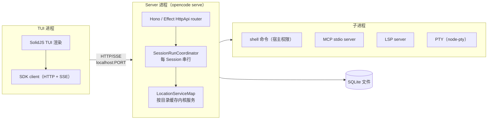
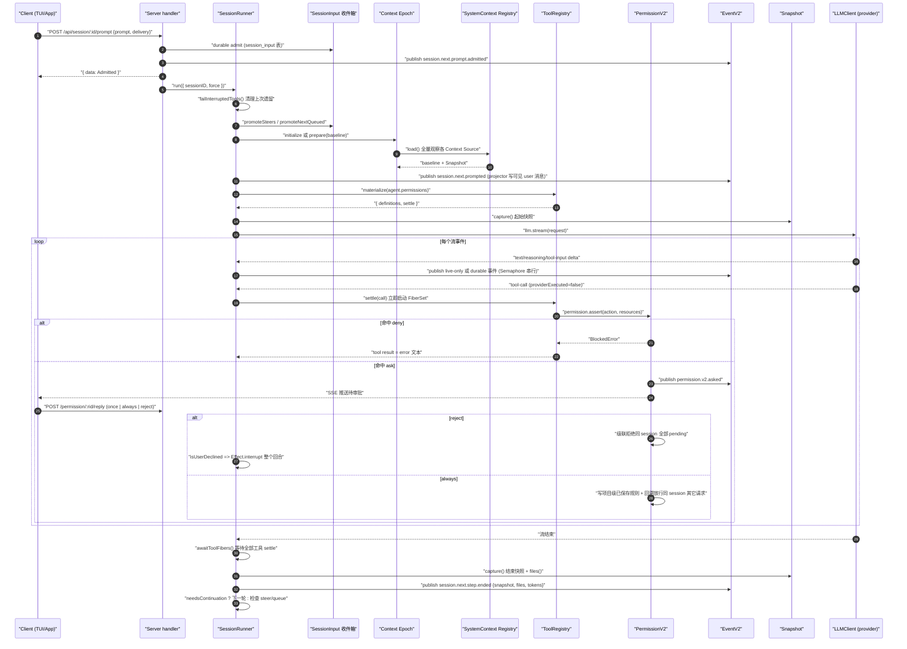
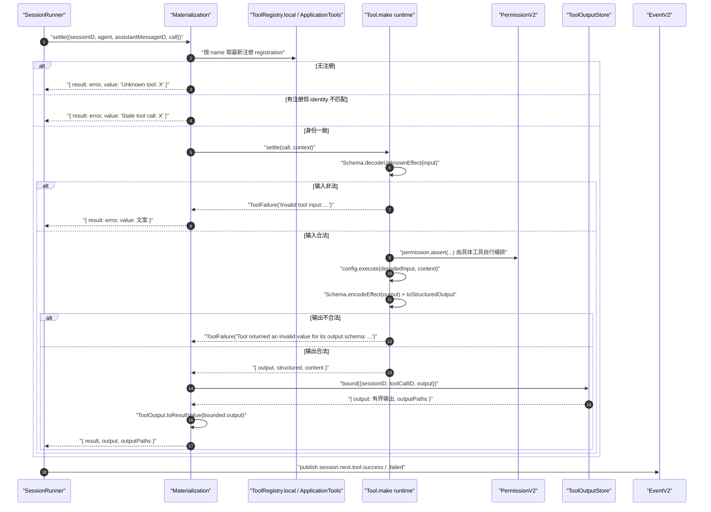
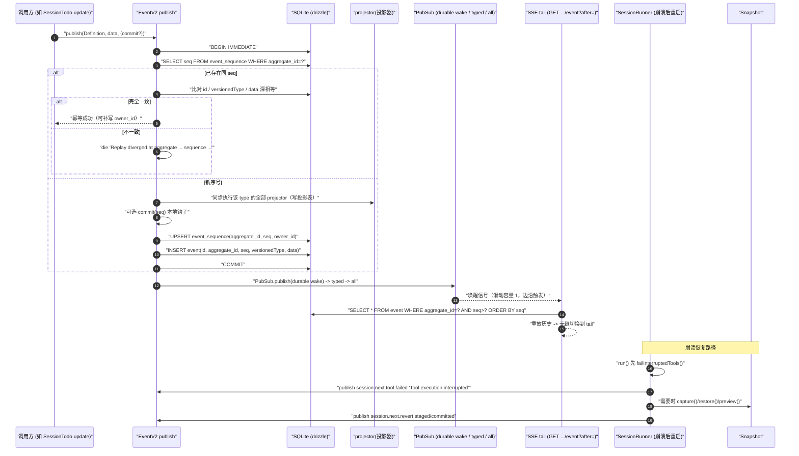

# 竞品研究 02：OpenCode（`sst/opencode` → `anomalyco/opencode`）

> 研究对象：OpenCode —— TypeScript 实现的终端 AI Coding Agent（TUI + 本地 Server 双进程拓扑）。
> 研究方法：`git clone --depth 1 https://github.com/anomalyco/opencode` 到 `.research-cache/sst-opencode`，**逐文件读取真实源码**（E1 为主），辅以官方文档与 GitHub API（E2）。
> 克隆快照：commit `ebb7b76eca82342642c78645109e865614533827`（2026-09-19，分支 `dev`），仓库体量 219 MB / 6632 文件 / 661 个 `*.test.ts`。
> **证据时点（R09 补）**：克隆 commit `ebb7b76`（2026-09-19）；GitHub API 元数据抓取于 2026-09-20。仓库处于 V1→V2 迁移中途，V2 能力面按此快照为准。
> 证据分级：`[E1]` 源码；`[E2]` 官方文档/schema；`[E3]` 第三方；`[E4]` 推断。
> 全文引用路径若无特别说明，均相对仓库根 `packages/`。

---

## ① 结论速览（10 条）

1. **仓库已改名**：`sst/opencode` 已 301 永久重定向到 `anomalyco/opencode`（GitHub 返回 `Location: https://github.com/anomalyco/opencode`，HTTP 301）`[E2]`；`package.json` 中 `repository.url` 也已指向 `anomalyco/opencode` `[E1] packages/package.json`。产品名与文档站仍是 `opencode` / `opencode.ai`，npm 包名 `opencode-ai`，Homebrew tap 为 `anomalyco/tap/opencode` `[E1] README.md`。**研究时必须认准 `anomalyco/opencode`**，`opencode-ai/opencode`（Go 语言的前身仓库）与各类 fork 不是同一代码库。

2. **当前正处于 V1 → V2 架构大迁移中途**，仓库内同时存在两套运行时：`packages/opencode/src/**`（V1 遗留，`core/v1/**` 承载其 schema）与 `packages/core/src/**`（V2，Effect 原生、事件溯源）。V2 的工具集只落地了 12 个内置工具中的一部分，`tool/builtins.ts` 顶部有明确的 TODO 清单（`edit` 模糊匹配对齐、`task`、LSP、`repo_clone`、`plan_exit`、code mode 均未移植）`[E1] packages/core/src/tool/builtins.ts:26-29`。**任何「OpenCode 如何做 X」的结论都必须标注是 V1 还是 V2。**

3. **客户端/服务端分离是硬架构**：Server 用 Effect `HttpApi` 声明式定义全部端点（`packages/protocol/src/api.ts`），客户端是**从同一 HttpApi 契约代码生成的** Promise 与 Effect 双 API（`packages/client/script/build.ts`、`packages/httpapi-codegen/`）`[E1]`。事件流是 **SSE**（`HttpApiSchema.StreamSse`，`GET /api/event`、`GET /api/session/:sessionID/event`）`[E1] packages/protocol/src/groups/event.ts:35-36`、`packages/protocol/src/groups/session.ts:332`。同时提供 **Embedded OpenCode** 模式：用内存 `HttpClient` 打同一个 router，CLI 内嵌时不需要真实网络 `[E1] packages/core/CONTEXT.md`、`packages/sdk-next/package.json`。

4. **会话是完整的事件溯源（Event Sourcing）系统**：所有状态变更发布为 durable event，写入 SQLite `event` 表（`aggregate_id` + `seq` 唯一索引），再由 projector 投影出模型可见消息 `session_message` 表 `[E1] packages/core/src/event.ts:205-367`、`packages/core/src/event/sql.ts:10-25`、`packages/core/src/session/sql.ts:119-138`。事件分 **durable**（可重放、可跨进程恢复）与 **live-only**（文本/推理/tool-input 增量，不重放）两族，`session.events` 的游标严格等于持久化聚合序列 `[E1] specs/v2/session.md:175-183`。

5. **系统提示词按「Context Epoch + 独立可刷新 Source」建模，而不是一段不断重写的字符串**。每个 Context Source 有 `key`、JSON codec、`load`、`baseline/update/removed` 三个渲染器；epoch 内的 baseline 冻结（保护 provider 缓存），发生变化时**以一条持久化的「会话中系统消息」按时间序注入** `[E1] packages/core/src/system-context/index.ts:32-39,198-206,218-280`、`packages/core/src/system-context/builtins.ts:24-42`、`packages/core/src/instruction-context.ts:29-38`。这是本项目全文最重要的可借鉴机制（见 §⑧ L3）。

6. **权限是一个 ask/allow/deny 三值、通配符匹配、findLast 取胜的规则链**，无风险分级：`Rule{action, resource, effect}`，多 ruleset 合并后 `findLast` 命中；任一资源 deny 则整体 deny，任一 ask 则 ask `[E1] packages/core/src/permission.ts:76-86,155-162`。`ask` 通过 `Deferred` 阻塞工具调用；`reply` 取值 **`once` / `always` / `reject`**`[E1] packages/schema/src/permission.ts:41`。`always` 会写入**项目级**已保存规则，并**回溯放行同一会话内其它待审批请求**（批量授权传播）`[E1] packages/core/src/permission.ts:250-283`。`reject` 会**级联拒绝同会话所有待审批请求**，且 V1/V2 一致地让整个 agent loop 中断而非把拒绝塞进 tool 结果 `[E1] packages/core/src/permission.ts:231-247`、`packages/core/src/session/runner/llm.ts:144-150,304-308`。

7. **Bash 不做沙箱，但存在一个独立的「受限代码执行」沙箱包**。前者证据：V2 源码注释「Execute one shell command string with the host user's filesystem, process, and network authority」`[E1] packages/core/src/tool/bash.ts:109`；V2 设计 spec「**Bash is not sandboxed**: the spawned shell runs with the host user's filesystem, process, and network authority」`[E1] specs/v2/session.md:204`；对命令里绝对路径参数的扫描只是「advisory warnings only」`[E1] packages/core/src/tool/bash.ts:138-140`。**但** `packages/codemode` 是一个真实存在的进程内语言沙箱：模型写一小段 JavaScript，只能调用宿主显式提供的工具树，**不获得任何 ambient filesystem/process/network/module/application 权限**；实现是自研 AST 解释器（acorn 解析 + 3465 行 interpreter + 白名单 stdlib），不是 Node `vm` `[E1] packages/codemode/README.md:1-6`、`packages/codemode/src/interpreter/runtime.ts:1-8`、`ls packages/codemode/src/stdlib/`。**结论：shell 无隔离、代码模式有语言级隔离——这是与 OpenCoding 卷 07 五档隔离设计的最大分歧点（并提供一个可采纳的补充机制）。**

8. **快照/回滚基于一个独立的影子 Git 仓库**，而不是 `git stash` 或工作区原地操作：在 `{global.data}/snapshot/{projectID}/{hash(worktree)}` 建裸仓，把工作区文件作为 tree 对象内容寻址写入 `[E1] packages/core/src/snapshot.ts:94-122`。每个 provider turn 前后各 capture 一次，`Step.Ended` 事件携带 `snapshot` 与 `files` `[E1] packages/core/src/session/runner/llm.ts:224,323-343`。V2 revert 拆为 `stage / clear / commit` 三步并支持**按文件选择性恢复** `[E1] packages/protocol/src/groups/session.ts:256-290`、`packages/core/src/snapshot.ts:189-224`。

9. **模型适配是「provider + endpoint 类型 + 变体」三元组，且有模型家族专属系统提示词**：`Endpoint` 枚举含 `openai/responses`、`openai/completions`、`anthropic/messages`、`aisdk`、`unknown` `[E1] specs/v2/provider-model.md:32-61`；`session/system.ts` 按 `model.api.id` 字符串匹配返回 10 套不同基础提示词（`anthropic.txt`/`gpt.txt`/`beast.txt`/`gemini.txt`/`codex.txt`/`kimi.txt`/`meta.txt`/`trinity.txt`/`gpt-astra.txt`/`default.txt`）`[E1] packages/opencode/src/session/system.ts:28-51`，最大一份 155 行 `[E1]`（`wc -l` 实测）。

10. **子 Agent（`task` 工具）与 agent mode（`build`/`plan`）都是「权限规则的差集」，而不是独立的编排引擎**：内置 agent 只有 `build`（primary，默认）、`plan`（primary，`edit` 全 deny）、`general`/`explore`（subagent）与 3 个 hidden 内部 agent（`compaction`/`title`/`summary`）`[E1] packages/opencode/src/agent/agent.ts:140-265`；子会话权限 = 父会话的 deny 规则 + external_directory 规则 + 默认补丁（`todowrite` deny、`task` deny）`[E1] packages/opencode/src/agent/subagent-permissions.ts:20-27`；嵌套深度由 `subagent_depth` 配置（默认 1）`[E1] packages/opencode/src/tool/task.ts:104-117`。

---

## ② 产品与仓库事实

| 项 | 值 | 证据 |
| --- | --- | --- |
| 规范仓库 | `github.com/anomalyco/opencode`（`sst/opencode` 301 重定向到此） | `[E2]` GitHub HTTP 头 + GitHub API |
| 默认分支 | `dev`（`main` 可能不存在） | `[E1] AGENTS.md`；`[E2]` API `default_branch: dev` |
| 语言 / 许可 | TypeScript / MIT | `[E2]` GitHub API `language: TypeScript`、`license: MIT` |
| 星标 / fork / open issues | 208,822 / 27,499 / 5,994 | `[E2]` GitHub API（2026-09-20 抓取） |
| 创建时间 / 最近推送 | 2025-04-30 / 2026-09-20T16:17Z | `[E2]` GitHub API |
| 最新 release | `v1.18.31`（2026-09-14） | `[E2]` GitHub Releases API（近 5 版：1.18.31/30/29/28/27） |
| 产品版本字段 | `packages/opencode/package.json` version `1.18.31`；TUI 同版本号 | `[E1] packages/opencode/package.json`、`packages/tui/package.json` |
| 主页 / 文档 | https://opencode.ai ；docs 目录 `packages/docs/`（Mintlify，`docs.json`） | `[E1]`、`[E2]` |
| 运行时 | **Bun 1.3.14**（`packageManager`） | `[E1] package.json` |
| 构建编排 | Turborepo 2.10.2；lint 用 oxlint；格式化 Prettier（`semi: false, printWidth: 120`） | `[E1] turbo.json`、`package.json` |
| 核心依赖 | `effect@4.0.0-beta.83`、`@effect/sql-sqlite-bun`、`drizzle-orm@1.0.0-rc.2`、`hono@4.10.7`、`zod@4.1.8`、`ai@6.0.168`（Vercel AI SDK，用于 provider SDK 层） | `[E1] package.json` catalog |
| 模型 SDK | 26 个 `@ai-sdk/*` provider 包（anthropic/openai/google/bedrock/azure/groq/mistral/xai/…）集中在 `packages/core` | `[E1] packages/core/package.json` |
| 原生依赖补丁 | `patches/` 下 19 个 patch（含 `@modelcontextprotocol/sdk`、`effect`、多个 `@ai-sdk/*`） | `[E1] package.json patchedDependencies` |
| 分发渠道 | curl 脚本、npm `opencode-ai`、scoop、choco、brew（两套）、pacman、paru、mise | `[E1] README.md` |
| 客户端面貌 | TUI（`@opentui/*` + SolidJS）、Electron 桌面端、Web app、Console、企业版分享页、Slack 集成 | `[E1] packages/{tui,desktop,app,console,enterprise,slack}/package.json` |
| 文档语言 | README 提供 25 种语言版本 | `[E1] README.md` |
| 测试量 | 661 个 `*.test.ts`；`perf/test-suite.md`；`packages/opencode/script/bench-test-suite.ts`、`profile-test-files.ts` | `[E1]` |
| CI | 27 个 workflow（`test.yml`/`typecheck.yml`/`publish.yml`/`generate.yml`/`review.yml`/`models-snapshot.yml`/`pr-standards.yml`/…） | `[E1] .github/workflows/` |
| 内部约定 | `AGENTS.md` 明确「Effect generator 中先绑定 service 到具名变量」「避免 try/catch」「优先 Bun API」；提交规范 Conventional Commits + scope（`core`/`tui`/`app`/`desktop`/`sdk`/`plugin`） | `[E1] AGENTS.md` |
| 术语表 | 根 `CONTEXT.md` 是**领域术语表**（System Context / Session History / Context Source / Context Epoch / Context Snapshot / Admitted Prompt / Prompt Promotion / Provider Turn / Session Drain / Model Tool Output / PTY Environment / Embedded OpenCode / SDK Contract IR 等） | `[E1] CONTEXT.md` |

### 2.1 仓库改名与 fork 辨别（重要）

- `curl -sI https://github.com/sst/opencode` → `HTTP/1.1 301 Moved Permanently`，`Location: https://github.com/anomalyco/opencode` `[E2]`。
- 搜索"opencode"会同时命中 `opencode-ai/opencode`（"A powerful AI coding agent. Built for the terminal"，2025-09 归档快照）`[E3]` 与本次研究的 `anomalyco/opencode`。**两者不是同一代码库**：后者是当前活跃的 TS 实现，有 20.8 万星标、`dev` 分支、`opencode.ai` 官方站与 `opencode-ai` npm 包 `[E2]`。
- 本项目研究范围锁定 `anomalyco/opencode`（即原 `sst/opencode`），下文简称 OpenCode。

---

## ③ 架构总览

### 3.1 包结构与依赖方向

仓库是 Bun workspace monorepo（`workspaces.packages: packages/*`、`packages/console/*`、`packages/stats/*`、`packages/sdk/js`、`packages/slack`）`[E1] package.json`。核心包 30 个，按职责分四层：

| 层 | 包 | 职责 | 证据 |
| --- | --- | --- | --- |
| 契约层 | `schema` | 全部领域 schema + 事件清单（Effect Schema） | `[E1] packages/schema/src/`（59 文件） |
| 契约层 | `protocol` | `HttpApi` 端点声明（19 个 group）+ 授权/schema 错误中间件 | `[E1] packages/protocol/src/api.ts` |
| 契约层 | `client` / `sdk` / `sdk-next` | 从 HttpApi 生成的 Promise/Effect 客户端、SDK Contract IR | `[E1] packages/client/src/contract.ts` |
| 内核层 | `core` | V2 内核：session runner、tool registry、permission、event store、snapshot、config、plugin、skill、system-context、pty、lsp（部分） | `[E1] packages/core/src/`（479 个 `.ts`） |
| 服务层 | `server` | HttpApi handler 实现（19 个 handler 文件） | `[E1] packages/server/src/handlers.ts` |
| 服务层 | `llm` | 自研 LLM 协议层（含 AWS eventstream codec、`aws4fetch` 签名） | `[E1] packages/llm/package.json` |
| 外壳层 | `opencode`（V1 CLI）/`tui`/`desktop`/`app`/`console`/`enterprise`/`slack`/`session-ui`/`ui` | CLI 与各端 | `[E1]` |
| 支撑层 | `codemode`（**受限代码执行沙箱**：自研 AST 解释器 + 白名单 stdlib + OpenAPI→工具编译器，5092 行）、`http-recorder`、`httpapi-codegen`、`identity`、`containers`、`function`、`stats`、`storybook`、`effect-drizzle-sqlite`、`effect-sqlite-node` | 工具与实验 | `[E1] packages/codemode/` |

`AGENTS.md` 用一句话固化了依赖铁律：「Keep runtime dependencies directed from Schema to Core and Protocol, then from Core and Protocol to Server. **Client runtime code may depend on Schema and Protocol but never Core or Server**; `sdk-next` composes Client, Core, and Server.」`[E1] AGENTS.md`

### 3.2 架构图

```mermaid
flowchart TB
  subgraph Shells["外壳层（多端同源）"]
    TUI["TUI<br/>@opentui/core + SolidJS"]
    Desktop["Electron 桌面端<br/>electron-vite + solid-js"]
    WebApp["Web App<br/>@opencode-ai/app"]
    Enterprise["企业分享页<br/>@opencode-ai/enterprise"]
    Slack["Slack 集成"]
    CLI["CLI（V1 sparkline / run / serve / attach）"]
  end

  subgraph Contract["契约层"]
    Schema["@opencode-ai/schema<br/>领域 schema + 事件清单"]
    Protocol["@opencode-ai/protocol<br/>HttpApi 19 group / OpenAPI"]
    ClientGen["@opencode-ai/client<br/>生成 Promise + Effect 双 API"]
  end

  subgraph ServerLayer["服务层"]
    Server["@opencode-ai/server<br/>HttpApi handlers"]
    AuthMW["Authorization 中间件<br/>Basic Auth（OPENCODE_SERVER_PASSWORD）"]
    EventSSE["SSE: GET /api/event"]
    SessionSSE["SSE: GET /api/session/:id/event"]
  end

  subgraph CoreV2["内核层 @opencode-ai/core（Effect 原生，无 Spring 类容器）"]
    Runner["SessionRunner<br/>provider turn 循环"]
    ToolReg["ToolRegistry<br/>materialize + settle"]
    Perm["PermissionV2<br/>ask/allow/deny + Deferred 阻塞"]
    Evt["EventV2<br/>durable + live 双族 + projector + replay"]
    Ctx["SystemContextRegistry<br/>Context Epoch"]
    Compact["SessionCompaction<br/>自动 + 溢出触发"]
    Snap["Snapshot<br/>影子 Git 仓"]
    Store["SessionStore / SessionInput<br/>投影读侧 + 收件箱"]
    Svc["Agent / Model / Catalog / Provider<br/>Config / Plugin / Skill / PTY / Git"]
  end

  subgraph Persist["持久化"]
    SQLite["SQLite（drizzle）<br/>event / session_message / session_input<br/>session_context_epoch / session / message / part"]
    ShadowGit["影子 Git 仓库<br/>global.data/snapshot/"]
    Managed["受管工具输出<br/>global.tool-output/"]
    FS["工作区文件系统"]
  end

  subgraph Deps["外部依赖"]
    ModelsDev["models.dev 模型目录"]
    MCP["MCP servers<br/>stdio / StreamableHTTP / SSE"]
    LSPs["LSP servers<br/>约 30 种内置"]
    AISDK["26 个 @ai-sdk provider"]
    Share["分享服务<br/>opencode.ai / 企业服务"]
  end

  TUI --> ClientGen
  Desktop --> ClientGen
  WebApp --> ClientGen
  Enterprise --> ClientGen
  CLI --> CoreV2
  ClientGen --> Protocol
  Protocol --> Schema
  ClientGen -->|HTTP + SSE| Server
  ClientGen -.->|Embedded HttpClient<br/>内存直连| Server
  Server --> AuthMW
  Server --> EventSSE
  Server --> SessionSSE
  Server --> CoreV2
  Runner --> ToolReg
  ToolReg --> Perm
  Runner --> Evt
  Runner --> Ctx
  Runner --> Compact
  Runner --> Snap
  Runner --> Store
  Runner --> Svc
  Evt --> SQLite
  Store --> SQLite
  Snap --> ShadowGit
  ToolReg --> Managed
  Perm --> SQLite
  Svc --> ModelsDev
  Svc --> MCP
  Svc --> LSPs
  Svc --> AISDK
  Snap --> FS
```



### 3.3 进程与运行拓扑



**拓扑要点**：

- 服务端**按 Location（目录 + workspaceID）缓存内核服务**，`SessionExecution` 与 `SessionStore` 是进程全局的：「`SessionExecution` and the read-side `SessionStore` are process-global. `SessionRunner`, catalog, model resolver, tool registry, permission state, and filesystem are cached per Location. **No layer takes a Session ID.**」`[E1] specs/v2/session.md:48`
- 每个 Session 的本地执行由进程全局 `SessionRunCoordinator` 串行化，不同 Session 可并发；`sessions.active()` 暴露的就是这个注册表，且**明确声明不跨进程重启持久**「activity is not durable across process restarts」`[E1] specs/v2/session.md:29-33,167-169`。
- 服务端认证只有一个 **Basic Auth**：环境变量 `OPENCODE_SERVER_PASSWORD` / `OPENCODE_SERVER_USERNAME`（默认 `opencode`），无密码即视为不需要认证 `[E1] packages/server/src/auth.ts:20-50`。**没有多租户、没有 RBAC、没有 token 签发**。
- `OPENCODE_SERVER_PASSWORD` 缺失时客户端也能用 `Basic` 头带密码访问 `[E1] packages/server/src/auth.ts:52-63`。
- 分享能力由外部服务承载（`packages/share` 逻辑 + `packages/enterprise` 分享页 viewer），与企业配置 `enterprise.url` 挂钩 `[E1] packages/core/src/config.ts:50-56`。

---

## ④ 24 维度逐项分析

### 维度 1：进程与运行拓扑（单进程/常驻/客户端-服务端拆分、IPC 协议）

- **客户端-服务端拆分**：`packages/protocol` 用 Effect `HttpApi` 声明式定义 19 个 group（`health`/`location`/`agent`/`session`/`message`/`model`/`provider`/`integration`/`credential`/`permission`/`fs`/`command`/`skill`/`server.event`/`pty`/`question`/`reference`/`projectCopy`）`[E1] packages/protocol/src/api.ts:37-64`。
- **IPC 协议**：HTTP（REST）+ SSE。事件订阅是 SSE：`GET /api/event` 带 `HttpApiSchema.StreamSse({ data: EventSchema })`，且 schema 会自动补一个 `server.connected` 事件类型 `[E1] packages/protocol/src/groups/event.ts:15-45`。会话级订阅是 `GET /api/session/:sessionID/event?after=`，语义为「先重放 after 之后的 durable 事件，再继续 tail 新 durable 事件」`[E1] packages/protocol/src/groups/session.ts:327-343`。
- **Embedded 模式**：`CONTEXT.md` 定义「Embedded OpenCode 与远端共享同一 Effect API，通过 `HttpClient` 内存实现打同一个 router 与 handlers」`[E1] packages/core/CONTEXT.md`；`sdk-next` 依赖 `client + core + server` 三包以支持该组合 `[E1] packages/sdk-next/package.json`。
- **PTY**：独立资源面，端点 `pty.list/create/get/update/remove` + `pty.connectToken` + `pty.connect`，`pty.connect` 被排除在生成 SDK 之外（`omitEndpoints`）`[E1] packages/protocol/src/groups/pty.ts:23-125`、`packages/client/src/contract.ts:56`。
- **ACP 支持**：`opencode acp` 命令实现 Agent Client Protocol（Zed 生态），对齐 `initialize/newSession/prompt/cancel/loadSession/resumeSession/forkSession/listSessions/closeSession/setSessionModel/setSessionMode/setSessionConfigOption`，代码在 `packages/opencode/src/acp/`（12 个文件）`[E1] packages/opencode/src/acp/agent.ts:1-30`。

### 维度 2：Agent 主循环与回合模型

- **术语已固定**：`Provider Turn` =「一次 provider 请求及其响应」，`Session Drain` =「一次进程内执行跨度：提升可提升输入并运行必要的 Provider Turn 直到没有立即续跑理由」；Session Drain **没有持久标识、没有 transcript 边界**`[E1] packages/core/CONTEXT.md`。
- **V2 主循环**（`packages/core/src/session/runner/llm.ts:390-413`）：

```text
run({ sessionID, force })
  -> 检查 steer 待提升；若无则检查 queue；force 可越过
  -> failInterruptedTools()：把上次进程遗留的 pending/running 工具标记为失败
  -> while (shouldRun)
       while (needsContinuation)
         runTurn(sessionID, promotion, step)
         needsContinuation = result.needsContinuation
         step += 1; promotion = "steer"
         if (!needsContinuation) needsContinuation = hasPending(steer)
       shouldRun = hasPending(queue)
```

- **单回合内部**（`runTurnAttempt`，`llm.ts:173-355`）：Location 栅栏校验 → 选 agent → Context Epoch 初始化/协调 → 解析 model → 读投影历史 → `isLastStep` 判定 → `tools.materialize(agent.permissions)` → 构造 `LLM.request` → 自动压缩检查 → 起始快照 → 流式消费 provider 事件 → 每个 tool-call 立即 `FiberSet.run` 派发 → 等待所有工具 fiber → 结束快照与 `Step.Ended`。整段包在 `Effect.uninterruptibleMask` 里。
- **续跑判据**：`needsContinuation = true` 仅由「本回合出现了 provider 未执行的 tool-call」置位 `[E1] llm.ts:250-255`；回合结束返回 `{ needsContinuation: !hasProviderError && needsContinuation, step }` `[E1] llm.ts:352`。
- **步数上限**：`agent.info.steps`；最后一步不再 materialize 工具（`toolMaterialization = isLastStep ? undefined : …`），注入 `MAX_STEPS_PROMPT` 作为一条 assistant 消息，并设 `toolChoice: "none"` `[E1] llm.ts:202-220`。若模型仍返回 tool-call，则统一置为「Tools are disabled after the maximum agent steps」`[E1] llm.ts:251-254`。
- **V1 主循环**是另一套 `while (true)`：读 `filterCompactedEffect` 后的消息 → 由 `lastAssistant.finish` 与 tool-call 存在性判断退出 → step 自增 → 处理 subtask / compaction 任务 → 溢出检测 → `isLastStep` → reminders → 写 assistant 消息 `[E1] packages/opencode/src/session/prompt.ts:1081-1201`。V1 有一段关键注释：「Some providers return `stop` even when the assistant message contains tool calls. Keep the loop running so tool results can be sent back to the model, but ignore cleanup-marked interrupted orphans.」`[E1] prompt.ts:1103-1109`
- **模型驱动的 retry**：V1 有独立 `session/retry.ts`（209 行）；V2 spec 明确「Provider timeout, retry, and watchdog policy is intentionally deferred. The runner does not impose a universal provider-stream inactivity or absolute timeout.」`[E1] specs/v2/session.md:153`

### 维度 3：工具系统（注册、schema、执行、并行、结果回传）

- **单一构造函数**：`Tool.make(config)`，`config` 含 `description`/`input`/`output`/`structured?`/`toStructuredOutput?`/`execute(input, context)`/`toModelOutput?`。**Definition 是 opaque 的，schema 与 executor 不是公开字段**，通过模块私有 `WeakMap<AnyTool, Runtime>` 保存运行时 `[E1] packages/core/src/tool/tool.ts:40-76,152-156`。
- **Invocation Context**（固定四项）：`sessionID`、`agent`、`assistantMessageID`、`toolCallID`；spec 明确「Raw provider input and domain services do not belong in the invocation context」`[E1] packages/core/src/tool/tool.ts:9-14`、`specs/v2/tools.md:39-50`。
- **JSON Schema 生成**：`Schema.toJsonSchemaDocument`，仅在存在 `definitions` 时补 `$defs` `[E1] tool/tool.ts:158-162`。
- **用户输入校验先于执行**：`settle` 内先 `Schema.decodeUnknownEffect(config.input)`，失败转 `ToolFailure({ message: "Invalid tool input: …" })`；输出先 `Schema.encodeEffect(config.output)`，失败为 `Tool failure` 文案「Tool returned an invalid value for its output schema: …」`[E1] tool/tool.ts:91-112`。
- **工具名约束**：`/^[A-Za-z][A-Za-z0-9_-]{0,63}$/`，注册时校验 `[E1] tool/tool.ts:134-137`。
- **权限装饰器**：`Tool.withPermission(tool, permission)` 复制 runtime 并覆盖 `permission` 字段；注册名与权限动作名可解耦（`permission(tool, name) = runtime.permission ?? name`）`[E1] tool/tool.ts:139-149`。
- **注册语义**（同名多份 + 栈式覆盖）：Registry 内部 `Map<string, Array<{token, registration}>>`，`materialize` 取 `entries.at(-1)`（最新注册获胜），`register` 用 `Effect.addFinalizer` 精确移除自己那份（关闭后自动露出下一份）`[E1] tool/registry.ts:47-48,89-105,106-112`。
- **注册可见性裁剪**：`materialize(permissions)` 会对每个工具计算 `whollyDisabled(action, rules)`——只有规则为 `resource === "*" && effect === "deny"` 才整条移除工具定义 `[E1] tool/registry.ts:112-113,132-135`。
- **陈旧调用防护（Stale tool call）**：`materialize` 抓取每个名字的注册身份 `identity`，settle 时若身份不匹配返回 `Stale tool call: {name}`；未知工具返回 `Unknown tool: {name}` `[E1] tool/registry.ts:54-61,116-121`；设计 spec 明确这是不变量之一「Stale rejection: a call never executes a registration other than the one advertised for its provider turn」`[E1] specs/v2/tools.md:179`。
- **并行执行**：provider 流里每遇到一个 provider-未执行的 tool-call，立即 `Effect.uninterruptibleMask(restore => restore(settle).pipe(...)).pipe(FiberSet.run(toolFibers))`；回合结束 `Effect.raceFirst(FiberSet.join, FiberSet.awaitEmpty)` 等待全部 `[E1] llm.ts:141-142,257-278`。spec 补充「Eager local-tool execution is intentionally unbounded in the current local slice… Session-event publication remains serialized per provider turn」`[E1] specs/v2/session.md:173`
- **结果外置（Managed Tool Output）**：`ToolOutputStore` 的 `bound()` 对模型可见文本做统一上限：`MAX_LINES = 2_000`、`MAX_BYTES = 50 * 1024`、`RETENTION = Duration.days(7)`、目录名 `tool-output`；超限则写入受管文件、返回有界 preview 与 `outputPaths` `[E1] packages/core/src/tool-output-store.ts:12-15,47-51`。设计原则：「When complete retention fails, settlement fails operationally rather than publishing lossy success」`[E1] specs/v2/tools.md:157`。
- **失败分类**：`ToolFailure`（期望内的模型可见失败）/ 中断（不是工具结果）/ 未知与陈旧调用（模型可见的 settlement error，但不调用 handler）/ defect（走运行时的运维失败策略）`[E1] specs/v2/tools.md:161-170`。
- **内置工具清单（V2 已落地 12 个）**：`apply_patch`、`bash`、`edit`、`glob`、`grep`、`question`、`read`、`skill`、`todowrite`、`webfetch`、`websearch`、`write` `[E1] packages/core/src/tool/builtins.ts:31-48`。未移植（TODO）：`task`、LSP、`repo_clone`、`repo_overview`、`plan_exit`、`code mode`、`edit` 模糊匹配对齐 `[E1] builtins.ts:26-29`。
- **内置工具清单（V1 完整）**：`plan_exit`、`question`、`shell`（bash）、`edit`、`glob`、`grep`、`read`、`task`、`todowrite`、`webfetch`、`write`、`invalid`、`skill`、`websearch`、`lsp`、`apply_patch`，另有 plan enter/exit 与 code-mode `[E1] packages/opencode/src/tool/registry.ts:5-31`、`ls packages/opencode/src/tool/`。
- **`bash`/`shell` 具体约束**：`DEFAULT_TIMEOUT_MS = 2 * 60 * 1000`、`MAX_TIMEOUT_MS = 10 * 60 * 1000`、`MAX_CAPTURE_BYTES = 1024 * 1024`；Windows 回退 `COMSPEC ?? cmd.exe`，POSIX 用 `/bin/sh`；`detached: process.platform !== "win32"` + `forceKillAfter: 3s`；输出被截断时追加 `[output capture truncated at the in-memory safety limit]` `[E1] packages/core/src/tool/bash.ts:19-21,49,158-194`。
- **`bash` 的权限前置**：先对 workdir 解析做 `external_directory` 断言，再对命令字符串做 `bash` 断言（`resources: [input.command]`、`save: [input.command]`）`[E1] bash.ts:129-149`。
- **`bash` 的命令参数外目录扫描**：`shellTokens()` 正则切词 + 逐个绝对路径判断是否在 cwd 内，命中则生成 advisory 警告文本「Bash runs with host-user filesystem, process, and network authority; this scan is advisory only.」`[E1] bash.ts:79-95,138-141`。
- **`webfetch`**：`MAX_RESPONSE_BYTES = 5MB`、默认 30s / 上限 120s，支持 `text|markdown|html` 三种输出（默认 markdown，Turndown 转换），按 format 发不同 `Accept` 头 `[E1] packages/core/src/tool/webfetch.ts:17-21,38-56`。
- **`websearch`**：本地工具，provider 只有 `exa` 与 `parallel` 两选一，默认按 `hash(sessionID) % 2` 稳定分流；命中各自 MCP 端点（`https://mcp.exa.ai/mcp`、`https://search.parallel.ai/mcp`）；环境变量 `OPENCODE_WEBSEARCH_PROVIDER`/`EXA_API_KEY`/`PARALLEL_API_KEY` `[E1] packages/core/src/tool/websearch.ts:20-21,59-96`。
- **`read`（V2 首个内置）**：路径必须相对 Location 或具名 reference，**拒绝绝对路径、路径逃逸、符号链接逃逸**；文件返回 UTF-8 文本或 base64 二进制，超大 UTF-8 按行区间分页；目录返回一层子项，目录优先 + 字母序，一based offset + next cursor 分页 `[E1] specs/v2/session.md:193-202`、`packages/core/src/tool/read-filesystem.ts`（366 行）。
- **第三条工具通道：受限代码执行（CodeMode）**。`packages/codemode` 是独立包（README：「Effect-native confined code execution over explicit, schema-described tools」），语义是「模型写一段小程序来编排工具调用」而不是逐次 tool-call `[E1] packages/codemode/README.md:1-6`：
  - **隔离方式**：自研 JS 子集解释器 —— `acorn.parse` 得到 AST 后由 `interpreter/runtime.ts`（3465 行）自解执行；`interpreter/model.ts` 定义 `AstNode`/`Binding`/`CodeModeFunction`/`IntrinsicReference`/`ComputedValue` 等（201 行）；`tool-runtime.ts` 提供 `copyIn`/`copyOut`/`isBlockedMember` 做**纯数据边界**；`typescript.transpileModule` 仅用于剥离类型 `[E1] packages/codemode/src/interpreter/runtime.ts:1-8`、`src/interpreter/model.ts`、`src/tool-runtime.ts`（806 行）。
  - **白名单标准库**：`src/stdlib/` 下 13 个模块（collections/console/date/json/math/number/object/promise/regexp/string/url/value），没有 `fs`/`process`/`fetch`/`require` `[E1] ls packages/codemode/src/stdlib/`。
  - **工具树命名空间**：工具以嵌套对象暴露为 `tools.{ns}.{name}`，如 `tools.orders.lookup({id})`；`OpenAPI.fromSpec` 会把 OpenAPI 3.x 文档编译成工具子树（`operationId` 里的点号形成命名空间，缺 ID 时退化为 `getUsersById` 这类扁平名）`[E1] packages/codemode/README.md（Quick Start / OpenAPI tools 节）`。
  - **资源预算显式建模**：`ExecutionLimits { timeoutMs?, maxToolCalls?, maxOutputBytes? }`，**且三者都「无默认值 = 不限制」**，需宿主显式设置 `[E1] packages/codemode/src/codemode.ts:9-16`。
  - **审计友好的观测点**：`onToolCallStart({index, name, input})` 在输入解码之后、执行之前；`onToolCallEnd({index, name, input, durationMs, outcome, message?})`；**失败结果里仍保留 `toolCalls` 列表**，README 解释「so hosts can audit partial execution without exposing inputs or host failures」；中断的调用不产生 end 事件 `[E1] README.md（Tool-call hooks 节）`。
  - **失败即诊断而非异常**：`Result = Success | Failure`，程序错误/校验错误/限额错误/工具错误都作为 `Diagnostic` 返回，**只有宿主中断仍是中断**；成功值必须是 JSON-safe 数据（`undefined` 归一为 `null`）`[E1] README.md（Results 节）`。
  - **预算化工具目录发现**：`runtime.instructions()` 生成模型可见的工具目录，按「估算 token 预算」（`catalogBudget`，默认 2000，字符数/4）内联完整签名；**跨命名空间轮转（round-robin）保证公平**——每轮里每个还有未内联工具的命名空间各尝试放一个最便宜的签名，放不下的退出本轮而其它继续；指令里显式声明完整度（`COMPLETE list` vs `PARTIAL - N of M shown`，每命名空间标 `(3 tools, 1 shown)`）；运行时搜索工具 `tools.$codemode.search` **始终注册**（即使目录已全量内联），但只在部分内联时才在指令里广告 `[E1] README.md（Discovery 节）`。
  - **OpenAPI → 工具的安全约定**：鉴权（bearer/basic/header/query）**从不对模型可见**，由宿主侧 `auth.resolve` 解析；cookie 认证备选直接丢弃，无可用备选则跳过该 operation；响应上限 50 MiB；非 2xx 转为携带状态码与限长 body 摘要的「安全工具失败」；不支持的参数编码/非 JSON 请求体/二进制响应/流式 operation 进入 `skipped` 而不是产出坏工具 `[E1] README.md（OpenAPI tools 节）`。
  - **当前状态**：包为 workspace 私有（"The package is currently private to this workspace"），V1 侧对应 `tool/code-mode.ts`，V2 侧在 TODO 里仍标记未移植 `[E1] packages/codemode/README.md:8`、`packages/opencode/src/tool/code-mode.ts`、`packages/core/src/tool/builtins.ts:28`。

### 维度 4：权限与审批（模式、粒度、持久化规则）

- **数据模型**：`Rule { action: string, resource: string, effect: "allow"|"deny"|"ask" }`；`Ruleset = Rule[]`；`Request { id, sessionID, action, resources[], save?[], metadata?, source? }`；`Reply = "once"|"always"|"reject"` `[E1] packages/schema/src/permission.ts:26-72`。
- **匹配算法**：`evaluate(action, resource, ...rulesets)` = 扁平化后 `findLast(rule => Wildcard.match(action, rule.action) && Wildcard.match(resource, rule.resource))`，无命中默认 `{ action, resource: "*", effect: "ask" }` `[E1] packages/core/src/permission.ts:76-86`。
- **多 resource 聚合**：任一 resource 为 `deny` 则整体 deny；否则任一为 `ask` 则 ask；否则 allow `[E1] permission.ts:159-161`。
- **规则来源三层**：① agent 自身 `permissions`（`AgentV2.Info.permissions`，schema 必填）`[E1] packages/schema/src/agent.ts:30`；② 项目级已保存规则 `PermissionSaved`（`savedRules()` 读取 `{projectID, action, resource, effect: "allow"}`）`[E1] permission.ts:131-135`；③ 调用点传入的一次性参数 `[E1]`。**无匹配 agent 时回落到 deny-all**：`missingAgentPermissions = [{ action: "*", resource: "*", effect: "deny" }]` `[E1] permission.ts:15,143-144`。
- **阻塞与恢复**：`ask` 创建 `Deferred` 并 `pending.set`，发布 `permission.v2.asked` 事件；`reply` 成功则 `Deferred.succeed`，失败按是否有 `message` 分别抛 `CorrectedError(feedback)` 或 `DeclinedError` `[E1] permission.ts:176-218`。
- **`reject` 的级联语义**：拒绝一个请求 → 遍历 `pending` 把所有**同一 session** 的请求一并发布 `replied: reject` 并 `Deferred.fail(DeclinedError)`，然后 `return`（不继续处理）`[E1] permission.ts:231-247`。
- **`always` 的批量授权传播**：先按 `request.save` 写入项目级已保存规则，随后遍历同 session 其它 pending 请求，用「agent 规则 + 新保存规则」重算，若该请求**全部 resource 都为 allow** 则一并放行并发布 `replied: "always"` `[E1] permission.ts:250-283`。
- **拒绝不是 tool 结果，而是中断整个回合**：V2 runner 的 `isUserDeclined(cause)` 检测到 `DeclinedError`/`RejectedError` defect 时 `FiberSet.clear` + `failUnsettledTools("Tool execution interrupted")` + `Effect.interrupt`；注释写明这是刻意的 V1 对齐：「Match V1: declining a user prompt halts the loop instead of becoming model-facing tool output.」`[E1] llm.ts:144-150,304-308`。
- **进程退出时的兜底**：`Effect.addFinalizer` 把所有 pending `Deferred.fail(DeclinedError)` 后 `pending.clear()` `[E1] permission.ts:119-129`。
- **配置面（V1 语法，仍是当前用户可见面）**：顶层 `permission` 字段或 per-agent `permission`；值可以是单个 `"ask"/"allow"/"deny"`，也可以是 `Record<pattern, action>`；已知 key：`read`/`edit`/`glob`/`grep`/`list`/`bash`/`task`/`external_directory`/`todowrite`/`question`/`webfetch`/`websearch`/`lsp`/`doom_loop`/`skill`，并允许 `StructWithRest` 任意扩展 key `[E1] packages/core/src/v1/config/permission.ts:11-35`。
- **用户 key 顺序被保留**：注释明确「Runtime config parsing uses Effect's `propertyOrder: "original"` parse option so user key order is preserved for permission precedence」`[E1] v1/config/permission.ts:31-34`、`packages/core/src/config.ts:143`。
- **通配符展开**：`fromConfig` 把 `"~/x"`、`"$HOME/…"` 展开为用户主目录 `[E1] packages/opencode/src/permission/index.ts:178-198`。
- **`DoomLoop` 权限动作**：默认 `doom_loop: "ask"`；App 端 i18n 给出其语义「Detect repeated tool calls with identical input」（检测「输入完全相同的重复工具调用」）`[E1] packages/opencode/src/agent/agent.ts:121`、`packages/app/src/i18n/*.ts`（key `settings.permissions.tool.doom_loop.description`）。**检测算法本体未在 `packages/core/src` 定位到**（见 §⑩-3）。
- **Bash 审批的「命令前缀 arity 归约」**：`BashArity.prefix(tokens)` 从最长前缀往下查 `ARITY` 字典，命中则截断到该 arity；否则只取首个 token。注释里的生成提示词说明规则：「Flags NEVER count as tokens. Only subcommands count. Longest matching prefix wins.」字典覆盖约 140 条（`git`→2、`npm run`→3、`docker compose`→3、`touch`→1 …）`[E1] packages/opencode/src/permission/arity.ts:1-9,24-161`。这样 `git checkout main` 只需批准一次 `git checkout`。
- **工具可见性派生**：`disabled(tools, ruleset)` 把 `edit|write|apply_patch` 归一为 `edit` 权限、`*_mcp_resource*` 归一为 `read`，仅当规则 `pattern === "*" && action === "deny"` 时隐藏该工具；`visibleTools()` 用于构造模型可见工具集 `[E1] packages/opencode/src/permission/index.ts:204-219`。
- **默认权限基线**（写入每个内置 agent）：`"*": "allow"`、`doom_loop: ask`、`external_directory: { "*": "ask", …白名单 allow }`、`question: deny`、`plan_enter: deny`、`plan_exit: deny`、`read: { "*": "allow", "*.env": "ask", "*.env.*": "ask", "*.env.example": "allow" }` `[E1] packages/opencode/src/agent/agent.ts:119-136`。
- **`external_directory` 白名单**：`Truncate.GLOB`、`{global.tmp}/*`、所有 skill 目录 `/*`、所有 reference 目录 `/*` 自动 allow；且若某 agent 未被显式 deny `Truncate.GLOB`，则强制追加一条 allow `[E1] agent/agent.ts:108-117,296-310`。
- **V2 新增：`inspect` 型端点** `GET /api/permission/request`、`GET /api/permission/saved`、`DELETE /api/permission/saved/:id`，支持用 UI 管理「已记住的授权」`[E1] packages/protocol/src/groups/permission.ts:23-60`。
- **未观测到**：风险分级（R0–R5 类）、审批超时自动拒绝、审批审计独立表、多人会签。检索词见 §⑩。

### 维度 5：上下文管理（窗口预算、压缩触发点与算法、缓存策略）

- **预算估算**：`SessionCompaction.compactIfNeeded` 用 `Token.estimate(JSON.stringify({system, messages, tools}))` 与 `model.route.defaults.limits.context - Math.max(output, config.buffer)` 比较；`DEFAULT_BUFFER = 20_000` 默认缓冲 `[E1] packages/core/src/session/compaction.ts:12,83,232-243`。
- **两级触发**：① 回合前主动压缩 `compactIfNeeded`（`compaction.auto` 开关，默认 true）；② provider 返回 context-overflow 且**尚无 assistant 输出**时的一次性溢出压缩 `compactAfterOverflow`，且溢出恢复**最多一次**（`runAfterOverflowCompaction` 里若再次溢出直接 die：「Post-compaction provider attempt cannot recover another overflow」）`[E1] compaction.ts:178-231`、`llm.ts:362-374`。
- **压缩算法**：从尾部按 token 累加选取 `keep.tokens`（默认 `DEFAULT_KEEP_TOKENS = 8_000`）作为 `recent`，其余为 `head`；把 `head` 交给一次**独立的 LLM 调用**（`tools: []`、`maxTokens = min(output, 4096)`）产出结构化滚动摘要 `[E1] compaction.ts:12-13,137-158,199-221`。
- **摘要模板是固定的 Markdown 结构**：`## Objective` / `## Important Details` / `## Work State`（`### Completed` / `### Active` / `### Blocked`）/ `## Next Move` / `## Relevant Files`，规则含「Keep every section, even when empty」「Use terse bullets, not prose paragraphs」「Preserve exact file paths, symbols, commands, error strings, URLs, and identifiers」「Do not mention the summary process or that context was compacted」`[E1] compaction.ts:16-46`。
- **滚动更新指令**：有前次摘要时，把 `<prior-summary>` 与新 `<conversation>` 合并，规则明确冲突时「the conversation wins: state the corrected fact and drop the old claim」`[E1] compaction.ts:47-55`。
- **工具输出在摘要里被截断到 2000 字符**：`TOOL_OUTPUT_MAX_CHARS = 2_000` `[E1] compaction.ts:14,85-86`。
- **压缩不删历史**：transcript 永久保留（SQLite），只是替换「活跃模型表示」；且**provider 原生 assistant/reasoning/tool 消息不跨越压缩边界**，理由是避免签名与加密推理失效——「Provider-native assistant, reasoning, and tool messages never survive across the boundary, avoiding signature and encrypted-reasoning failures when the earlier prefix changes」`[E1] specs/v2/session.md:115`。
- **压缩事件**：`session.next.compaction.started.1` / `.delta`（live-only）/ `.ended.1`；只有 `ended` 才投影出模型可见的 compaction 消息；失败/中断的尝试不改变历史边界 `[E1] specs/v2/session.md:117`。
- **prompt 缓存亲和**：`promptCacheKey` 由 session ID 派生（`ses_<64hex>` 去掉 `ses_` 前缀），通过 `providerOptions.openai.promptCacheKey` 传递；同时给 HTTP 头加 `x-session-affinity`、`X-Session-Id`、`x-parent-session-id`（子会话）`[E1] llm.ts:204-214`。
- **Context Epoch 即「缓存基线冻结」机制**：epoch 内 baseline 不可变；只有三种情况开启新 epoch——完成压缩、Session 移动、上下文不兼容变更。发生变化的 source 以「Mid-Conversation System Message」按时间序追加 `[E1] packages/core/CONTEXT.md`、`packages/core/src/system-context/index.ts:70-89,198-206,282-291`。
- **不可用（Unavailable）语义**：临时观察失败不等于源被移除——保留上次已接受的值并发不出更新；替代（Replace）时若仍有已接受的不可用源则阻塞等待，而不是静默产出不完整 baseline `[E1] system-context/index.ts:32-39,119-129,283-291`；初始化阶段不可用则抛 `InitializationBlocked` 且 prompt 保持 pending 可重试 `[E1] specs/v2/session.md:58`。
- **未观测到**：向量检索式上下文挑选、外部记忆注入、区域化（九区段类）预算分配。检索词见 §⑩。

### 维度 6：提示词组织（系统提示装配、分层指令文件、注入顺序）

- **两段式系统提示**：`system: [agent.info?.system, system.baseline]` —— agent 自定义提示 + Context Epoch baseline，各自包成 `SystemPart` `[E1] llm.ts:215-217`。
- **Context Source 初始集合**（V2）：`core/environment`（cwd / workspace root / 是否 git 仓库 / platform）、`core/date`、`core/instructions`（AGENTS.md 族）、selected-agent 的 skill guidance `[E1] packages/core/src/system-context/builtins.ts:16-42`、`packages/core/src/skill/guidance.ts`、`specs/v2/session.md:56`。
- **指令文件发现规则**：从 `location.directory` 向上搜索 `AGENTS.md` 直到 `location.project.directory`（`fs.up({targets:["AGENTS.md"], start, stop})`）；总是包含 `{global.config}/AGENTS.md`；`OPENCODE_DISABLE_PROJECT_CONFIG` 可关闭项目发现；顺序为 `[global, ...discovered]` 且去重；渲染格式 `Instructions from: {path}\n{content}`，多条之间空行 `[E1] packages/core/src/instruction-context.ts:40-74,99-101`。
- **移除语义**：任一已发现且已读取的指令文件读取失败 → 整体视为 `unavailable`；指令集变化时 update 文本为「These instructions replace all previously loaded ambient instructions.」；全删时 removed 文本为「Previously loaded instructions no longer apply.」`[E1] instruction-context.ts:35-37,71-73`。
- **V1 指令发现更宽**：额外支持 `CLAUDE.md`（可由 flag `disableClaudeCodePrompt` 关闭）、已废弃的 `CONTEXT.md`、配置 `instructions[]` 里的本地 glob 与远程 URL（远程并发 4，失败忽略），且注释说明「The first project-level match wins so we don't stack AGENTS.md/CLAUDE.md from every ancestor.」`[E1] packages/opencode/src/session/instruction.ts:61-67,95-98,122,158-167`。
- **模型家族专属基础提示词**：`provider(model)` 按 `model.api.id` 子串匹配返回不同 .txt（见 §①-9）；`muse`/`muse-glimmer` 走 `PROMPT_META` 并替换 `{{MODEL_NAME}}` `[E1] packages/opencode/src/session/system.ts:28-51`。
- **skill 段注入**：若 `skill` 权限被整体禁用则跳过；否则拼「Skills provide specialized instructions and workflows for specific tasks.」+ `Skill.fmt(list, { verbose: true })`；注释解释「the agents seem to ingest the information about skills a bit better if we present a more verbose version of them here and a less verbose version in tool description, rather than vice versa」`[E1] system.ts:107-118`。
- **MCP 段注入**：`<mcp_instructions>` 包 `<server name="…">`，只保留 `instructions` 中「至少有一个工具未被全部禁用」的 server `[E1] system.ts:121-137`。
- **references 段注入**：`<available_references>` + `<name>/<path>/<description>`，只含带 description 的 reference，按名字排序 `[E1] system.ts:69-105`。
- **plan 模式提示词**：独立 `plan.txt`（26 行）、`plan-mode.txt`（70 行）、`plan-reminder-anthropic.txt`（67 行）、`build-switch.txt`（5 行），说明模式切换时会重写提示词段 `[E1] ls packages/opencode/src/session/prompt/`。
- **structured output 专用提示**：`STRUCTURED_OUTPUT_DESCRIPTION` + `STRUCTURED_OUTPUT_SYSTEM_PROMPT`，要求「You MUST use the StructuredOutput tool to provide your final response. Do NOT respond with plain text」`[E1] packages/opencode/src/session/prompt.ts:74-83`。
- **未观测到**：提示词资产的版本化/灰度/AB 机制、提示词与代码的分离存储（提示词是 `*.txt` 静态 import）`[E1]`。

### 维度 7：MCP（传输、能力、配置面、OAuth）

- **传输三选**：`StdioClientTransport`、`StreamableHTTPClientTransport`、`SSEClientTransport`，来自官方 `@modelcontextprotocol/sdk` `[E1] packages/opencode/src/mcp/index.ts:7-9`。
- **远程优先顺序**：远程 server 先尝试 `{name: "StreamableHTTP", transport: new StreamableHTTPClientTransport(url, …)}`，随后是 SSE 兜底，形成 `transports` 数组依次尝试 `[E1] mcp/index.ts:269-281`。
- **Client 标识**：`new Client({ name: "opencode", version: InstallationVersion }, CLIENT_OPTIONS)` `[E1] mcp/index.ts:76`。
- **配置 schema（V2）**：`mcp.timeout.{startup,request}`（毫秒）；server 为 tagged union：`local { type, command[], cwd?, environment?, disabled?, timeout? }` 与 `remote { type, url, headers?, oauth? | false, disabled?, timeout? }`；`oauth` 支持 `client_id`/`client_secret`/`scope`/`callback_port`（1–65535）/`redirect_uri` `[E1] packages/core/src/config/mcp.ts:6-48`。
- **OAuth 实现**：自建 `McpOAuthProvider` + `McpOAuthCallback`，本地回环回调路径常量 `OAUTH_CALLBACK_PATH`；默认 redirect 为 `http://127.0.0.1:{callbackPort}{OAUTH_CALLBACK_PATH}`；state 用 `crypto.getRandomValues(new Uint8Array(32))` 生成并持久化，回调时校验 `storedState !== result.oauthState` 则拒绝；`oauth === false` 时显式抛错而非静默失败 `[E1] mcp/index.ts:809-910`。
- **MCP 工具变化的可观测**：事件 `mcp.tools.changed`、`mcp.browser.open.failed` `[E1] packages/schema/src/mcp-event.ts:7,14`。
- **MCP instructions 注入系统提示**：`mcp.instructions()` 产出 `{name, instructions, tools}` 列表，再按权限过滤拼接（见维度 6）`[E1] packages/opencode/src/session/system.ts:121-137`。
- **MCP 资源作为附件**：`MAX_MCP_RESOURCE_BLOB_BYTES = 10 * 1024 * 1024` 与受限 MIME 白名单 `[E1] packages/opencode/src/session/prompt.ts:65-73`。
- **MCP 作为 Server 暴露（反向）**：未观测到。检索词见 §⑩。

### 维度 8：Skill/插件机制

- **Skill 文件约定**：以 `SKILL.md` 为入口（或 `{name}.md`），支持 YAML frontmatter（`name`/`description`）；`Skill.FrontmatterError` 专门处理解析失败 `[E1] packages/opencode/src/skill/index.ts:23-25,112-115`。
- **四类发现源**：① 内置 skill（`customize-opencode`，注册在磁盘扫描**之前**，注释明确「so a user-disk skill with the same name can override it」）；② 全局外部目录（`EXTERNAL_SKILL_PATTERN = "skills/**/SKILL.md"`）；③ 项目 `.opencode` 下 `OPENCODE_SKILL_PATTERN = "{skill,skills}/**/SKILL.md"`；④ 配置 `skills.paths[]`（支持 `~/` 展开）与 `skills.urls[]` `[E1] skill/index.ts:23-25,183-231,275-280`。
- **重复名处理**：`duplicate skill name` 警告并保留先发现者（V2 plugin 侧为「后注册覆盖」语义）`[E1] skill/index.ts:125-133`。
- **远程 Skill 拉取**（V2 `SkillDiscovery.pull`）：读取 `{base}/index.json`（`Index{skills: IndexSkill[]}`，每项 `name`/`version`/`files[]`），做四重安全校验——`isSafeSegment(name)`、必须含 `SKILL.md` 或 `{name}.md`、`FSUtil.contains(sourceRoot, root)` 防逃逸、每个文件的 `resource.origin !== source.origin` 即拒绝；缓存到 `{global.cache}/skills/{hash(base)}`；有版本号时用 **staging → rename → backup → 失败回滚** 的原子替换，版本文件 `.opencode-version`；HTTP 客户端配置 `retryTransient({times: 2, schedule: exponential(200).jittered})`，并发 4（skill）/8（file）`[E1] packages/core/src/skill/discovery.ts:15-53,99-207`。
- **插件形态**：外部 npm 包（`plugins` 配置为字符串数组，V2 为 `ConfigPlugin.Plugins`）`[E1] packages/core/src/config.ts:102-104`；V2 起插件是 **Effect 原生**（`PluginRuntime["effect"]`，接收 `PluginContext`），并通过 `PluginV2.add(id, effect)` 动态装载 `[E1] packages/core/src/plugin.ts:24,43`。
- **插件 Hooks（V1，仍是完整能力面）**：`packages/plugin/src/index.ts:222-335` 定义 `Hooks` 接口，含
  - 生命周期：`dispose`、`event`、`config`
  - 能力注入：`tool`（`Record<string, ToolDefinition>`）、`auth`、`provider`（含 `models` 钩子）
  - 聊天干预：`chat.message`、`chat.params`（temperature/topP/topK/maxOutputTokens/options）、`chat.headers`
  - 权限干预：`permission.ask`（可把 `status` 改成 `ask`/`deny`/`allow`）
  - 命令/工具：`command.execute.before`（可改 parts）、`tool.execute.before`（可改 args）、`tool.execute.after`（可改 title/output/metadata）、`shell.env`（注入环境变量）、`tool.definition`（改描述与参数）
  - 实验：`experimental.chat.messages.transform`、`experimental.chat.system.transform`、`experimental.provider.small_model`、`experimental.session.compacting`（可整体替换压缩提示词）、`experimental.compaction.autocontinue`（可跳过自动续跑）、`experimental.text.complete`
  `[E1]`
- **V2 插件宿主能力面**（`PluginHost.make`）：`agent.transform`、`aisdk.sdk/language`、`catalog.transform`（provider/model 增删改 + 默认模型）、`command.transform`、`integration.transform/method`（含 OAuth `authorize`/`refresh` 回调注入）、`plugin.add/remove`（插件可安装插件）、`reference.transform`、`skill.transform`、以及各自的 `reload` `[E1] packages/core/src/plugin/host.ts:20-218`。
- **插件隔离与生命周期**：按 `ID` 加 `KeyedMutex` 串行；每次 `add` 先关旧 scope；`loading.has(id)` 时重复 `add` 直接 die「Plugin load cycle detected for {id}」（防自引用环）；支持 `wait(id)` 等待加载完成或失败（失败会 `Deferred.done(exit)` 把失败传播给等待者）；`Effect.addFinalizer` 关闭全部 `[E1] packages/core/src/plugin.ts:43-83,100-126`。
- **插件加载失败不致命**：失败进入 `failures` map，`wait()` 的等待者会收到该失败 Exit，不阻塞其它插件 `[E1] plugin.ts:41,73-79`。
- **未观测到**：插件沙箱/权限门面（插件与应用同进程、同权限）、插件市场/签名、插件依赖求解。检索词见 §⑩。

### 维度 9：SubAgent/多 Agent 编排

- **`task` 工具参数**：`description`（3–5 词）、`prompt`、`subagent_type`、`task_id?`（**续跑同一子会话**）、`command?`、`background?` `[E1] packages/opencode/src/tool/task.ts:43-62`。
- **深度限制**：沿 `parentID` 上溯计数，`depth >= (cfg.subagent_depth ?? 1)` 即失败，错误文案提示可以调大 `subagent_depth` `[E1] task.ts:104-117`。
- **审批**：除非 `ctx.extra.bypassAgentCheck`，先 `ctx.ask({ permission: "task", patterns: [subagent_type], always: ["*"] })` —— 即「批准某 subagent 类型后不再问」`[E1] task.ts:119-129`。
- **子会话权限派生**（核心机制）：`deriveSubagentSessionPermission` 只继承父会话中 **`permission === "external_directory"`** 或 **`action === "deny"`** 的规则——注释说明「Parent agent restrictions only govern that agent; **the subagent's own permissions determine its capabilities**」；再补两条默认 deny（`todowrite`、`task`），除非子 agent 自己已声明对应权限 `[E1] packages/opencode/src/agent/subagent-permissions.ts:4-27`。
- **额外 deny 注入**：`childToolDenies` 追加 `todowrite`、`task`、以及 `experimental.primary_tools` 里列出的所有权限；且注入前做去重（不覆盖已有的相同规则）`[E1] task.ts:143-172`。
- **子会话是真实 Session**：`sessions.create({ parentID, title: "{desc} (@{agent} subagent)", agent, permission: [...] })`；`task_id` 命中则复用已有 session（`catchCause` 容错为 undefined 再新建）`[E1] task.ts:136-172`。
- **模型继承**：子 agent 有自己 `model` 则用之，否则继承父消息的 `modelID/providerID`；`variant` 同理 `[E1] task.ts:181-190`。
- **结果回传格式**：`<task id="…" state="running|completed|error">` + 可选 `<summary>` + `<task_result>` / `<task_error>`，整段作为 tool output `[E1] task.ts:64-79`。
- **后台子 Agent（实验）**：需 `OPENCODE_EXPERIMENTAL_BACKGROUND_SUBAGENTS=true`，否则直接失败并提示该环境变量 `[E1] task.ts:97-102`。后台模式下返回「已启动」+ 明确的**禁止轮询**指令：「DO NOT sleep, poll for progress, ask the task for status, or duplicate this task's work… Work on non-overlapping tasks」`[E1] task.ts:31-41,316-319`。完成后由 `BackgroundJob` 监听并把结果以 `synthetic: true` 的文本注入父会话（`injectBackgroundResult`）`[E1] task.ts:227-265`。
- **前台取消链路**：监听 `ctx.abort` → `ops.cancel(nextSession.id)` + `background.cancel`；中断 Exit 时清理 `[E1] task.ts:321-358`。
- **`explore` 子 agent 用权限做能力裁剪**：`"*": "deny"` + 只允许 `grep/glob/list/bash/webfetch/websearch/read/external_directory(白名单)`，并配专属提示词 `PROMPT_EXPLORE` `[E1] packages/opencode/src/agent/agent.ts:196-218`。
- **无 peer-to-peer 多 Agent 编排**：没有 agent teams / 仲裁 / 共享黑板 / 预算熔断概念；`background-job.ts` 提供的是单层任务托管 `[E1] packages/core/src/background-job.ts`。检索词见 §⑩。

### 维度 10：任务/计划/Todo 机制

- **Todo 模型**：`Info { content, status, priority }`（无 id、无 DAG、无依赖）；`TodoTable` 主键为 `(session_id, position)`，`update` 采用**整表替换**（delete + insert，事务内）后发布 `todo.updated` 事件 `[E1] packages/schema/src/session-todo.ts:19`、`packages/opencode/src/session/todo.ts:29-51`、`packages/core/src/session/sql.ts:100-117`。
- **`todowrite` 工具**：只有 44 行提示词（`tool/todowrite.txt`），无内置校验（如「同时只能一个 in_progress」）；V2 里 `todowrite` 是独立内置工具 `[E1] packages/core/src/tool/todowrite.ts`（62 行）、`packages/opencode/src/tool/todowrite.txt`。
- **plan 模式不是 DAG 计划器**，而是**权限禁写 + 专用提示词 + 计划文件白名单**：`plan` agent 把 `edit` 全 deny，仅允许写 `{global.data}/plans/*.md` 与 `.opencode/plans/*.md`；`task.general` deny；`plan_exit` allow；另有 `plan_enter`/`plan_exit` 工具在 `build` agent 下 allow `[E1] agent/agent.ts:156-181`、`packages/opencode/src/tool/plan.ts`、`tool/plan-enter.txt`(14 行)/`plan-exit.txt`(13 行)。
- **未观测到**：任务 DAG、依赖求解、规格驱动、证据验收、看板。检索词见 §⑩。

### 维度 11：Goal/自治循环/Schedule

- **未观测到** 任何 Goal 模式、自治循环、定时任务（`@Scheduled` 等价物）、触发器、熔断。仓库内无 cron/schedule 相关目录或配置项 `[E1]`（`ls packages/*/src` 全量核对；`grep -rn "cron"` 仅命中 i18n 文案「cronologie」与 markdown 关键字表 `crontab` 两处误报，无调度器实现——R09 复核：原文「无命中」不严谨，与 §10 第 8 条的准确表述对齐）。
- 最接近的是 `background-job.ts`（单次后台任务托管 + 提升/取消/等待）与 `task` 工具的 `background` 模式 `[E1] packages/core/src/background-job.ts`、`packages/opencode/src/tool/task.ts:256-319`。
- 检索词见 §⑩。

### 维度 12：会话持久化与恢复（存储格式、resume/fork/compact）

- **存储**：SQLite（Bun 原生 + drizzle）。V2 表族：`event_sequence`（`aggregate_id` 主键 + `seq` + `owner_id`）、`event`（`id` 主键，`(aggregate_id, seq)` 唯一，`(aggregate_id, type, seq)` 索引）、`session_message`（`id` 主键，`(session_id, seq)` 唯一 + `(session_id, type, seq)` + `(session_id, time_created, id)` + `(time_created)` 四个索引）、`session_input`（`promoted_seq` / `admitted_seq` 各带唯一索引，`(session_id, promoted_seq, delivery, admitted_seq)` 复合索引）、`session_context_epoch`（`session_id` 主键，存 `baseline` + `snapshot` JSON + `baseline_seq`）`[E1] packages/core/src/session/sql.ts`、`packages/core/src/event/sql.ts`。
- **V1 表族**并行存在：`session`（含 `share_url`、`summary_additions/deletions/files`、`cost`、`tokens_input/output/reasoning/cache_read/cache_write`、`revert` JSON、`permission` JSON、`agent`、`model` JSON、`time_compacting`、`time_archived`）、`message`、`part` `[E1] session/sql.ts:22-98`。
- **迁移体系**：`packages/core/src/database/migration/` 下 45 个带时间戳的迁移文件，从 `20260127222353_familiar_lady_ursula.ts` 到 `20260622202450_simplify_session_input.ts`，另有 `migration.gen.ts`、`schema.gen.ts`；迁移命名沿用 drizzle-kit 的随机后缀风格 `[E1] ls packages/core/src/database/migration/`。
- **写入原子性**：所有 durable 事件在同一 `db.transaction(..., {behavior:"immediate"})` 内完成——读序号 → 跑 projector → 执行可选 `commit(seq)` 本地钩子 → upsert `event_sequence` → insert `event` `[E1] packages/core/src/event.ts:239-351`。
- **重放（replay）**：`replay(event, {publish?, ownerID?, strictOwner?})` 支持幂等：若目标 seq 已存在，比对 `id` / `versionedType` / `data` 深度相等则**静默成功**（并可补写 `owner_id`），不等则 die「Replay diverged at aggregate … sequence …」；`replayAll` 要求同一 aggregate 且 seq 连续递增，否则 die `Replay sequence mismatch at index …` `[E1] event.ts:254-289,480-512`。
- **聚合所有权**：`claim(aggregateID, ownerID)` + `strictOwner` 校验，用于多节点/同步场景的「谁有权写这个聚合」仲裁 `[E1] event.ts:147,254-262,525-532`。
- **投影器注册**：`project(definition, projector)` 按事件类型注册，在事务内同步执行（`for (const projector of list) yield* projector(committed)`）`[E1] event.ts:320-322,615-620`。
- **恢复语义**：`failInterruptedTools` 在每轮 run 前把投影中仍为 `pending`/`running` 的工具统一发布 `Tool.Failed`，文案 `Tool execution interrupted`；设计文档强调「abandoned side effects are never silently replayed」`[E1] llm.ts:119-139`、`specs/v2/session.md:50`。
- **resume**：`session.prompt` 的 `resume` 参数决定「仅准入（false）」还是「准入后调度执行」；`SessionExecution.resume(sessionID)` 是显式恢复入口；`run` 会 join 正在执行者或在空闲时强制 drain `[E1] packages/protocol/src/groups/session.ts:205-224`、`specs/v2/session.md:41-45,160-163`。
- **fork**：V1 `Session.fork({sessionID, messageID?})` 是**消息深拷贝**（逐条 `updateMessage` 生成新 ID，父 ID 通过 `idMap` 重映射，`compaction` part 的 `tail_start_id` 也重映射），标题用 `getForkedTitle` 生成 `{title} (fork #N)` `[E1] packages/opencode/src/session/session.ts:162-168,691-728`。V1 有 `session.fork` 命令与 keybind（默认未绑定）`[E1] packages/tui/src/config/keybind.ts:92`。
- **V2 无 fork 端点**：V2 会话组里有 `revert.stage/clear/commit`、`context`、`history`、`events`、`interrupt`、`wait`，但**没有 fork** `[E1] packages/protocol/src/groups/session.ts:106-380`。ACP 层实现了 `ForkSessionRequest` 对齐（走 V1 SDK）`[E1] packages/opencode/src/acp/agent.ts:15`。
- **分享**：`session.share_url` 字段 + `share: "manual"|"auto"|"disabled"` 配置 + `OPENCODE_DISABLE_SHARE` 环境变量（同时进 turbo `globalEnv`/`globalPassThroughEnv`）；`SessionShare.create` 在 `share === "auto"` 或 flag `autoShare` 时**异步 fork 分享**且失败忽略 `[E1] packages/opencode/src/share/session.ts:28-54`、`turbo.json`、`packages/core/src/config.ts:47-49`。
- **未观测到**：会话导出/导入格式（V1 CLI 有 `export` 命令 `[E1] packages/opencode/src/cli/cmd/export.ts`）、跨设备会话同步协议细节。检索词见 §⑩。

### 维度 13：事件与可观测（流式协议、事件类型清单）

- **事件信封字段**：`id`、`type`、`data`、`metadata?`、`durable?{aggregateID, seq, version}`、`location?{directory, workspaceID}` `[E1] packages/protocol/src/groups/event.ts:8-13`。
- **双族模型**：durable（进 `event` 表、可重放、有 seq/version）与 live-only（仅 PubSub 广播，不重放）。设计文档：「Live-only text, reasoning, and tool-input fragments remain available through EventV2 subscriptions for connected renderers; they are intentionally absent from the replayable Session stream.」`[E1] specs/v2/session.md:175`
- **会话事件类型清单**（`session.next.*`，共 32 处 `Event.define`）`[E1] packages/schema/src/session-event.ts`：
  - 会话/输入：`session.next.agent.switched`、`session.next.model.switched`、`session.next.moved`、`session.next.prompted`、`session.next.prompt.admitted`、`session.next.context.updated`、`session.next.synthetic`
  - Shell：`session.next.shell.started`、`session.next.shell.ended`
  - Step：`session.next.step.started`、`session.next.step.ended`（version 2）、`session.next.step.failed`
  - 文本/推理：`session.next.text.started/delta/ended`、`session.next.reasoning.started/delta/ended`
  - 工具：`session.next.tool.input.started/delta/ended`、`session.next.tool.called`、`session.next.tool.progress`、`session.next.tool.success`、`session.next.tool.failed`
  - 其它：`session.next.retried`、`session.next.compaction.started/delta/ended`、`session.next.revert.staged/cleared/committed`
- **其它族**：`todo.updated`、`session.status`、`session.idle`、`session.compacted`、`server.connected`、`global.disposed`、`vcs.branch.updated`、`worktree.ready/failed`、`tui.prompt.append`、`tui.command.execute`、`tui.toast.show`、`tui.session.select`、`mcp.tools.changed`、`mcp.browser.open.failed`、`lsp.updated`、`permission.v2.asked/replied`、`plugin.*`、`project.*`、`pty.*`、`filesystem.*`、`models-dev.*`、`installation.*` `[E1] packages/schema/src/event-manifest.ts:57-83` 及各 `*-event.ts`。
- **事件清单治理**：`EventManifest.Definitions` 由各模块 `Event.Definitions` 汇总，`ServerDefinitions` 是其中的子集（排除了 V1 live、LSP、TUI、MCP、Legacy、V1 question 等），`Latest = Event.latest(Definitions)` 提供版本化类型名（`versionedType(type, version)`）`[E1] event-manifest.ts:34-84,83`、`packages/core/src/event.ts:115`。
- **订阅 API**：`subscribe(definition)`（按类型）、`all()`（全量 PubSub）、`durable({aggregateID, after?})`（先读历史再 tail，用滑动容量 1 的 wake signal 做边沿触发，且**先注册 wake 再重放历史**以保证不漏事件）`[E1] packages/core/src/event.ts:534-604`。
- **背压工具**：`allBounded(events, capacity)` 用 `Queue.dropping` + 溢出时 `Queue.fail(SubscriberOverflowError)` `[E1] event.ts:110-113,152-164`。
- **监听器隔离**：durable 事件路径下监听器异常被 `observe()` 捕获并 `Effect.logError`，不会打断发布；非 durable 路径直接内联执行 `[E1] event.ts:398-417`。
- **遥测**：Effect OpenTelemetry，`experimental.openTelemetry` 开关；日志走 OTLP（`packages/core/src/observability/otlp.ts`）；Vercel AI SDK 层同时传 `experimental_telemetry.isEnabled` 与 tracer `[E1] packages/core/src/observability.ts:11-16`、`packages/opencode/src/session/llm.ts:208-211,344-347`。**未观测到**产品级遥测开关/同意 UI。检索词见 §⑩。
- **日志落盘**：`Observability.layer` 合并 `Logging.loggers()` 与 `Otlp.loggers()`，日志文件系统由 `NodeFileSystem` 提供 `[E1] observability.ts:11-20`。

### 维度 14：Hooks/生命周期扩展点

- **V1 插件 hooks 是最完整的生命周期面**（见维度 8 清单），包含 4 个可**阻断/改写**的强语义点：`permission.ask`（改判定）、`tool.execute.before`（改 args）、`tool.execute.after`（改输出）、`command.execute.before`（改 parts）`[E1] packages/plugin/src/index.ts:261-281`。
- **V2 转向「服务 transform」而非「事件 hook」**：`PluginHost` 暴露的全是 `*.transform(callback)` + `*.reload()` + 少数命令式动作（`plugin.add/remove`、`integration.connection.*`），没有 before/after 式钩子；设计文档把「plugin message, system, parameter, and header transforms」列为 **missing** 待办 `[E1] packages/core/src/plugin/host.ts:29-218`、`specs/v2/session.md:142`。
- **无脚本型 hooks**：未观测到 `hooks.json` / shell hook / 进程外 hook 执行器（对比 Claude Code 的 hooks 设计）。检索词见 §⑩。

### 维度 15：沙箱与安全执行（隔离技术、网络策略、审批绕过防护）

- **结论：OS 层无沙箱；语言层有一个受限解释器沙箱。** shell/工具以宿主用户权限运行，四个独立证据源：① `grep -rn "sandbox" packages/opencode/src/tool packages/opencode/src/cli` 零命中；② `bash` 工具描述文本自身声明宿主权限 `[E1] packages/core/src/tool/bash.ts:109`；③ V2 spec 用陈述句写「Bash is not sandboxed」`[E1] specs/v2/session.md:204`；④ 外目录扫描被降格为 advisory `[E1] bash.ts:138-140`。
- **唯一的隔离机制是 `packages/codemode` 的进程内语言沙箱**：自研 AST 解释器（acorn + 3465 行 runtime）、白名单 stdlib（13 模块，无 fs/process/fetch/require）、`isBlockedMember` 成员访问拦截、`copyIn/copyOut` 纯数据边界、`ExecutionLimits` 三项预算（timeoutMs / maxToolCalls / maxOutputBytes，**默认全为不限制**）`[E1] packages/codemode/src/interpreter/runtime.ts`、`src/tool-runtime.ts`、`src/codemode.ts:9-16`。注意：这是**能力受限**（没有 ambient 权限）而非**资源受限**（默认无超时无配额），且该包尚未接入 V2 会话工具面 `[E1] packages/core/src/tool/builtins.ts:28`。
- **网络策略**：shell 与 webfetch 均无出口限制；`webfetch` 只做协议（HTTP/HTTPS）与体积/超时限制；`websearch` 固定打到 Exa/Parallel 两个 MCP 端点；CodeMode 的 OpenAPI 适配器把响应限制为 50 MiB 并要求宿主自行处理重定向与凭据剥离（README 明确「credentialed hosts should reject redirects or strip credentials when the origin changes」）`[E1]`。
- **审批绕过防护**：
  - `bash` 的 `save: [input.command]` 表示批准后保存的规则是**完整命令字符串**（配合 `BashArity.prefix` 归约后的前缀），不是 `*`——避免一次批准永久放开所有命令 `[E1] packages/core/src/tool/bash.ts:142-149`、`packages/opencode/src/permission/arity.ts:1-9`。
  - `task` 工具的 `save: ["*"]` 是按 `subagent_type` 粒度放行 `[E1] packages/opencode/src/tool/task.ts:120-128`。
  - `external_directory` 断言在 bash workdir 解析后**先行**执行，且 V2 `apply_patch` 会对每个 mutation target 逐一批准外目录 `[E1] bash.ts:129-137`、`specs/v2/session.md:206`。
  - `PermissionV2.assert` 包在 `Effect.uninterruptibleMask` 内，等待审批期间不可被中断取消 `[E1] packages/core/src/permission.ts:198-218`。
- **敏感文件默认保护**：`read` 权限默认对 `*.env`、`*.env.*` 为 `ask`，`*.env.example` allow（注释说明镜像了 GitHub `Node.gitignore` 的 `.env` 模式）`[E1] packages/opencode/src/agent/agent.ts:129-135`。
- **密钥存储**：`packages/core/src/credential.ts` + `credential/sql.ts`（凭据表）与 `packages/core/src/oauth/`、`github-copilot/`；OAuth token 走 `Integration`/`Credential` 服务 `[E1] ls packages/core/src/`、`packages/core/src/plugin/host.ts:103-192`。
- **`gitleaks` 配置**：仓库根有 `.gitleaksignore` `[E1]`。
- **未观测到**：容器/VM 隔离、seccomp/AppArmor、网络代理或域名白名单、密钥代理（broker）。检索词见 §⑩。

### 维度 16：工作区/远程执行（SSH/容器/云）

- **Workspace 是 V2 预留概念**：`packages/core/src/workspace.ts` 只有 6 行（`export const ID = Workspace.ID`），schema 在 `packages/schema/src/workspace.ts`；`control-plane/workspace.sql.ts` 建了 `workspace` 表但字段极少 `[E1]`。`session.sql.ts` 中 `workspace_id` **可空**，注释解释「An omitted `Location.workspaceID` means implicit-local placement; explicit workspace identity remains reserved for future placement semantics」`[E1] specs/v2/session.md:48`。
- **Session 移动（跨目录）已实现**：`control-plane/move-session.ts` 支持 `{sessionID, destination:{directory}, moveChanges?}`，并区分 `DestinationProjectMismatchError` / `ApplyChangesError` / `CaptureChangesError`；TUI 有 `session.move` 命令 `[E1] packages/core/src/control-plane/move-session.ts:18-42`、`packages/tui/src/config/keybind.ts:88`。
- **worktree 隔离已实现**：`packages/opencode/src/worktree/index.ts` 用 `git worktree add --no-checkout [-b branch | --detach] {dir} {ref}`，目录固定为 `{global.data}/worktree/{projectID}`；有 `create/remove/reset/list`，名称冲突时循环重新生成，失败抛 `WorktreeCreateFailedError`/`StartCommandFailedError`/`RemoveFailedError`/`ResetFailedError`/`ListFailedError`；支持 `startCommand` 在项目启动命令之后附加执行；事件 `worktree.ready` / `worktree.failed`；`git worktree list --porcelain` 解析 `worktree ` 前缀行 `[E1] worktree/index.ts:9-410`、`packages/schema/src/worktree-event.ts:8,16`。
- **SSH / 容器 / 云执行**：未观测到。`packages/containers` 是**镜像构建/发布**相关包而非运行工作区（`ls packages/containers`）。检索词见 §⑩。
- **project-copy 能力**：`POST /api/projectCopy`、`DELETE /api/projectCopy`、`POST /api/projectCopy/refresh`，TUI 有新建/删除/刷新 project copy 的 keybind（`ctrl+m` / `ctrl+d` / `ctrl+r`）`[E1] packages/protocol/src/groups/project-copy.ts:25-47`、`packages/tui/src/config/keybind.ts:211-213`。

### 维度 17：Git 与 worktree 集成

- **影子仓库快照**（非 worktree）：见 §①-8 与维度 12。`git.tree.capture({repository, scopes, ignores, maximumUntrackedFileBytes})`，未跟踪文件单文件上限 `2 * 1024 * 1024`；`files()` 会剔除 `git.index.ignored()` 命中的路径；`restore` 时路径不在目标 tree 中则**删除该文件**，未在 map 中的路径不动 `[E1] packages/core/src/snapshot.ts:129-224`。
- **快照开关**：`snapshots: false` 或 `location.vcs?.type !== "git"` 时 `capture()` 直接返回 `undefined`；有 `Snapshot.noopLayer` 供禁用场景使用 `[E1] snapshot.ts:124-128,238-248`。
- **恢复的路径逃逸防护**：`plan()` 对每个相对路径做 `FSUtil.contains(worktree, absolute)` 校验，越界抛 `Path escapes the project: {file}` `[E1] snapshot.ts:178-187`。
- **revert 的两代语义**：
  - V1：`SessionRevert.revert({sessionID, messageID, partID?})` **立即**回滚文件 + 计算 diff + 写 `storage["session_diff"]` + 发布 `Session.Event.Diff`；`unrevert` 恢复快照并清空；`cleanup` 在会话后续正常继续时删除被回退的消息与 part `[E1] packages/opencode/src/session/revert.ts:38-124`。`revert` 前 `state.assertNotBusy(sessionID)`。
  - V2：`stage`（暂存边界，可选 `files: true` 立即应用文件变更）→ `clear` → `commit`（确认），是**三段式**，允许用户预览后再确认 `[E1] packages/protocol/src/groups/session.ts:256-290`。
- **vcs 事件**：`vcs.branch.updated` `[E1] packages/schema/src/vcs-event.ts:8`。
- **平台集成**：`.github/workflows` 有 `github.yml`/`pr.ts`/`pr-management.yml`；CLI 有 `opencode github`、`opencode pr` 子命令 `[E1] packages/opencode/src/cli/cmd/github.ts`、`packages/opencode/src/cli/cmd/pr.ts`。
- **未观测到**：commit 边界自动提交、合并队列、冲突自动解决、大仓优化策略。检索词见 §⑩。

### 维度 18：记忆/知识库

- **未观测到**持久记忆或知识库索引。`packages/core/src` 全量核对无 `memory*`/`knowledge*` 模块；`grep -rln "embedding"` 仅命中 `github-copilot/copilot-provider.ts`、`session/runner/model.ts` 等与「模型能力标记」相关的无关位置（非检索/存储能力）`[E1]`。
- 最接近的能力是 **references**：配置 `references` 声明具名本地目录或 Git 仓库作为外部上下文，系统提示里以 `<available_references>` 暴露，`read` 工具接受具名 reference 相对路径；skill 目录与 reference 目录会被自动加入 `external_directory` 白名单 `[E1] packages/core/src/config/reference.ts`、`packages/opencode/src/session/system.ts:71-104`、`packages/opencode/src/agent/agent.ts:108-117`。
- 另有 `skill` 的渐进加载（SKILL.md 正文由 skill 工具按需读入）充当「按需知识」`[E1] packages/core/src/tool/skill.ts`、`packages/core/src/skill/guidance.ts`。
- 检索词见 §⑩。

### 维度 19：A2A/被集成能力（作为库、SDK、headless、MCP server、协议）

- **HTTP 服务端**：`opencode serve` 命令；完整 OpenAPI（`packages/docs/openapi.json`、`packages/sdk/openapi.json`）`[E1]`。
- **SDK**：
  - `packages/sdk/js`（legacy JS SDK，由 `script/build.ts` 生成）
  - `packages/client`（Effect + Promise 双 API，从 `makeDefaultApi` 契约生成；`generated/` 与 `generated-effect/` 目录禁止手改）`[E1] AGENTS.md`、`packages/client/src/`（5 文件 + 2 目录）
  - `packages/sdk-next`（组合 Client + Core + Server，用于嵌入式）`[E1] sdk-next/package.json`
  - `SDK Contract IR`：schema 化的编译中间表示，保留 encoded/decoded 类型投影与传输元数据，使独立 emitter 可选择自己的值模型与解释器 `[E1] packages/core/CONTEXT.md`
- **代码生成**：`packages/httpapi-codegen`（含 `test/fixture.ts`、`test/generate.test.ts`）；AGENTS.md 规定「After changing the public Protocol or Server `HttpApi`, run `bun run generate` from `packages/client`. **Do not edit `src/generated` or `src/generated-effect` directly.**」`[E1]`
- **Headless CLI**：`opencode run` 子命令（`cli/cmd/run.ts` + `cli/cmd/run/` 目录 25 文件）；另有 `export`/`import`/`attach`/`stats`/`db`/`models`/`mcp`/`agent`/`generate`/`upgrade`/`uninstall`/`acp`/`serve`/`web`/`tui`/`session`/`github`/`pr`/`providers`/`account`/`plug`/`cmd` 与 `debug/` 子目录 `[E1] ls packages/opencode/src/cli/cmd/`。
- **ACP**：作为 ACP Agent 被编辑器（Zed 类）驱动（见维度 1）`[E1]`。
- **MCP Server 暴露**：未观测到（只做 MCP client）。检索词见 §⑩。
- **测试用 HTTP 录制/回放**：`packages/http-recorder` + `packages/opencode/script/httpapi-exercise.ts --mode coverage|auth|effect --fail-on-missing --fail-on-skip`，会**强制校验每个端点被覆盖**（缺覆盖即失败）`[E1] packages/opencode/package.json` scripts。

### 维度 20：客户端形态（TUI/桌面/IDE/Web）与交互细节

- **TUI**：`@opentui/core` + `@opentui/solid` + `@opentui/keymap`（SolidJS 渲染到终端），`packages/tui/src` 152 个 TS/TSX 文件，含 `routes/home`、`routes/session`、`component/prompt`、`feature-plugins/{home,sidebar,system}`、`theme/assets` `[E1] packages/tui/package.json`、`find src -maxdepth 2 -type d`。
- **Leader 键 = `ctrl+x`**，所有组合以 `<leader>` 前缀表达 `[E1] packages/tui/src/config/keybind.ts:41`。
- **Keybind 表 ~200 项**，组织为：应用/主题/侧栏、diff 查看器（17 项，含 `]`/`[` 跳 hunk、`n`/`p` 跳文件、`v` 切换 split/unified、`b` 切换文件树、`s` 单 patch）、会话（25+ 项，含 `session_fork`、`session_undo=<leader>u`、`session_redo=<leader>r`、`session_compact=<leader>c`、`session_queued_prompts=<leader>q`、`session_child_cycle=right`、`session_parent=up`、`session_quick_switch_1..9=<leader>1..9`、`session_pin_toggle=ctrl+f`）、模型（`model_cycle_recent=f2`、`variant_cycle=ctrl+t`）、agent（`agent_cycle=tab`）、消息滚动（15 项，含 `<leader>h` 切换代码块折叠、`display_thinking` 切换推理块）、输入框完整 emacs 风格键位（`ctrl+a/e/k/u/w`、`alt+f/b/d`、`ctrl+-` 撤销）、stash（`prompt.stash`）、which-key 面板（9 项键位）`[E1] keybind.ts:45-240`。
- **Keybind 可配置且强校验**：`KeybindOverrides` 由 `Definitions` 表驱动生成 schema（每项带 description），`parse()` 对未知键**直接抛错**「Unrecognized keybind: …」；`bindingDefaults()` 自动从 `CommandDescriptions` 补 `desc` `[E1] keybind.ts:245-252,449-471`。
- **`session_background`（`ctrl+b`）=「Background synchronous subagents」**，即把正在同步等待的子 agent 转入后台 `[E1] keybind.ts:98`。
- **桌面端**：Electron 42.3.3 + electron-vite 5 + solid-js；`src/main`（含 `wsl/` 子目录 → **支持 WSL 目标**）、`src/preload`、`src/renderer`（含 `i18n/`、`wsl/`）；依赖 `electron-updater`、`electron-store`、`electron-window-state`、`electron-log`、`electron-context-menu`、`@sentry/solid`；打包用 `electron-builder` 26，三通道 `dev|beta|prod` 对应 appId `ai.opencode.desktop[.dev|.beta]`，保留 legacy Linux desktop entry `opencode-desktop.desktop` 以免旧 GNOME/KDE 固定项失效；Windows 签名走 `script/sign-windows.ps1`（仅 GITHUB_ACTIONS）`[E1] packages/desktop/package.json`、`packages/desktop/electron-builder.config.ts:1-60`、`find src -maxdepth 2 -type d`。
- **Web App**：`packages/app`（SolidStart + Playwright e2e + happy-dom）；**`session-ui` 是 app 与 enterprise 共享的会话渲染包**（`@pierre/diffs`、`@shikijs/stream`、`marked`、`dompurify`、`morphdom`、`luxon`、`motion`）`[E1] packages/session-ui/package.json`、`grep -l session-ui */package.json`。
- **Console**：`packages/console/*`（多 subscriber：`app` 等），web 控制台 `[E1] package.json workspaces`。
- **IDE 集成**：`packages/opencode/src/ide/`（IDE 事件 schema `packages/schema/src/ide-event.ts`）；发布 VS Code 扩展的 workflow `publish-vscode.yml` `[E1]`。
- **Slack**：`packages/slack`（独立包 + README）`[E1]`。
- **可访问性**：未观测到（TUI 场景无 a11y 设计文档）。检索词见 §⑩。

### 维度 21：配置面与层级

- **文件名**：`opencode.json` 与 `opencode.jsonc`（两者都读，同名同目录按顺序）`[E1] packages/core/src/config.ts:142`。
- **发现与优先级**（从低到高）：① `{global.config}`（`~/.config/opencode`）目录；② 从 `location.directory` 向上到 `location.project.directory` 找到的 `opencode.json(c)` 文件（**就近优先**：注释「A config closer to the opened directory should win over one higher up. Search starts nearby, so reverse the results before applying them.」）；③ 同名路径下的 `.opencode/` 目录（`loadDirectory` 追加一个 `Directory` entry，用于后续加载目录内其它资源）；最终合并顺序 `[...(supplementary[0]), ...direct, ...supplementary.slice(1)]`，注释「Apply general settings first and more specific settings last: global config, project files, then `.opencode` files.」`[E1] config.ts:164-204`
- **规则（policy）加载顺序相反**：`configs` 反序后展开 `experimental.policies`，注释「Rules use the opposite order so a user-global rule can override a repository rule. Statement order inside each file stays unchanged.」`[E1] config.ts:205-211`
- **读取一次并缓存**：注释「Read configuration once when this location opens. Later calls reuse these values until the location is reopened.」`[E1] config.ts:175-176`
- **解析容错**：使用 `jsonc-parser` 的 `parse(text, errors, { allowTrailingComma: true })`；**只要有解析错误就整体返回 undefined 跳过该文件**（不 fail-fast）；schema 解码失败同样静默跳过（`decodeUnknownOption`）`[E1] config.ts:143,147-160`
- **V1 → V2 配置迁移**：`ConfigMigrateV1.isV1(input)` 判定后先按 V1 schema 解码再 `migrate` 到 V2，再解码 V2 `[E1] config.ts:156-157`
- **顶层键全集（V2 `Config.Info`）**：`$schema`、`shell`、`model`、`default_agent`、`autoupdate`（`boolean | "notify"`）、`share`（`manual|auto|disabled`）、`enterprise.url`、`username`、`permissions`（Ruleset）、`agents`（Record）、`snapshots`（boolean）、`watcher`、`formatter`、`lsp`、`attachments`、`tool_output`、`mcp`、`compaction`、`skills`（string[]）、`commands`（Record）、`instructions`（string[]）、`references`、`plugins`、`experimental`、`providers`（Record） `[E1] packages/core/src/config.ts:29-107`
- **每个配置类字段都带 `annotate({description})`** —— 这既服务文档又服务 OpenAPI/类型生成 `[E1] config.ts` 全文、`packages/core/src/config/mcp.ts`
- **未知键被忽略**：`decodeOptions = { errors: "all", onExcessProperty: "ignore", propertyOrder: "original" }`；`propertyOrder: "original"` 的存在理由是保留权限规则的用户书写顺序 `[E1] config.ts:143`、`v1/config/permission.ts:31-34`
- **环境变量族**：`OPENCODE_SERVER_PASSWORD`/`OPENCODE_SERVER_USERNAME`、`OPENCODE_DISABLE_SHARE`、`OPENCODE_DISABLE_PROJECT_CONFIG`、`OPENCODE_EXPERIMENTAL_BACKGROUND_SUBAGENTS`、`OPENCODE_WEBSEARCH_PROVIDER`、`OPENCODE_CLIENT`、`OPENCODE_CHANNEL`、`OPENCODE_VERSION`、`EXA_API_KEY`、`PARALLEL_API_KEY`、`VIRTUAL_ENV`（Python LSP 探测）；turbo 显式声明 `CI`/`OPENCODE_DISABLE_SHARE` 为 global env `[E1] ` 各文件中直接读 `process.env` 的位置（`grep -rn "process.env" packages/{core,server,opencode,desktop}/src`）`[E1]`
- **配置文件内不支持环境变量插值**：`config.ts` 中无 `${VAR}` 替换逻辑（对比 OpenCoding 的 `open-coding.*` + `${ENV:default}` 约定）`[E1]`（`grep -n "\\${" packages/core/src/config.ts` 无命中）
- **全局路径**：`Global` 服务提供 `config`/`data`/`cache`/`home`/`tmp` 等根；快照在 `{data}/snapshot/…`，worktree 在 `{data}/worktree/…`，plan 文件在 `{data}/plans/…`，skill 缓存在 `{cache}/skills/…`，工具输出在 `{data}/tool-output` `[E1]` 各引用点

### 维度 22：更新/分发/遥测/许可

- **分发矩阵**：curl 脚本 / npm `opencode-ai` / scoop / choco / `brew install anomalyco/tap/opencode` / `brew install opencode` / pacman / paru / mise；另有 `install` 与 `install.cmd` 脚本在仓库根 `[E1] README.md`、`ls` 根目录。
- **安装方式探测**：`Method = "curl" | "npm" | "yarn" | "pnpm" | "bun" | "brew" | "scoop" | "choco" | "unknown"`，与 `NpmConfig` 联动决定升级命令 `[E1] packages/opencode/src/installation/index.ts:20,1-20`。
- **版本与通道**：构建期全局常量 `OPENCODE_VERSION` / `OPENCODE_CHANNEL`，未注入时回落 `"local"`；`isPreview() = InstallationChannel !== "latest"`（`installation/index.ts:47`）；`getReleaseType(current, latest)` 返回 `patch|minor|major` 用于决定升级提示强度 `[E1] packages/core/src/installation/version.ts:1-10`、`packages/opencode/src/installation/index.ts:24-56`。
- **User-Agent**：`opencode/{channel}/{version}/{client}`，`OPencode_CLIENT` 环境变量决定 client 标识 `[E1] installation/index.ts:48-52`、`packages/core/src/models-dev.ts:26`。
- **自动更新**：配置 `autoupdate: boolean | "notify"`；桌面端用 `electron-updater`；事件 `installation.*` + 遥测模块 `packages/stats` + workflow `stats.yml` `[E1] packages/core/src/config.ts:42-46`、`packages/desktop/package.json`。
- **模型目录同步**：从 `models.dev` 拉取模型目录并缓存，带 `Flock` 文件锁与 `Schedule` 重试，事件 `models-dev.*`，workflow `models-snapshot.yml` `[E1] packages/core/src/models-dev.ts:1-30`、`packages/schema/src/event-manifest.ts:40`。
- **遥测**：仅 OpenTelemetry（traces/logs，需 `experimental.openTelemetry`）。**未观测到** 默认开启的产品行为遥测、遥测同意分级、崩溃上报服务端（Sentry 只在桌面端 `@sentry/solid` + `@sentry/vite-plugin` 作为依赖声明）`[E1]`。检索词见 §⑩。
- **许可**：MIT（根 `LICENSE` 与 `package.json.license`）`[E1]`。**无席位/许可校验、无商业版开关**（`packages/enterprise` 是开源的企业分享页前端，不是闭源商业模块）`[E1] packages/enterprise/package.json`。
- **安全策略文件**：根 `SECURITY.md` `[E1]`。

### 维度 23：企业能力（多用户、审计、配额、私有化）

- **服务端认证仅 Basic Auth**（见维度 1）；**无用户体系、无 RBAC、无会话级鉴权**（`Authorization` 中间件只做一次凭据比对）`[E1] packages/server/src/auth.ts`。
- **多租户隔离靠「每用户一个本地进程 + 本地 SQLite 文件」**，服务端不共享状态；`enterprise.url` 只是「企业分享服务」的地址配置 `[E1] packages/core/src/config.ts:50-56`。
- **审计**：无独立审计表/审计流；可观测面是 durable 事件流 + OTLP 日志 `[E1]`。
- **配额/计量**：会话表有 `cost` 与 `tokens_*` 五列（input/output/reasoning/cache_read/cache_write）累计，`step.ended` 事件带 `cost` 与 `tokens`（V2 当前硬编码 `cost: 0`）`[E1] packages/core/src/session/sql.ts:43-48`、`packages/core/src/session/runner/llm.ts:332-342`。**无配额上限、无预算熔断、无成本归因维度** `[E1]`。
- **私有化部署**：Dockerfile/dockerignore + `containers.yml` workflow + `packages/containers`；无 K8s/Helm/离线私仓方案 `[E1]`。
- **DLP**：未观测到。检索词见 §⑩。

### 维度 24：显著工程细节（性能、并发、失败处理、测试策略）

- **Effect 全栈**：内核层用 Effect 的 `Context.Service` + `Layer` + `Effect.fn` 命名追踪（每个方法名如 `PermissionV2.assert`、`ToolRegistry.materialize` 都进 span/log）+ `Scope` 管理资源 + `Deferred` 做同步点 + `FiberSet` 做并发工具 + `Semaphore` 做发布串行化 `[E1]`（`packages/core/src/**` 全文）。
- **DI 图即代码**：`makeLocationNode({service, layer, deps})` 显式声明依赖，形成可静态检查的服务图；`LocationServiceMap` 按 Location 缓存整张图 `[E1] packages/core/src/effect/app-node.ts`（引用点见 permission.ts:306-310、bash.ts:203-207）。
- **发布串行化**：`const withPublication = Semaphore.makeUnsafe(1).withPermit`，所有事件发布经 `publish()` 串行，避免并发重写 assistant 投影 `[E1] llm.ts:235-237`。
- **不可中断区**：审批创建、事件提交、快照写入、工具 settle 都在 `Effect.uninterruptibleMask`/`uninterruptible` 内，保证「要么完整要么不做」`[E1] permission.ts:177-188,221-222`、`event.ts:237-363`、`llm.ts:257-262`。
- **副作用顺序不可逆检查**：事件提交在事务内先跑 projector 再写 `event_sequence`/`event` 表；`input.seq <= latest` 时做**幂等比对**而非覆盖 `[E1] event.ts:262-290`。
- **背压与溢出显式化**：`SubscriberOverflowError`、`Queue.dropping`、`FiberSet.awaitEmpty`、`ignore` 化可失败的可选动作（如快照 diff 失败 `Effect.catch(() => Effect.succeed(undefined))`）`[E1] llm.ts:327-331`。
- **测试策略**：
  - 661 个测试文件；`turbo.json` 为不同包声明独立 test task（`opencode#test`、`@opencode-ai/core#test` 等），并 `dependsOn: ["^build"]` `[E1] turbo.json`
  - `bun test --timeout 30000 --only-failures` 是统一入口 `[E1] packages/opencode/package.json`
  - **HTTP API 契约测试**：`test:httpapi` 跑 `httpapi-exercise.ts` 的 3 个 mode（`coverage` / `auth` / `effect`），且 `--fail-on-missing --fail-on-skip` —— 任何端点未被覆盖或跳过都会 fail `[E1] packages/opencode/package.json`
  - 契约卫生测试：`packages/schema/test/{compatibility,contract-hygiene,event-manifest,event,legacy-event,v1-isolation}.test.ts`；`client/test/import-boundaries.test.ts` 校验依赖边界 `[E1]`
  - 性能：`perf/test-suite.md` + `bench:test` / `profile:test` 脚本 `[E1]`
  - `http-recorder` 包提供 HTTP 录制/回放以稳定测试 `[E1]`
- **代码风格强制**：oxlint + oxlint-tsgolint + Prettier + Husky；`AGENTS.md` 规定「Avoid `try`/`catch` where possible」「Avoid using the `any` type」「Keep things in one function unless composable or reusable」「Do not extract single-use helpers preemptively」`[E1] AGENTS.md`。
- **规格文档与代码同仓**：`specs/v2/*.md` 9 篇（config/instructions/provider-model/provider-policy/session/todo/tools/schema-changelog/catalog-config-plugin-lifecycle）共 3646 行；`specs/v2/schema-changelog.md` 单文件 843 行，是 schema 演进日志 `[E1] wc -l specs/v2/*.md`。
- **`CONTEXT.md` 术语表作为设计契约**：明确要求避免用词（如 System Context 避免说 "System prompt"、Session History 避免说 "Session Context"），这是团队用来防止概念漂移的工程手段 `[E1] CONTEXT.md`。

---

## ⑤ 核心流程源码走读

### 走读 A：一次 provider turn 的完整生命周期（含事件、快照、工具并行）

**入口**：`SessionRunner.run`（`packages/core/src/session/runner/llm.ts:390-413`）→ `runTurn(sessionID, promotion, step)` → `runTurnAttempt`。



**关键设计点（源码级）**：

1. **输入两阶段**：prompt 先「durable admit」进 `session_input` 表（`admitted_seq` 唯一），在 `session.next.prompted` 之前**不进入模型可见历史**；`delivery` 决定它何时被提升 `[E1] packages/core/src/session/runner/llm.ts:187-196`、`specs/v2/session.md:35-37`。
2. **提升顺序**：先 `promoteSteers`（同回合内注入），`queue` 只在「否则会空闲」时才 `promoteNextQueued` 且一次只放一个 `[E1] specs/v2/session.md:155-158`。promotion 发生会把 step 重置为 1 `[E1] llm.ts:195`。
3. **Location 栅栏**：回合开头比对 session 的 directory/workspaceID 与当前 Location，不一致直接 `Effect.interrupt` `[E1] llm.ts:179-181`。
4. **发布串行化 + 工具未结算兜底**：多条 `failUnsettledTools(...)` 分支覆盖「provider 报错」「中断」「流正常结束但工具无结果」「超过最大步数」四种情况 `[E1] llm.ts:251-254,296-348`。
5. **溢出压缩的一次性语义**：`recoverOverflow` 仅在「尚无 assistant 输出」且判定为 context overflow 时生效；生效后进入 `runAfterOverflowCompaction` 路径，该路径**再溢出直接 die** `[E1] llm.ts:289-296,362-374`。

### 走读 B：工具执行 + 权限门控（Registry 的 settle 契约）

**入口**：`ToolRegistry.materialize(permissions)` 返回的 `settle`（`packages/core/src/tool/registry.ts:106-122`）→ `settleWith(input, advertised)`（同文件 50-82）。



**关键设计点（源码级）**：

1. **Registry 不做权限决策**：设计文档明确「Trusted tools formulate and sequence permission requests. `PermissionV2` evaluates policy and manages approval. **The registry does not inject an `assertPermission` helper.**」`[E1] specs/v2/tools.md:131`。权限断言写在每个工具自己的 `execute` 里（对比 `bash.ts:129-149`、spec 中的 `grep` 示例 `specs/v2/tools.md:111-123`）。
2. **输出尺寸是 Registry 的职责而非工具的职责**：「Tools return complete validated domain output. **They do not truncate model-facing output or manage retention files.**」`[E1] specs/v2/tools.md:155`。因此工具实现里看不到 truncate 逻辑，全部由 `ToolOutputStore.bound()` 统一处理。
3. **结算事件携带 owning assistant message ID**：因为 provider 本地 call ID 可能跨回合重复，spec 解释「Tool settlement events carry the owning assistant message ID because provider-local call IDs may repeat across turns」`[E1] specs/v2/session.md:50`。
4. **失败不吞异常**：「Leaf tools translate only errors they deliberately classify as recoverable. **Broad cause-catching around an executor is invalid because it consumes interruption and defects.**」`[E1] specs/v2/tools.md:170`

### 走读 C：事件溯源持久化 + 恢复 + 快照回滚



**关键设计点（源码级）**：

1. **事件提交与投影在同一个事务内**：projector 在 `db.transaction(..., {behavior:"immediate"})` 内部同步执行，因此投影表与事件表**不会出现跨表不一致** `[E1] event.ts:239-351`。
2. **幂等重放的三要素比对**：`stored.id === event.id && stored.type === versionedType(...) && isDeepStrictEqual(stored.data, encoded)`，任一不符即 die；这意味着重放是**严格可验证**的，而不是 best-effort `[E1] event.ts:262-290`。
3. **durable tail 的「先订阅后重放」顺序**：`subscribeDurable` 先注册 wake 信号再 `readAfter` 历史，注释解释「Subscribe and register the dirty signal before historical replay, then remove it when the tail closes, so **replay handoff cannot miss a commit**」`[E1] specs/v2/session.md:183`、`event.ts:565-604`。
4. **快照是影子仓库而非 stash**：多个项目/多个 worktree 各自有独立 `gitDirectory = {global.data}/snapshot/{projectID}/{Hash.fast(worktree)}`，`create({worktree, gitDirectory, seed: source})` 从真实仓库 seed 出独立仓 `[E1] snapshot.ts:94-122`。
5. **过期状态清理**：`session_context_epoch` 是**单行覆盖**表（`session_id` 主键），配 `baseline_seq`；不保留 epoch 历史 `[E1] packages/core/src/session/sql.ts:168-176`。

---

## ⑥ 工程亮点与可借鉴点

1. **Context Epoch + Context Source 三元渲染器**（`baseline`/`update`/`removed`）：把「系统提示词」从字符串提升为「带身份、可观察、可比较、可增量渲染的类型化源集合」，并用 epoch 冻结 baseline 换取 provider 提示缓存命中。`Unavailable`（临时无法观察，保留旧值）与 `Incompatible`（历史快照无法用当前 codec 解码）的区分让「临时失败」与「源被移除」语义分离，避免静默构造不完整 baseline。`[E1] packages/core/src/system-context/index.ts:32-39,119-129,198-206,218-280`

2. **工具注册的身份快照（Stale tool call）**：materialize 时记录每个名字的注册身份，settle 时校验；插件热替换工具后，旧回合的调用会被明确拒绝而不是错误地执行新实现。这是热插拔场景下极易被忽略的正确性问题，用极少的代码（一个 `identity: {}` 对象 + 引用比对）解决。`[E1] packages/core/src/tool/registry.ts:47-61`

3. **权限规则的 findLast + 用户书写顺序保留**：不用「优先级数值」而用「后写覆盖前写」，并通过 `propertyOrder: "original"` 保证 JSON 解析不重排 key。规则语义对用户完全可解释（"越靠后越优先"）。`[E1] packages/core/src/permission.ts:76-86`、`packages/core/src/config.ts:143`

4. **`always` 的批量授权传播 + `reject` 的级联拒绝**：一次「总是允许」会回溯放行同会话内其它**已被同一规则覆盖**的待审批请求；一次拒绝会把同会话其它待审批请求一并拒绝。两者共同避免「用户连点 20 次审批」并保证语义一致（拒绝一个动作通常意味着拒绝同类动作）。`[E1] packages/core/src/permission.ts:231-283`

5. **Bash 审批的 arity 归约**：用约 140 条「命令前缀 → token 数」字典把 `git checkout main` 归约为 `git checkout`，使审批粒度落在「人类理解的命令」而不是「整条命令行」或「首个 token」。字典生成提示词本身也留在源码注释里，可复现、可审计。`[E1] packages/opencode/src/permission/arity.ts:1-161`

6. **两族事件（durable / live-only）的显式分离**：durable 事件有 seq/version 可重放；文本/推理增量明确标记为「不可重放」，且文档写明「they cannot advance the durable cursor, replay after reconnect, or be mistaken for publication boundaries」。这让「重连后一致」与「流式低延迟」两个目标同时成立。`[E1] specs/v2/session.md:175-183`

7. **影子 Git 仓快照**：不污染用户仓库（不 stash、不建临时 commit），支持按文件选择性恢复与 preview（`preview()` 不修改工作区即返回 diff）。存储隔离在 `global.data` 下并带路径逃逸校验。`[E1] packages/core/src/snapshot.ts`

8. **工作区外的「受管输出」统一边界**：`MAX_LINES 2000 / MAX_BYTES 50KB / 7 天保留`，超限则落盘 + 返回 bounded preview + `outputPaths`；并且明确「retention 失败要 operational fail，不能假装成功」。单一位置实现意味着所有工具自动获得该能力。`[E1] packages/core/src/tool-output-store.ts:12-15`

9. **SDK 从 API 契约生成 + 双运行时（Promise/Effect）+ 内存 HTTP 直连**：同一 HttpApi 既服务远端 SDK 也服务嵌入式进程内调用，AGENTS.md 用「禁止手改 generated 目录、改契约后必须跑 generate」把纪律固化。`[E1] AGENTS.md`、`packages/client/src/contract.ts`

10. **端点覆盖强制门禁**：`httpapi-exercise.ts --mode coverage --fail-on-missing --fail-on-skip` 让「新增端点忘记写测试」变成 CI 失败而不是 code review 靠人盯。`[E1] packages/opencode/package.json`

11. **规格文档与术语表同仓、同 PR 维护**：`specs/v2/*.md` 用「Status: complete/partial/missing」表格逐条列举 V1→V2 的 parity 缺口，`CONTEXT.md` 用 `_Avoid_:` 显式禁止错误用词。这是把架构意图变成可校验资产的做法。`[E1] specs/v2/session.md:125-151`、`CONTEXT.md`

12. **模型家族专属提示词 + 意图明确的注入位**：`system.ts` 的 `provider(model)` 是一个纯函数式的提示词路由表；skill 段落有一句诚实的实证注释解释「为什么在系统提示里写 verbose 版本、在工具描述里写简版」。`[E1] packages/opencode/src/session/system.ts:28-51,107-118`

13. **受限代码执行（CodeMode）：把「N 次 tool-call」压缩成「1 段程序」并给出语言级隔离**。三重价值：① **能力隔离** —— 模型写的代码没有任何 ambient 权限，只能经 `tools.*` 调用宿主显式提供的工具，从而在**不引入容器/VM 的前提下**获得一层真实隔离；② **审计友好** —— `toolCalls` 列表在成功与失败结果里都保留（「audit partial execution without exposing inputs or host failures」），`onToolCall*` 钩子在输入解码后、执行前触发；③ **上下文经济** —— 预算化目录 + 跨命名空间轮转内联 + 始终可用的 `$codemode.search` 兜底，把「几十个工具定义」压成「一份目录 + 一个 search 工具」。`[E1] packages/codemode/README.md`

14. **OpenAPI 文档 → 安全工具子树的编译器**：一个纯函数 `OpenAPI.fromSpec`（同步、返回 `{tools, skipped}`）把 OpenAPI 3.x 的每个 operation 变成一个工具；**把「不支持的能力」显式移入 `skipped` 而不是生成坏工具**；鉴权从不出现在模型可见的签名里；非 2xx 转成带状态码与限长摘要的安全失败。这是一个「快速把第三方 HTTP API 变成 Agent 工具」的完整参考实现。`[E1] packages/codemode/README.md（OpenAPI tools 节）`、`packages/codemode/src/openapi/*`

---

## ⑦ 局限与不可照搬点

| # | 局限 | 证据 | 为什么不能照搬 |
| --- | --- | --- | --- |
| L1 | **OS 层无沙箱**：shell/工具以宿主用户全权限运行（**例外**：`packages/codemode` 提供进程内语言级隔离） | `[E1] packages/core/src/tool/bash.ts:109`、`specs/v2/session.md:204`；`packages/codemode/README.md` | OpenCoding 卷 07 要求五档隔离（L0/L0+/L1/L2/L3）+ 文件/网络/密钥边界；直接照搬会导致企业场景不可用。**但 CodeMode 的「能力隔离」思路可作为不依赖容器的补充层** |
| L2 | **服务端认证只有 Basic Auth**，无用户/角色/租户 | `[E1] packages/server/src/auth.ts` | 卷 24 要求 SSO/SCIM/RBAC/租户隔离/审计；Basic Auth 无法支撑 |
| L3 | **权限无风险分级**：只有 allow/deny/ask 三值 + 通配符，无 R0–R5 概念、无审批超时、无审批审计 | `[E1] packages/schema/src/permission.ts:66-72` | 卷 06 的风险分级 + 决策链 + 审批编排需要更强的模型；OpenCode 的模型可作为「最小可用集」参考 |
| L4 | **无配额/预算熔断**：只累计 tokens 与 cost 字段，无上限与熔断 | `[E1] packages/core/src/session/sql.ts:43-48`、`runner/llm.ts:332-342`（cost 硬编码 0） | 卷 31 需要配额与成本归因；且 V2 的 cost 字段尚未接通 |
| L5 | **V1/V2 双栈并存造成行为分裂**：同一能力在两处不同实现（工具集、revert、todo、permission 命名空间），且 V2 工具集比 V1 少 5+ 个 | `[E1] packages/core/src/tool/builtins.ts:26-29`、`packages/core/v1/**` | 卷 19 的迁移策略要求 expand-contract 有明确终态；OpenCode 的中间态说明「不停机双栈」的代价（大量 TODO 与 parity 表） |
| L6 | **无 fork/多 Agent 编排/Goal/Schedule/记忆/知识库** | `[E1]` 各维度「未观测到」 | 这些是 OpenCode 的能力空白，不能作为设计输入；只能作为「不做」的反面清单 |
| L7 | **会话 active 状态不持久**：`sessions.active()` 明确声明跨重启丢失 | `[E1] specs/v2/session.md:29-33,169` | 卷 01/19 要求「任一长流程崩溃后可恢复到最后一个已提交检查点」；OpenCode 的 post-crash continuation recovery 被显式 defer `[E1] specs/v2/session.md:165` |
| L8 | **工具并行无上界**：spec 自己承认「Eager local-tool execution is intentionally unbounded… Before broadening exposure, revisit per-turn call limits, output truncation, and operational backpressure」 | `[E1] specs/v2/session.md:173` | 卷 05 需要资源冲突调度与背压；照搬会产生 SQLite 写入放大与 OOM 风险 |
| L9 | **provider 超时/重试策略缺失**：spec 明确 defer，「does not impose a universal provider-stream inactivity or absolute timeout」 | `[E1] specs/v2/session.md:153` | 卷 02 需要超时/重试/降级策略；OpenCode 的空白意味着不能借鉴 |
| L10 | **插件与应用同进程同权限**：`PluginHost` 直接暴露各服务 transform，插件可改 agent/工具/目录/凭据授权流程；失败隔离只到「不冻结其它插件」 | `[E1] packages/core/src/plugin/host.ts:20-218`、`packages/core/src/plugin.ts:43-83` | 卷 18 要求插件隔离与权限门面；照搬会让插件成为完全受信代码 |
| L11 | **配置解析静默失败**：JSON 解析错误或 schema 解码失败都静默跳过该文件 | `[E1] packages/core/src/config.ts:147-160` | 与 OpenCoding「必填配置缺失 Fail-Fast」相反；静默跳过会导致「配置写了但没生效」的难排查问题 |
| L12 | **提示词无法灰度/版本化**：提示词是静态 `*.txt` 直接 import | `[E1] packages/opencode/src/session/system.ts:6-16` | 卷 04 要求资产模型 + 双源版本 + 灰度回滚；OpenCode 只做了「按模型选提示词」这一层 |
| L13 | **无 A2A / MCP Server 暴露**：只有 MCP client 与 ACP agent 侧 | `[E1]` 维度 7/19 | 卷 09/23 需要双向协议面 |
| L14 | **Bun 强绑定**：`packageManager: bun@1.3.14`、`@effect/sql-sqlite-bun`、`Bun.file()`/`Bun.hash(base)` 在源码中直接使用 | `[E1] package.json`、`packages/core/src/skill/discovery.ts:113` | OpenCoding 是 Java 21 + Spring Boot，运行时不兼容；只能借鉴设计而非实现 |

---

## ⑧ 对 OpenCoding 的启示（15 条，映射 Phase A 卷号）

> 格式：`结论 → 采纳/适配/拒绝 + 理由 → 映射卷 → 落地要点`

**L1（采纳 + 适配）Context Epoch / Context Source 三元渲染器 → 卷 03 上下文系统、卷 04 提示词管理**
采纳「类型化源 + baseline/update/removed 三渲染器 + epoch 冻结」的核心结构：它同时解决三个问题——provider 提示缓存亲和（baseline 不变）、上下文变更的可解释性（更新以时间序消息注入，而非静默重写）、以及「未观测到 vs 已移除」的语义区分。适配点：OpenCoding 的九区段预算体系比 OpenCode 的「扁平有序源列表」更强，应把 Context Source 作为**九区段内部的填充单元**，而不是替代区段模型；同时把 `Key` 的命名空间正则（`^[a-z0-9][a-z0-9._-]*/[...]$`）与 `DuplicateKeyError` 直接采纳为规范。

**L2（采纳）工具注册身份快照 + Stale tool call 拒绝 → 卷 05 工具系统、卷 18 插件**
采纳「materialize 时冻结注册身份，settle 时比对身份」的机制。OpenCoding 的插件热插拔与技能动态加载场景比 OpenCode 更复杂（卷 18 有依赖求解与隔离），没有这个机制会出现「旧回合调用了新版本工具实现」的静默错误。落地要点：在工具执行管线加一个 `RegistrationIdentity` 校验步骤，失败返回明确的「工具已变更，请重试」业务异常而非静默执行。

**L3（采纳）权限规则的 findLast + 书写顺序保留 + 批量授权传播/级联拒绝 → 卷 06 权限系统**
采纳三点：① 判定用「后写覆盖前写」而非优先级数值，天然可解释；② 解析配置时保留用户 key 顺序（对应 Java 侧需要自定义 JSON 解析顺序保留，或在 schema 中显式排序）；③ `always` 回溯放行 + `reject` 级联拒绝。适配点：OpenCoding 有 R0–R5 风险分级，应在 findLast 之前先做风险分级归一（高风险动作强制 ask，不允许被通配 allow 覆盖），并把「批量授权传播」限制在同一风险等级内，避免一次批准扩散到高风险动作。

**L4（采纳 + 适配）Bash 审批 arity 归约 → 卷 06 权限系统、卷 07 沙箱**
采纳「命令前缀 → token 数」的归约思路，但**必须换成真正的 shell 解析**（tree-sitter-bash / PowerShell 解析器）而不是正则切词 + 字典。OpenCode 自己也在 V2 TODO 里写了这一条（「Port tree-sitter bash / PowerShell parser-based approval reduction」`[E1] packages/core/src/tool/bash.ts:66`）。OpenCoding 的 Java 侧可用成熟的 shell 解析库，并把 arity 表作为「人类可读命令名」的生成规则保留（它是审批 UX 的关键，不是安全边界）。

**L5（采纳）影子 Git 仓快照 + preview/restore 分离 → 卷 21 Git 与 Worktree**
采纳「独立 git directory 内容寻址存储 + 不污染用户仓库 + preview 不修改工作区」三点。OpenCoding 已有 worktree 隔离设计（卷 21），快照层应复用相同思路但与 worktree 解耦：worktree 解决「并行隔离」，快照解决「回合级回滚」，两者目录分离（OpenCode 分别是 `{data}/worktree/{projectID}` 与 `{data}/snapshot/{projectID}/{hash}`）。

**L6（采纳）受管工具输出的统一边界 → 卷 05 工具系统、卷 19 持久化**
采纳「工具返回完整输出、registry 统一有界化、超限落盘、保留期到期清理、保留失败即失败」的单一边界原则，并把「producer 侧的 capture 限制」与「model-output bounding」显式建模为两件事（OpenCode spec 明确写了这一点）。适配点：OpenCoding 的 50KB/2000 行阈值应配置化（`open-coding.tool-output.*`），保留期与对象存储前缀纳入卷 19 的数据分域。

**L7（采纳）durable / live-only 双族事件 + 先订阅后重放 → 卷 16 事件系统**
采纳双族分离与「先注册 wake 再重放历史」的顺序不变量。OpenCoding 卷 16 已设计双通道与分区有序，可直接把 OpenCode 的两条不变量并入：① live-only 事件**不得推进 durable 游标**；② durable tail 必须先订阅再重放，且 wake 用滑动容量 1 做边沿触发（重复提交自动合并，靠 SQLite 行而非内存通知保证不丢）。

**L8（采纳 + 适配）端点覆盖强制门禁 → 卷 26 质量与评测、卷 29 开发者生态**
采纳「契约测试要求 100% 端点覆盖，缺覆盖即 CI 失败」的门禁思想，落地为 OpenCoding 的接口契约测试（`--fail-on-missing --fail-on-skip` 等价物）。适配点：OpenCode 用的是自研脚本，OpenCoding 应基于生成的 OpenAPI 做「端点清单 vs 测试清单」差集校验，并把结果接入卷 26 的门禁矩阵。

**L9（采纳）术语表 + Parity 状态表作为可校验资产 → 卷 00 愿景、卷 19 迁移、卷 27 技术路径**
采纳两个做法：① `CONTEXT.md` 式的「术语定义 + `_Avoid_:` 禁用词」；② `specs/v2/session.md` 式的「旧能力 → 新实现状态（complete/partial/missing）+ 剩余工作」表格，**在 PR 里同步更新**。OpenCoding 卷 19 的 v1→v2 迁移映射与卷 27 的实现序列可直接采用该表格式，让迁移进度成为文档里唯一权威而非口头共识。

**L10（采纳）注册入参/返回值与「禁止宽泛 catch」的失败分类法 → 卷 05 工具系统、卷 12 Agent 内核**
采纳 OpenCode 的失败四分法：**期望内模型可见失败 / 中断 / 未知与陈旧调用（不调用 handler 但产生模型可见错误）/ defect（走运维失败策略）**，以及「Leaf tools translate only errors they deliberately classify as recoverable」。这比 OpenCoding 目前「业务异常 + 系统异常」的二分更细，能避免「用 catch 把中断与缺陷吞成模型可见文本」这类典型缺陷。

**L11（拒绝 + 局部采纳）无 OS 沙箱 → 卷 07 沙箱与安全执行、卷 05 工具系统**
**拒绝** OpenCode 的「shell 以宿主用户权限执行」模型——它把外目录扫描明确声明为 advisory only，OpenCoding 必须坚持五档隔离与真实 enforcement。但**采纳**它的 `packages/codemode` 思路作为**不依赖容器的补充隔离层**：① 让模型写一小段受限语言程序来编排工具，而不是逐次 tool-call，代码运行在自研解释器里，**没有 fs/process/network/module 任何 ambient 权限**；② 用 `copyIn/copyOut` 之类纯数据边界切断对象图逃逸；③ `ExecutionLimits` 三项（超时/工具调用数/输出字节）**必须显式设置**（OpenCode 默认不限制，这是它的缺陷，OpenCoding 应改为有安全默认值 + 可配置覆盖，落在卷 07 的隔离档位表里）；④ 审计面保留「已批准的工具调用清单」而不暴露输入与宿主失败详情。附加采纳：在 UI 上把「提示性风险」与「强制性阻断」分级呈现，避免所有风险都用同一种模态弹窗。

**L12（拒绝）配置解析静默失败 → 卷 01 架构、卷 19 配置迁移**
拒绝 OpenCode 的「解析失败即跳过该文件」策略。OpenCoding 铁律要求「必填配置缺失 Fail-Fast 启动失败」；但可采纳它的**多文件合并顺序策略**（就近优先 + `.opencode` 目录最后 + 规则类配置反序）作为配置层级设计参考。同时注意它的一个正面细节：`propertyOrder: "original"` 用于保留用户书写顺序——OpenCoding 若采用 map 形式表达权限规则，必须显式保证解析顺序。

**L13（拒绝）Bun 强绑定与单进程全权限插件 → 卷 18 插件、卷 01 架构**
拒绝。OpenCoding 是 Java 21 + Spring、插件需要隔离与权限门面。但可采纳 `PluginHost` 的**接口设计**：它把插件面收敛为「一批命名空间的 transform + reload + 少量命令式动作」，而不是开放任意内部服务；这正好对应 OpenCoding 卷 18 的「扩展点目录 + 权限门面」，可作为扩展点粒度划分的参照。

**L14（适配）子 Agent 的权限差集模型 → 卷 12 Agent 内核、卷 13 Agent Teams、卷 06 权限**
适配。OpenCode 的子会话权限 = 「父的 deny + 父的 external_directory + 默认补丁」，并明确「父 agent 的限制只管它自己，子 agent 的能力由自己的权限决定」。OpenCoding 卷 13 的 Agent Teams 需要更复杂的预算与仲裁，但**这条差集规则应当作为基线不变量**：子 Agent 的权限 ≤ 父会话的 deny 集合，且工具集差异（`task`/`todowrite` 是否需要）用「默认 deny + 显式声明解除」表达，而不是硬编码白名单。另外采纳它的 `subagent_depth` 配置（默认 1）与循环上溯检测实现。

**L15（适配）模型家族专属系统提示词路由 → 卷 02 模型网关、卷 04 提示词管理**
适配。OpenCode 用 `model.api.id` 子串匹配选 10 套提示词，实现极简但脆弱（`includes("gpt")` 会误命中）。OpenCoding 卷 02 有 Provider/模型能力协商，应在**模型元数据（catalog）里声明 `promptFamily` 字段**，由卷 04 的提示词组装流水线按 `promptFamily` 选取基础资产，而不是在代码里做字符串匹配。同时采纳它的「按 provider 家族绑定基础提示词」这一层结构，以及「skill 描述在系统提示里写 verbose、在工具描述里写简版」的实证经验。

---

## ⑨ 参考来源清单（全部抓取 URL）

**源码（E1，本地克隆）**

- `git clone --depth 1 https://github.com/anomalyco/opencode` → `D:/learn/project/OpenCoding/.research-cache/sst-opencode`
- commit：`ebb7b76eca82342642c78645109e865614533827`（2026-09-19 20:49:02 -0400，"docs(web): align Jev section heading"）
- 关键文件清单（相对 `packages/`）：
  - `core/src/session/runner/llm.ts`、`core/src/session/compaction.ts`、`core/src/session/sql.ts`、`core/src/session/store.ts`、`core/src/session/input.ts`、`core/src/session/context-epoch.ts`
  - `core/src/tool/{tool,registry,tools,builtins,bash,read-filesystem,edit,write,grep,glob,webfetch,websearch,apply-patch,skill,todowrite,question,application-tools,http-body}.ts`
  - `core/src/{permission,permission/saved,event,event/sql,tool-output-store,system-context/index,system-context/builtins,system-context/registry,instruction-context,plugin,plugin/host,skill/discovery,skill/guidance,snapshot,agent,config,config/mcp,models-dev,workspace,observability,catalog,provider,model}.ts`
  - `core/src/control-plane/{move-session,workspace.sql}.ts`、`core/src/database/migration/*`（45 个）
  - `core/src/v1/{permission.ts,config/*}`、`core/CONTEXT.md`
  - `schema/src/{permission,agent,event,event-manifest,durable-event-manifest,session-event,session-input,session-message,session-todo,session-status-event,session-compaction-event,server-event,vcs-event,worktree-event,tui-event,mcp-event,lsp-event,models-dev,plugin,revert,workspace}.ts`
  - `protocol/src/{api.ts,errors.ts,groups/*.ts,middleware/*.ts}`
  - `server/src/{auth.ts,handlers.ts,handlers/*.ts,routes.ts,middleware/*.ts}`
  - `client/src/{contract.ts,effect.ts,index.ts,generated/,generated-effect/}`、`httpapi-codegen/src/index.ts`
  - `llm/`、`sdk/`、`sdk-next/`、`plugin/src/index.ts`
  - `codemode/{README.md,src/codemode.ts,src/tool.ts,src/tool-runtime.ts,src/tool-schema.ts,src/values.ts,src/interpreter/{model,runtime}.ts,src/stdlib/*（13 模块）,src/openapi/{index,spec,runtime,types,TODO}}`
  - `opencode/src/{agent/agent.ts,agent/subagent-permissions.ts,session/prompt.ts,session/system.ts,session/instruction.ts,session/llm.ts,session/retry.ts,session/todo.ts,session/revert.ts,session/summary.ts,session/compaction.ts,session/message-v2.ts,session/processor.ts,session/tools.ts,permission/index.ts,permission/arity.ts,tool/*,mcp/*,lsp/*,share/*,worktree/index.ts,installation/index.ts,skill/index.ts,cli/cmd/*,cli/cmd/run/*,acp/*,server/routes/instance/}`
  - `tui/src/config/keybind.ts`、`tui/src/{routes,component,feature-plugins,ui,plugin,prompt,theme,context,util}`
  - `desktop/{package.json,electron-builder.config.ts,src/main,src/preload,src/renderer}`
  - `app/`、`enterprise/src/`、`session-ui/`、`slack/`、`console/`、`ui/`、`containers/`、`stats/`、`storybook/`
  - `specs/v2/{session,tools,config,provider-model,provider-policy,instructions,todo,schema-changelog,catalog-config-plugin-lifecycle}.md`、`specs/{project.md,tui-package.md,storage/*}`
  - 根：`README.md`、`AGENTS.md`、`CONTEXT.md`、`package.json`、`turbo.json`、`bun.lock`、`.github/workflows/*`、`patches/*`、`script/*`、`perf/test-suite.md`、`LICENSE`、`SECURITY.md`、`.gitleaksignore`

**官方（E2）**

- https://api.github.com/repos/anomalyco/opencode （repo 元数据：stars/forks/license/default_branch/pushed_at）
- https://api.github.com/repos/anomalyco/opencode/releases?per_page=5 （release 列表与 tag/发布时间）
- https://github.com/sst/opencode （HTTP 301 → https://github.com/anomalyco/opencode）
- https://opencode.ai/
- https://opencode.ai/docs/
- https://opencode.ai/docs/config
- https://opencode.ai/docs/permissions

**第三方（E3）**

- https://github.com/opencode-ai/opencode （同名不同仓库，用于区分）
- https://news.ycombinator.com/item?id=44482504 （HN 讨论串，仅用于交叉确认产品定位）
- https://www.youtube.com/watch?v=SIhToEaIsjQ （SST 团队介绍视频，未逐帧核对）

---

## ⑩ 检索词与未决问题

### 10.1 本次实际使用的检索词

| # | 检索词 / 查询 | 目的 | 结果 |
| --- | --- | --- | --- |
| 1 | `sst/opencode github repository terminal AI coding agent` | 定位规范仓库 | 命中 `anomalyco/opencode`（301 确认） |
| 2 | `https://api.github.com/repos/anomalyco/opencode` | 仓库事实字段 | 20.8 万星 / MIT / TS / dev 分支 |
| 3 | `https://api.github.com/repos/anomalyco/opencode/releases` | 最新版本 | v1.18.31（2026-09-14） |
| 4 | `https://opencode.ai/docs/` | 官方文档结构 | 覆盖 TUI/apps/server/plugins/MCP/agents/permissions/sharing |
| 5 | `https://opencode.ai/docs/config` | 配置面（E2 交叉验证） | `opencode.json` + `~/.config/opencode/` + 合并顺序 |
| 6 | `https://opencode.ai/docs/permissions` | 权限面（E2 交叉验证） | `permission` 块 + 通配符 + `external_directory` |
| 7 | 源码内 `grep -rn "sandbox"` | 验证沙箱存在性 | 零命中 → 无沙箱 |
| 8 | 源码内 `grep -rn "cron\|schedule"` | 验证定时任务 | 仅 i18n 文案与 markdown 关键字表命中，无调度器实现 → 无 Schedule |
| 9 | 源码内 `grep -rln "embedding\|vector"` | 验证记忆/知识库 | 仅模型能力标记相关命中，无存储/检索模块 → 无记忆系统 |
| 10 | 源码内 `grep -n "HttpApiEndpoint\."` | 枚举端点全集 | 19 个 group / 约 60 个端点 |
| 11 | 源码内 `grep -n 'type: "'` on `schema/src/*-event.ts` | 事件类型全集 | `session.next.*` 32 个 + 其它族 |
| 12 | 源码内 `wc -l` / `find -name "*.test.ts"` | 体量与测试密度 | 661 测试 / 3646 行 spec |

### 10.2 未观测到的能力（含后续检索词）

| 能力 | 状态 | 建议后续检索词 |
| --- | --- | --- |
| 沙箱隔离（容器/VM/seccomp/bwrap） | 未观测到（且有三处反向证据；语言级隔离见 `packages/codemode`） | `opencode sandbox`、`opencode bwrap`、`opencode docker isolation`、仓库 issue 检索 `label:security sandbox` |
| 服务端多用户/RBAC/OIDC/SSO | 未观测到 | `OPENCODE_SERVER_PASSWORD multi user`、`opencode enterprise SSO`、`opencode oidc` |
| 审批审计独立存储 | 未观测到（仅有事件流） | `opencode audit log permission`、`packages/schema/src/permission-saved.ts` 扩展方向 |
| 审批超时自动拒绝 | 未观测到 | `opencode permission timeout`、`packages/core/src/permission.ts` 后续 commit |
| 配额/预算熔断 | 未观测到（有累计字段无上限） | `opencode budget limit`、`opencode quota`、`opencode cost cap` |
| 记忆/知识库/向量检索 | 未观测到 | `opencode memory tool`、`opencode knowledge base`、`opencode embeddings` |
| Goal 模式 / Schedule / 定时任务 | 未观测到 | `opencode schedule cron`、`opencode autonomous goal` |
| Agent Teams / 多 Agent 仲裁 / 共享黑板 | 未观测到 | `opencode agent teams`、`opencode multi agent orchestration` |
| MCP Server 反向暴露 | 未观测到（仅 client） | `opencode mcp server mode`、`opencode serve mcp` |
| 提示词版本化/灰度/AB | 未观测到（静态 txt） | `opencode prompt versioning`、`opencode prompt A/B` |
| SSH / 容器 / 云工作区 | 未观测到（worktree 仅本地） | `opencode ssh workspace`、`opencode remote workspace`、`opencode devcontainer` |
| 会话导出/导入格式标准 | 部分（CLI 有 `export`/`import` 命令） | `opencode session export json`、`opencode session import format` |
| 产品级遥测/同意/崩溃上报 | 未观测到（仅 OTLP） | `opencode telemetry`、`opencode privacy`、`packages/stats` 源码细读 |
| 代码签名/供应链（SBOM、SLSA） | 部分（Windows 签名脚本 + gitleaksignore） | `opencode supply chain`、`opencode SLSA`、`.github/workflows/publish.yml` 细读 |
| 大仓性能优化（部分 clone、稀疏索引） | 未观测到 | `opencode large repo performance`、`opencode sparse checkout` |
| 会话 commit 边界自动提交 | 未观测到 | `opencode auto commit`、`opencode commit boundary` |
| 无障碍（a11y）设计 | 未观测到 | `opencode accessibility`、`opencode screen reader` |

### 10.3 显式推断清单（`[E4]`，推理链逐步写出）

以下 5 条**不是直接读到的源码事实**，而是基于已标注证据的推断，供后续研究验证或推翻：

| # | 推断 | 推理链 | 验证方式 |
| --- | --- | --- | --- |
| E4-1 | OpenCode 是有意接受「工具以宿主权限执行」这一风险面，而不是尚未实现的空缺。 | ① 工具描述文本由模型可见地声明宿主权限（`bash.ts:109`）；② V2 设计 spec 用陈述句而非 TODO 写「Bash is not sandboxed」（`specs/v2/session.md:204`）；③ 命令参数扫描被明确降格为 advisory（`bash.ts:138-140`）。三点同时出现说明这是**已决设计**，不是待补缺口。 | 检索仓库 issue 中是否有 accepted-by-design 标签的 sandbox 讨论；或读 `SECURITY.md` 的威胁模型章节。 |
| E4-2 | `doom_loop` 的检测逻辑位于 V1 的 `session/prompt.ts` 或 `session/processor.ts` 的调用链中，而非独立模块。 | ① 权限动作 `doom_loop` 在默认规则里出现（`agent/agent.ts:121`）；② 该权限在 App i18n 中有用户可见 title/description，说明功能真实存在；③ `packages/core/src` 内除权限 schema 外无其它 `doom_loop` 引用（grep 全量）；④ V2 parity 表未列出该能力。故最可能仍在 V1 路径。 | `grep -rn "doom_loop\|DoomLoop\|doomLoop" packages/opencode/src/`（含 `.txt` 提示词文件）。 |
| E4-3 | V1 与 V2 双栈会在未来 1–2 个版本内收敛为「V2 内核 + V1 兼容层」，而不是长期并存。 | ① V2 已具备完整的事件溯源、工具注册、权限、压缩、快照，能力覆盖 V1 主体；② parity 表用 `complete/partial/missing` 三态明确收敛路线（`specs/v2/session.md:129-151`）；③ spec 声明 V2 事件 schema 仍是 experimental、旧库「disposable」（`:173`），意味着官方不承担双栈兼容成本。 | 观察后续 release notes 是否出现「V1 sunset」表述；对比 `packages/core/src/tool/builtins.ts` TODO 项的消减速度。 |
| E4-4 | `packages/codemode` 的 OpenAPI 编译器（`src/openapi/`）是 OpenCode 计划让「第三方 REST API 零代码接入为 Agent 工具」的主路径，其 `src/openapi/TODO.md` 会列出未支持能力清单。 | ① `index.ts` 导出 `OpenAPI` 命名空间（`src/index.ts` 实测）；② README 详述 `fromSpec` 的 `{tools, skipped}` 契约与「Deferred capabilities are tracked in `src/openapi/TODO.md`」；③ 目录内 `spec.ts`/`runtime.ts`/`types.ts`/`TODO.md` 齐备，说明是一个持续维护的适配器而非一次性 demo。 | 读 `packages/codemode/src/openapi/TODO.md`；观察 V2 是否把 codemode 接入内置工具面。 |
| E4-5 | Server 的 `SessionRunCoordinator` 是**进程内**串行化，多进程/多节点并发同一 Session 尚无防护。 | ① `sessions.active()` 明确声明不跨重启、只覆盖本进程 drain（`specs/v2/session.md:29-33`）；② parity 表把 "durable multi-node ownership"、"clustered Session execution ownership and stale-runtime fencing" 列为未完成项（`:52,109,185`）；③ `event_sequence.owner_id` + `claim()` 只解决**事件重放**的所有权，spec 明确「Event replay owner claims are separate from clustered Session execution ownership」（`:185`）。 | 读 `packages/core/src/session/run-coordinator.ts` 确认其为内存 Map。 |

### 10.4 未决问题（供后续 Phase B 工作项消化）

1. **V2 迁移的终态时间表未知**：仓库同时维护 V1 与 V2 两套工具/会话/权限实现，`specs/v2/session.md` 的 parity 表仍有 12 项 `missing`。OpenCoding 卷 19/27 若引用 OpenCode 行为作为对标基线，必须标注「V1 行为」还是「V2 设计」，且需在后续批次复查是否收敛。检索词：`specs/v2/session.md parity`、`packages/core/src/tool/builtins.ts` TODO 清单的后续 commit。
2. **`session.next.*` 事件 schema 是否稳定**：spec 明确声明「The `session.next.*` event schemas remain experimental and unshipped; databases created by earlier experimental builds are disposable rather than compatibility targets」`[E1] specs/v2/session.md:173`。因此不能作为 OpenCoding 卷 16 事件信封的直接蓝本，只能借鉴**双族分离与先订阅后重放**这两条不变量。
3. **`doom_loop` 权限的检测算法未定位**：默认配置里存在 `doom_loop: "ask"`，但未在 `core/src` 找到检测实现（可能在 V1 `session/prompt.ts` 或 `processor.ts` 的调用方）。检索词：`grep -rn "doom_loop" packages/`。
4. **`aisdk` provider 与 `Endpoint` 的关系**：`packages/aisdk.ts` 与 `packages/llm`（自研协议层，含 `@smithy/eventstream-codec`、`aws4fetch`）并存，`Endpoint.type = "aisdk"` 表示走 Vercel AI SDK 包，其余三种走自研 `llm` 包。两者边界与选择策略未细读，需在卷 02 实现方案阶段补研究。
5. **`packages/codemode` 的接入路径与终态未定**：该包已具备完整能力（受限解释器、工具树、预算、OpenAPI 编译器、预算化发现），README 标注「currently private to this workspace」，V1 有 `tool/code-mode.ts`，V2 未接入。它对 OpenCoding 卷 05（工具通道）、卷 07（隔离档位）、卷 29（OpenAPI 导入生态）都有直接参考价值，需单独立项研究。检索词：`packages/codemode/src/openapi/TODO.md`、`packages/codemode/src/interpreter/runtime.ts`（3465 行需分节细读）、`packages/opencode/src/tool/code-mode.ts`。
6. **`background-job.ts` 的完整语义**（`start`/`extend`/`wait`/`waitForPromotion`/`cancel`/`onPromote`）未逐行读，其「前台任务提升为后台」的机制对 OpenCoding 卷 12 的长任务处理有借鉴价值。检索词：`packages/core/src/background-job.ts` 全文。
