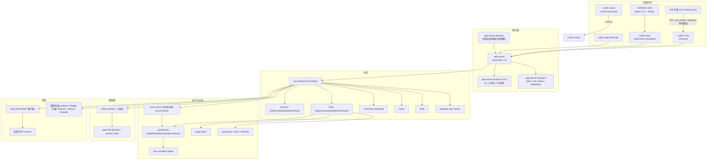
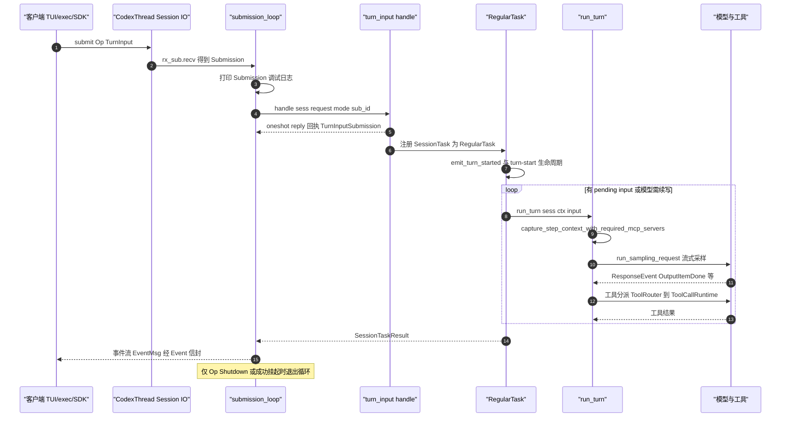
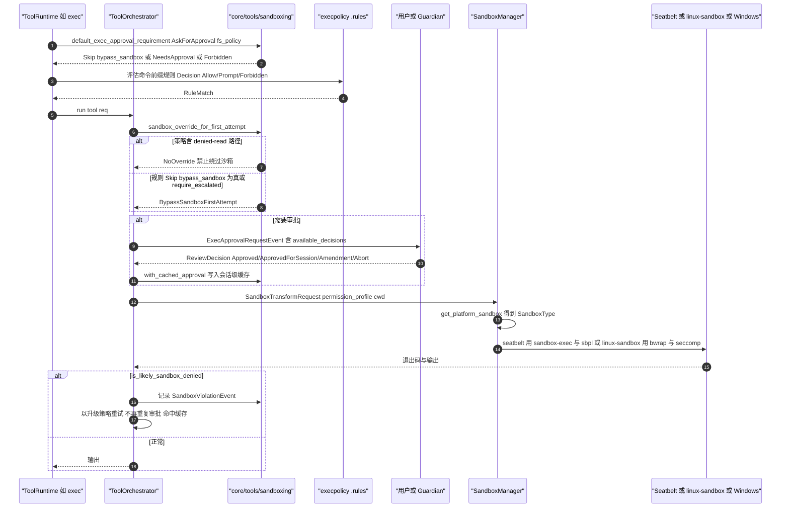
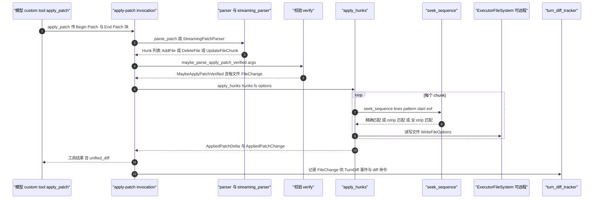

# 竞品研究 03：OpenAI Codex（`openai/codex`，Rust）

> 研究对象：`https://github.com/openai/codex`，浅克隆至 `.research-cache/openai-codex`（已 gitignore）。
> 证据基线提交：`5c5308fc9a9ee789049d646ef11e5400384b9c6f`（2026-09-20，"Add an animated Codex logo to fresh conversations and onboarding (#46752)"）。
> **证据时点（R09 补）**：代码基线 commit `5c5308f`（2026-09-20）；官方文档站本次抓取 403（§7.2 已注明），其 `[E2]` 仅限仓库内同 commit 文档。
> 研究方法：全部结论以**读到的 Rust 源码**（E1）为主；官方文档站 `developers.openai.com` 本次抓取返回 403，故 E2 仅限仓库内 `docs/*.md` 的**指针文本**；第三方资料仅作补充（E3）。
> 与 Phase A 的关系：本文只做事实采集与「采纳/改造/拒绝」建议，不修改任何 Phase A 卷册；冲突项集中写入 §8 并标注建议回改方向。

---

## 1. 结论速览（10 条，逐条带证据等级）

1. **Codex 已从「CLI 单体」演化为「app-server 内核 + 多前端外壳」的客户端-服务端架构**：`codex`（TUI）、`codex exec`（headless）、`codex app`（桌面）、IDE 扩展统一走 JSON-RPC 2.0 的 app-server；`codex exec` 直接用 `InProcessAppServerClient`，即 headless 与 TUI 共用同一套内核协议。[E1] `codex-rs/exec/src/lib.rs:1-90`、`codex-rs/cli/src/main.rs:150-240`、`codex-rs/app-server-transport/src/lib.rs:36-43`
2. **审批模式已重命名且收敛**：协议层是 `AskForApproval { UnlessTrusted("untrusted") / OnRequest(默认) / Granular(GranularApprovalConfig) / Never }`；但 **CLI 的 `-a/--approval-mode` 只暴露 `on-request` 与 `never`**；历史上的 `--full-auto` / `--auto-edit` 在源码中已完全不存在，取而代之的是 `--approve-for-me`（别名 `--not-so-yolo`，映射为 `approvals_reviewer="auto_review"` + `sandbox_mode="workspace-write"`）。[E1] `codex-rs/protocol/src/protocol.rs:986-1048`、`codex-rs/utils/cli/src/approval_mode_cli_arg.rs:1-30`、`codex-rs/utils/cli/src/shared_options.rs:37-52`；历史上的 suggest/auto-edit/full-auto 三档命名及其演进在社区讨论中可交叉印证 [E3]（见 §9.4 第 1、3、5 条链接）
3. **沙箱是「四档策略 × 五类后端」的可组合矩阵，而非三档开关**：`SandboxPolicy { DangerFullAccess / ReadOnly{network_access} / ExternalSandbox{network_access} / WorkspaceWrite{...} }` 与 `SandboxType { None / MacosSeatbelt / LinuxSeccomp / WindowsRestrictedToken / WindowsMxc }` 正交；`WritableRoot` 在可写根内**强制保留 `.codex`、`.git/hooks` 等「提权元数据路径」只读**。[E1] `codex-rs/protocol/src/protocol.rs:1068-1174`、`codex-rs/protocol/src/sandbox.rs:1-42`
4. **Linux 沙箱主体是 bubblewrap（不是 Landlock）**：`codex-linux-sandbox` 助手（同一二进制 arg0 自派发）执行 `no_new_privs` + seccomp + bubblewrap；Landlock 保留为 `--use-legacy-landlock` 兼容路径；bundled bwrap 有**摘要校验失败退出码 8**；WSL1 明确不支持 bwrap 并给专用告警。[E1] `codex-rs/linux-sandbox/src/lib.rs:1-40`、`codex-rs/sandboxing/src/landlock.rs:8-66`、`codex-rs/sandboxing/src/bwrap.rs`
5. **macOS Seatbelt 走 `/usr/bin/sandbox-exec` 硬编码绝对路径**，注释明确写「防 PATH 注入恶意 sandbox-exec」；基础策略 `.sbpl` 以 `(deny default)` 开场，并显式参考 Chrome 沙箱策略。[E1] `codex-rs/sandboxing/src/seatbelt.rs:1-52`、`codex-rs/sandboxing/src/seatbelt_base_policy.sbpl:1-20`
6. **工具执行有统一的「审批 → 选沙箱 → 尝试 → 沙箱拒绝后升级重试」编排器**：`ToolOrchestrator` 集中处理 approvals + sandbox selection + retry，并有硬约束「若策略含 denied-read 路径，则**禁止绕过沙箱执行**」（绕过会静默放开被拒读路径）。[E1] `codex-rs/core/src/tools/orchestrator.rs:1-30`、`codex-rs/core/src/tools/sandboxing.rs:233-296`
7. **并行工具调度用一把 `tokio::sync::RwLock<()>` 实现**：声明支持并行的工具取读锁（可并发），不支持并行的工具取写锁（互斥）——比自建调度器显著简单，且天然保证「非并行工具独占」。[E1] `codex-rs/core/src/tools/parallel.rs:44-64,174-185`
8. **会话持久化是「JSONL rollout + SQLite 索引」双轨**：rollout 文件名为 `rollout-<RFC3339>-<threadId>[_<rolloutId>].jsonl`，可选压缩；SQLite state DB 承载线程列表/搜索/引用索引；并有 `ThreadHistoryMode { Legacy, Paginated }` 迁移模式与 `codex migrate-rollouts`。[E1] `codex-rs/rollout/src/rollout_file_name.rs:1-50`、`codex-rs/rollout/src/lib.rs:84-85`、`codex-rs/rollout/src/policy.rs:1-60`
9. **记忆是「两阶段后台流水线 + git 基线工作区」**：Phase 1 按 rollout 并行抽取结构化记忆（含密钥脱敏、DB 租约、重试退避），Phase 2 单锁全局归并到 `~/.codex/memories/`（git 基线目录），由**受限 consolidation sub-agent**（无审批、无网络、仅本地写、禁协作）产出 `MEMORY.md` 等顶层产物。[E1] `codex-rs/memories/README.md:1-160`、`codex-rs/memories/write/src/phase1.rs`、`codex-rs/memories/write/src/phase2.rs`
10. **「作为 MCP server 被调用」这一能力在当前提交中未观测到**：`codex mcp` 子命令只有 `list/get/add/remove/login/logout`（纯客户端管理面），全仓库无 `ServerHandler` 生产实现（仅测试用）；对外集成改由 app-server（JSON-RPC）+ exec-server（远程执行）+ SDK 承担。[E1] `codex-rs/cli/src/mcp_cmd.rs:48-72`、`codex-rs/codex-mcp/src/server.rs:1-60`、全仓 grep `ServerHandler` 仅命中测试 [E4] 推断：MCP server 模式已被 app-server 协议取代

---

## 2. 产品与仓库事实

| 项 | 事实 | 证据 |
| --- | --- | --- |
| 仓库 | `github.com/openai/codex`（本仓含 CLI + 云 + SDK + 桌面） | [E1] 本地克隆 |
| 主语言 | Rust（`codex-rs/` workspace，约 140 个成员 crate） | [E1] `codex-rs/Cargo.toml:1-60` |
| 构建 | **Cargo + Bazel 双构建**（`MODULE.bazel`/`BUILD.bazel`/`defs.bzl`/`rbe.bzl`/`.bazelrc`/flake.nix），Bazel 用于 RBE 远��执行 | [E1] 仓库根目录清单、`.github/workflows/bazel.yml` |
| 许可 | Apache-2.0 | [E1] `LICENSE:1-3`、`codex-cli/package.json` 字段 `"license": "Apache-2.0"` |
| 版本 | workspace 版本占位 `0.0.0`；npm 包 `@openai/codex` 版本 `0.0.0-dev`；真实版本随 release 流水线注入 | [E1] `codex-rs/Cargo.toml:156`、`codex-cli/package.json:1-6` |
| npm 分发 | `@openai/codex`，`bin.codex → bin/codex.js` 薄壳，`engines.node >= 16` | [E1] `codex-cli/package.json:1-20` |
| 独立安装器 | `curl -fsSL https://chatgpt.com/codex/install.sh \| sh`（Windows 为 `install.ps1`）；默认下载源 `releases.openai.com/codex`，可用 `CODEX_INSTALLER_USE_RELEASES_OPENAI_COM=false` 强制回退 GitHub Releases | [E1] `README.md`（Quickstart 段） |
| SDK | `sdk/typescript`（`@openai/codex-sdk`，**spawn CLI 并以 JSONL 事件交互**）、`sdk/python`、`sdk/python-runtime` | [E1] `sdk/typescript/README.md:1-20`、`sdk/` 目录 |
| 官方文档 | 仓库 `docs/*.md` 绝大多数为**指针占位**（config/sandbox/agents_md/exec/skills/slash_commands/execpolicy/authentication/getting-started/install 均指向 `developers.openai.com`）；仅 `contributing.md`、`CLA.md`、`codex-rs/README.md`、`codex-rs/docs/protocol_v1.md`、`codex-rs/docs/bazel.md`、各 crate README 为实体内容 | [E2] `docs/` 目录逐文件阅读（官方文档文件本身）；实体内容部分 [E1] |
| 官方文档站可达性 | `developers.openai.com/codex/security` 本次 WebFetch 返回 **403 Forbidden**（未能取得内容） | [E1] 抓取工具返回 |
| 客户端形态 | TUI（终端交互）、`codex exec`（headless）、`codex app`（Electron 类桌面，含独立桌面安装器）、IDE 扩展（VS Code/Cursor/Windsurf）、Web（chatgpt.com/codex 云侧） | [E1] `README.md`、`cli/src/main.rs:150-240`、`tui/src/ide_context.rs:1-30` |

---

## 3. 架构总览

### 3.1 进程与 crate 拓扑

### 3.2 关键结构事实

- **单一二进制多角色（arg0 自派发）**：同一个 `codex` 可执行文件依据 `argv[0]`/`argv[1]` 切换为 `codex-linux-sandbox`、Windows sandbox、exec helper、fs helper、`--codex-run-as-apply-patch` 等内部模式，避免额外二进制分发。[E1] `codex-rs/arg0/src/lib.rs:95-153`
- **app-server 三种传输**：`start_stdio_connection`、`start_websocket_acceptor`、unix socket（`app-server-transport/src/transport/{stdio,unix_socket,websocket}.rs`），并有本地控制 socket 用于 shutdown。[E1] `codex-rs/app-server-transport/src/lib.rs:36-43`
- **协议类型双向导出**：`app-server-protocol` 用宏 `client_request_definitions!` 生成 `ClientRequest`，并为每个变体声明 `serialization_scope`（Global / Thread / ThreadPath / CommandExecProcess / Process / FuzzyFileSearchSession / FsWatch / McpOauth），用于**按作用域做请求串行化**；类型经 `ts_rs` 导出到 `v2/` 供 TS 客户端使用。[E1] `codex-rs/app-server-protocol/src/protocol/common.rs:129-290`
- **内核 crate 无 Spring 式框架依赖**：`protocol`、`core-api` 是纯类型/契约；`sandboxing`、`apply-patch`、`execpolicy`、`rollout` 皆为独立库，可被 core 单测直接引用。[E1] `codex-rs/Cargo.toml` 成员表 + 各 crate 目录结构

---

## 4. 24 维度逐项分析

### 4.1 进程与运行拓扑

- **客户端-服务端拆分已完成**：`Subcommand::AppServer`（`[experimental] Run the app server or related tooling`）、`Subcommand::RemoteControl`（"Manage the app-server daemon with remote control enabled"）、`Subcommand::Agents`（"Browse all agent sessions on the shared local app-server daemon"）。[E1] `codex-rs/cli/src/main.rs:150-240`
- **headless 复用了服务端**：`exec` crate 顶部注释规定「默认模式下 stdout 只写最终消息；`--json` 模式下 stdout 必须是合法 JSONL，一行一事件，其余输出走 stderr」，且内部导入 `InProcessAppServerClient` / `InProcessServerEvent` / `TypedRequestError`，即 headless 走**同进程内** app-server 客户端。[E1] `codex-rs/exec/src/lib.rs:1-90`
- **daemon 化能力**：`app-server-daemon` crate 含 `managed_install.rs`、`install_lock.rs`、`migration.rs`、`update_loop.rs`、`remote_control_client.rs`、`thread_recovery.rs`，即后台常驻 app-server 具备托管安装、迁移、更新循环与线程恢复。[E1] `codex-rs/app-server-daemon/src/`
- **IPC 协议本体**：JSON-RPC 2.0，`JSONRPC_VERSION = "2.0"`；请求体带 `id: RequestId`（string|integer）。[E1] `codex-rs/app-server-protocol/src/rpc.rs:1-30`
- **IDE 侧 IPC 不走 app-server**：TUI `/ide` 通过 unix socket / Windows 命名管道向 IDE 扩展请求上下文，Windows 侧用 `GetTokenInformation`/`TokenUser`/`EqualSid` 校验对端 SID，请求预算 5 秒，帧上限 256 MiB。[E1] `codex-rs/tui/src/ide_context/ipc.rs:1-30`、`codex-rs/tui/src/ide_context/windows_pipe.rs:1-40`

**结论**：与 Phase A 卷 01「内核/外壳分层 + 运行拓扑」判断一致，且 Codex 的实测形态验证了「headless 不另起实现，而是服务端协议的一个客户端」这一路线（详见 §8 启示 1）。

### 4.2 Agent 主循环与回合模型

- **提交队列（Submission Queue）是唯一输入入口**：`Submission { id, op: Op, trace: Option<W3cTraceContext>, parent_turn_id, root_turn_id }`，注释明确「Submission Queue Entry - requests from user」。[E1] `codex-rs/protocol/src/protocol.rs:191-216`
- **`Op` 是 `#[non_exhaustive]` 的封闭指令集**（供内核演进不破坏外部匹配），实测变体包括：`Interrupt`、`CleanBackgroundTerminals`、`RealtimeConversation*`、`TurnInput{request,mode,reply}`、`RecoverTurn`、`SuspendTurnAndShutdown`、`ThreadSettings`、`TurnSettings`、`InterAgentCommunication`、`ExecApproval`、`PatchApproval`、`ResolveElicitation`、`UserInputAnswer`、`RequestPermissionsResponse`、`DynamicToolResponse`、`RefreshMcpServers`、`ReloadUserConfig`、`Compact`、`SetThreadMemoryMode`、`Review`、`ApproveGuardianDeniedAction`、`Shutdown`、`RunUserShellCommand`。[E1] `codex-rs/protocol/src/protocol.rs:597-767`
- **`submission_loop` 是单点 dispatch**：`while let Ok(sub) = rx_sub.recv().await`，逐个 `match sub.op` 分发；仅 `Op::Shutdown` 与 `Op::SuspendTurnAndShutdown`（成功挂起时）返回 `should_exit=true` 退出循环。[E1] `codex-rs/core/src/session/handlers.rs:411-600`
- **任务层抽象**：`SessionTask` trait + `RegularTask`，`span_name() = "session_task.turn"`；`RegularTask::run` 内部 `loop { run_turn(...) }`，仅当 `sess.input_queue.has_pending_input(&sess.active_turn)` 为真且无 terminal error 才继续下一轮（即**同一次提交可展开多轮**）。[E1] `codex-rs/core/src/tasks/regular.rs:1-126`
- **回合内循环**：`core/src/session/turn.rs` 中 `loop { ... }`（第 423 行起）每轮先取 pending input（`sess.input_queue.get_pending_input`），随后 `run_hooks_and_record_inputs`、`capture_step_context_with_required_mcp_servers`、`run_sampling_request`，最后依据 `needs_follow_up = model_needs_follow_up || has_pending_input` 决定是否继续。[E1] `codex-rs/core/src/session/turn.rs:415-650`
- **三级原语**：Thread（`CodexThread`/`thread_id`）→ Turn（`TurnContext`/`turn_id`/`sub_id`）→ Item（`TurnItem`/`ResponseItem`）；`StepContext` 为「同一请求视图」快照（上下文、advertised tools、tool calls 共享）。[E1] `codex-rs/core/src/codex_thread.rs:645`、`codex-rs/core/src/session/turn.rs:458-495`

### 4.3 工具系统

- **注册与暴露分离**：`ToolRegistry`（含 `ToolExposure`，支持 `is_deferred()`）→ `ToolRouter { registry, model_visible_specs: Arc<[ToolSpec]>, tool_mode, code_mode_tool_names, tool_namespaces_info }`。[E1] `codex-rs/core/src/tools/router.rs:73-135`
- **工具 Spec 四形态**：`ToolSpec::Function | Freeform | Namespace | ToolSearch | WebSearch`；命名空间工具（如 `multi_agent_v1`）内可再含 `ResponsesApiNamespaceTool::Function/Custom`。[E1] `codex-rs/core/src/tools/router.rs:176-207`、`codex-rs/core/src/tools/handlers/multi_agents_spec.rs:91-100`
- **调用来源三通道**：`ToolCall { tool_name: ToolName(namespace,name), call_id, payload }`，`ToolPayload::Function{arguments} | Custom{input} | ToolSearch{arguments}`；`ToolCall::direct_source()` 区分 `Direct` / `DirectPlaintextMessage` / `CodeMode`。[E1] `codex-rs/core/src/tools/router.rs:36-61,244-296`
- **延迟加载**：`ToolSpec::ToolSearch` 存在时，`exposes_tool` 会额外命中 registry 中 `exposure.is_deferred()` 且带 `immutable_spec()`/`search_info()` 的工具——即「工具搜索」是发现机制而非执行机制。[E1] `codex-rs/core/src/tools/router.rs:198-207`
- **并行门控**：`Router::tool_supports_parallel(&ToolCall)` 查 registry；执行时 `Either::Left(lock.read())`（并行）vs `Either::Right(lock.write())`（独占）。[E1] `codex-rs/core/src/tools/router.rs:233-237`、`codex-rs/core/src/tools/parallel.rs:174-185`
- **内置工具族（handlers 目录实测）**：`apply_patch`、`shell`、`unified_exec`、`write_stdin`、`exec_command`、`view_image`、`plan`(update_plan)、`request_user_input`、`request_permissions`、`send_message_to_user`、`current_time`、`sleep`、`get_context_remaining`、`new_context_window`、`tool_search`、`mcp` / `mcp_resource`、`multi_agents`（v1/v2）、`dynamic`、`extension_tools`、`list_available_plugins_to_install`、`request_plugin_install`、`wait_for_environment`、`test_sync`、`code_mode/`。[E1] `codex-rs/core/src/tools/handlers/` 全目录
- **调用生命周期与遥测**：`ToolCallRuntime::handle_tool_call` 创建 `ToolCallTimingGuard`（`Drop` 也记录，防取消丢数据），`AbortOnDropHandle` 包裹 `tokio::spawn`，结束时打 `codex.tool_call` 事件（含 `dispatch_duration_ms` / `handler_duration_ms` / `total_duration_ms` / `trace_id` / `turn_id` / `call_id`）。[E1] `codex-rs/core/src/tools/parallel.rs:32-420`

### 4.4 权限与审批

- **协议层四态**（见 §1 结论 2）：`UnlessTrusted`（内部对 untrusted 项目：除显式 execpolicy 规则外一律需审批）、`OnRequest`（默认，模型自行决定何时请求）、`Granular(GranularApprovalConfig)`、`Never`。[E1] `codex-rs/protocol/src/protocol.rs:986-1048`
- **Granular 的五个开关**：`sandbox_approval`（含 `with_additional_permissions` / `require_escalated` 请求）、`rules`（execpolicy `prompt` 规则触发）、`skill_approval`（技能脚本执行）、`request_permissions`（`request_permissions` 工具）、`mcp_elicitations`（MCP elicitation 提示）。**语义是「true=允许该类审批提示；false=该类请求直接自动拒绝而非展示给用户」**。[E1] `codex-rs/protocol/src/protocol.rs:998-1048`
- **会话级审批缓存**：`ApprovalStore { map: HashMap<String, ReviewDecision> }`，键按 `serde_json::to_string(key)` 序列化；`with_cached_approval` 逻辑为「全部键都已 `ApprovedForSession` 则跳过提示；用户选 session 级批准则**逐键写入**」；apply_patch 可一次携带多个文件键。[E1] `codex-rs/core/src/tools/sandboxing.rs:40-117`
- **决策选项由服务端给全**：`ExecApprovalRequestEvent.available_decisions: Option<Vec<ReviewDecision>>`，缺省时回退 `default_available_decisions(...)`；网络类审批的默认选项是 `[Approved, ApprovedForSession, NetworkPolicyAmendment{...}, Abort]`，文件权限类为 `[Approved, Abort]`，普通命令为 `[Approved, (ApprovedExecpolicyAmendment), Abort]`。[E1] `codex-rs/protocol/src/approvals.rs:334-399`
- **审批可演化为持久策略**：`ExecPolicyAmendment { command: Vec<String> }` 的文档注释说明它将被写成 execpolicy 的 `prefix_rule(..., decision="allow")`；`NetworkPolicyAmendment { host, action }` 同理（allow/deny 主机级规则）。[E1] `codex-rs/protocol/src/approvals.rs:34-54,182-186`
- **默认审批需求推导**：`default_exec_approval_requirement(policy, fs_policy)`：`Never→false`；`OnRequest|Granular→仅当文件系统策略为 Restricted`；`UnlessTrusted→true`；若 Granular 且 `!allows_sandbox_approval()` 则返回 `Forbidden{reason}`（**自动拒绝而非提示**）。[E1] `codex-rs/core/src/tools/sandboxing.rs:190-231`
- **自动审查（Guardian）**：`ApprovalsReviewer`、`approvals_reviewer` 配置，`--approve-for-me` 会把配置改写成 `approvals_reviewer="auto_review"` + `approval_policy="on-request"` + `sandbox_mode="workspace-write"`；`GuardianAssessmentEvent` 带 `risk_level`（low/medium/high/critical）、`user_authorization`、`rationale`、`status`（in_progress/approved/denied/timed_out/aborted）、`review_reason`（Policy/FreshRequired/MissingScore/StaleScore/... 12 种）。[E1] `codex-rs/protocol/src/approvals.rs:87-258`、`codex-rs/utils/cli/src/shared_options.rs:100-115`
- **被拒后有一次性复议通道**：`Op::ApproveGuardianDeniedAction { event: GuardianAssessmentEvent }`，注释为「Record that the user approved one retry of a concrete Guardian-denied action」。[E1] `codex-rs/protocol/src/protocol.rs:750-751`

### 4.5 上下文管理（窗口预算 / 压缩 / 缓存）

- **压缩提示与令牌上限**：`prompts::SUMMARIZATION_PROMPT`、`prompts::SUMMARY_PREFIX`（压缩摘要以固定前缀注入），`COMPACT_USER_MESSAGE_MAX_TOKENS = 20_000`（压缩请求自身的用户消息上限，防止压缩调用本身溢出）。[E1] `codex-rs/core/src/compact.rs:58-60,683`
- **触发阈值来自配置**：`ConfigToml.model_auto_compact_token_limit`、`model_auto_compact_token_limit_scope`（`AutoCompactTokenLimitScope`）、`model_post_turn_compact_threshold_percent`、`model_context_window`。[E1] `codex-rs/config/src/config_toml.rs:167-181`
- **窗口基线追踪**：`AutoCompactWindow { window_number, ids: AutoCompactWindowIds{first_window_id, previous_window_id, window_id}, prefill_input_tokens: Option<AutoCompactWindowPrefill>, token_budget_reminder_delivered, auto_compact_fallback_delivered }`，注释说明 `prefill_input_tokens` 是「当前压缩窗口的绝对输入 token 基线」，用 `body_after_prefix` 相减算出真实增长，且**服务端观测值优先于估算值**（`ServerObserved` vs `Estimated`）。[E1] `codex-rs/core/src/state/auto_compact_window.rs:1-60`
- **上下文形态**：`context_manager/{history.rs, history_tests.rs, normalize.rs, updates.rs}` + `session/context_window.rs` + `core/src/context/`（含 `world_state.rs`、`GuardianContextMode`、`ContextualUserFragment`）；发请求前调用 `sess.clone_history().await.for_prompt(&model_info.input_modalities)` 做**按模型模态裁剪**。[E1] `codex-rs/core/src/session/turn.rs:513-519`、`codex-rs/core/src/context_manager/`
- **保留上下文与预算**：`RolloutItem::RetainedContext`、`session/retained_context.rs`、`session/rollout_budget.rs`、`session/token_budget.rs`；另有 `context_fragments` crate（`AnnotatedContent`、`set_annotated_content`）承载「带注解的上下文片段」。[E1] `codex-rs/rollout/src/policy.rs:20-30`、`codex-rs/core/src/compact.rs:38-43`
- **显式窗口管理工具**：`get_context_remaining`、`new_context_window` 两个内置工具 + `Op::Compact` + RPC `thread/compact/start` + `rollout/compress`。[E1] `codex-rs/core/src/tools/handlers/{get_context_remaining,new_context_window}.rs`、`codex-rs/app-server-protocol/src/protocol/common.rs:720-735`
- **缓存亲和**：`PrefillInputTokens` 双源（服务端观测 / 本地估算）+ `window_id` 序列化到 responses metadata，用于把「同一前缀窗口」的请求归组（对应提示缓存命中统计）。[E1] `codex-rs/core/src/state/auto_compact_window.rs:19-40`、`codex-rs/core/src/responses_metadata.rs`

### 4.6 提示词组织

- **提示资产按用途分模块**（`prompts` crate）：`model_instructions`（基础指令渲染）、`model_messages`（`ResolvedModelMessages` / `ResolvedCollaborationModeMessages` / `ResolvedMultiAgentMessages` / `ResolvedAutoReviewMessages`）、`permissions_instructions`（`PermissionsInstructions` / `ApprovalPromptContext`）、`multi_agent_instructions`、`compact`、`review_request`（`REVIEW_PROMPT` + `resolve_review_request`）、`update_plan_instructions`（含 `without_update_plan_instructions` 反向裁剪）、`guardian_instructions`（`GuardianClassifierInstructions` / `GuardianPolicyInstructions` / `render_guardian_rejection`）、`realtime`（`BACKEND_PROMPT`/`START_INSTRUCTIONS`/`END_INSTRUCTIONS`）。[E1] `codex-rs/prompts/src/lib.rs:1-34`
- **注入顺序的分层来源**：`agents_md.rs` 头注释写明「Project-level documentation is primarily stored in files named `AGENTS.md`」「Additional fallback filenames can be configured via `project_doc_fallback_filenames`」，且「从项目根向下到 cwd 逐级收集每个 `AGENTS.md`」，`LoadedInstructions` 同时容纳 user 级与 project 级条目（一个 environment 可贡献多份层级指令）。[E1] `codex-rs/core/src/agents_md.rs:1-60,189-300,440-545`
- **默认预算与回退名**：`DEFAULT_PROJECT_DOC_MAX_BYTES = 32 * 1024`（32 KiB，超出即截断）、`DEFAULT_AGENTS_MD_FILENAME = "AGENTS.md"`、本地覆盖优先级常量（`AGENTS.md` 的「Preferred local override」）。[E1] `codex-rs/config/src/config_toml.rs:75`、`codex-rs/core/src/agents_md.rs:42-53`
- **指令注入的开关化**：`ConfigToml.instructions`、`developer_instructions`、`include_permissions_instructions`、`include_apps_instructions`、`include_collaboration_mode_instructions`、`include_environment_context`、`model_instructions_file`（整份替换基础指令文件）。[E1] `codex-rs/config/src/config_toml.rs:239-262`
- **环境上下文注入**：`core/src/session/environment.rs`、`core/src/turn_metadata.rs`、`core/src/current_time.rs`、`core/src/session/time_reminder.rs`（当前时间提醒按需注入）、`world_state`（世界状态变化才记录）。[E1] 各文件路径 + `codex-rs/core/src/session/turn.rs:497-510`

### 4.7 MCP

- **四类传输（实为两类 + 适配器）**：配置层 `McpServerTransportConfig::Stdio { command, args, env, env_vars, cwd }` 与 `StreamableHttp { url, bearer_token_env_var, http_headers, env_http_headers, http_headers_helper }`；另有 `stdio-to-uds` crate 作为「UDS ↔ stdio 适配器」，README 明说这是「third transport」，理由是 UDS 可挂长驻进程并用 UNIX 文件权限限制访问。[E1] `codex-rs/config/src/mcp_types.rs:564-596`、`codex-rs/stdio-to-uds/README.md:1-20`
- **客户端实现**：`rmcp-client` crate，实测子模块含 `bounded_stdio_transport`、`local_stdio_transport`、`executor_process_transport`、`in_process_transport`、`streamable_http_retry`、`http_client_redirect`、`www_authenticate`、`program_resolver`、`oauth/{...}`、`oauth_client_registration`、`enterprise_oauth_login`、`ema_{auth_policy,claims,exchange,identity}`、`user_verification`、`elicitation_client_service`、`service_error`、`startup_error`。[E1] `codex-rs/rmcp-client/src/` 全目录
- **OAuth 能力面**：`config.toml` 侧 `mcp_oauth_credentials_store`（store 模式）、`mcp_oauth_callback_port`、`mcp_oauth_callback_url`、`mcp_optional_startup_grace_ms`（**可选服务器启动宽限**，即 MCP 启动失败不阻塞主会话）；注册方式支持 `AUTO|CIMD|DCR`（`--oauth-client-registration`）。[E1] `codex-rs/config/src/config_toml.rs:285-320`、`codex-rs/cli/src/mcp_cmd.rs:154-215`
- **CLI 管理面**：`codex mcp list|get|add|remove|login|logout`，支持 `--json`；`add` 支持 `--url` 或 `-- <COMMAND>...`，可带 `KEY=VALUE` 环境与 `ENV_VAR` 透传。[E1] `codex-rs/cli/src/mcp_cmd.rs:48-215`
- **服务器目录与刷新**：`codex-mcp` crate 提供 `connection_manager/`、`catalog.rs`、`tool_catalog_cache.rs`、`client_tool_catalog.rs`、`trusted_access.rs`、`pagination.rs`、`resource_client.rs`、`binding.rs`；`Op::RefreshMcpServers` 与 `Op::ResolveElicitation` 支持运行中刷新与 elicitation 应答；app-server 暴露 `mcpServerStatus/list`（返回每个已初始化 server 的 `serverCapabilities`）与 `mcpToolCall.mcpAppUi`（descriptor 的 `resourceUri` + `preferredModelDisplayMode: inline|fullscreen`）。[E1] `codex-rs/codex-mcp/src/` 全目录、`codex-rs/app-server/README.md:1-20,268-275`
- **协议版本协商**：托管 Apps HTTP MCP 默认走 Legacy，`[features] codex_apps_mcp_2026_07_28 = true` 或运行时 `experimentalFeature/enablement/set` 才探测 2026-07-28 协议，探测失败回退 Legacy；且该开关**不适用于第三方 HTTP 或本地 stdio server**。[E1] `codex-rs/app-server/README.md:34-48`
- **「Codex 作为 MCP server」**：未观测到。`McpSubcommand` 无 `serve`；全仓 `impl ServerHandler` 仅出现在测试文件；仅 `codex-mcp/src/elicitation.rs:293` 注释残留旧称「Event receivers such as codex mcp-server」。未观测到的检索词见 §10。[E1] `codex-rs/cli/src/mcp_cmd.rs:64-72`、grep `ServerHandler`/`serve_server`

### 4.8 Skill / 插件机制

- **Skill 元数据模型**：`SkillMetadata { name, description, short_description, interface: Option<SkillInterface>, dependencies: Option<SkillDependencies>, policy: Option<SkillPolicy>, path_to_skills_md, scope: SkillScope, plugin_id, remote_plugin_id }`；`SkillInterface { display_name, short_description, icon_small, icon_large, brand_color, default_prompt }`（即前端可渲染的品牌化卡片）。[E1] `codex-rs/skills/src/model.rs:1-45`、`codex-rs/protocol/src/protocol.rs:3879-3896`
- **四类作用域**：`SkillScope { User, Repo, System, Admin }`；`SkillPolicy { allow_implicit_invocation, products }`，其中 `allows_implicit_invocation()` **默认 true**（未声明即允许隐式激活），`products` 用于产品级门控（源码内有 TODO 声明「目前只解析存储、尚未在注入侧强制」）。[E1] `codex-rs/protocol/src/protocol.rs:3872-3877`、`codex-rs/skills/src/model.rs:12-57`
- **能力声明**：`SkillDependencies { tools: Vec<SkillToolDependency{ r#type, value, description, transport }> }`，与 `mcp_skill_dependencies.rs` 联动（技能的 MCP 依赖）。[E1] `codex-rs/skills/src/model.rs:58-90`、`codex-rs/core/src/mcp_skill_dependencies.rs`
- **发现与激活**：`skills` crate 拆出 `loading`（扫描）、`selection`（选择）、`mentions`（`@`/显式提及解析）、`invocation`（调用）、`name_counts`、`parser`、`interface`；对应 RPC `skills/list`、`skills/extraRoots/set`、`skills/config/write`；TUI 有 `/skills` 与 `/plugins`。[E1] `codex-rs/skills/src/` 全目录、`codex-rs/app-server-protocol/src/protocol/common.rs:877-890,1025`
- **插件系统**：`plugin` crate + `core-plugins`；RPC `plugin/install`、`plugin/uninstall`；`plugin_search/` 模块与 `MarketplaceAdd/Remove/Upgrade` RPC；插件可声明 `mcpServers`（`plugin.json` 规格文档 `references/plugin-json-spec.md` 第 66/213 行）。[E1] `codex-rs/app-server-protocol/src/protocol/common.rs:892-905,1030-1040`、`codex-rs/skills/src/assets/samples/plugin-creator/references/plugin-json-spec.md`
- **内置样例 Skill**：`skills/src/assets/samples/` 含 `skill-creator`、`openai-docs`（其 `references/codex-self-knowledge.md` 与 `mcp-diagnostics.md` 是**关于 Codex 自身用法**的文档路由技能）。[E1] `codex-rs/skills/src/assets/samples/` 目录

### 4.9 SubAgent / 多 Agent 编排

- **工具命名空间**：`MULTI_AGENT_V1_NAMESPACE = "multi_agent_v1"`，描述 "Tools for spawning and managing sub-agents."；v1/v2 两套 `spawn_agent` 规格（v2 多 `task_name` 属性）。[E1] `codex-rs/core/src/tools/handlers/multi_agents_spec.rs:15-19,91-130`
- **子代理间通信是一等协议**：`InterAgentCommunication { id, author: AgentPath, recipient: AgentPath, other_recipients, content, encrypted_content, internal_chat_message_metadata_passthrough, trigger_turn }`，可加密（`new_encrypted`），并可通过 `to_model_input_item()` 转成带 `NEW_TASK`/`MESSAGE` 标记的模型输入项；`Op::InterAgentCommunication` 使其走**正常 thread 提交流水线**并记录为 agent-message 历史。[E1] `codex-rs/protocol/src/protocol.rs:806-900`、`codex-rs/core/src/session/handlers.rs:521-528`
- **注册表与硬限制**：`AgentRegistry { active_agents: Mutex<ActiveAgents{agent_tree, thread_paths, used_agent_nicknames, nickname_reset_count}>, total_count: AtomicUsize }`，注释明确「限制每个用户会话的子代理（thread）总数」，且同一会话共享 `LocalAgentControl`；另有 `exceeds_thread_spawn_depth_limit` / `next_thread_spawn_depth`（生成深度限制）。[E1] `codex-rs/core/src/agent/registry.rs:1-50`、`codex-rs/core/src/agent/mod.rs:1-15`
- **角色系统**：`agent-roles` crate + `core/src/agent/role.rs`，`DEFAULT_ROLE_NAME = "default"`，角色可以**收窄**子代理能力但「绝不替换父会话权威」，通过投影一层 config layer 实现（`AgentRoleOverrides { developer_instructions, model, model_reasoning_effort, ... }`）；不存在的 agent type 返回 `"agent type is currently not available"`。[E1] `codex-rs/core/src/agent/role.rs:1-45`
- **状态与事件**：`AgentStatus`、`SubAgentSource`、`SubAgentActivityKind`、`codex_protocol::agent_path::AgentPath`；`SessionSource::SubAgent` 用于区分来源；TUI `/agents`（agent command center）与 `/subagents`（在本会话子代理间切换）。[E1] `codex-rs/core/src/agent/status.rs`、`codex-rs/protocol/src/agent_path.rs`、`codex-rs/tui/src/slash_command.rs:136-137`
- **模型覆盖**：`SpawnAgentToolOptions { available_models, agent_type_description, expose_agent_type, hide_agent_type_model_reasoning, expose_spawn_agent_model_overrides, multi_agent_version, usage_hint_text }`；默认子代理继承父模型，仅在需要时覆盖。[E1] `codex-rs/core/src/tools/handlers/multi_agents_spec.rs:24-45`

### 4.10 任务 / 计划 / Todo 机制

- **`update_plan` 是唯一计划工具**：`UpdatePlanArgs { explanation: Option<String>, plan: Vec<PlanItemArg{ step: String, status: StepStatus }> }`，`StepStatus { Pending, InProgress, Completed }`，`#[serde(deny_unknown_fields)]`。[E1] `codex-rs/protocol/src/plan_tool.rs:1-29`
- **工具描述内嵌约束**（原文）："Updates the task plan. Provide an optional explanation and a list of plan items, each with a step and status. **At most one step can be in_progress at a time.**"；`strict: false`，`additionalProperties: false`（`Some(false.into())`），required 仅 `plan`。[E1] `codex-rs/core/src/tools/handlers/plan_spec.rs:29-55`
- **计划以事件外泄**：`EventMsg::PlanUpdate`；提示词侧有 `prompts/update_plan_instructions.rs`（含 `without_update_plan_instructions`，用于在 Plan 模式或某些子代理中**移除**计划工具指令）。[E1] `codex-rs/protocol/src/protocol.rs`（EventMsg 变体表）、`codex-rs/prompts/src/update_plan_instructions.rs`
- **Plan 模式 ≠ Todo 工具**：`ModeKind { Plan, Default(别名 code/pair_programming/execute/custom) }`，`TUI_VISIBLE_COLLABORATION_MODES = [Default, Plan]`；`protocol/src/plan_tool.rs` 顶部注释也特意澄清「`update_plan` todo/checklist tool（**not plan mode**）」，两者是**独立的两个东西**。[E1] `codex-rs/protocol/src/config_types.rs:674-694`、`codex-rs/protocol/src/plan_tool.rs:1-2`
- **协作模式预设**：`CollaborationModeMask { name, mode, model, reasoning_effort, developer_instructions }` + `collaborationMode/list` RPC，可把「模式 + 模型 + 推理强度 + 指令」打包成预设。[E1] `codex-rs/protocol/src/config_types.rs:789-795`、`codex-rs/app-server-protocol/src/protocol/v2/collaboration_mode.rs:13-45`

### 4.11 Goal / 自治循环 / Schedule

- **Goal 是一等 RPC 实体**：`thread/goal/set`、`thread/goal/get`、`thread/goal/clear`；`ThreadGoalSetParams { thread_id, objective: Option<String>, status: Option<ThreadGoalStatus>, token_budget: Option<Option<i64>> }`（**双 Option 表示三态：缺省/显式 null/有值**，`deserialize_double_option`）。[E1] `codex-rs/app-server-protocol/src/protocol/v2/thread.rs:847-875`、`common.rs:616-627`
- **Goal 变更会广播**：`EventMsg::ThreadGoalUpdated`。[E1] `codex-rs/protocol/src/protocol.rs`（EventMsg 变体表）
- **队列即「计划性执行」**：`thread/queue/{add,list,update,delete,reorder,start}` + `EventMsg::ThreadQueueChanged` + CLI `codex queue`（"Queue a message for an existing session"）+ 内核 `session/input_queue.rs`（支持 `steered user input` 语义）。[E1] `codex-rs/app-server-protocol/src/protocol/common.rs:632-666`、`codex-rs/cli/src/main.rs:212-213`、`codex-rs/core/src/session/input_queue.rs`
- **未观测到定时/巡检调度**：全仓无 cron 表达式字段、无 `@Scheduled` 等价物；`cloud-tasks` 是**云侧异步任务**而非本地调度器。检索词见 §10。[E4] 基于 `grep -rn "cron"` 无业务命中

### 4.12 会话持久化与恢复

- **双轨存储**：JSONL rollout（`rollout` crate）+ SQLite state DB（`state` crate / `rollout/src/state_db.rs`）；子目录 `SESSIONS_SUBDIR = "sessions"`、`ARCHIVED_SESSIONS_SUBDIR = "archived_sessions"`。[E1] `codex-rs/rollout/src/lib.rs:84-85`
- **文件命名即元数据**：`rollout-<YYYY-MM-DDThh:mm:ss>-<threadId>.jsonl`；**revert 过的线程**追加 `_<rolloutId>` 变体（`thread_id.split_once('_')` 回退为二者相同），即「同一 thread 可有多个 rollout 片段」。[E1] `codex-rs/rollout/src/rollout_file_name.rs:1-50`
- **持久化白名单策略**：`is_persisted_rollout_item` 决定哪些项落盘（`ResponseItem` 逐类型过滤、`EventMsg` 依 `ThreadHistoryMode` 过滤、`RealtimeItem` 仅 Paginated 模式持久化），并**总是持久化** `Compacted` / `TurnContext` / `TokenUsageRecord` / `WorldState` / `RetainedContext` / `SecurityRiskScore` / `SessionMeta`（注释理由：「Persist Codex executive markers so we can analyze flows (e.g., compaction, API turns)」）。[E1] `codex-rs/rollout/src/policy.rs:1-60`
- **高效逆序扫描**：`reverse_jsonl_scanner.rs` + `seekable_reader.rs` + `ordinal.rs`，用于「只读尾部」的 list/search 与分页；`rollout_reference_index.rs`、`session_index.rs`、`sqlite_metrics.rs` 支撑索引。另有 `compression.rs`（rollout 压缩）与 `maintenance.rs`（保留策略）。[E1] `codex-rs/rollout/src/` 全目录
- **历史模式迁移**：`ThreadHistoryMode { Legacy, Paginated }`（默认 Legacy），`ThreadHistoryMode::from_str` 支持 `legacy|paginated`；CLI 有 `codex migrate-rollouts`（"Inspect or migrate legacy local sessions to paginated thread history"）。[E1] `codex-rs/protocol/src/protocol.rs:776-804`、`codex-rs/cli/src/main.rs:221-222`
- **恢复类操作面**：`codex resume`（picker / `--last`）、`codex fork`、`codex archive/delete/unarchive`、`Op::RecoverTurn`（"Resume an interrupted regular turn"）、`Op::SuspendTurnAndShutdown`（成功挂起后退出循环，注释强调「exit only after history is durable and its writer has closed」）、`thread/revert`、`thread/rollout/compress`、`app-server-daemon/thread_recovery.rs`。[E1] `codex-rs/cli/src/main.rs:209-228`、`codex-rs/core/src/session/handlers.rs:480-507`、`codex-rs/app-server-daemon/src/thread_recovery.rs`
- **回滚追踪**：`EventMsg::TurnDiff` / `PatchApplyUpdated` + `ThreadRolledBack` + `turn_diff_tracker.rs`；`thread/revert` RPC。[E1] `codex-rs/protocol/src/protocol.rs`、`codex-rs/core/src/turn_diff_tracker.rs`

### 4.13 事件与可观测

- **事件信封**：`Event { id: String(对应 Submission id), msg: EventMsg }`；`EventMsg` 实测 **83 个变体**，分组为：错误/警告（`Error`、`Warning`、`GuardianWarning`、`StreamError`）、认证（`AuthRecoveryStarted/Completed`）、模型侧（`ModelReroute`、`ModelVerification`、`TurnModerationMetadata`、`SafetyBuffering`）、上下文（`ContextCompacted`、`ThreadRolledBack`、`TokenCount`、`ThreadGoalUpdated`、`ThreadQueueChanged`）、回合（`TurnStarted`、`TurnComplete`、`TurnAborted`、`ShutdownComplete`、`ThreadSettingsApplied`）、消息项（`AgentMessage`、`UserMessage`、`AgentReasoning`、`AgentReasoningRawContent`、`AgentReasoningSectionBreak`）、会话（`SessionConfigured`、`EnvironmentConnected/Disconnected`）、MCP（`McpStartupUpdate/Complete`、`McpToolCallBegin/End`、`ElicitationRequest`）、工具（`ExecCommandBegin/OutputDelta/End`、`TerminalInteraction`、`PatchApplyBegin/Updated/End`、`ViewImageToolCall`、`ImageGenerationBegin/End`、`WebSearchBegin/End`、`DynamicToolCallRequest/Response`）、审批（`ExecApprovalRequest`、`ApplyPatchApprovalRequest`、`RequestPermissions`、`RequestUserInput`、`GuardianAssessment`）、其他（`PlanUpdate`、`DeprecationNotice`、`TurnDiff`、`RealtimeConversation*`）。[E1] `codex-rs/protocol/src/protocol.rs:1358+`
- **W3C 追踪上下文跨进程传递**：`Submission.trace: Option<W3cTraceContext { traceparent, tracestate }`，注释「Optional W3C trace carrier propagated across async submission handoffs」。[E1] `codex-rs/protocol/src/protocol.rs:198-216`
- **OTel 集成**：`codex-otel` 提供 `OtelProvider`（log/trace/metric 三 exporter）、`SessionTelemetry`（会话级业务事件）、`metrics` 低层 API、`trace_context` 助手；`OtelSettings { environment, service_name, service_version, codex_home, exporter, trace_exporter, metrics_exporter, runtime_metrics, span_attributes, tracestate }`；`[otel.span_attributes]` 支持配置化 span 属性。[E1] `codex-rs/otel/README.md:1-60`、`codex-rs/otel/src/config.rs:1-70`
- **默认遥测出口是 Statsig OTLP**：`STATSIG_OTLP_HTTP_ENDPOINT = "https://ab.chatgpt.com/otlp/v1/metrics"` + `statsig-api-key` 头 + 硬编码 client key；**debug 构建自动降级为 `OtelExporter::None`**（注释：避免本地开发/test 产生 best-effort 流量）。[E1] `codex-rs/otel/src/config.rs:1-35`
- **指标与结构化日志实例**：`codex.approval.requested` 计数器（标签 `tool`、`approved`）；`codex.tool_call` info 日志（`trace_id`/`conversation.id`/`turn_id`/`tool_name`/`call_id`/`tool_source`/`execution_started`/三类耗时）。[E1] `codex-rs/core/src/tools/sandboxing.rs:100-108`、`codex-rs/core/src/tools/parallel.rs:378-400`
- **其他观测面**：`analytics` crate（`events.rs`、`facts.rs`、`reducer.rs`、`analytics_capture.rs`、`thread_hint.rs`）、`rollout-trace` crate（`InferenceTraceContext`）、`core/src/otel_init.rs`、`core/src/telemetry`、`core/src/tool_dispatch_trace.rs`。[E1] 各路径

### 4.14 Hooks / 生命周期扩展点

- **12 个钩子事件**：`HookEventName { PreToolUse, PermissionRequest, PostToolUse, PreCompact, PostCompact, SessionStart, SessionEnd, UserPromptSubmit, SubagentStart, SubagentStop, Stop, Interrupt }`，并有 `hook_event_key_label` 映射为 snake_case 字符串（如 `pre_tool_use`）供配置使用。[E1] `codex-rs/protocol/src/protocol.rs:1579-1592`、`codex-rs/hooks/src/lib.rs:95-108`
- **四种处理器形态**：`HookHandlerType { Command, McpTool, Prompt, Agent }`——注意 `Agent` 型处理器意味着**钩子可以拉起一个子代理**。[E1] `codex-rs/protocol/src/protocol.rs:1594-1601`
- **执行模式与作用域**：`HookExecutionMode { Sync, Async }`、`HookScope { Thread, Turn }`、`HookSource { System, User, Project, Mdm, SessionFlags }`。[E1] `codex-rs/protocol/src/protocol.rs:1603-1624`
- **强/弱信任模型**：`requirements.toml` 顶层 `allow_managed_hooks_only = true` 可**忽略 user/project/session 层钩子**、只允许 managed（requirements + managed config 层）钩子，且注释明确「putting it in `config.toml` does not enable managed-hooks-only mode」；CLI 侧 `--dangerously-bypass-hook-trust`（"Run enabled hooks without requiring persisted hook trust for this invocation"，并会在 config 中产生明确的启用提示文案）。[E2] `docs/config.md:9-16`（官方文档文件）；[E1] `codex-rs/utils/cli/src/shared_options.rs:63-66`、`codex-rs/core/src/config/mod.rs:3290`
- **钩子实现**：`hooks` crate 含 `engine/`、`events/{pre_tool_use, post_tool_use, session_start, user_prompt_submit}`、`config_rules.rs`、`declarations.rs`、`registry.rs`、`schema.rs`、`output_spill.rs`（钩子输出外溢到文件，避免污染上下文）、`mcp.rs`（MCP 型钩子）、`legacy_notify.rs`；`core/src/hook_runtime.rs` + `hook_mcp_executor.rs` 负责执行与结果回收（`run_pre_compact_hooks` / `run_post_compact_hooks` / `run_permission_request_hooks` / `drain_async_hook_results`）。[E1] `codex-rs/hooks/src/`、`codex-rs/core/src/hook_runtime.rs`
- **钩子可阻断审批**：`codex_hooks::PermissionRequestDecision` 被 `tools/approvals.rs` 引用，即权限请求阶段存在钩子判定。[E1] `codex-rs/core/src/tools/approvals.rs:24`

### 4.15 沙箱与安全执行

- **策略枚举**（§1 结论 3）：`SandboxPolicy::WorkspaceWrite { writable_roots, network_access, exclude_tmpdir_env_var, exclude_slash_tmp }`——注意「**可写根**」与「**网络**」是两个独立维度，且允许显式排除 `TMPDIR`/`/tmp`。[E1] `codex-rs/protocol/src/protocol.rs:1068-1120`
- **提权元数据保护**：`WritableRoot { root, read_only_subpaths, protected_metadata_names }`，`is_path_writable` 先查是否在 root 下、再查是否落在 read-only 子路径、最后查**首层组件名是否命中受保护元数据名**（注释举例 `.codex`、`.git`，特别是 `.git/hooks`），理由是「folders containing files that could be modified to escalate the privileges of the agent」。[E1] `codex-rs/protocol/src/protocol.rs:1122-1174`
- **后端选择**：`get_platform_sandbox(windows_sandbox_enabled)` → macOS `MacosSeatbelt` / Linux `LinuxSeccomp` / Windows 视开关 `WindowsRestrictedToken` 或 `None` / 其他 `None`；`SandboxType::as_metric_tag()` 输出 `seatbelt|seccomp|windows_sandbox|windows_mxc|none`；`effective_windows_sandbox_type` 处理 MXC 与 legacy level 的优先级。[E1] `codex-rs/sandboxing/src/manager.rs:48-62`、`codex-rs/protocol/src/sandbox.rs:10-42`
- **macOS Seatbelt**：四个 `.sbpl` 资源内嵌（base / network / preferences / read-only platform defaults）；基础策略 `(deny default)` 起步、允许 `process-exec`/`process-fork`/`signal(target same-sandbox)`/`process-info*`，仅允许写 `/dev/null`（`vnode-type CHARACTER-DEVICE`），并按白名单放行 sysctl（注释说明 CPU 指纹相关的 sysctl 比 Chrome 放得更松，「mostly for fingerprinting concerns which isn't an issue for codex」）。可执行文件路径硬编码 `/usr/bin/sandbox-exec`（防 PATH 注入）。[E1] `codex-rs/sandboxing/src/seatbelt.rs:1-52`、`codex-rs/sandboxing/src/seatbelt_base_policy.sbpl:1-50`
- **Seatbelt 守护进程模式**：`seatbelt_daemon.rs` + `seatbelt_daemon_socket_tests.rs` + `MacosSeatbeltProfile { Process, FileSystemHelper }`，即存在**常驻沙箱侧进程**以降低每次 spawn 的 sandbox-exec 开销。[E1] `codex-rs/sandboxing/src/seatbelt.rs:33-40`、`codex-rs/sandboxing/src/` 目录
- **Linux**：`codex-linux-sandbox` 助手 = `no_new_privs` + seccomp + bubblewrap；`create_linux_sandbox_command_args_for_permission_profile` 把 `PermissionProfile` 序列化为 JSON 传入助手（参数 `--sandbox-policy-cwd`、`--command-cwd`、`--permission-profile`、可选 `--use-legacy-landlock`、可选 `--managed-network <JSON>`）；`CODEX_LINUX_SANDBOX_ARG0 = "codex-linux-sandbox"`；`bundled_bwrap` 摘要校验失败退出码 `8`；`WSL1_BWRAP_WARNING` 提示 WSL1 不支持 bubblewrap。[E1] `codex-rs/sandboxing/src/landlock.rs:1-66`、`codex-rs/linux-sandbox/src/lib.rs:1-40`
- **网络策略**：`NetworkAccess { Restricted(默认), Enabled }`；托管网络走 MITM 代理，需要把 CA 信任包路径加入可读根（`with_managed_mitm_ca_readable_root`）；`PROXY_URL_ENV_KEYS`、`has_proxy_url_env_vars`、`proxy_url_env_value` 用于把代理 URL 注入子进程环境；本地回环主机（`localhost`/`127.0.0.1`/`::1`）在 seatbelt 网络策略中被单独对待。[E1] `codex-rs/sandboxing/src/manager.rs:64-78`、`codex-rs/sandboxing/src/seatbelt.rs:1-20,52-60`
- **审批绕过防护（最重要的安全不变式）**：`unsandboxed_execution_allowed(fs_policy)` 定义为 `!fs_policy.has_denied_read_restrictions()`；`sandbox_override_for_first_attempt` 在该函数为 false 时**强制 `NoOverride`**（即即使规则允许或用户显式提权也不能脱离沙箱）；`sandbox_permissions_preserving_denied_reads` 在同样条件下把 `RequireEscalated` 降级为 `UseDefault`。注释理由：「Denied reads only exist inside the sandbox. If a policy contains any denied-read paths, bypassing the sandbox would silently grant those reads」。[E1] `codex-rs/core/src/tools/sandboxing.rs:239-307`
- **违规记录**：`record_filesystem_sandbox_violation` / `record_network_sandbox_violation` / `SandboxViolationEvent` / `SandboxViolationBackend` / `FileSystemSandboxViolationReason`；`is_likely_sandbox_denied` / `is_likely_executor_managed_sandbox_denied` 用于把「沙箱拒绝」与普通失败区分并触发升级重试。[E1] `codex-rs/sandboxing/src/violation.rs`、`codex-rs/sandboxing/src/denial.rs`
- **execpolicy（命令前缀策略 DSL）**：`.rules` 文件（Starlark 风格解析，`PolicyParser` 提供 `prefix_rule(pattern, decision=..., match=..., not_match=..., justification=...)`）；`Decision { Allow, Prompt, Forbidden }`；`PatternToken::Single | Alts`；匹配结果是 `RuleMatch::PrefixRuleMatch { matched_prefix, decision, resolved_program, justification } | HeuristicsRuleMatch { command, decision }`；默认策略文件 `default.rules`，按 config layer **从低到高优先级叠加**；`--ignore-rules` 可禁用；另有 `amend.rs` 支持把审批结果**追加回**规则（`blocking_append_allow_prefix_rule`、`blocking_append_network_rule`）。[E1] `codex-rs/execpolicy/src/{rule.rs,decision.rs,parser.rs,amend.rs}`、`codex-rs/core/src/exec_policy.rs:53-56,665,868,1166`
- **环境变量脱敏**：`ShellEnvironmentPolicyToml { inherit, ignore_default_excludes, exclude, r#set, include_only, filters, experimental_use_profile }`；默认排除模式为 `"*KEY*"`、`"*SECRET*"`、`"*TOKEN*"`（由 `ignore_default_excludes` 开关，默认开启排除），`filters` 是键控新格式、legacy 数组仍兼容。[E1] `codex-rs/protocol/src/config_types.rs:235-250`、`codex-rs/config/src/shell_environment_policy.rs:1-60`

### 4.16 工作区 / 远程执行

- **Environment 是一等公民**：`TurnEnvironmentSelection { environment_id, cwd: PathUri, workspace_roots: Vec<PathUri>, config: EnvironmentConfigState }`、`TurnEnvironmentSelections { legacy_fallback_cwd, environments }`，即**一个 turn 可同时面向多个环境**，且 cwd 用 `PathUri` 而非本地 `PathBuf`（可为远程路径）。[E1] `codex-rs/protocol/src/protocol.rs:150-178`
- **远程执行走 WebSocket exec-server**：RPC `environment/add { environment_id, exec_server_url, connect_timeout_ms }`、`environment/info`；事件 `EnvironmentConnected`/`EnvironmentDisconnected`；`ExecApprovalRequestEvent` 带 `environmentId`（同时兼容 `environment_id` 别名）。[E1] `codex-rs/app-server-protocol/src/protocol/v2/environment.rs:37-70`、`codex-rs/protocol/src/approvals.rs:299-308`
- **exec-server 能力**：本地/远程统一 `ExecutorFileSystem`（`ReadFileOptions` / `WriteFileOptions` / `CreateDirectoryOptions` / `RemoveOptions` / `GetMetadataOptions`）、`remote_process.rs`、`remote_file_system.rs`、`remote_file_stream.rs`、`capability_discovery.rs`（+ 缓存）、`environment_bootstrap.rs`、`environment_registry.rs`、`sandbox_selection.rs`、`process_telemetry.rs`、`websocket_pong_watchdog.rs`（心跳看门狗）、`noise_relay/`（噪声中继，推测用于隐藏流量特征）。[E1] `codex-rs/exec-server/src/` 全目录
- **`apply-patch` 依赖 exec-server 的文件系统抽象**：`ApplyPatchFileUpdate` 通过 `ExecutorFileSystem` 执行而非直接 `std::fs`，因此**补丁可应用于远程环境**。[E1] `codex-rs/apply-patch/src/lib.rs:12-22`
- **路径抽象**：`PathUri` / `LegacyAppPathString` / `PathConvention` / `PathBufExt`（`codex-utils-path-uri`），用于在「本机路径」和「远端 URI」之间保持类型区分。[E1] 多文件 import 与 `codex-rs/utils/` 目录
- **本地工作区配置**：`--cd/-C`（工作根）、`--add-dir`（额外可写目录）、`--worktree`、`--skip-git-repo-check`、`inject`（`session/inject.rs` 上下文注入）。[E1] `codex-rs/utils/cli/src/shared_options.rs:68-79`、`codex-rs/exec/src/cli.rs:31-33`

### 4.17 Git 与 worktree 集成

- **worktree 是一等命令面**：`worktree` crate 导出 `ManagedWorktree { root, cwd, source_root, source_cwd, head_sha, branch }`（`branch: Option<String>`，注释说明「absence does not imply detached HEAD」）；CLI `--worktree` 标志；TUI `/worktree`（"start or continue a conversation in a new worktree"）。[E1] `codex-rs/worktree/src/lib.rs:1-45`、`codex-rs/utils/cli/src/shared_options.rs:75-77`、`codex-rs/tui/src/slash_command.rs:103`
- **与桌面端共享分配根**：`WorktreeSettings { root, auto_cleanup_enabled, keep_count }`，`DEFAULT_WORKTREE_KEEP_COUNT = 15`，设置键位于 `[desktop]` 段（`git-worktree-root`、`worktree-auto-cleanup-enabled`、`worktree-keep-count`）；`for_cli()` 明确「Shares Desktop's allocation root while leaving CLI cleanup disabled」。[E1] `codex-rs/worktree/src/settings.rs:1-40`
- **目录分配与回收**：`paths.rs`（`allocate_worktree_root`、`remove_empty_bucket`）、`metadata.rs`、`git.rs`（`GitOperation`、`git_output`、`git_stdout`、`git_path_from_bytes`、`default_worktree_base`）。[E1] `codex-rs/worktree/src/` 全目录
- **改动追踪与回退**：`turn_diff_tracker.rs`（+ tests）、`EventMsg::TurnDiff` / `PatchApplyBegin|Updated|End` / `ThreadRolledBack`、RPC `thread/revert`、`codex apply`（"Apply the latest diff produced by Codex agent as a `git apply` to your local working tree"，别名 `a`）、`codex cloud apply`。[E1] `codex-rs/core/src/turn_diff_tracker.rs`、`codex-rs/cli/src/main.rs:205-207,230-232`
- **Git 元数据入会话上下文**：`SessionMeta` 含 git 信息（`codex_git_utils::collect_git_info` / `get_git_repo_root`），`rollout` 写入时会调用。[E1] `codex-rs/rollout/src/recorder.rs:1-80`、`codex-rs/git-utils/`

### 4.18 记忆 / 知识库

- **触发条件与范围**（原文）：根会话启动时触发，且需满足「非 ephemeral、memory 功能开启、**非子代理会话**、state DB 可用」；异步后台执行 Phase 1 → Phase 2。[E1] `codex-rs/memories/README.md:28-40`
- **Phase 1（按 rollout 抽取）**：从 state DB「startup claim」合格 rollout（来源白名单、年龄窗口、**空闲足够久**避免总结活跃会话、未被其他 worker 认领、受扫描/认领上限约束）；过滤出记忆相关 response item；**并行**送模型（有并发上限），期望结构化输出 `raw_memory` + `rollout_summary` + 可选 `rollout_slug`；**对生成的记忆字段做密钥脱敏**；成功后写回 state DB 为 stage-1 输出。DB 侧租约 + 失败重试退避；结局枚举 `succeeded` / `succeeded_no_output` / `failed`。[E1] `codex-rs/memories/README.md:42-68`
- **Phase 2（全局归并）**：先抢**单一全局锁**；按选择规则加载有界 stage-1 输入（忽略 `last_usage` 超出 `max_unused_days` 的；无 `last_usage` 回退 `generated_at`；先按 `usage_count` 再按最近使用/生成时间排序）；同步 `raw_memories.md`（按 thread-id 升序稳定排序，避免排名抖动）与 `rollout_summaries/`；**memory 根目录本身是 git 基线目录**（`~/.codex/memories/.git`，由 `codex-git-utils` 初始化）；产出 `phase2_workspace_diff.md` 作为工作区 diff；若工作区无变化则直接成功退出。[E1] `codex-rs/memories/README.md:70-110`
- **归并子代理的沙箱约束**：当工作区有变化时启动**内部 consolidation sub-agent**，并以「no approvals, no network, and local write access only」运行，且**禁用 collab 防止递归委派**；期间对全局 job 租约做心跳；成功后重置 memory git 基线，并**先删除 diff 文件**以免被删内容残留在提示工件或不可达 git 对象中。[E1] `codex-rs/memories/README.md:110-122`
- **水位线语义**：全局 phase-2 锁**不用 DB 水位线判脏**（由 git 工作区脏判定），水位线仅作簿记；成功时取「已认领水位线」与「实际加载输入的最新 `source_updated_at`」的 max 作为完成水位线，避免水位线倒退。[E1] `codex-rs/memories/README.md:139-155`
- **读路径与引用**：`memories/read` 负责「memory developer-instruction 注入、memory 引用解析（citation parsing）、读取使用量遥测分类」；`memories/read/templates/memories/read_path.md` 是运行时模板；协议侧 `memory_citation.rs`、`memory_version.rs`。[E1] `codex-rs/memories/README.md:8-20`、`codex-rs/protocol/src/{memory_citation,memory_version}.rs`
- **控制面**：`thread/memoryMode/set`（`ThreadMemoryMode { Enabled, Disabled }`，明示「persists thread-level memory mode metadata without involving the model」）、`memory/status`、`memory/reset`；TUI `/memories`（"configure memory use and generation"）。[E1] `codex-rs/app-server-protocol/src/protocol/common.rs:701-715`、`codex-rs/protocol/src/protocol.rs:769-774`
- **知识库/检索**：未观测到向量库依赖。可见的是 `file-search` crate（模糊/文件名检索，对应 RPC `fuzzyFileSearch` 相关的 `FuzzyFileSearchSession` scope）、`file-watcher`、`thread/search`、`thread/searchOccurrences`、`mention_syntax.rs`（`@` 提及语法）；`openai-docs` skill 承担「外部文档检索」角色。检索词见 §10。[E1] `codex-rs/{file-search,file-watcher}`、`codex-rs/core/src/mention_syntax.rs`

### 4.19 A2A / 被集成能力

- **对外集成协议 = app-server JSON-RPC（v1 与 v2 并存）**：`app-server-protocol/src/protocol/{v1.rs, v2/}`；`codex-rs/docs/protocol_v1.md` 是唯一的协议文档实体文件；`Initialize`、`thread/*`、`turn/*`、`review/start`、`fs/watch`、`process/*`、`command/exec` 等 100+ 方法（§5.4 抽样），并生成 TS 类型供前端消费。[E1] `codex-rs/app-server-protocol/src/protocol/common.rs:507-1201`
- **SDK 是「CLI 包装 + JSONL 事件流」而非 HTTP 客户端**：TS SDK README 原文「The TypeScript SDK wraps the `codex` CLI from `@openai/codex`. It spawns the CLI and exchanges JSONL events over stdin/stdout.」；API 形态为 `new Codex()` → `startThread()` → `thread.run(prompt)` / `runStreamed(prompt)`，事件类型如 `item.completed`、`turn.completed`（含 `usage`）。[E1] `sdk/typescript/README.md:1-60`
- **headless 契约（stdout 纯净性）**：`codex exec` 默认模式「stdout 只写最终消息」，`--json` 模式「stdout 必须是合法 JSONL，一行一事件，其余输出走 stderr」，并在 crate 级 `#![deny(clippy::print_stdout)]` 强制。[E1] `codex-rs/exec/src/lib.rs:1-7`
- **结构化输出约束**：`--output-schema <FILE>`（JSON Schema 描述模型最终响应形状）、`-o/--output-last-message <FILE>`（最后一条消息落盘）。[E1] `codex-rs/exec/src/cli.rs:47-74`
- **远程控制（配对）**：RPC `remoteControl/{enable,disable,status/read,pairing/start,pairing/status,client/list,client/revoke}` + CLI `codex remote-control` + `app-server-daemon/remote_control_client.rs` + `app-server-transport/transport/remote_control/`，即**本地 app-server 可被远端受控客户端配对接管**。[E1] `codex-rs/app-server-protocol/src/protocol/common.rs:1137-1176`、`codex-rs/cli/src/main.rs:179-180`
- **云端任务面**：`cloud-tasks` crate + `codex cloud` CLI（`exec`/`status`/`list`/`apply`/`diff`）+ `cloud-tasks-client` / `cloud-tasks-mock-client`，即**本地 CLI 可提交/查看/应用云端任务 diff**。[E1] `codex-rs/cloud-tasks/src/cli.rs:1-35`、`codex-rs/cli/src/main.rs:230-232`
- **MCP server 暴露**：未观测到（见 §4.7）。

### 4.20 客户端形态与交互细节

- **TUI 子模块规模可观**：`chatwidget/`、`bottom_pane/`（含 `chat_composer/`）、`keymap/`、`keymap_setup/`、`markdown_render/`、`inline_visualization/`、`pager_overlay/`、`history_cell/`、`exec_cell/`、`status_indicator_widget/`、`streaming/`、`notifications/`、`onboarding/`、`resume_picker/`、`app_backtrack/`、`custom_terminal/`、`public_widgets/`、`pets/`（终端宠物）、`empty_state_animation/`。[E1] `codex-rs/tui/src/` 目录
- **斜杠命令实测 ≥56 条**（含 `/init` 生成 AGENTS.md、`/compact`、`/recap`、`/review`、`/fork`、`/worktree`、`/import`（"import setup, this project, and recent chats from Claude Code"）、`/hooks`、`/daemon`、`/warnings`、`/usage`、`/debug-config`、`/statusline`、`/title`、`/theme`、`/pets`、`/ps`、`/stop`、`/plan`、`/voice`、`/goal`、`/agents`、`/subagents`、`/permissions`、`/keymap`、`/vim`、`/elevate-sandbox`、`/experimental`、`/auto-review`、`/memories`、`/mcp`、`/apps`、`/plugins`、`/rollout`、`/export`、`/raw`、`/diff`、`/mention`、`/skills`、`/cd`、`/pwd`、`/model`、`/app`（"continue this session in the Desktop app"））。[E1] `codex-rs/tui/src/slash_command.rs:85-155`
- **键盘与可访问性细节**：`keymap/` + `keymap_setup/` 支持重映射；`/vim` 切换 composer 的 Vim 模式；`/raw` 切换「copy-friendly terminal selection」滚动回放模式；`/statusline`、`/title` 可配置状态行与终端标题项。[E1] `codex-rs/tui/src/slash_command.rs:121-143`
- **IDE 上下文注入**：`IdeContext { active_file: Option<ActiveFile{ descriptor, selection, active_selection_content }>, open_tabs: Vec<FileDescriptor> }`，由 `apply_ide_context_to_user_input` 合入用户输入；错误文案区分「未安装扩展」与「扩展未提供上下文」，并承诺「Codex will keep trying on future messages」。[E1] `codex-rs/tui/src/ide_context.rs:1-35`、`codex-rs/tui/src/ide_context/prompt.rs`
- **桌面端**：`codex app`（"Launch the Desktop app (opens the app installer if missing)"）；`cli/src/desktop_app/`、`cli/src/doctor/desktop.rs`；桌面端共享 worktree 分配根与 `[desktop]` 配置段。[E1] `codex-rs/cli/src/main.rs:182-184`、`codex-rs/worktree/src/settings.rs:1-40`
- **会话浏览**：`codex agents`（"Browse all agent sessions on the shared local app-server daemon"）。[E1] `codex-rs/cli/src/main.rs:151-152`

### 4.21 配置面与层级

- **`config.toml` 面积极大**：`ConfigToml` 实测 ≥200 个字段，含 `model`/`review_model`/`model_provider`/`model_context_window`/`model_auto_compact_token_limit`/`approval_policy`/`approvals_reviewer`/`auto_review`/`sandbox_mode`/`sandbox_workspace_write`/`default_permissions`/`permissions`/`shell_environment_policy`/`allow_login_shell`/`notify`/`instructions`/`developer_instructions`/`include_*`/`model_instructions_file`/`compact_prompt`/`mcp_servers`/`mcp_enterprise_managed_auth`/`mcp_oauth_credentials_store`/`model_providers`/`project_doc_max_bytes`/`project_doc_fallback_filenames`/`tool_output_token_limit`/`background_terminal_max_timeout`/`thread_unload_delay_secs`/`profiles`/`history`/`sqlite_home`/`log_dir`/`tui`/`apps`/`plugins`/`skills`/`hooks`/`otel` 等。[E1] `codex-rs/config/src/config_toml.rs:157-460+`
- **层级与优先级显式编号**（`ConfigLayerSource::precedence()`）：`PackagedDefaults(-10) < Mdm(0) < System(10) < EnterpriseManaged(15) < User(20) < User+profile(21) < Project(25) < SessionFlags(30) < LegacyManagedConfigTomlFromFile(40) < LegacyManagedConfigTomlFromMdm(50)`；`PartialOrd` 按 precedence 比较，注释明确「higher precedence overrides lower」。[E1] `codex-rs/config/src/config_layer_source.rs:1-60`
- **三种用户级覆盖入口**：`--profile/-p`（层叠 `$CODEX_HOME/<name>.config.toml`，注释原文「Layer $CODEX_HOME/<name>.config.toml on top of the base user config」）、`-c key=value`（`CliConfigOverrides`）、`--ignore-user-config`（不加载 `$CODEX_HOME/config.toml`，但 auth 仍用 `CODEX_HOME`）。[E1] `codex-rs/utils/cli/src/shared_options.rs:28-36`、`codex-rs/exec/src/cli.rs:39-41`
- **企业约束面 `requirements.toml`**：`ConfigRequirementsToml` 由系统 `requirements.toml` 或 MDM 基座反序列化；含 exec policy 要求（`requirements_exec_policy.rs`）、权限约束（`filesystem_constraints.rs`、`browser_computer_use_requirements.rs`）、模型 provider 要求（`model_provider_requirements.rs`）、MCP 要求（`mcp_requirements.rs`）、`allow_managed_hooks_only`；`Constraint<T>` 抽象用于表达「可被要求限定的值」。另有 `cloud_config_bundle.rs`（企业云下发的配置包）。[E1] `codex-rs/config/src/config_requirements.rs:1024,1448`、`codex-rs/config/src/` 目录
- **配置可诊断**：`/debug-config`（"show config layers and requirement sources for debugging"）、`--strict-config`（遇到未知字段直接报错）、`strict_config.rs` 与 `fingerprint.rs`（配置指纹）。[E1] `codex-rs/tui/src/slash_command.rs:120`、`codex-rs/exec/src/cli.rs:20-22`、`codex-rs/config/src/{strict_config.rs,fingerprint.rs}`
- **状态与密钥存储**：`sqlite_home`、`log_dir`、`auth_keyring.rs`（凭据走 OS keyring）、`AuthCredentialsStoreMode`、`OAuthCredentialsStoreMode`。[E1] `codex-rs/config/src/config_toml.rs:352-368`、`codex-rs/core/src/config/auth_keyring.rs`

### 4.22 更新 / 分发 / 遥测 / 许可

- **许可**：Apache-2.0（`LICENSE`）；`docs/license.md` 与 `docs/CLA.md`（贡献者许可协议）说明贡献政策。[E1] `LICENSE:1-3`、`docs/CLA.md`
- **分发通道**：npm 包薄壳 + 独立安装脚本（`chatgpt.com/codex/install.sh` / `install.ps1`）；安装器默认从 `releases.openai.com` 拉取，失败回退 GitHub Releases，且可用 `CODEX_INSTALLER_USE_RELEASES_OPENAI_COM=false` 强制走 GitHub；`codex update` 命令。[E1] `README.md`（Quickstart 段）、`codex-rs/cli/src/main.rs:189-190`
- **后台自更新**：`app-server-daemon` 的 `update_loop.rs` / `update_loop_tests.rs` / `manual_update.rs` / `install_lock.rs` / `migration.rs`；`cli/src/doctor/background.rs` 会检查 `daemon-updater.pid` 与 updater 设置（`autoUpdateEnabled`、`updateIntervalMinutes`）。[E1] `codex-rs/app-server-daemon/src/`、`codex-rs/cli/src/doctor/background.rs:23-142`
- **遥测三级素材**：`otel` crate（结构化 trace/metric/log）+ `analytics` crate（产品分析事件与 reducer）+ `feedback` crate（用户反馈与日志打包）；默认 exporter 为 Statsig OTLP，**debug 构建自动关闭**。[E1] `codex-rs/otel/src/config.rs:1-35`、`codex-rs/{analytics,feedback}/src/`
- **诊断命令**：`codex doctor`（"Diagnose local Codex installation, config, auth, and runtime health"），子模块覆盖 `background`（daemon/updater/pid）、`disk`、`filesystem_paths`、`git`、`network`、`runtime`、`sandbox`、`security`、`system`、`thread_inventory`、`title`、`updates`、`windows_dev_drive`。[E1] `codex-rs/cli/src/main.rs:192-193`、`codex-rs/cli/src/doctor/` 目录
- **发布与供应链**：GitHub Actions 含 `r2-release.yml`、`python-runtime-release.yml`、`python-sdk-release.yml`、`cargo-deny.yml`（依赖许可证/漏洞门禁）、`blob-size-policy.yml`（大文件门禁）、`codespell.yml`、`repo-checks.yml`、`blocking-ci.yml`、`postmerge-ci.yml`；`codex-rs/deny.toml`。[E1] `.github/workflows/` 目录、`codex-rs/deny.toml`
- **社区/资助**：`docs/open-source-fund.md`。[E1] 文件存在

### 4.23 企业能力

- **托管配置优先于用户配置**：`EnterpriseManaged(15)` 层位于 User(20) 之下但高于 System(10)；`LegacyManagedConfigTomlFromFile(40)` 与 `FromMdm(50)` 最高——即「托管配置」在最终有效配置中**压过会话标志**。[E1] `codex-rs/config/src/config_layer_source.rs:33-51`
- **MDM 集成**：`ConfigLayerSource::Mdm { domain, key }`、`Mdm` 层有 `SandboxModeRequirement` 等要求类型；`config/src/loader/{macos.rs, windows.rs}` 提供平台侧托管配置读取。[E1] `codex-rs/config/src/config_layer_source.rs:9-11`、`codex-rs/config/src/config_requirements.rs:1448`
- **云配置包**：`cloud-config` crate + `cloud_config_bundle.rs` + `cloud_config_layers.rs`（"EnterpriseManaged { id, name }" 层），即企业可通过云端下发配置层。[E1] `codex-rs/config/src/cloud_config_layers.rs`、`codex-rs/cloud-config/`
- **企业身份与凭证**：`forced_chatgpt_workspace_id`（`ForcedChatgptWorkspaceIds`）、`forced_login_method`、`AuthCredentialsStoreMode`、`auth_keyring.rs`；`aws-auth` crate 支持 AWS SigV4（Bedrock）与凭证导出命令；`workload-identity` crate；`secrets` crate。[E1] `codex-rs/config/src/config_toml.rs:264-284`、`codex-rs/{aws-auth,workload-identity,secrets}/`
- **MCP 企业托管认证**：`mcp_enterprise_managed_auth: Option<McpEnterpriseManagedAuthConfig>` + `rmcp-client` 的 `ema_auth_policy.rs` / `ema_claims.rs` / `ema_exchange.rs` / `ema_identity.rs`（EMA = enterprise managed auth），并有 `--oauth-client-registration AUTO|CIMD|DCR` 受管注册策略。[E1] `codex-rs/config/src/config_toml.rs:289`、`codex-rs/rmcp-client/src/ema_*.rs`
- **策略即企业的「硬门禁」**：`requirements.toml` 的 `allow_managed_hooks_only` 可直接废掉用户级 hook；`requirements_exec_policy.rs` 可下发 execpolicy；`Guardian` 自动审查提供机器化的风险分级（low/medium/high/critical）+ 用户授权度（unknown/low/medium/high）判定。[E1] `docs/config.md:9-16`、`codex-rs/config/src/requirements_exec_policy.rs`、`codex-rs/protocol/src/approvals.rs:87-94`
- **未观测到**：多租户、SSO/SCIM、按用户的配额管理、审计日志导出接口、席位/许可管理。检索词见 §10。[E4]

### 4.24 显著工程细节

- **规模与工程化**：`codex-rs/Cargo.toml` workspace 成员约 140 个；Cargo 与 Bazel 双构建（Bazel 支持 RBE 远端执行，`.bazelrc` 13 KB、`MODULE.bazel` 27 KB、`defs.bzl` 32 KB）；`flake.nix` 提供 Nix 开发环境。[E1] 仓库根文件、`codex-rs/Cargo.toml`
- **类型安全协议演进**：`Op` 标 `#[non_exhaustive]`；协议事件大量使用 `#[serde(default)]` + `skip_serializing_if` 保持向后兼容，注释反复写 "Uses `#[serde(default)]` for backwards compatibility"；`deserialize_double_option` 表达三态；同一字段支持多个 serde alias（如 `environmentId` 兼容 `environment_id`、`http-connect` 兼容 `https_connect`）。[E1] `codex-rs/protocol/src/approvals.rs:65-72,204-330`、`codex-rs/protocol/src/protocol.rs:597-600`
- **TS 类型自动生成**：`ts_rs` 的 `#[ts(export_to = "v2/")]` 遍布协议层，`app-server-protocol/src/export.rs` + `precomputed_exports.rs` 导出前端类型；`app-server-protocol-noop-macros` 用于在不需要时关闭导出开销。[E1] `codex-rs/app-server-protocol/src/{export.rs,precomputed_exports.rs}`、`codex-rs/app-server-protocol-noop-macros/`
- **测试策略**：大量 `*_tests.rs` 与 `snapshots/`（insta 快照，如 `cli/src/snapshots/`、`tui/src/snapshots/`、`codex-mcp/src/snapshots/`）；`test-binary-support`、`test_support.rs`、`schema_fixtures.rs`（协议 schema 固化）。[E1] 各 crate 目录
- **取消与超时语义细致**：`CancellationToken` 贯穿回合；`or_cancel(&cancellation_token)`；工具分派被取消时区分「已到达终态（terminal_outcome_reached）」与真取消，并生成 `aborted_response(&call, secs)` 回给模型；`ToolCallTimingGuard::Drop` 保证取消路径也记录耗时。[E1] `codex-rs/core/src/tools/parallel.rs:210-240,399-410`、`codex-rs/core/src/tasks/regular.rs:69-70`
- **重试分层**：provider 级 `request_max_retries` / `stream_max_retries` / `stream_idle_timeout_ms` / `websocket_connect_timeout_ms`；客户端侧 `responses_retry.rs`（+ tests）、`streamable_http_retry.rs`、`util::backoff`、`compact_model_fallback.rs`（压缩失败时降级模型）。[E1] `codex-rs/model-provider-info/src/lib.rs:172-193`、`codex-rs/core/src/{responses_retry.rs,compact_model_fallback.rs}`
- **性能细节**：`tool_output_token_limit`（工具输出令牌上限）、`background_terminal_max_timeout`、`thread_unload_delay_secs`（线程卸载延迟）、`utils/output-truncation`（`TruncationPolicy` / `truncate_text` / `approx_token_count`）、`bounded_stdio_transport`（有界缓冲）、`reverse_jsonl_scanner`（尾部扫描免全量读）。[E1] `codex-rs/config/src/config_toml.rs:329-337`、`codex-rs/core/src/compact.rs:46-52`、`codex-rs/rollout/src/reverse_jsonl_scanner.rs`
- **工作流门禁**：`blob-size-policy.yml`（防止大 blob 入库）、`cargo-deny.yml`、`codespell.yml`、`blocking-ci.yml`、`.markdownlint-cli2.yaml`、`.prettierrc.toml`、`ruff.toml`（Python 侧）。[E1] 仓库根配置与 `.github/workflows/`

---

## 5. 核心流程源码走读（4 个）

### 5.1 走读 A：Submission → Event 队列循环（服务端主循环）

**入口**：前端（TUI / exec / 桌面 / SDK）把 `Submission { id, op, trace, .. }` 推入 `rx_sub`。

**关键路径**：

**事实要点**：

1. `submission_loop` 是**唯一**的 Op 分发点，注释首行即 "To break out of this loop, send Op::Shutdown."。[E1] `core/src/session/handlers.rs:411-418`
2. `Op::TurnInput` / `Op::RecoverTurn` 通过 `oneshot::Sender` 把受理结果**同步回执**给提交方（`reply.send(result)`），因此提交方可知「是否受理」而不必等回合结束。[E1] `core/src/session/handlers.rs:471-494`
3. `RegularTask::run` 内层 `loop` 的续轮条件是 `sess.input_queue.has_pending_input(&sess.active_turn)`；`next_input = Vec::new()` 表示续轮消费的是队列里的新输入，而不是重复旧输入。[E1] `core/src/tasks/regular.rs:104-124`
4. 回合内 `run_turn` 的循环第 423 行起，每轮先做「pending input 脱水」——但注释说明**有意延迟脱水**的两种情况：(a) 回合开始，先让新输入被采样；(b) auto-compact 之后，先让模型/工具续写再考虑 steer。[E1] `core/src/session/turn.rs:415-434`
5. `needs_follow_up = model_needs_follow_up || has_pending_input`：两种情况都会让回合继续，但会根据 `model_needs_follow_up` 决定是否触发 `run_auto_compact`（第 602-640 行可见 `should_roll_over` 与 `run_auto_compact` 的耦合）。[E1] `core/src/session/turn.rs:567-644`

### 5.2 走读 B：沙箱策略解析 + 审批编排 + 沙箱拒绝后升级重试

**事实要点**：

1. **审批与沙箱是两个独立决策**：`ExecApprovalRequirement`（要不要问）与 `SandboxOverride`（第一次尝试是否脱沙箱）分开计算，`Forbidden` 分支的存在意味着「策略可以做到『连问都不问，直接拒』」。[E1] `core/src/tools/sandboxing.rs:151-268`
2. **安全不变式优先于可用性**：`unsandboxed_execution_allowed` 的注释和实现共同确立「denied-read 存在时，任何提权/规则放行都不能脱沙箱」，且 `sandbox_permissions_preserving_denied_reads` 会在同一条件下把 `RequireEscalated` **静默降级**为 `UseDefault`——这是一条值得直接抄的不变式。[E1] `core/src/tools/sandboxing.rs:270-296`
3. **审批结果可回写策略**：`proposed_execpolicy_amendment` 与 `proposed_network_policy_amendments` 让用户在审批时的选择**沉淀为规则**（`blocking_append_allow_prefix_rule` / `blocking_append_network_rule`），这是「审批疲劳」的结构性解法。[E1] `core/src/tools/sandboxing.rs:151-172`、`codex-rs/execpolicy/src/amend.rs`
4. **会话级缓存键是「序列化后的审批对象」**：`ApprovalStore::get<K: Serialize>` 用 `serde_json::to_string(key)` 做键，apply_patch 一次多文件即多键，因此「用户批准某个子集」不会误放行其他文件。[E1] `core/src/tools/sandboxing.rs:40-117`

### 5.3 走读 C：apply_patch 的解析 → 校验 → 应用 → 差异产出

**事实要点**：

1. **模糊匹配降级三级**：`seek_sequence` 依次尝试「精确匹配 → 忽略行尾空白 → 忽略首尾空白」，`eof=true` 时**优先从文件尾回推**匹配，注释解释了「patterns intended to match file endings are applied at the end」。[E1] `codex-rs/apply-patch/src/seek_sequence.rs:1-60`
2. **防御式边界处理有明确历史**：空 pattern 返回 `Some(start)`（无操作匹配）；`pattern.len() > lines.len()` 直接返回 `None`，注释写出「avoids the out-of-bounds panic that occurred pre-2025-04-12」——即该处曾因越界 panic 修复过，属于必须抄的健壮性要求。[E1] `codex-rs/apply-patch/src/seek_sequence.rs:15-30`
3. **文件系统经抽象层**：`apply-patch` 依赖 `codex_exec_server::ExecutorFileSystem` 的 `ReadFileOptions` / `WriteFileOptions` / `CreateDirectoryOptions` / `RemoveOptions` / `GetMetadataOptions`，因此补丁天然支持远程环境。[E1] `codex-rs/apply-patch/src/lib.rs:12-22`
4. **行尾策略可配置**：`ApplyPatchFileUpdateMode { NormalizeToLf, PreserveLineEndings }`，通过环境变量 `CODEX_APPLY_PATCH_PRESERVE_LINE_ENDINGS` 在 arg0 自派发时传递，影响 `seek_sequence` 的 eof 起点计算（`eof_start.max(start)`）。[E1] `codex-rs/apply-patch/src/lib.rs:44-58`、`codex-rs/apply-patch/src/seek_sequence.rs:34-40`
5. **自带可执行入口**：`apply-patch` crate 有 `main.rs` 与 `standalone_executable.rs`，并由 `CODEX_CORE_APPLY_PATCH_ARG1 = "--codex-run-as-apply-patch"` 统一到 codex 进程调用契约；该常量刻意放在 `apply-patch` 以避免 `arg0` 反向依赖 `core`。[E1] `codex-rs/apply-patch/src/lib.rs:38-43`

### 5.4 走读 D：rollout 持久化策略与恢复

**事实要点**：

1. **录制器写入是异步 + 可校验的**：`rollout/src/recorder.rs` 顶部注释 "Persist Codex session rollouts (.jsonl) so sessions can be replayed or inspected later"，使用 `tokio::sync::mpsc` 通道 + `JoinHandle` + `oneshot`，并提供读取/回读校验（`fs::File` + `Seek`/`SeekFrom`），同时收集 `persistence_metrics.rs` 指标。[E1] `codex-rs/rollout/src/recorder.rs:1-80`
2. **持久化白名单是「策略函数」而非散落判断**：`is_persisted_rollout_item(item, history_mode)` 单点决定；注释解释为何总是持久化 executive markers（可事后分析 compaction / API turn 流程）；`RealtimeItem` 仅在 Paginated 模式持久化（避免 legacy 格式被迫理解实时项）。[E1] `codex-rs/rollout/src/policy.rs:1-60`
3. **恢复路径在服务端**：`Op::RecoverTurn`（"Resume an interrupted regular turn"）与 `SuspendTurnAndShutdown` 构成「挂起 → 恢复」闭环；挂起的退出条件是「history 已持久化且其 writer 已关闭」，且注释强调出错时**责任留在当前 worker**（不误退出）。[E1] `codex-rs/core/src/session/handlers.rs:480-507`
4. **分页历史与索引**：`ThreadHistoryMode { Legacy, Paginated }` 双模式 + `rollout_reference_index.rs` + `session_index.rs` + `state_db.rs` + `search.rs` + `list.rs`（含 `ThreadListLayout`、`ThreadSortKey`、`Cursor`），支撑 `thread/list`、`thread/search`、`thread/items/list`、`thread/turns/list` 等分页 RPC。[E1] `codex-rs/rollout/src/` 目录、`codex-rs/app-server-protocol/src/protocol/common.rs:768-875`
5. **压缩与维护分离**：`compression.rs`（文件级压缩 + 文件名解析 `parse_rollout_file_name`）与 `maintenance.rs`（保留/清理）独立于录制路径，且有 `rollout/compress` RPC 触发。[E1] `codex-rs/rollout/src/{compression.rs,maintenance.rs}`、`common.rs:720-724`

---

## 6. 工程亮点

1. **headless 与 TUI 共用服务端协议**：`codex exec` 使用 `InProcessAppServerClient`，把「命令行工具」降格为「服务端的一个本地客户端」。收益是行为一致性（同一个 Op/Event 契约）与可测试性；代价是需要一套完整的协议类型导出与版本兼容策略。
2. **审批与沙箱解耦 + 拒绝后升级重试 + 审批结果回写规则**：三段式设计把「安全闸门」「执行策略」「策略学习」分层，避免把安全判断塞进工具实现。
3. **`denied-read ⇒ 不可脱沙箱` 这条不变式**：用两条函数（`unsandboxed_execution_allowed` / `sandbox_permissions_preserving_denied_reads`）而非散落 if，是很好的「把安全约束写成可测试谓词」的范例。
4. **并行工具调度用一把 RwLock**：极低成本实现「并行工具并发、非并行工具独占」，并天然与取消语义（`AbortOnDropHandle`）兼容。
5. **`WritableRoot.protected_metadata_names`**：把 `.codex`、`.git/hooks` 这类「写了就能提权的路径」在数据结构层面标记为不可写，比在工具层做黑名单更可靠。
6. **arg0 自派发单二进制**：sandbox helper、exec helper、fs helper、apply-patch 全用同一个可执行文件的不同 argv 形态，省掉多二进制分发与版本漂移。
7. **记忆流水线的「git 工作区 diff 判脏」**：用 git 基线目录 + 工作区 diff 决定「要不要跑归并子代理」，而不是用时间戳/水位线，天然避免重复归并与陈旧内容残留（且显式在重置基线前删除 diff 文件）。
8. **协议向后兼容的工程化**：`#[serde(default)]` + alias + `deserialize_double_option` + `#[non_exhaustive]` + `ts_rs` 导出，把「协议演进」变成可机械执行的活动。
9. **`stdio-to-uds` 作为第三种 MCP 传输**：用 UDS 获得「长驻进程 + 文件权限限制访问」两个好处，思路可直接用于本地守护型 MCP 服务。
10. **doctor 命令覆盖 daemon/updater 状态**：`codex doctor` 会检查 `daemon-updater.pid` 与 updater 配置，把「自动更新是否真的在跑」纳入可诊断范围。

---

## 7. 局限与不可照搬点

1. **强依赖单一模型后端语义**：`WireApi` 现在**只有 `Responses` 一个变体**，`wire_api = "chat"` 会直接报错并提示迁移（`CHAT_WIRE_API_REMOVED_ERROR`）；`ollama-chat` 也已移除（只保留 `ollama`，且走 `WireApi::Responses`）。对我们「四协议适配（Anthropic/OpenAI/Gemini/Ollama）」的目标态是**直接冲突**——我们不可能要求所有厂商都提供 Responses API。[E1] `codex-rs/model-provider-info/src/lib.rs:95-129,637-736`
2. **遥测默认开启且带硬编码 client key**：`STATSIG_API_KEY` 明文常量 + 默认 OTLP 出口。我们的规范禁止硬编码密钥，且要求遥测三级同意，此处**必须拒绝**。[E1] `codex-rs/otel/src/config.rs:9-15`
3. **无多租户/SSO/SCIM/席位/审计导出**：企业能力集中在「单机托管配置（requirements/MDM/云配置包）+ 强制工作区 + MCP 企业认证」这一条线上，缺少服务端多用户模型。我们的卷 24 需要自建。[E4] 基于 §4.23 的未观测项
4. **无 MCP server 暴露面**：若我们要「作为 MCP server 被 Claude Code/Cursor 调用」，Codex 的现状不提供参照实现（只能参考旧的 `codex mcp-server` 历史资料或其它竞品）。[E1] §4.7
5. **无定时任务/Schedule**：`thread/queue/*` 是「排队执行」而非「定时/事件触发」；Goal 也没有自治推进循环（`thread/goal/*` 只是目标元数据的 CRUD + 事件广播）。我们卷 15 需要自行设计。[E4]
6. **`.rules` 用 Starlark 方言**：引入 Starlark 解析器（`PolicyParser`）对我们是额外依赖与额外安全面（需防 DSL 侧资源耗尽）；可用更小的声明式配置替代。[E1] `codex-rs/execpolicy/src/parser.rs` 中的 `Evaluator` 使用
7. **Seatbelt 的 `/usr/bin/sandbox-exec` 依赖已弃用 API**：macOS 上 `sandbox-exec` 长期被视为 deprecated；Codex 用绝对路径规避 PATH 注入，但**平台风险仍在**（未来 macOS 可能移除）。我们跨平台沙箱不宜把 Seatbelt 作为唯一 macOS 方案。[E4] 基于 `seatbelt.rs` 注释推理
8. **宠物/彩蛋类交互（`/pets`）与「产品化娱乐」**：Codex 明确有终端宠物模块（`tui/src/pets/`）与动画 logo 提交（本次基线 commit 就是「Add an animated Codex logo」）。我们面向企业场景，此类能力**不适合默认开启**。[E1] `tui/src/pets/`、commit `5c5308f` 标题
9. **`TUI_VISIBLE_COLLABORATION_MODES` 只暴露两种模式**：说明「模式爆炸」在真实产品中被主动收敛；我们若设计六档权限 + 多协作模式，需要额外的组合爆炸治理（Codex 用「模式 = ModeKind × 权限 × 模型 × 推理强度」的预设打包来处理）。[E1] `codex-rs/protocol/src/config_types.rs:686`、`collaboration_mode.rs:19-26`
10. **`untrusted` 与 `granular` 不在 CLI 暴露**：说明这两个态主要服务于内部/托管场景（untrusted 项目、granular 由托管策略下发）；我们在 CLI 设计时不应把它们与常规档位并列展示。[E1] `codex-rs/utils/cli/src/approval_mode_cli_arg.rs:1-30`

---

## 8. 对 OpenCoding 的启示（15 条，映射 Phase A 卷号）

| # | 启示 | 卷 | 判定 | 理由（含证据） |
| --- | --- | --- | --- | --- |
| 1 | **headless 与桌面/TUI 共用同一服务端协议，headless 作为「进程内客户端」而非独立实现** | 01 / 22 | **采纳** | Codex `codex exec` 用 `InProcessAppServerClient`（[E1] `exec/src/lib.rs:20-40`）；与卷 01「CLI 与桌面端复用同一 Agent 内核与会话协议」的意图同向，且证明了「进程内客户端 + 可外置为 daemon」的双模可行 |
| 2 | **`Submission{id, op, trace} → Event{id, msg}` 的单一指令队列 + 单一事件流** | 16 / 12 | **采纳** | [E1] `protocol/src/protocol.rs:191-216`、`session/handlers.rs:411`；我们的卷 16 已有事件总线，但应补「**提交侧**也是单队列、且 Submission 携带 W3C trace 上下文与 parent/root turn id」这两条实现级约束 |
| 3 | **审批动作与沙箱动作解耦，并把「审批结果」沉淀为可复用策略规则** | 06 / 07 | **采纳** | [E1] `core/src/tools/sandboxing.rs:151-268`、`execpolicy/src/amend.rs`；我们的卷 06 有「决策回放」，但缺少「审批即规则」的回写闭环，建议登记为增量需求 |
| 4 | **安全不变式「存在 denied-read 路径时禁止脱沙箱执行」必须作为可测谓词实现** | 07 / 30 | **采纳** | [E1] `core/src/tools/sandboxing.rs:270-296`；这是防「提权/规则放行把 deny 规则静默失效」的关键防线，建议在我们的沙箱执行器里作为单点函数并配单测 |
| 5 | **在策略数据结构层标记「提权元数据路径」（`.qoder/`、`.git/hooks` 等）为不可写** | 07 / 21 | **采纳** | [E1] `protocol/src/protocol.rs:1122-1174`；比工具层黑名单更不易被绕过，直接对应当前仓库里 `.qoder/`、`.git/` 的保护需求 |
| 6 | **并行工具调度用「读写锁语义」而非自建调度器** | 05 | **采纳** | [E1] `core/src/tools/parallel.rs:44-64,174-185`；实现成本极低，且与非并行工具的独占语义天然吻合。我们的卷 05 有「资源冲突调度」，可将其作为最小可行实现分支 |
| 7 | **持久化采用「JSONL 主档 + SQLite 索引」双轨，并把持久化白名单收敛为单一策略函数** | 19 | **采纳** | [E1] `rollout/src/policy.rs:1-60`、`rollout/src/{reverse_jsonl_scanner,seekable_reader}.rs`；与我们「中立导出包 + 崩溃恢复」互补：JSONL 便于导出/回放，SQLite 便于检索 |
| 8 | **记忆流水线用「git 基线 + 工作区 diff」判脏，归并子代理跑在无审批/无网络/仅本地写的受限配置下** | 10 | **采纳** | [E1] `memories/README.md:70-122`；这套「受限子代理 + git 语义判脏 + 重置前删敏感工件」的组合与我们的卷 10/30 安全意图一致 |
| 9 | **Hooks 引入「钩子处理器可为一个 SubAgent」与「钩子输出外溢到文件」** | 17 | **改造采纳** | [E1] `protocol/src/protocol.rs:1594-1601`、`hooks/src/output_spill.rs`；子代理型钩子对我们的「阻断/改写」语义是强扩展，但需配合预算熔断（卷 13）与钩子沙箱（卷 17） |
| 10 | **`requirements.toml` 式「托管配置层 + 显式数值优先级 + 可诊断」的企业配置模型** | 18 / 24 | **改造采纳** | [E1] `config/src/config_layer_source.rs:33-51`、`/debug-config`；显式 precedence 数字（-10/0/10/15/20/21/25/30/40/50）比「隐式优先级」可运维得多，但我们应把托管配置纳入多租户模型而非单机文件 |
| 11 | **模型适配层只需一种 wire 协议（Responses）** | 02 | **拒绝** | [E1] `model-provider-info/src/lib.rs:95-129`；Codex 已移除 `chat` wire api，这依赖 OpenAI 生态对 Responses 的收敛。我们的四协议适配（Anthropic/OpenAI/Gemini/Ollama 原生）必须保留多 wire 抽象，不能照搬 |
| 12 | **默认遥测出口 + 硬编码 client key + debug 自动关闭** | 28 / 30 | **部分拒绝** | [E1] `otel/src/config.rs:9-35`；「debug 构建自动关闭遥测」值得采纳（避免开发噪声），但**默认开启遥测**与**硬编码密钥**违反我们的配置抽取与同意模型，明确拒绝 |
| 13 | **把「工作区」抽象成可多实例、cwd 用 URI 而非本地路径、执行经独立 exec-server over WebSocket** | 20 | **改造采纳** | [E1] `protocol/src/protocol.rs:150-178`、`exec-server/src/`、`app-server-protocol/.../environment.rs:37-44`；结论是「环境（Environment）应为一等实体、cwd 应类型化为 PathUri、远端执行应有独立服务与心跳/能力发现」，比我们卷 20 的「四类工作区」更强的形态是「同类环境可复数并存于一个 Turn」 |
| 14 | **Skill 元数据内置「界面描述 + 品牌色 + 默认提示 + 依赖工具」** | 08 | **采纳** | [E1] `skills/src/model.rs:1-90`；`SkillInterface{display_name, icon_small/large, brand_color, default_prompt}` 与 `SkillDependencies{tools[{type,value,transport}]}` 直接对应我们卷 08 的「能力声明 + 市场展示」需求，可减少市场侧自定义字段 |
| 15 | **Goal 只做元数据 + 事件，不承担自治推进** | 15 | **拒绝（作为实现参照）** | [E1] `app-server-protocol/.../thread.rs:847-875`、`EventMsg::ThreadGoalUpdated`；我们卷 15 的目标是「自治循环 + 达成判定 + 熔断」，Codex 现状过于薄，不可作为对照。但 `token_budget` 挂在 goal 上、且用「双 Option」表达三态是很好的**字段设计**参考 |

---

## 9. 参考来源清单

### 9.1 本地克隆（E1 证据源，全部结论的原始出处）

- `https://github.com/openai/codex`（克隆于提交 `5c5308fc9a9ee789049d646ef11e5400384b9c6f`，2026-09-20）
- 本地路径：`.research-cache/openai-codex/`（已 gitignore，可留存作证据）

### 9.2 逐文件证据索引（相对 `codex-rs/`，仍可按同路径取 raw）

- `protocol/src/protocol.rs`（Submission / Op / AskForApproval / SandboxPolicy / WritableRoot / EventMsg / HookEventName / SkillScope）
- `protocol/src/approvals.rs`、`protocol/src/plan_tool.rs`、`protocol/src/sandbox.rs`、`protocol/src/config_types.rs`（ModeKind / ShellEnvironmentPolicy / CollaborationMode）
- `sandboxing/src/{lib.rs,landlock.rs,seatbelt.rs,seatbelt_base_policy.sbpl,manager.rs,bwrap.rs,violation.rs,denial.rs,policy_transforms.rs}`
- `linux-sandbox/src/lib.rs`、`bwrap/src/`、`windows-sandbox-rs/src/`、`windows-sandbox-service/src/`、`mxc-sandbox/src/`
- `core/src/session/handlers.rs`、`core/src/tasks/regular.rs`、`core/src/session/turn.rs`、`core/src/compact.rs`、`core/src/agents_md.rs`、`core/src/exec_policy.rs`
- `core/src/tools/{router.rs,registry.rs,parallel.rs,orchestrator.rs,sandboxing.rs,approvals.rs,spec_plan.rs}`、`core/src/tools/handlers/`（全目录）
- `core/src/state/auto_compact_window.rs`、`core/src/session/input_queue.rs`、`core/src/agent/{mod.rs,registry.rs,role.rs}`、`core/src/turn_diff_tracker.rs`
- `rollout/src/{recorder.rs,policy.rs,rollout_file_name.rs,lib.rs,reverse_jsonl_scanner.rs,state_db.rs,list.rs,search.rs,compression.rs,maintenance.rs}`
- `apply-patch/src/{lib.rs,parser.rs,seek_sequence.rs,file_update.rs,streaming_parser.rs}`、`execpolicy/src/{lib.rs,rule.rs,decision.rs,parser.rs,amend.rs}`
- `app-server-protocol/src/protocol/common.rs`、`app-server-protocol/src/protocol/v2/{thread.rs,collaboration_mode.rs,environment.rs,permissions.rs,shared.rs}`、`app-server-protocol/src/rpc.rs`
- `app-server-transport/src/{lib.rs,transport/}`、`app-server/README.md`、`app-server-daemon/src/`
- `config/src/{config_toml.rs,config_layer_source.rs,mcp_types.rs,shell_environment_policy.rs,config_requirements.rs}`、`model-provider-info/src/lib.rs`
- `cli/src/{main.rs,mcp_cmd.rs,doctor/}`、`exec/src/{lib.rs,cli.rs}`、`tui/src/slash_command.rs`、`tui/src/ide_context.rs`、`tui/src/ide_context/{ipc.rs,windows_pipe.rs}`
- `memories/README.md`、`memories/{read,write}/src/`、`skills/src/{lib.rs,model.rs,loading.rs,selection.rs}`、`hooks/src/`、`otel/src/{config.rs,README.md}`
- `worktree/src/{lib.rs,settings.rs}`、`exec-server/src/`、`codex-mcp/src/`、`rmcp-client/src/`、`stdio-to-uds/README.md`、`cloud-tasks/src/cli.rs`、`arg0/src/lib.rs`
- 仓库根：`README.md`、`LICENSE`、`docs/*.md`、`CHANGELOG.md`、`codex-cli/package.json`、`package.json`、`.github/workflows/`

### 9.3 官方文档（E2，**未抓取成功** / 仅由仓库指针引用）

- `https://developers.openai.com/codex/security`（本次 WebFetch 返回 **403 Forbidden**，未取得内容）
- `https://developers.openai.com/codex/cli`（`codex-rs/README.md` 指向）
- `https://developers.openai.com/codex/config-basic`、`/codex/config-advanced`、`/codex/config-reference`（`docs/config.md` 指向）
- `https://developers.openai.com/codex/noninteractive`（`docs/exec.md` 指向）
- `https://developers.openai.com/codex/guides/agents-md`（`docs/agents_md.md` 指向）
- `https://developers.openai.com/codex/skills`（`docs/skills.md` 指向）
- `https://developers.openai.com/codex/exec-policy`（`docs/execpolicy.md` 指向）
- `https://developers.openai.com/codex/cli/slash-commands`（`docs/slash_commands.md` 指向）
- `https://developers.openai.com/codex/ide`（`README.md` 指向 IDE 安装）
- `https://chatgpt.com/codex`（Codex Web/Cloud）、`https://chatgpt.com/codex?v=app-landing-page`（Codex App）

### 9.4 第三方资料（E3）

- [Codex CLI and IDE Prompting for Approval to Edit Files (OpenAI Community)](https://community.openai.com/t/codex-cli-and-ide-prompting-for-approval-to-edit-files/1354993)
- [Codex Sandbox Modes: Set Up Auto Mode in 3 Ways (Inventive HQ)](https://inventivehq.com/knowledge-base/openai/how-to-configure-sandbox-modes)
- [full-auto and discards user flags for approval-mode · Issue #781 (openai/codex)](https://github.com/openai/codex/issues/781)
- [Codex CLI Auto Mode & YOLO: Use --full-auto Safely (2026)](https://www.codeagentswarm.com/en/guides/codex-yolo-mode)
- [Approval Modes: Suggest, Auto Edit, and Full Auto (freeacademy.ai)](https://freeacademy.ai/lessons/codex-approval-modes)
- [How do you guys work with Codex in auto-approval mode? (OpenAI Community)](https://community.openai.com/t/how-do-you-guys-work-with-codex-in-auto-approval-mode/1380717)

---

## 10. 检索词与未决问题

### 10.1 本次实际使用的检索词

源码检索（在 `.research-cache/openai-codex` 内）：

- `pub enum AskForApproval`、`pub enum SandboxPolicy`、`pub enum SandboxMode`、`pub enum SandboxType`
- `pub struct Submission`、`pub enum Op`、`pub enum EventMsg`、`pub enum ReviewDecision`、`pub enum FileChange`
- `submission_loop`、`next_event`、`run_turn`、`run_auto_compact`、`needs_follow_up`、`drain_in_flight`
- `pub enum HookEventName`、`HookHandlerType`、`allow_managed_hooks_only`、`dangerously-bypass-hook-trust`
- `landlock`、`seatbelt`、`sandbox-exec`、`bubblewrap`、`bwrap`、`no_new_privs`、`denied_read`、`unsandboxed_execution_allowed`
- `prefix_rule`、`Decision::Allow`、`default.rules`、`execpolicy`
- `pub enum McpServerTransportConfig`、`ServerHandler`、`serve_server`、`mcp-server`、`mcp_server`
- `pub enum WireApi`、`CHAT_WIRE_API_REMOVED_ERROR`、`built_in_model_providers`、`create_oss_provider`、`CODEX_OSS_`
- `full-auto`、`full_auto`、`auto-edit`、`auto_edit`、`dangerously-bypass`、`approve-for-me`
- `skills/list`、`plugin/install`、`marketplace/add`、`multi_agent_v1`、`spawn_agent`、`InterAgentCommunication`
- `thread/goal/set`、`ThreadGoalStatus`、`thread/queue/`、`cron`（无命中）
- `rollout-`、`SESSIONS_SUBDIR`、`ThreadHistoryMode`、`reverse_jsonl_scanner`、`migrate-rollouts`
- `memories/README.md`、`phase2_workspace_diff`、`raw_memories.md`、`max_unused_days`
- `ConfigLayerSource`、`precedence()`、`requirements.toml`、`ConfigRequirementsToml`
- `STATSIG_OTLP_HTTP_ENDPOINT`、`session_telemetry.counter`、`codex.tool_call`
- `worktree`、`ManagedWorktree`、`worktree-keep-count`、`exec_server_url`、`environment/add`
- `PathUri`、`LegacyAppPathString`、`ExecutorFileSystem`、`seek_sequence`

Web 检索：

- `OpenAI Codex CLI approval modes suggest auto-edit full-auto renamed 2026 approval_policy config`

### 10.2 未决问题（Open Question）

1. **`--full-auto` / `--auto-edit` 的正式废弃时间点与官方迁移说明**：源码中已无这两个字面量，CLI 只认 `on-request`/`never`；官方文档站 403 未取到，Discussions #7782（`wire_api="chat"` 移除说明中被引用）未抓取。→ 待补：抓取 `https://github.com/openai/codex/discussions/7782` 与 release notes。
2. **`codex mcp-server` 是否被彻底移除或改为隐藏命令**：`McpSubcommand` 无 `serve`，但 `codex-mcp/src/elicitation.rs:293` 保留旧称注释；`arg0` 派发表中也没有 MCP server 分支。→ 待补：查 git log/blame 该行与历史 release。
3. **`noise_relay` / `noise_channel`（`exec-server/src/`）的确切用途**：命名暗示流量特征隐藏或延迟注入，未读实现。→ 待补：读 `exec-server/src/noise_relay/` 与 `relay.rs`。
4. **`Guardian` 自动审查的具体判定模型与阈值**：已知 `RiskLevel{low,medium,high,critical}` 与 `UserAuthorization{unknown,low,medium,high}`，但「在什么阈值下自动批准/拒绝」需读 `core/src/guardian/` 与 `guardian_instructions.rs` 全文。
5. **`ExternalSandbox` 策略的实际使用方**：协议层有该 variant（"Indicates the process is already in an external sandbox"），但未确认 CLI/配置是否有稳定入口（可能仅供 app-server 的托管运行环境使用）。
6. **`context_fragments`（`AnnotatedContent`）与缓存亲和的耦合细节**：已知 `prefill_input_tokens` 双源与 `window_id` 进入 responses metadata，但「哪些片段参与缓存亲和键」未读实现。→ 待补：读 `codex-rs/context-fragments/` 与 `core/src/responses_metadata.rs`。
7. **企业侧是否存在服务端审计/配额组件（不在本仓）**：本仓只有单机托管配置与 OTEL/analytics 出口；若 OpenAI 有服务端审计端点，本仓不可见。→ 待补：查 `backend-client` / `codex-backend-openapi-models` 的 OpenAPI 模型清单。
8. **`thread_section`（`threadSection/*` RPC）与 `project/*` RPC 的产品语义**：本仓可见 7 个 project RPC 与 4 个 threadSection RPC，但 README/文档未说明与「线程分组/工作区」的关系。→ 待补：读 `app-server-protocol/src/protocol/v2/{project.rs}` 全文。

### 10.3 与 Phase A 的潜在冲突（仅登记，不改写）

| # | Phase A 位置 | 冲突内容 | 建议 |
| --- | --- | --- | --- |
| C1 | 卷 02「四协议适配」 | Codex 已收敛为单一 Responses wire（[E1] `WireApi` 单变体） | 无需修订：我们的目标用户包含 Anthropic/Gemini/Ollama 原生协议，Codex 的收敛是**反例**而非趋势，在 `IMPL-DECISIONS.md` 登记为「反面证据」即可 |
| C2 | 卷 15 Goal 自治循环 | Codex 的 goal 仅为元数据 | 无需修订：我们卷 15 的方案更深，Codex 不足以构成反驳；但可借鉴 `token_budget` 挂在 goal 上 |
| C3 | 卷 09 MCP「对外暴露（MCP Server）」 | Codex 现状无 MCP server 面 | 无需修订：我们的选择有独立价值（对外被调用），缺失竞品参照不等于方案有问题，但实现期需更多自研（无源码参照） |
| C4 | 卷 01「运行拓扑」 | Codex 增加了「daemon 化 app-server + 远程配对控制」这一形态 | 建议增补：卷 01 可考虑把「本地服务端可作为被远端信任客户端配对的常驻服务」纳入拓扑候选（当前是否已覆盖需回查卷 01 §运行拓扑） |
