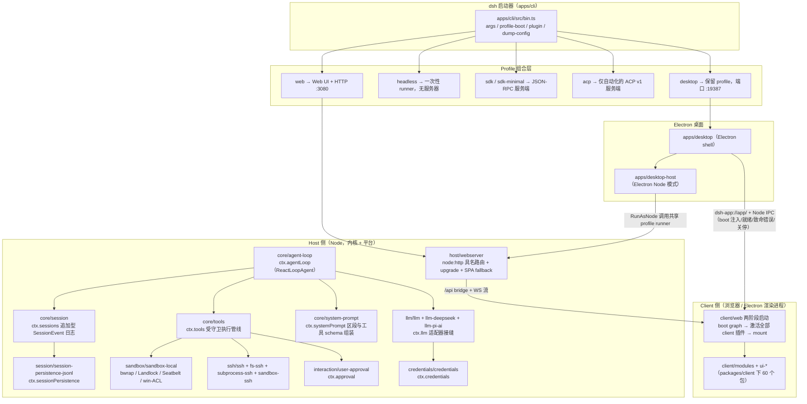
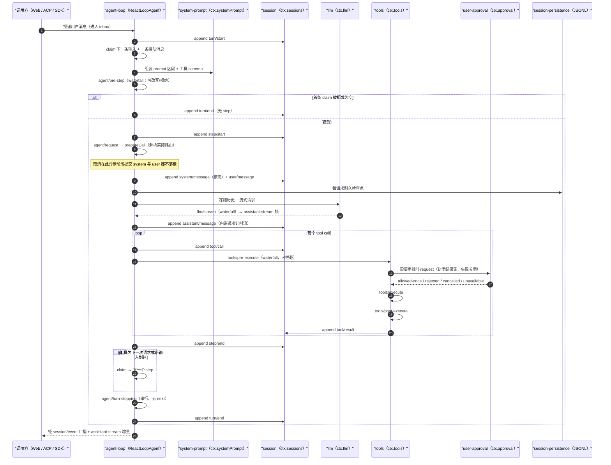
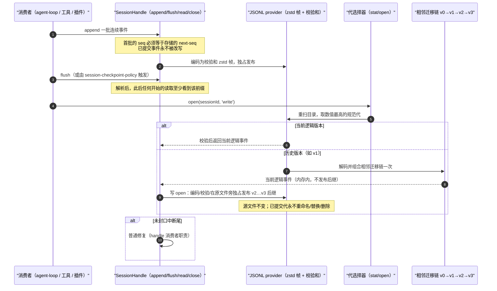
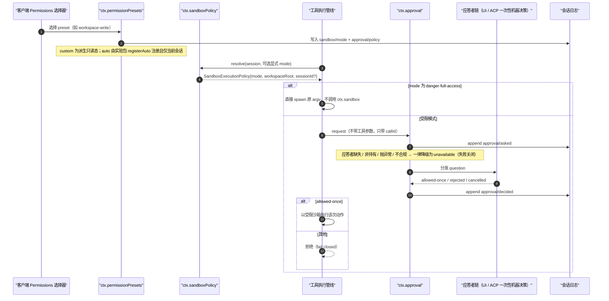

# 竞品研究 04：DeepSeek Harness（`deepseek-ai/deepseek-harness`）

> **研究对象**：DeepSeek 官方开源的 agent harness，代号 `dsh`，口号 "Everything is a Plugin"。
>
> **研究方式**：`git clone --depth 1` 至 `.research-cache/deepseek-ai-deepseek-harness`（146 MB / 12,072 文件），逐文件读源码与仓库内文档；仓库自带 80+ 篇子系统文档、生成式目录（tool-catalog / persistence-catalog / config-catalog / capability-seams / event-producer-consumer），本身即为高密度一手证据。
>
> **研究快照**：commit `ddefc45fbc7f8e46dd73185e68295696d1297887`（2026-09-17，merge PR #4469，`release-dsh-0.1.6-alpha.2`）；GitHub API 元数据采集于 2026-09-21。
>
> **证据时点（R09 补）**：代码基线 commit `ddefc45`（2026-09-17）；仓库自陈处 alpha（`0.1.6-alpha.2`），能力面以该 commit 为准，失效条件见 `CROSS-COMPARISON.md` §4.3 第 3 条。
> **证据分级**：`[E1]` 读源码/仓库内文档（给路径与符号）；`[E2]` 官方 README / 官网 / package.json 声明；`[E3]` 第三方分析或媒体；`[E4]` 本文推断（显式写推理链）。

---

## 0. 前提核验：本对象真实存在，且比预期更完整

任务书列出的检索词中，`deepseek-engineer`、`DeepSeek-V3.2 agent harness` **均未命中**官方产物，但主体对象完全成立：

| 待核验项 | 结论 | 证据 |
| --- | --- | --- |
| "DeepSeek Harness" | **存在，且为 DeepSeek 官方开源项目** | `github.com/deepseek-ai/deepseek-harness`，README 首句 "open-source agent harness developed by DeepSeek AI" `[E2]`；官网 https://deepseek.com/harness/ `[E2]` |
| `deepseek-ai` 组织下的 harness 仓库 | 存在，MIT，TypeScript，创建于 2026-08-13 | GitHub API：`created_at 2026-08-13T11:56:32Z`，`license MIT`，`language TypeScript`，`stargazers 231028`，`forks 27687`，`pushed_at 2026-09-17T13:30:15Z` `[E2]` |
| `deepseek-engineer`（官方仓库） | **不存在**（404 Not Found） | `GET /repos/deepseek-ai/deepseek-engineer` → `{"message":"Not Found"}` `[E1]`（负证据） |
| `DeepSeek-V3.2` 官方仓库 | 已重命名/迁移（301 Moved Permanently），非 harness | `GET /repos/deepseek-ai/DeepSeek-V3.2` → 301 `[E1]`（负证据） |
| 官方 agent 生态清单 | 存在：`deepseek-ai/awesome-deepseek-agent` | stars 6117，创建 2026-04-27，推送 2026-09-17 `[E2]` |
| 第三方站点 `deepseek-code.com` | **非官方**，宣称 "DeepSeek Harness: Open-Source AI Agent Framework" 并挂 "deepseek-harness-cli 插件" | 搜索命中 `[E3]`；D 级可信度，**不采信** |

> **对 Phase A 的影响**：`docs/harness/00-vision-and-product.md` 中"对标 DeepSeek Harness"的提法成立且对象明确，无需修订；但需注意本对象**不是 CLI 优先产品**（默认入口是 Web UI + Electron 桌面的同一份 Web 应用），与同批竞品（Claude Code / Codex / gemini-cli 的 CLI 优先）形态差异很大。

---

## 1. 结论速览（10 条）

1. **架构母题是"一切皆插件"**：底层框架为 DeepSeek 自行 vendor 的 [Cordis](https://github.com/cordiverse/cordis)（`vendor/cordis`），模型适配器、工具注册表、会话日志、**Agent 循环本身**都是插件；"There is no privileged core to patch" `[E1] docs/architecture.md:11-13`。这是本次研究中与 OpenCoding「内核/外壳 + 端口适配器」最可对照的一种极端做法。
2. **运行拓扑是"一个 CLI 承载 5 个 profile"**：`web` / `headless` / `sdk` / `sdk-minimal` / `acp`，外加桌面私有的 `desktop` profile；全部通过 `dsh --profile <name>` 或 `dsh <name>` 启动，`scripts/verify-application-entrypoints.ts` 机械拒绝"绕过 dsh 的 Node 应用入口" `[E1] docs/architecture.md:43-47`。
3. **会话日志是唯一事实源，且"模型可见即可重建"是运行时不变式**："Model-visible means logged"，`deriveMessages()` 从日志投影模型历史，插件改动消息内容必须注册纯投影 `[E1] docs/architecture.md:121-127`。对应我们卷 16「一切皆事件」+ 卷 03「九区段组装」。
4. **持久化是一等能力**：JSONL + 校验和 Zstandard 帧，`session.jsonl[.zstd]`（v0）→ `session.vN.jsonl[.zstd]`（v1–v3），相邻迁移链（`session-format-v0-to-v1` … `v2-to-v3`），**已提交代（generation）永不重命名/覆盖/删除**，撕裂尾自动修复 `[E1] packages/session/session-persistence-jsonl/README.md:12,62-68`。
5. **权限模型是"沙箱模式 × 审批策略"两旋钮 + Preset 组合**：`SandboxMode = read-only | workspace-write | danger-full-access`，`ApprovalPolicy = ask | never`；出厂 preset 只有 `workspace-write(workspace-write+ask)` 与 `danger-full-access(danger-full-access+never)`，另保留派生态 `custom` 与实验性 `auto` `[E1] docs/subsystems/permission-presets.md`。
6. **审批是"封闭结果集 + 失败关闭"**：`ApprovalOutcome = allowed-once | rejected | cancelled | unavailable`，缺失/非持有/抛异常/不合规的应答者一律降级为 `unavailable`，调用方必须 fail closed；且 `ApprovalRequest` **刻意不含工具参数**，只带 `callId` 关联到已流式的工具调用 `[E1] docs/subsystems/approval.md`。
7. **沙箱按平台选运行器并"上报执行强度"**：Linux 先 bwrap 后 Landlock，macOS Seatbelt（`sandbox-exec`），Windows ACL 受限令牌；`SandboxEnforcement = full | partial`，Windows ACL 的 Everyone/硬链接边界与旧 Landlock ABI 被明确标为 `partial` `[E1] docs/subsystems/sandbox.md`、`[E1] packages/sandbox/sandbox-local/src/index.ts:2,141,160`。
8. **工具体系有"规范化输出契约"与三通道执行管线**：`ToolDefinition = ToolSchema + output{schema,render,presentationMeta} + execute`；注册表 `schemas()` 用显式白名单阻止 `execute/output/presentation` 泄漏进模型请求；执行走 `tools/pre-execute → tools/execute → tools/post-execute` 三个 waterfall `[E1] packages/core/tools/src/index.ts`、`docs/subsystems/tools.md`。共 **68 个模型可见工具** `[E1] docs/tool-catalog.md`（`grep -c '^### '`）。
9. **"程序化工具调用"(PTC) 与"模型写编排脚本"是内建能力**：`run_code`（PTC 模式，`maxParallelSubCalls` 限定并发，子调用**重新进入完整受守卫管线**）与 `workflow`（模型写纯 JS 脚本，用 `agent()/parallel()/pipeline()/phase()/log()` 扇出子 agent）；另有 `ralph` 固定"每轮全新子 agent + 有界报告"循环 `[E1] docs/tool-catalog.md:509,2350,1513`。
10. **"自我扩展"做到了运行时层**：`dsh-cordis-host-runner` 在 `node:vm` realm 中执行 agent 自己写的 Cordis 包，配合 `plugin_manager` 工具与 Web 侧边栏启停插件/bundle，且"**没有任何模型工具会创建动态定义**"（只能查询 `cordis_inspect_*`，持久化安装走 Plugin Manager 的人工/工具路径）`[E1] packages/extensions/cordis-host-runner/README.md`。

---

## 2. 产品与仓库事实

| 项 | 值 | 证据 |
| --- | --- | --- |
| 仓库 | `deepseek-ai/deepseek-harness` | `[E2]` |
| 版本 | `0.1.6-alpha.2`（root `package.json`），commit `ddefc45f` | `[E1]` |
| 许可 | **MIT**（"Copyright (c) 2026 DeepSeek"），第三方依赖清单 `THIRD_PARTY_NOTICES.md`（22 KB） | `[E1] LICENSE` |
| 语言 / 运行时 | TypeScript（ESM），Node `^22.19.0 \|\| >=24.0.0`，pnpm `11.7.0` | `[E1] package.json` |
| 星标 / Fork | 231,028 / 27,687（2026-09-21 采集） | `[E2]` |
| 创建 / 最近推送 | 2026-08-13 / 2026-09-17 | `[E2]` |
| Issue 策略 | `open_issues_count = 0`；README 指向 GitHub Discussions（+ 企微群/飞书问卷/公众号） | `[E2]`/`[E2]` |
| 官方入口 | `npx @deepseek-ai/dsh web` → Web UI `http://127.0.0.1:3080`；桌面 Electron 默认端口 `19387` | `[E2] README`、`[E1] apps/desktop/README.md` |
| 文档站 | `https://deepseek-harness.github.io/deepseek-harness/` | `[E2]` |
| 仓库内文档 | `docs/subsystems/` 61 篇英文子系统文档（另有 `.zh.md` 与 `.i18n.yaml` 配对，合计约 180 文件）、`docs/tool-catalog.md`（2490 行）、`docs/persistence-catalog.md`、`docs/config-catalog.md`、`docs/capability-seams.md`、`docs/event-producer-consumer.md`、`docs/postmortem/`、`.agents/notes/{implemented,archived}/` 决策记录 | `[E1]` |
| 工作区规模 | `packages/*/*` 共 **291 个 npm 包**（含 60 个包组 + `packages/client/` 60 个客户端包）；根 `packages/` 54 MB、`docs/` 20 MB、`snapshots/` 8.2 MB | `[E1]` |
| 依赖策略 | `pnpm` 10+ `strictDepBuilds`：**默认拒绝所有安装脚本**，逐个 review 放行（`esbuild`/`lefthook`/`node-pty`/`koffi` 允许；`@google/genai`/`protobufjs`/`electron-winstaller` 显式拒绝且注释理由） | `[E1] pnpm-workspace.yaml` |
| 已知上游集成 | 依赖并 pin `@anthropic-ai/claude-agent-sdk@0.3.263`、`@openai/codex@0.153.4`、`@earendil-works/pi-ai@0.85.1`、`@trycua/cua-driver@0.28.0`、`@deepseek-ai/libreoffice-kit` | `[E1] pnpm-workspace.yaml` |
| 阶段声明 | "developer preview … **THERE WILL BE COMPATIBILITY-BREAKING CHANGES**"，并附 `SAFETY.md` 安全须知 | `[E2]/[E2]` |
| 学术引用 | 引用论文 *A Programming Paradigm for Spatiotemporal Composability*（arXiv 2608.25512）解释 Cordis 设计 | `[E2]` |

---

## 3. 架构总览

### 3.1 Cordis：可逆副作用的插件树

Cordis 的核心语义在 `docs/architecture.md` 首节被压缩成三句：插件向共享 `Context` 贡献 **服务（services）**、**带类型事件（typed events）** 与 **可逆副作用（reversible effects）**；卸载插件时注册全部回卷；"每个部分都是插件，包括模型适配器、工具注册表、会话日志和 agent 循环本身" `[E1] docs/architecture.md:11`。源码侧的证据是 `packages/core/agent-loop/src/index.ts` 顶部注释——该包是 `@deepseek-ai/dsh-agent-loop` 这个 Cordis 插件，用 `Service` 类声明 `ctx.agentLoop`，用 `FiberState` 判断自身是否可服务新生命周期 `[E1] packages/core/agent-loop/src/index.ts:1-45`。

**"Seam（接缝）"三件套**是本仓库最制度化的设计模式，`docs/architecture.md:129-135` 定义为：Service Definition（接口）+ Service Provider（实现）+ Consumer（常用模型可见工具）。文档明确论证了两处收益：

- 文件系统与子进程 provider 共享同一个"执行世界"，因此把二者指向远端沙箱，"Bash、PTY、LSP 会跟着一起搬过去，无需 provider 分叉" `[E1] docs/architecture.md:133`。
- Subagent provider 可以在一个接口背后从"同进程子 agent"一路换到"另一个产品的委派回合" `[E1] docs/architecture.md:133`。

### 3.2 Profile / Bundle / Patch：三层组合与 HMR

```text
空入口列表
  → profile 列出的 bundle（按序）
  → profile 的 cordis.patch.yml
  → home 级 cordis.patch.yml
  → CLI --patch 覆盖层
```

`[E1] docs/architecture.md:27`

- **profile** 是 Harness home 中的具名组合，记录其堆叠的 bundle、自带的 out-of-tree 插件与用户自己的 patch；出厂模板：`web`、`headless`、`sdk`、`sdk-minimal`、`acp`（桌面另有保留的 `desktop`）`[E1] docs/architecture.md:19,45`。
- **bundle** 是"Cordis 配置行 + 其挂载代码"的分发格式，在自身 `package.json` 的 `dsh` 字段声明：`dsh.profile` 列 bundle、`dsh.bundle` 指向 patch 文件 `[E1] docs/architecture.md:20-23`。
- `dsh-base` 是 `web`/`headless`/`sdk`/`acp` 的共享首层（模型适配器、工具、持久化、沙箱与审批策略、settings、credentials、telemetry）；`dsh-web-app`/`dsh-headless`/`dsh-sdk-app`/`dsh-acp-app` 各自叠加差异；**`sdk-minimal` 是刻意例外**：单个 bundle 自带完整显式 SDK 树，不套用 `dsh-base` `[E1] docs/architecture.md:25`。
- patch 语义："按 id 定位一行并**替换其整段 config**，或插入新行" `[E1] docs/architecture.md:27`。
- `dsh --profile web --dump-config` 打印本机实际启动树，**任何打印出的行都可被自己的 patch 替换** `[E1] docs/architecture.md:33-39`。
- HMR：base 启用"仅配置"的 `dsh-hmr`；headless/SDK/ACP 关闭；`sdk-minimal` 不挂 `[E1] docs/architecture.md:29`。

### 3.3 进程与运行拓扑



依据：`[E1] docs/architecture.md:43-70`、`[E1] apps/desktop/README.md`、`[E1] packages/host/webserver/README.md`、`[E1] packages/client/web/README.md`、`[E1] packages/core/*/README.md`。

进程拓扑要点：

- **Web 与桌面共用同一份 Web 应用**：桌面把该 Web 入口打包在签名资源里，Electron 立即加载 `dsh-app://app/`，共享加载页等待 Host 的 boot 注入后在**同一 document 内**激活 client 插件（不跳转）`[E1] apps/desktop/README.md`。
- `apps/desktop-host` 以 Electron Node 模式启动，调用**共享的 CLI profile runner** 与完整 Web 应用；CLI 与 Desktop 共享产品数据，但可执行包、激活选择与 lockfile 分离；"公开 CLI 不能管理 Desktop 的 profile" `[E1] docs/architecture.md:51-55`。
- `dsh-host-webserver` 自我定位为"**不懂任何 harness 概念**"：`/api` 桥、插件 bundle、HMR 事件流、SPA dist 都由注册它的插件负责；路由匹配固定为"全表精确 → 最长前缀 → fallback" `[E1] packages/host/webserver/README.md`。
- Client 插件化程度很高：`packages/client/` 下共 60 个包（绝大多数为 `ui-*`）（`ui-chat`、`ui-approval`、`ui-sidebar-terminal`、`ui-settings-plugins`、`ui-trajectory`、`ui-diff` 类族等）`[E1] packages/client/*`。

---

## 4. 24 维度逐项分析

> 以下逐条给出证据；"未观测到"的条目附检索词与负证据说明。

### 4.1 进程与运行拓扑

单可执行入口（`dsh`）+ 5 个 profile + 桌面私有 profile；IPC 面共三种：**HTTP 具名路由 + WS 升级流**（浏览器 ↔ Host）、**Node IPC**（Electron ↔ Host，承载 boot 注入/就绪/致命错误/关停）、**stdio JSON-RPC**（`sdk` 换行分隔 JSON-RPC 2.0；`acp` 走标准 ACP v1，stdout 仅协议流量）`[E1] docs/architecture.md:43-55`、`[E1] packages/sdk/protocol/README.md`、`[E1] packages/acp/acp/README.md`。桌面与 Web 端口分离（19387 / 3080）`[E1] apps/desktop/README.md`。

### 4.2 Agent 主循环与回合模型

- 术语定义："**step** = 一次模型请求 + 它触发的工具调用；**turn** = 零或多个 step，在首个输入被 claim 前开启，在无任何待办时关闭" `[E1] docs/architecture.md:86`。
- 驱动器是 `ReactLoopAgent`，注册为 `ctx.agentLoop`，实现公共 `Agent` 接口；扩展插件只依赖 `agent` 不依赖 `agent-loop`，"所以循环保持可替换" `[E1] docs/subsystems/core.md`、`[E1] packages/core/agent-loop/src/index.ts`。
- `turn/start → claim 输入 + 组装 → agent/pre-step（可 reject/改写）→ step/start → agent/request → prepareCall → 冻结历史 → 流式 → tool/call* → step/end →（欠请求则再 claim）→ agent/turn-stopping → turn/end` `[E1] docs/architecture.md:88-107`。
- 一个 inbox 供给驱动；注入的上下文要等"唤醒消息"；`inbox` 投影暴露 pending 输入而不需要活着的 Agent `[E1] docs/architecture.md:111`。
- 重试**不重复**组装与 `agent/pre-step` `[E1] docs/architecture.md:113`。
- 并发：每 agent step 默认最多 10 个在飞行的并行安全调用 `DEFAULT_MAX_PARALLEL_TOOL_CALLS = 10` `[E1] packages/core/agent-loop/src/constants.ts:6`。
- 事件分三类域：**session events**（持久事实，经 `session/event` 广播）、**agent events**（`agent/*`，携带活的 Agent：inbox/step/status/request/validation/continuation）、**capability events**（`fs/*`、`tools/*`、`telemetry/*`，把策略与适配器接到接缝而不 import 循环）`[E1] docs/architecture.md:72-82`。
- waterfall 语义：`agent/pre-step`、`agent/request`、`llm/stream`、`tools/*` 三个是 waterfall，监听者必须调 `next()` 委派；`agent/turn-stopping` 是串行且无 `next()` `[E1] docs/architecture.md:109`。

### 4.3 工具系统

- `ToolDefinition extends ToolSchema`，额外强制 `output: ToolOutputDefinition`（含 `schema`、纯投影 `render(args,value)→ContentBlock[]`、可回放 `presentationMeta(args,value)`），加 `execute(args, exec): Promise<unknown>`；`exec` 提供执行身份、取消信号与"上下文延迟" `[E1] packages/core/tools/src/index.ts`。
- **防泄漏白名单**：`schemas()` 只放行模型面字段，`output`/`execute`/`finalizeContent`/`timeoutMs`/`isConcurrencySafe`/`presentCall`/`presentResult` "must never leak into a model request" `[E1] docs/subsystems/tools.md`。
- `finalizeContent` 语义极严谨：注册表在**执行开始时快照该回调**，对**每一个规范化结果恰好调用一次**，含绕过 `tools/post-execute` 的管线失败；回调必须全函数且不得抛异常 `[E1] packages/core/tools/src/index.ts`。
- 执行管线为 `tools/pre-execute`（waterfall，可拦截）→ `tools/execute` → `tools/post-execute`，随后 `tool/result*` `[E1] docs/architecture.md:99-101`。
- 工具族（68 个模型可见名，`docs/tool-catalog.md` 按包分组）：文件与检索（`read`/`write`/`edit`/`read_image`/`glob`/`grep`/`str_replace_editor`）、Shell（`bash`/`pwsh` 一次性与持久 PTY 两版）、终端 6 件套、LSP、任务与控制（`todo_write`、`job_*`）、会话检索 5 件套、子 agent 与团队、`skill`、`ask_user_question`、`present`、`run_code`、`workflow`、`ralph`、`exit_plan_mode`、`create_goal`/`get_goal`/`update_goal`、`schedule_*`、`web_fetch`/`web_search`、MCP 资源 3 件套、浏览器 6 件套、`plugin_manager`、`cordis_inspect_*` `[E1] docs/tool-catalog.md`。
- 检索工具的两个工程细节：`glob`/`grep` **无条件**通过 `ctx.subprocess` 调打包的 ripgrep 二进制（`@vscode/ripgrep`，"不需要宿主安装 rg，也不经过 shell 层"，且永不作后台任务）；超上限结果把完整列表存入可选 `ctx.spillStore` 并返回 locator `[E1] docs/tool-catalog.md`（`dsh-tool-fs-search` 行）。
- 读取前置校验不是 schema 改动而是事件门：`@deepseek-ai/dsh-fs-observation-policy` 以 `fs/*` 事件实现 read-before-write/edit `[E1] docs/tool-catalog.md`（`dsh-tool-fs` 行）。

### 4.4 权限与审批

- 两旋钮正交：沙箱模式管**文件效果**，审批策略管**是否打断人**；网络与进程可见性被明确排除在该词汇之外 `[E1] docs/subsystems/sandbox.md`。
- 审批封闭结果集与失败关闭（见结论 6）；审计事件成对 `approval/asked` + `approval/decided`，`ApprovalRequestId` 与 tool-call/agent/session id 不可互换 `[E1] docs/subsystems/approval.md`。
- 每会话策略 `ask`/`never`，有效值取**日志中最后一条 `approval/policy`**，回退到服务配置；`setApprovalPolicy()` 是唯一写路径，因此**重放可重建覆盖** `[E1] docs/subsystems/approval.md`。
- 政策选择"**不碰 system/message 节点**"：两种策略把完整当前含义贡献给缓存安全的 runtime-context 快照，变更审批状态只是在保留历史上**追加一份新的完整快照** `[E1] docs/subsystems/approval.md`。这是缓存亲和设计的一个具体手法。
- Preset 层：`ctx.permissionPresets` 打包两旋钮；`custom` 为派生只读态，`auto` 由 `experimental/auto-review` 的 `registerAuto(admit)` 在**当前会话**注册，效果失效即消失；误配置（配置项名为 `custom`/`auto`，或在"不具 confine 能力"的 bash 执行器上组合 preset）在**插件加载期**抛错 `[E1] docs/subsystems/permission-presets.md`。
- Auto review（实验、出厂关闭）：每次原生或 PTC 内层工具调用前，用**当前 agent 自己的 provider/model** 评估待执行动作，放行后以 Full access 执行；文档坦诚其局限（可能放行不安全动作、拒绝有用工作、多花 token）`[E1] packages/experimental/auto-review/README.md`。
- 行为护栏（不是权限）：`guard/repeat-tool-reminder` 在相同工具+相同参数的重复达 3/5/8 次时提醒模型改路径，**纯建议、绝不阻塞**，按 agent 单独计数、被新用户消息清零 `[E1] packages/guard/repeat-tool-reminder/README.md`。

### 4.5 上下文管理

- 组装分两处：`ctx.systemPrompt`（prompt 区段 + 工具 schema 组装）与 runtime-context 投影；`plan:policy` 区段固定插在 **order 50** `[E1] docs/subsystems/plan.md`。
- 压缩是 capability seam（非循环内建）：Service Definition `dsh-compaction`（`ctx.compaction`）、Provider `compaction-basic`、人类消费者 `/compact`；另有 `compaction-tool-result-pruner` 与 `compaction-image-offload` `[E1] docs/subsystems/compaction.md`。
- **压缩的三事件锁**：`compaction/start`（lock）→ `compaction/summary`（安全摘要 + 被遮蔽区间/序号/估算 token + 该次 summarize 调用的 provider/model/maxTokens/usage，使"一次性请求可由日志 + 代码重建"）→ `compaction/end`；**先释放锁最后**，因此崩溃会留下可检测的"孤儿锁"（有 start 无 end），而非一条谎称完成的 end `[E1] docs/subsystems/compaction.md`。
- 摘要本身**复用 `user/message`** 携带 `surfaceOp: {op:'replace', startSeq, endSeq}`——这是总结式压缩所做的唯一 surface 变更；`compaction/*` 全部是 log-only，不加入模型面 `[E1] docs/subsystems/compaction.md`。
- 图片卸载（`image/offload`）用"节点 + 深度优先出现序号"精确定位，保留节点与消息身份 `[E1] docs/subsystems/compaction.md`。
- 输出外溢 `ctx.spillStore`：存大文本 → 返回不透明 locator + 精确字节数 + 取回指引；API **不提供**保留期、替换、检索、搜索操作；保存失败则 reject，由调用方决定内联或失败 `[E1] packages/spill/spill/README.md`。
- 另有 `token-meter` 包与 `session/session-stats` 提供计量与统计 `[E1] packages/llm/token-meter`、`packages/session/session-stats`。

### 4.6 提示词组织

- `core/system-prompt` 拥有"prompt 区段与工具 schema 组装" `[E1] docs/architecture.md:64`。
- system prompt **作为 surface 节点存在**：system 文本只以 `system/message` 历史传播；空渲染会清掉所有活跃 system 节点；有能力的路由可在缓存前缀之后追加非空更新，无能力的路由与新 request series 会把非空 prompt 文本**合并到第一个 system 节点**，并对后续非空 system 节点写"已记录的空替换" `[E1] docs/architecture.md:113`（引用 `.agents/notes/implemented/architecture/2026-09-02-system-prompt-as-surface-node.md`）。
- 分层指令文件：`context/agent-instructions` 包负责（对应 Claude Code 的 `CLAUDE.md` / Codex 的 `AGENTS.md` 类文件）`[E1] packages/context/agent-instructions`；仓库自身同时存在 `AGENTS.md` 与仅一行 `CLAUDE.md`（内容指向 AGENTS.md）`[E1]`。
- 其他上下文贡献者：`time-context`、`tmux-context`、`file-reference`(+`-local`)、`session-reference` `[E1] packages/context/*`。
- 工具 schema 与 prompt 同在组装阶段合并；`skills` 的目录是经 `agent.inject()` 以 **user/message 替换目录** 的形式进入上下文的 `[E1] docs/tool-catalog.md`（`dsh-tool-skill` 行）。

### 4.7 MCP

- **没有共享 `ctx.mcp` 服务**：每个 server 一个 `dsh-mcp-client` 连接插件，是"工具注册表的消费者" `[E1] docs/subsystems/mcp.md`。
- 传输：`stdio`（协商时会先起一个**临时探针进程**再起服务进程）与 Streamable HTTP；由官方 SDK 选择 **2026-07-28** 协议版本，回退到受支持的旧版本；"没有强制协议版本的产‑品设置" `[E1] packages/mcp/mcp-client/README.md`、`[E1] docs/subsystems/mcp.md`。
- 能力映射：MCP 工具成为**普通 harness 工具**（带取消、权限检查、结果记录、支持的图片输出）；工具名形如 `mcp__<serverName>__<tool>`（配置的 server 名进公共工具名，因此跨 server 同名工具可区分）`[E1] docs/subsystems/mcp.md`。
- 资源侧独立成包 `mcp-resources`（`list_mcp_resource_templates`/`list_mcp_resources`/`read_mcp_resource`），"首个 provider 进 scope 即启用本地共享工具，最后一个移除即移除"；**连接失败不会移除共享资源工具** `[E1] docs/subsystems/mcp.md`。
- server instructions 作为**字面文本**加入被记录的 system prompt（受 `maxInstructionBytes` 限制）；**MCP prompt templates 不支持** `[E1] docs/subsystems/mcp.md`、`[E1] packages/mcp/mcp-client/README.md`。
- 未观测到 OAuth 流程：检索 `oauth` 于 `packages/mcp/` 未见客户端 OAuth 支持，凭据仍走 `ctx.credentials` 的 key 引用 `[E4]`（推断：MCP OAuth 未实现或未公开）。

### 4.8 Skill / 插件机制

**Skill**：

- 注册表 `dsh-skill` + provider `dsh-skill-filesystem`；形态为目录包 `<name>/SKILL.md` 或平铺 `<name>.md`，**嵌套 `**/SKILL.md` 刻意不发现** `[E1] packages/skill/skill-filesystem/README.md`。
- frontmatter：必填 `name`/`description`，可选 `whenToUse`/`metadata`/`disable-model-invocation`/`user-invocable`；布尔解析接受 `true/false/yes/no/on/off/1/0`（大小写不敏感），**拼写被拒或非布尔值会整体丢弃该 skill 并告警**，而不是静默放行某一面 `[E1]` 同上。
- 发现根：项目 / 自定义 / 用户配置三类；**watcher 监听目录**，新增、改名、删除无需重启即可进下一次 catalog `[E1]` 同上。
- 另有 `skill-badge`、`skill-office`（Office 文档技能）`[E1] packages/skill/*`。

**插件 / 扩展**：

- `boot/plugin-manager`：从 Web 侧边栏或 agent 侧"启用/禁用单个插件行、选择已安装 bundle、安装/移除外部 bundle"，应用面提供的包管理器调用优先于 `pnpmCommand`；HMR 开启时立即生效，否则等重启；"变更影响使用该 profile 的每个会话" `[E1] packages/boot/plugin-manager/README.md`。
- `plugin_manager` 工具需要 `ctx.tools`、`ctx.pluginManager`、`ctx.sandboxPolicy`（沙箱化执行包操作）`[E1] docs/tool-catalog.md:52`。
- `extensions/cordis-host-runner`：Host 半边跑在 `node:vm` realm 里，浏览器半边走 Client runner + 审批 UI；**定义在重启后消失**；agent 通过 `cordis_inspect_list`/`cordis_inspect_query`（read-only）发现 API，**没有模型工具能创建动态定义**，持久化安装走 Plugin Manager `[E1] packages/extensions/cordis-host-runner/README.md`、`[E1] docs/tool-catalog.md:715`。
- 插件生态有 GitHub topic 约定：`dsh-plugin` `[E2] README`。
- 钩子（Hooks）：`packages/hooks/hook-protocol` 统一定义"钩子能做什么、运行时可发生什么"，由 `hooks-claude-code` 与 `hooks-codex` 两个**桥接包**复用现有 `hooks.json`；**只有 command 类型钩子运行**，`http`/`mcp_tool`/`prompt`/`agent` 被跳过并告警；钩子可"以模型可见理由阻断 prompt 或工具调用 / 追加会话上下文 / 要求运行停止"；日志侧记录 log-only 的 `hook/invoked` 与 `hook/result` `[E1] packages/hooks/hook-protocol/README.md`、`[E1] docs/subsystems/session.md`（merge-extensible 事件说明）。

### 4.9 SubAgent / 多 Agent 编排

- `ctx.subagents` 注册表，**6 个 provider 并存**：`subagent-spawn-in-process`、`subagent-fork-in-process`、`subagent-acp`、`subagent-codex`、`subagent-claude-code`、`subagent-dsh-sdk`；消费工具 `tool-subagent`（按 provider 一个委派工具）与 `tool-subagent-control`（全局 `send_message`/`interrupt_agent`/`list_agents`）`[E1] docs/subsystems/subagent.md`。
- **两类能力、两种发现方式**：start-time 能力声明在静态描述符上，服务在**一次性运行存在之前**检查，"需要但缺失 → 以 `SubagentError('UNSUPPORTED_CAPABILITY')` 响亮拒绝，绝不 accept-then-ignore"；可续子 agent 由 continuation manager 自己组装，能力门是**可选方法 `prepareContinuable` 的存在性本身**，用 TS 收窄做发现 `[E1] docs/subsystems/subagent.md`。
- 请求可带 agent 路由覆盖（provider/model/reasoning-effort/token）、输出 schema、深度上限、工具过滤、persona；ACP/Codex/Claude Code provider **在启动传输前**就拒绝 `agentOptions` `[E1] docs/subsystems/subagent.md`。
- 血缘与深度：`CreateAgentOptions.meta` 含 lineage、`isSeeded`、origin 分类、delegation depth、`agentPreset`；fork 切点由兄弟字段 `inheritedEventCount` 精确给出 `[E1] docs/subsystems/core.md`。
- 多 agent 团队（实验性、出厂禁用）：`ctx.agentTeams` = Lead + 具名 teammate + **持久 mailbox + 共享任务板**，掉线的 teammate 恢复后收到排队消息；9 个工具（`spawn_teammate`、`team_task_*`、`wait_agent` 等）；`dsh-base` 保持其 disabled，由文档化的 Agent Teams profile patch 开启 `[E1] packages/experimental/agent-team/README.md`、`[E1] docs/tool-catalog.md:2008`。
- **编排脚本化**：`workflow` 工具让模型提交纯 JS（非 TS）脚本体，带顶层 await 与 `return <json>`；脚本内用 `agent(prompt,opts)`/`parallel()`/`pipeline()`/`phase()`/`log()`；调用阻塞父回合直到整个 workflow 结算，模型只看到**一个最终结果、永远看不到中间子消息**；`meta` 与 `args` 以纯 JSON 数据到达，**永不作为代码求值** `[E1] packages/workflow/workflow/README.md`。
- `ralph` 工具：固定前台循环，**每轮一个全新子 agent** 面对同一不可变目标，只有"有界结构化报告 + 共享工作区状态"跨轮传递；父对话与先前子会话**永不复制进新一轮**；返回条件为报告完成/具体阻塞/回合上限；文档明确"这些报告**不被独立验证**"，且"仅在直接人类明确要求 Ralph 式迭代时使用" `[E1] packages/workflow/tool-ralph/README.md`。

### 4.10 任务 / 计划 / Todo

- `todo_write`：**整表替换**（last-write-wins），条目 `TodoItem{content, status: pending|in_progress|completed}`，刻意**没有 id、没有优先级、没有 activeForm**——因为整体替换所以条目无需稳定身份；事件 `todo/write` 是 log-only，携带完整替换列表 `[E1] docs/subsystems/todo.md`。
- `allowParallelInProgress` 是**无默认值的必填配置**，"因此 catalog 必须声明其选择：`true`，其描述邀请多个 in_progress" `[E1] docs/tool-catalog.md`（`dsh-tool-todo` 行）。
- Plan mode：`ctx.planMode` 是**每 agent 的日志化协作状态**；`plan/mode` 为 log-only 整值替换事件（可持久、可重放，**永不进模型 transcript**）；活跃时把部署方拥有的 guidance 作为 `plan:policy` 区段渲染（order 50）`[E1] docs/subsystems/plan.md`。
- Plan mode 明确是"**软引导**"：沙箱模式与审批策略**独立强制**，互不读写 `[E1] docs/subsystems/plan.md`。
- `exit_plan_mode` 在 plan 未激活时**仍注册**，因此进出 plan 只改 prompt 区段、**不改变请求里的工具目录**；执行路径在 plan 之外拒绝调用；plan 内要求完整 markdown 计划（以 `#` 开头）并经 user-questions 接缝呈审（approve / 带反馈继续规划）`[E1] docs/subsystems/plan.md` 与 `[E1] docs/tool-catalog.md:557`。
- 未决选择的落盘时机有明确约束：会话事件都被 turn 包裹，所以"用户选择在下一个被接受的回合内 pre-step 处、在请求派生之前追加"；一个在回合最后一次 pre-step 之后做出的选择**留在进程内，进程退出即丢失**（文档列为已知限制）`[E1] docs/subsystems/plan.md`。
- 另有 `interaction/commands`（人类 `/` 命令，**不消耗模型回合**即可派发）`[E1] docs/architecture.md:148`。

### 4.11 Goal / 自治循环 / Schedule

- Goal 是同会话目标，`ctx.goals`：持久阶段 `GoalPhase = active | paused | blocked | complete`；`GoalRef{id, revision}` 是**比较并交换（CAS）身份**，每次被接受的可持久变更递增 revision；`blocked` 是唯一的"被问题停住"持久态，其 reason 为 `{code: 机器可路由的 lower-kebab-case, message: 人类/模型可读}` `[E1] docs/subsystems/goal.md`。
- 工具权限：`create_goal`/`edit`/`pause`/`resume` 需要**直接人类根权威**；`complete` 与 `blocked` 也接受"当前 goal round"；**默认 blocked 下界为三次获准回合** `[E1] docs/tool-catalog.md:1272`。
- `goal-round-driver` 包驱动 round；`command-goal` 提供人类命令 `[E1] packages/goal/*`。
- Schedule 是**会话本地**的持久提醒，回到原活会话作为普通后续回合：v1 支持 `after_seconds`（正安全整数延迟）、显式绝对 `at`、`every_seconds`（安全整数、**至少 5 分钟**）；创建时把所有首目标规范化为四位年份 RFC 3339 UTC 的 `scheduledAt`；"after 保留提交的延迟、at 只存结果瞬时、every 保留固定间隔与下一目标" `[E1] docs/subsystems/schedule.md`。
- Schedule 工具只在"opt-in 插件加载之后创建的活根 Agent scope 内"注册，且管理读写需要**共享会话持久化屏障**；会明确披露"会话本地投递" `[E1] docs/tool-catalog.md:1366`。
- 时区边界是显式的（引用 `.agents/notes/implemented/simplification/2026-08-09-explicit-schedule-time-zone.md`，"browser-local interpretation"）`[E1] docs/subsystems/schedule.md`。

### 4.12 会话持久化与恢复

- 接缝：`SessionPersistence`（`create`/`open`/`stat`/`list`/`export`）返回**每会话 `SessionHandle`**（`read`/`append`/`flush`/`close`），"每一次日志读写都经 handle，绝不通过按 id 寻址的服务方法——handle 是跨进程写租约守卫的唯一门"；单写者：第二个 `open(id,'write')` 在有主时以 `SessionAlreadyOwnedError` 拒绝；在 read handle 上做变更抛 `SessionReadOnlyError`；关闭后任何操作 `SessionHandleClosedError` `[E1] docs/subsystems/persistence.md`。
- 新鲜度契约："一旦写 handle 上的 append/flush 解析，**此后在同一后端实例上开始的任何读取**（任意 handle 或 `stat`/`list`）至少观察到该前缀" `[E1] docs/subsystems/persistence.md`。
- 物理格式（JSONL provider，`compression` 默认 `'zstd'`=校验和 Zstandard 帧，可选 `'none'`=裸换行分隔 UTF-8）：`session.jsonl[.zstd]`（v0 已发布）、`session.v1.jsonl[.zstd]`、`session.v2.jsonl[.zstd]`、`session.v3.jsonl[.zstd]`（v3/当前）`[E1] packages/session/session-persistence-jsonl/README.md:62-68`。
- 生成选择与发布语义：`stat`/`list` 重扫目录并选**数值最高的规范代**；`open` 选同一代，拒绝未来版本，或**解码并组合相邻静态迁移链一次**后返回校验过的当前逻辑事件；读 open 用内存结果、不发布后继；**写 open 先编码、校验、再在原文件旁独占发布版本命名的后继**，源文件不变；"已提交的代路径永不重命名、替换或删除" `[E1] docs/architecture.md:123`。
- 逐链迁移包：`session-format-catalog`、`session-format-v0-to-v1`、`v1-to-v2`、`v2-to-v3`，每个相邻迁移包**恰好负责一个 vN → vN+1 步** `[E1] packages/session/*`。
- 崩溃恢复：普通"未封口的中断尾"修复属 handle 消费者职责；迁移只为"已被后续 `turn/start` 封印的有界已发布重启"补一条缺失的中断 `turn/end` `[E1] docs/architecture.md:123`。
- `assistant/attempt` 保留已结算的失败/重试/取消/流错误尝试而**不加入模型历史**；每个 `assistant/message` 内嵌产生其内容的确切紧凑计时流；"进程在结算前硬丢失则不留任何持久 attempt 流" `[E1] docs/architecture.md:121`。
- 投影接缝 `ctx.sessionProjections`：注册单元增量折叠已提交事件，宿主消费者用 `stateOf()` 读一份带类型状态，载体用 `snapshot()` 批量裁剪客户端视图；**宿主读取者要么在激活期要求该服务、要么显式失败**，不静默兜底 `[E1] docs/architecture.md:127`。
- Fork / resume：`ctx.agents.create({sessionId, seed, meta:{parentSession, seedLength}})` 在回合边界 fork，"只有 agent-loop 发布的会话会持久" `[E1] docs/architecture.md:160`。
- 会话浏览/检索独立成组：`session-query` + `session-query-sqlite` + 5 个只读工具 + `session-log-export` `[E1] packages/session-query/*`。
- 另有不与会话同域的存储接缝：`ctx.storage`（`storage-json` / `storage-sqlite` / `storage-domain`）`[E1] packages/storage/*`。

### 4.13 事件与可观测

- 三类事件域见 4.2；`session/event` 是持久事实广播通道 `[E1] docs/architecture.md:74-82`。
- 事件目录是**生成的**：`docs/event-producer-consumer.md` 列每个事件的产出者与消费者；`docs/persistence-catalog.md` 逐条枚举全部（core + 合并）持久事件及其 payload、surface 徽标、声明点 `[E1] docs/subsystems/session.md`。
- 事件合并是**声明合并**：插件用 `declare module '@deepseek-ai/dsh-session/types'` 扩展 `SessionEventMap`（如 `compaction/*`、`hook/invoked`、`hook/result`、`todo/write`、`plan/mode`、`goal/change`、`schedule/change`、`team/*`、`deliverables/presented`）`[E1] docs/subsystems/*`。
- 流式呈现分两级：live 的 `agent/assistant-stream`（进程内 start / 瞬态 chunk / end 帧，唯一远程消费者是 Web 的 Session-follow 适配器）与持久结算（`assistant/message` 或 log-only `assistant/attempt`）；循环在提交的 end 帧之前把完整紧凑流作为一条消息提交 `[E1] docs/architecture.md:109,121`。
- Telemetry 接缝：`session-telemetry`（capture coordinator + sharing status 词汇）+ `session-telemetry-otel`（OTel Logs：`LoggerProvider` + `BatchLogRecordProcessor` + OTLP/HTTP exporter；"该包拥有 capture 模式与外层关停截止时间：SDK 的导出超时不约束其先行的 `forceFlush()` 等待"）`[E1] packages/session/session-telemetry-otel/src/index.ts:1-9`。
- 匿名身份：每 harness home 一个随机 UUID，存 `$DSH_HOME/.anonymous-user-id`（`$DSH_HOME` 默认 `~/.dsh`），删除文件即重新生成；用于把 telemetry、feedback 与 DeepSeek 请求关联到**同一安装**而不识别用户；内建功能自动创建并附加 `[E1] packages/identity/anonymous-user-id/README.md`。
- 反馈通道：`feedback/message-feedback` + `feedback/command-feedback`（对应 Web 的 `client/ui-message-feedback`）`[E1] packages/feedback/*`。
- 运行时不变式注册表：`ctx.invariants`，每个工作区包发布 `./invariant` 伴随插件，**以其确切 npm 包名注册**；断言只允许针对"权威事件流或可变数据"，**不允许断言服务或方法的存在性**；`InvariantError` 带稳定 `code: 'INVARIANT'`、`packageName` 与前缀 `invariant violated by "<package>":`；`pnpm run verify-package-invariants` 机械拒绝生成标记、无解释空安装器、忽略 reporter、注册名不符、导出/发布/依赖/bundle 接线不全 `[E1] docs/subsystems/invariants.md`。

### 4.14 Hooks / 生命周期扩展点

见 4.8 末段（`hook-protocol` + Claude Code / Codex 双桥；仅 command 钩子；可阻断/附加上下文/要求停止；log-only 审计事件）。此外 `docs/architecture.md:141-162` 给出一张"新行为该放哪里"的扩展点映射表（模型 provider→`ctx.llm`；模型面能力→`ctx.tools`；shell→`ctx.shell`；持久终端→`ctx.terminals`；人类命令→`ctx.commands`；后台工作→`ctx.jobs`；外部 webhook 起会话→`ctx.webhookRuntime`；文件系统访问或策略→`ctx.fs` provider 或监听 `fs/*`；限制spawned进程→`ctx.sandbox`；拦截请求/工具/回合→对应 `agent/*`/`tools/*` 事件；给模型加上下文→`agent.inject()`；UI/编辑器集成→驱动 `ctx.agents` 并从 `session/event` 渲染；新增持久状态→扩展 `SessionEventMap`；新会话存储后端→实现 `SessionPersistence`；把注册限定到单个 agent→用该 agent 的 `agent.ctx`）`[E1]`。

### 4.15 沙箱与安全执行

- 模式与执行强度见结论 5/7。补充：`danger-full-access` **不调用 `ctx.sandbox`**，消费者直接 spawn 原 argv；只有前两种模式可发给 provider `[E1] docs/subsystems/sandbox.md`。
- 每次能力调用的完整策略随调用携带：`SandboxExecutionPolicy{mode, workspaceRoot, sessionId?}`；`workspaceRoot` 在**不消费它的模式**下也携带，使调用方能先解析策略一次再决定是否绕过限制 `[E1] docs/subsystems/sandbox.md`。
- Windows ACL 运行器"为每个活的 session/workspace 对分配随机私有临时目录与 SID，而 workspace SID 与常驻授权按 workspace 保持" `[E1] docs/subsystems/sandbox.md`。
- 功能探测而非假设：bwrap 探针实际用 `bwrap ... -- true` 验证 profile 可创建；Seatbelt 用 `sandbox-exec -p ... -- true` 退出码判断内核是否接受并强制该 profile `[E1] packages/sandbox/sandbox-local/src/index.ts:67-90`。
- 凭据治理：`ctx.credentials` 让 settings 与 `cordis.yml` **只引用 key 名**（如 `DEEPSEEK_API_KEY`），并保存按插件的凭据记录（含授权授予与 provider 环境值）；**轮换后的存储值下一次请求即生效，无需重启或改配置**；配置 UI 可报告"是否已设置、来源、是否可写"而**不暴露值**；空 key 值算缺失，空记录则是刻意存储的凭据 `[E1] packages/credentials/credentials/README.md`。
- 授权包 `credentials/authorization` 提供授权授予（含 `types.ts`/`invariant.ts`）`[E1] packages/credentials/authorization/src/`。
- 安全须知独立成文：`SAFETY.md`（27 行）要求运行前阅读 `[E2]`。

### 4.16 工作区 / 远程执行

- `workspace/workspace` 是**工作区实体注册表** `ctx.workspaceRegistry`：持久有序的项目目录列表 + 每目录下运行的会话；宿主可建项目侧栏、把会话从分组中隐藏（不删历史）、移除项目（不删目录/文件/会话）；重新加入被移除目录会创建**全新项目**；目录无法校验的会话保持未分组；**对模型不可见、零 prompt/请求上下文成本**，但需要会话持久化与存储后端 `[E1] packages/workspace/workspace/README.md`。
- 远程执行世界：`ssh/ssh`（`helper-entry`/`helper-processes`/`protocol`/`stream-security`/`schemas`）+ `fs-ssh` + `subprocess-ssh` + `sandbox-ssh`；文档明确"把 fs 与 subprocess provider 指向远端沙箱，Bash/PTY/LSP 随之搬家" `[E1] packages/ssh/*`、`[E1] docs/architecture.md:133`。
- 未观测到"云工作区/容器编排/K8s"：检索 `kubernetes`/`container runtime`/`cloud workspace` 于 `packages/workspace`，仅见 SSH 系 provider 与本地实现；`packages/ssh` 之外无云 provider 包 `[E1]`（负证据）。沙箱内运行容器属于"执行的命令"，不是产品抽象。

### 4.17 Git 与 worktree 集成

- **未观测到内建 git/worktree 系统**：`grep -ril worktree packages apps` 命中的都是无关用法（`sandbox-windows-acl/src/token.ts`、`hooks-claude-code/README.md`、agent-team 文档中的英文词、测试脚手架），没有 git 工具包，`docs/tool-catalog.md` 68 个工具中**没有** git 或 worktree 工具 `[E1]`（负证据）。
- 结论：该 harness 的 git 能力由 **shell 工具 + 提示词约定**承担，不存在任务边界提交、合并队列、worktree 隔离这类一等抽象 `[E4]`（由工具目录与包目录双缺失推断）。这与 Phase A 卷 21 的完整 git/worktree 方案形成**明确差异化机会**。

### 4.18 记忆 / 知识库

- 未观测到独立的"长期记忆"或"知识库/向量检索"子系统：`grep -ril "knowledge base|memory store|long-term memory"` 的命中来自 `core/session/README.md`（内存 store 措辞）、`tool-ralph` 文档与生成目录，**没有 memory/knowledge 包组** `[E1]`（负证据）。
- 存在的近似能力：`session-query`（对历史会话做检索/追踪/导出，5 个只读工具）、`context/session-reference`、`context/file-reference`、`web/web` + `web-search-*`（deepseek/exa/perplexity）与 `web-fetch-http` 提供外部知识检索 `[E1] packages/session-query/*`、`[E1] packages/context/*`、`[E1] packages/web/*`。
- 另有 `spill`（外溢取回，非语义召回）`[E1]`。

### 4.19 A2A / 被集成能力

- **无 A2A（Agent2Agent）实现**：`grep -rn "A2A|agent2agent"` 在 `packages/` 与 `docs/` 无匹配 `[E1]`（负证据）。对外协议面是 **ACP v1** 与**自有 JSON-RPC SDK**。
- ACP 服务端（`dsh --profile acp`）：可创建/恢复会话、选模型与推理档、挂 MCP server、提交/取消工作、接收语义更新、独立关闭会话；**刻意省略 DSH 专属呈现数据与交互式 UI 功能**（计划、标题、todo、终端视图、elicitation）；持久化支持跨重启 list/resume/close，但**不支持删除、fork、transcript 重放、附加目录**；stdout 只承载协议流量 `[E1] packages/acp/acp/README.md`。
- SDK 协议：换行分隔 JSON-RPC 2.0；一帧同时含 `id` 与 `method` 是请求、仅 `id` 是响应、仅 `method` 是通知；畸形行忽略；无处理器回答 `-32601`、处理器失败 `-32603`，错误响应以 `JsonRpcResponseError` 拒绝挂起请求（保留线上 `code` 与可选 `data`）；`start()` 挂监听、`close()` 摘监听并拒绝挂起请求而不销毁流 `[E1] packages/sdk/protocol/README.md`。方法集很小：3 个 client→server 请求 + 4 个 server→client 通知 `[E1]` 同上。
- Headless：`dsh-headless` bundle 提供"无服务器的一次性 runner" `[E1] docs/architecture.md:25`；`apps/cli` 另有 `agent-team-headless.e2e.ts` 测试证明 headless 可跑团队场景 `[E1]`。
- Python SDK 同源：runtime wheel 把正常 `dsh` CLI 打包为 `deepseek-harness-sdk-runtime-<platform>-<arch>`，客户端默认以**显式 Harness home** 启动 `dsh --profile sdk`；Python 侧只暴露 profile 选择与有序 patch 文件，**不暴露完整 Cordis 树**；持久外部插件经 `dsh plugin` 安装 `[E1] docs/architecture.md:49`。
- 入站集成：`ctx.webhookRuntime.register(rule)` + 唯一内建动作"在 Web Workspace 内创建一个普通根 Session"；**接口停在 `register(rule)`/`dispatch(delivery)`，provider 认证属于适配器包**（如 `webhook-github`）`[E1] packages/webhook/webhook/README.md`。

### 4.20 客户端形态与交互细节

- 形态：**Web UI 为默认入口**（`:3080`）；Electron 桌面为"同一 Web 应用的外壳"（`:19387`，`dsh-app://app/`，Node IPC 承载 boot 注入/就绪/致命错误/关停）；CLI/TUI 主要作为 launcher 与管理命令面（`dsh` 的 profile 选择、`dsh plugin`、`--dump-config`）；ACP 为自动化面 `[E1] apps/desktop/README.md`、`[E1] docs/architecture.md:43-49`。
- 桌面若干细节值得注意：原生目录选择对话框与窗口绑定（并发请求共享一个对话框、取消返回空路径、失败可重试）；Linux 无 zenity/kdialog 时自动选择退化为 browse 模式；About 菜单走 Electron 原生面板并跟随 shell locale `[E1] apps/desktop/README.md`。
- 桌面**强制更新**已实现：存在 `mandatory-update-policy.ts`、`mandatory-update-window.ts`、`update-coordinator.ts`、`update-http-executor.ts` 与 `renderer/mandatory-update.*` 页面 `[E1] apps/desktop/src/*`、`[E1] apps/desktop/renderer/*`。
- Web 客户端启动是**两阶段**：先从 Host 提供的 boot graph 加载 client module system，再在应用 mount 之前**激活每个 client 插件**——"只有全部插件起来，完整 UI 才会出现"；同时提供一个**无框架 boot 页**逐条报告状态，"失败的 bundle 或插件保持可见，而不是白屏" `[E1] packages/client/web/README.md`。
- 客户端插件面覆盖：聊天、审批、附件、会话、计划、目标、日程、团队、subagent、轨迹（trajectory）、交付物、工作流运行、终端侧栏、文件侧栏、文档预览、浏览器侧栏、设置多页（模型/插件/插件清单/归档会话/通用）、主题、品牌、目录选择（native/browse/auto）、打开于外部应用、消息反馈、用户提问、输入触发器、引用、命令、技能、权限 preset、定位器等 `[E1] packages/client/ui-*`（60+ 包）。

### 4.21 配置面与层级

- 配置加载分四层（profile → profile patch → home patch → `--patch`），patch 按行 id 替换整段 config；`--dump-config` 输出可复制的实际组合 `[E1] docs/architecture.md:27-39`。
- 生成式配置目录 `docs/config-catalog.md` 是"每个接受字段及其 JSDoc 的穷尽来源" `[E1] docs/subsystems/mcp.md`。
- 用户设置接缝 `ctx.settings`（`settings` + `settings-file`），凭据**不落配置**而走 key 引用 `[E1] packages/settings/*`、`[E1] packages/credentials/credentials/README.md`。
- 环境变量：`$DSH_HOME`（默认 `~/.dsh`）；`DSH_SNAPSHOT` 用于快照录制/刷新（`record`/`refresh`）；`DSH_BUILD_FACE` 供构建区分 host/client 面 `[E1]`。
- 二进制/构建面：`tsconfig.host.json` / `tsconfig.client.json` / `tsconfig.base.client.json` 三份切分构建面；`tsdown` 作为打包器 `[E1]`。

### 4.22 更新 / 分发 / 遥测 / 许可

- 分发：npm 包族 `@deepseek-ai/dsh*`（`npx @deepseek-ai/dsh web`）；源码安装需 `pnpm run build` 后 `pnpm dsh web` `[E2]`。
- 桌面分发：electron-builder + NSIS（Windows）、签名资源内置精确 dsh 运行时、`prepare:desktop`/`package:desktop`/`upload:*` 脚本族；Windows 走 NSIS 而非 Squirrel（`electron-winstaller: false` 并注释理由）`[E1] package.json`、`[E1] pnpm-workspace.yaml`。
- 强制更新见 4.20；更新通道包内未见 beta/stable 多通道抽象（未见 evidence）`[E4]`。
- 遥测见 4.13（OTel Logs + 匿名 ID + 共享状态词汇）。
- 许可：MIT（含 `THIRD_PARTY_NOTICES.md` 22 KB 明细）；pnpm 对含安装脚本的依赖**默认拒绝**并有注释化白/黑名单，属供应链治理实践 `[E1]`。

### 4.23 企业能力（多用户 / 审计 / 配额 / 私有化）

- **审计**：审批对（`approval/asked` + `approval/decided`）、钩子对（`hook/invoked` + `hook/result`）、事件目录全量持久化，构成天然的本地审计轨迹 `[E1] docs/subsystems/approval.md`、`[E1] docs/subsystems/session.md`。
- **可观测**：OTel Logs 导出 + `session-telemetry` sharing status + metrics 相关包（`session-stats`、`token-meter`）`[E1]`。
- **配额**：仅见匿名身份与 DeepSeek provider 侧请求关联；**未观测到租户级配额/计费/席位模型** `[E1]`（负证据：检索 `tenant`/`multi-tenant`/`SSO`/`SCIM` 仅命中 `packages/api/gateway/*` 与 `packages/acp/*` 的非租户语义用法与文档英文词）。
- **多用户**：客户端/服务端模型是"单用户 + 多会话 + 多工作区"；`packages/api/*` 存在 remote BFF（gateway/remotes/session-controller/settings-controller/terminal-controller/workspace-controller/workspace-files），但未见组织/角色/成员模型 `[E4]`（由包名与文档缺失推断）。
- **私有化**：profile/bundle/patch 机制 + `sdk-minimal`（不套 base 的完全显式树）+ 本地优先存储（JSONL/SQLite 于 home）使私有化部署在架构上可行，但**没有企业级部署手册**：`docs/user/` 面向终端用户与开发者 `[E4]`。

### 4.24 显著工程细节（性能 / 并发 / 失败处理 / 测试策略）

- **测试与基准分层**：`vitest` 多配置分面——`vitest.config.ts`（20 KB）、`vitest.e2e.config.ts`、`vitest.bench.config.ts`、`vitest.expected.config.ts`（期望输出快照，`DSH_SNAPSHOT=refresh`）、`vitest.snapshot.config.ts`（`record`/`refresh`）、`vitest.web.config.ts`、`vitest.web.perf.config.ts`（`DSH_SNAPSHOT=replay`）、`vitest.web-stress.config.ts`；`snapshots/` 8.2 MB 落盘；`benchmarks/` 7 个场景（active-stream-reconnect、agent-continuation、conversation-fold、long-session-browser、session-open、terminal-io…）`[E1]`。
- **门禁**：`scripts/run-gates.ts check-all|ci-primary|ci-static|ci-linux-primary`；`.gitlab-ci.yml`（8.8 KB）与 `.github/workflows` 双 CI；`lefthook.yml` git 钩子；`oxlint`（含 `.oxlintrc.staged.json` 分阶段规则）；`jscpd` 重复率检查 `.jscpd.json`；`pnpm run verify-package-invariants`、`verify-cordis-catalog`、`verify-type-equiv`（文档内 ```ts type-equiv 代码块与源码漂移校验）、`verify-application-entrypoints` `[E1]`。
- **文档即门禁**：生成目录（config/persistence/tool/event/capability-seams/cordis-catalog）由脚本产出并被 CI 校验"fresh"；中英双语文档成对（`X.md` / `X.zh.md` / `X.i18n.yaml`）`[E1]`。
- **决策记录制度化**：`.agents/notes/implemented/{architecture,feature,simplification}/YYYY-MM-DD-*.md` 与 `archived/`，文档中大量以 `[decision](../.agents/notes/...)` 形式引用 `[E1]`。
- **失败处理**：`repair.ts`（撕裂尾修复）、`session-checkpoint-policy`（每请求耐久检查点，"回合边界不等待 flush"）、`timeout-policy`、`llm-retry`、`runtime-diagnostics/invariants` `[E1] packages/session/*`、`[E1] packages/guard/*`。
- **原生依赖**：`native/system`（Landlock launcher 等原生构建）、`@yao-pkg/pkg` 打包单文件 exe、`node-pty` 打补丁（1.2.0-beta.15）以支持 Windows ConPTY `[E1] pnpm-workspace.yaml`、`[E1] patches/*`。
- **`docs/postmortem/`** 目录存在（事故复盘公开化）`[E1]`。

---

## 5. 核心流程源码走读

### 5.1 Turn 主循环（含 waterfall 权限/输入裁决）



依据：`[E1] docs/architecture.md:86-113`、`[E1] packages/core/agent-loop/src/index.ts`、`[E1] docs/subsystems/approval.md`。

**前置条件**：agent 已 `create()`/`resume()` 并完成 `agent/created` 初始化（初始化失败会**回滚创建**，`docs/architecture.md:80`）。
**异常与补偿**：`prepareCall` 或 `agent/request` 期间取消 → system 与 user 均不提交；重试不重复组装与 pre-step；assistant 尝试失败落 `assistant/attempt`（log-only，不进模型历史）。
**幂等与并发点**：单 inbox 串行 claim；同一 step 内并行安全调用上限 10；写 handle 单一所有者。

### 5.2 工具调用：从 schema 到受守卫执行

```mermaid
flowchart LR
  A["ToolDefinition<br/>schema + output{schema,render,presentationMeta} + execute"] --> B["ctx.tools 注册表"]
  B --> C["schemas() 白名单<br/>剥掉 execute/output/presentation"]
  C --> D["system-prompt 组装<br/>进模型请求"]
  D --> E["模型返回 tool call"]
  E --> F["tool/call 落日志"]
  F --> G["tools/pre-execute（waterfall）"]
  G -->|"listener 不调 next()"| H["拦截：不执行"]
  G -->|"next()"| I["tools/execute<br/>sandboxPolicy 解析 + 审批"]
  I --> J["execute(args, exec)<br/>须观测/转发 exec.signal"]
  J --> K["tools/post-execute"]
  K --> L["规范化结果<br/>finalizeContent 恰好一次（含管线失败）"]
  L --> M["无损物化 → tool/result 落日志"]
  M --> N{"超上限?"}
  N -->|"是"| O["ctx.spillStore 存全文<br/>返回 locator + 字节数"]
  N -->|"否"| P["内联返回"]
```



依据：`[E1] packages/core/tools/src/index.ts`、`[E1] docs/subsystems/tools.md`、`[E1] packages/spill/spill/README.md`。**关键不变量**：`tools/post-execute` 被绕过时 `finalizeContent` 仍恰好调用一次；模型参数在进入 `execute` 前被无损快照并冻结。

### 5.3 会话日志的写入与格式迁移



依据：`[E1] docs/subsystems/persistence.md`、`[E1] docs/architecture.md:123`、`[E1] packages/session/session-persistence-jsonl/README.md:62-68`。

### 5.4 权限决策：两旋钮 → preset → 审批



依据：`[E1] docs/subsystems/permission-presets.md`、`[E1] docs/subsystems/approval.md`、`[E1] docs/subsystems/sandbox.md`。

---

## 6. 工程亮点与可借鉴点

1. **"一切皆插件 + 可替换循环"落地到可运行程度**：连 agent 循环、会话日志、模型适配器都是可被 patch 替换的行；`dsh --dump-config` 让"组合"变成可检视、可复制的产物。这是"内核可替换性"最强的一种实证。
2. **生成式目录 + 文档漂移门禁**：tool-catalog / persistence-catalog / config-catalog / cordis-catalog / capability-seams / event-producer-consumer 全部由脚本生成并由 CI 校验 freshness；文档里的类型块用 `type-equiv` 与源码比对。**"文档不会被时间腐化"被做成了机制**。
3. **"模型可见即可重建"作为运行时不变式**：任何进入模型请求的东西都必须能从日志重建，且有 invariant 断言。这直接支撑 fork/resume/telemetry/回放的可信度。
4. **持久化的代管理（generation）**：`session.vN.jsonl[.zstd]` + "已提交代永不改名/覆盖/删除" + 相邻迁移链每步只负责一个版本 + 写 open 时发布后继而非原地改。比我们常见的"单文件 + 版本字段"更耐并发与回滚。
5. **压缩的三事件锁 + 孤儿锁可检测性**：先写 start、最后写 end，把"崩溃中途"变成可检测状态而不是假成功。这个手法可以整体搬到 OpenCoding 的压缩与长任务检查点。
6. **审批的封闭结果集与 fail-closed**：`unavailable` 是一等结果，且"应答者缺失/非持有/抛异常/不合规"统一降级为它。安全默认值被编码进类型而不是靠调用方自觉。
7. **审批请求不复制工具参数**：只带 `callId` 关联到已经流式的工具调用，从根上避免"两份参数漂移"。这是"UI 与执行看到同一份真相"的简洁解。
8. **能力缺失"响亮拒绝"而非静默降级**：`SubagentError('UNSUPPORTED_CAPABILITY')`、`LSP_UNAVAILABLE`、`exit_plan_mode` 在非 plan 模式执行即失败、可续子 agent 用"方法是否存在"做能力门。与我们卷 02 的 D14/§5.8-4 同向，但它的"静态描述符 + 运行前校验"更硬。
9. **平台执行器的"执行强度上报"**：不假设沙箱一定完备，而是 `full`/`partial` 上报，要求绝对边界的消费者自行拒绝。Windows ACL 与旧 Landlock ABI 被点名为 `partial`——诚实且可运维。
10. **沙箱是"文件效果策略"而非万能隔离**：文档明确把网络与进程可见性排除在词汇之外。**边界说清楚**比假装全能更有价值。
11. **PTC（程序化工具调用）与 workflow 脚本**：把"多次工具调用的编排"从模型回合里搬到程序里，且子调用**重新进入完整受守卫管线**（权限、审计、沙箱不旁路）。这比"让模型多跑几轮"在长任务上更省 token、更可审计。
12. **扩展定义的"无模型工具可创建"约束**：`cordis_inspect_*` 只读、动态定义只在进程内存、持久化安装走 Plugin Manager（有人类在场）。在"自我扩展"这一危险能力上做了最小权限切分。
13. **供应链与依赖治理**：pnpm 默认拒绝安装脚本、逐条 review 并注释理由；`minimumReleaseAgeExclude` 逐包说明为何绕过发布年龄窗口。可直接照抄到我们的 Maven/npm 治理。
14. **每包 runtime invariant 伴随插件 + 机械校验**：断言只允许针对事件流/可变数据（禁止断言"服务存在"），空安装器必须写明"为什么没得可查"，并由脚本拒绝敷衍。这是"可观测性纪律"的罕见工程化。
15. **两阶段客户端启动 + 无框架 boot 页**：先起模块系统再逐个激活 client 插件，任一失败在 boot 页可见而非白屏。对 Electron/Vue 桌面同样适用。

---

## 7. 局限与不可照搬点

1. **体量与复杂度不可直接移植**：291 个 npm 包、60 个包组、`docs/` 20 MB、`snapshots/` 8.2 MB、双 CI、原生子系统。OpenCoding 若等比例复制，维护成本会吞掉全部收益。**按接缝挑借，不按目录抄**。
2. **Cordis 是强耦合前提**：`vendor/cordis` 自带（并 pin 到 `link:vendor/cosmokit`、`vendor/schemastery`），语义（可逆副作用、waterfall/串行事件、`ctx.inject`）贯穿全部文档与代码。Java/Spring 世界里没有等价物，直接映射会变形；我们只能用 Spring 的事件/DestroyAware/`@ConditionalOnMissingBean` 近似"可逆注册"。
3. **"一切皆插件"与"编译期可验证"存在张力**：profile = 运行时 YAML 组合 + HMR + `--patch`，配置错误多在**启动期**而非编译期暴露（preset 误配置即是一例）。TypeScript 的结构化类型在这里获益很大，Java 侧需要额外校验层才能达到同等安全性。
4. **CLI 不是一等产品**：默认入口是 Web/桌面，TUI 能力有限（未见完整全屏 TUI 渲染层；`packages/terminal` 是模型面的持久终端，不是用户 TUI）。**不要用它论证"CLI 优先"的形态**；我们的 TUI 方案应参考 gemini-cli/codex 类对象。
5. **无 git/worktree 抽象**（4.17）：没有任务边界提交、合并队列、worktree 隔离。Phase A 卷 21 的整套方案在本对象中**找不到对照与反驳证据**，属真实空白区（差异化机会，但也意味无经验可借）。
6. **无记忆/知识库子系统**（4.18）：只有会话检索、引用与外部 web 检索。卷 10/11 的四层记忆与知识库需到别的竞品找证据。
7. **无 A2A**（4.19）：对外协议只有 ACP v1 与自有 JSON-RPC SDK。卷 23 的 A2A 服务面不能拿它当参照。
8. **企业能力薄弱**（4.23）：无租户/角色/配额/SSO/SCIM 证据，也没有企业部署文档。卷 24/25/31 需要其他来源。
9. **developer preview 的兼容性风险**：README 明示破坏性变更，`0.1.6-alpha.2` 版本号，且文档站与 npm 版本可能不同步；任何"对齐其行为"的设计都需钉 commit。
10. **许可与依赖可移植性的注意**：MIT 主仓可借，但 `THIRD_PARTY_NOTICES.md` 22 KB + 对 `@anthropic-ai/claude-agent-sdk`、`@openai/codex`、`@earendil-works/pi-ai`、`libreoffice-kit` 的运行时依赖意味着**某些能力（Claude Code/Codex 子 agent、文档转换）实际是转售上游**。我们若要同类能力，需自己评估这些上游的许可与商用条款。
11. **子 agent 报告"不被独立验证"**（ralph）"**Auto review 可能放行不安全动作**"等局限由官方文档自陈；借鉴时不要把这些当"已验证的最佳实践"。
12. **文档密度本身是成本**：61 篇子系统文档（+中英配对） + 生成目录 + Agent Notes 的维护需要专职投入与脚本门禁，缺一即腐化。复制文档体制而缺 CI 门禁会比不复制更糟。

---

## 8. 对 OpenCoding 的启示（15 条，映射卷号；处置列标注 采纳 / 适配 / 拒绝）

| # | 启示 | 映射卷 | 处置 | 具体落点 |
| --- | --- | --- | --- | --- |
| L1 | 三通道工具契约补一条"**规范化输出契约**"：`ToolOutputDefinition{schema, render, presentationMeta}`，与模型面 schema 分离，注册表用**显式白名单**剥离宿主字段 | 卷 05（工具系统）、附录 B | **采纳** | Phase B `05-tool-system-impl.md`：`ToolDefinition` 增加 `output` 三件套；`ToolSchemaAssembler` 用 allowlist 而非"排除表"；`render()` 强制纯函数（含测试） |
| L2 | 工具结果"**恰好一次收尾回调**"语义（含绕过 post-execute 的失败路径），保证审计与物化一致 | 卷 05、卷 16 | **采纳** | 在 `ToolExecutionPipeline` 定义 `finalizeContent` 等价物（`ToolResultFinalizer`），由管线快照并在**所有**出口调用一次；异常路径以测试覆盖 |
| L3 | 压缩/长任务的"**三事件锁 + 孤儿锁可检测**"（start 先写、end 最后写；孤儿即崩溃证据） | 卷 03、卷 19 | **采纳** | `03-context-engine-impl.md` 的压缩流程改为 `compact/start → compact/summary → compact/end`，崩溃恢复扫描"有 start 无 end"并生成补偿；卷 19 崩溃恢复协调器消费该信号 |
| L4 | 审批结果**封闭集 + fail-closed**，并把"应答者不可用"提升为一等结果 | 卷 06（权限系统） | **采纳** | `ApprovalOutcome = ALLOWED_ONCE | REJECTED | CANCELLED | UNAVAILABLE`；决策链末端默认 `UNAVAILABLE`；`06-permission-system-impl.md` 决策链显式包含"无应答者"分支 |
| L5 | 审批请求**不携带工具参数**，仅以 `toolCallId` 关联已流式调用 | 卷 06、卷 22 | **采纳** | 审批 DTO 去掉 `arguments` 字段；UI 从 `tool/call` 事件取参；解决"两份参数漂移"与审计一致性 |
| L6 | 平台隔离器**上报执行强度**（`FULL`/`PARTIAL`）而非承诺完备 | 卷 07、卷 30 | **采纳** | `SandboxEnforcement` 枚举进 `SandboxExecutionPolicy`；要求绝对边界的调用方（如密钥代理、DLP）在 `PARTIAL` 下拒绝或降级；Windows ACL 类后端明确标注 `PARTIAL` |
| L7 | 沙箱词汇**刻意只覆盖文件效果**，网络/进程可见性单列；`danger-full-access` 不进 provider 调用 | 卷 07 | **适配** | 保留我们五档隔离的完整语义，但新增"策略解析一次、按模式决定是否进隔离器"的结构（对齐其 `SandboxExecutionPolicy` 随调用携带、含 root 与 sessionId） |
| L8 | 持久化的"**代（generation）**"模型：版本命名文件 + 已提交代不可变 + 写全新后继 + 相邻迁移链每步一版本 | 卷 19（持久化/迁移/恢复） | **适配** | 我们的 expand-contract + Flyway 面向 SQL 表，会话日志面（`oc_session_event` 或文件导出包）可引入"代"语义；迁移链单调、每步可独立测试，回滚靠保留旧代而非逆迁移 |
| L9 | "**模型可见即可重建**"提升为运行时不变式并配断言 | 卷 16、卷 19、卷 26 | **采纳** | 事件目录增加"surface"标记；`03/12` 组装层断言"任何进入请求的片段都能由事件流重建"；离线回放测试作为门禁（对应卷 26 假模型 + 回放） |
| L10 | **审批/沙箱变更不触碰 system prompt 节点**，只把新快照追加为 sourced user 消息 | 卷 03（缓存亲和） | **适配** | 九区段中"运行时上下文"区段改为"追加式快照"，避免审批/模式切换击穿 prompt 缓存前缀；`04-prompt-manager-impl.md` 记录该约束 |
| L11 | 子 agent provider 的"**静态能力描述符 + 运行前校验 + 响亮拒绝**"，以及用"可选方法存在性"作为可续能力门 | 卷 12（Agent 运行时）、卷 13 | **采纳** | `SubagentProvider` 接口增加 `capabilities()` 描述符；`SubagentEngine` 在启动前校验请求与描述符一致，缺失能力抛 `UNSUPPORTED_CAPABILITY`（对齐 D33）；可续能力用独立接口（Java 侧：`ContinuableSubagentProvider`）表达 |
| L12 | **PTC/编排脚本**作为独立能力面：模型写程序编排工具，子调用重入完整受守卫管线；父回合阻塞至结算、只见最终结果 | 卷 05、卷 12、卷 34 | **适配** | 纳入 `05-tool-system-impl.md` 的"程序化调用"与 `31-automation-library-impl.md` 的编排层（对应卷 34 `34-automation-templates.md`）；审计要求：子调用必须逐条产出事件（其 `tool/ptc-dispatch-start` + `tool/ptc-dispatch` 配对思路可借鉴），并设并发上限（对标 `maxParallelSubCalls`） |
| L13 | **扩展定义的权限切分**：只读检视工具对外开放、"创建动态定义"不暴露给模型、持久安装必须经过人在场的 Plugin Manager | 卷 17、卷 18 | **采纳** | `17-hook-engine-impl.md` / `18-plugin-runtime-impl.md`：`inspect` 类只读工具可给模型；`install/enable` 仅走人工审批路径（R4/R5 风险级），并在插件清单上做能力声明校验 |
| L14 | **生成式目录 + 文档漂移门禁**（tool/persistence/config/event 目录由脚本生成、CI 校验 freshness；文档内类型块与源码比对） | 卷 26（质量门禁）、附录 B/D | **适配** | 在 Phase B 的 impl 文档落地后，为其产出校验脚本（如 `docs/harness/` 中接口清单与 Java 签名一致性检查）；Java 侧用注解处理器或测试断言替代 TS 的 `type-equiv` |
| L15 | **子 agent 报告需独立验证**（其 ralph 自陈"报告不被独立验证"是我们的反面教材） | 卷 13、卷 14 | **拒绝其默认** | 我们卷 14 的"证据验收"要求报告必须附证据并由独立 verifier 复核，**不采纳**"只信有界报告"的做法；在 `13-agent-teams-impl.md` 明确验收分离 |

---

## 9. 抓取来源清单

主仓（本地 clone，commit `ddefc45fbc7f8e46dd73185e68295696d1297887`）：

- `https://github.com/deepseek-ai/deepseek-harness`
- `https://deepseek.com/harness/`（官方开发者预览页）
- `https://deepseek-harness.github.io/deepseek-harness/`（官方文档站）
- `https://github.com/deepseek-ai/awesome-deepseek-agent`
- `https://discord.gg/Ycq5dCaS4`（README 中的社区入口）
- `https://github.com/cordiverse/cordis`（插件框架上游）
- `https://arxiv.org/abs/2608.25512`（Cordis 设计论文，README 引用）

仓库内一手文件（按引用顺序）：

- `README.md` / `README.zh.md`、`LICENSE`、`SAFETY.md`、`AGENTS.md`、`THIRD_PARTY_NOTICES.md`
- `package.json`、`pnpm-workspace.yaml`、`tsconfig.host.json`、`tsconfig.client.json`、`vitest*.config.ts`、`.oxlintrc.json`、`.jscpd.json`、`lefthook.yml`、`.gitlab-ci.yml`、`pytest.ini`
- `docs/architecture.md`、`docs/tool-catalog.md`、`docs/persistence-catalog.md`、`docs/config-catalog.md`、`docs/capability-seams.md`、`docs/event-producer-consumer.md`
- `docs/subsystems/`：`core.md`、`session.md`、`persistence.md`、`tools.md`、`approval.md`、`permission-presets.md`、`sandbox.md`、`compaction.md`、`subagent.md`、`mcp.md`、`plan.md`、`todo.md`、`goal.md`、`schedule.md`、`invariants.md`、`extensions.md`
- `packages/core/agent-loop/src/{index.ts,agent.ts,constants.ts,inbox.ts,tool-calls.ts}`
- `packages/core/tools/src/{index.ts,schema.ts,presentation.ts,ptc.ts,types.ts}`
- `packages/core/session/src/{types.ts,index.ts,surface.ts,repair.ts}`
- `packages/core/system-prompt/src/index.ts`
- `packages/interaction/{user-approval,permission-presets}/src/index.ts`
- `packages/sandbox/sandbox-local/src/{index.ts,profiles.ts}`
- `packages/session/session-persistence-jsonl/README.md`、`packages/session/session-telemetry-otel/src/index.ts`
- `packages/skill/skill-filesystem/README.md`、`packages/mcp/mcp-client/README.md`、`packages/subagent/subagent/README.md`
- `packages/hooks/hook-protocol/README.md`、`packages/hooks/hooks-claude-code/README.md`
- `packages/extensions/cordis-host-runner/README.md`、`packages/boot/plugin-manager/README.md`
- `packages/workflow/workflow/README.md`、`packages/workflow/tool-ralph/README.md`、`packages/ptc-runtime/ptc-runtime/README.md`
- `packages/experimental/{agent-team,auto-review}/README.md`
- `packages/guard/repeat-tool-reminder/README.md`、`packages/workspace/workspace/README.md`、`packages/webhook/webhook/README.md`
- `packages/host/webserver/README.md`、`packages/client/web/README.md`、`packages/identity/anonymous-user-id/README.md`
- `packages/credentials/credentials/README.md`、`packages/spill/spill/README.md`、`packages/web/web/README.md`
- `packages/acp/acp/README.md`、`packages/sdk/protocol/README.md`
- `apps/desktop/README.md`、`apps/cli/README.md`、`apps/desktop/src/*`

GitHub API（2026-09-21 采集）：

- `https://api.github.com/repos/deepseek-ai/deepseek-harness`
- `https://api.github.com/repos/deepseek-ai/awesome-deepseek-agent`
- `https://api.github.com/repos/deepseek-ai/deepseek-engineer`（404）
- `https://api.github.com/orgs/deepseek-ai/repos`

第三方（仅作背景，未采信其技术主张）：

- `https://deepseek-code.com/`、`https://deepseek-code.com/plugins/deepseek-harness-cli` `[E3]`
- `https://www.reddit.com/r/LocalLLaMA/comments/1vnau0y/` `[E3]`

---

## 10. 检索词与未决问题

### 检索词（实际执行）

`DeepSeek harness`、`deepseek cli agent`、`deepseek-engineer`、`DeepSeek-V3.2 agent harness`、`deepseek-ai github`、`dsh agent harness everything is a plugin`、`Cordis plugin framework`、`deepseek-harness profile bundle patch`、`deepseek-harness permission preset sandbox mode`、`deepseek-harness session jsonl zstd migration`、`deepseek-harness plugin manager cordis`、`DeepSeek Harness safety notice`、`deepseek-harness a2a agent2agent`、`deepseek-harness memory knowledge base`、`deepseek-harness worktree git integration`、`deepseek-harness tenant sso scim`、`deepseek-harness oauth mcp`。

### 未决问题

1. **`stargazers_count = 231028` 与 `open_issues_count = 0` 的组合异常**（同规模项目通常 issue 数非零）。可能是"仅 Discussions"策略，也可能是采集时点的统计口径问题。**结论不依赖星数**；若论文/汇报引用星数，需复核。
2. **`docs/postmortem/` 内容未读**（仅确认目录存在）：其中可能有对"破坏性变更"的复盘，值得后续单独摘录。
3. **PTC 运行时的隔离边界未深挖**：`ptc-runtime-node` 的沙箱是否等同 `ctx.sandbox`，文档只说"语言与隔离描述符不承诺安全边界"。需要读 `packages/ptc-runtime/*/README.md` 与 `experimental/ptc-runtime-python`。
4. **`packages/api/*`（remote BFF）的完整职责未深挖**：gateway/remotes/各 controller 是否指向多用户部署路径，决定 4.23 的"多用户"判定强弱。检索词：`deepseek-harness api gateway remote bff session-controller`。
5. **`compaction-basic` 的摘要算法细节未读**（只读到事件契约与触发点）：具体 prompt、分段策略、token 预算公式需读 `packages/compaction/compaction-basic/README.md`。
6. **`agent-presets` 与 `persona` 的组合语义未详**：`packages/preset/*` 只确认存在；"一个 session 换一套能力集 + `isolate` realm"的机制值得单独对照我们卷 18。
7. **ACP 与 Claude Code / Codex 子 agent 的实际行为差异**（`subagent-claude-code` 是包了官方 SDK，具体事件映射未读）。
8. **原生子系统的构建与分发成本**（`native/system`、`@yao-pkg/pkg` 单文件 exe、patches）未评估，可能与我们的 Electron 分发方案有性能对照价值。
