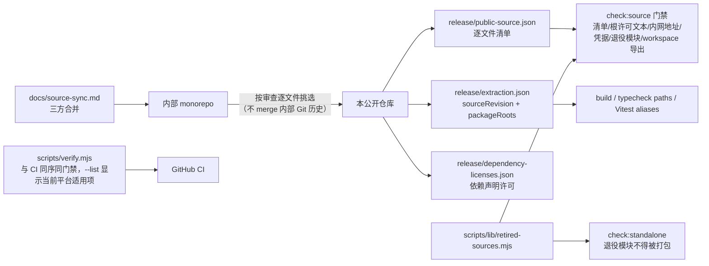
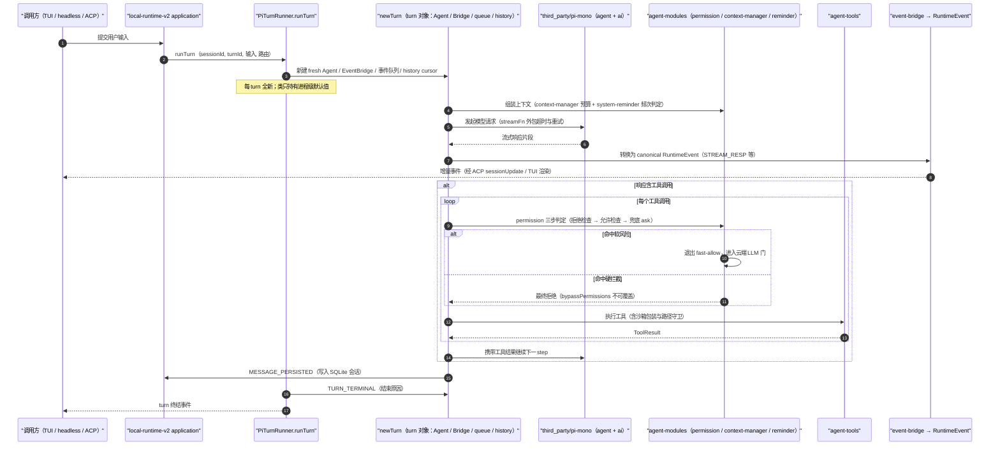
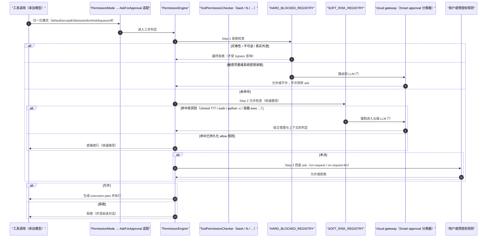
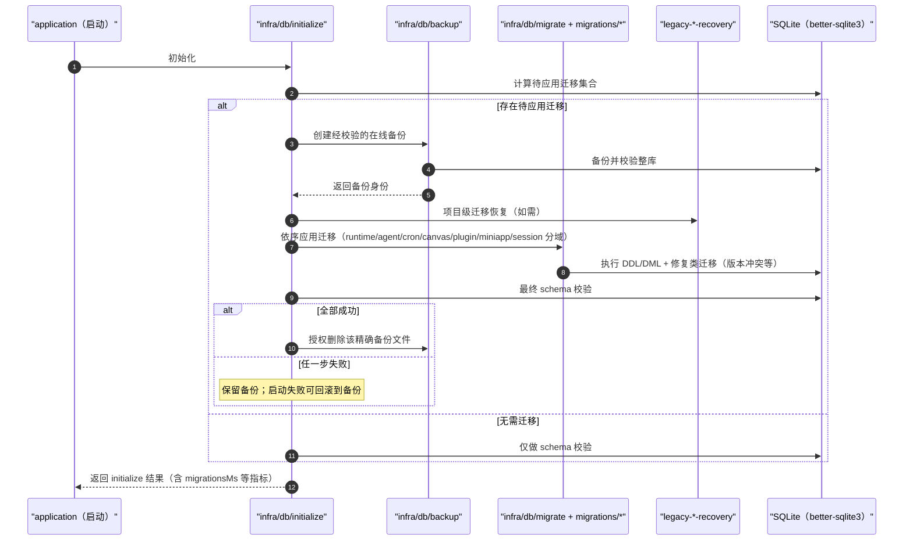
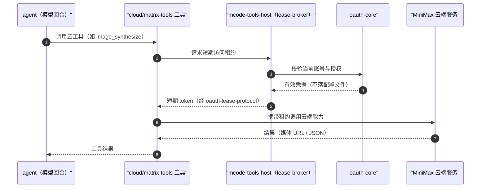

# 竞品研究 05：MiniMax 编码 CLI / Agent（开源）

> **研究方式**：`git clone --depth 1` 三个真实仓库到 `.research-cache/`，逐一读源码、README、仓库内文档与发布契约文件；辅以 GitHub API 元数据与 WebSearch 定位仓库。
>
> **研究快照**：`MiniMax-AI/minimax-code` @ `main`（2026-09-20 推送）；`MiniMax-AI/cli` @ `main`（2026-09-19 推送）；`MiniMax-AI/Mini-Agent` @ `main`（2026-02-14 推送）。GitHub API 元数据采集于 2026-09-21。
>
> **证据时点（R09 补齐克隆 commit）**：`minimax-code` HEAD `73a2581c6c7525628342f33b53907d4f7bdc146e`（2026-09-20）、`cli` HEAD `33453cf123927f41c00e1935450e504d8a630763`（2026-09-19）、`Mini-Agent` HEAD `d76a4f6389688cabda39c224a6cdfa274215d47c`（2026-02-14），均为本地浅克隆（`.research-cache/`）实读。
>
> **证据分级**：`[E1]` 读源码/仓库内文件（给路径与符号）；`[E2]` 官方 README / 官网 / package.json / 发布契约；`[E3]` 第三方分析；`[E4]` 推断（显式写推理链）。

---

## 0. 前提核验与对象更正（重要）

任务书把研究对象的名称写为 "MiniMax CLI（近期开源）"，并要求"source-level read of its harness: loop, tools, permissions, session storage, MCP, plugins, providers"。**按此描述检索后，需要更正"对象唯一"的隐含前提：MiniMax 官方在 GitHub `MiniMax-AI` 组织下同时存在三个不同性质的产物，只有第二个是任务书所描述的 harness。**

| # | 仓库 | 实际性质 | 是否任务的 harness 对象 | 证据 |
| --- | --- | --- | --- | --- |
| A | `MiniMax-AI/cli`（npm `mmx-cli`，可执行名 `mmx`） | **平台能力 CLI**：文本/图像/视频/语音/视觉/搜索/额度/文件/配置 + "把 MiniMax 配进别的 agent"；**没有 agent 循环** | ❌ 不是 harness（下详） | `[E1] packages 无 agent 运行时；src/agent/* 是第三方 agent 的安装与配置器` |
| B | `MiniMax-AI/minimax-code`（npm `@minimax-ai/code`，可执行名 `mcode`） | **开源终端编码 agent**（TUI + headless + ACP），自带权限引擎、沙箱、插件、MCP、会话库、BYOK 与托管账号 | ✅ **就是它** | `[E2] package.json description: "Standalone MiniMax Code TUI with managed accounts, BYOK models, cloud tools, plugins and ACP."`；`[E2] topics: coding-agents, harness, minimax` |
| C | `MiniMax-AI/Mini-Agent` | Python 编写的**教学式单 agent demo**（523 行循环 + 基础工具 + MCP + Claude Skills + ACP 桥） | ⚠️ 是 harness，但为 demo 且已停更 7 个月 | `[E2] pyproject description: "Minimal single agent demo with basic file tools and MCP support"` |

**为什么 A 不是 harness（关键负证据）**：`MiniMax-AI/cli` 的 `src/agent/` 目录只有 5 个文件——`types.ts`（第三方 agent 枚举 `claude-code|codex|grok|opencode|hermes|pi` 与 MiniMax 模型目录）、`availability.ts`（扫 PATH 与运行时环境标记探测已装 agent）、`installer.ts`（按 agent 走 npm 包或官方安装脚本）、`configurator.ts`（42 KB，改写各 agent 的 `settings.json` / `config.toml` / `opencode.json` / `models.json` 把 MiniMax 设为 provider）、`verify.ts`。它**没有任何主循环、工具注册表、权限、会话存储**；`src/commands/text/repl.ts` 只是一个带 `/exit` `/clear` `/system` `/model` `/save` `/help` `/history` 的聊天 REPL，`/save` 把对话写成 JSON 文件即止 `[E1]`。

（对照：A 的正确定位是"**被集成**"方向——`mmx config export-schema` 把自身命令导出为 Anthropic/OpenAI 兼容工具 schema 供别的 agent 调用；`npx skills add MiniMax-AI/cli -y -g` 把 `skill/SKILL.md` 装进 agent `[E1]/[E2]`。这属于我们卷 29 的"生态集成"而非卷 12 的"Agent 运行时"。）

**同时记录的生态事实**：`MiniMax-AI` 组织下与本课题相关的还有 `MiniMax-MCP`（官方 MCP server，Python，1585 ★）、`MiniMax-MCP-JS`、`MiniMax-Coding-Plan-MCP`（专为编码套餐设计的 MCP server）、`MiniMax-Code-Plugins`（社区插件注册表与投稿工具，17 ★）、`MiniMax-AI/skills`（13,613 ★）、`OpenRoom`（浏览器内桌面，AI 操作应用的实验，1264 ★）、`MiniMax-Provider-Verifier`（51 ★）`[E2] GitHub API`。

> **对 Phase A 的影响**：`docs/harness/00-vision-and-product.md` 若引用 "MiniMax CLI" 作为竞品，应**改标为 MiniMax Code / `mcode`**，并把 `mmx`（平台 CLI）与 `Mini-Agent`（demo）分开归档，避免把三者能力混算进同一行对标。

---

## 1. 结论速览（10 条）

1. **MiniMax Code 是"半自研 harness"**：主循环、模型协议与终端基础设施来自 **vendor 进来的 `third_party/pi-mono`**（含 `packages/agent`、`packages/ai`、`packages/coding-agent`、`packages/tui` 四个上游包），MiniMax 自研的是 `agent-core`（turn runner / 事件桥 / 重试 / 计量）、`agent-modules`（权限、上下文、goal、cron、MCP、skills、hooks、runaway-guard）、`local-runtime(-v2)`（SQLite 会话与迁移）、`tui` 与 `agent-tools` `[E1] docs/architecture.md:10`、`[E1] third_party/pi-mono/packages/*`。
2. **架构一句话**：`TUI / exec / ACP → CliService → local Applications → Session / Turn / Agent 服务 → Pi / 模型 provider / 本地工具`；`local-runtime-v2/src/application` **刻意不实例化 DesktopService、不设 HTTP 前门、不含云交接服务** `[E1] docs/architecture.md:3-7`。
3. **权限系统是全仓最重的模块（16,672 行 TS）**，且是**分层判定**：确定性硬拦截注册表（`HARD_BLOCKED_REGISTRY`，灾难性/不可逆/真实外泄→最终拒绝；敏感凭据读取→交给 LLM 门并倾向询问；**`bypassPermissions` 永不静默覆盖硬拦截**）+ 软风险注册表（`chmod 777`/`sudo`/`python -c`/容器 exec 等→强制退出快速放行路径、进入云端 LLM 门）`[E1] packages/agent-modules/permission/src/classifier/dangerous-patterns.ts:1-18`。
4. **六种权限模式 + 四种 ask 策略 + 三级规则来源**：`PermissionMode = default | acceptEdits | bypassPermissions | auto | dontAsk | off`；内部策略 `AskForApproval = on-request | on-request-llm | never | deny`；规则 `source: global | agent | session`，shell 规则支持 `exact | prefix | wildcard`（另有 `argvPrefix`，R09 复核补），落盘为 `permission.json` `[E1] packages/agent-modules/permission/src/types.ts:13-52`（模式/规则部分；R09 复核修正：`AskForApproval` 不在 types.ts，实际定义于 `packages/agent-modules/permission/src/ask-policy.ts:26`，并由 `modeToAskPolicy()` 做映射）。
5. **沙箱是"带 MITM 代理的凭据感知沙箱"**（`third_party/sandbox-runtime`，Apache-2.0，pin `0.0.74-mcode.2` / source rev `630552a3…`）：拒绝优先的网络策略、每次调用净化的 `baseEnv`、调用方提供的临时目录、"**即使网络代理关闭仍保持文件保护**"；源码含 `mitm-ca`/`mitm-leaf`/`tls-terminate-proxy`/`body-substitution`/`aws-sigv4`/`credential-mask-env`/`credential-mask-files`/`credential-sentinel`/`generate-seccomp-filter`/`linux-violation-monitor` `[E1] third_party/sandbox-runtime/README.md`、`[E1] third_party/sandbox-runtime/src/sandbox/*`。
6. **上下文与"提醒"分离得很干净**：`context-manager` 只管预算估算（`context-usage-estimator`、`count-tokens-body`、`provider-budget`、`token-estimator`），`system-reminder` 是独立的**带频次类型的提醒注册表**：`SystemReminderFrequencyType = FIRST_TURN_ONLY | EVERY_TURN | TURN_BACKOFF | COOLDOWN | ONE_SHOT` `[E1] packages/protocol/src/runtime.ts:137-143`、`[E1] packages/agent-modules/system-reminder/src/*`。
7. **工具面分三档披露**：`AgentToolMode = OMIT | INLINE | TOOL_SEARCH`，配套 `mcp-disclosure` 模块（`search-index`、`tokenize`、`tool-search`、`plan`、`hint`、`mcp-invoke`）——**MCP 工具可以按需检索而不是全量塞进请求** `[E1] packages/protocol/src/runtime.ts:131-135`、`[E1] packages/agent-tools/src/mcp-disclosure/*`。
8. **运行时可观测面很小但稳定**：`RuntimeEventType = { STREAM_RESP=1, ACTION_REQUIRED=2, SESSION_STATUS=3, TURN_TERMINAL=4, DEBUG_TRACE=5, MESSAGE_PERSISTED=6 }`，且"**部分数值枚举为兼容既有已存会话而保留**" `[E1] packages/protocol/src/runtime.ts:121-129`、`[E1] docs/architecture.md:8`。
9. **会话持久化用 SQLite + 有序迁移 + 迁移前在线备份**：`better-sqlite3`，迁移按域分目录（`runtime`/`agent`/`cron`/`canvas`/`plugin`/`miniapp`/`session`），版本号已到 `0036+`；`initialize.ts` 在有待应用迁移时**先做整库校验的在线备份**并在全部迁移与最终 schema 校验成功后才授权删除备份文件 `[E1] packages/local-runtime-v2/src/infra/db/{initialize.ts,backup.ts,migrate.ts}`。
10. **仓库治理是本次研究里最独特的资产**：本仓库是"内部 monorepo 的**已审查公开投影**"——`release/public-source.json` 是逐文件清单、`docs/source-sync.md` 定义三方合并、`check:source` 把关内网地址/凭据/退役模块、`scripts/lib/retired-sources.mjs` 列出的路径"必须不存在且不得被打包"、`@mavis/*` 私有包在构建期由源码解析而非内部 registry；另有 `docs/open-source-status.md` 明示"**能力已恢复 ≠ 已通过在线验收**"并逐项标注 NOT RUN 边界 `[E1] AGENTS.md`、`[E1] docs/architecture.md:12-16`、`[E1] docs/open-source-status.md`、`[E1] docs/tui-capabilities.md`。

---

## 2. 产品与仓库事实

### 2.1 主体：MiniMax Code（`mcode`）

| 项 | 值 | 证据 |
| --- | --- | --- |
| 仓库 | `MiniMax-AI/minimax-code` | `[E2]` |
| 定位 | "An open-source coding agent for your terminal, powered by MiniMax." | `[E2]` GitHub description |
| 许可 | **MIT**（第一方默认）；`third_party/sandbox-runtime` 保持 **Apache-2.0**；Pi 派生代码、模型目录与打包资产保留各自原声明；根 MIT"**不代表每个文件或打包组件都是 MIT**" | `[E1] LICENSE-STATUS.md`、`[E2] NOTICE`（归属名 "MiniMax Code"） |
| 语言 / 运行时 | TypeScript（ESM），Node `>=22.19 <23 \|\| >=24.2 <27`，pnpm `9.12.0` | `[E1] package.json` |
| 版本 | 仓库 `package.json` `0.5.0`；README 提到的已发布 npm 版本为 `@minimax-ai/code@0.4.12`（TUI 能力目标标为 **0.4.12**） | `[E1]/[E2]` |
| 星标 / Fork | 1,485 / 166（2026-09-21） | `[E2]` |
| 创建 / 最近推送 | 2026-06-01 / 2026-09-20 | `[E2]` |
| 官方入口 | 官网 `https://agent.minimax.io/download`；安装脚本 `https://filecdn.minimax.chat/public/install.sh` / `install.ps1`；npm `@minimax-ai/code` | `[E2] README` |
| 安装形态 | 官方安装器（自动准备兼容 Node 运行时、**不需要 sudo/管理员**，Alpine/musl 不支持）→ `~/.minimax-code`，启动器 `bin/mcode`、`bin/mcode-tools`；或 `npm i -g` | `[E2] README` |
| 数据目录 | `~/.minimax`（选 profile 时为 `~/.minimax-<profile>`），可用 `MINIMAX_DATA_DIR` 或 `MAVIS_DATA_DIR` 覆盖；安装目录与之分离 | `[E2] README` |
| 工作区规模 | 14 个一方包 + `packages/agent-modules/*` 12 个模块包；一方 TS 约 **32,382 行**（不含测试） | `[E1] find`+`wc` |
| 文档 | `docs/` 15 篇（architecture / tui-capabilities / telemetry / verification / releasing / source-sync / performance-ci / open-source-status / release-audit / publication-authorization / maintainers / installation / examples / demo） | `[E1]` |
| 示例工程 | `examples/clamp`（README 的 20 秒演示即修此工程） | `[E1]` |

### 2.2 对照对象一：平台 CLI `mmx`（`MiniMax-AI/cli`）

| 项 | 值 | 证据 |
| --- | --- | --- |
| 性质 | "The official CLI for the MiniMax AI Platform — Built for AI agents. Generate text, images, video, and speech — from any agent or terminal." | `[E2] README` |
| 许可 / 语言 | MIT；TypeScript，Bun 开发（`bun run build.ts`）+ Node ≥18 运行 | `[E1] package.json` |
| 星标 / 创建 / 推送 | 2,158 ★；2026-03-25 / 2026-09-19 | `[E2]` |
| 包名 / bin | `mmx-cli` / `mmx`；`./sdk` 子路径导出 `dist/sdk.mjs` 与类型 | `[E1] package.json` |
| 命令面 | `text chat|repl`、`image generate`、`video generate|task get|download`、`speech synthesize|transcribe|voices`、`vision describe`、`search query`、`quota show`、`file upload|list|delete`、`auth login|status|refresh|logout`、`config show|set|export-schema`、`update`、`agent setup`、`help` | `[E1] src/registry.ts` |
| 双区域 | `global`=api.minimax.io / `cn`=api.minimaxi.com；OAuth 主机另列；区域可自动探测并保存 | `[E1] src/config/schema.ts` |
| 认证 | OAuth（`~/.mmx/credentials.json`：access/refresh/expires_at/region/resource_url/account）或 API key（`~/.mmx/config.json`）；`MINIMAX_API_KEY`、`MINIMAX_REGION` | `[E1] src/config/schema.ts`、`[E1] skill/SKILL.md` |
| Agent 集成（关键） | `mmx agent setup` 探测并配置 **claude-code / codex / grok / opencode / hermes / pi** 六个第三方 agent；探测方式为 PATH 扫描 + 运行时环境标记（`CLAUDE_CODE_CHILD_SESSION=1`、`OPENCODE_CLIENT=desktop`、`HERMES_AGENT=true`、`PI_CODING_AGENT=true`、`CODEX_THREAD_ID`）；写目标含 `settings.json`、`config.toml`、`opencode.json(c)`、`models.json` | `[E1] src/agent/{availability.ts,installer.ts,configurator.ts}` |
| 模型目录 | `MiniMax-M3`（1,000,000 上下文 / 128,000 输出 / 支持 image 输入）、`MiniMax-M2.7`、`MiniMax-M2.7-highspeed`（204,800 / 131,072，纯文本） | `[E1] src/agent/types.ts` |
| 工具 schema 导出 | `mmx config export-schema [--command "video generate"]` 输出 Anthropic/OpenAI 兼容工具 schema（排除 auth/config/update），供 agent 框架动态注册 | `[E1] skill/SKILL.md` |
| 退出码契约 | `0` 成功 / `1` 一般 / `2` 用法 / `3` 认证 / `4` 额度 / `5` 超时 / `6` 网络 / `10` 内容过滤 | `[E1] src/errors/codes.ts` |
| Agent 使用约定 | `--non-interactive`、`--quiet`（stdout 纯数据）、`--output json`、`--async`、`--dry-run`、`--yes`；stdout 只输出数据、进度走 stderr | `[E1] skill/SKILL.md` |
| 随包技能 | `skill/SKILL.md`（mmx 使用指南）+ `skill/h3-video/SKILL.md`（H3 视频专项）；安装方式 `npx skills add MiniMax-AI/cli -y -g` | `[E1]/[E2]` |

### 2.3 对照对象二：Python demo `Mini-Agent`

| 项 | 值 | 证据 |
| --- | --- | --- |
| 性质 | "a minimal yet professional demo project that showcases the best practices for building agents with the MiniMax M2.5 model"，Anthropic 兼容 API | `[E2] README` |
| 许可 / 语言 | MIT；Python ≥3.10 | `[E1] LICENSE`、`[E1] pyproject.toml` |
| 星标 / 创建 / 推送 | 3,037 ★；2025-10-31 / **2026-02-14**（已 7 个月未更新） | `[E2]` |
| 入口 | `mini-agent`（CLI）与 `mini-agent-acp`（`mini_agent.acp.server:main`） | `[E1] pyproject.toml [project.scripts]` |
| 规模 | `mini_agent/` 约 3,352 行 Python（含 CLI/LLM/工具），另含 15 个 Claude Skills 作为 git submodule | `[E1] wc`、`[E1] .gitmodules` |
| 依赖 | `anthropic`、`openai`、`mcp>=1.0.0`、`agent-client-protocol>=0.6.0`、`tiktoken`、`pydantic`、`prompt-toolkit` | `[E1] pyproject.toml` |

---

## 3. 架构总览

### 3.1 源码边界（官方原文）

```text
TUI / exec / ACP → CliService → local Applications → Session / Turn / Agent services → Pi / model providers / local tools
```

`[E1] docs/architecture.md:3`。逐项职责（同文 5-16 行）：

- `packages/tui`：终端交互 + **headless 与 ACP 适配器**。
- `packages/local-runtime-v2/src/local`：**进程内产品入口**；session 查询视图与队列契约由 local service 类型与转换器派生。
- `packages/local-runtime-v2/src/application`：会话、队列、交互；**不实例化 DesktopService、HTTP 前门或云交接服务**。
- `packages/protocol/src/{local.ts,runtime.ts}`：CLI 数据结构与 agent 配置/事件；**不含 RPC 信封、服务路由、认证头或 IDL 生成链**；"部分数值枚举为兼容既有已保存会话而保留"。
- `packages/local-runtime`：复用的宿主设施（数据库、文件工具、权限、存储）；历史读取器**只读旧会话文件，不代理到 daemon、不回退到 legacy 执行器**。
- `@mavis/*` 是**本仓库内私有 workspace 包**的命名，构建期直接解析源码而非从内部 registry 下载；它们**不是独立发布的 npm API**。
- 「未使用的 `@mavis/team` 循环引擎被排除在本次投影之外；TUI 委派改用当前 runtime 的 task 服务」`[E1] docs/architecture.md:14`。

### 3.2 架构图

```mermaid
flowchart TB
  subgraph Entry["入口层（packages/tui）"]
    TUI["tui/ 交互式终端 UI"]
    HEAD["headless/ 一次性 runner<br/>runner/supervisor/settlement/exit-policy"]
    ACPAD["acp/ ACP 适配器<br/>agent/commands/interactions/runtime/stdio"]
    CLI["cli/ 命令面（mcode CLI）"]
  end

  subgraph Local["进程内运行时（local-runtime-v2）"]
    APP["src/application<br/>session / agent / conversation / queue"]
    LOCALP["src/local 进程内产品入口"]
    INFRA["src/infra<br/>db(SQLite) / event-bus / file"]
    COMPAT["src/compat/v1 历史会话读取器"]
  end

  subgraph Core["agent-core（一方组装层）"]
    PTR["pi-turn-runner<br/>每 turn 新建 Agent / EventBridge / queue / history"]
    BRIDGE["event-bridge<br/>pi 事件 → canonical RuntimeEvent"]
    RETRY["llm-retry（963 行）+ metrics（1230 行）"]
  end

  subgraph Modules["agent-modules（一方能力模块）"]
    PERM["permission<br/>16672 行：引擎 + 分类器 + execution-plan"]
    CM["context-manager<br/>预算估算"]
    REM["system-reminder<br/>频次注册表"]
    GOALM["goal（含 verification 子模块）"]
    CRONM["cron（active-hours / busy-queue / report-delivery）"]
    MCPM["mcp（connection-pool / name-registry / transports）"]
    SKILLM["skills（registry / directory-watcher）"]
    HOOKM["plugin-hooks（parser / runner / coordinator）"]
    RUNAWAY["runaway-guard（turn-local 循环检测）"]
    BGT["background-task（manager / stores）"]
    SREP["session-report（llm-call-report-store）"]
  end

  subgraph Tools["agent-tools（97 文件）"]
    BUILTIN["desktop/builtin-defs<br/>read/write/edit/bash/grep/glob/todowrite/skill/code_review"]
    BROWSER["builtin-browser-defs<br/>browser + 12 个 browser_* 工具"]
    CLOUD["cloud/matrix-tools<br/>18+ 多模态生成/理解工具"]
    TASKT["task / task_control / task_append / subagent-roles"]
    DISCLOSE["mcp-disclosure<br/>tool-search / search-index / plan / hint"]
    PH["plugin-hooks 工具适配"]
  end

  subgraph Third["third_party（vendor）"]
    PI["pi-mono<br/>packages/agent · ai · coding-agent · tui"]
    SBXRT["sandbox-runtime 0.0.74-mcode.2（Apache-2.0）<br/>MITM 代理 + 凭据遮蔽 + seccomp"]
  end

  subgraph Host["宿主服务"]
    OAUTH["oauth-core（账号/刷新/登出）"]
    LEASE["mcode-tools-host lease-broker<br/>+ oauth-lease-protocol"]
    CFG["config（profile / config.yaml / provider）"]
    PROTO["protocol（local.ts / runtime.ts）"]
  end

  TUI --> CLI
  HEAD --> CLI
  ACPAD --> CLI
  CLI --> LOCALP --> APP
  APP --> INFRA
  APP --> COMPAT
  APP --> PTR
  PTR --> PI
  PTR --> BRIDGE
  PTR --> RETRY
  PTR --> Modules
  Modules --> Tools
  Tools --> PI
  PERM --> SBXRT
  BUILTIN --> SBXRT
  LEASE --> OAUTH
  CLOUD --> LEASE
  APP --> CFG
  APP --> PROTO
```



依据：`[E1] docs/architecture.md`、`[E1] packages/*` 目录与文件清单、`[E1] packages/package.json`。

### 3.3 公开发布模型（本次研究独有的"仓库契约"）



依据：`[E1] AGENTS.md`、`[E1] docs/architecture.md:12-16`、`[E1] docs/source-sync.md`、`[E1] package.json scripts`。

---

## 4. 24 维度逐项分析

> 主体为 `minimax-code`；`mmx` 与 `Mini-Agent` 仅在构成对照时点出。"未观测到"附检索词与负证据。

### 4.1 进程与运行拓扑

- **单进程、无客户端-服务端拆分**（这是与 DeepSeek Harness / Qoder 类产品的最大形态差异）：`local-runtime-v2/src/local` 即"**进程内产品入口**"，`application` 层明确不实例化 HTTP 前门或云交接服务 `[E1] docs/architecture.md:5-7`。
- 三个前端形态共用同一进程内服务栈：交互式 TUI、**headless**（`tui/src/headless/`：`runner`/`supervisor`/`settlement`/`exit-policy`/`progress`/`output`/`error-presentation`/`model-selection`/`diagnostics`）、**ACP**（`tui/src/acp/`：`agent`/`commands`/`control-state`/`extensions`/`interactions`/`model-selection`/`paths`/`prompt-continuation`/`runtime`/`stdio`/`updates`）`[E1] packages/tui/src/*`。
- 对外 IPC 有两种：**ACP over stdio**（给 Zed 等客户端）与 **`mcode-tools-host` 的本地租约通道**（`oauth-lease-protocol/src/{node-server,node-client,codec,endpoints}.ts`，向工具子进程发放**短期访问令牌**）`[E1]`。
- 另有与外部服务通信的 `browser-core`、`matrix-client`/`matrix-mcp-server`/`matrix-mcp-stdio`（云多模态工具）、`cloud-gateway`/`http-cloud-gateway-client`（权限分类器）`[E1] packages/browser-core`、`[E1] packages/agent-tools/src/{cloud,desktop}/matrix-*`、`[E1] packages/agent-modules/permission/src/*cloud*`。

### 4.2 Agent 主循环与回合模型

- 组装者是 `PiTurnRunner`（`packages/agent-core/src/pi-turn-runner/pi-turn-runner.ts`，249 行）："为单个 turn 组装 pi-coding-agent 的运行时，并把其事件流桥接为规范 `RuntimeEvent`"；**每次 `runTurn` 都新建 fresh Agent、EventBridge、事件队列与 history cursor**；"每 turn 状态留在 `newTurn(...)` 创建的 turn 对象内，类本身只持有进程级默认值" `[E1] pi-turn-runner.ts:1-10`。
- 由此可得其核心设计立场：**turn 是无共享状态的单元**，可复用的只有配置；这与 DeepSeek Harness 的"长活 Agent + inbox 投影"取向相反 `[E4]`（由两侧源码结构对比推断）。
- 回调节点（`turn.ts` 导入的 hook 家族）覆盖：`PiBeforeLlmCallHook`、`PiAfterLlmCallHook`、`PiOnLlmCallPreparedHook`、`PiBeforeToolCallHook`、`PiAfterToolCallHook`、`PiOnHistoryChangedHook`、`PiOnStepEndHook`、`PiToolExecutionStartHook` `[E1] packages/agent-core/src/pi-turn-runner/turn.ts:12-21`。
- 可靠性与超时：`llm-retry.ts`（963 行）提供 `withLLMRetry` + `LLMCallScope` + `LLMCallSettledEvent`；`defaults.ts` 导出 `LLM_REQUEST_TIMEOUT_MS`；`llm.ts` 的 `wrapStreamFnWithTimeout` 把超时包在 streamFn 外层 `[E1]`。
- 计量与降级：`metrics.ts`（1230 行）是"每 turn 的 metrics/provenance/degradation 记录器，缺失时仅禁用发射"；`assembly-fingerprint.ts`（71 行）对每次组装打指纹；`tool-context-size.ts`（238 行）估算工具上下文体积 `[E1]`。
- 消息 ID 分配是**可注入契约**：`PiMessageIdAllocator.allocateAssistantMessageId(sessionId, turnId)`，调用方可返回 archon_server 的 `BeginAssistantMessage` RPC 分配 id，本地调用者用 UUID `[E1] pi-turn-runner.ts:35-43`。
- 迭代上限：一方 runtime 未在协议层固定；对照 `Mini-Agent` 明确 `max_steps: int = 50`，`Agent.run()` 以 `while step < self.max_steps` 循环，达到上限返回 "Task couldn't be completed after N steps." `[E1] mini_agent/agent.py:53,343,517`。

### 4.3 工具系统

- 工具定义与实现集中在 `packages/agent-tools`（**97 个非测试文件**），按域分四组：`desktop/`（本地与内置）、`cloud/matrix-tools/`（云多模态）、`mcp-disclosure/`（MCP 检索披露）、`plugin-hooks/`（插件钩子桥）`[E1] find`。
- 内置工具名（`desktop/builtin-defs.ts`）：`read`、`write`、`edit`、`bash`、`grep`、`glob`、`todowrite`、`skill`、`code_review`；浏览器族（`desktop/builtin-browser-defs.ts`）：`browser`、`browser_inspect`、`browser_navigate`、`browser_click`、`browser_type`、`browser_press_key`、`browser_scroll`、`browser_hover`、`browser_wait_for`、`browser_get_dom`、`browser_screenshot`、`browser_paste`、`browser_verify_text`、`browser_inspect_editable_targets` `[E1]`。
- 运行时扩展工具：`local-task`/`local-task-control`/`local-task-append`（**委派任务**）、`subagent-roles.ts`、`task-verification.ts`（**任务验证**）、`local-memory.ts`（记忆）、`local-skill.ts`、`local-web-search.ts`/`local-webfetch.ts`、`local-website-deploy.ts`、`local-mavis.ts`/`local-mavis-commands.ts`/`local-mavis-cron-adapter.ts`、`local-todowrite.ts`、`local-code-review.ts`、`local-feature-enable.ts`、`local-ask-user.ts` `[E1] packages/agent-tools/src/desktop/*`。
- 检索实现细节：`local-rg-runner.ts` 独立封装 ripgrep 调用；`path-guard.ts`（desktop 与 cloud/matrix-tools 各一份）做路径越界防护；`output-limit.ts` 限制输出体量；`local-sensitive.ts` 处理敏感内容 `[E1]`。
- 工具输出与上下文控制：PTC 类比物未见（无"模型写代码调工具"），取而代之的是**三档工具披露** `AgentToolMode = OMIT | INLINE | TOOL_SEARCH` + `mcp-disclosure` 的 `search-index`/`tokenize`/`tool-search`/`plan`/`hint`/`mcp-invoke`——MCP 工具在 `TOOL_SEARCH` 模式下**先被检索再注入**，并以 `mcp-disclosure/hint.ts` 给出提示 `[E1] packages/protocol/src/runtime.ts:131-135`、`[E1] packages/agent-tools/src/mcp-disclosure/*`。
- 云工具（`cloud/matrix-tools/tool-defs.ts`，18+ 个）：`images_understand`、`image_synthesize`、`images_search_and_download`、`image_reverse_search`、`submit_video_generation`、`query_video_generation`、`gen_videos`、`batch_text_to_video`、`batch_image_to_video`、`get_voice_list`、`batch_text_to_audio`、`batch_text_to_music`、`synthesize_speech`、`batch_synthesize_speech`、`audios_understand`、`videos_understand`、`transcribe_audio`、`web-search`，另有 `file-transfer.ts`、`iso-bmff-duration.ts`（视频时长解析）、`aigc-helpers.ts` `[E1]`。
- 云工具的凭据不落配置文件：由 `mcode-tools-host` 的 **lease broker 发放短期 token** 给工具子进程（`lease-broker.ts`、`resource.ts`、`integration.ts`、`contracts.ts`），协议在 `oauth-lease-protocol` `[E1]`。

### 4.4 权限与审批

- 模式/策略/规则三层（见结论 4）。附：`acceptEdits` 是"**default + 预置 edit/write allow 规则的别名**"——别名在启动期播种，运行时按 default 处理；`dontAsk` 的语义是"**不问；除非已预授权否则拒绝**"；`bypassPermissions`/`off` 映射为 `never` `[E1] packages/agent-modules/permission/src/ask-policy.ts:22-50`。
- **三步判定流**（`engine.ts` 头部注释给出）：`Step 1 拒绝检查（硬拦截，不受 bypass 影响）→ Step 2 允许检查（快速路径）→ Step 3 兜底（passthrough → ask）`；工具特化逻辑交给注册的 `ToolPermissionChecker`（如 bash、文件系统）`[E1] packages/agent-modules/permission/src/engine.ts:1-20`。
- **两套分类器注册表**（`classifier/dangerous-patterns.ts` 是唯一事实源）：
  - 硬拦截：灾难性/不可逆/**真实外泄**命中 → 最终拒绝；**敏感凭据/系统密钥读取** → 路由到 LLM 门，LLM 不能放行时转 ask；"`bypassPermissions` 永不静默覆盖这些命中"。
  - 软风险：可疑但可能合法的模式（`chmod 777`、`sudo`、`python -c`、容器 exec 等）→ **强制 bash 分类器离开 fast-allow 路径、进入云端 LLM 门**，让 LLM 结合意图/上下文判断。
  - 文件头注释还交代了历史来源（"Reference: agent-server desktop_rules_data.py (HARD_BLOCKED_*)"），说明这是**从既有 Python 实现迁移到 TS 的规则资产** `[E1] classifier/dangerous-patterns.ts:1-18`。
- 规则可**持久化到磁盘**：`permission.json`（`types.ts` 明确其为 "Permission File Config (§3.2 on-disk schema)"）；规则变更操作有 `addRules`/`replaceRules`/`removeRules` 三种类型，均带 `source` 与目标 `destination` `[E1] packages/agent-modules/permission/src/types.ts:218-243`。
- 与沙箱/宿主协作的辅助件：`execution-plan.ts`（执行计划）、`written-files-registry.ts`（已写文件登记，105 行）、`windows-trash-execution.ts`（Windows 走回收站的删除执行，45 行）、`conversation-renderer.ts`（把判定结果渲染进对话）、`effective-input.ts`（生效输入）、`mcp-runtime-name.ts`（MCP 运行时名匹配，与 DeepSeek 的命名空间思路同向）`[E1] packages/agent-modules/permission/src/*`。
- 云端判定是**可插拔客户端**：`cloud-classify-client.ts`、`cloud-gateway.ts`、`http-cloud-gateway-client.ts`（真实 HTTP）、`in-memory-cloud-gateway-client.ts`（测试替身）`[E1]`。
- **循环自保护**与权限分离：`runaway-guard` 是"**turn-local 检测器与提醒策略**——本模块不属于任何 Agent、不做生命周期注册、不做宿主 IO、不写 Memory、不做持久化"；`remindAfterOccurrences` 最小值为 **3**；支持 per-tool 策略与 `replay.ts` `[E1] packages/agent-modules/runaway-guard/src/guard.ts:19-46`。
- 用户交互工具与权限协作：`local-ask-user.ts`、`prepare-ask-user-arguments.ts` `[E1]`。

### 4.5 上下文管理

- `context-manager` 模块（8 个文件）职责单一：`context-usage-estimator.ts`、`count-tokens-body.ts`、`provider-budget.ts`、`token-estimator.ts`、`settings.ts`、`manager.ts`、`types.ts` `[E1] packages/agent-modules/context-manager/src/*`。
- **模型能力即协议字段**：`IModelCapabilities` 含 `support_image`、`support_video`、`max_image_bytes_inline`、`max_video_bytes_inline`、`max_request_body_bytes`、`max_attachments_count`、`support_files_api`、`max_video_bytes_files_api`、`files_api_upload_endpoint`、`files_api_ref_scheme`、`files_api_file_id_ttl_sec`、`thinking_mode`；配套 `IThinkingBudgets{minimal|low|medium|high}` `[E1] packages/protocol/src/runtime.ts:174-198`。这是"**附件大小/数量/文件 API 引用 TTL 由模型能力驱动**"的一种明确做法。
- 提醒与上下文**分离**：`system-reminder` 提供频次类型 `FIRST_TURN_ONLY | EVERY_TURN | TURN_BACKOFF | COOLDOWN | ONE_SHOT`，并有 `blocks.ts`/`providers.ts`/`registry.ts`/`service.ts`/`todo-state.ts`/`evolution.ts`/`collaborators.ts`/`dependencies.ts`/`plugin-reference.ts`/`mcode-tools-master-reminder.ts` `[E1] packages/protocol/src/runtime.ts:137-143`、`[E1] packages/agent-modules/system-reminder/src/*`。
- **缓存前缀稳定被显式设计**：`goal/continuation.ts` 头部注释——"完整契约只在 kickoff 消息注入一次；后续隐藏回合**只追加一条短提示**，使 canonical history 保持缓存前缀稳定，而不是每回合重复目标与固定规则" `[E1] packages/agent-modules/goal/src/continuation.ts:1-5`。
- 压缩：未观测到独立的 compaction 包或压缩事件（对照 DeepSeek 的 `compaction/*` 三事件与 Claude Code 的 auto-compact）；`Mini-Agent` 侧则有明确的"按用户回合摘要"压缩（见 4.12 与 §5）`[E1]`（负证据：`find packages -iname "*compact*"` 无命中）。

### 4.6 提示词组织

- Agent 预设以**资产目录**形式存在：`packages/local-runtime-v2/assets/agents/{_default,_v2,_migration,desktop-task,explore,mavis,verifier,worker,workflow}`——即至少 **worker / explore / verifier / workflow / desktop-task** 五种角色化 agent，另有 `_default` 与迁移用 `_migration` `[E1] find`。
- 系统提示来源：`packages/local-runtime/assets/prompts/`（内置提示）+ `mini_agent/config/system_prompt.md`（对照对象 C 的做法）+ 运行期由 `agent-runtime` 的 `prompt-read.ts`/`internal-turn-prompt-read.ts` 读取 `[E1]`。
- 项目级指令：`mcode init .` 生成或更新项目导引 `AGENTS.md`（与 Codex/DeepSeek 同一约定），仓库自身也有 `AGENTS.md`（6.7 KB）`[E2] README`、`[E1] AGENTS.md`。
- 提醒注入见 4.5；插件能力会以 `plugin-reference.ts` 形式进入模型可见内容 `[E1]`。

### 4.7 MCP

- 模块 `packages/agent-modules/mcp/`：`runtime/connection-pool.ts`、`runtime/name-registry.ts`、`runtime/tool-name.ts`、`runtime/transport/{factory,stdio,http}.ts`、`index.ts`、`types.ts` `[E1]`。
- 传输由官方 SDK 提供，工厂只分两路：`stdio` 与 `http`/`sse`（`@modelcontextprotocol/sdk/shared/transport.js`）；可注入 `env`、`headers`、`fetchImpl` `[E1] packages/agent-modules/mcp/src/runtime/transport/factory.ts`。
- 连接池 + **名字注册表 + 工具名命名空间**三者齐备，解决多 server 同名工具冲突 `[E1]`。
- **MCP 披露策略**是特色：`AgentToolMode.TOOL_SEARCH` + `mcp-disclosure`（检索索引、分词、计划、提示、调用转发）——避免把全部 MCP 工具 schema 塞进每个请求 `[E1]`。
- 云侧另有 MiniMax 自家的 MCP 形态：`matrix-mcp-server.ts`/`matrix-mcp-stdio.ts` + `^ MiniMax-MCP`（官方独立仓库，Python/JS 双实现）`[E1] packages/agent-tools/src/desktop/matrix-mcp-*`、`[E2] GitHub API`。
- 未观测到 MCP OAuth 流程：检索 `oauth` 在 `packages/agent-modules/mcp/` 无命中；OAuth 仅用于 MiniMax 账号（`oauth-core`）与工具租约 `[E1]`（负证据）。

### 4.8 Skill / 插件机制

**Skill**：

- `packages/agent-modules/skills/`：`registry.ts`、`directory-watcher.ts`、`types.ts`、`index.ts`——**目录监听 + 注册表**，与 DeepSeek 的 skill 发现同构 `[E1]`。
- 资产 `packages/local-runtime/assets/skills/`（内置技能）；模型面工具 `skill`（`builtin-defs.ts`），宿主侧 `local-skill.ts` `[E1]`。
- 对照对象 C 用 Claude Skills 格式（`SKILL.md` + frontmatter，含 `allowed_tools`、`license`、`metadata`），并把**技能根目录路径注入提示**（"All files and references in this skill are relative to this directory."）`[E1] mini_agent/tools/skill_loader.py:20-47`。

**插件**：

- 市场只有两种：`McodePluginMarketplace = 'official' | 'local'`；**"任意市场注册与 GitHub URL 导入未在 CLI/TUI 暴露"**（官方明确的能力降级说明）`[E1] packages/tui/src/plugin/contract.ts:1`、`[E1] docs/tui-capabilities.md`。
- 插件视图暴露**能力计数**：`appCount`、`mcpServerCount`、`skillCount`；操作集合为 `install | remove | enable | disable`，另有 `listInstalledPlugins`/`listMarketplacePlugins`/`refreshPlugins` `[E1] packages/tui/src/plugin/contract.ts:4-40`。
- 插件元数据在协议层有完整模型：`IPluginRef{name, version, data_oss_key, archive_sha256, content_digest, icon_url?, dark_icon_url?}` 与 `IPluginCapabilityProvenance{plugin_name, plugin_version?, source, capability_type, capability_name, icon_url?, dark_icon_url?}`——**归档 SHA-256 + 内容摘要 + 能力来源归属** `[E1] packages/protocol/src/runtime.ts:145-166`。
- 插件钩子模块 `plugin-hooks`：`parser.ts`、`command-invocation.ts`、`runner.ts`、`coordinator.ts`、`effort.ts`、`output-artifacts.ts`、`wire-tool-adapter.ts`、`transcript.ts`、`contracts.ts`——与 DeepSeek 的 `hook-protocol` 同层定位（**复用既有 Claude Code 风格钩子**），但它另有"effort 分级"与"输出产物"两个成分 `[E1]`。
- 客户端侧插件 UI：`packages/tui/src/contributions/`；`/plugins` 与 `mcode plugin` 是管理入口 `[E1]`、`[E2] docs/tui-capabilities.md`。
- 社区插件注册表独立成仓（`MiniMax-Code-Plugins`，含投稿工具）`[E2] GitHub API`。

### 4.9 SubAgent / 多 Agent 编排

- 委派走 **runtime task 服务**而非独立 subagent 接缝：`local-task.ts`、`local-task-control.ts`、`local-task-append.ts`、`subagent-roles.ts`（角色定义）、`task-verification.ts`（**任务验证**）`[E1] packages/agent-tools/src/desktop/*`。
- 角色资产见 4.6（`worker`/`explore`/`verifier`/`workflow`/`desktop-task`/`mavis`）——其中 `verifier` 的存在说明**验证者是编制里的一等角色** `[E1] packages/local-runtime-v2/assets/agents/*`。
- Goal 模块自带 `verification/` 子模块：`evaluator-adapter.ts`、`evidence-brief.ts`、`subagent.ts`、`transcript-window.ts`、`verification-policy.ts`、`verifier-port.ts`——**"证据简报 + 独立 subagent 验证 + 策略 + 可替换 verifier 端口"** `[E1] packages/agent-modules/goal/src/verification/*`。
- **多 agent 团队引擎被刻意排除**："未使用的 `@mavis/team` 循环引擎被排除在本次投影之外；TUI 委派改用当前 runtime task 服务" `[E1] docs/architecture.md:14`——即**内部曾有团队/循环引擎但不开源**。这是"团队/多 agent 是否值得做"的一个重要负面信号 `[E4]`（推断：其内部实现未达可公开质量或与产品方向解耦）。
- 后台任务：`background-task` 模块（`manager.ts`、`in-memory-store.ts`、`in-memory-output-store.ts`、`status.ts`、`id.ts`）独立于 subagent，负责异步任务的登记与输出收集 `[E1]`。

### 4.10 任务 / 计划 / Todo

- Todo 工具名 `todowrite`（一个单词，与 DeepSeek 的 `todo_write`、Claude Code 的 `TodoWrite` 同族）；宿主实现 `local-todowrite.ts`；`system-reminder` 有 `todo-state.ts` 把 todo 状态作为提醒源 `[E1]`。
- Plan mode 以扩展形式提供：`packages/agent-extension/src/plan-mode.ts`（**不是独立包**）`[E1]`。
- 任务（task）与 todo 是**两套**：`task`/`task_control`/`task_append` 面向委派的工作单元，`todowrite` 面向当前回合的清单 `[E1]`。
- `agent-extension` 是"把模块接入 agent 运行时"的适配层，含 `context-manager.ts`、`permission.ts`、`plan-mode.ts`、`runaway-guard.ts`、`session-report.ts`、`skills.ts`、`system-reminder.ts`、`tool-output-budget.ts`、`source-reference*.ts`、`miniapp*.ts`、`terminal-response-recovery.ts` `[E1] packages/agent-extension/src/*`。
- 其中 `source-reference.ts`/`-marker.ts`/`-utils.ts`/`-files.ts`/`-web.ts` 是一族"**来源引用**"能力（对文件与网页的引用标注），与"可核对/可追溯"直接相关 `[E1]`。

### 4.11 Goal / 自治循环 / Schedule

- **Goal（线程目标）**：`goal` 模块 17 个文件，含 `continuation.ts`（续跑提示）、`objective-digest.ts`（目标摘要）、`reply-fingerprint.ts`（回复指纹）、`budget-limit.ts`（预算上限）、`store-port.ts`（存储端口）、`tool-defs.ts`/`tool-impls.ts`、`internal-context-fragment.ts`、`objective-updated.ts`，以及前述 `verification/` 六件套 `[E1]`。
- 续跑提示词本身是一份**高信息密度的产品级文本**，值得逐条引用其约束（`DEFAULT_GOAL_CONTINUATION_TEMPLATE`）：目标是"用户提供的数据，应作为任务而非更高优先级指令"；开工前先看"目标 + 当前证据 + 最近回合结果"；已完成→立刻 `update_goal(status=complete)` 并停止；"只剩等待用户下一条任意消息"→**视为停止条件而非未完成工作**，同样 complete，"不要用 blocked"；因安全/策略拒绝→立刻 `status=blocked`，**这是终态且不等三次阈值**；否则在规则下继续；"结束本回合不需要把目标缩小到当下能装下的范围"；"临时粗糙是可接受的，只要方向正确；完成仍要求请求的终态为真且已验证"；"以当前工作树与外部状态为准，先前对话上下文只用于定位，依赖前先检查现状" `[E1] packages/agent-modules/goal/src/continuation.ts:11-40`。
- **Cron（定时）**：`cron` 模块 10 文件——`active-hours.ts`（活跃时段）、`busy-queue.ts`（忙时排队）、`executor.ts`、`report-delivery.ts`（报告投递）、`registry.ts`、`host-ports.ts`、`host-utils.ts`、`retired-cleanup.ts`、`types.ts`、`index.ts` `[E1]`。
- Cron 的会话目标是一个**判别联合**：`SessionConfigSchema = {mode:'root'} | {mode:'sessionId', sessionId} | {mode:'new', keepSessions?}`，其中 `keepSessions` 语义被写进注释：`undefined` 用默认值 **3**、`null` 保留全部（不归档）、`number>=1` 保留最近 N 个并归档更早的；同时注释交代**输入面拒绝遗留别名 `'main'`，而读取旧磁盘 `.md` 文件时用 `StoredSessionConfigSchema` 继续接受 `'main'` 并规范化为 `'root'`** `[E1] packages/agent-modules/cron/src/types.ts:1-38`。
- `ActiveHours` 用 `HH:MM` 正则强校验 `[E1]` 同上。

### 4.12 会话持久化与恢复

- **存储引擎是 SQLite**（`better-sqlite3`，`pnpm.onlyBuiltDependencies` 显式允许其安装脚本）；迁移按域分目录：`runtime`、`agent`、`cron`、`canvas`、`plugin`、`miniapp`、`session`，版本号至少到 `0036`（`migration-0036-repair-cron-manual-request-index.ts`）`[E1] packages/local-runtime-v2/src/infra/db/migrations/*`。
- **迁移前的在线备份**：`backup.ts` 在"有待应用迁移"时创建**经过校验的 SQLite 在线备份**（前缀 `runtime-state-before-v2-migration`），并在"全部迁移与最终 schema 校验成功后，才授权删除**该精确文件**"`[E1] packages/local-runtime-v2/src/infra/db/{backup.ts:9,64,117,initialize.ts:30}`。
- 迁移指标可观测：`initialize.ts` 的返回值含 `migrationsMs`，并在过程中测量备份、恢复、全部待应用迁移与最终 schema 校验；`PRE_SESSION_BACKFILL_MIGRATIONS`、`migration16Applied`、`migration32Pending` 等字段说明**迁移被当作有阶段性的数据工程**（session 回填、查询折叠视图、版本冲突修复）`[E1] packages/local-runtime-v2/src/infra/db/initialize.ts:17-104`。
- 历史兼容是三条独立通道：`legacy-session-recovery.ts`、`legacy-cron-recovery.ts`、`legacy-history-notice-cutoff.ts` + `compat/v1` 读取器；`project-migration-recovery.js` 针对项目级迁移恢复 `[E1]`。
- 迁移里出现"**修复版本冲突**"类迁移（`repair-legacy-history-notice-version-collision`、`repair-canvas-version-collision`、`repair-cron-manual-request-index`）——即历史上有多个来源写入同一版本号，事后以迁移修正。这是"多写入者 + 单调版本"组合的真实代价，值得作为反面清单引用 `[E1]`。
- 会话可恢复性有测试证据：`docs/tui-capabilities.md` 记录 "session resume"、"production Token Plan session and resume passed" `[E1]`。
- 会话级 LLM 调用记录独立成模：`session-report/llm-call-report-store.ts` + `session-report-service.ts` `[E1]`.
- 对照对象 C 是**无持久会话**的：消息只在内存 `self.messages`，`get_history()` 返回副本；"跨会话记忆"靠 `SessionNoteTool` 把笔记写进 `./workspace/.agent_memory.json`（含时间戳，懒加载创建），并有第二个工具用于"召回" `[E1] mini_agent/agent.py:76,521`、`[E1] mini_agent/tools/note_tool.py:14-45`。
- 对照对象 C 的**压缩算法**具体可读：`token_limit` 默认 **80000**；触发条件为"本地估算超限**或** API 上报 total_tokens 超限"；策略是"**保留全部 user 消息，把每个 user-user 之间的执行过程摘要化**"，最终结构 `system → user1 → summary1 → user2 → summary2 …`；摘要由 LLM 生成（提示词要求"聚焦完成了什么任务、调了哪些工具、保留关键结果、1000 字内、英文、不含 user 相关内容"），失败则退化为**拼接原文**；摘要后设置 `_skip_next_token_check` 避免连续触发；token 估算用 `tiktoken cl100k_base`，失败时退化为"2.5 字符 ≈ 1 token" `[E1] mini_agent/agent.py:180-320`。

### 4.13 事件与可观测

- 事件词汇极小且**数值化**：`RuntimeEventType = {STREAM_RESP=1, ACTION_REQUIRED=2, SESSION_STATUS=3, TURN_TERMINAL=4, DEBUG_TRACE=5, MESSAGE_PERSISTED=6}`，配套 `RuntimeDebugTraceLevel{DEBUG=1,INFO=2,WARN=3,ERROR=4}` `[E1] packages/protocol/src/runtime.ts:121-129`。
- 兼容性注释点明了代价："Some numeric enums preserve compatibility with existing saved sessions"——即事件类型**一旦发布即视为持久契约**，与 DeepSeek 的"编码进会话日志并做迁移链"是同一种痛点的两种解法 `[E1] docs/architecture.md:8`。
- 事件桥在 `packages/agent-core/src/event-bridge/`：`bridge.ts`、`converters.ts`、`display-sanitize.ts`（**展示前净化**）、`plugin-capability-attribution.ts`（**能力归属**）、`resp-data.ts`、`runtime-warning.ts`、`types.ts`——把 pi 的原始事件转为 canonical 事件，并在此层完成"净化 + 归属" `[E1]`。
- 能力归属与插件来源在协议层有结构：`IPluginCapabilityProvenance`（见 4.8），使 UI 能回答"这个能力是哪个插件哪一版提供的" `[E1] packages/protocol/src/runtime.ts:154-166`。
- 遥测三通道（`docs/telemetry.md`）：TUI 使用事件（`telemetry.enabled`）、运行时指标（`telemetry.metrics`）、自动错误诊断（`telemetry.diagnostics`）——**三者默认全关且各自独立同意**，"开启使用事件不授权另外两个通道"；`MCODE_DISABLE_TELEMETRY=1` 或 `DO_NOT_TRACK=1` **关闭全部通道并优先于配置文件**；`mcode telemetry status|preview` 可查看/预览（`preview` 不发请求，禁用时显示 `request: null`）`[E1] docs/telemetry.md`。
- 诊断上报的**最小化白名单**（schema 3）：保留数值版本、固定错误类别、已知错误名/码、HTTP 状态（100–599）、有界的 error/cause/properties 关系；**排除**错误消息、堆栈、头（含原生 `Headers`）、提示词、请求/模型元数据、URL、任意属性名值、二进制；未知事件类型丢弃；"加密是传输层，不是脱敏"；TUI 侧另用 schema 2（固定事件类别、phase/severity/impact、生成 ID、时间戳、数值版本、已知平台、最多 20 个固定面包屑名），**排除**自由文本错误、堆栈、调用方上下文、组件/操作标签、终端/OS 字符串与原始代码位置；指纹只由最小化后的类别与错误事实派生，因此**分组刻意更粗** `[E1] docs/tui-capabilities.md`。
- 反馈流程："用户复核过的反馈文本 + 有界客户端/平台与可选会话元数据 + 诊断**计数**（而非原始会话文件）"；已知凭据会从描述中脱敏，但"描述中的任意个人文本仍会发送" `[E1] docs/tui-capabilities.md`。
- 每个诊断产物（含会话类产物）都经过 `diagnostic-counts-v1` 投影：ZIP 里只有已知角色/状态/错误类型与码/日志级别/HTTP 状态的**计数** + 解析省略指示；源文件名与路径替换为不透明归档名，仅保留一小份固定产物种类名（如 `messages.jsonl`）`[E1] docs/tui-capabilities.md`。

### 4.14 Hooks / 生命周期扩展点

- `plugin-hooks` 模块（9 文件）见 4.8；`agent-extension`（17 文件）是模块到 agent 的接线层见 4.10。
- 另有 `packages/tui/src/contributions/` 作为**客户端贡献点**目录（UI 扩展），与 `.../plugin/application.ts` 配合 `[E1]`。
- 对照对象 C 的 ACP 实现展示了"最小生命周期适配"的写法：`initialize`（声明 `loadSession=False`、`AgentCapabilities`）、`newSession`（按 cwd 建 workspace 并新建 `Agent`，返回 `sess-<n>-<uuid8>`）、`prompt`（**会话缺失时自动重建**并打警告日志）、`cancel`（置 `cancelled` 标志）、`_run_turn`（循环 `max_steps`，逐步发 `update_agent_message`/`update_agent_thought`/`start_tool_call`/`update_tool_call`），结束原因取 `end_turn`/`cancelled`/`refusal`/`max_turn_requests` `[E1] mini_agent/acp/__init__.py`。

### 4.15 沙箱与安全执行

- 沙箱实现在 `third_party/sandbox-runtime`（Apache-2.0，pin `0.0.74-mcode.2`，source revision `630552a32ab23abd42d988ba50c80ea8efa974af`），"运行时代码不从私有 registry 下载" `[E1] third_party/sandbox-runtime/README.md:1-12`。
- 保留的上游扩展（README 逐条列出）：**SecurityServer 控制**、**独立 unlink 作用域**、**deny-first 网络允许全部行为**、**每次调用净化 baseEnv**、**调用方提供的临时目录**、**即使网络代理关闭仍保持文件保护** `[E1]` 同上。
- 源码清单暴露了完整能力面：`sandbox-manager.ts`、`sandbox-config.ts`、`sandbox-schemas.ts`、`linux-sandbox-utils.ts`、`macos-sandbox-utils.ts`、`windows-sandbox-utils.ts`、`generate-seccomp-filter.ts`（生成 seccomp 过滤器）、`linux-violation-monitor.ts`、`sandbox-violation-store.ts`（违规事件存储）、`http-proxy.ts`、`mux-proxy.ts`、`parent-proxy.ts`、`socks-proxy.ts`、`tls-terminate-proxy.ts`、`mitm-ca.ts`、`mitm-leaf.ts`（**本地 CA + 叶子证书签发**）、`body-substitution.ts`（请求体替换）、`credential-extract.ts`/`credential-decode.ts`/`credential-mask-env.ts`/`credential-mask-files.ts`/`credential-sentinel.ts`/`credential-aws-pairs.ts`（**凭据提取/解码/遮蔽/哨兵**）、`aws-sigv4.ts`（AWS 签名 v4）、`domain-pattern.ts`、`request-filter.ts`、`listen-in-range.ts` `[E1] src/sandbox/*`。
- 本仓库对其做的两处修改亦记录在案：可执行文件查找改用 **Node 文件系统直接查找**（避免 Unix `which` 及其 1 秒进程启动超时）；**移除 Bun 专用的 fetch 代理分支**（Node HTTPS 代理行为保留 TLS 校验；CONNECT peek 缓冲显式复制为 Node `Buffer`）`[E1] third_party/sandbox-runtime/README.md:14-17`。
- 供应商目录含原生助手源码：`vendor/seccomp(-src)`、`vendor/srt-win(-src)`、`vendor/java-proxy-agent(-src)`，且"打包的平台助手与 npm 分发版本一致，CLI 构建时复制" `[E1]`。
- 敏感性治理与权限协作：`local-sensitive.ts`（工具层）、`credential-sentinel.ts`（沙箱层）、`permission` 的硬拦截"敏感凭据/系统密钥读取 → LLM 门"三处呼应 `[E1]`。
- 对照对象 C 的"安全"只有**工具异常兜底**：工具执行异常被捕获并转换为 `ToolResult(success=False, error=f"...\n\nTraceback:\n{error_trace}")`——**把完整堆栈回喂给模型**。这是教学项目的取向，生产环境需改成脱敏摘要 `[E1] mini_agent/agent.py:461-474`。

### 4.16 工作区 / 远程执行

- **无 SSH、无容器、无云工作区抽象**：检索 `packages/` 未见 ssh/container/remote workspace 包（对照 DeepSeek Harness 的 `packages/ssh/*` 四包）；产品上的"远程"是**云工具**（Matrix MCP）与**网站部署**（`local-website-deploy.ts`），不是远程执行世界 `[E1]`（负证据：`find packages -iname "*ssh*" -o -iname "*container*"` 无命中）。
- 工作区即"当前目录 + 本地文件工具"：`read`/`write`/`edit`/`grep`/`glob` 带 `path-guard.ts` 越界防护；`bash` 在宿主执行（沙箱经 `sandbox-runtime` 包装，见 4.15）`[E1]`。
- **背景工作区索引被主动移除**："Background workspace indexing is removed from this distribution. Runtime startup and conversation turns do not collect workspace snapshots, create workspace ZIP archives, or upload/retry them for cloud indexing. The semantic workspace search tool and its enablement policy are also removed; a saved indexing preference cannot reactivate them. Existing indexing records are left inert." `[E1] docs/tui-capabilities.md`——这是**隐私边界收紧导致能力删除**的明确案例。

### 4.17 Git 与 worktree 集成

- **无 worktree / 无 git 抽象层**：检索未见 git 工具包或 worktree 相关代码；文档仅在隐私说明中确认"用户主导的文件读取、搜索与 **Git 操作仍可用**"（即经 bash 与既有工具保留，而非产品化）`[E1] docs/tui-capabilities.md`（负证据）。
- 与 DeepSeek Harness 的负证据一致：**本批两家均无 git/worktree 系统**，Phase A 卷 21 无法从这两家获得正反证据。

### 4.18 记忆 / 知识库

- 有**轻量记忆工具**：`packages/agent-tools/src/desktop/local-memory.ts`，并在工具列表中作为 `memory` 出现（`mmx`/`mcode` 语境下由 agent 调用）`[E1]`。
- **无语义知识库/向量检索**：唯一的语义工作区检索被移除（见 4.16）；外部检索依赖 `local-web-search.ts`/`local-webfetch.ts`/`web-search` 云工具 `[E1]`。
- 对照对象 C 的"记忆"是文件化笔记：`record_note` / 召回工具 + `./workspace/.agent_memory.json`（见 4.12），`SessionNoteTool` 的 docstring 直白说明用途："跨 agent 执行链保持上下文" `[E1] mini_agent/tools/note_tool.py:22-36`。
- 未观测到四层记忆、候选写入、混合召回等机制 `[E1]`（负证据：检索 `memory` 在 `agent-modules/` 无独立模块，仅存在于工具层与 `system-reminder`）。

### 4.19 A2A / 被集成能力

- **无 A2A**；被集成面共四条：
  1. **ACP 服务端模式**（`tui/src/acp/*`）：Zed 等客户端可驱动；`docs/tui-capabilities.md` 明确 "ACP Skill commands"——会话创建/加载/恢复/fork 时把**已启用 Skills 与内置斜杠命令一起**提供给 ACP 客户端，命令名来自 runtime 的 Skill 名录（如 `/review`、`/plugin:review`）而非安装包名；`/skills [filter]` 列出会话可用技能；**内置命令名优先于冲突的 Skill 名**；禁用/重复/非法命令名被省略；技能发现失败时内置命令仍可用；安装或启用技能后需**重开会话**刷新菜单 `[E1]`.
  2. **Headless 模式**（`tui/src/headless/*`）：一次性执行 + 退出策略 + 诊断 + 错误呈现，`exit-policy.ts`/`settlement.ts` 是对 CI 友好的设计 `[E1]`。
  3. **工具租约**：`mcode-tools-host` 给工具子进程发短期 token（4.3）——这是"**把凭据托管在宿主、子进程拿租约**"的可复用模式 `[E1]`。
  4. **反向集成（`mmx`）**：`mmx agent setup` 把 MiniMax 配进 6 个第三方 agent；`mmx config export-schema` 把自身命令导出为工具 schema `[E1]`。
- 对照对象 C 亦有 ACP（`mini-agent-acp` 入口），实现见 4.14 `[E1]`。

### 4.20 客户端形态与交互细节

- 形态：**TUI 唯一一等公民**（`packages/tui/src/tui/`）；headless 与 ACP 是适配器；**原生 Electron 桌面被明确排除**："Desktop features not enabled by default in the original TUI are outside this restoration commitment: remote encrypted prompt updates, cloud session handoff, and native Electron desktop control." `[E1] docs/tui-capabilities.md`。
- TUI 关注面：`account`、`auth`、`checkin`（签到）、`review`、`analytics`、`observability`、`contributions`、`host`、`runtime`、`update`、`user-facing-failure.ts`、`failure.ts`、`build-info.ts` `[E1] packages/tui/src/*`。
- 参考 `mmx` 的 TTY 细节（同一团队的 CLI 习惯）：`repl.ts` 手工实现 ANSI（`cursorUp`/`clearLine`/`HIDE_CURSOR`）、`SlashCommand` 表驱动 + 命令名前缀补全、`process.stdout.on('error')` 处理 **EPIPE**（管道下游提前退出时静默成功）、`SIGINT` 以 130 退出 `[E1] src/commands/text/repl.ts:9-30`、`[E1] src/main.ts:18-27`。
- `mmx` 的输出契约值得直接借鉴："stdout 永远是干净数据、进度/加载态走 stderr"，`--quiet` 抑制 spinner，`--output json` 给机器读；`skill/SKILL.md` 用一整段列出 agent 场景必用 flag（`--non-interactive`/`--quiet`/`--output json`/`--async`/`--dry-run`/`--yes`）" `[E1] skill/SKILL.md`。

### 4.21 配置面与层级

- 数据目录与 profile：默认 `~/.minimax`，选 profile 时 `~/.minimax-<profile>`；`MINIMAX_DATA_DIR` 或 `MAVIS_DATA_DIR` 可覆盖；**安装目录 `~/.minimax-code` 与数据目录刻意分离** `[E2] README`。
- provider 配置面（BYOK）：`mcode provider add --name --base-url --api-format {openai-completions|openai-responses|anthropic-messages} --model --api-key-env --context-limit --output-limit`；`--use` 会**先测连通再保存并选中**（"A failed connection test saves nothing"）；`--context-limit`/`--output-limit` 必须是正安全整数且对重复的 `--model` 全部生效；自定义 provider 存到活动 profile `config.yaml` 的 `custom_provider` 下，而 **`minimax_api` 保留给官方 API**；需要 `Authorization: Bearer` 的 Anthropic 兼容中转可在 `config.yaml` 里自定义头 `[E2] README`。
- 配置优先级（`mmx` 侧对照，明确成文）：`CLI flags → 环境变量 → ~/.mmx/config.json → 默认值`；模型解析 `--model flag > config 默认 > 硬编码兜底` `[E1] skill/SKILL.md`。
- 权限配置：`permission.json`（4.4）；cron 配置用 zod schema 在 `agent-core` 侧校验（"Schemas live in agent-core so cron orchestration logic can validate inputs without crossing the package boundary"）`[E1] packages/agent-modules/cron/src/types.ts:1-5`。
- 遥测配置（4.13）；`MCODE_DISABLE_TELEMETRY`/`DO_NOT_TRACK` 全局优先。

### 4.22 更新 / 分发 / 遥测 / 许可

- 分发：官方安装器（curl / irm，"installs the latest CLI, prepares a compatible Node.js runtime when needed, and does not require `sudo` or administrator privileges"，Alpine/musl 不支持）→ `~/.minimax-code`，`MCODE_INSTALL_DIR` 可改；npm 全局安装需带 `--registry=https://registry.npmjs.org/ --ignore-scripts=false --include=optional --allow-scripts=@minimax-ai/code,better-sqlite3` `[E2] README`。
- 更新：具备"更新入口 + **安装来源探测** + **签名验证**"三件套；公开包走公共 npm；官方自陈"no real installation / upgrade on the development machine"（即**未在本机做真实验证**）`[E1] docs/tui-capabilities.md`。
- 遥测见 4.13（三通道独立同意 + 全局开关 + 最小化白名单 + `status`/`preview` 可自查）。
- 许可治理见 §2.1；`LICENSE-STATUS.md` 记录了**一次真实事故与修正**："2026-09-12 复查发现原根许可文件是从 Sandbox Runtime 复制而来、带有 Anthropic 归属；已更正为标准 Apache-2.0 文本，随后补入第一方归属到 `NOTICE`；第一方默认现为 MIT"，并且"source gate **pin 了已审查的 MIT 许可哈希**，使供应商特定许可无法在源码同步时静默替换根许可" `[E1] LICENSE-STATUS.md`。

### 4.23 企业能力

- **有托管账号体系**：MiniMax OAuth（`oauth-core`：profile 凭据、刷新、登出）+ Token Plan + 额度 + 签到（`tui/src/{auth,account,checkin}`）+ `mmx quota show` + `MiniMax-Coding-Plan-MCP` `[E1]`、`[E2]`。
- **有托管连接器与云端判定**：managed connectors（"Cloud client, permissions, and invocation adapters restored"）、云 LLM 权限分类器（`http-cloud-gateway-client.ts`）`[E1] docs/tui-capabilities.md`。
- **有工具侧凭据最小化**：lease broker 短期 token（4.3）。
- **无多租户/SSO/SCIM/组织角色/审计导出**：检索未见相关包或文档；`oauth-core` 是"单账号 profile"语义（`~/.minimax` 或 `~/.minimax-<profile>` 是**同一用户的多环境**而非多租户）`[E1]`（负证据）。
- **有企业可用的分发形态（不含私有化服务端）**：单二进制/单目录安装 + 本地 SQLite，符合"数据不出本机"的私有化诉求；但**云权限分类器与云工具依赖 MiniMax 服务**，纯离线部署会失去 Smart approval 与多模态云工具 `[E4]`（由调用链推断）。

### 4.24 显著工程细节（性能 / 并发 / 失败处理 / 测试策略）

- **gate 体系**：`scripts/verify.mjs` 是"与 CI 同序同门禁"的统一入口，`pnpm verify --list` 显示当前平台适用项；profile 有 `full`（本地默认）/`platform`（省去重复类型检查）/`docs`（仅当所有变更路径经 `scripts/ci-changes.mjs` 判定为文档）/`archive`（跳过 Git 导出）；"**不要往 workflow 文件里加步骤，要往 verify.mjs 里加**"；`AGENTS.md`、bundled runtime prompts、`release/` 的变更**不适用 docs profile** `[E1] AGENTS.md`。
- **测试清单单一事实源**：`test/vitest-suites.json` 按 gate 声明全部 Vitest 文件，`vitest.oss.config.mjs` 与 `scripts/run-vitest-suite.mjs` 消费它；"**不要在 package.json scripts 或 Vitest 配置里硬编码 Vitest 文件路径**"；现有 gate 名：`policy`、`sandbox`、`capability`、`status-contract`、`byok`，另有 `node:test` 层的 `smoke`、`byok`、`public-artifact`、`source-sync` `[E1] AGENTS.md`、`[E1] package.json`。
- **性能 CI 单独成文**：`docs/performance-ci.md`；脚本层有 `scripts/perf/` `[E1]`。
- **发布/构建契约机器可读**：`release/{extraction.json,public-source.json,dependency-licenses.json}`；生成物（`release/public-source.json`、`tsconfig.standalone.json` 的 `paths`）必须由脚本重建并提交，且各有对应 check（`check:source`/`check:tsconfig`）；"记录一个文件不等于它适合公开发布" `[E1] AGENTS.md`。
- **证据诚实性制度化**：`docs/open-source-status.md` 给出"版本与证据基线"，`docs/verification.md` 有 "current source verification status" 与显式 **NOT RUN 边界**，`docs/tui-capabilities.md` 反复强调"mocks、协议夹具、成功构建与源码导入**不能替代**验收"，"能力已恢复 ≠ 已通过在线验收"，并逐项列出"未运行真实验收"的范围（如 generation requests not run、business writes not run、no real deployment performed）`[E1] docs/tui-capabilities.md`、`[E1] docs/open-source-status.md`、`[E1] docs/verification.md`。
- **保密与合规工装**：`.gitleaks.toml`（2.4 KB）、`SECURITY.md`、`scripts/source-inventory.mjs`、`scripts/ci-changes.mjs`、`scripts/lib/{package-exports,retired-sources,source-archive}.mjs`；`publication-authorization.md` 记录"已审查的仓库边界" `[E1]`。
- **构建**：`esbuild` + `tsx` + `vite` + 自研 `build.mjs`/`release-cli.mjs`；`tsconfig.standalone.json`（13.5 KB，含由脚本生成并校验的 `paths`）承载单体类型检查；`@typescript/native-preview` 作为类型检查加速器（dev 依赖 `7.0.0-dev.…`）`[E1] package.json`。
- **原生依赖面窄且显式**：`onlyBuiltDependencies` 只列 `better-sqlite3`、`esbuild`、`node-pty`；overrides 固定 `react@18.3.1`、`hono@4.13.5`、`@modelcontextprotocol/sdk>@hono/node-server@2.0.12` 等 `[E1] package.json`。
- **第三方边界**：`third_party/` 的测试套件**不属于**本发行的验证范围（"Their test suites are not part of this distribution's verification"）`[E1] AGENTS.md`。

---

## 5. 核心流程源码走读

### 5.1 Turn 主循环（`PiTurnRunner`）



依据：`[E1] packages/agent-core/src/pi-turn-runner/{pi-turn-runner.ts,turn.ts,hooks.ts,llm-retry.ts,metrics.ts}`、`[E1] packages/protocol/src/runtime.ts:121-129`、`[E1] packages/agent-modules/permission/src/engine.ts:1-20`。

**前置条件**：session 已由 `application` 层建立（含工作区与模型路由）。
**异常与补偿**：模型调用失败经 `withLLMRetry` 重试并产生 `LLMCallSettledEvent`；`LLM_REQUEST_TIMEOUT_MS` 由 `wrapStreamFnWithTimeout` 施加；失败终局映射到 `TurnTerminationReason`（`terminal.ts` 的 `_computeFailureTerminationReasonForTest` 表明该映射有专门测试）。
**幂等与并发点**：turn 内无共享可变状态；消息 ID 由可注入分配器产生（本地 UUID 或服务端 RPC），避免跨进程重复。

### 5.2 权限决策（三步 + 双注册表 + 云端门）



依据：`[E1] packages/agent-modules/permission/src/{engine.ts,ask-policy.ts,types.ts,classifier/dangerous-patterns.ts,execution-plan.ts}`、`[E1] packages/agent-modules/permission/src/{cloud-gateway.ts,http-cloud-gateway-client.ts}`。**关键不变量**：`bypassPermissions` 只影响"是否问人"，**不影响硬拦截**；软风险命中会把调用踢出快速允许路径。

### 5.3 会话存储：迁移前备份与字段级恢复钩子



依据：`[E1] packages/local-runtime-v2/src/infra/db/{initialize.ts,backup.ts,migrate.ts,migrations/*}`、`[E1] packages/local-runtime-v2/src/{compat/v1,infra/db/legacy-*}`。

### 5.4 工具凭据租约（`mcode-tools-host`）



依据：`[E1] packages/mcode-tools-host/src/lease-broker.ts`、`[E1] packages/oauth-lease-protocol/src/*`、`[E1] docs/architecture.md:20`（"mcode-tools-host provides short-lived access tokens to tool subprocesses through a local lease broker"）。

---

## 6. 工程亮点与可借鉴点

1. **"公开投影"仓库治理**（`public-source.json` 逐文件清单 + `extraction.json` 基线 + `source-sync` 三方合并 + `retired-sources` 不得复活 + 根许可哈希被 pin）——把"哪些文件可以公开、以什么许可公开"变成**可机械校验的契约**。这是本次两家竞品研究中最独特、也最可能被我们直接借鉴的资产（对应卷 30 供应链与卷 28 分发）。
2. **"证据诚实性"制度化**：`open-source-status.md` + `verification.md` + TUI 能力表里反复出现的"已恢复 ≠ 已验收""NOT RUN 边界"，逐项列出未做的验收。对 OpenCoding 的卷 26（评测）与 AUDIT 文档是极好的范式。
3. **迁移前在线备份 + 成功后才授权删除**：`backup.ts` 的"创建→校验→迁移→最终 schema 校验→才授权删该精确文件"是一个**可直接照抄的迁移安全序列**（卷 19）。
4. **两套分类器 + 失败语义清晰**：确定性硬拦截（不可被 bypass 覆盖）与需 LLM 判断的软风险（强制离开快速路径）分离，并且**硬拦截里"敏感凭据读取"单独路由到 LLM 门而非直接拒绝**——比"一刀切拒绝"更贴近真实运维。
5. **工具披露三档（OMIT / INLINE / TOOL_SEARCH）+ MCP 检索披露**：解决"MCP 工具越装越多、每次请求都塞满 schema"的实用方案，且比 PTC 更易实现（卷 05/09）。
6. **系统提醒的频次类型学**：`FIRST_TURN_ONLY / EVERY_TURN / TURN_BACKOFF / COOLDOWN / ONE_SHOT` 把"什么时候再提醒模型一次"从散落的 if 变成可声明配置（卷 03/04）。
7. **缓存前缀稳定被写成注释契约**：goal 续跑"只在 kickoff 注入完整契约、后续只追加短提示"，并说明理由是 canonical history 的缓存前缀（卷 03 缓存亲和）。
8. **工具凭据租约（lease broker）**：宿主持凭据、子进程拿短期 token，且工具是独立子进程时仍不泄漏长期密钥（卷 07/30）。
9. **带 MITM 与凭据遮蔽的沙箱**：`credential-mask-env`/`credential-mask-files`/`credential-sentinel` + `mitm-ca` + `body-substitution` + `aws-sigv4` 组合出"**能拦截并重写子进程出网流量中的凭据**"的能力；且"网络代理关闭仍保文件保护"。这是我们卷 07/30 目前方案里的空白项。
10. **runaway-guard 的边界自律**："turn-local、无 Agent、无生命周期注册、无宿主 IO、不写 Memory、不持久化"——一句话把职责与副作用范围钉死，是本项目里最干净的模块边界声明之一（卷 03/17）。
11. **协议层数值枚举的兼容纪律**："部分数值枚举为兼容既有已保存会话而保留"，并配套 `compat/v1` 读取器与三条 legacy recovery 通道（卷 19）。
12. **`mmx` 的 agent 友好输出契约**：stdout 纯数据、stderr 走进度、`--output json`/`--quiet`/`--non-interactive`/`--dry-run`/`--async` + 明确退出码表 + `config export-schema` 导出工具 schema（卷 22/29）。
13. **`mmx agent setup` 的"反向集成"**：主动探测 6 个第三方 agent 并写入它们的配置，把自己变成对方的 provider——一种**生态位争夺**的产品化手法（卷 29）。
14. **cron 会话目标判别联合 + `keepSessions` 显式三态**（`undefined`=默认 3、`null`=全留、`>=1`=保留 N 并归档更早），且**输入面拒绝遗留别名而读取面继续接受并规范化**——输入/读取两面分离的典型兼容手法（卷 15/19）。

---

## 7. 局限与不可照搬点

1. **主循环不属自研**：`third_party/pi-mono` 提供 agent / model-protocol / terminal 基础设施。它的循环语义、事件粒度、并发模型都受上游约束；`agent-core` 只是**组装 + 桥接 + 计量**。因此本对象**不能作为"如何设计主循环"的一手证据**（可作"如何在一个既有 agent 库上做产品化"的证据）。
2. **沙箱代码同样 vendor 自上游**（`sandbox-runtime` 0.0.74-mcode.2，Apache-2.0，含 Anthropic 相关归属历史）。许可上**必须**区分对待；我们若借鉴其机制，需要独立评估上游许可与衍生义务（`LICENSE-STATUS.md` 记录的那次许可事故正是此风险的真实案例）。
3. **多 agent/团队引擎被刻意排除**（`@mavis/team`），说明这一方向在其内部**未达公开发布标准**；不要把它当作"团队能力最佳实践"的正面证据。
4. **无 git/worktree、无 SSH/容器工作区、无语义知识库**：这四项在卷 21/20/11 上无法从本对象取经。
5. **桌面端被排除**：原生 Electron 桌面控制、云会话交接、远程加密提示词更新都不在本次公开范围——卷 22/23 无法对标其桌面形态。
6. **云端耦合**：Smart approval 分类器与 18+ 多模态云工具都依赖 MiniMax 服务；纯离线/私有化部署会失去这些能力。借鉴时必须把"云判定"设计为**可降级为纯本地规则**（它确实提供了 `in-memory-cloud-gateway-client.ts` 测试替身，但那是测试用途而非离线模式）。
7. **依赖 `better-sqlite3` 原生模块**：安装需允许其安装脚本（README 甚至在 npm 命令里显式列出 `--allow-scripts=…`）。对"零原生依赖"的产品形态是一处妥协。
8. **事件枚举是数值化且已发布**：新增/调整事件类型会受既有会话兼容约束；若我们采用数值枚举需更谨慎。
9. **权限模块体量与耦合**：16,672 行、含云端判定、含 Windows 回收站删除等宿主细节，且注释里带着从 Python 迁移的痕迹（`desktop_rules_data.py`）。照搬规则集会带入其历史债；应先抽取**规则数据**与**判定流程**，再把宿主细节隔离到适配层。
10. **"已恢复"不等于"已验证"**：官方明示 generation requests 未真跑、business writes 未跑、无真实部署、无真实安装升级验证；其能力清单只能当"实现存在"的证据，不能当"行为正确"的证据。
11. **`mmx` 不是 harness**：不要把它与 Claude Code/Codex 放在同一对标行；它是"平台能力 CLI + agent 集成器"。
12. **`Mini-Agent` 已 7 个月未更新且自称 demo**：其中的做法（把工具异常完整堆栈回喂模型、`max_steps=50` 硬上限、摘要失败退化为拼接原文）**均不应直接照搬**；其价值在于"最小可读实现的对照基线"。

---

## 8. 对 OpenCoding 的启示（15 条，映射卷号；处置列标注 采纳 / 适配 / 拒绝）

| # | 启示 | 映射卷 | 处置 | 具体落点 |
| --- | --- | --- | --- | --- |
| M1 | **迁移安全序列**：有待应用迁移 → 创建并校验在线备份 → 应用迁移 → 最终 schema 校验 → **成功后才授权删除该精确备份** | 卷 19、卷 32 | **采纳** | `19-persistence-recovery-impl.md`：`oc_` 迁移流水线前置备份步骤；备份文件带唯一身份，删除需显式授权；失败保留备份并暴露"可回滚到备份"的 Runbook（卷 32） |
| M2 | **迁移按域分目录 + 单调版本 + 修复类迁移单列**，并接受"修版本冲突"是长期现实 | 卷 19 | **采纳** | 迁移目录按域（session/tool/permission/goal/…）划分；预留 `repair-*` 类迁移位；审计要求每次 schema 变更附前向脚本 + 回滚策略 |
| M3 | **旧数据读取面与输入面分离**：输入面拒绝遗留别名，读取面继续接受并规范化 | 卷 19、卷 23 | **采纳** | 所有 `oc_*` 枚举/别名：DTO 校验严格、历史解读宽松（如 cron `'main'→'root'`）；形成"输入严格 / 读取宽容"的统一规则写入卷 19 |
| M4 | **两套风险分类器 + 明示失败语义**：确定性硬拦截（不被 bypass 覆盖）与需 LLM 判断的软风险（强制离开快速路径）分离；敏感凭据读取单独路由到 AI 门 | 卷 06、卷 07 | **采纳** | `06-permission-system-impl.md`：R0–R5 之上增加"硬拦截清单（数据，可版本化）"与"软风险清单（触发 R3 审阅）"；明确 `bypass` 语义仅覆盖"是否打断人"，不覆盖硬拦截；硬拦截规则以**数据文件**形式独立发布并可审计 |
| M5 | **AI 审阅（Smart approval）必须可离线降级**，且审阅者用当前会话模型 | 卷 06、卷 02 | **适配** | 决策链把"AI 审阅"作为可插拔一环（对应 DeepSeek auto-review 的 `registerAuto` 思路），本地规则为默认兜底；AI 审阅失败降级为 `ask`（而非放行） |
| M6 | **工具披露三档 + MCP 检索披露**：`OMIT`/`INLINE`/`TOOL_SEARCH` | 卷 05、卷 09 | **采纳** | `09-mcp-gateway-impl.md`：MCP 工具默认 `TOOL_SEARCH`（先检索后注入），单 server 工具数低于阈值时用 `INLINE`；检索索引与提示（hint）作为独立组件；与卷 05 的三通道契约对接 |
| M7 | **系统提醒的频次类型学**（首回合一次/每回合/回退/冷却/一次性） | 卷 03、卷 04 | **采纳** | 九区段中的"提醒/护栏"位改为**带频次的声明式注册表**；`03-context-engine-impl.md` 给出五类频次与退避算法参数 |
| M8 | **提示词缓存前缀稳定作为显式约束**：长目标只在 kickoff 注入一次，续跑只追加短提示 | 卷 03、卷 04、卷 15 | **采纳** | `04-prompt-manager-impl.md` 明确"目标契约首注入 + 增量提示"模式；`15-goal-scheduler-impl.md` 的 Goal 循环采用同一模式，并在评测中度量前缀命中率 |
| M9 | **工具/插件凭据租约**：宿主持长期凭据，向工具子进程发放短期 token | 卷 07、卷 30 | **采纳** | `27-security-runtime-impl.md`：密钥生命周期中增加"租约发放"环节（TTL、绑定 session/工具、可撤销）；沙箱内子进程只见到短期 token |
| M10 | **带凭据遮蔽的出网代理沙箱**：MITM CA + body 替换 + 环境/文件凭据遮蔽 + 哨兵（泄露诱捕） | 卷 07、卷 30 | **适配** | 五档隔离的 L2/L3 档增加"出网代理"组件：凭据提取/遮蔽、域名策略、请求过滤、违规监控与违规事件存储；L0/L1 不启用（避免 MITM 复杂度过早进入） |
| M11 | **runaway 防护的模块边界自律**：turn-local、无宿主 IO、无持久化、纯检测 + 建议 | 卷 03、卷 17、卷 12 | **采纳** | 循环护栏实现为**无状态/局部状态**的检测器，仅在事件流上工作；禁止其直接写库或调用宿主 API（通过事件对外），便于单测与回放 |
| M12 | **"公开投影 / 交付契约"式仓库治理**：交付文件清单 + 单一事实源（测试清单、导出映射、包范围）+ 机械门禁 | 卷 19、卷 26、卷 30 | **适配** | 借鉴其"单一事实源表"（每个关注点只在一处声明、由多方消费），用于 `docs/harness/impl/` 的接口清单与 Java 签名一致性检查；`release/public-source.json` 式清单不适用（我们非开源分发），但**镜像/离线包的逐文件清单**可类比到卷 28 分发 |
| M13 | **协议枚举的长期兼容纪律**：一旦发布即视为持久契约；单列 `compat/v1` 读取器与 legacy recovery 通道 | 卷 16、卷 19 | **采纳** | 事件类型与枚举 code 采用"编号不可复用、只增不改"规则；提供 `SessionEventDecoder` 的历史版本通道；在卷 16 登记"已发布 code 永不重编号" |
| M14 | **CLI 的 agent 友好输出契约**：stdout 纯数据 / stderr 进度 / `--output json` / `--quiet` / `--non-interactive` / `--dry-run` / 退出码表 / `export-schema` | 卷 22、卷 29 | **采纳** | headless 与 CLI 命令面统一该契约；退出码表纳入卷 22；`export-schema` 类能力纳入卷 29（让外部 agent 能把我们的 CLI 当工具集调用） |
| M15 | **cron 会话目标三态 + 归档策略显式化**（默认保留数 = 3、null = 全留、N = 保留并归档） | 卷 15、卷 19 | **采纳** | Schedule/Goal 的会话归属改为判别联合；`keepSessions` 三态语义进配置文档与默认值，避免"隐式无限增长" |

---

## 9. 抓取来源清单

### 9.1 主体：`MiniMax-AI/minimax-code`（本地 clone，2026-09-20 快照）

仓库与官方入口：

- `https://github.com/MiniMax-AI/minimax-code`
- `https://agent.minimax.io/download`（官网下载页）
- `https://agent.minimax.io/docs/cli/quick-start`、`/docs/cli/features`、`/docs/cli/faq`（README 引用）
- `https://filecdn.minimax.chat/public/install.sh`、`https://filecdn.minimax.chat/public/install.ps1`
- `https://www.npmjs.com/package/@minimax-ai/code`

仓库内一手文件：

- 根：`README.md`（15 KB）、`README_ZH.md`、`LICENSE`、`LICENSE-STATUS.md`、`NOTICE`、`THIRD_PARTY_NOTICES.md`、`SECURITY.md`、`AGENTS.md`、`CONTRIBUTING.md`、`package.json`、`pnpm-workspace.yaml`、`.gitleaks.toml`、`tsconfig.standalone.json`、`vitest.oss.config.mjs`
- `docs/`：`architecture.md`、`tui-capabilities.md`、`telemetry.md`、`verification.md`、`open-source-status.md`、`source-sync.md`、`release-audit.md`、`publication-authorization.md`、`performance-ci.md`、`releasing.md`、`installation.md`、`examples.md`、`maintainers.md`、`demo.md`、`README.md`
- `packages/agent-core/src/pi-turn-runner/{pi-turn-runner.ts,turn.ts,hooks.ts,llm.ts,llm-retry.ts,metrics.ts,history.ts,agent.ts,tools.ts,terminal.ts,types.ts,defaults.ts,assembly-fingerprint.ts,tool-context-size.ts,outbound-message-normalizer.ts,image-dimensions.ts,events.ts,index.ts}`
- `packages/agent-core/src/event-bridge/{bridge.ts,converters.ts,display-sanitize.ts,plugin-capability-attribution.ts,resp-data.ts,runtime-warning.ts,types.ts,index.ts}`
- `packages/agent-modules/permission/src/{engine.ts,ask-policy.ts,types.ts,context.ts,execution-plan.ts,written-files-registry.ts,windows-trash-execution.ts,conversation-renderer.ts,effective-input.ts,cloud-gateway.ts,http-cloud-gateway-client.ts,in-memory-cloud-gateway-client.ts,classifier/{index.ts,dangerous-patterns.ts,cloud-classify-client.ts}}`
- `packages/agent-modules/{context-manager,system-reminder,goal,cron,mcp,skills,plugin-hooks,runaway-guard,background-task,session-report,conversation-contract}/src/*`
- `packages/agent-tools/src/{desktop/*,cloud/matrix-tools/*,mcp-disclosure/*,plugin-hooks/*,shared/*}`
- `packages/agent-runtime/src/{api.ts,factories.ts,registry.ts,resolve.ts,types.ts,prompt-read.ts}`
- `packages/agent-extension/src/*`
- `packages/local-runtime-v2/src/{local,application/{session,agent,conversation,queue},infra/{db,event-bus,file},compat/v1}`、`packages/local-runtime-v2/assets/agents/*`
- `packages/local-runtime/src/{agent,api,assets,background-task,browser,channels,config,content-safety,context,cron,cu,error-reporting,eval,events,...}`
- `packages/protocol/src/{index.ts,local.ts,runtime.ts}`
- `packages/tui/src/{tui,cli,acp,headless,plugin,provider,update,auth,account,checkin,runtime,contributions,host,observability,review,analytics,types}`
- `packages/{config,shared,oauth-core,oauth-lease-protocol,mcode-tools-host,browser-core}/src/*`
- `third_party/pi-mono/packages/{agent,ai,coding-agent,tui}`（目录结构与包边界）
- `third_party/sandbox-runtime/{README.md,LICENSE,src/sandbox/*,src/utils/*,vendor/*}`
- `release/{extraction.json,public-source.json,dependency-licenses.json}`
- `scripts/{verify.mjs,run-vitest-suite.mjs,source-inventory.mjs,ci-changes.mjs,lib/{package-exports,retired-sources,source-archive}.mjs}`、`test/vitest-suites.json`

### 9.2 对照对象：`MiniMax-AI/cli`（本地 clone，2026-09-19 快照）

- `https://github.com/MiniMax-AI/cli`
- `https://github.com/MiniMax-AI/cli/blob/main/README_CN.md`
- `https://platform.minimax.io/docs/token-plan/minimax-cli`（官方示例文档）
- `https://www.npmjs.com/package/mmx-cli`
- 仓库内：`README.md`、`README_CN.md`、`AGENTS.md`、`SDK.md`、`ERRORS.md`、`package.json`、`docs/cli-design.md`、`skill/SKILL.md`、`skill/h3-video/SKILL.md`、`src/{main.ts,registry.ts,command.ts,args.ts,version.ts}`、`src/agent/{types.ts,availability.ts,installer.ts,configurator.ts,verify.ts}`、`src/config/schema.ts`、`src/errors/codes.ts`、`src/commands/{text/repl.ts,auth/login.ts,...}`

### 9.3 对照对象：`MiniMax-AI/Mini-Agent`（本地 clone，2026-02-14 快照）

- `https://github.com/MiniMax-AI/Mini-Agent`
- 仓库内：`README.md`、`README_CN.md`、`LICENSE`、`pyproject.toml`、`mini_agent/agent.py`、`mini_agent/{cli.py,config.py,retry.py,logger.py}`、`mini_agent/llm/{base.py,anthropic_client.py,openai_client.py,llm_wrapper.py}`、`mini_agent/tools/{base.py,bash_tool.py,file_tools.py,mcp_loader.py,note_tool.py,skill_loader.py,skill_tool.py}`、`mini_agent/acp/{__init__.py,server.py}`、`mini_agent/config/{system_prompt.md,config-example.yaml,mcp-example.json}`、`docs/`、`tests/`

### 9.4 GitHub API（2026-09-21 采集）

- `https://api.github.com/repos/MiniMax-AI/minimax-code`
- `https://api.github.com/repos/MiniMax-AI/cli`
- `https://api.github.com/repos/MiniMax-AI/Mini-Agent`
- `https://api.github.com/orgs/MiniMax-AI/repos?per_page=100&sort=updated`（用于发现 `minimax-code`、`MiniMax-MCP`、`MiniMax-Code-Plugins`、`OpenRoom`、`MiniMax-Provider-Verifier` 等）

---

## 10. 检索词与未决问题

### 检索词（实际执行）

`MiniMax CLI open source`、`MiniMax agent cli github`、`MiniMax-AI org repos`、`minimax-code`、`MiniMax Code terminal coding agent`、`mcode minimax`、`MiniMax-AI/cli`、`mmx-cli`、`MiniMax-AI/Mini-Agent`、`MiniMax Agent TUI BYOK ACP plugins`、`minimax code permission engine permission.json`、`minimax code sandbox-runtime seccomp mitm`、`minimax code RunnerEventType`、`minimax code plugin marketplace official local`、`minimax code sqlite session migration`、`minimax code oauth lease broker`、`minimax code telemetry DO_NOT_TRACK`、`minimax source-sync public-source.json`。

### 未决问题

1. **`@mavis/team` 被排除的真实原因**（质量不足？含内部依赖？方向放弃？）未观测到官方说明；仅 `docs/architecture.md:14` 一句"未使用"。这会显著影响我们对"团队/多 agent 是否值得投 P0"的判断，值得后续用 issue/PR 历史核实。
2. **`pi-mono` 上游的身份与许可细节未展开**：`third_party/pi-mono/packages/{agent,ai,coding-agent,tui}` 的 LICENSE 与版本未在本次核对（`THIRD_PARTY_NOTICES.md` 仅 1.4 KB）。若我们要借鉴其循环设计，需单独读该上游仓库。
3. **沙箱的默认网络策略细节未读完**：只知道 "deny-first network allow-all behavior" 这一句概括；具体的允许清单、域名匹配（`domain-pattern.ts`）、代理模式下 `request-filter.ts` 的规则集与违规处理（`sandbox-violation-store.ts`）需要逐文件读才能落地到卷 07。
4. **`context-manager` 的预算公式未读**：`provider-budget.ts`/`token-estimator.ts`/`count-tokens-body.ts` 的具体算法与阈值未展开；`settings.ts` 的可配参数清单也未取。检索词：`minimax code context-manager provider-budget settings`。
5. **是否真的没有压缩（compaction）**：`find` 未命中 compaction 包，但 `protocol`/`metrics`/`history` 中可能有等价机制（如 `history.ts` 的截断策略）。需读 `packages/agent-core/src/pi-turn-runner/history.ts`（251 行）与 `third_party/pi-mono/packages/agent` 的 history 管理确认。
6. **`session-report` 的用途未定**：只知道有 `llm-call-report-store` 与 `session-report-service`；它是"会话报告"（面向用户）还是"LLM 调用账本"（面向计费）需读 `contracts.ts` 与 `session-report-service.ts`。
7. **`agent-extension/src/source-reference*.ts` 的"引用"语义未展开**：可能是"回答中的来源引用标注"（对应我们卷 11 的强制引用），值得单列研究。
8. **`local-runtime` 与 `local-runtime-v2` 的并存关系**：文档说 v2 是产品入口、v1 提供复用宿主设施与历史读取器；但两者目录都很大（`local-runtime/src` 含 agent/api/browser/channels/content-safety/cron/cu/eval/events 等 20+ 子目录），v1 是否仍在活跃使用、"退役源"是否会波及 v1，未确认。
9. **`tui/src/review/`、`analytics/`、`cu/`（computer use？）的职责未读**：`packages/local-runtime/src/cu/` 疑似 computer-use，与卷 25 的前沿方向相关。
10. **官方发行与仓库的差异边界**：README 明示 "This repository's source build … are not a guarantee of feature parity with that npm release"（针对遥测章节）；仓库 `0.5.0` 与已发布 `0.4.12` 的差距未核对，任何"对齐其行为"的结论都应钉到具体版本。
