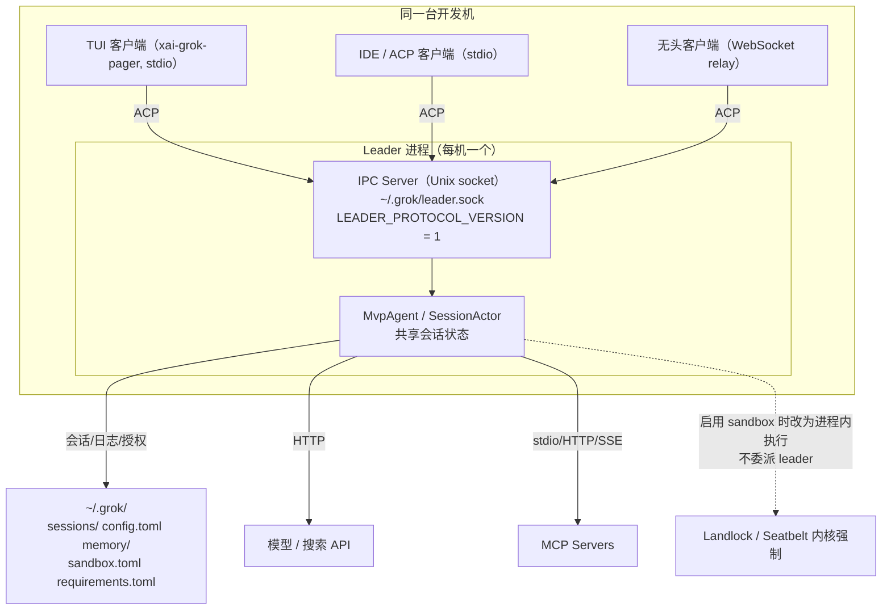
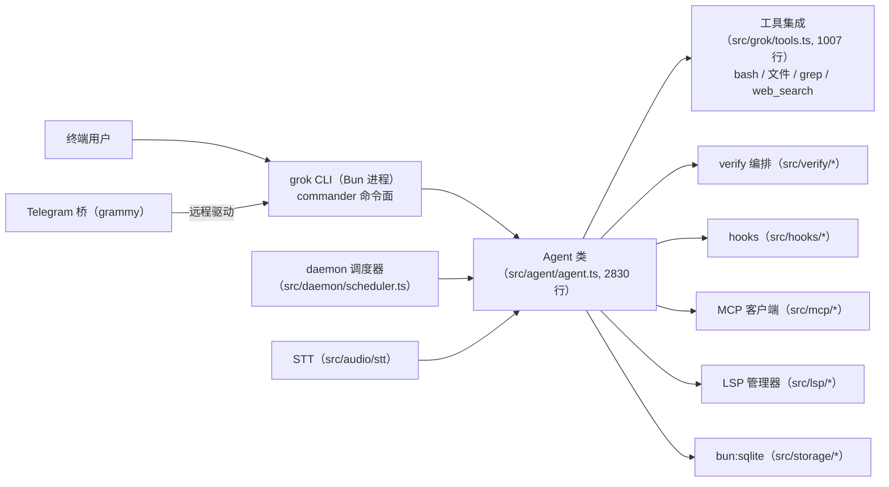
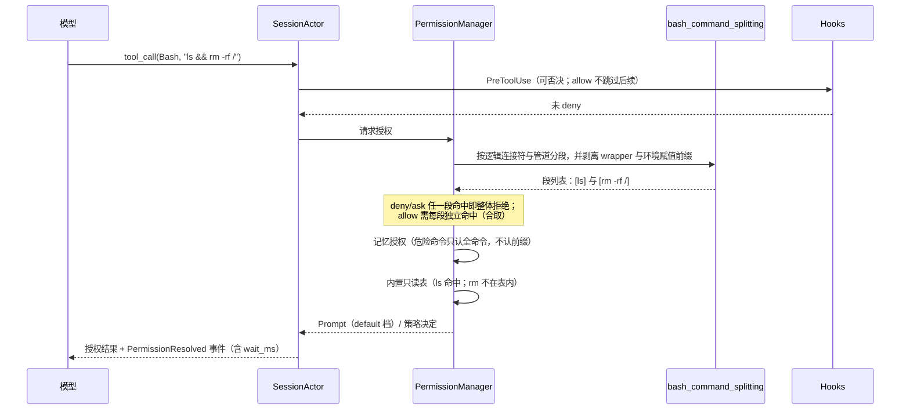

# 竞品研究 06：Grok Build / Grok CLI（xAI 生态）

> 研究对象：用户口中的「**gork build**」——经核实为 **Grok Build**（xAI 官方 CLI/TUI 编码 Agent），并连带研究社区的 `superagent-ai/grok-cli`。
> 研究方式：`xai-org/grok-build` 与 `superagent-ai/grok-cli` 均已 `git clone --depth 1` 到 `.research-cache/`（gitignored），源码直读；官方文档为仓库内置 user-guide（随源码同版本）与官方文档站。
> 源码基线：`xai-org/grok-build` @ `4247f661689354b831191f11eeeac8424993fe3d`（2026-09-19，"Synced from monorepo"，`SOURCE_REV=9bb727cc...`），`xai-grok-shell` 版本 `1.0.38`。
> 社区仓库基线：`superagent-ai/grok-cli` @ `fb97af83f06dca873281d60168430f06c8de6324`（2026-05-15，`grok-dev@1.1.7`）。
> **证据时点（R09 补）**：官方 `xai-org/grok-build` HEAD `4247f66`（2026-09-19，"Synced from monorepo"）；社区 `superagent-ai/grok-cli` HEAD `fb97af8`（2026-05-15，近 4 个月未更新）；官方文档站/内置 user-guide 与源码同 commit。
> 证据分级：`[E1]` 源码直读（给路径/文件）｜`[E2]` 官方文档/仓库内置文档｜`[E3]` 第三方｜`[E4]` 推断。**每条结论标注等级，含路径的结论均为本机克隆实体读取，非二手转述。**

---

## 0. 记录更正（Record Correction，重要）

用户提问中的「**gork build**」在公开材料中**不存在**该拼写的产品。检索 `"gork build" grok build CLI difference` 只返回 **Grok Build** 的结果，无任何以 `gork` 命名的官方或社区 coding agent 仓库。事实是：

| 更正项 | 事实 | 证据 |
| --- | --- | --- |
| 名称 | 官方产品名为 **Grok Build**（二进制 `grok`），非 `gork build` | `[E1]` `README.md` 标题 `Grok Build (<code>grok</code>)`；`[E3]` 检索无 gork 结果 |
| 它不是社区玩具，而是官方开源 | `xai-org/grok-build` 是 xAI 官方组织仓库，README 自述「contains the Rust source for the `grok` CLI/TUI and its agent runtime. It is synced periodically from the SpaceXAI monorepo.」 | `[E1]` `README.md` L31-36；`SOURCE_REV` 文件记录 monorepo commit |
| 厂商品牌写法异常 | 仓库 README、`CONTRIBUTING.md` 中的厂商名渲染为 **「SpaceXAI」**（5 处/1 处），而非 `xAI`；第三方检索结果标题同样为「Grok Build - SpaceXAI」「xai-org/grok-build: SpaceXAI's coding agent harness」。但安装地址仍为 `x.ai/cli/install.sh`、文档仍为 `docs.x.ai/build/overview`、媒体资源域名仍为 `media.x.ai` | `[E1]` `README.md`（本机读取，5 处 `spacexai`）；`[E3]` WebSearch 标题 |
| 同生态另有**独立社区项目** | `superagent-ai/grok-cli` 是**第三方**开源项目，MIT，TypeScript/Bun，仅调用 Grok API。README 顶部免责声明：「not affiliated with, endorsed by, or sponsored by xAI Corp.」 | `[E1]` `README.md` 免责声明；`LICENSE` 为 MIT |
| 「Grok 编码模型」是另一件事 | `grok-code-fast-1` 是模型（2025-08-28 发布），非 CLI；第三方模型目录页已标「Deprecated」 | `[E3]` `x.ai/news/grok-code-fast-1`、Oracle 文档页标题「xAI Grok Code Fast 1 (Deprecated)」 |

> **给 OpenCoding 的判读**：本文件把「Grok Build（官方）」与「superagent-ai/grok-cli（社区）」分开写，因为二者架构、许可、能力完全不同，混为一谈会污染 `CROSS-COMPARISON.md` 的矩阵。品牌名 `SpaceXAI/xAI` 差异**不确定成因**（可能是 xAI 与 SpaceX 的组织变动在代码库中的体现，也可能是文档同步过程中的暂态），本文件**只陈述观察到的事实，不做归因**；使用时应以仓库路径与二进制名 `grok` 作为稳定标识。

---

## 1. 结论速览

1. **Grok Build 是「单二进制 Rust TUI + 同机 leader 守护进程」的双层架构**：一个 leader 进程持有 Agent 状态，多个客户端（TUI / IDE 扩展 / headless）通过 Unix socket `~/.grok/leader.sock` 以 ACP 协议接入；`ClientMode` 明确区分 `Headless` 与 `Stdio` 两种客户端。`[E1]` `crates/codegen/xai-grok-shell/src/leader/mod.rs`、`leader/protocol.rs:107`
2. **权限系统是全仓最成熟的子系统**，有**显式的五级授权流水线**（PreToolUse hook → 规则 → 记忆授权 → 内置只读自动批准 → 模式策略），规则效果按**严重度**而非声明顺序判定（`deny > ask > allow`），并且对 Bash 命令做**分段解析 + wrapper 剥离**后再匹配。`[E2]` `docs/user-guide/22-permissions-and-safety.md`
3. **权限决策的「原因」被枚举化到 25 个变体**（`PermissionDecisionReason`），用于遥测归因——这使「为什么这次被拦」在数据层可回答，而不是只留一行日志。`[E1]` `crates/codegen/xai-grok-telemetry/src/events/permission_analytics.rs:116`
4. **沙箱是「整进程级 + 内核强制 + 不可回退」**：Landlock/Seatbelt 在启动时施加于整个 grok 进程，自定义 profile 的 `deny` 列表**读写双向**内核拒绝，施加失败则**拒绝启动（fail-closed）**；且会话恢复时**禁止放宽**沙箱档位。`[E1]`/`[E2]` `crates/codegen/xai-grok-sandbox`、`docs/user-guide/18-sandbox.md`
5. **SubAgent 树是「深一层」的扁平结构**：只有顶层会话能 spawn，子代理不能再 spawn（`Depth Limits`），换来的是「不会失控」的确定性。`[E2]` `docs/user-guide/16-subagents.md#depth-limits`
6. **Goal 自治循环有完整的状态机与四类自动暂停原因**：`GoalStatus` 含 `BackOffPaused / NoProgressPaused / InfraPaused / BudgetLimited / Blocked`，其中 `NoProgressPaused` 由「验证器连续多次标记同一缺口指纹（无进展）」触发——这是把「空转」做成可检测信号的设计。`[E1]` `crates/codegen/xai-grok-shell/src/session/goal_tracker.rs:41-110`
7. **记忆是「Markdown 为源 + SQLite 双索引（FTS5 + vec0）」**，检索默认纯全文，配置 embedding 后走 `vector 0.7 / BM25 0.3` 混合，并对 `session` 类记忆施加**时间衰减**（半衰期 30 天）、对全部结果做 **MMR 去冗余**（λ=0.7）。`[E2]` `docs/user-guide/13-memory.md#search-scoring`
8. **上下文压缩是四路合一的工程**：手动 `/compact`、阈值自动压缩、内联自动压缩（带 auto-continue）、错误恢复压缩，另有 **two-pass 压缩**与**压缩前 memory flush**（保留 4000 token 头部空间先落记忆再丢弃）。`[E1]` `crates/codegen/xai-grok-shell/src/session/compaction.rs`
9. **事件系统是「版本化 schema + 58 个事件变体」**的单枚举，`EVENT_SCHEMA_VERSION = "1.0"`，`serde(tag = "type", rename_all = "snake_case")`，把权限、Goal、Todo 门禁、Laziness 分类器等内部机制**全部事件化**。`[E1]` `crates/codegen/xai-grok-session-events/src/types.rs`（R09 复核修正：逐变体清点 = **58**，原文「57 个」有误）
10. **工具实现层显式**移植**了两个竞品的工具**：`xai-grok-tools/src/implementations/` 下并存 `codex/` 与 `opencode/` 目录，并在 `THIRD_PARTY_NOTICES.md` 中按 Apache §4(b) 标注改动——这是「合法吸收竞品实现」的工程范式。`[E1]` `crates/codegen/xai-grok-tools/{src/implementations/,THIRD_PARTY_NOTICES.md}`

---

## 2. 产品与仓库事实

| 项 | Grok Build（官方） | grok-cli（社区 superagent-ai） |
| --- | --- | --- |
| 仓库 | `github.com/xai-org/grok-build` | `github.com/superagent-ai/grok-cli` |
| 定位 | 「terminal-based AI coding agent」，全屏 TUI；交互 / 无头 / ACP 嵌入编辑器三用 | 「An open-source coding agent for the Grok API」 |
| 语言/构建 | Rust（workspace 由 monorepo 生成生成物）、`rust-toolchain channel = "1.94.0"` | TypeScript 5.9 + Bun，OpenTUI/React TUI |
| 规模 | `crates/codegen/` 下约 80 个 crate；`xai-grok-pager` ~547k 行、`xai-grok-shell` ~428k 行、`xai-grok-tools` ~156k 行、`xai-fast-worktree` ~35k 行 | `src/` 约 175 文件 / 非测试 TS 约 9.9k 行 |
| 许可 | Apache-2.0（first-party），第三方见 `THIRD-PARTY-NOTICES` | MIT |
| 版本 | `xai-grok-shell` `1.0.38`；仓库 commit 2026-09-19 | `grok-dev@1.1.7`；commit 2026-05-15 |
| 分发 | `curl -fsSL https://x.ai/cli/install.sh \| bash`（macOS/Linux/Git Bash）、`irm https://x.ai/cli/install.ps1 \| iex`（Windows PowerShell） | `install.sh`（raw.githubusercontent）；`bun add -g grok-dev` |
| 官方入口 | `x.ai/cli`、`docs.x.ai/build/overview`、changelog `x.ai/build/changelog` | npm `grok-dev` |
| 贡献政策 | **不接受外部贡献**（`README.md` 明示，`CONTRIBUTING.md`） | 开放（含 CI: typecheck/security/release workflow） |
| 热度 | 抓取时 GitHub 页显示 26.9k stars | 抓取时 3.5k stars |
| 依赖生态信号 | 依赖 `agent-client-protocol`（ACP）作为对外协议 | 依赖 `@ai-sdk/xai`、`@ai-sdk/mcp`、`@modelcontextprotocol/sdk`、`@opentui/*`、`grammy`（Telegram）、`@coinbase/agentkit` |

`[E1]` 上表事实除「stars / 官方站文案」为 `[E2]/[E3]` 抓取外，均来自本机克隆文件与 `Cargo.toml`/`package.json`。

---

## 3. 架构总览

### 3.1 进程拓扑（官方 Grok Build）



拓扑铁律（`[E1]` `leader/mod.rs` 顶部设计说明 + `18-sandbox.md`）：

- **单领导者（single-leader-per-machine）**：leader 持有全部会话状态，客户端只做表现层；请求 ID 被 leader 做命名空间隔离以避免冲突。
- **每客户端能力协商**：`ClientCapabilities` 逐项声明 `yolo_mode / auto_mode / default_model / client_version / code_nav_enabled / terminal / fs_read / fs_write / status_line / user_message_echo`，leader 在 `session/new` 注入对应 `_meta`。**同一 leader 可同时服务「本地执行终端的 TUI」与「由客户端执行终端的 web 客户端」而互不干扰**——这解决了「多客户端共享会话时的路由歧义」。
- **沙箱与 leader 互斥**：一旦请求非 `off` 沙箱档位，Agent **改为进程内运行、拒绝 leader**（防止工具被委派到无沙箱的进程执行）。

### 3.2 社区 grok-cli 拓扑（对照）



社区版是**单进程内多子系统**结构，没有 leader/客户端拆分；其独有物是「**Telegram 远程遥控**」与「**verify 证据化验收**」两套子系统。

---

## 4. 24 维度逐项分析

### 4.1 进程与运行拓扑

- 官方：见 §3.1。三入口同源：`grok`（TUI）/ `grok -p`（headless）/ `grok agent stdio|serve`（ACP）。`grok agent serve --bind 127.0.0.1:2419 --secret <token>` 可起 WebSocket 服务面。`[E1]` `leader/protocol.rs:107`（`ClientMode`）、`[E2]` `15-agent-mode.md`
- 启动发现：从 `--cwd`（或当前目录）**向上找 `.git`** 作为项目根，并据此刻定 `AGENTS.md`/skills/git 历史的发现范围；monorepo 下建议把 `--cwd` 指向子项目以免启动变慢。`[E2]` `14-headless-mode.md#project-root-discovery`
- 社区：单进程 + 可选 `grok daemon --background` 派生子进程做调度。`[E1]` `src/index.ts`（`daemon` 子命令）、`src/daemon/scheduler.ts`

### 4.2 Agent 主循环与回合模型

- 回合结构由事件固化：`TurnStarted { turn_number, model_id, yolo_mode, conversation_message_count, session_relationship, redirect_kind }` → `PhaseChanged` → `FirstToken` → 多次 `LoopStarted { loop_index }` → `ToolStarted/ToolCompleted` → `TurnEnded { outcome, cancellation_category }`。即**「Turn 内含 Loop（工具轮次）」**两级模型。`[E1]` `xai-grok-session-events/src/types.rs:7-80`
- 循环实现落在 `SessionActor` 的 `run_session`（actor 模型：主循环消费命令 + 定时器 + 启动任务集），单轮采样在 `sampler_turn.rs`，终止判定在 `stop_gate.rs`。`[E1]` `acp_session_impl/{run_loop.rs:354, sampler_turn.rs, stop_gate.rs}`
- 轮次上限：headless `--max-turns`；TUI `ui.maxTurns` 可选 1000/2000/3000/unlimited（Qoder CLI 侧同样有 `ui.maxTurns` 键，跨产品趋同）。`[E2]` `14-headless-mode.md`、`[E2]` Qoder settings-reference
- 社区：`Agent` 类单循环，`--max-tool-rounds` 默认 **400**；支持 `--batch-api` 走 xAI Batch API（异步、低价）做非交互推理。`[E1]` `src/index.ts:367-368`、`src/agent/agent.ts`

### 4.3 工具系统

- **统一的工具分类学**：`ToolKind` 枚举给出「harness 无关的语义种类」与其展示名映射，例如 `read_file` 与竞品的 `Read` 同归 `ToolKind::Read`、`run_terminal_cmd` 归 `ToolKind::Execute`；并定义**规范输入字段名**（`path/offset/limit/command/description/cwd/directory/pattern`）与**规范 `_meta` 信封**（键 `x.ai/tool`，`TOOL_META_VERSION = 1`）。`[E1]` `xai-grok-tools/src/tool_taxonomy.rs`
- 已见工具名（源码中出现）：`read_file`、`search_replace`、`run_terminal_command`、`todo_write`、`spawn_subagent`、`send_subagent_message`、`monitor`、`kill_task`、`get_command_or_subagent_output`/`kill_command_or_subagent`、`scheduler_create/list/delete`、`memory_search`、`memory_get`、`web_search`、`list_dir`、`grep`、以及 `search_tool`/`use_tool`（MCP 与插件代理工具的间接调用通道）。`[E1]` `xai-grok-tools/src/implementations/**`、`22-permissions-and-safety.md#read-only-tools`
- **实现分层**：`implementations/` 下按来源分目录——`grok_build/`（自研，含 `bash/`、`kill_task/`）、`codex/`、`opencode/`（移植）、`read_file/`、`search_tool/`、`use_tool/`、`web_search/`、`skills/`、`lsp/`、`memory/`、`task_output/`、`editor_infra/`。`[E1]` 目录清单
- 结果外置：`task_output/` 与 `xai-grok-shell/src/tools/`、`xai-grok-tools/src/persistence.rs` 处理大输出的持久化与回传（`tool-results` 概念）。`[E1]` 路径存在性
- 社区：`src/grok/tools.ts` 用 Vercel AI SDK 的 `tool({description, inputSchema: z.object(...), execute})` 声明工具，**在每个工具内部首尾包裹 hook 调用**（`executePreToolHooks` / `executePostToolHooks` / `executePostToolFailureHooks`），前置 hook 返回 `blocked` 即直接回 `[Hook blocked] reason` 给模型。`[E1]` `src/grok/tools.ts:99-140`

### 4.4 权限与审批（本竞品最强项）

授权流水线（`[E2]` `22-permissions-and-safety.md#how-a-tool-call-is-authorized`）：


具体机制（均为 `[E1]/[E2]`）：

| 机制 | 细节 |
| --- | --- |
| 模式 | `default(ask)`、`acceptEdits`、`plan`、`auto`、`dontAsk`、`bypassPermissions`（产品名 **Always-approve**，别名 `--yolo`） |
| 规则来源 | CLI `--allow/--deny`、`~/.grok/config.toml`（每层目录可叠加）、`<project>/.grok/config.toml`、`.claude/settings.json` + `settings.local.json`（Claude Code 兼容）、`managed_config.toml`（`$GROK_HOME` 与 `/etc/grok`）、`requirements.toml`（系统级、用户不可移除） |
| 匹配语义 | `Bash(...)` 支持前缀与 glob 两种；`:*` 后缀等价前缀；**链式命令按 `&& \|\| ; \| 换行` 分段**，`deny/ask` 任一段命中即整体拒绝，`allow` 为**合取**（每段都要命中才自动批准） |
| 归一化 | 剥离前置环境赋值（`RUST_LOG=debug`）与固定 wrapper 集合（`timeout/nice/ionice/chrt/stdbuf/env`），`sudo/xargs/nohup` **不剥离**；无法安全剥离时改为提示 |
| 危险命令表 | `rm chmod chown chgrp chattr pkill kill killall git push` —— 即使命中「记住的前缀」也要重新确认，除非显式 `allow` 规则 |
| 只读自动批准 | 只读工具（`read_file/list_dir/grep/web_search/todo_write`、子代理控制、调用 skill）与固定只读 shell 命令清单（`ls/cat/git status/git log/kubectl get/...`）；**明确排除 `tee`（可任意写）与 `cargo check`（会编译执行 build.rs）**，并给 `rg --pre`、`sort --compress-program`、`git -c` 覆盖、仓库内可执行 hook 等提权路径做了「请求级下限」处理 |
| 路径规则 | glob 匹配，`*`/`?` 不跨 `/`，`**` 跨；匹配前做 `.`/`..` 折叠，因此 `Read(./**)` 不能被 `../../etc/passwd` 逃逸；`Read/Edit` 的 deny **同时约束 shell 命令触碰的路径** |
| 记忆授权 | 提示里提供 `Always allow: <command>` 与「never allow」；**危险命令只记全命令而非前缀**；记忆按 **git 仓库根**作用域存于 `$GROK_HOME/sessions/<url-encoded 根>/permission.toml`，**不写入仓库**；无 git 时按启动目录 |
| 管理员锁定 | `requirements.toml` 的 `[ui] disable_bypass_permissions_mode = true` 关闭 always-approve；遗留键 `[ui] yolo = false` 兼容 |
| 代码结构 | `xai-grok-workspace/src/permission/{manager/,auto_mode/,grants/,managed_policy/,bash_command_splitting.rs,exec_risk.rs,hub_gate.rs}` |
| 决策归因 | `PermissionDecisionReason`（25 变体，含 `AutoFastPath / AutoClassifierAllow / AutoClassifierTimeout / AutoClassifierUnavailable / BashRequestFloor / OpaqueShell / PersistedGrant / SafeCommand / HookAsk / RequesterGone` 等）；另有 `AUTO_DENY_CONSECUTIVE_LIMIT`、`AUTO_DENY_TOTAL_LIMIT` 两个自动拒绝熔断常量 |

- **Hook 与权限的关系被明确写死**：**hooks fail open**（脚本崩溃/超时/缺失视同 allow 并上报 UI），因此「把 hook 当安全边界必须自己处理错误」；`PreToolUse` 的 deny 先于权限系统，但其 allow **不跳过**后续检查。`[E2]`
- 社区版权限面显著更薄：只有 `--sandbox`、hook 阻断与 `--allow-*` 类的沙箱网络白名单，**没有 deny/ask/allow 规则引擎**。`[E1]` `src/index.ts` 选项面

### 4.5 上下文管理

- **压缩四路**：`/compact` 手动、阈值自动、**内联自动压缩 + auto-continue**、错误恢复压缩；另有**预检溢出检测**与**压缩检查点持久化**。`[E1]` `session/compaction.rs` 头部注释（模块自述）
- **two-pass 压缩**：`TWO_PASS_DEFAULT_SPLIT_FRACTION` + `build_two_pass_pass1_history/pass2_history` + `split_conversation_for_two_pass`，即先对上半段做一次摘要、再拼接下半段做第二次——用于超长会话避免「一次摘要丢太多」。`[E1]` `session/two_pass.rs`（被 `compaction.rs` 引用）
- **压缩前记忆 flush**：`[compaction.memory_flush]` 默认 `enabled=true`，`soft_threshold_tokens=4000`（在压缩阈值前 4000 token 头部空间触发）、`max_flush_write_chars=8000`、`idle_timeout_secs=300`、`semantic_dedup_threshold` 默认 `0.92`。**即「先落记忆再丢上下文」**。`[E2]` `13-memory.md#flush-settings`
- **工具结果剪枝**：`[compaction.pruning]` 默认 `enabled=true`、`keep_last_n_turns=3`（近 3 轮不剪）、`soft_trim_threshold=4000` 字符 → 头 1500 + 尾 1500、`hard_clear_age_turns=10` 轮后替换为占位符。`[E2]`
- **缓存亲和可观测**：headless JSON 输出区分 `input_tokens`（**仅未命中缓存**）、`cache_read_input_tokens`（命中）、`total_tokens = input + cache_read + cache_creation + output`；文档明确「只有 headless 投影会减掉缓存，ACP `_meta.usage.inputTokens` 仍是全量」。`[E2]` `14-headless-mode.md#json`
- 社区：`src/agent/compaction.ts`（485 行）+ SQLite 中专门的 compaction schema（`createCompactionSchema`，migration v2）+ session recap schema（v3）。`[E1]` `src/storage/migrations.ts`

### 4.6 提示词组织

- 专门 crate 目录 `xai-grok-agent/src/prompt/`：`agents_md.rs`（AGENTS.md 装配）、`skills.rs`（技能注入）、`subagent_prompts.rs`（子代理提示）、`template.rs`、`context.rs`、`paths.rs`、`ignore.rs`、`workspace_user.rs`、`user_message.rs`、`prompt_encrypted.rs`（提示加密/保护）、`browser_verification.rs`。`[E1]` 目录清单
- 分层指令文件：`12-project-rules.md` 描述项目规则（AGENTS.md 风格）；用户级与项目级 persona 以 `<system-reminder>` 形式注入到子代理会话（**不改系统提示、不改模型、不改工具**）。`[E2]` `16-subagents.md#personas`
- 用户可覆盖系统提示尾部：Qoder CLI 有 `QODER_APPEND_SYSTEM_PROMPT`，Grok 侧对应 `--rules`（headless 提示补充规则）与 `[features]`/persona 层。`[E2]`
- 社区：`buildSystemPrompt()` + `applyModelConstraints(system, modelId)`（按模型裁剪提示）+ `formatCustomSubagentsPromptSection()`（把用户自定义子代理写进系统提示）+ `formatSandboxPromptSection()`（把沙箱能力写进提示，让模型知道边界）。`[E1]` `src/agent/agent.ts:327,485,519`

### 4.7 MCP

- 传输：**stdio / HTTP / SSE**（`--transport` 默认 stdio）；原生 HTTP/SSE 优先于 `npx mcp-remote` 包装，避免每会话多一个子进程，并注册 Grok 自己的 OAuth client（`[E2]` `07-mcp-servers.md`）。仓内另有 **Streamable HTTP with Session ID** 一节。
- 配置面：项目级 `.grok/config.toml` 的 `[mcp_servers]`；CLI 管理 `grok mcp add/remove/enable/disable/doctor`；`/mcps` 模态内可用 `i` 完成 OAuth 授权。`[E2]`
- 命名：Grok 原生工具名**不带 `mcp__` 前缀**，采用 `server__tool`；兼容层接受 `.claude/settings.json` 里的 `mcp__server__tool` 形式并重写。`[E2]` `07-mcp-servers.md#tool-naming`、`22-permissions-and-safety.md#mcp-rules`
- 企业面：managed policy 有独立 `permission/managed_policy/mcp.rs`（MCP 允许清单），插件文档另给 `requirements.toml` 限制「哪些 MCP server 可运行」。`[E1]`/`[E2]`
- 懒加载/工具发现：`lazyLoad` 与元工具（`search_tool`/`use_tool`）在子代理中作为 MCP 工具的发现与调用通道。`[E1]` `xai-grok-tools/src/implementations/{search_tool,use_tool}`
- 高级细节：**MCP 参数可由文件承载**（file-backed MCP arguments），读取时施以与普通读同级的授权、路径、符号链接与忽略文件限制，且「hook 可改写参数、不可改目标或另载文件」。`[E1]`/`[E2]`
- 社区：`src/mcp/{catalog,runtime,validate,parse-headers}.ts` + `@ai-sdk/mcp`。`[E1]`

### 4.8 Skill / 插件机制

- **Skill**：`08-skills.md` 为用户指南；实现侧 `xai-grok-agent/src/prompt/skills.rs` 与 `xai-grok-tools/src/implementations/skills/`；「调用 skill」被列入只读自动批准集合。`[E1]/[E2]`
- **插件市场**：独立 crate `xai-grok-plugin-marketplace`；`09-plugins.md` 给出完整治理：多 marketplace 添加（`config.toml` 或 `settings.json`）、插件安装/启停、marketplace 索引编写、catalog、组织级分发（`requirements.toml` 绑定 marketplace、限制可添加的 marketplace、限制可运行的 MCP server、要求**固定版本**、关闭插件 UI 与启动自动更新）。`[E2]`
- **插件安全边界（明确收窄）**：插件代理**不得**在 frontmatter 声明 `mcpServers`（忽略并告警）、**不得**声明 hooks、**不得**设 `permissionMode: bypassPermissions`；插件自带的 `.mcp.json` 在插件被信任后挂到**父/会话**层。`[E2]` `16-subagents.md#mcp-inheritance`
- 社区：`src/utils/skills.ts` + `.agents/skills/*/SKILL.md`（仓库自带 agent-browser / agent-desktop / find-skills 三个技能）。`[E1]`

### 4.9 SubAgent / 多 Agent 编排

- spawn 参数：`prompt`、`description`（3–5 词标签）、`subagent_type`（`general-purpose` / `explore` / `plan`，项目可新增或遮蔽）、`background`、`isolation: none|worktree`、`resume_from`、`cwd`（与 `isolation: worktree` 互斥）。`[E2]` `16-subagents.md`
- **能力模式**四档：`read-only` / `read-write` / `execute` / `all`；由 agent type 与 role 默认决定，**不是 spawn 参数**（模型不能自选）。`[E2]`
- 上下文继承：`resume_from` 让新子代理接着已完成的子代理**同一会话**继续（继承 transcript、工具状态、模型，系统提示与工具按当前定义重渲染）；前置条件：源必须已完成、属当前会话、同 agent type。`[E2]`
- 消息通道：`send_subagent_message` **默认关闭**，需 `GROK_ACTIVE_AGENT_MESSAGES` 或 `[features] active_agent_messages`；投递语义 `steer`（默认，回合内安全点插入）/ `queue`（下一回合）/ `interject`（紧急，优先于 pending steer，并可打断「等待后台工作」的阻塞）；配额**每 sender-target 4 条在途、每 sender 尝试 32 条出站**，超限回 `QuotaExceeded`；子代理**不能反向 messge 根会话**。`[E2]`
- **深度限制**：最多一层嵌套；子代理调用 `spawn_subagent` 直接失败。`[E2]`
- 关联 crate：`xai-grok-subagent-resolution`（角色/persona 解析）、`xai-agent-lifecycle`（`local/` 与 `send/` 两套 contributor + registry，即子代理生命周期的本地与远端两条实现路径）、`xai-grok-shell/src/agent/subagent/`。`[E1]`
- 社区：`src/agent/delegations.ts`（364 行）实现子代理委派，README 称「sub-agents on by default」；`src/utils/subagent-display.ts` 做 TUI 展示。`[E1]`

### 4.10 任务 / 计划 / Todo 机制

- `todo_write` 本身在只读自动批准集合内（写 todo 不需要授权）。`[E2]`
- **Todo 门禁（TodoGate）**：事件 `TodoGateFired { fires, pending, in_progress, reason }` 与 `TodoGateExhausted { pending }`——即系统会**主动催促模型把待办推进**，且催促次数有上限。`[E1]` `xai-grok-session-events/src/types.rs`
- Plan Mode：独立文档 `19-plan-mode.md`（含 agent 主动进入 / 用户主动进入、计划文件、审批视图、审批期内的编辑、**与压缩的交互**）。`[E2]`
- TUI 有**独立 todo 面板**（`Ctrl+T`）与任务面板（`Ctrl+G`）。`[E2]`
- 社区：`tools.ts` 中另有一套 `plan` 工具（源码 967 行处），并有 `src/verify/*` 的「验收」概念（见 §5.3）。

### 4.11 Goal / 自治循环 / Schedule

- **Goal 子系统是独立目录群**：`goal_orchestrator.goal_classifier.goal_evaluator.goal_next_step.goal_planner.goal_role_tools.goal_stop_detector.goal_strategist.goal_summarizer.goal_tracker`。`[E1]` `xai-grok-shell/src/session/{goal_*.rs, goal_classifier/}`
- 状态机：`GoalPhase{Idle, Planning, Executing}`；`GoalStatus{Active, UserPaused, BackOffPaused, NoProgressPaused, InfraPaused, Blocked, BudgetLimited, Complete}`；反序列化时**未知状态一律降级为 `UserPaused`**，理由是「本 shell 无法解释的状态必须以可恢复的暂停态恢复，绝不能变成自驱的 Active」。`[E1]`
- 四类自动暂停来源：`User`（Ctrl+C / `/goal pause`）、`BackOff`（分类器运行次数上限）、`NoProgress`（**验证器在多轮尝试中看到同一缺口指纹、无进展**）、`Infra`（回合基础设施失败，人话原因存进 `pause_message`）；`Blocked` 表示被阻塞。`[E1]`
- 预算：`GoalOrchestration` 带 `token_budget`；另有 `GoalClassifier*` 系列事件（fired/verdict/fail_open/fail_closed/cap_reached/mid_turn_deferred/dropped_after_cap/pending_queue_cleared）显示**分类器自身也有完整的容量与失败语义**。`[E1]`
- Schedule：工具 `scheduler_create/scheduler_list/scheduler_delete`；TUI `/loop` 命令；`20-background-tasks.md` 描述后台命令、`monitor` 工具（含**持久化 monitor**）、调度器与「仍在运行」状态行。`[E2]`
- 社区对照：`src/tools/schedule.ts` + `src/daemon/scheduler.ts`（含测试）。

### 4.12 会话持久化与恢复

- 存储：会话落在 `~/.grok/sessions`（含 `permission.toml` 授权记忆、sandbox 事件日志）；SQLite 使用自研 crate `xai-sqlite-journal`，提供 `JournalMode`、`open_readonly_until`、`apply_with_retry_until`，并对 **网络文件系统**（`is_network_fs`）做特殊处理。`[E1]` `xai-sqlite-journal/src/lib.rs`
- 会话操作面：`sessions_cmd.rs`、`export_cmd.rs`、`restore_code.rs`、`fork.rs` + `fork_status.rs`、`merge.rs`、`rewind.rs`、`persistence.rs`、`summary.rs`、`resume_status.rs`。——即**导出/分叉/回退/合并/摘要齐全**。`[E1]` 文件清单
- **跨 harness 会话互操作**：`xai-grok-foreign-sessions`（外部会话导入）、`xai-grok-shell/src/claude_import.rs` + `claude_import_state.rs`（**导入 Claude Code 会话**）、以及 Ctrl+I「Import Claude settings」。`[E1]`/`[E2]`
- Headless 会话三元组：`-s <name>` 命名、`-r/--resume <id>` 精确恢复、`-c/--continue` 续接最近；JSON 输出总带 `sessionId`；也可用**客户端指定 UUID**创建（要求尚未存在）。`[E2]`
- 活跃会话管理：`xai-grok-active-sessions`、`persistence_cleanup_stale_sessions_tests.rs`（僵尸会话清理）。`[E1]`
- 沙箱档案随会话冻结：恢复时若传入**不同** profile 会**报错拒绝**，只能新建会话。`[E2]` `18-sandbox.md#resuming-sessions`

### 4.13 事件与可观测

- 单一事件枚举 58 个变体（R09 复核修正，原「57 个」有误）、`EVENT_SCHEMA_VERSION = "1.0"`、serde tag `type`/snake_case；同文件定义 `ToolOutcome`、`Phase`、`SessionRelationship`、`TurnOutcomeLabel`、`PermissionDecision{Allow,Deny,Cancelled,Followup}`、`CancellationCategory{HookDenied,PermissionRejected,PermissionCancelled,MidTurnAbort}`、`McpErrorCategory`、`GoalClassifierVerdictTelemetry`、`GoalPauseReasonTelemetry`、`RedirectKind`、`InterjectionSource` 等**从属枚举**。`[E1]`
- 事件里有 `ToolCompletedSource::is_shell()` 这类 **wire 标签固定化测试**（`tool_outcome_wire_labels_are_pinned`），保证跨版本解析稳定。`[E1]`
- 遥测栈分层：`xai-grok-telemetry`（含 `events/permission_analytics.rs`、`external/schema.rs`、外部 OTLP 测试）、`xai-grok-otel`（含 `otel_gate.rs` 与 `external_otel_pin.rs`）、`xai-mixpanel`。`[E1]`
- 用户可见的用量面：`24-monitoring-usage.md`；TUI 有 dashboard（`23-dashboard.md` + `dashboard-store` crate）与 status line（`25-status-line.md` + `xai-grok-status-line`）。`[E2]`
- 恶意/异常回路也有专门遥测：`doom_loop_telemetry.rs`、`laziness_classifier.rs` 与事件 `LazinessClassifierFired / LazinessNudgeFired / LazinessClassifierAborted`。`[E1]`

### 4.14 Hooks / 生命周期扩展点

- 事件名（14 个）：`SessionStart`、`UserPromptSubmit`（可阻断）、`PreToolUse`（可 deny）、`PostToolUse`（可反馈并**替换模型看到的输出**）、`PostToolUseFailure`、`PermissionDenied`、`Stop`（可阻断停止）、`StopFailure`、`StopCancelled`、`Notification`、`SubagentStart`、`SubagentStop`（可阻断）、`PreCompact`、`PostCompact`、`SessionEnd`。`[E2]` `10-hooks.md#hook-events`
- 契约：退出码 `0` 成功 / `2` 显式拒绝（`PreToolUse` 的第一行 stderr 成为拒绝原因）/ 其他非阻断错误；`PostToolUse` 支持 `decision: "block"` + `reason`、`additionalContext`、**`updatedToolOutput`**（通用，替换模型侧结果）与 MCP 专用别名。`[E2]`
- 作用域：用户 `~/.grok/config.toml`、受管 `managed_config.toml`（`$GROK_HOME` 与 `/etc/grok`）、要求级 `requirements.toml`；有「强制执行 hooks」与「仅允许管理的 hooks」两种管理员姿态。`[E2]`
- **兼容竞品 hook**：Cursor 的 `beforeShellExecution / beforeMCPExecution / beforeReadFile / afterAgentThought / preCompact ...` 被显式映射到本地事件。`[E2]`
- 失败语义（关键）：**hooks fail open**，且文档直言「把 hook 当安全边界必须自行处理错误」。`[E2]`
- 实现 crate：`xai-grok-hooks`（13k 行）、`xai-hooks-plugins-types`、`xai-grok-agent/src/plugins/hooks_adapter.rs`。`[E1]`

### 4.15 沙箱与安全执行

| 维度 | 事实 | 等级 |
| --- | --- | --- |
| 技术 | Linux: **Landlock**（内核 ≥5.13）+ 读拒绝需 **bubblewrap**；macOS: **Seatbelt** | `[E2]` |
| 粒度 | **整进程级**（启动时施加，非每命令包裹）；子进程自动继承 FS 限制 | `[E2]` |
| 内置档 | `off` / `workspace`（可读全盘，写 CWD+`~/.grok`+temp）/ `devbox`（可写除 `/data` 与虚拟 FS 外的顶级目录）/ `read-only` / `strict`（读 CWD+系统路径+`~/.grok`，写 CWD+`~/.grok/sessions`+temp） | `[E2]` |
| 自定义档 | `~/.grok/sandbox.toml` 或 `.grok/sandbox.toml`：`extends / restrict_network / read_only / read_write / deny` | `[E2]` |
| deny 语义 | **内核强制读写双向拒绝**，堵死 `mv secret x && cat x` 绕过；glob 子集与 gitignore 类似但**刻意裁掉** `{}`、反斜杠转义、`[]…]`、`[[:…:]]`，理由是「两平台永不可能解释不一致」；不支持或畸形 glob → **拒绝启动（fail-closed）** | `[E2]` |
| 平台差异（如实记录） | macOS glob **运行时正则，airtight**；Linux glob 是**启动时快照展开（best-effort）**，启动后新建的匹配文件不覆盖；扫描过大/过深 → 拒绝启动而非少拦 | `[E2]` |
| 全局写保护 | `workspace/read-only/strict` 下内核**写拒绝** Grok 自身的 hooks 目录、`hooks-paths`、`config.toml`、`trusted_folders.toml`、`managed_config.toml`、`requirements.toml`、`sandbox.toml`（改配置只对当前会话生效）；符号链接的 `$GROK_HOME` 被拒 | `[E2]` |
| 网络 | `restrict_network` 经 **seccomp 仅约束子进程**；内置工具的进程内 HTTP（web_search、模型调用）**永不受限**；macOS 上网络限制是 **no-op** | `[E2]` |
| 环境变量策略 | `[shell_environment_policy]`：`inherit = all\|core\|none`、内置剔除 `*KEY*`/`*SECRET*`/`*TOKEN*`、`exclude`、`include_only`、`set`；对非持久 shell 后端还会过滤 `.rc` 捕获的变量 | `[E2]` |
| 不可逆 | 沙箱一旦施加**不可运行时放宽**；请求非 off 档位时**拒绝 leader 委派** | `[E2]` |
| 事件留痕 | 沙箱事件（档位施加、违规访问）写入 `~/.grok/sessions` | `[E2]` |
| 实现 | `xai-grok-sandbox`（9.5k 行） | `[E1]` |

社区对照：`--sandbox` 走 **Shuru**（macOS Apple Silicon）虚拟机式沙箱，`--allow-net`、`--allow-host <pattern>`、`--port HOST:GUEST` 做网络与端口控制。`[E1]` `src/index.ts:360-364`

### 4.16 工作区 / 远程执行

- `xai-grok-workspace`（119k 行）承载「宿主文件系统、VCS、执行、检查点」；`xai-grok-workspace-types`、`xai-grok-workspace-client`、`xai-grok-workspace-daemon`（`daemonize.rs` + `preview_supervisor.rs`）构成 client/daemon 拆分。`[E1]`
- Cargo feature `local-workspace` 自述为「**Local Computer Hub workspace_server (own/attach + crash-restart)**」，即本地工作区服务可**被抢占（own/attach）并支持崩溃重启**。`[E1]` `xai-grok-shell/Cargo.toml` feature 注释
- 沙箱下 `grok workspace start/restart/resume` 不可用（`pause/stop/status` 仍可用）。`[E2]`
- 远程面：`xai-grok-shell/src/{remote/, relay/}`、`upload/`、`proxy.rs`。`[E1]`
- 社区：无远程工作区抽象，但有 Telegram 远程驱动（见 §4.20）。

### 4.17 Git 与 Worktree 集成

- `xai-fast-worktree`（34k 行）为独立 crate；会话层有 `worktree.rs`、`worktree_pool.rs`（**池化**）、`worktree_cleanup.rs`。`[E1]`
- 子代理可 `isolation: worktree` 得到独立工作树；「其变更在主目录合并前保持隔离」，**result 里带回 worktree 路径**。`[E2]`
- Worktree 由 **ACP 扩展方法 `x.ai/git/worktree/*`** 管理，**含 apply 操作**把变更合并回主工作目录。`[E2]` `16-subagents.md#isolation-worktree-mode`
- 配套：`xai-gix-status`（git 状态，基于 gix）、`xai-hunk-tracker`（11k 行，hunk 级跟踪）、`git_info.rs`、`ui` 侧 `pager-diff`。`[E1]`
- Hooks 里有 `WorktreeCreate` / `WorktreeRemove` 事件（`WorktreeCreate` 非零退出即失败）。`[E2]`
- 社区：`src/utils/git-root.ts`；无 worktree 池。

### 4.18 记忆 / 知识库

- 层次：`global`（`~/.grok/memory/MEMORY.md`）与 `workspace`（`~/.grok/memory/<project-slug>-<hash8>/MEMORY.md`）；**同一仓库的克隆与 worktree 因共享 `origin` 而共享一份工作区记忆**（身份取 `org/repo`，无 origin 时取目录路径）；每会话摘要落 `sessions/`。`[E2]`
- 组织：`topics/`（按主题一文件，会话开始时被读取）+ 小颗粒 observation（回合结束后落盘），由 `/dream` 归并进 topics；会话首回合注入**两个作用域的有界生成索引**让模型自行决定打开哪些 topic。`[E2]`
- 捕获：会话结束时写**结构化元数据摘要**（消息计数、前 5 条实质用户提示、UTC 时间），**不用 LLM、不加延迟**；**跳过琐碎会话**（<3 条实质提示 或 用户文本 <50 字节）；`/flush` 才做 LLM 富摘要。`[E2]`
- 检索：SQLite **FTS5** 默认；配 embedding 后 `vector 0.7 / BM25 0.3`，`min_score 0.7`，`max_results 6`；`[memory.search.source_weights]` 三源权重（默认全 1.0）；**时间衰减仅作用于 session 类**（`half_life_days 30`），global/workspace 豁免；**MMR 重排**（`lambda 0.7`）。`[E2]`
- 首回合注入阈值 `min_score 0.9`；**压缩后再次检索记忆**以补回被丢弃的上下文。`[E2]`
- 陈旧性：旧会话记忆在结果中附「陈旧提示」，越旧越强；global/workspace 不加。`[E2]`
- 写入需确认：`/remember` 打开复核面板，可切换 LLM 重写版，**确认后才落盘**；遗忘为 best-effort，保证删除需手工编辑文件。`[E2]`
- 工具面：`memory_search`、`memory_get`（`ToolKind::MemorySearch` / `MemoryGet`）。`[E1]`
- 遥测隐私：记忆产品遥测**只含固定枚举、布尔、计数、时长**，绝不含 prompt、语句、topic 名、关键词、路径、模型输出或自由文本错误。`[E2]`
- 代码侧还有 `xai-grok-memory`（24.5k 行）、`xai-grok-session-search`（会话搜索）、**`xai-codebase-graph`（代码图谱：`index_manager.rs`、`interner.rs`、按语言分 `rust/javascript/python/golang` + `bench_index`）**——知识库方向另有代码图谱能力，但公开文档未展开。`[E1]`

### 4.19 A2A / 被集成能力

- **协议选择是 ACP（Agent Client Protocol）**，不是 MCP/A2A：`grok agent stdio`（本地进程/多数 SDK）、`grok agent serve --bind --secret`（服务模式）、WebSocket relay。`[E2]` `15-agent-mode.md`
- ACP 会话配置面：`session/new` 与 `session/load` 的 `_meta` 可传 `yoloMode`、`autoMode`、`modelId`、`codeNavEnabled`、`clientTerminal`、`clientFsRead/clientFsWrite`、`clientStatusLine`、`clientUserMessageEcho`（逐客户端注入，见 §4.1）。`[E1]` `protocol.rs`
- 扩展方法族：`x.ai/git/worktree/*`、`x.ai/statusLine`、`x.ai/userMessageEcho`、`x.ai/codeNavigation.enabled`、`x.ai/mcp_tool`。`[E1]/[E2]`
- Headless 作为被集成形态：`-p` 单轮 + **4 种输出格式**（`plain` / `json` / `streaming-json` / `streaming-messages-json`）；退出码 `0/1/130/143`；`XAI_API_KEY` 或 `grok login --device-auth` 免浏览器鉴权；`--rules` 增补规则。`[E2]`
- 社区：无 ACP，有 `-p` headless + `--format text|json`（`src/headless/output.ts`）。`[E1]`

### 4.20 客户端形态与交互细节

- **TUI 是本项目的重心**：`xai-grok-pager`（547k 行 / 652 文件）拆出 `pager-render`、`pager-diff`、`pager-minimal`（轻量前端）、`pager-pty-harness`（287 文件，**用 PTY 做 TUI 端到端测试**）；自研 `xai-ratatui-inline`、`xai-ratatui-textarea`。`[E1]`
- 富渲染：`xai-grok-markdown` + `markdown-core` + **`xai-grok-mermaid`（仓内 `third_party/NOTICE` 记录 vendored Mermaid 栈）**；`xai-grok-image`、`inline_media_ffmpeg.rs`（内联媒体）、`xai-grok-voice`（语音，18k 行）。`[E1]`
- 交互面：`03-keyboard-shortcuts.md`（523 行）、`04-slash-commands.md`（479 行）、`06-theming.md`、`21-terminal-support.md`、`25-status-line.md`、`23-dashboard.md`、`27-grok-clone.md`（**克隆会话**）。`[E2]`
- 社区：OpenTUI + React 的 TUI，另加 **Telegram 机器人遥控**（`src/telegram/{bridge,pairing,preview-stream,turn-coordinator,audio-input}.ts`）——「手机上驱动本机 agent」是其差异化交互。`[E1]`

### 4.21 配置面与层级

| 文件 | 作用域 | 备注 |
| --- | --- | --- |
| `~/.grok/config.toml` | 用户全局 | 主配置；沙箱下被写拒绝 |
| `<dir>/.grok/config.toml` | 项目 | **从仓库根到工作目录逐层发现并叠加** |
| `.claude/settings.json` / `settings.local.json` | 项目（兼容 Claude Code） | 权限规则/`defaultMode` 被翻译；`settings.local.json` 承担「项目内个人、不入库」角色（Grok **无**原生 `config.local.toml`） |
| `~/.claude/settings*.json` | 用户（兼容） | 同样读取 |
| `managed_config.toml`（`$GROK_HOME` 与 `/etc/grok`） | 组织管理 | 合并进规则集；受管 allow 可被用户 deny/ask 覆盖 |
| `/etc/grok/requirements.toml` | 组织强制 | root 所有，用户不可移除；`disable_bypass_permissions_mode`、marketplace/MCP 允许清单、仅管理 hooks 等 |
| `~/.grok/sandbox.toml` / `.grok/sandbox.toml` | 沙箱 profile | 用户与项目同名冲突时用用户档并警告 |
| `~/.grok/trusted_folders.toml` | 文件夹信任 | 受沙箱写保护 |
| `GROK_HOME` / `GROK_MEMORY` / `GROK_SUBAGENTS` / `GROK_SANDBOX` / `GROK_ACTIVE_AGENT_MESSAGES` / `GROK_LOG_FILE` / `RUST_LOG` / `XAI_API_KEY` | 环境 | 逐项见各文档 |

- 关键语义：**权限规则在会话启动时读取一次，改动下个会话生效**；规则的生效取决于动作严重度（`deny > ask > allow`）**而非所在文件或声明顺序**。`[E2]`
- 社区：`~/.grok/user-settings.json` 与 `.grok/settings.json`（注意与官方同名目录但**格式与语义不同**，同名不同物），`.env.example` + dotenv。`[E1]`

### 4.22 更新 / 分发 / 遥测 / 许可

- 更新：`xai-grok-update`（12k 行）+ `install.sh` / `install.ps1` / `--update`；changelog 在 `x.ai/build/changelog`。`[E1]/[E2]`
- 公告通道：`xai-grok-announcements`（会话内公告）。`[E1]`
- 遥测：默认开启的遥测栈（`xai-grok-telemetry` 26k 行 + `xai-grok-otel` + `xai-mixpanel`），其中**外部 OTLP 导出有独立开关与 pin**（`otel_gate.rs`、`external_otel_pin.rs`）；记忆遥测有明确的「不含自由文本」约束（§4.18）。`[E1]`
- 第三方媒体分析（`[E3]`）：HN 讨论标题为「What xAI's Grok build CLI sends to xAI: A wire-level analysis」；Composio 长测（2026-07-16）提到「Recent full-repository upload incident remains a major concern」。**这两条属于第三方指控性材料，本文件仅记录其存在，未从源码验证「是否上传全仓」**——见 §10 未决问题。
- 许可：Apache-2.0（first-party），`THIRD-PARTY-NOTICES` 覆盖 crates.io/git 依赖、内置主题与**树内源码移植（含 openai/codex 与 sst/opencode 的工具实现）**。`[E1]`
- 贡献政策：不接受外部贡献。`[E1]`（对「能否借其代码」有直接含义，见 §7）

### 4.23 企业能力

- 身份与密钥：`xai-grok-auth`（含 `xai-grok-login` 27k 行、device-code flow）、`xai-grok-secrets`、`xai-grok-extra-ca`（**企业自签 CA**）。`[E1]`
- 策略强制：`requirements.toml`（锁定 always-approve、限定 marketplace/MCP、强制执行 hooks、固定插件版本）、`managed_config.toml`、`managed_config/` 模块、沙箱对 Grok 自身配置文件的**内核写拒绝**（防「agent 自改策略」）。`[E1]/[E2]`
- 文件夹信任：`.grok/config.toml` 与 `.claude/settings.json` 中的项目权限规则、启动加载的项目指令与技能、项目 hooks 均受 folder trust 门禁；headless 启动这些来源需 `--trust` 或既有授权。`[E2]`
- 订阅与远程设置：`subscription_check.rs`、`remote_config/`、`tier.rs`、`rollout`/远程开关（记忆文档提到「staged-rollout 与 kill-switch 由内部加固文档承载」）。`[E1]/[E2]`
- 遥测治理：OTLP 门、外部导出 pin、记忆遥测白名单式字段约束。`[E1]`
- 缺口：**未见多租户、SCIM、审计查询界面、配额计费后台**等平台级企业面（对比 Qoder 的 SSO/审计/组织模型）。`[E4]` 依据：全仓 crate 列表与 user-guide 索引中均无对应物。

### 4.24 显著工程细节

- **单飞与去重**：`xai-prompt-queue`（提示队列 crate）、`queue_mutation.rs`、`prompt_queue.rs`。
- **故障语义细化**：`length_salvage.rs`（撞 `max_tokens` 后的抢救）、`rate_limit_waits.rs`（限流等待可视化）、`auth_retry.rs`、`doom_loop_telemetry.rs`（死循环检测）。
- **质量基建**：`xai-grok-test-support`（19k 行，含 `acp_policy.rs`、`acp_scripted_client.rs` —— **可脚本化的 ACP 客户端做端到端测试**）、`pager-pty-harness`、`testkit/` 目录、`dhat-heap` feature（堆剖析）。
- **持久化健壮性**：`xai-sqlite-journal` 的 `JournalMode` 与网络 FS 检测；`persistence_actor_lifetime_tests.rs` 等**以测试文件命名的语义契约**（清理僵尸会话、按仓库解析、worktree 标记、resume 时的沙箱档位）。
- **可观测性到内部机制**：连「模型偷懒」（LazinessClassifier）与「Todo 推进不足」（TodoGate）都有事件与遥测。
- **跨 harness 互操作**：Claude Code 会话/设置导入（§4.12）。
- **测试目录即规格**：`xai-grok-shell/src/session/` 下 100+ 个 `*_tests.rs` 与实现文件**同目录平铺**，测试名即行为断言。

---

## 5. 核心流程源码走读

### 5.1 主循环（SessionActor + run_session）

```
crates/codegen/xai-grok-shell/src/session/acp_session_impl/
  run_loop.rs      -> pub(super) async fn run_session(session: &Arc<SessionActor>)
                      spawn_dream_check(...)   // 记忆 Dream 归并的门禁检查
                      fire_session_end_hooks(...) // SessionEnd hook
                      StartupTaskSet::install(...) // 启动任务集随循环存活，会话结束即中止
  turn.rs          // 单回合
  sampler_turn.rs  // 单回合采样
  tool_calls.rs    // 工具调用编排
  stop_gate.rs     // 停止判定
  goal.rs          // Goal 与回合的耦合
```
`[E1]` 文件与函数名逐一读取。

要点：主循环以**actor**形态同时消费「命令通道 / 空闲定时器 / 启动任务」；`StartupTaskSet` 的注释明说「deferred startup jobs, owned by the run loop so a session ending mid-startup aborts them instead of leaving them detached」——**启动任务不允许脱离循环存活**，避免会话结束后仍有游离任务。这正对应 OpenCoding 卷 01「进程与并发」里的资源生命周期问题。

### 5.2 工具调用授权链（含 Bash 分段）



对应代码：`xai-grok-workspace/src/permission/{manager/mod.rs, manager/request_classification.rs, bash_command_splitting.rs, grants/, auto_mode/}`，事件 `PermissionRequested` / `PermissionResolved { decision, wait_ms }` 与遥测 `PermissionDecisionReason`。`[E1]`

### 5.3 社区版「证据化验收」（verify 子系统）

```
src/verify/entrypoint.ts   // 439 行：构建 verify 任务提示
src/verify/orchestrator.ts // 129 行：prepareVerifyRun() 与 runVerifyOrchestration()
src/verify/checkpoint.ts   // 239 行：确保 verify 检查点（沙箱 from=checkpointName）
src/verify/recipes.ts      // 516 行：inferVerifyProjectProfile() 推断项目类型与命令
src/verify/environment.ts  // 记录/复用 verify 环境清单
src/verify/evidence.ts     // 证据
src/verify/retry.ts        // 重试
```
`[E1]` 直读 `orchestrator.ts`。

读到的关键设计：`prepareVerifyRun()` 先尝试**复用语环境清单（manifest）**，缺失才让 Agent 跑 `verify-detect` 选 recipe，并把结果**写回 manifest** 变成确定性资产；随后 `buildRuntimeSandboxSettings()` 在 verify 阶段**强制放开网络**（`allowNet: true`、`allowedHosts: undefined`、`allowEphemeralInstall: true`、`hostBrowserCommandsOnHost: true`）并注入 recipe 的 `shellInitCommands`；再 `ensureVerifyCheckpoint()` 建检查点，令沙箱 `from = checkpointName`，从而**在同一干净基线里反复验收**；`finally` 中恢复原沙箱设置。CLI 有专门的 `--verify` 开关。这是「验收动作需要与编码动作不同的沙箱姿态」的完整落地样本。

### 5.4 持久化与恢复

- 官方：`xai-sqlite-journal`（`JournalMode::for_db_path`、`effective_db_path`、`apply_with_retry_until`、`is_network_fs`）+ `session/persistence.rs`（`PersistenceMsg` 消息驱动）+ `fork.rs`/`merge.rs`/`rewind.rs`/`export_cmd.rs`/`restore_stub.rs`；沙箱档位作为会话字段持久化并在 resume 时校验。`[E1]/[E2]`
- 社区：`src/storage/migrations.ts` 用 SQLite `user_version` 做**线性迁移**（v1 sessions/messages/tool_calls…，v2 compaction，v3 session recap），并用 `db.transaction()` 包裹整批迁移；表用 `STRICT` 模式；`messages` 以 `(session_id, seq)` 为主键、`message_json` 存原文——**消息表是 append-only 日志，恢复即重放**。`[E1]`

```sql
-- src/storage/migrations.ts（节选，v1）
CREATE TABLE IF NOT EXISTS sessions (
  id TEXT PRIMARY KEY,
  workspace_id TEXT NOT NULL REFERENCES workspaces(id) ON DELETE CASCADE,
  model TEXT NOT NULL, mode TEXT NOT NULL,
  cwd_at_start TEXT NOT NULL, cwd_last TEXT NOT NULL,
  status TEXT NOT NULL, created_at TEXT NOT NULL, updated_at TEXT NOT NULL
) STRICT;
CREATE TABLE IF NOT EXISTS messages (
  session_id TEXT NOT NULL, seq INTEGER NOT NULL,
  role TEXT NOT NULL, message_json TEXT NOT NULL, created_at TEXT NOT NULL,
  PRIMARY KEY (session_id, seq)
) STRICT;
```

---

## 6. 工程亮点与可借鉴点

1. **权限「原因枚举」化**（25 个 `PermissionDecisionReason`）——把「为什么批准/拒绝」变成可聚合的数据，而不是日志文本。这是「决策可审计、可回放」（OpenCoding 铁律 6）最省力的实现路径。
2. **规范工具分类学 + 版本化 `_meta`**（`ToolKind`、`TOOL_META_KEY = "x.ai/tool"`、`TOOL_META_VERSION`）：工具名可变（`read_file` vs `Read`），**语义种类稳定**，UI 与审计只依赖后者。
3. **沙箱 fail-closed 与「不可放宽」**：自定义 profile 施加失败则拒绝启动；resume 时换档直接报错。拒绝「悄悄降级」是安全设计的硬要求。
4. **glob 语法刻意裁剪**：为保证 macOS/Linux **永不出现解释差异**，主动砍掉 `{a,b}`、转义、POSIX 字符类。取舍明确、写在文档里。
5. **压缩前 memory flush**：在丢弃上下文之前固定保留 4000 token 空间把知识写进记忆，把「压缩」从纯损失变成「有损但可回想」。
6. **two-pass 压缩**：超长会话分两段摘要，避免单次摘要的坍缩。
7. **Goal 的 `NoProgressPaused`**：用「连续多轮缺口指纹不变」作为空转信号自动暂停，而不是仅靠 token 预算。
8. **事件 wire 标签固定化测试**（`tool_outcome_wire_labels_are_pinned`）：跨版本解析稳定靠测试锁住。
9. **ACP 脚本化测试客户端**（`acp_scripted_client.rs` + `acp_policy.rs`）：协议级端到端测试基础件；配合 PTY harness 测 TUI。
10. **跨 harness 导入**（Claude Code 会话与设置）：降低迁移摩擦，同时把对手的配置语义变成自己的兼容层测试面。
11. **第三方源码移植+合规标注**（codex/opencode 工具移植 + Apache §4(b) change notice）：合法、可追溯地吸收竞品实现。
12. **记忆遥测白名单**：明确「只上报固定枚举/布尔/计数/时长」，把隐私约束写进设计而非事后过滤。

---

## 7. 局限与不可照搬点

1. **不开源协同**：「External contributions are not accepted」。可读不可改不可提 PR；**不可把其代码当作可维护上游**（Apache-2.0 允许 fork，但 fork 后无上游同步，且 `README` 说 root `Cargo.toml` 是**生成物**，脱离 monorepo 生成器后结构不可复现）。
2. **Linux 沙箱 glob 是 best-effort**：启动后新建的匹配文件不被覆盖；「airtight」只在 macOS 成立。若有 Linux 强隔离需求，需自建方案，不能照其语义承诺。
3. **macOS 网络限制是 no-op**：`restrict_network` 在 macOS 不生效——安全声明必须按平台分别表述，否则会误导用户。
4. **hooks fail open**：作为安全边界不成立；企业场景若要求 fail-closed，必须自建。
5. **SubAgent 只允许一层**：牺牲了递归分解能力换取确定性。OpenCoding 若需要「团队/班组」形态（卷 13），不能照搬。
6. **平台绑定极重**：Seatbelt/Landlock/seccomp/bubblewrap 全为 Unix 原语；Windows 仅 headless「best-effort、未测」。跨平台产品（OpenCoding 要覆盖 Windows）必须另设隔离方案。
7. **品牌与命名不稳**：仓库内厂商名渲染为 `SpaceXAI`、域名仍为 `x.ai`；产品迭代快（`xai-grok-shell` 已到 1.0.38）。**不要在产品文案或兼容层里硬编码其品牌字符串**。
8. **社区 grok-cli 的不可照搬项**：`src/payments/`（AgentKit / x402 钱包 / `wallet` 子命令）与 `@coinbase/agentkit` 依赖属于加密支付域，与企业编码 Agent 的合规面冲突；`src/telegram/` 的远程遥控是**把 agent 暴露到第三方 IM**，企业需先评估 DLP。
9. **默认开启遥测 + 第三方上传指控**：`[E3]` 有全仓上传事件的报道（未从源码证伪/证实）。OpenCoding 的「遥测三级同意」（卷 28）应把**默认值设为最小**，并提供可验证的 egress 清单。
10. **无平台级企业面**：无多租户/SSO/SCIM/审计查询台（§4.23）。企业能力主要由「本地策略文件 + 订阅」承担，不是服务端多租户模型。

---

## 8. 对 OpenCoding 的启示（映射 Phase A 卷号）

1. **【采纳 + 拒绝】卷 06 权限系统（并映射卷 16 事件）**：采纳「五级授权流水线 + 严重度判定（`deny > ask > allow`，跨来源合并）」的形状——它与我们卷 06 的「风险分级 + 决策链」同构，可直接对齐；同时采纳**决策原因枚举化**（`PermissionDecisionReason` 式 20+ 归因变体入事件 schema），使「为什么被拦」在审计与指标层可聚合、可回放。**必须拒绝** hooks fail-open 语义用于安全边界：hook 结果只能是「建议」，deny 由内核裁决层产生且 fail-closed。`[E1]/[E2]`
2. **【采纳 + 拒绝】卷 07 沙箱与卷 20 工作区**：采纳「内置档位 + 自定义扩展（extends/read_only/read_write/deny）+ 施加失败即拒绝启动」，并采纳「沙箱对自身配置文件的内核写拒绝」（防 agent 自改策略）与「会话恢复不得放宽档位」。同时采纳**验收姿态与编码姿态分离**（社区版 verify 阶段放开网络、固定检查点、`finally` 恢复现场）。**必须拒绝**照抄其平台能力不对等（macOS 网络限制为 no-op、Linux glob 仅启动时快照）而不声明——我们的五档隔离须给出**平台 × 能力矩阵**并对无法实现的能力显式降级或拒绝启动。`[E1]/[E2]`
3. **【采纳】卷 03 上下文 + 卷 10 记忆的联动**：采纳「压缩前 memory flush（先落记忆再丢弃）+ two-pass 压缩 + 工具结果三层剪枝」，可抄的参数骨架：近 3 轮不剪、超 4000 字符做头尾各 1500 保留、超 10 轮硬清为占位符、two-pass 分段比例常量；并采纳记忆侧的「Markdown 为源 + FTS/向量双索引 + 时间衰减只作用于会话层 + MMR 去冗」，以及「同仓库 worktree 共享一份工作区记忆」（origin remote 归一）这一身份识别——它天然契合我们卷 21：**隔离的是文件，不是记忆**。`[E1]/[E2]`
4. **【采纳】卷 15 Goal**：采纳两条硬规则——① `NoProgressPaused`（连续多轮「缺口指纹」不变即自动暂停，给空转一个可实现的判据）；② **未知状态一律降级为可恢复暂停**（新版本写的状态被旧版本读到 → 暂停而非自驱），这是前向兼容的安全默认。`[E1]`
5. **【采纳】卷 12 Agent 内核**：采纳「子代理树扁平一层 + 能力模式（read-only/read-write/execute/all）由 agent 定义而非 spawn 参数 + 消息投递三语义（steer/queue/interject）+ 每 sender-target 在途配额」。能力模式不可由模型自选，是防自我提权的关键细节；三语义直接对应我们「人工介入」的三种时机。`[E2]`
6. **【采纳】卷 05 工具系统**：采纳「规范工具分类学 + 版本化 `_meta` 信封」（工具名可变、语义种类稳定，UI 与审计只依赖后者），并采纳「只读命令白名单必须逐条论证并显式排除危险项」（其明确排除 `tee` 与 `cargo check` 并写明理由）——我们的白名单需要同样的「为什么排除」注释。`[E1]/[E2]`
7. **【适配】卷 17 Hooks**：采纳 14 事件点的命名与「阻断 / 改写 / 反馈」三分语义；但 `PostToolUse` 的 `updatedToolOutput`（外部脚本替换模型看到的结果）**需降级使用**——我们应把「改写」标注为需审计动作，并默认关闭。`[E2]`
8. **【采纳】卷 21 Git/worktree**：采纳 worktree 池化与 ACP 式 `git/worktree/*` 扩展方法（含 apply 合并回主工作目录），并把「worktree 结果必须带回路径」写入契约字段。`[E1]/[E2]`
9. **【适配 + 拒绝】卷 19 持久化**：采纳「SQLite `user_version` 线性迁移 + STRICT 表 + 消息 append-only 日志 + 网络 FS 检测」作为**本地轻量存储**参考；**拒绝**将其作为平台级存储方案——Grok 全仓无多租户/服务端存储，我们的 PostgreSQL 主体（v1 契约）不可被本地 SQLite 取代。`[E1]`
10. **【采纳】卷 28 分发与遥测**：采纳「遥测字段白名单（只上报固定枚举/布尔/计数/时长）」与「外部 OTLP 导出独立开关」两个机制，并把默认值设为关闭或最小；对同类的第三方上传指控，应以**可验证的 egress 清单**回应而非仅靠声明。`[E1]/[E2]/[E3]`
11. **【采纳】卷 29 开发者生态**：采纳「跨 harness 导入」（Claude Code 会话与设置导入）作为迁移入口，并把「导入对手配置语义」当作兼容层测试面。`[E1]/[E2]`
12. **【采纳】卷 26 质量与卷 27 技术路径**：采纳「可脚本化协议客户端（`acp_scripted_client` + `acp_policy`）+ PTY 端到端」双测试基座，以及「测试文件与实现同目录、测试名即行为契约」的组织方式；并采纳「不稳定/偷懒行为也事件化」（TodoGate、LazinessClassifier）作为质量观测的落地样本。`[E1]`

---

## 9. 参考来源清单

**源码（本机克隆，`[E1]`）**
- `.research-cache/xai-org-grok-build`（`github.com/xai-org/grok-build` @ `4247f66`，`SOURCE_REV=9bb727cc...`）：`README.md`、`CONTRIBUTING.md`、`LICENSE`、`THIRD-PARTY-NOTICES`、`rust-toolchain.toml`、`Cargo.toml`
  - `crates/codegen/xai-grok-shell/{Cargo.toml,src/leader/{mod.rs,protocol.rs},src/session/acp_session_impl/*,src/session/{compaction.rs,two_pass.rs,goal_tracker.rs,persistence.rs,fork.rs},src/claude_import.rs,src/agent/*}`
  - `crates/codegen/xai-grok-session-events/src/types.rs`
  - `crates/codegen/xai-grok-tools/{src/tool_taxonomy.rs,src/implementations/**,THIRD_PARTY_NOTICES.md}`
  - `crates/codegen/xai-grok-workspace/src/permission/**`
  - `crates/codegen/xai-grok-telemetry/src/events/permission_analytics.rs`
  - `crates/codegen/xai-sqlite-journal/src/lib.rs`、`crates/codegen/xai-codebase-graph/src/**`
  - `crates/codegen/xai-grok-pager/docs/user-guide/*.md`（28 篇，`[E2]` 官方文档，随源码同版本）
- `.research-cache/superagent-ai-grok-cli`（`github.com/superagent-ai/grok-cli` @ `fb97af8`，`grok-dev@1.1.7`）：`README.md`、`LICENSE`、`package.json`、`src/{index.ts,agent/*,grok/tools.ts,verify/*,storage/*,hooks/*,mcp/*,lsp/*,daemon/*,telegram/*}`

**官方站点（`[E2]`/`[E3]`）**
- https://x.ai/cli （产品页）
- https://x.ai/build （产品页；本次 WebFetch 失败，仅由检索结果印证存在）
- https://docs.x.ai/build/overview （官方文档；本次 WebFetch 失败）
- https://x.ai/open-source （官方开源公告页）
- https://x.ai/news/grok-code-fast-1 （Grok Code Fast 1 发布）
- https://x.ai/cli/install.sh 、https://x.ai/cli/install.ps1 （安装脚本，README 引用）

**第三方（`[E3]`）**
- https://news.ycombinator.com/item?id=48877371 — "What xAI's Grok build CLI sends to xAI: A wire-level analysis"
- https://composio.dev/content/grok-build-cli-vs-claude-code — 50+ 小时实测对比（2026-07-16）
- https://www.eigent.ai/blog/grok-build-cli — 评测与替代品
- https://cobusgreyling.medium.com/grok-build-cli-b1c069393483 — 使用评述（2026-05-27）
- https://kilo.ai/kilo-code/vs/grok — 竞品对比页
- https://docs.oracle.com/en-us/iaas/Content/generative-ai/xai-grok-code-fast-1.htm — 模型目录（标注 Deprecated）
- https://www.infoq.com/news/2025/09/xai-grok-fast1/ — 模型报道
- https://qoder.com/... （同批次 07 号研究文件所在产品线的对照材料，本文件未使用）

---

## 10. 检索词与未决问题

### 已执行的检索词
`grok cli github`；`grok-code-fast`；`grok-code-fast-1 xAI coding model release`；`xai grok agent cli open source`；`superagent grok cli`；`grok build agent`；`"gork build" grok build CLI difference`；`grok build cli review`（经第三方页面覆盖）。

### 未决问题（诚实清单）

1. **「是否上传整个仓库」未被证实或证伪**。`[E3]` 有两条指控（HN wire-level 分析、Composio 长测提到的 full-repository upload incident），检索词 `grok build telemetry upload repository analysis`；**本次未在源码中定位到「整仓上传」路径**，但也**没有做完整的 egress 审计**（未穷尽 `xai-grok-http`、`upload/`、`xai-grok-telemetry`、`xai-mixpanel` 的全部调用点）。结论：**未验证**，不可作为事实引用。
2. **厂商名 `SpaceXAI` 与 `xAI` 的关系未确认**。检索词 `SpaceXAI xAI relationship grok build`；仅观察到「仓库内文本 = SpaceXAI，域名/文档站 = x.ai」这一并存事实，**成因不明，不做推断**。
3. **`xai-codebase-graph` 的产品化程度未观测到**。代码图谱 crate 存在且带 bench，但 user-guide 中**没有**对应文档页；检索词 `grok codebase graph index`。判定：`未观测到公开文档`。
4. **企业能力的服务端部分（配额、审计查询、组织模型）未观测到**。检索词 `grok build enterprise admin audit`；源码与文档中均无对应物，倾向「不存在」但保留为未验证。
5. **社区 grok-cli 的 `src/payments/` 与 `src/wallet/` 完整用途**未逐文件读透（仅见目录、依赖 `@coinbase/agentkit`、CLI `wallet init/balance/history` 与 x402 相关命名）。检索词 `superagent grok cli x402 agentkit`；本文件只做「存在且属支付域」的事实陈述。
6. **`docs.x.ai/build/overview` 与 `x.ai/build` 两次 WebFetch 均失败**（fetch failed），因此 §2 中「官方入口」的文案细节来自 README 与第三方标题，**未逐字核验官方页面正文**。
7. **未对所有工具做穷尽枚举**。本次通过源码 grep 与文档交叉得到主要工具名（§4.3），但 `xai-grok-tools/src/implementations/grok_build/` 下子目录未逐个展开；工具全集应以 `grok` 运行时工具列表或 `xai-grok-tools/src/registry/` 生成为准。

---

## 11. R02 深化补记（Round 2 研究镜头，2026-09-21）

> **本节目的**：Round 1 的 §4 有 18 个维度小节不足 10 行（4.1/4.2/4.3/4.5/4.6/4.7/4.8/4.9/4.10/4.11/4.12/4.13/4.14/4.16/4.17/4.19/4.20/4.22/4.23），其中 4.18（记忆/知识库）与 4.7（MCP）在本轮被**证据升级**——原因见下：Round 1 未系统读取**仓库内置的 27 篇 user-guide**（`crates/codegen/xai-grok-pager/docs/user-guide/`，与源码同 commit），也未直读 `xai-grok-memory` crate。本节补齐这些证据，并**修正 §10 未决问题第 3 条**。

### 11.1 补强台账（新证据 → 对应 §4 小节）

| # | §4 小节 | R02 新证据（路径） | 证据级别 | 结论变化 |
| --- | --- | --- | --- | --- |
| R1 | 4.18 记忆 | `crates/codegen/xai-grok-memory/src/{lib,search,dream,dream_lock,observation,mmr,chunker,query_expansion,flush,archive,storage_v2,v2_consolidation,v2_capture,v2_carryover,watcher}.rs`；`docs/user-guide/13-memory.md` | `[E1]`（原为 `[E2]`） | **升级**：记忆是双管线系统，非单层 FTS+向量 |
| R2 | 4.18 知识库 | `docs/user-guide/05-configuration.md:97`（`codebase_indexing = true # code graph indexing (default: true)`）；`crates/codegen/xai-codebase-graph/{Cargo.toml,src/}` | `[E1]`/`[E2]` | **解决 §10 未决第 3 条**：代码图谱是**默认开启的产品能力**，user-guide 有配置项 |
| R3 | 4.7 MCP | `docs/user-guide/07-mcp-servers.md:296-324`（MCP OAuth 全节） | `[E2]` | **新增**：MCP OAuth 浏览器授权流 + 令牌落盘位置与权限 |
| R4 | 4.11/4.12/4.14 | `docs/user-guide/22-permissions-and-safety.md`（模式表）；`xai-grok-config-types/src/memory.rs:255-256`、`lib.rs:361-363`（dream 门参数） | `[E2]`/`[E1]` | 细化：模式族命名与 dream 门参数 |
| R5 | 4.1/4.24 | `crates/codegen` 83 个 crate 目录 + `crates/common` 12 个（合计 96 个 `Cargo.toml`）；`xai-grok-session-search/src/{fts,manager,recovery}.rs` | `[E1]` | 细化：子系统边界与 crate 粒度 |

### 11.2 记忆子系统（R02 证据升级，对应 §4.18）

**两条互不共享的管线**（`xai-grok-memory/src/lib.rs` 模块文档原文：*Two isolated pipelines. They do not share files, search, flush, or Dream.*）：

- **Legacy**：`~/.grok/memory/MEMORY.md`（全局）+ `~/.grok/memory/<workspace>/MEMORY.md`（项目）+ `sessions/YYYY-MM-DD-{slug}-{sid8}.md`（会话日志）；workspace 标识 = git `origin` 的 `org/repo`（克隆与 worktree 因共享 origin 而**共享同一记忆目录**）`[E2] 13-memory.md:92-108`。代码侧为 `~/.grok/memory/{workspace_hash}/`（`blake3(cwd)[..16]`）`[E1] lib.rs:14-21` —— **文档与代码在目录命名上存在漂移**（`<project-slug>-<hash8>` vs `{workspace_hash}`），引用时应以代码为准。
- **v2**：`~/.grok/memory-v2/`——topics + **不可变 observation inbox** + 生成的 `MEMORY.md` + durable state DB + 词法索引；v2 从不读写 legacy 目录 `[E1] lib.rs:5-10, v2.rs:1-12`。v2 模块面覆盖 capture（捕获）/ carryover（结转）/ consolidation（归并）/ maintenance（维护）/ clock / watcher，另有 `MAX_MANIFEST_BYTES=16KB`、`MAX_MANIFEST_ENTRIES=512`、`MAX_SOURCE_BYTES=64KB`、`MAX_MANUAL_OBSERVATION_BYTES=64KB` 等上界 `[E1] v2.rs`。

**检索管线 8 步**（`[E1] search.rs:1-19` 文件头注释原文）：FTS5 关键词（始终可用）→ 向量 KNN（sqlite-vec + embedding 可用时）→ 按 chunk_id 合并并归一化 → 跳过无内容 chunk（自动生成的 MEMORY.md 模板永不出现）→ 时间衰减（仅 session 类；`λ = ln(2)/half_life_days`，全局/工作区豁免）→ 来源权重 + 访问频次加成 + `min_score` 过滤 → MMR 去冗（可选）→ `max_results` 截断；**降级语义明确**：向量不可用时回落 FTS-only 且 `text_weight = 1.0`。检索模式枚举 `MemoryRetrievalMode = FtsOnly | Hybrid | EmbeddingFallback` `[E1] observation.rs:8-12`。

**Dream 归并门**（`[E1] dream.rs:1-40` + `dream_lock.rs`）：门序「最便宜的先查」——`dream.enabled` → 距上次归并的小时数（`min_hours`）→ 会话数（`min_sessions`）；持**独立锁**（`DreamLock`，调用方在 gate 通过后再取锁），归并产物是把会话日志重排为去重知识库（`13-memory.md:238-260`）。配置字段在 `xai-grok-config-types/src/memory.rs:255-256`。

**自动保存的边界**（`[E2] 13-memory.md:110-122`）：会话结束写**元数据摘要**（消息计数 + 前 5 条实质性提示词 + 时间戳，**不调用 LLM**）；少于 3 条实质提示或用户文本 <50 字节则跳过；摘要**不记录工具使用/文件路径/shell 命令**——这是「什么不该记」的另一种表达（对比 Claude Code 的负向清单）。`/flush` 才触发 LLM 摘要。

### 11.3 代码图谱与仓库检索（对应 §4.18 知识库）

- **`xai-codebase-graph`**：`Cargo.toml` 描述「High-performance code graph generation using tree-sitter queries」；源码含 `index_manager.rs`、`interner.rs`、`navigation.rs`、`scope_graph/`、`languages/`、`manager/`；产出 3 个 binary（`code-graph`、`bench_index`、`bench_file_listing`）`[E1]`。被 `xai-grok-shell`（Agent 主体）与 `xai-grok-workspace` 依赖 `[E1] Cargo.toml 依赖图`；产品面配置项 `codebase_indexing = true`（默认开，`docs/user-guide/05-configuration.md:97`）。
- **`xai-grok-session-search`**：独立 crate（`fts.rs`/`doc.rs`/`manager.rs`/`recovery.rs`/`db.rs`）——会话历史全文检索与恢复 `[E1]`。
- **判读**：Grok 的「知识」面 = **代码图谱（结构）+ 记忆（事实）+ 会话检索（历史）** 三件套；**仍无文档级 RAG/连接器**（27 篇 user-guide 无 knowledge base/connector 面）。这修正了 CROSS-COMPARISON「知识库」行 Grok 列的口径。

### 11.4 MCP OAuth 补强（对应 §4.7）

`docs/user-guide/07-mcp-servers.md`：

- 需要 OAuth 的 server **自动处理凭据流**：浏览器授权 → 令牌存储复用 `[E2] 296-308`；
- 令牌落盘 `~/.grok/mcp_credentials.json`，**本地明文 + owner-only 0600（Unix）**，文档明示「Prefer full-disk encryption on the host」`[E2] 308`；
- OAuth 发现/动态注册/令牌请求由 **rmcp OAuth client** 发出且**不设默认 User-Agent**；静态 Bearer 场景显式配 `Authorization` 头 `[E2] 50-82,115`；
- 官方建议优先用原生 `url` 形式（HTTP/SSE + OAuth 直接处理），**避免 `npx mcp-remote` 包装**（每会话多一个子进程）`[E2] 168`。

### 11.5 权限/沙箱/自治的细节补齐（对应 §4.4/4.11/4.15）

- **模式族命名**（`[E2] 22-permissions-and-safety.md:33-40`）：`default`（ask）/ `auto`（安全判定通过即跑，其余阻断或升级）/ `dontAsk`（只有预批准工具）/ `bypassPermissions`（always-approve；**deny 规则、hooks、部分 shell ask 规则仍然生效**）；配置键 `permission_mode`，管理员可**锁死模式** `[E2] 60-67`。规则效果按严重度合并（`deny > ask > allow`）与 §1 第 2 条一致。
- **沙箱**：Round 1 §4.15 的结论（整进程级、内核强制、fail-closed、不可回退）来自 `18-sandbox.md`，R02 未发现反证；`xai-grok-secrets`、`xai-grok-auth` 为独立 crate（凭据与登录面）`[E1] crates 列表`。
- **自治**：Goal 状态机与四类暂停以 Round 1 证据为准；R02 补充配置面 `dream_min_hours`/`dream_min_sessions`（`xai-grok-config-types/src/lib.rs:361-363`）说明「归并频率」是可配置项而非硬编码。

### 11.6 对 OpenCoding 的增量启示（R02 新增，映射卷号）

1. **记忆的「管线隔离」是可选架构决策**（卷 10）：Grok 的 legacy/v2 双管线互不读取，是「大版本演进而旧数据不动」的保守形态；我们的四层记忆若引入 v2 语义变更，可借鉴「新管线不读旧树、旧树只读不写」的迁移策略，但**不必**复制双管线的复杂度。
2. **「自动保存的减法」比加法更重要**（卷 10/16）：Grok 的会话摘要在**不调用 LLM**的前提下只存元数据，且明确不记工具使用/路径/命令——这是低成本、低风险的默认写入面；我们的「候选写入」策略应复刻这种「默认只记元数据、深层内容需显式触发（`/flush` 式）」的两档设计。
3. **代码图谱可以先进配置面、后进 UI**（卷 11）：`codebase_indexing` 是默认开的配置项且无专门文档页——说明它作为**基础设施**存在即可，不需要产品化入口；我们的卷 11 可以先落「索引默认开 + 开关可关」的最小面。
4. **MCP 凭据落盘的诚实声明**（卷 09/30）：Grok 文档直接写明明文 0600 + 建议全盘加密，而不是含糊表述——我们在实现 MCP OAuth 时应把「凭据落盘位置、权限、加密建议」写进用户文档与安全验收项（与卷 30 的 DLP 对齐）。
5. **降级语义显式化**（卷 03/11）：记忆检索「向量不可用 → FTS-only 且权重归一」是可验证的降级契约；我们的混合检索（卷 11）也应把「每一路不可用时的降级形态」写成可测断言，而不是运行时静默。

### 11.7 R02 修正/升级台账（本报告范围内）

| # | 位置 | 原口径 | R02 结论 | 类型 |
| --- | --- | --- | --- | --- |
| G1 | §4.18 + §10 未决第 3 条 | 代码图谱「产品化程度未观测；user-guide 无对应文档页」 | **已观测**：`codebase_indexing` 为 user-guide 中的正式配置项（默认 true），crate 被 shell/workspace 依赖 | 未决问题**关闭** |
| G2 | §4.18 | 记忆为「Markdown + SQLite 双索引」单层描述 | **双管线**（legacy / v2 observation inbox）+ 8 步检索管线 + Dream 门 + 降级契约 | 升级 [E2]→[E1] |
| G3 | §4.7 | MCP 未展开 OAuth | OAuth 浏览器流 + `mcp_credentials.json` 0600 明文 + rmcp OAuth client | 补齐 |
| G4 | §10 未决第 2 条（SpaceXAI 命名） | 未确认 | R02 不新增证据，维持「只陈述事实、不归因」 | 维持 |
| G5 | §4.18 目录布局 | `<workspace_hash>`（代码） | 文档写作 `<project-slug>-<hash8>`，**代码与文档漂移**，以代码为准 | 口径澄清 |
