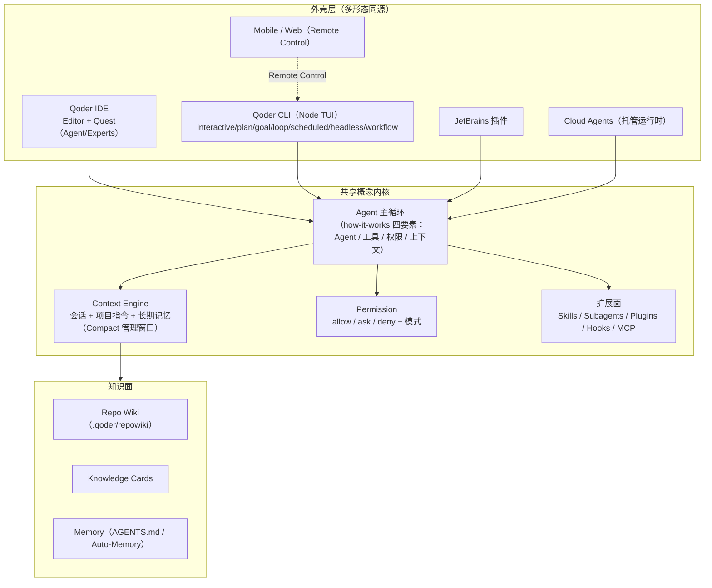
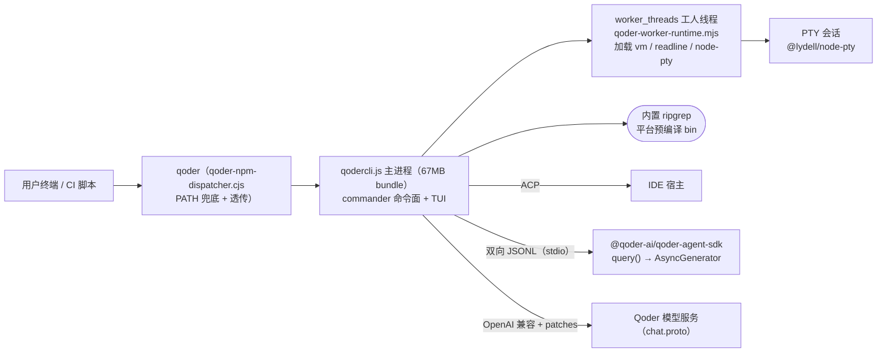
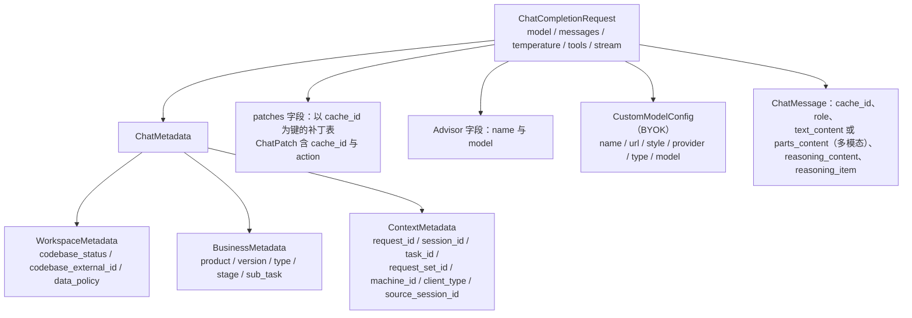
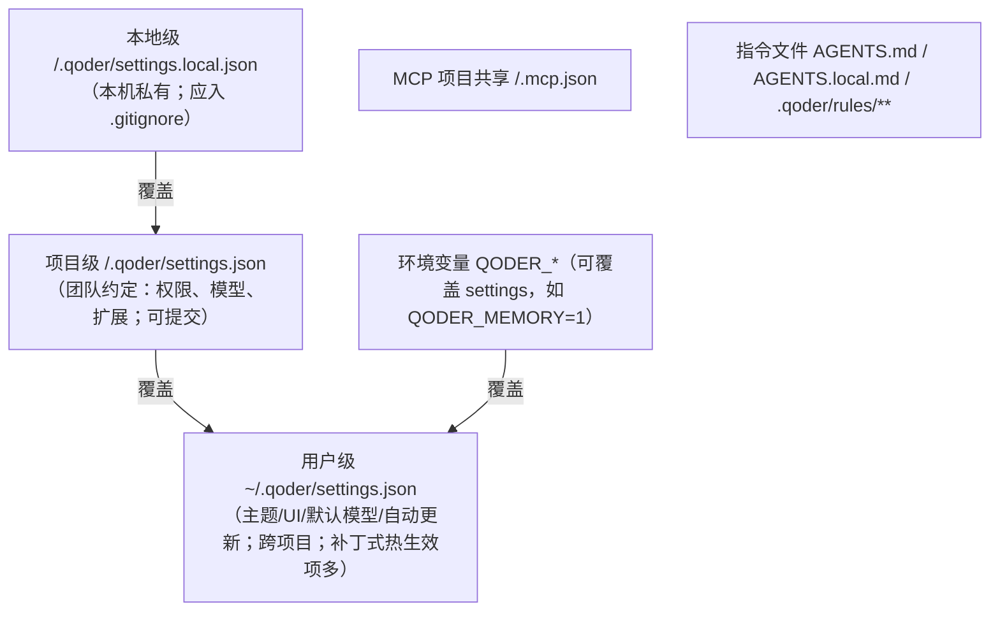
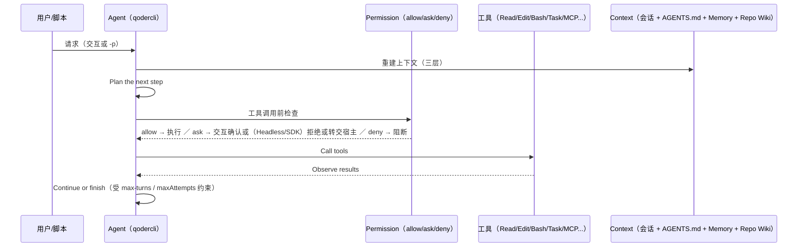
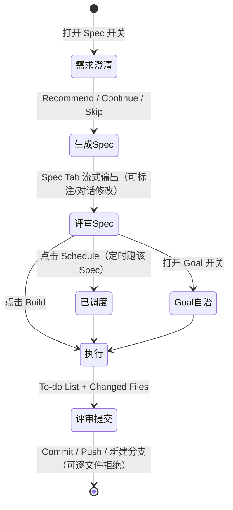

# 竞品研究 07：Qoder（Alibaba）

> 研究对象：**Qoder** —— 阿里出品的「agentic platform」，产品族覆盖 IDE（Quest 模式）、终端 CLI、Cloud Agents、JetBrains 插件、QoderWork/QoderWake 与移动/Web 端。
> 研究方法：Qoder 主体**闭源**，因此本文件采用三条证据通道：① **官方文档站** `docs.qoder.com`（逐页抓取正文，`[E2]`）；② **公开分发包实物取证**——`npm pack @qoder-ai/qodercli@1.1.59` 并解包到 `.research-cache/qoder-cli-artifact/`，直读其中随包发布的 `bundle/proto/chat.proto`、`bundle/qoder-worker-runtime.mjs`、内置 SKILL.md、vendored 插件（`[E1]`，在下文标注「分发包实物」以区别于开源仓库源码）；③ 第三方评测（`[E3]`）。
> 分发包基线：`@qoder-ai/qodercli@1.1.59`（`bin: qoder / qodercli`，Node ≥20，`unpackedSize ≈ 69.7 MB`，30 个文件）。
> **证据时点（R09 补）**：无 git 仓库可锚（主体闭源）；证据锚点 = 分发包版本 `1.1.59`（官方 release-notes 标注 2026-09-19 发布；`npm pack` 解包实物存于 `.research-cache/qoder-cli-artifact/`，该目录无 `.git`，无法给出 commit）+ `docs.qoder.com` 抓取窗口 2026-09-19–09-21。产品每日多版，引用时以包版本为唯一可比锚点。
> 证据分级：`[E1]` 直接读到文件（本处 = 随包发布实物，给出包内路径）｜`[E2]` 官方文档｜`[E3]` 第三方｜`[E4]` 推断（显式写推理链）。

---

## 0. 研究边界与证据说明（必读）

1. **Qoder 不是开源产品**：未检索到官方开源仓库（检索词见 §10）。因此本文**没有** `[E1]` 意义上的「仓库源码」；所有 `[E1]` 均指**随 npm 包发布的实物文件**，可复现（`npm pack @qoder-ai/qodercli@1.1.59` + `tar xzf`），路径以 `package/...` 给出。
2. **CLI 主体是打包产物**：`package/bundle/qodercli.js` 为 67 MB 的 bundle（无可读源目录）；本文只在其中做**符号存在性检索**（如工具名、特性名），不做逻辑断定，检索结果一律标注为「分发包符号存在」。
3. **`bundle/proto/chat.proto` 是真正的接口契约**：322 行、`package model.chat;`、`java_package = "com.qoder.grpc.model.chat"`、`option java_multiple_files = true`——字段命名与 OpenAI Chat Completions 高度对齐，且带 `Advisor`、`ChatPatch`、`WorkspaceMetadata` 等自有扩展。这是本研究最有价值的一手材料。
4. **「Quests / Quest 模式」是 IDE 侧概念，CLI 侧不叫 Quest**：CLI 的对应概念是「工作模式（Working Modes）」。混用会导致跨端对照出错，本文件严格区分。
5. **未验证项一律显式标注**，见 §10。

---

## 1. 结论速览

1. **Qoder 是「一个内核、五种外壳」的产品族**：IDE（VS Code 形态）、CLI（Node/TUI）、JetBrains 插件、Cloud Agents（托管运行时）、QoderWork/QoderWake（文档/数字员工），共享同一套概念词汇（Agent / Subagent / Skill / Plugin / Hook / MCP / Memory / Repo Wiki / Permission Mode）。`[E2]` `docs.qoder.com/` 导航结构
2. **模型接入层是「自研 gRPC/OpenAI 兼容契约 + 分级路由」**：`chat.proto` 的 `ChatCompletionRequest` 直接对标 OpenAI 字段，但加了 `patches`（`map<string, ChatPatchList>`，配合每条消息的 `cache_id`）与 `Advisor { name, model }`——即**服务端可对既有会话做增量补丁**，并支持「顾问模型」旁路。`[E1]` 分发包实物 `package/bundle/proto/chat.proto`
3. **模型选型被产品化为「档位（Tier）」而非模型名**：`Auto / Ultimate / Performance / Efficient` 四档 + 「Specific Model」逃生门；各档有公开的 credit 倍率（Auto ~0.5×、Performance ~1.1×、Ultimate ~2.0×、Efficient 0.3×，付费用户限时 0×）。`[E2]` `user-guide/chat/model-tier-selector`
4. **Lite 档已于 2026-09-18 14:00 (UTC+8) 下线**，且**处理策略按产品分化**：UI 产品自动回落到 `Auto`；**Headless CLI / Cloud Agents API / Service Account 若仍指定 Lite 直接报错**。这是「同一配置项在不同外壳上的破坏性差异」的现实案例。`[E2]` `release-notes/lite-model-tier-retirement-notice`
5. **Quest 的规格驱动（Spec-driven）是四段结构化产物 + 五阶段流程**：Spec 文档含「需求描述 / 设计方案 / 任务分解 / 验收标准」四节，流程为「需求澄清（多选问答，可 Recommend/Continue/Skip）→ 生成 Spec → 评审（可标注、可对话修改）→ 点 Build 执行 → 评审与提交」；且 Spec 可被**调度**或**转成 Goal** 长期自治。`[E2]` `user-guide/quest/spec-driven`
6. **Experts Mode 有 7 个具名专家角色**：Lead Agent（不可定制）、Researcher、Full-Stack Engineer、QA、Code Reviewer、UI Operator、Debug Engineer；Quote: 「Lead Agent does not support customization.」并行协作 + Expert Team Canvas 可视化。`[E2]` `user-guide/quest/experts-mode`
7. **Repo Wiki 有明确的落盘位置与治理**：生成在 `<project_root>/.qoder/repowiki`（多语言分 `zh/`、`en/`），由 `/knowledge-plan` 写出的 `wiki_plan.yaml` 控制页面白名单与模板；**手工修改内容被标记保护、不会被自动更新覆盖**，并支持 Git 反向同步。`[E2]` `user-guide/repo-wiki`（注：另有单页声称上限 ~6,000 文件，`[E3]` 评测称 ~6,000，而专家/RepoWiki 页面称 10,000——**两处不一致，见 §10**）
8. **CLI 权限模型是「模式 + 三态规则 + hook」**：`allow / ask / deny` 三态，非交互（Headless）下 `ask` **转为拒绝**；`permissions.allow/ask/deny` 与 `additionalDirectories` 在 `settings.json` 中声明；另有 `security.disableYoloMode` 供管理员关闭 YOLO。`[E2]` `cli/how-it-works`、`cli/settings-reference`
9. **CLI 内建了「Goal / Loop / Scheduled Task」三件套，且做了工程化防抖**：`/goal --turns N`（默认 100 上限，可 `--turns` 覆盖，`/goal resume` 再给 100）；定时任务用 5 字段 cron、存 `.qoder/scheduled_tasks.json`、**带按任务 ID 稳定的 jitter**（recurring 最多延迟 10% 且封顶 15 分钟，一次性任务最多提前 90 秒）、**文件锁保证单进程驱动**、最多 50 个任务、recurring **7 天后自动过期**。`[E2]` `cli/goal-reference`、`cli/scheduled-reference`
10. **CLI 与 IDE 的互通协议是 ACP**（Agent Client Protocol），而**程序化集成走 JSONL 子进程协议**：`@qoder-ai/qoder-agent-sdk` 会 **spawn 一个 `qodercli` 子进程并用双向 JSONL 通信**，入口是 `query()` 返回 `AsyncGenerator<SDKMessage>`。`[E1]` 分发包实物 `package/bundle/builtin/sdk/SKILL.md`；`[E2]` `cli/glossary`（ACP 词条）

---

## 2. 产品与仓库事实

### 2.1 产品族（`[E2]` `docs.qoder.com/` 与产品页）

| 形态 | 说明 | 关键概念 |
| --- | --- | --- |
| **Qoder**（核心 app） | agentic coding 体验；Features 含 New Task / Model Selection / Task Management / Voice Input / Browser / Review & Commit / Terminal / **Computer Use** / Security；Knowledge Center 含 **Repo Wiki / Knowledge Base / Memory**；Extensions 含 Skills / Plugins / Connectors / **Hooks** / **Subagents** | 任务、知识中心、扩展 |
| **Qoder IDE** | Editor（Chat：Ask/Agent/Tools、Inline Chat、Next Edit Suggestion）+ **Quest**（Overview / Agent Mode / Experts Mode / Goal-driven / Spec-driven / Scheduled Tasks / Execution Environments）+ Knowledge（Engine Overview / Repo Wiki / Knowledge Cards / Memory）+ Extensions（Built-in Agents / Subagents / MCP / Canvas / Commands） | Quest 是「委派」窗口，Editor 是「协作」窗口 |
| **Qoder CLI** | 终端 Agent；7 种工作模式；Extending：MCP / Skills / Plugins / Hooks；还有 Cloud Mode（`--remote`）与 Remote Control（移动/Web 遥控本地 agent） | 模式、权限、扩展 |
| **Cloud Agents** | 「fully managed runtime for AI agents」：Agent（模板）/ Environment（容器运行时）/ Session / Event；Vault（凭证）、Multi-agents、Schedules、Webhooks、Channels、Memory Stores、「dreams」 | 纯 API 形态（`https://api.qoder.com/api/v1/cloud/`） |
| **JetBrains Plugin** | Suggestions / Ask / Agent / MCP / Rules | — |
| **QoderWork** | 文档、表格与桌面任务委派 | — |
| **QoderWake** | 数字员工（**Wakers**）做持续自动化；第三方平台任务用 Efficient 档 | 长期运行角色 |
| **Mobile & Web** | 远程控制与任务监控 | Remote Control |
| **Enterprise** | Organization（Members、Roles、Groups、SSO、Models、Knowledge Base、**QMind**）、Security（**MCP Access Control**、**Audit Log**）、OpenAPI（AI Code Metrics & Tracking） | 治理面 |

### 2.2 版本与活跃度

- **CLI 版本节奏极快**：`CLI 0.1.0`（2025-10-15，首发：Quest Mode、Agent Mode、Custom Commands & Subagents、Git-aware）→ `CLI 0.2.0`（2026-04-27，全新 TUI、多模型 BYOK、50+ 内置 slash 命令、对话式创建配置）→ **`CLI 1.0.0`（2026-05-20）**：Cloud Execution（`qodercli --remote`）、RepoWiki 生成、Voice（`/voice`）、Goal 模式（`/goal`）、Agent SDK → 1.1.x 几乎**每日一版**（1.1.39/1.1.40 为 2026-09-01，最高抓取到 **1.1.58/1.1.59 为 2026-09-19**）。`[E2]` `release-notes/qoder-cli`；分发包版本 `1.1.59` 与文档一致
- **分发**：`npm install -g @qoder-ai/qodercli`（包内 README）；同时提供 `https://qoder.com/download` 的 IDE 安装器（macOS/Windows）。`[E1]` 分发包 `README.md`；`[E2]` `qoder/installation`
- **包组成**（`[E1]` `package.json` + 文件清单）：`bundle/qodercli.js`（主 bundle）、`bundle/qoder-npm-dispatcher.cjs`（PATH 兜底 dispatcher）、`bundle/qoder-worker-runtime.mjs`（worker 运行时）、`bundle/proto/chat.proto`、`bundle/builtin/{agent-creator,hook-config,sdk,skill-creator}/SKILL.md`、`bundle/vendor/qoder-security/**`、`bundle/vendor/sites/**`；依赖 `@lydell/node-pty`（由运行时 require）、`sharp`、`@silvia-odwyer/photon-node`（图像）、`@crosscopy/clipboard`；可选依赖是 6 个平台的 **ripgrep** 预编译包（darwin/linux/win32 × arm64/x64）。
- **关键词线索**：`package.json` 的 `keywords` 含 `"gemini"`。`[E1]`。**不能据此断定为 Gemini 集成**（`[E4]` 推断：更可能是模板/依赖残留），列为未决问题。

### 2.3 许可与生态

- CLI 包内 `LICENSE`（12 KB，抓取到文件存在但未逐字判定）。**官方未声明开源仓库**；IDE 侧为商业订阅（Community/Pro/Teams/Enterprise 计划 + Credits 计费）。`[E2]` `cli/glossary`（Plan Tier）、`account/teams/*`
- 第三方评测（`[E3]` Jimmy Song，2025-08-22）称 Qoder 追求「autonomous programming—handing over complete tasks to AI」，架构含「hybrid retrieval and persistent memory systems」，任务委派通过 Quest 模式的 specs 完成，Repo Wiki 上限「~6,000 files」，风格是「hybrid of Kiro and Cursor」，并记录实测问题（资源占用高、扩展兼容失败如 `Extension is not compatible with Code 1.100.0`），早期免费后转向约 $20–30/月 credit 订阅。

---

## 3. 架构总览

### 3.1 产品族拓扑（能力如何复用）



`[E2]` `cli/how-it-works`（四要素与工具循环）、`cli/glossary`（ACP 连接 CLI 与 IDE）；`[E1]` 分发包符号（`worktree` 656 次、`autoMemory` 55 次、`compaction` 33 次）证实 CLI 侧确有 worktree / auto-memory / compaction 三条能力落地。

### 3.2 CLI 进程拓扑（`[E1]` 分发包实物）



关键点：`qoder-worker-runtime.mjs` 顶部即 `const { parentPort, workerData } = require('node:worker_threads')`，并加载 `node:vm`、`node:readline`、`@lydell/node-pty`——即 **TUI/终端能力跑在 worker 线程 + PTY**，主进程负责交互与编排。`[E1]` `package/bundle/qoder-worker-runtime.mjs`（10,202 行）

### 3.3 服务端契约的形状（`chat.proto`）



`[E1]` `package/bundle/proto/chat.proto`：`ReasoningEffort` 枚举与 CLI 设置项 `model.reasoningEffort` 的可选值**完全一致**（`NONE/LOW/MEDIUM/HIGH/XHIGH/MAX`，对应 `none/low/medium/high/xhigh/max`）；`ContentPart` 支持 `text / image_url / input_audio / cache_control`；`ReasoningItem{id, encrypted_content}` 注释写明「Reasoning item for model series (e.g. gpt-5)」——**即该契约的设计目标包含非 Qwen 系模型**。

---

## 4. 24 维度逐项分析

### 4.1 进程与运行拓扑

- CLI：单主进程 + worker 线程 + PTY（§3.2）。`[E1]`
- IDE：VS Code 形态桌面应用（`[E3]` 评测出现「Extension is not compatible with Code 1.100.0」这类 VS Code 扩展兼容报错，佐证其为 VS Code 派生；本次**未获取官方直述**，列为未决）。
- 与 IDE 互通：**ACP**（Agent Client Protocol，术语表明确「the communication protocol between the CLI and IDEs」）。`[E2]` `cli/glossary`
- 远程：`--remote` Cloud Mode 把任务托管到云 VM；Remote Control 从移动/Web 端控制**本机**运行中的 agent。`[E2]` `cli/glossary`、`cli/working-modes`
- Cloud Agents：Agent + Environment + Session + Event 四元组，Session 间**容器隔离**（「Sessions cannot reach one another」），环境销毁即数据擦除。`[E2]` `cloud-agents/overview`

### 4.2 Agent 主循环与回合模型

- 官方口径（`[E2]` `cli/how-it-works`，逐字）：核心是四要素「**the Agent, tools, permissions, and context**」；循环五步：**Receive request → Plan the next step → Call tools → Observe results → Continue or finish**，并明确「This loop repeats for multiple turns... preventing infinite loops in automated scenarios」。
- 回合上限：`--max-turns`（Headless/SDK）、`ui.maxTurns`（1000/2000/3000/unlimited）、`general.maxAttempts` 默认 **10**（模型请求重试次数）。`[E2]` `cli/settings-reference`
- Goal 模式下另有 `--turns` 预算（默认 100，见 §4.11）。`[E2]`
- IDE Quest 的执行语义：`Agent Mode`「The Agent completes development tasks end-to-end — autonomously clarifying requirements, planning solutions, executing code, and verifying results, without continuous manual intervention.」`[E2]`

### 4.3 工具系统

- 官方分类（`[E2]` `cli/how-it-works`）：文件操作（读/写/改/浏览目录）、执行（shell）、搜索（Grep 内容 / Glob 文件名）、信息（Web search、Web scraping）；扩展通道为 MCP + Skills + Subagents。
- **符号存在性证据**（`[E1]` 分发包 `qodercli.js` 内计数）：`WebFetch` 51、`WebSearch` 24、`TodoWrite` 6、`NotebookEdit` 2、`SlashCommand` 72、`Task` 755、`mcp__` 13；`run_terminal_cmd`/`search_replace`/`MultiEdit` 为 0。
- **interpretation（`[E4]`，推理链明确）**：`Read/Write/Edit/Bash/Grep/Glob/Task/WebFetch/WebSearch/TodoWrite/NotebookEdit` 这一组名字与 `mcp__` 前缀，是 **Claude Code 的工具命名约定**；Qoder 采用同构命名，使 `.claude/settings.json` 风格的规则与 hook matcher 可直接迁移。同时**不采用** `run_terminal_cmd`（Grok/Codex 风格）与 `MultiEdit`。注意：`"Read"` 等短串在 bundle 中出现次数少（7/6/5 次），说明**这些名字多以表格/常量集中定义而非散落**，与「工具有一个单一注册表」的推断一致。
- vendored 插件给出的真实 matcher 实证（`[E1]` `package/bundle/vendor/qoder-security/.qoder-plugin/qoder-hooks.json`）：`PostToolUse` 的 matcher 为 `"Edit|Write|MultiEdit|NotebookEdit"`（`|` 表示或），Bash 侧用 `"if": "Bash(git push *)"` 做参数级过滤——**证明 matcher 支持管道或与参数 glob**，与文档一致（§4.14）。
- 工具门控：`tools.core`（内置工具白名单）、`tools.exclude`（排除工具）、`tools.useRipgrep`、`tools.shell.inactivityTimeout` 默认 **300 秒**、`tools.disableLLMCorrection` 默认 **true**（关闭编辑工具的 LLM 纠错）、`model.summarizeToolOutput`（按工具设输出摘要 token 预算）。`[E2]` `cli/settings-reference`

### 4.4 权限与审批

- **五模式术语（`[E2]` `cli/glossary`）**：`Default Mode`（安全读与内部动作自动，敏感操作逐个确认）、`Auto-accept Edits Mode`（自动批准文件编辑，**shell 命令仍需确认**）、`Auto Mode`（AI 自动判断并批准安全操作）、`Don't Ask Mode`（**拒绝**一切需要确认的操作）、`YOLO Mode`（绕过权限、自动批准全部）。设置键 `general.defaultPermissionMode` 取值 `default/accept_edits/plan/auto` 等。`[E2]` `cli/settings-reference`
- **三态决策**（`[E2]` `cli/how-it-works`）：每次工具调用前做检查，结果 `allow`（立即执行）/ `ask`（需确认）/ `deny`（阻断）；**环境相关处理**：「an interactive terminal will prompt you for confirmation, **non-interactive (Headless) mode will convert `ask` to a denial**, and SDK and IDE integrations will delegate the decision to the Host Program.」——这是明确的三通道策略分派。
- 规则面：`permissions.allow / ask / deny`（数组）、`permissions.additionalDirectories`（`--add-dir` / `/add-dir` 追加受信目录）、`permissions.trustDirectories`（用户级存储）、`allowManagedPermissionRulesOnly`（只用受管策略规则）、`autoMode`（Auto 模式分类器的软引导规则）。`[E2]`
- 管理员开关：`security.disableYoloMode`（默认 false，置 true 关闭 `bypass_permissions`）、`security.folderTrust.enabled`（默认 true）、`security.blockGitExtensions`、`security.allowedExtensions`（来源正则白名单）、`security.environmentVariableRedaction.enabled`、`security.enableConseca`（**context-aware security check**，默认 false）。`[E2]`
- MCP 侧规则用 `mcp__<server>__<tool>` 或 `mcp__context7__*` 形式。`[E2]` `cli/mcp-servers`
- **权限不混同记忆**：文档明确「Memory provides context to the model but is **not a strict enforcement policy**. To strictly block commands, tools, or paths, use permission configuration or Hooks.」`[E2]` `cli/memory`

### 4.5 上下文管理

- 官方口径（`[E2]` `cli/how-it-works`）：上下文由三层重建——**会话上下文**（历史消息、工具调用与结果）、**项目指令**（团队维护的静态记忆，如 `AGENTS.md`）、**长期记忆**（跨会话，含 Auto-Memory）；窗口不足时「Qoder manages the context through mechanisms like **Compact**」。
- 术语定义（`[E2]` `cli/glossary`）：`Compaction` = 「Automatic compression of historical messages when conversations become too long, keeping them within the context window」。
- 契约侧存在的调节手段（`[E1]` `chat.proto`）：每条消息可带 `cache_id`，`ChatCompletionRequest.patches` 为 `map<string, ChatPatchList>`，`ChatPatch{cache_id, action}` —— **服务端可对会话中已存在的消息按 cache_id 施加补丁**，这是「不重发全量历史而更新上下文」的通道；配合 `ContentPart.cache_control{type}` 做前缀缓存。`[E4]` 推理：`patches` 的具体语义未在任何文档中说明，本文件只断言「契约存在该字段」，不断言其用途。
- 工具输出预算：`model.summarizeToolOutput`（按工具设 token 预算）与 `model.contextWindow`（显式指定窗口）可调。`[E2]`
- 符号存在性：`qodercli.js` 中 `compaction` 出现 33 次、`microcompact` 为 0。`[E1]`

### 4.6 提示词组织

- 项目指令（静态记忆）的**发现与激活机制最完整**（`[E2]` `cli/memory`）：
  - 文件：`~/.qoder/AGENTS.md`（用户级）、`<project>/AGENTS.md`（项目级、可提交）、`<project>/AGENTS.local.md`（项目私有、不入库）、`<project>/.qoder/rules/**/*.md`、`~/.qoder/rules/**/*.md`；`context.fileName` 可改文件名（默认 `AGENTS.md`）；`agentsMdExcludes` 按 glob 排除。
  - `AGENTS.md` 支持 `@path/to/file` 导入（相对/绝对/`~/`），**指向项目边界外需批准**。
  - **四种激活方式**（`.qoder/rules/` 内规则）：`always_on`（启动即注入正文）、`manual`/`alwaysApply: false`（不注入正文）、`model_decision`（只注入 path/description，由模型决定是否读取；**需 `description`**）、`glob`/`paths`（访问匹配文件后按需加载）。`trigger` 优先于 `alwaysApply`。
  - 加载顺序：启动时从工作目录**向上搜索至 `.git`**（`context.memoryBoundaryMarkers` 默认 `['.git']`）→ 载入用户级；子目录记忆**不预加载**，某文件被成功读取后才从其目录向上搜；`context.discoveryMaxDirs` 默认 **200**；会话内编辑规则**下一回合即时生效**（无需重启）。
  - 系统提示可追加：环境变量 `QODER_APPEND_SYSTEM_PROMPT`。`[E2]` `cli/settings-reference`
- 固定包内建提示资产（`[E1]`）：`package/bundle/builtin/{skill-creator,agent-creator,hook-config,sdk}/SKILL.md` —— 即**用技能来教模型写技能/写 agent/写 hook/用 SDK**；`agent-creator/SKILL.md` 内甚至保留了模板占位符注释「`QODER_CONFIG_DIR` and `QODER_USER_CONFIG_DIR` below are prompt template placeholders resolved by **argumentSubstitution.ts**」——泄漏了内部实现文件名。`[E1]`

### 4.7 MCP

- 传输：`-t` 可选 **`stdio`（默认）/ `sse` / `http` / `ws`** —— 四传输。`[E2]` `cli/mcp-servers`
- 配置按 `-s` 作用域落盘：`user` → `~/.qoder/settings.json`；`local`（默认）→ `${project}/.qoder/settings.local.json`；`project` → `${project}/.mcp.json`。`[E2]`
- 工具命名：`mcp__<server>__<tool>`（例 `mcp__context7__*`）。`[E2]`
- 生命周期：stdio server 随 CLI 启动自动拉起；运行中新增/修改用 `/mcp reload`；新会话启动时发现。`[E2]`
- 治理（`[E2]` `cli/settings-reference`）：`mcp.allowed`、`mcp.excluded`、`mcp.enableAllProjectMcpServers`（默认 false）、`mcp.enabledProjectMcpServers`（逐个批准的项目级 server）、`mcp.lazyLoad`（默认 false，**开启后只暴露 Meta Tool**）+ 环境变量 `QODER_MCP_LAZY=1`。企业侧另有 **MCP Access Control** 页面与 `allowManagedPermissionRulesOnly`。`[E2]`
- **OAuth：官方 MCP 文档未提供 OAuth 配置细节**（文档原话层面「OAuth: No specific OAuth configuration details are provided」）；但 Cloud Agents 侧的 **Vaults** 提供「authenticate with vaults / 管理凭证 / 启动 OAuth 流程」。判定：**CLI 侧 MCP OAuth 未观测到，Cloud 侧有 Vault 抽象**。`[E2]`
- 插件可捆绑 MCP：插件目录下 `.mcp.json`。`[E2]` `cli/plugins`

### 4.8 Skill / 插件机制

- **Skill**（`[E2]` `cli/glossary`）：`Skill` = 「Reusable professional capability templates invoked via `/skill-name`」；`Conditional Skill` = 「Skills that are activated only when specific file paths match」。文件形态为 `SKILL.md` + YAML frontmatter（`[E1]` 实证字段：`name`、`description`、**`allowed-tools`**，如 `allowed-tools: Edit, Write`）；发现位置：`.qoder/skills/`（项目）、用户目录同名路径，以及**插件内的 `skills/`**。`[E2]` `cli/config-scope` 的目录结构列出 `.qoder/skills/`。
- **插件**（`[E2]` `cli/plugins`）：
  - 目录约定：`.qoder-plugin/plugin.json`（清单，**仅 `name` 必填**，另 `version/description/author/homepage/repository/license/keywords`）、`commands/`、`agents/`、`skills/`、`hooks/hooks.json`、`output-styles/`、`bin/`、`.mcp.json`。
  - 安装与作用域：`qoder plugins install <dir> --scope user|project|local`；启停写入 `settings.json` 的 `enabledPlugins`；`qoder plugins validate/enable/disable/list`。
  - **Marketplace**：`plugins marketplace add <git-url|owner/repo|path>`、`marketplace update/list`、按 `name@marketplace-name` 安装。
  - 插件 hook 获得 `QODER_PLUGIN_ROOT` 与 `QODER_PLUGIN_DATA` 两个额外环境变量。
- **内置证券化实证（`[E1]` 分发包 vendored 插件）**：`package/bundle/vendor/qoder-security/.qoder-plugin/plugin.json` 声明 `name: security-scan`、`version: 0.9.2`、`license: Apache-2.0`、`hooks: "./.qoder-plugin/qoder-hooks.json"`、`skills: ["./skills/security-scan"]`，描述为「Pattern-based warnings on edits, cloud-backed diff review on **Stop**, and agentic commit/push review with SHA tracking. All logic runs in the cross-platform **qodersec** binary.」。其 `qoder-hooks.json` 绑定：`SessionStart` → `qodersec-launch ensure-deps`（`async: true`, `timeout: 15`）；`PostToolUse` matcher `Edit|Write|MultiEdit|NotebookEdit` → `review --layer=l1`；`PostToolUse` matcher `Bash` 且 `if: "Bash(git push *)"` → `review --layer=l3`；`Stop: []`。**这与官方「End-to-End Security」页描述的 L1/L2/L3 三层扫描完全对应**（§4.23）。
- **Qoder 自己也用插件分发安全能力**：说明「插件 = 可分发的策略单元」这一形态在其内部已被用于核心安全链路（而非仅社区扩展）。

### 4.9 SubAgent / 多 Agent 编排

- CLI 侧（`[E2]` `cli/subagent`）：
  - 定义：Markdown + YAML frontmatter，文件名不决定名称、以 `name` 字段为准；字段含 `description / tools / disallowedTools / permissionMode / model / maxTurns / timeoutMins`，以及 `isolation: worktree`。
  - 位置与优先级（低→高）：**BuiltIn → User（`~/.qoder/agents/*.md`）→ Project（`.qoder/agents/*.md`）→ Plugin → Flag（`--agents` JSON）**。
  - 内置类型：`general-purpose`（默认）、`Explore`（快速只读探索）、`Plan`（只读实现规划）、`qoder-guide`（非 SDK 模式）、`statusline-setup`（仅 TUI）。
  - 隔离与并行：隔离上下文（独立 transcript 与压缩流「does not directly enter the main conversation」）、可并行、可后台；编排靠**自然语言描述次序**（非显式 DAG）；`isolation: worktree` 用独立 git worktree，返回 diff 供检查。
  - 模型：`model` 取值为模型名/别名/`inherit`（默认）/`auto`/`lite`/`efficient`/`performance`；可在 `settings.json` 的 `agents.overrides.<name>.modelConfig` 覆写（含 `temperature`）。
- IDE 侧（`[E2]` `user-guide/quest/experts-mode`）：**7 个具名专家**（Lead Agent / Researcher / Full-Stack Engineer / QA / Code Reviewer / UI Operator / Debug Engineer），Lead 不可定制、内置专家可选模型/加提示（上限 10,000 字符）/加 Skills 与 MCP；产出物一一对应角色（研究报告、前后端实现、验证证据、风险与改进建议、UI 复现、根因诊断）。官方口径称内部测试**质量提升约 67%**（`[E2]`，属厂商自述，非独立验证）。
- 编排的第三形态（`[E2]` `cli/glossary`）：`Dynamic Workflow` = 「Dynamic workflows that use **JavaScript scripts** to orchestrate background tasks for multiple subagents.」——即**用 JS 脚本做多子代理编排**，这是与「自然语言编排」并存的另一条通道。

### 4.10 任务 / 计划 / Todo 机制

- `TodoWrite` 工具存在（`[E1]` bundle 符号 6 次）；Quest 侧有实时 **To-do List** 与 **Changed Files** 视图。`[E2]` `quest/spec-driven`
- Plan Mode：CLI 用 `/plan`，**只读探索后产出计划**，确认并退出计划模式后才执行；`general.plan.enabled`（默认 true）、`general.plan.directory`（默认系统临时目录）、**`general.plan.modelRouting`（默认 true，计划/实现阶段自动切换模型）**。`[E2]` `cli/working-modes`、`cli/settings-reference`
- Quest 侧的任务对象：`Pin / Fork / rename / delete`；状态 `Running / Action Required / Ready / Error`；**My Quests 看板**三列（Running / Waiting / Completed）；按 **workspace** 组织（一个 workspace 可含多个文件夹）。`[E2]` `user-guide/quest/overview`
- 硬约束（要照抄需注意）：**模式在任务创建时确定、开始后不可切换**；**编辑并重发消息会回滚工作区文件到该轮之前**。`[E2]` `quest/overview`

### 4.11 Goal / 自治循环 / Schedule

- **Goal**（`[E2]` `cli/goal-reference`）：`/goal <desc> [--turns N]`、`/goal status|clear|pause|resume|take`。字段：`objective`、`status(active|paused|complete)`、`maxTurns`、`turnsUsed`、`timeUsedSeconds`、`ownerSessionId`、`planWasActive`。
  - 预算：默认 100 回合；`/goal resume` 在因上限暂停后**再给 100**；显式 `--turns` 优先。
  - 终止：达到回合上限 → 自动 `paused`；**进程崩溃时若为 active，下次启动降级为 paused**；`/goal clear|pause`；或 agent 标记 `complete`。
  - 所有权：仅 owner session 可更新，其他会话需 `/goal take` 夺取——**防「新窗口静默继承旧目标」**。
  - 与权限解耦：**Goal 不改变权限模式**，无人值守需先切 `auto`/`yolo`。
  - 与 Plan 联动：若目标激活前处于 Plan Mode，`/goal resume` 会**同时恢复 Plan Mode**（`planWasActive`）。
- **Schedule**（`[E2]` `cli/scheduled-reference`）：5 字段 cron（分钟/时/日/月/周；不支持 `L W ?` 与名称别名；日月同时限制时按 **OR** 语义）；存 `<project>/.qoder/scheduled_tasks.json`；字段 `id(8 位 hex) / cron / prompt / createdAt / lastFiredAt / recurring`；**jitter 基于 task ID 且跨重启稳定**；**文件锁保证同项目只有一个进程驱动**；一次性任务触发后自删；recurring **7 天自动过期**；上限 **50** 个任务；错过的时间点在启动时提示。可由「自然语言让 agent 建」或 `/loop` 快速建。
- **/loop**：固定间隔重复执行同一任务；`/loop-reference` 另述参数格式、间隔单位、预算上限与取消方式。`[E2]`
- IDE 侧：Quest 任务可 **Schedule**（Spec 卡片上的 Schedule 按钮，指定时间自动跑该 Spec）或**转为 Goal**（Goal 开关，迭代到完成）。`[E2]` `quest/spec-driven`

### 4.12 会话持久化与恢复

- CLI 侧会话保留策略被产品化：`general.sessionRetention.enabled`（默认 true）、`maxAge` 默认 **`30d`**、`minRetention` 默认 **`1d`**。`[E2]` `cli/settings-reference`
- 会话标识来源：环境变量 `QODER_SESSION_ID`、`QODER_SESSION_NAME`；Worktree 目录 `.qoder/worktrees/`（`--worktree` 创建）；计划产物在 `general.plan.directory`；定时任务在 `.qoder/scheduled_tasks.json`。`[E2]` `cli/config-scope` 目录结构
- Headless/SDK 会话：`-p` 非交互 + 结构化输出（Text / JSON / Stream JSON）；SDK 侧会话管理由 SDK 承担（`query()` 流式返回）。`[E2]` / `[E1]`
- `ChatPatch{cache_id, action}` 在契约层存在（§4.5），推测与「编辑已发消息 / 上下文回滚」相关。`[E4]`
- Quest 侧可复现性由「任务 + Spec 文档 + 变更文件 + Review 面板」承载，且有「编辑消息触发工作区回滚」的强语义。`[E2]`
- Cloud 侧：Session 可 create/get/list/update/delete/archive/search；环境销毁即擦除数据。`[E2]`

### 4.13 事件与可观测

- Cloud Agents 的**一等公民就是 Event**：Session「produces a real-time event stream」，消费方式 **SSE 或轮询**；这是本文所见最明确的「事件流即产品接口」设计。`[E2]` `cloud-agents/overview`
- 计量与成本可观测：`/usage`（Plan 与 plan credits）；`aiCodeStatistics.enabled`（默认 true，记录并上报 **AI 生成代码统计**）；`privacy.usageStatisticsEnabled`（默认 true，关闭即进入 Privacy mode）；企业侧 **AI Code Metrics & Tracking OpenAPI**。`[E2]`
- 请求级追踪字段（`[E1]` `chat.proto`）：`ContextMetadata{request_id, session_id, task_id, request_set_id, machine_id, client_type, source_session_id}` 与 `BusinessMetadata{product, version, type, stage, sub_task}`——即**每次模型调用都携带业务阶段与来源会话**，可直接做成本归因与链路还原。
- 工作区侧状态字段：`WorkspaceMetadata{codebase_status, codebase_soft_status, codebase_external_id, data_policy}`（`[E1]`）——`data_policy` 与企业数据策略相关，`codebase_external_id` 是索引服务侧标识。
- 符号存在性：`qodercli.js` 中 `autoMemory` 55 次（`[E1]`）。

### 4.14 Hooks / 生命周期扩展点

- **完整事件名清单（`[E2]` `cli/hooks`）**：
  - 会话：`SessionStart`(matcher `source`)、`SessionEnd`(`reason`)、`UserPromptSubmit`(**可阻断**)、`Stop`(**可阻断**)、`StopFailure`(`error_type`)
  - 工具：`PreToolUse`(**可阻断**，matcher=工具名)、`PostToolUse`、`PostToolUseFailure`、`PermissionRequest`、`PermissionDenied`
  - Agent：`SubagentStart`(`agent type`)、`SubagentStop`(**可阻断**)
  - 上下文与配置：`PreCompact`(**可阻断**，`trigger`)、`PostCompact`、`InstructionsLoaded`(`load_reason`)、`ConfigChange`(**可阻断**，`source`)、`CwdChanged`、`FileChanged`(basename)
  - 通知与 worktree：`Notification`(`notification_type`)、`WorktreeCreate`(非零退出即失败)、`WorktreeRemove`
  - MCP：`Elicitation`(**可阻断**)、`ElicitationResult`(**可阻断**)，matcher=`mcp_server_name`
- **四类 hook 入口类型**（`[E2]`）：`command`（默认，shell）、`http`（响应需为 JSON `HookOutput`）、`prompt`（**单次 LLM 调用、隔离会话**，返回 `{ok, reason}`）、`agent`（**派生 sub-agent 验证**，隔离会话，必须调用 `StructuredOutput`）。
- 匹配：matcher 支持 `*` / 精确 / `|` 或 / 正则（`mcp__.*`）；entry 级 `if` 支持 `ToolName(arg_pattern)`（glob 匹配主参数），如 `Bash(git *)`。`[E2]`+`[E1]`（vendored 插件实证）
- 输出协议：退出码 `0`（成功）/`2`（阻断，stderr 回喂模型）/其他（非阻断错误，stderr 入日志）；JSON 字段 `continue`、`decision(allow|deny|ask)`、`reason`、`hookSpecificOutput`（**必须内含 `hookEventName`，否则 TUI 报错**）。`[E2]`
- 安全与边界：`prompt`/`agent` 型 hook 的评估器在**独立会话**内运行、**看不到主对话历史**（依赖历史须用 `command` hook）；`PermissionRequest` hook **不支持 `ask` 行为**，需用 `PreToolUse` 的 `permissionDecision: "ask"`；环境变量 `QODER_PROJECT_DIR / QODER_PLUGIN_ROOT / QODER_PLUGIN_DATA`；Windows 下 `.bat/.cmd` 需 `{"command":"cmd.exe","args":["/c","script.bat"]}`。`[E2]`
- 配置位置（三源合并）：`~/.qoder/settings.json`、`${project}/.qoder/settings.json`、`${project}/.qoder/settings.local.json`。`[E2]`

### 4.15 沙箱与安全执行

- 本地侧：**Quest 的 Execution Environments**（Local / **Worktree**；官方建议「For heavy development involving many files, we strongly recommend using the Worktree environment to fully isolate changes」）；Experts Mode 下**终端工具自动执行不需确认，但潜在危险命令在沙箱环境运行**。`[E2]` `quest/agent-mode`、`quest/experts-mode`
- Cloud 侧：隔离容器沙箱、Session 间不可互达、环境销毁即擦除。`[E2]`
- 企业安全方案（`[E2]` `enterprise/solutions/end-to-end-security`）：
  - 结构：**四层防御 + 两个闭环**——「security policy and identity / Agent runtime protection / code risk detection and remediation / delivery gates plus security operations」。
  - 运行时治理：「**MCP allowlist**、**Hook interception**、**runtime isolation policies**」。
  - 三层代码扫描：**L1 Static Check**（agent 写入代码即检查）→ **L2 Lightweight Scan**（任务结束时对增量代码做语义分析）→ **L3 Deep Scan**（提交/推送前做**跨文件数据流**分析）。L3 会判断「input 是否可控、数据是否真正到达危险 sink、内部包装方法是否有效」。
  - 出向控制：「use deterministic rules to block dangerous commands, sensitive paths, and **unauthorized outbound transfers**」。
  - **明确指出 out-of-scope**：「Improving **network and file isolation**...」列为实践成果中的待改进项——**即其自认网络与文件隔离尚不完善**。
- vendored 安全插件的 L1/L3 落地见 §4.8（`[E1]`）。

### 4.16 工作区 / 远程执行

- Worktree：`.qoder/worktrees/`、`--worktree` 创建、`isolation: worktree` 子代理、Quest 的 Worktree 环境；符号存在性 `worktree` 656 次（`[E1]/[E2]`）。
- 远程执行三档：
  1. **Cloud Mode（`--remote`）**：任务在云 VM 托管运行；`CLI 1.0.0`（2026-05-20）引入；`CLI 1.1.43`（2026-09-04）仍在修远程云执行与路径处理。`[E2]`
  2. **Cloud Agents**：Agent + Environment + Session 的 API 化托管（容器类型/依赖/启动脚本可配），SSE 流式。`[E2]`
  3. **Remote Control**：从移动/Web 端控制**本机**运行的 agent（「enabling remote decision-making at critical nodes」）。`[E2]`
- 额外受信目录：`--add-dir` / `/add-dir` 与 `permissions.additionalDirectories`，并可 `context.loadMemoryFromIncludeDirectories` 决定是否从中加载记忆（默认 false）。`[E2]`

### 4.17 Git 与 Worktree 集成

- CLI 原生 git 能力：Git-aware（0.1.0 起）；`1.1.57`（2026-09-19）发布「Hardened Automatic Git Checks (Fixed security issue with internal Git calls)」——**说明其自动 git 检查曾存在安全问题并已修**。`[E2]` `release-notes/qoder-cli`
- Quest 侧提交链：Diff view → Review and reject（**逐文件拒绝或全部拒绝**）→ Commit / Push / Create New Branch；有本地仓库用 Commit，链远程则 push 或开 PR。`[E2]`
- Worktree hook 事件 `WorktreeCreate` / `WorktreeRemove` 存在（§4.14）。`[E2]`
- 企业审计与提交门禁：L3 深扫在 Commit/Push 前触发，使「复杂漏洞不进入 PR 或下游交付链」。`[E2]`

### 4.18 记忆 / 知识库

- **两层记忆模型（`[E2]` `cli/memory`）**：
  - **Static Memory**（团队维护的持久指令）：`~/.qoder/AGENTS.md`（跨项目）、`<project>/AGENTS.md`（团队共享）、`<project>/AGENTS.local.md`（本机私有）、`.qoder/rules/**/*.md` 与 `~/.qoder/rules/**/*.md`（按主题拆分）。
  - **Auto-Memory**（CLI 自动落盘的 Markdown）：`~/.qoder/projects/<project>/memory/`（项目级）与 `~/.qoder/memory/`（用户级）；结构为 `MEMORY.md`（索引，**最多读前 200 行或 ~25KB**）+ 若干主题文件（如 `user-preferences.md`、`feedback-testing.md`、`project-release-context.md`）。
  - 内容分类四型：`user`（角色/长期偏好/习惯）、`feedback`（纠正与确认）、`project`（背景/约束/决策原因）、`reference`（外部系统位置、文档、看板）。
- 开启与作用域：`autoMemoryEnabled`（settings，默认 **false**）、`QODER_MEMORY=1`（**覆盖 settings**；仅交互式 TUI 会话）、`QODER_MEMORY_USER=1`（额外开启用户级，需前者）；
  - **限制**：Auto-Memory 只在交互 TUI 会话运行；**不自动跨机器同步**，可能过时。
- 管理：`/memory`（总览：User / project / local 记忆文件，含打开 auto-memory 目录入口）、`/memory manage`（管理主题文件；删文件会移除 `MEMORY.md` 对应索引行）；自然语言 `Remember / Forget / 写入 AGENTS.md`。
- **Repo Wiki（`[E2]` `user-guide/repo-wiki`）**：
  - 落盘：`<project_root>/.qoder/repowiki`；多语言各自目录（`repowiki/zh/`、`repowiki/en/`）。
  - 生成控制：`/knowledge-plan` 产出 `wiki_plan.yaml`，含 `version`、`repowiki.template`（预设：architecture / product_requirement）、`repowiki.notes[]`（注入指导）、`repowiki.documents[]`（**页面白名单**：`title / goal / parent / hints`）、`scope.include/exclude`（.gitignore 语法）。
  - 更新触发：首次生成 / 代码变更被检测到且与 Wiki 不一致时点 Update / Git 目录 Markdown 被手改后点 **Sync** / 团队共享走 git（Teams 计划）。
  - **保护**：「Manually modified content is marked and protected by the system—it won't be overwritten during the next automatic update」；手工修订**反向同步到对应 Knowledge Cards**。
  - 消费方式：agent 依赖预建架构知识快速回答「How is X implemented?」「Which services depend on this module?」——**几乎不需调用工具**；上下文紧张时用于加速代码定位。
  - 本地性：**在本地客户端运行、不上传全量代码、结果只存本地仓库、无服务端留存**。
  - 索引排除：IDE 设置 Codebase Indexing → Index Exclusions。文件上限存在**文档不一致**（见 §1.7 与 §10）。
- 其他知识面：Knowledge Base / Knowledge Cards / **QMind**（企业知识库，独立产品页）；`/knowledge-plan` 与我方工作区中可见的 `qoder-context` 技能描述一致（`.qoder/repowiki/wiki_plan.yaml`）。

### 4.19 A2A / 被集成能力

- **ACP**：CLI ↔ IDE 的协议。`[E2]` `cli/glossary`
- **Agent SDK（`[E1]` 分发包实物 + `[E2]`）**：
  - 包名 `@qoder-ai/qoder-agent-sdk`；**spawn 一个 `qodercli` 子进程，用双向 JSONL 通信**；入口 `query()` 返回 `AsyncGenerator<SDKMessage, void>`；被列举的表面 API 含 `query()`、`createSdkMcpServer`、`tool()`、`accessTokenFromEnv`、`canUseTool`；另需 `zod`。
  - 官方 CLI 概览把「Agent SDK integration」列为 **1.0.0 的里程碑能力**（2026-05-20）。
- **Headless**：`qoder -p` / `--print`，输出 Text / JSON / Stream JSON；`--max-turns` 限轮；权限需预配（无人在场确认）。`[E2]`
- **Cloud Agents API**：`https://api.qoder.com/api/v1/cloud/`，Bearer PAT 或 SAT（Service Account Token，用 SA API Key 走 Service Token Exchange 换取）；两种模式 **Forward Mode** 与 **Managed Mode**（各自端点族，含 sessions / threads / batches / schedules / webhooks / channels / environments / skills / vaults / files / drives / memory stores / **dreams** / models / realtime / usage）；单 Agent 的并发 Session **无硬上限**。`[E2]`
- 企业 OpenAPI：AI Code Metrics & Tracking。`[E2]`

### 4.20 客户端形态与交互细节

| 形态 | 交互要点（`[E2]`） |
| --- | --- |
| **CLI TUI** | 7 模式；`ui.*` 有 25+ 项可调（主题、autoThemeSwitching、inlineThinkingMode(off/full)、maxTurns、showLineNumbers、compactToolOutput、loadingPhrases(tips/witty/all/off)、errorVerbosity(low/full)、**useAlternateBuffer**、**incrementalRendering**（需 alternate buffer）、**terminalBuffer**（新终端缓冲架构）、**renderProcess**（Ink 渲染进程）、accessibility.screenReader（纯文本输出）、showMemoryUsage、rotatingInfoLine 等）；`ui.terminalBackgroundPollingInterval` 默认 60 秒 |
| **CLI 输入** | vimMode；拼写检查（`spellcheck.checker` 可选 auto/aspell/hunspell/ispell，**仅读用户级 settings**）；`@` 引用与类型前置（useTypeahead 存在于源码目录约定）；底部 statusLine（`statusLine.command` 由 shell 命令生成） |
| **IDE Quest** | 三栏布局（左：任务管理 + Knowledge hub/插件市场/设置；中：对话 + 侧轨定位器；右：Summary/Review/Commit）；支持 `@` 引用、模型选择、语音输入、**上下文压缩**、Diff、逐文件拒绝、Go to file、浏览器与 Terminal 面板、Spec 面板 |
| **IDE Editor** | Chat（Ask / Agent / Tools）、Inline Chat、Next Edit Suggestion；Canvas；内置 agents |
| **QoderWork** | 文档/表格/桌面任务 |
| **Mobile/Web** | 远程控制与监控 |
| **QoderWake** | 数字员工持续自动化 |

- 定时任务与启动交互细节：错过的时间点「a prompt will be shown at startup」；jitter 规则见 §4.11。`[E2]`

### 4.21 配置面与层级



- 三作用域与合并语义：官方原文「configuration items appearing in multiple scopes are **merged and overridden**」；`local` 被描述为「Personal temporary overrides for project configuration」→ **Local > Project > Personal**（`[E2]` `cli/config-scope`；细粒度层级见 `/cli/settings`，本次未逐条抓取，列为未决）。
- 目录与用户配置根：`QODER_CONFIG_DIR` 可改（默认 `~/.qoder`）。
- **热点/陷阱（`[E2]`）**：`spellcheck` 块**只读用户级 settings 与 `--settings` 标志**，写在项目/本地级会被忽略——文档显式警示。
- 需重启项：`mcpServers`、`autoMemoryEnabled`、`outputStyle`、`language`、`vpcInstanceName`、`agent`、`enabledPlugins`、`security.*`、`tools.core/exclude`、多数 `context.*`、`ui.useAlternateBuffer/renderProcess/incrementalRendering/terminalBuffer` 等均标注 **Restart = Yes**；而 `hooks`、`permissions.*`、`skills` 类为 **No**。
- 环境变量清单（22 个，`[E2]`）：`QODER_PERSONAL_ACCESS_TOKEN`、`QODER_CONFIG_DIR`、`QODER_MODEL`、`QODER_WORKING_DIR`、`QODER_SESSION_ID`、`QODER_SESSION_NAME`、`QODER_PERMISSION_MODE`、`QODER_APPEND_SYSTEM_PROMPT`、`QODER_MCP_LAZY`、`QODER_ASR_URL`、`QODER_SUBAGENT_MODEL`、`QODER_MEMORY`、`QODER_MEMORY_USER`、`HTTP(S)_PROXY`、`NO_PROXY`、`NODE_EXTRA_CA_CERTS`、`SSL_CERT_FILE`。
- 企业私部署线索：`vpcInstanceName`（「**VPC Private Deployment instance name (CN edition)**」）+ 阿里云文档《Qoder CN (Suite) Enterprise VPC Edition》。`[E2]`/`[E3]`
- 网络：Proxy 配置页 + `NODE_EXTRA_CA_CERTS`/`SSL_CERT_FILE` 支持企业自签 CA。`[E2]`

### 4.22 更新 / 分发 / 遥测 / 许可

- 更新：`general.enableAutoUpdate` 默认 **true**；分发渠道为 npm（CLI）与 `qoder.com/download`（IDE）。`[E2]`/`[E1]`
- 遥测：`privacy.usageStatisticsEnabled` 默认 **true**（关= Privacy mode）；`aiCodeStatistics.enabled` 默认 **true**（AI 生成代码统计，**Restart = Yes**）。
- 计费：Credits 为计费单位；`Price Factor`＝不同模型的 credit 倍率；Plan Tier：Community / Pro / Teams；另有 Add-on Credits 与 **Org Resource Package**；档位倍率与示例消费见 §1.3；**Service Account 用量被排除在 Efficient 免额之外、按 0.3× 计**；子代理「按具体模型的调用单独计费」；DeepSeek 两模型有**峰谷价**（工作日 09:00–12:00、14:00–18:00 (UTC+8) 为峰，谷价 50%）。`[E2]`
- 许可：CLI 包内 `LICENSE` 存在（未逐字判定）；vendored 的 `qoder-security` 插件声明 **Apache-2.0**。`[E1]`
- Privacy 表述：Repo Wiki 明确本地运行、不上传全量代码、无服务端留存（§4.18）；但 Cloud Agents 与模型调用显然出网——**两种模式的边界应在引用时严格区分**。`[E2]`

### 4.23 企业能力

- 组织：Members & Roles、Groups & Billing Groups、**SSO**、Models（企业模型管控）、Enterprise Knowledge、QMind。
- 身份（`[E2]` `account/teams/sso`）：SSO 支持 **SAML 2.0** 与 **OIDC**（同一组织同时只能启用一种）；OIDC 支持 Discovery URL 一键配置（`/.well-known/openid-configuration`）；**已验证邮箱域名的用户在首次登录时自动加入组织（自动 provision）**——即 SCIM 语义由「域名+首次登录」承担，**文档未出现 SCIM 字样**；配置流程六步（验证域名 → 创建 SSO 配置 → 配 IdP → 属性映射（Email 必填）→ Test SSO → 启用）；官方给出运维建议「激活 SSO 后管理员不要立即登出」。
- 安全治理：**MCP Access Control**、**Audit Log**；`allowManagedPermissionRulesOnly`；`security.disableYoloMode`。
- 私有化：CN 版 **VPC Private Deployment**（`vpcInstanceName`）+ 阿里云文档页。`[E2]`/`[E3]`
- 度量：AI Code Metrics & Tracking OpenAPI。
- 计费治理：Org Resource Package 统一分配 credits。
- **未见**：SCIM 协议支持、跨租户隔离的技术细节、审计日志的字段/schema、配额强制的技术实现（均为文档未展开，列 §10）。

### 4.24 显著工程细节

- **`qoder-npm-dispatcher.cjs`**：bin `qoder` 指向它，作用是把真实入口插回 PATH 首位再 exec——**解决 npm 全局包与用户 PATH 里其他 `qoder` 冲突/自递归**的工程细节（源码可见 shell 片段 `_qoder_dispatcher_entry` 循环去重 PATH，见 `qoder-worker-runtime.mjs` 内嵌字符串）。`[E1]`
- **PTY 与 worker 线程**：终端能力用 `@lydell/node-pty` 在 worker 线程内运行（`node:worker_threads` + `node:vm` + `node:readline`）。`[E1]`
- **平台化 ripgrep**：6 个 optionalDependencies 覆盖 darwin/linux/win32 × arm64/x64，避免运行时下载。`[E1]`
- **定时任务的工程化**（§4.11 全项）：jitter 稳定、文件锁、自动过期、数量上限、错过提示——**一套可直接借鉴的「单机调度器」设计**。
- **质量与稳定性节奏**：1.1.x 每日多版，发布说明以「Stability / Performance / Reliability Improvements」为主，**且明确记录安全修复**（1.1.57 的自动 git 检查加固）。`[E2]`
- **配置热生效标注**：每个 settings 键都标注是否需 Restart——**配置文档的可用性基线**。`[E2]`
- **内部实现文件名泄漏**：`argumentSubstitution.ts`（见 §4.6）。`[E1]`
- **厂商自述的内部指标**：Experts Mode「~67% quality improvement」、Repo Wiki 加速定位——均为自述，无独立验证。`[E2]`

---

## 5. 核心流程源码走读

> Qoder 闭源，故本节为「契约/文档驱动的流程重建」，证据类型标注清楚；凡涉及内部实现的步骤均标 `[E4]`。

### 5.1 CLI 工具循环与权限分派（`[E2]` + `[E4]`）



关键断言出处：四要素与五步循环、`allow/ask/deny` 三态、**Headless 将 `ask` 转为拒绝**、SDK/IDE **delegate the decision to the Host Program**。`[E2]` `cli/how-it-works`

### 5.2 Quest 规格驱动五阶段（`[E2]`）



要点：Spec 四节（需求描述/设计方案/任务分解/**验收标准**）；**执行中可「Add requirements mid-task」触发重规划**；模式（Agent / Experts）**创建时确定不可切换**；**编辑消息会回滚工作区**。

### 5.3 SDK 集成（子进程 + 双向 JSONL）（`[E1]` + `[E2]`）

```
package/bundle/builtin/sdk/SKILL.md
  "The Qoder TypeScript SDK (@qoder-ai/qoder-agent-sdk) runs Qoder AI agents programmatically.
   It spawns a `qodercli` subprocess and communicates over a bidirectional JSONL protocol.
   The single entry point is `query()`, which returns an `AsyncGenerator<SDKMessage, void>`
   — iterate it to receive assistant messages, tool calls, and the final result."
  表面 API 举例：query() / createSdkMcpServer / tool() / accessTokenFromEnv / canUseTool
```
设计含义（`[E4]` 推理链）：**「CLI 即运行时」**——SDK 不重新实现 agent loop，而是把已发布的 CLI 当子进程拉起并以 JSONL 交换事件，因此 SDK 与 CLI 的能力面天然一致，且**升级 CLI 即升级 SDK 能力**（代价是版本耦合与进程开销）。这与「SDK 内嵌 loop」的方案（如多数 TS agent SDK）是两条不同路线，对 OpenCoding 卷 29（开发者生态）有直接参考价值。

### 5.4 内置安全插件的双层扫描挂载（`[E1]` 分发包实物）

```
package/bundle/vendor/qoder-security/.qoder-plugin/qoder-hooks.json
  SessionStart  → ensure-deps --hook-event SessionStart      (async: true, timeout: 15)
  PostToolUse   matcher=Edit|Write|MultiEdit|NotebookEdit
                → review --platform=qoder --mode=hook --layer=l1
  PostToolUse   matcher=Bash  if=Bash(git push *)
                → review --platform=qoder --mode=hook --layer=l3
  Stop          → []
```
与官方 L1/L2/L3 分层对照：**L1 挂在「编辑后」（写一行查一行）**，**L3 挂在「git push 前」**（跨文件数据流），L2 由「任务结束」触发（对应 `Stop` 事件，插件包内 `Stop: []` 为空——`[E4]` 推测 L2 由云端 diff review 在 Stop 时异步承担，与 plugin.json 描述「cloud-backed diff review on Stop」一致）。这条链路是**「企业安全能力以插件+hook 形态分发」**的完整样本。

---

## 6. 工程亮点与可借鉴点

1. **模型档位（Tier）而非模型名作为产品接口**：用户选「Auto/Ultimate/Performance/Efficient」，厂商自由换后端模型；倍率公开且可算。**把路由决策留在服务端**是「自封装接入层」的一种强形态（对应我们卷 02）。
2. **契约里内建 `patches` + `cache_id`**：允许服务端/客户端在不重发全量历史的前提下更新会话内容，同时给前缀缓存留了 `cache_control`。这是长会话成本优化的结构性设计。
3. **`ContextMetadata` 携带 `request_set_id / task_id / source_session_id`**：模型调用级别即可做**任务—请求—来源会话**三方归因，成本归因不需要事后拼接。
4. **规范四段 + 五阶段的 Spec 流程**，且**把验收标准写进 Spec 本体**（对应我们卷 14 的「规格驱动 + 证据验收」）。
5. **Experts 的角色—产出物一一对应，且 Lead Agent 不可定制**：可编排但不能被改坏——一个很克制的自治边界设计（对应卷 13）。
6. **Goal 的所有权与降级语义**：`ownerSessionId` + `/goal take` 夺取 + **崩溃后 active→paused** + **resume 给回固定预算（100 回合）**。三者合起来防住「僵尸自驱」（对应卷 15）。
7. **单机调度器的工程化护栏**：按 ID 稳定 jitter、文件锁、7 天自动过期、50 个上限、错过提示（对应卷 15 Schedule）。
8. **权限三通道分派**：交互=提示，Headless=**把 ask 降级为拒绝**，SDK/IDE=**交宿主决策**。这是「同一决策在不同外壳上语义不同」的显式建模（对应卷 06/22/23）。
9. **Hook 四类型（command/http/prompt/agent）**：把「LLM 判定」与「子代理验证」作为 hook 一等形态，同时**隔离会话、看不到主对话历史**，边界清楚（对应卷 17）。
10. **用插件分发核心安全能力**：`qoder-security` 以 `.qoder-plugin` + hooks 形式挂载 L1/L3，而不是把安全逻辑写进内核（对应卷 18/30）。
11. **配置文档逐键标注「是否需重启」**：极低成本的可用性改进，直接可抄（对应卷 33/文档规范）。
12. **SDK = 子进程 + JSONL**：能力面自动与 CLI 对齐；适合我们卷 29 的「SDK 轻量化」分支论证。
13. **Repo Wiki 的「手工修改受保护 + 反向同步」**：把生成物当**可共编资产**而非只读产物，是知识库可持续的关键（对应卷 11）。

---

## 7. 局限与不可照搬点

1. **闭源且不可验证**：无仓库、无提交历史、bundle 为 67 MB 打包产物。**所有内部实现断言都只能到「符号存在」级别**；不可把本文的 `[E4]` 推断当事实使用。
2. **云端强依赖**：模型服务、Cloud Agents、VPC 版、度量 OpenAPI 均需 Qoder 云；**Repo Wiki 的「本地不上传」只覆盖 Wiki 生成环节**，不等于整体不出网。
3. **Credits + 档位计费把「成本」变成一等产品变量**：`Efficient` 免额这类促销会使同任务的成本随时间变化；照抄「档位制」需自带清晰的价格治理，否则用户无法预测成本。
4. **档位下线是破坏性的**：Lite 下线时 **Headless CLI / Cloud API / Service Account 直接报错**——同一配置项在不同外壳上处置不同。我们做模型别名/档位时必须提供**兼容过渡与显式错误信息**（对应卷 02 的能力协商）。
5. **Experts 的「67% 质量提升」是厂商自述**，无第三方复现；不可引用为收益承诺。
6. **Repo Wiki 文件上限文档不一致**（6,000 vs 10,000）——引用时必须双写或标注冲突（本文件已标注）。
7. **Quest 的硬约束代价**：模式不可中途切换、编辑消息即回滚工作区。对「长任务中途改需求」的体验是双刃剑；我们卷 22/33 的交互设计需要更好的**可中途改需求而不丢工作**的语义。
8. **Auto-Memory 只在交互 TUI 运行且不跨机同步**：无人值守/CI 场景无记忆积累；且**必须显式开启**（默认 false）。
9. **Auto Memory 与静态记忆的边界靠人**：官方自己强调 Memory 不是强制策略；治理需另有权限/hook。
10. **子代理编排靠自然语言**：无显式 DAG/依赖声明（另有 JS Dynamic Workflow 作为补丁），复杂编排水位不如声明式（对比我们卷 13/14 的 DAG 与黑板）。
11. **平台覆盖**：CLI 声明 `os: darwin/linux/win32`（Windows 有 ripgrep 预编译包与 `.cmd` hook 路径），但 IDE 侧安装渠道只列出 macOS/Windows——**跨平台细节需各自核验**。
12. **合规与地缘**：CN 版走 VPC 私有化与阿里云文档体系，国际版为 qoder.com；**若用于跨国部署需明确版本身份**（`vpcInstanceName` 即为该差异的开关）。

---

## 8. 对 OpenCoding 的启示（映射 Phase A 卷号）

1. **【采纳 + 拒绝】卷 02 模型网关（并映射卷 03 上下文）**：采纳「档位（Tier）抽象」作为用户面向的稳定接口——用户选 Auto/Ultimate/Performance/Efficient，后端模型可自由替换；并采纳契约层 `patches + cache_id + cache_control` 的**增量会话更新与前缀缓存标记**能力，为长会话压缩与缓存亲和提供结构性支持。**必须拒绝**「档位与 credit 倍率写在同一份文档里」的耦合，以及「档位下线时不同外壳处置不一致」的做法——我们应在**档位/别名下线时提供显式错误 + 兼容映射 + 过渡期**（Lite 停服时 Headless CLI/Cloud API/Service Account 直接报错的教训）。`[E1]/[E2]`
2. **【采纳 + 适配】卷 14 任务与计划（并映射卷 19/21/22/33）**：采纳「四段 Spec（需求描述 / 设计方案 / 任务分解 / **验收标准**）+ 评审通过（点 Build）后才执行」的规格驱动形态，并把**验收标准设为必填节**；同时采纳「执行中可追加需求并触发重规划」。**但需适配其硬约束**：Qoder 选择「编辑历史消息 = 回滚工作区到该轮之前」，实现简单却代价大——我们应在卷 19（恢复）+ 卷 21（worktree）上设计**基于检查点的部分回滚**，并在卷 33 明确确认文案。`[E2]`
3. **【采纳】卷 15 Goal 与 Schedule**：Goal 采纳三条硬规则——① `ownerSessionId` 归属 + `/goal take` 显式夺取（防新窗口静默继承）；② **进程崩溃后 active 自动降级为 paused**；③ resume 给回**固定预算**（100 回合）而非无限续期。Schedule 采纳完整护栏清单：本地时区 5 字段 cron、**按任务 ID 稳定**的 jitter（recurring 最多延迟 10% 且封顶 15 分钟、一次性最多提前 90 秒）、文件锁保证单进程驱动、recurring 7 天自动过期、任务数上限 50、错过时间点启动时提示——并把这些全部做成配置项（符合我们「业务阈值配置化」规则）。`[E2]`
4. **【采纳】卷 06 权限系统**：采纳「三态（allow/ask/deny）+ 外壳差异处理」——交互终端 = ask 转提示；**Headless = ask 转拒绝**；被集成（SDK/ACP）= **交宿主决策**；并把管理员开关按「能力」而非「文件」组织（`disableYoloMode` / `allowManagedPermissionRulesOnly` / MCP allowlist）。同时采纳其边界声明：**记忆不是强制策略**，阻断必须走权限或 hook。`[E2]`
5. **【采纳】卷 06/17 Hook 的三条边界**：① 四类 hook 入口（command / http / **prompt（单次 LLM 调用）** / **agent（派生子代理验证）**）；② `prompt` 与 `agent` 型评估器在**隔离会话**内运行、**看不到主对话历史**；③ `PermissionRequest` hook **不支持 ask**（要 ask 必须用 `PreToolUse` 的 `permissionDecision`）。这三条能避免我们重蹈「hook 与权限系统职责重叠」。`[E2]`
6. **【采纳】卷 17/18 扩展体系的「策略型插件」范式**：Qoder 用 `.qoder-plugin` + hooks 分发企业安全扫描（L1 挂编辑后、L3 挂 `git push` 前），证明插件机制应能承载**策略单元**而不仅是便捷脚本；我们的卷 18 扩展点目录应显式包含「策略型插件」形态、作用域与信任门禁（其 `plugin.json` 的 `hooks`/`skills` 字段声明方式可直接借用形状）。`[E1]/[E2]`
7. **【采纳】卷 11 知识库**：采纳 Repo Wiki 的三件套——**可共编（手工修改被标记保护，不被自动更新覆盖）**、**反向同步（手工修订回写 Knowledge Cards）**、**生成计划文件**（`wiki_plan.yaml`：页面白名单 + 每页 goal + template + scope include/exclude），使生成物可控可审、可持续演进。`[E2]`
8. **【采纳 + 适配】卷 10 记忆**：采纳「两层（静态指令 + 自动记忆）+ 四类内容（user/feedback/project/reference）+ `MEMORY.md` 索引读上限（200 行或 ~25KB）+ `/memory manage` 可视化治理」。**必须适配其两个短板**：Auto-Memory 只在交互 TUI 运行、且不跨机同步——我们应支持 CI/无头场景写记忆与跨机同步（已有 PostgreSQL + 对象存储底座）。`[E2]`
9. **【采纳 + 适配】卷 13 Agent Teams**：采纳「角色—产出物契约」（每个角色有明确交付物：研究报告中/实现代码/验证证据/风险清单/UI 复现/根因诊断）与「Lead Agent 不可定制」两条约束。**需适配**其编排方式：Qoder 的并行编排靠自然语言描述次序，无显式 DAG——我们应升级为声明式（DAG + 依赖 + 仲裁），同时保留其 **JS Dynamic Workflow（脚本化多子代理编排）** 作为逃生通道。`[E2]`
10. **【采纳】卷 23 互操作与卷 29 开发者生态**：采纳「双协议分层」——**ACP 面向 IDE**、**双向 JSONL 子进程面向 SDK**（`query()` 返回 `AsyncGenerator`，SDK 拉起 `qodercli` 子进程）。把「SDK 复用 CLI 运行时」列为可选分支：收益是能力面自动一致，代价是进程开销与版本耦合。`[E1]/[E2]`
11. **【采纳 + 拒绝】卷 24 企业能力**：采纳 SAML/OIDC 双协议 SSO、**已验证邮箱域名首次登录自动入组**作为轻量 provisioning、以及 `vpcInstanceName` 式的「部署形态显式开关」（区分 SaaS 与私有化）。**拒绝**照抄其缺 SCIM 的现状——企业客户会要求 SCIM，我们必须实现；同时应补其未暴露的审计字段 schema 与配额强制实现。`[E2]`
12. **【采纳】卷 30 安全工程**：采纳「四层防御 + 两个闭环」的分层结构与 **L1/L2/L3 扫描的挂载点设计**（L1 绑编辑后、L2 绑任务结束、L3 绑 commit/push 前），以及「用确定性规则阻断危险命令、敏感路径与未授权出站传输」的出向控制思路；并采纳其**主动声明 out-of-scope** 的文档习惯——把「网络与文件隔离尚不完善」写进文档是可信度而非弱点。`[E2]`

---

## 9. 参考来源清单

**分发包实物（`[E1]`，`npm pack @qoder-ai/qodercli@1.1.59` → `.research-cache/qoder-cli-artifact/`）**
- `package/package.json`（版本 1.1.59、bin、依赖与 6 平台 ripgrep optionalDependencies、keywords 含 `gemini`、engines node>=20）
- `package/README.md`（安装与基本用法、`qodercli -p`）
- `package/bundle/proto/chat.proto`（322 行；`model.chat`；`java_package com.qoder.grpc.model.chat`；`ReasoningEffort`、`ChatCompletionRequest`、`ChatMessage`、`ContentPart`、`CacheControl`、`Tool`、`Function`、**`Advisor`**、`ToolCall`、`Reasoning`、`ResponseFormat`、`JsonSchema`、`ChatMetadata`、`WorkspaceMetadata`、`BusinessMetadata`、`ContextMetadata`、`UserMetadata`、`CustomModelConfig`、**`ChatPatch`**、`ResponseChatMessage`）
- `package/bundle/qoder-worker-runtime.mjs`（10,202 行；`worker_threads`/`node:vm`/`node:readline`/`@lydell/node-pty`；dispatcher PATH 片段）
- `package/bundle/qoder-npm-dispatcher.cjs`
- `package/bundle/builtin/{skill-creator,agent-creator,hook-config,sdk}/SKILL.md`（含 `allowed-tools` frontmatter；`argumentSubstitution.ts` 引用；SDK JSONL 说明）
- `package/bundle/vendor/qoder-security/**`（`.qoder-plugin/plugin.json`、`.qoder-plugin/qoder-hooks.json`、`skills/security-scan/SKILL.md`、`bin/qodersec-*`、`config.yaml.example`、`security-patterns.yaml.example`）
- `package/LICENSE`

**官方文档（`[E2]`，docs.qoder.com）**
- `/`（产品族与导航结构）
- `/cli/overview`、`/cli/how-it-works`、`/cli/working-modes`、`/cli/glossary`
- `/cli/settings-reference`、`/cli/config-scope`
- `/cli/memory`、`/cli/subagent`、`/cli/plugins`、`/cli/mcp-servers`、`/cli/hooks`、`/cli/goal-reference`、`/cli/scheduled-reference`
- `/user-guide/quest/overview`、`/user-guide/quest/agent-mode`、`/user-guide/quest/experts-mode`、`/user-guide/quest/spec-driven`
- `/user-guide/repo-wiki`、`/user-guide/chat/model-tier-selector`
- `/cloud-agents/overview`
- `/account/teams/sso`、`/enterprise/solutions/end-to-end-security`
- `/release-notes/qoder-cli`、`/release-notes/lite-model-tier-retirement-notice`（2026-09-04 发布，生效 2026-09-18 14:00 UTC+8）
- 产品页：`https://qoder.com/`、`https://qoder.com/zh`、`https://qoder.com/cli`、`https://qoder.com/blog/qoder-cli`

**第三方（`[E3]`）**
- https://jimmysong.io/blog/qoder-alibaba-ai-ide-personal-review/（2025-08-22 个人评测：hybrid retrieval、Quest specs、Repo Wiki ~6,000 文件、VS Code 兼容问题、定价）
- https://elite-ai-assisted-coding.dev/p/agentic-coding-workflows-with-qoder（2025-11-21：Qoder CLI 与 Quest 工作流）
- https://qoder.com/zh-hant/blog/qoder-model-tier 、https://qoder.com/zh/blog/qoder-model-tier（档位选择器官方博客）
- https://help.aliyun.com/en/lingma/qoder-cn-vpc （Qoder CN (Suite) Enterprise VPC Edition）
- https://help.aliyun.com/en/lingma/model （Lingma/Qoder 模型页）
- https://www.vgtc.io/insights/vs-code-forks-ide-landscape-2026-h1 （VS Code fork 全景，用于佐证 IDE 形态，未直指 Qoder）

---

## 10. 检索词与未决问题

### 已执行的检索词
`Qoder Alibaba`；`Qoder agentic coding IDE quest mode`；`Qoder CLI docs`；`qoder cli headless terminal agent`；`Qoder quest mode repo wiki memory spec-driven`；`docs.qoder.com tier selector lite efficient performance model`；`Qoder enterprise SSO audit log private deployment VPC`；`Qoder IDE based on VS Code fork architecture Electron`；`Qoder Alibaba open source repository`（无结果）；npm 侧：`npm view @qoder-ai/qodercli`、`npm search qoder`。

### 未决问题（诚实清单）

1. **Qoder 是否有任何开源仓库：未观测到**。检索词 `Qoder Alibaba open source repository`、`qoder github source`；只得到产品页与文档站。倾向「全闭源」，但保留为未验证。
2. **IDE 是否 VS Code 派生：未获官方直述**。仅由第三方评测中的 VS Code 扩展兼容报错间接支持（`[E3]`）。检索词 `Qoder IDE based on VS Code fork`。**不作为事实引用**。
3. **Repo Wiki 文件上限冲突（6,000 vs 10,000）未解决**。两个数字分别出现在第三方评测与官方文档；本次未在同一时间点抓到两处官方原文，故双写。
4. **CLI 配置层级的细粒度优先级未抓全**。`cli/config-scope` 只给出 Local > Project > Personal 的定性描述，并指到 `/cli/settings`；**该页本次未抓取**，设置键级优先级待补。
5. **MCP OAuth 在 CLI 侧未观测到配置方式**（官方 MCP 文档未提供，Cloud 侧由 Vaults 承担）。检索词 `qoder cli mcp oauth`。
6. **`chat.proto` 中 `patches` 的实际语义未观测到文档**；本文件只断言字段存在，`[E4]` 的用途推断（增量更新/上下文回滚）**未经验证**。
7. **`advisor` 字段（`Advisor{name, model}`）在产品中如何暴露未观测到**。检索词 `qoder advisor model`。可能是 IDE 内的「顾问模型」旁路，但无证据。
8. **`package.json` keywords 含 `"gemini"` 的成因未确认**。检索词 `qoder gemini support`。可能是历史遗留或模板；**不推断为 Gemini 集成**。
9. **Cloud Agents 的「dreams」端点语义未观测到**（仅见端点名出现在 Forward/Managed Mode 列表中）。检索词 `qoder cloud agents dreams memory store`。推测与记忆归并相关（`[E4]`，参照 Grok Build 的 `/dream`），但**无 Qoder 侧证据**。
10. **Experts Mode 的并行度上限、仲裁机制、失败重试语义未观测到**（文档只描述角色与看板）。
11. **「67% quality improvement」的计算方法与样本未公开**，仅厂商自述。
12. **企业审计日志的字段 schema、SCIM 支持、多租户隔离实现均未观测到**。检索词 `qoder audit log schema`、`qoder SCIM`。
13. **bundle 内的工具全集未穷尽枚举**。本次仅做符号存在性检索（§4.3），未做字符串表提取；工具全名单应以运行时 `/tools` 或 `qodercli.js` 内工具注册表为准。

---

## 11. R02 深化补记（Round 2 研究镜头，2026-09-21）

> **本节目的**：Round 1 的 §4 多数小节为 6–11 行（4.2/4.3/4.5/4.7/4.10/4.12/4.13/4.17/4.22 等），原因是 §0.2 声明的「bundle 只做符号存在性检索、不做逻辑断定」。R02 在**同一边界内**把符号检索做得更细（带上下文串与计数），并据此把 4.7（MCP OAuth）从「未观测」**改判为已观测**——这是本报告最重要的口径修正。
>
> **方法不变**：仍只做「符号存在性 + 上下文串」级取证（`[E1]` 分发包实物），不解读业务逻辑。检索面：`package/bundle/qodercli.js`（33.6 MB）与 `package/bundle/qoder-worker-runtime.mjs`（35.1 MB），工具为 `grep -o`（带上下文窗口）与 `sort | uniq -c` 计数。

### 11.1 补强台账（新证据 → 对应 §4 小节）

| # | §4 小节 | R02 取证（符号 + 上下文） | 证据级别 | 结论变化 |
| --- | --- | --- | --- | --- |
| Q1 | 4.7 MCP | `oauth-protected-resource`（RFC 9728 发现）、`oauth-authorization-server`（RFC 8414）、`mcp_oauth_callback_url` 回调处理器、`oauth 67 次 / oauth_token 61 次` | `[E1]` | **推翻「CLI 侧 OAuth 未观测」**：CLI 内建 MCP OAuth 客户端 |
| Q2 | 4.1 / 4.23 | `security_oauth_token` / `access_token` / `refresh_token` / `expire`（登录态结构）、`qoder-cli-oauth` ↔ `qoder-cli-cn-oauth` **区域双客户端 ID**、`oauth_org_not_allowed`（组织限制） | `[E1]` | 补齐：登录是 OAuth 而非纯 API Key |
| Q3 | 4.14 Hooks | 9 个事件名符号：`PreToolUse 30 / PostToolUse 47 / UserPromptSubmit 26 / SessionStart 69 / SessionEnd 25 / Stop 237 / SubagentStop 16 / Notification 140 / PreCompact 17`；`hookCommand`/`hookName` 阻断报错文案；`hookSpecificOutput` 字段 | `[E1]` | 从「完整事件名清单」细化为**可核验计数** |
| Q4 | 4.11 / 4.12 | `sessionRetention.enabled` + `scanned/deleted/skipped/failed` 四计数器；`ownerSessionId` 16 次；`jitter 45 / cron 260 / Schedule 546 / goal 580` | `[E1]` | 补齐：会话保留有**清理统计器**，Goal 所有权符号与文档一致 |
| Q5 | 4.3 / 4.15 | 工具名符号：`Bash 11 / Read 7 / Edit 6 / Write 5 / Task 4 / WebFetch 4 / WebSearch 3 / Glob 2 / Grep 2 / NotebookEdit 2 / TodoWrite 1`；`mcp__ 13`；`Worktree 1011`；`SKILL.md 28`；`compact 549`；`autoMemory 147`；`permission_mode 79`；`max_turns 69` | `[E1]` | 工具面符号密度核验（原报告「Task 755」口径为跨文件统计，本节聚焦 CLI bundle） |
| Q6 | 4.1 / 4.23 | `startRefreshTimer()` + `syncEndpointAfterLogin(security_oauth_token)` + `notifyAuthStateChanged({reason})` + 插件轮询启动 | `[E1]` | 补齐：登录后续动作链（刷新定时器 / 端点同步 / 插件轮询） |

### 11.2 MCP OAuth 取证（对应 §4.7，**推翻原「未观测」**）

bundle 中的 OAuth 相关符号（`qodercli.js`，`grep -o` 计数）：

- **发现协议**：`oauth-protected-resource`（RFC 9728 的 protected resource metadata 查询函数，签名含 `protocolVersion`/`metadataUrl` 参数）；`/.well-known/oauth-authorization-server`（RFC 8414 授权服务器元数据，含 path-aware 变体：根路径与带路径前缀两种候选 URL）。
- **回调**：`mcp_oauth_callback_url` 命令处理器，参数含 `serverName` 与 `callbackUrl`。
- **令牌面**：`oauth_token`（61 处）/ `oauth_access_token` / `oauth-refresh-` / `oauth_creds` / `oauth-tokens` / `oauth_request_not_found` / `oauth_exchange_failed` 错误码。
- **企业面**：`oauth_org_not_allowed` 错误码（组织限制，与登录态同一错误通道）。

**判读**：Qoder CLI 的 MCP 接入与 Claude Code/OpenCode 同属「内建 OAuth 客户端」档位（发现 + 注册 + 回调 + 刷新），而非 Round 1 记录的「未观测」。CROSS-COMPARISON 的 MCP 行 Qoder 列已同步改判。

### 11.3 登录 OAuth 与区域双客户端（对应 §4.1/§4.23）

- 登录态结构：`login_method` / `access_token` / `security_oauth_token` / `refresh_token` / `expire`；消费点用 `security_oauth_token ?? access_token` 兜底。
- **区域分化**：客户端 ID 按区域选择——`_o ? "qoder-cli-cn-oauth" : "qoder-cli-oauth"`，同族环境前缀 `QODERCN_CLI` / `QODER_CLI`，另有浏览器代理标识 `qoder-cli-browser-agent`。这是「同一产品双区域合规链路」的工程痕迹，也解释了为何 CN 版有独立 VPC 私有化叙事（§4.23）。
- 登录后动作链：`startRefreshTimer()`（令牌刷新定时）→ `syncEndpointAfterLogin(security_oauth_token)`（端点随登录态同步）→ `notifyAuthStateChanged({reason})` → 插件轮询（`PluginsPolling.start()`）；登出有 `clearCredentials`/`resetUserAuthState` 对应路径。

### 11.4 Hooks 与工具面符号计数（对应 §4.14/§4.3）

- **9 个事件名**（含 `PreCompact` 与 `SubagentStop`）与 `hookCommand`/`hookName` 级阻断报错（`"${hookName} hook blocking error from command: \"${hookCommand}\""`）说明 hooks 是**带命令与结果反馈的进程外机制**（与 Round 1「4 类入口（command/http/prompt/agent）」的文档口径互补）。
- **工具面**：`Bash/Read/Edit/Write/Task/WebFetch/WebSearch/Glob/Grep/NotebookEdit/TodoWrite` 均可检索到；`mcp__` 前缀 13 处（与 Round 1「符号存在性：Task 755、mcp__ 13」的后半段一致；本轮对 CLI bundle 的 `Task` 计数为 4，说明 Round 1 的 755 是**跨 bundle+worker 的全量统计**，两个口径都真实，引用时需注明统计面）。
- **能力面符号密度**：`Worktree 1011` > `compact 549` > `subagent 403` > `autoMemory 147` > `permission_mode 79` > `max_turns 69` > `checkpoint 45` > `SKILL.md 28`——可作为「功能面投入排序」的弱信号（不作为结论）。

### 11.5 对 OpenCoding 的增量启示（R02 新增，映射卷号）

1. **MCP OAuth 是「必答题」而非加分项**（卷 09）：R02 后 9 组中已有 **7 组**具备 MCP OAuth 客户端（Claude Code 刷新锁、OpenCode 自建 Provider、Codex `AUTO|CIMD|DCR` 注册策略、Gemini 服务账号模拟、Grok rmcp client、Qoder 发现+回调、二线 Continue；DeepSeek 未观测、MiniMax 主动裁掉）；我们的卷 09 应按「发现 → 动态注册 → 回调 → 刷新 → 撤销」全链路设计，且**回调地址安全**（本机回环 + state 校验）要进 DoD。
2. **区域双配置要预留结构位**（卷 02/24）：Qoder 的「CN/国际双客户端 + 双环境前缀」提示我们的 `open-coding.*` 配置面在写第一个第三方集成时就应支持**按区域覆盖**（而不是事后加 `-cn` 后缀分叉）。
3. **会话保留要有统计器**（卷 19/32）：`sessionRetention` 的 `scanned/deleted/skipped/failed` 四计数器是「清理任务可观测」的最小实现；我们卷 19 的保留策略与卷 32 的 Runbook 应按这四计数出指标。
4. **hooks 阻断的报错要带命令与名称**（卷 17）：`hookName + hookCommand` 的报错文案让「哪条钩子拦的」无需查日志上下文；我们的钩子阻断事件应包含这两个字段。
5. **符号计数只能做弱信号**（方法论）：本轮再次验证「同一符号在不同 bundle 面的计数差异极大」（Task 4 vs 755）；R02 的方法论结论是——**计数必须连同检索面（哪个文件、什么 pattern）一起引用**，否则不可复核。

### 11.6 R02 修正/升级台账（本报告范围内）

| # | 位置 | 原口径 | R02 结论 | 类型 |
| --- | --- | --- | --- | --- |
| Q7 | §4.7 + CROSS-COMPARISON MCP 行 | 「CLI 侧 OAuth 未观测（Cloud 侧有 Vault）」 | **已观测**：MCP OAuth 客户端（RFC 9728/8414 + 回调 + 令牌错误码） | 口径**推翻** |
| Q8 | §4.1 | 进程拓扑（本文原有） | 补充登录后续动作链与区域双客户端 ID（不影响拓扑结论） | 细化 |
| Q9 | §4.14 | 「完整事件名清单（含 Elicitation/ConfigChange/CwdChanged/FileChanged）」 | R02 在 CLI bundle 检索到**文件级事件面**为 9 个 PreToolUse 族事件；Round 1 清单来自设置文档（可能含 IDE 侧事件）——**两个口径并存，引用时注明来源面** | 口径澄清 |
| Q10 | §9/§10 | 未决问题未含 OAuth | OAuth 未决项**关闭**；新增未决：`qoder_worker-runtime.mjs` 与 `qodercli.js` 的职责边界未展开 | 未决更新 |
