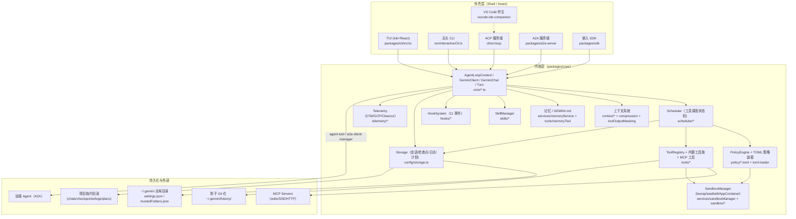
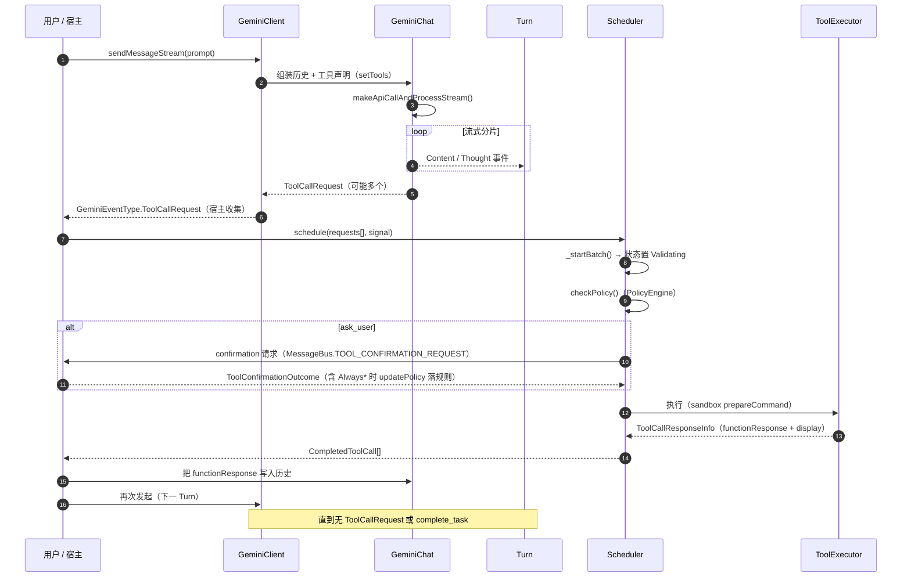
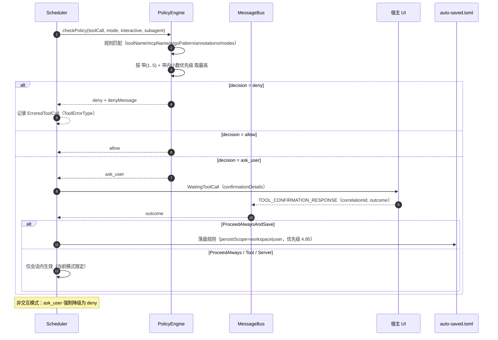
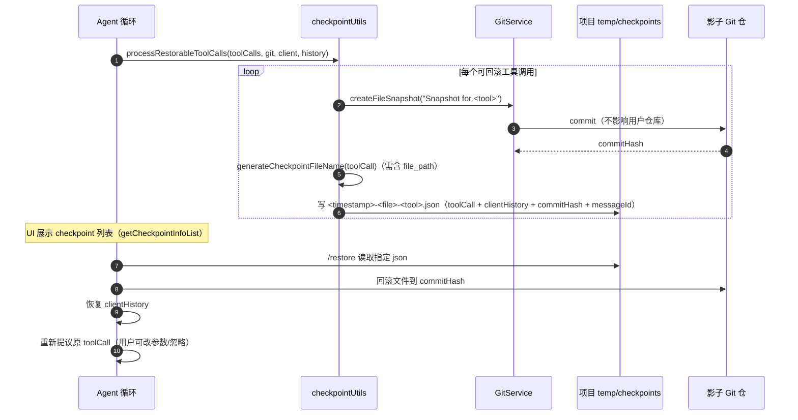

# 08 · Gemini CLI（google-gemini/gemini-cli）源码级竞品研究

> 研究对象：`google-gemini/gemini-cli`（TypeScript，Apache-2.0，开源）
> 本地证据快照：`.research-cache/google-gemini-cli`，HEAD = `cfbcaa8df13ea4610bb379b377b56d62980c0032`（作者时间 2026-09-18T20:34:32Z），`packages/core/package.json` 版本 `0.62.0-nightly.20260918.g9450ade79`。
> **证据时点（R09 补）**：克隆 commit `cfbcaa8`（2026-09-18）；GitHub API 元数据查询于 2026-09-20；`docs/` 官方文档与源码同 commit。
> 证据分级：`[E1]` 直接读到源码（给文件路径 + 符号）｜`[E2]` 官方文档/官方 schema｜`[E3]` 第三方分析｜`[E4]` 本文推断（显式写出推理链）。
> 除特别标注，本文所有 `[E1]` 均指上述 commit 的本地克隆；`[E2]` 指仓库内 `docs/` 官方文档（与源码同 commit，视为官方一手资料）。

---

## ① 结论速览（10 条）

1. **它是"事件驱动的工具调度器 + 分层策略引擎"架构，而不是"一个大 ReAct 循环"**：模型流式输出被切成事件，工具调用由独立的 `Scheduler` 以显式状态机（`validating → scheduled → executing/awaiting_approval → success/error/cancelled`）批式驱动，主循环只负责"产出工具请求 → 等结果 → 继续下一轮"。`[E1] packages/core/src/scheduler/scheduler.ts:99 Scheduler`、`packages/core/src/scheduler/types.ts:26 CoreToolCallStatus`
2. **权限引擎是全仓最成熟的子系统**：规则以 TOML 表达（`toolName` / `argsPattern` 正则 / `mcpName` / `modes` / `interactive` / `priority`），按 **5 层信任带**（admin 5.x > user 4.x > workspace 3.x > extension 2.x > default 1.x）合成，带内用 `1 + priority/1000` 的小数优先级排序，允许用户规则在带内精细插队。`[E1] packages/core/src/policy/types.ts:114 PolicyRule`、`packages/core/src/policy/policies/read-only.toml`（文件头注释即优先级表）
3. **审批结果可持久化为规则，且区分"工作区级/用户级"两种落盘范围**：`Always allow` 系列 outcome（`ProceedAlways` / `ProceedAlwaysTool` / `ProceedAlwaysServer` / `ProceedAlwaysAndSave`）在 `updatePolicy()` 中映射为不同粒度的规则 + 可选落盘。`[E1] packages/core/src/scheduler/policy.ts:114 updatePolicy`、`packages/core/src/tools/tools.ts:242`（outcome → persist 判断）
4. **检查点（checkpoint）走"影子 Git 仓 + JSON 元数据"而不是内存快照**：每个可回滚工具调用前，在 `~/.gemini/history/<project_hash>` 建一个影子提交，同时把工具调用 + 会话历史 + commit hash 落到 `<projectTmp>/checkpoints/*.json`；`/restore` 同时回滚文件与对话并"重新提议原工具调用"。`[E1] packages/core/src/utils/checkpointUtils.ts:84 processRestorableToolCalls`、`[E2] docs/cli/checkpointing.md`、`docs/cli/rewind.md`
5. **上下文压缩是可失败、可降级的服务**：压缩阈值 = 模型 token 上限 × 0.5（`DEFAULT_COMPRESSION_TOKEN_THRESHOLD`），压缩失败/结果为空/压缩后 token 反而变大都有独立状态码（`COMPRESSION_FAILED_EMPTY_SUMMARY`、`COMPRESSION_FAILED_INFLATED_TOKEN_COUNT`），而不是把压缩当作必然成功的黑盒。`[E1] packages/core/src/context/chatCompressionService.ts:41,239,426,469`
6. **循环检测是"启发式 + LLM 双检"，且对批量任务有豁免规则**：工具调用签名重复 5 次、或流式文本哈希重复（50 字符块、10 次）触发；第 30 轮后每 5–15 轮用独立模型（alias `loop-detection-double-check`）复核，置信度阈值 0.9，系统提示明确要求"不要误伤批量重构中的相似工具调用"。`[E1] packages/core/src/services/loopDetectionService.ts:29-101`
7. **沙箱从"容器可选"演化为"OS 原生隔离优先"**：Linux 用 bubblewrap（`bwrapArgsBuilder`）、macOS 用 seatbelt、Windows 用 AppContainer + C# 助手（`sandbox/windows/GeminiSandbox.cs`），并额外定义 `GOVERNANCE_FILES`（`.git`、`.gitignore`、`.geminiignore` 写保护）与 `SECRET_FILES`（`.env`、`.env.*` 完全隐藏）。容器沙箱（docker/podman/runsc/lxc）仍可通过 `GEMINI_SANDBOX` 启用。`[E1] packages/core/src/services/sandboxManager.ts:198,208`、`packages/core/src/services/sandboxManagerFactory.ts`、`packages/cli/src/config/sandboxConfig.ts:26`、`[E2] docs/cli/sandbox.md`
8. **扩展（extensions）是把"MCP server + 上下文文件 + 自定义命令 + hooks + 子代理 + skills + 主题"打包成一个清单的发行单元**，且带完整性校验（`policy/integrity.ts`、`config/extensions/integrity.ts`）与画廊（gallery）。`[E1] packages/core/src/config/extensions/`、`[E2] docs/extensions/reference.md`、`docs/extensions/index.md`
9. **无头/CI 形态是一等公民**：`-p/--prompt` + `--output-format text|json|stream-json`，stream-json 是 JSONL（`init`/`message`/`tool_use`/`tool_result`/`error`/`result`），并有稳定退出码（0 成功 / 1 通用错误 / 42 输入错误 / 53 轮次超限）。`[E2] docs/cli/headless.md`、`[E1] packages/cli/src/config/config.ts:267,294,467`
10. **对外被集成面异常丰富**：`packages/sdk`（进程内 SDK：`GeminiCliAgent`/`GeminiCliSession`，可注入 tools/skills）、`packages/a2a-server`（A2A 协议服务端，基于 `@a2a-js/sdk` + express 5）、`--acp`（Agent Client Protocol，Zed 等 IDE 接入）、`packages/vscode-ide-companion`。`[E1] packages/sdk/src/agent.ts`、`packages/a2a-server/package.json`、`packages/cli/src/acp/`、`[E2] docs/cli/acp-mode.md`

---

## ② 产品与仓库事实

| 项 | 值 | 证据 |
| --- | --- | --- |
| 仓库 | `github.com/google-gemini/gemini-cli` | `[E2]` 仓库根 `README.md` |
| 描述 | "An open-source AI agent that brings the power of Gemini directly into your terminal." | `[E2]` GitHub API `/repos/google-gemini/gemini-cli` |
| 语言 | TypeScript（Node `>=20.0.0`） | `[E1] package.json`（engines/workspaces） |
| 许可 | Apache-2.0 | `[E2]` GitHub API + 仓库 `LICENSE` |
| 规模 | ★107,093（2026-09-20 查询）、Fork 14,605、Open Issues 842 | `[E3]` GitHub API（第三方托管指标，非源码） |
| 创建/最近推送 | 创建 2025-04-17；pushed_at 2026-09-20 | `[E3]` GitHub API |
| 工作区 | npm workspaces `packages/*`：`core`、`cli`、`a2a-server`、`sdk`、`devtools`、`vscode-ide-companion`、`test-utils` | `[E1] package.json` + `ls packages/` |
| 构建 | `start`/`build`/`test`/`lint`/`deflake`/`clean`/`prettier`；esbuild 打包（`esbuild.config.js`）、`sea/`（single executable application） | `[E1] package.json`、仓库根目录清单 |
| 关键依赖 | `@modelcontextprotocol/sdk`（MCP）、`ink`（TUI）、`node-pty`（伪终端）、`@google/genai`（模型 SDK）、`express`（a2a-server） | `[E1] package.json`、`packages/a2a-server/package.json` |
| 官方文档 | `docs/`（`docs/cli/*`、`docs/core/*`、`docs/extensions/*`、`docs/reference/configuration.md`）与 `docs/index.md`；另有 `ROADMAP.md`、`SECURITY.md` | `[E2]` 仓库内文档 |

**包分层（依赖方向）** `[E1] packages/*/package.json`：

- `packages/core` = 全部内核能力（配置、策略、调度、工具、上下文、MCP、技能、遥测、沙箱、记忆、hook、session 存储）。**注意：它是 Node 库而非纯逻辑层**，直接依赖 `node:fs`/`node:child_process`。
- `packages/cli` = TUI（Ink/React）+ 非交互 CLI + ACP 服务端 + 自定义命令系统；依赖 core。
- `packages/sdk` = 面向嵌入方的纯 API 包装（agent/session/tool/skill/fs/shell）。
- `packages/a2a-server` = A2A 协议服务（独立可部署服务，依赖 core）。
- `packages/devtools`、`packages/vscode-ide-companion`、`packages/test-utils` = 工具链/IDE 伴生/测试夹具。

---

## ③ 架构总览

### 3.1 模块架构图

### 3.2 进程与运行拓扑（维度 1）

- **默认单进程**：`packages/cli` 进程内既有 Ink TUI 又有内核；`interactiveCli.tsx` 装配 `Config`（内核配置聚合器）后交给 React 组件树 `[E1] packages/cli/src/interactiveCli.tsx`。
- **多进程/多端形态**（同一内核，不同外壳）：
  - **无头**：`gemini -p "<prompt>" --output-format stream-json`，事件流走 stdout，工具确认被策略降级（`nonInteractive: true` 时 `ASK_USER → DENY`）`[E1] packages/core/src/policy/types.ts:302`、`[E2] docs/cli/headless.md`。
  - **ACP 服务端**：`gemini --acp` 以 stdio JSON-RPC 让 IDE（Zed 等）当客户端，文件系统调用被代理回 IDE（`acpFileSystemService.ts`）`[E1] packages/cli/src/acp/acpFileSystemService.ts`、`[E2] docs/cli/acp-mode.md`。
  - **A2A 服务端**：`packages/a2a-server` 独立进程，暴露 `POST /tasks`、`POST /executeCommand`、`GET /listCommands`、`GET /tasks/metadata` 等 HTTP 端点，并把任务状态以 `status-update` 事件推给 A2A 客户端 `[E1] packages/a2a-server/src/http/app.ts:284,310,314,356`、`packages/a2a-server/src/agent/executor.ts:101 CoderAgentExecutor`。
  - **远端 Agent 反向调用**：核心内建 `a2a-client-manager.ts`，配合 `agents/remote-invocation.ts` / `remote-session-invocation.ts`，可把 A2A 远端 agent 当"工具"用 `[E1] packages/core/src/agents/a2a-client-manager.ts`、`agents/remote-invocation.ts`。
  - **VS Code 伴生**：`packages/vscode-ide-companion` 通过 `ide/` 客户端把编辑器上下文（当前文件、选区、diff）注入内核 `[E1] packages/core/src/ide/`、`packages/cli/src/ui/IdeIntegrationNudge.tsx`。
- **IPC/事件协议**：
  - 内核内部用 `MessageBus`（发布/订阅，带 `correlationId`）承载工具确认请求/响应 `[E1] packages/core/src/confirmation-bus/message-bus.ts`、`types.ts`。
  - 内核向"任意宿主"广播 `coreEvents`（Node EventEmitter，如 `CoreEvent.McpProgress`）`[E1] packages/core/src/utils/events.ts`、`scheduler.ts:137`。
  - `AgentSession.stream()` 提供**可续传事件流**：以 `eventId` 或 `streamId` 为游标，重放历史事件（`agent_start → agent_end` 边界），从而支持"客户端断线重连后从断点继续消费"`[E1] packages/core/src/agent/agent-session.ts:47-224`。

---

## ④ 24 维度逐项分析

### 1) 进程与运行拓扑
见 §3.2。补充：`Config` 是**内核 DI 容器**（`packages/core/src/config/config.ts`），持有 `ToolRegistry`、`PolicyEngine`、`SandboxManager`、`Storage`、`SkillManager`、`ContentGenerator`，并由 `AgentLoopContext`（`config/agent-loop-context.ts`）把"一次 Agent 循环所需的一切"打包传给 `Scheduler`/`ToolExecutor` `[E1] packages/core/src/config/agent-loop-context.ts`、`scheduler/scheduler.ts:65 SchedulerOptions`。

### 2) Agent 主循环与回合模型
- 回合单元是 `Turn`（`packages/core/src/core/turn.ts:254 class Turn`）：一次模型流式响应 + 其中的工具调用请求；`turn.pendingToolCalls` 标识"本轮还没执行完的工具"。
- 两层循环：
  1. **内核内层**：`GeminiChat.sendMessageStream()` 产出 `ServerGeminiStreamEvent` 流（`Content`/`Thought`/`ToolCallRequest`/`ToolCallResponse`/`Finished`/`Error`/`ChatCompressed`/`LoopDetected`/`MaxSessionTurns`/`ContextWindowWillOverflow` …）`[E1] packages/core/src/core/turn.ts:55 GeminiEventType`、`core/geminiChat.ts:480 sendMessageStream`。
  2. **外壳外层**：宿主消费事件流，收集 `ToolCallRequest` 后 `await scheduleToolCalls(requests, signal)`，把结果写回历史，然后**再次**发起模型调用，直到没有工具请求 `[E1] packages/cli/src/ui/hooks/useGeminiStream.ts:1560-1640`（`ToolCallRequest` 收集 + `scheduleToolCalls` 调用）。
- **空响应自动 nudge**：若工具执行成功但模型返回空文本，CLI 会注入一条系统提示（`[System: You successfully executed a tool but returned an empty response...]`）并自动续跑，最多 `MAX_AUTO_NUDGE_ATTEMPTS` 次 `[E1] packages/cli/src/ui/hooks/useGeminiStream.ts:1640-1660`。
- `complete_task` 工具作为"显式终止信号"存在（`COMPLETE_TASK_TOOL_NAME`），使循环有模型自报完成的口径 `[E1] packages/core/src/tools/complete-task.ts`、`policy/policies/read-only.toml`（`complete_task` 在白名单内）。

### 3) 工具系统
- **注册**：`ToolRegistry` 持有 `AnyDeclarativeTool`；每轮对话可 `client.setTools(modelId)` 重新下发声明 `[E1] packages/core/src/core/client.ts:306 setTools`、`tools/tool-registry.ts`。
- **声明**：`ToolDefinition` + 可选"模型族工具集"——`getToolSet(modelId)` 在 `GEMINI_3_SET` 与 `DEFAULT_LEGACY_SET` 之间切换（不同模型用不同描述/参数集合）`[E1] packages/core/src/tools/definitions/coreTools.ts:111 getToolSet`、`tools/definitions/model-family-sets/gemini-3.ts`。
- **内置工具族（读/写/检索/网络/交互）** `[E1] packages/core/src/tools/definitions/coreTools.ts` + `tools/` 目录：
  - 文件：`read_file`、`read_many_files`、`write_file`、`replace`(edit)、`list_directory`、`glob`、`grep_search`(+`ripGrep` 实现)、`jit-context`（即时上下文注入）。
  - 执行：`run_shell_command`（含后台执行 `BackgroundExecutionData`、PTY 实时输出、`pid` 上报、`parseDenials` 识别沙箱拒绝）。
  - 网络：`web_fetch`、`google_web_search`。
  - 交互/元：`ask_user`（向用户提问，等价 elicitation）、`enter_plan_mode`/`exit_plan_mode`、`write_todos`、`update_topic`、`complete_task`、`activate_skill`、`get_internal_docs`、`memory`（写入 GEMINI.md）。
  - 任务追踪：`tracker_create_task` / `tracker_update_task` / `tracker_get_task` / `tracker_list_tasks` / `tracker_add_dependency` / `tracker_visualize`（独立"任务系统"工具组，落在 `storage.getTrackerDir()`）`[E1] packages/core/src/tools/definitions/trackerTools.ts`、`config/storage.ts:380`。
  - MCP 资源：`read_mcp_resource`、`list_mcp_resources`。
- **执行管线**：`Scheduler` 校验 → `ToolExecutor` 执行 → `ToolModificationHandler`（hook 可改写参数）→ 结果结构化（`ToolResultDisplay`、`StructuredToolResult`、`FileDiff`、`DiffStat`）`[E1] packages/core/src/scheduler/tool-executor.ts`、`scheduler/tool-modifier.ts`、`tools/tools.ts:750,935`。
- **并行**：批量 `schedule(request[])` 内按工具自身声明的"可并行"能力调度（有专门测试 `scheduler_parallel.test.ts`）；`update_topic` 被强制排在批内最前，保证 UI 分组正确 `[E1] packages/core/src/scheduler/scheduler.ts:302-312`（`UPDATE_TOPIC_TOOL_NAME` 排序）。
- **结果回传**：`ToolCallResponseInfo.responseParts` 即 `functionResponse`，同时可带 `data`（结构化）、`outputFile`（大输出外置）、`contentLength`（计量）`[E1] packages/core/src/scheduler/types.ts:59 ToolCallResponseInfo`。

### 4) 权限与审批
- **模式（ApprovalMode）**：`default`（每次问）、`autoEdit`（自动批准编辑）、`yolo`（全自动）、`plan`（只读）`[E1] packages/core/src/policy/types.ts:48 ApprovalMode`；并定义"宽松度排序" `MODES_BY_PERMISSIVENESS = [plan, default, autoEdit, yolo]`（低权限模式允许的工具在更高权限模式也允许）`[E1] policy/types.ts:60`。CLI 暴露 `--approval-mode default|auto_edit|yolo|plan` 与 `--yolo`（二者互斥校验）`[E1] packages/cli/src/config/config.ts:258,327,340`。
- **规则模型（PolicyRule）**：`toolName`（支持 `*`、`mcp_<server>_*` 通配）、`mcpName`（严格 MCP server 匹配）、`argsPattern?: RegExp`（参数正则）、`toolAnnotations`（工具自报的注解，如只读提示）、`subagent`（规则可只作用于某子代理）、`modes`、`interactive`（区分交互/非交互）、`priority`、`allowRedirection`、`denyMessage` `[E1] packages/core/src/policy/types.ts:114`。
- **决策**：`PolicyDecision = allow | deny | ask_user`，默认 `ask_user`；`nonInteractive` 时 `ask_user → deny`；`disableAlwaysAllow` 可忽略"始终允许"规则 `[E1] packages/core/src/policy/types.ts:280 PolicyEngineConfig`、`policy-engine.ts:129 ruleMatches`。
- **优先级分带**（仓库自带文档化注释，可作为我们策略 DSL 的参考模型）`[E1] packages/core/src/policy/policies/read-only.toml` 文件头：
  - 默认 TOML 1.x、扩展 2.x、工作区 3.x、用户 4.x、管理员 5.x；带内 `priority` 折算为小数（`1 + priority/1000`）。
  - 用户带内再细分：4.95 "Always Allow"（交互选择）、4.9 MCP 排除名单、4.4 `--exclude-tools`、4.3 `--allowed-tools`、4.2 受信 MCP server、4.1 MCP 允许名单。
  - 内置 TOML 语义优先级：10 写工具默认 ask、15 auto-edit 覆盖、50 只读工具 allow、998 YOLO 全放行、999 `ask_user` 工具。
- **确认与规则沉淀**：`ToolConfirmationOutcome` 含 `ProceedOnce/ProceedAlways/ProceedAlwaysTool/ProceedAlwaysServer/ProceedAlwaysAndSave`；`updatePolicy()` 把 outcome 映射为规则，`ProceedAlways` 只在**当前模式**生效，`AndSave` 才落盘（`persistScope` 依是否为 git 项目/工作区判定 `workspace|user`）`[E1] packages/core/src/scheduler/policy.ts:114-190`、`tools/tools.ts:242-256`。
- **子代理规则隔离**：`PRIORITY_SUBAGENT_TOOL = 1.03` 注释说明"要让子代理工具被 Plan 模式（40）挡住，同时高于指令类写工具（10）"`[E1] packages/core/src/policy/types.ts:363-369`。
- **策略完整性**：`PolicyIntegrityManager` 对策略目录做哈希（`MATCH/MISMATCH/NEW`），扩展也有对应 integrity 校验，防止本地策略/扩展被静默篡改 `[E1] packages/core/src/policy/integrity.ts:13,25`、`config/extensions/integrity.ts`。
- **工作区信任**：`trustedFolders.json` 记录受信目录（可信任父目录），未受信目录进入受限"safe mode"；`FolderTrustDiscoveryService` 在启动时探测 `[E1] packages/core/src/services/FolderTrustDiscoveryService.ts`、`config/storage.ts:23 TRUSTED_FOLDERS_FILENAME`、`[E2] docs/cli/trusted-folders.md`。

### 5) 上下文管理
- **预算与压缩**：压缩阈值 = `tokenLimit(model) × 0.5`；压缩服务会先找"安全切分点"（`findCompressSplitPoint`）保留尾部完整轮次，再让模型生成摘要 `[E1] packages/core/src/context/chatCompressionService.ts:41,60,272-281`。
- **失败语义完备**：`CompressionStatus` 含 `NOOP / COMPRESSED / CONTENT_TRUNCATED / COMPRESSION_FAILED_EMPTY_SUMMARY / COMPRESSION_FAILED_INFLATED_TOKEN_COUNT`，并向上发 `ChatCompressed` 事件让 UI 提示 `[E1] packages/core/src/core/turn.ts:183 CompressionStatus`、`context/chatCompressionService.ts:426,469`。
- **工具输出治理**：`ToolOutputMaskingService`（工具结果屏蔽）+ `truncation.ts`（观察截断）+ 大结果落文件（`outputFile`）三件套 `[E1] packages/core/src/context/toolOutputMaskingService.ts`、`context/truncation.ts`。
- **即时上下文（JIT context）**：`jit-context.ts` 工具允许模型按需拉入特定上下文片段，而不是一次性塞满窗口 `[E1] packages/core/src/tools/jit-context.ts`。
- **Token 缓存**：官方文档专章 `token-caching.md`（对稳定前缀做缓存亲和）`[E2] docs/cli/token-caching.md`；源码侧 `routing/` 目录负责模型路由与降级 `[E1] packages/core/src/routing/`。
- **压缩触发事件**：`ServerGeminiEventType.ContextWindowWillOverflow` 携带 `estimatedRequestTokenCount` 与 `remainingTokenCount`，宿主可提前干预 `[E1] packages/core/src/core/turn.ts:98`。

### 6) 提示词组织
- `packages/core/src/core/prompts.ts` + `packages/core/src/prompts/` 装配系统提示；`config/injectionService.ts` 负责注入（对话中途注入上下文块）`[E1] packages/core/src/core/prompts.ts`、`config/injectionService.ts`。
- 分层指令文件：`GEMINI.md`（默认名，可通过 `setGeminiMdFilename()` 改，支持多文件名）+ 目录层级合并（`HierarchicalMemory` + `flattenMemory()`）+ `@import` 语法导入其他文件；`MEMORY.md` 作为项目记忆索引文件 `[E1] packages/core/src/tools/memoryTool.ts:11,22,90`、`config/memory.ts:7,17`、`[E2] docs/cli/gemini-md.md`。
- 忽略规则：`.geminiignore`（`config/constants.ts GEMINI_IGNORE_FILE_NAME`）+ 内置排除目录，统一由 `FileDiscoveryService` 过滤 `[E1] packages/core/src/services/fileDiscoveryService.ts:35,68`、`[E2] docs/cli/gemini-ignore.md`。
- 子代理提示：每个子代理带自己的 system prompt（`agents/codebase-investigator.ts`、`agents/generalist-agent.ts`、`agents/cli-help-agent.ts`），模板与 `maxTurns` 可被 settings 覆盖 `[E1] packages/core/src/agents/`、`[E2] docs/core/subagents.md`。

### 7) MCP
- 客户端管理器 `McpClientManager`（启停、发现工具/资源、健康）`[E1] packages/core/src/tools/mcp-client-manager.ts`；单连接封装 `mcp-client.ts`，工具封装 `mcp-tool.ts`（命名 `mcp_<server>_<tool>`，并有 `parseMcpToolName/formatMcpToolName` 规范化）`[E1] packages/core/src/tools/mcp-tool.ts:46-52`。
- **传输**：stdio 与 SSE/HTTP（`mcp-compliance-transport.ts` 处理协议一致性）`[E1] packages/core/src/tools/mcp-compliance-transport.ts`。
- **OAuth 家族**：`mcp/oauth-provider.ts`、`mcp-oauth-provider.ts`、`google-auth-provider.ts`、`sa-impersonation-provider.ts`（服务账号模拟）、`oauth-token-storage.ts`（令牌落盘）`[E1] packages/core/src/mcp/`。
- **能力面**：工具 + 资源（`read_mcp_resource`/`list_mcp_resources`）+ 进度通知（MCP progress 通过 `coreEvents` 冒泡到调度器状态）`[E1] packages/core/src/scheduler/scheduler.ts:145 handleMcpProgress`。
- **配置与信任**：`settings.json` 的 `mcpServers`；扩展清单里也可声明 MCP server，同名以 `settings.json` 优先 `[E2] docs/extensions/reference.md:146-151`；策略侧支持 `mcp.excluded`/`mcp.allowed`/`mcp.autoAllowInHeadless`/`mcpServers.<name>.trust` `[E1] packages/core/src/policy/types.ts:337 PolicySettings`。
- **反向暴露**：内核可作为 MCP server 被外部调用（文档 `docs/tools/mcp-server.md`）`[E2]`。

### 8) Skill / 插件机制
- **Skill**：`SKILL.md` 目录约定（`['SKILL.md', '*/SKILL.md']` 两级扫描），frontmatter 定义名称/描述；`SkillManager.discoverSkills()` 汇总内置 + 全局 + 工作区 + 扩展来源，支持启用/禁用 `[E1] packages/core/src/skills/skillLoader.ts:127`、`skills/skillManager.ts:54,104`。内置技能仅两个：`skill-creator`、`antigravity-support` `[E1] packages/core/src/skills/builtin/`。模型通过 `activate_skill` 工具激活技能 `[E1] packages/core/src/tools/activate-skill.ts`。
- **扩展（extension）= 发行单元**：`gemini-extension.json` 清单可打包 `mcpServers`、`contextFileName`（注入的上下文文件名）、`excludeTools`（含 `"run_shell_command(rm -rf)"` 这种带参屏蔽语法）、`settings`（安装时要求用户填的变量，`envVar` 注入）、`commands/` 目录（TOML 自定义命令，支持 `/gcs:sync` 命名空间）、`hooks`、`themes`、子代理、skills `[E1] packages/core/src/config/extensions/`、`[E2] docs/extensions/reference.md:107-244`。CLI 侧 `gemini extensions list/install/update/link/enable/disable/configure`，并有 `--auto-update`/`--pre-release`/`--consent`/`--skip-settings` 等安装开关 `[E2] docs/extensions/reference.md:26-34`、`[E1] packages/cli/src/commands/extensions/`。
- 插件与技能的**权限面互相制衡**：扩展可声明 `excludeTools`，策略引擎侧仍可再拦截（`mcpName`/`argsPattern`）。

### 9) SubAgent / 多 Agent 编排
- 子代理以**同名工具**暴露给主代理：调用 `codebase_investigator` 工具即启动子代理；支持 `@name` 语法强制路由（CLI 注入系统提示让主模型立刻调用该工具）`[E2] docs/core/subagents.md`。
- 内置：`codebase_investigator`（代码理解）、`cli_help`（CLI 自帮助）、`generalist`（继承主代理工具集，隔离上下文执行重任务）、`browser_agent`（无障碍树驱动浏览器）`[E1] packages/core/src/agents/registry.ts`、`agents/generalist-agent.ts`、`agents/browser/`。
- **本地执行器**：`local-executor.ts` + `local-session-invocation.ts` + `local-subagent-protocol.ts` 实现"独立上下文循环 + 独立 maxTurns + 独立模型配置"，并把子代理进度以 `ToolLiveOutput = SubagentProgress` 回传给 UI `[E1] packages/core/src/agents/local-executor.ts`、`tools/tools.ts:885`。
- **远端子代理**：`remote-invocation.ts` / `remote-session-invocation.ts` + `a2a-client-manager.ts`，把 A2A 远端 agent 当子代理用，并有 `acknowledged-agents.ts` 做"已确认远端 agent"列表 `[E1] packages/core/src/agents/`。
- **独立调度器**：子代理持有自己的 `Scheduler`（`schedulerId` + `parentCallId`），因此子代理工具调用在状态机里可被追溯到父调用 `[E1] packages/core/src/scheduler/types.ts:53,54 ToolCallRequestInfo`、`scheduler/scheduler.ts:109,111`。

### 10) 任务 / 计划 / Todo 机制
- **Todo**：`write_todos` 工具 + `TodoStatus`/`Todo` 数据结构 `[E1] packages/core/src/tools/write-todos.ts`、`tools/tools.ts:945-955`。
- **任务追踪**：`tracker_*` 工具族（创建/更新/查询/列依赖/可视化），存储在 `storage.getTrackerDir()`，是"模型可写的任务看板"`[E1] packages/core/src/tools/definitions/trackerTools.ts`、`config/storage.ts:380`。
- **Plan 模式**：作为独立 ApprovalMode，进入后策略把工具集合收敛到只读（`read-only.toml` 生效 + `enter_plan_mode` 工具写入计划文件到 `storage.getPlansDir()`，退模式用 `exit_plan_mode`）`[E1] packages/core/src/tools/enter-plan-mode.ts:110-137`、`[E2] docs/cli/plan-mode.md`。
- **任务目录**：`storage.getTasksDir()`（多任务/子会话产物）`[E1] packages/core/src/config/storage.ts:407`。

### 11) Goal / 自治循环 / Schedule
- **未观测到内置 Goal 循环或 cron 调度器**（检索词：`grep -ri "cron\|schedule" packages/core/src --include=*.ts | grep -v test`；`ls packages/core/src/scheduler/` 只有工具调度）。仓库内 `scheduler/` 目录名**指工具调度**而非定时任务，易混淆。
- 唯一近似"自治"的机制是 **loop detection + auto-nudge**（§④-2）与 **`MaxSessionTurns` / `AgentExecutionStopped` / `AgentExecutionBlocked`** 三类停表事件，用于长跑会话的熔断 `[E1] packages/core/src/core/turn.ts:80-105,214-222`。
- `[E4]` 推断：Google 生态把"定时/无人值守"放在 a2a-server 与服务化形态（`GET /tasks/metadata` 便于外部调度器轮询），而非 CLI 内。推理链：a2a-server 暴露任务元数据端点但没有内置触发器实现。

### 12) 会话持久化与恢复
- **存储布局**（`Storage` 类）：全局 `~/.gemini`（settings、trustedFolders、oauth_creds、history 影子 git、policy 自动保存 `auto-saved.toml`）与项目临时目录 `<projectTmp>`，后者分域：`chats/`（会话记录 `session-*.json`）、`checkpoints/`、`logs/`、`memory/`、`plans/`、`tracker/`、`tasks/`、`shell_history` `[E1] packages/core/src/config/storage.ts:22-30,230-481`。项目目录命名从"hash 目录"迁移到"slug 目录"（`performMigration()`）`[E1] storage.ts:307-310`。
- **会话记录**：`chatRecordingService` + `chatRecordingTypes.ts`（`SESSION_FILE_PREFIX = 'session-'`、`MAX_HISTORY_MESSAGES = 50`、`MAX_TOOL_OUTPUT_SIZE = 50KB`、`RewindRecord`、`MetadataUpdateRecord`）`[E1] packages/core/src/services/chatRecordingService.ts`、`chatRecordingTypes.ts:12-14,123`。
- **恢复语义**：
  - `/resume` / SDK `resumeSession()`：从 `chats/` 载入 `ConversationRecord` 重放历史 `[E1] packages/sdk/src/agent.ts`（`resumeSession`）。
  - `/restore`（检查点）：回滚文件（影子 git）+ 回滚对话 + 重新提议原工具调用 `[E1] checkpointUtils.ts`、`[E2] docs/cli/checkpointing.md`。
  - `/rewind`：交互式选择历史交互点，可"只回滚对话"或"对话 + 代码一起回滚" `[E2] docs/cli/rewind.md`。
  - `/compress`：手工触发压缩 `[E1] packages/cli/src/ui/commands/compressCommand.ts`。
  - 会话摘要：`sessionSummaryService` + `sessionSummaryUtils` 为会话列表/恢复提供摘要 `[E1] packages/core/src/services/sessionSummaryService.ts`。
  - `sessionScratchpadUtils`：会话级"草稿记忆"（见 §④-18）。
- **`--fork`/分叉**：未观测到显式分叉命令（检索词：`grep -rn "fork" packages/core/src packages/cli/src/ui/commands --include=*.ts`）→ 近似能力由 `/restore` + `/rewind` 提供 `[E4]`。

### 13) 事件与可观测
- **三类事件通道**：
  1. `GeminiEventType`（内核 → 宿主的模型/工具轮次事件）：`Content`、`Thought`、`ToolCallRequest`、`ToolCallResponse`、`ToolCallConfirmation`、`UserCancelled`、`Error`、`ChatCompressed`、`CompressionInfo`、`MaxSessionTurns`、`LoopDetected`、`Citation`、`ModelInfo`、`Retry`、`InvalidStream`、`AgentExecutionStopped/Blocked`、`ContextWindowWillOverflow`、`Finished` `[E1] packages/core/src/core/turn.ts:55-233`。
  2. `AgentEvent`（跨宿主的 SDK/ACP 事件，带 `id`/`streamId`/`_meta.source`）：`initialize`、`session_update`、`message`、`agent_start`、`agent_end`、`tool_request`、`tool_update`、`tool_response`、`elicitation_request/response`、`usage`、`error`、`custom` `[E1] packages/core/src/agent/types.ts:104-131`。
  3. `coreEvents`（进程内广播：如 `McpProgress`）`[E1] packages/core/src/utils/events.ts`、`scheduler.ts:137`。
- **遥测**：`packages/core/src/telemetry/` 提供 OTel SDK 装配（`sdk.ts`）、GCP exporter（`gcp-exporters.ts`）、Clearcut（`clearcut-logger/`）、指标（`metrics.ts`）、脱敏（`sanitize.ts`）、限流（`rate-limiter.ts`）、事件循环与内存监控（`event-loop-monitor.ts`、`memory-monitor.ts`）、工具调用决策打点（`tool-call-decision.ts`）、UI 遥测（`uiTelemetry.ts`）`[E1]`。设置项与隐私命令见 `[E2] docs/cli/telemetry.md`、`packages/cli/src/ui/commands/privacyCommand.ts`。
- **Token/成本可观测**：`Usage` 事件 + headless `stats` 字段 + `trackerService` `[E1] packages/core/src/services/trackerService.ts`、`[E2] docs/cli/headless.md`。

### 14) Hooks / 生命周期扩展点
- **11 个钩子事件**：`BeforeTool`、`AfterTool`、`BeforeAgent`、`AfterAgent`、`Notification`、`SessionStart`、`SessionEnd`、`PreCompress`、`BeforeModel`、`AfterModel`、`BeforeToolSelection` `[E1] packages/core/src/hooks/types.ts:44-54`。
- **四种来源**：`project | user | system | extension`（`HookSource`，非法值默认 `project`）`[E1] packages/core/src/policy/types.ts:19-46`。
- **能力语义细分**：hook 输出类按事件分流并可**改写请求**——`BeforeModelHookOutput.applyLlmRequestModification()`、`BeforeToolSelectionHookOutput.applyToolConfigModification()`、`BeforeToolHookOutput`（可阻断/改写工具参数）`[E1] packages/core/src/hooks/types.ts:167-330`。
- **执行链**：`hookSystem` → `hookPlanner`（哪些 hook 适用，含 `HookCheckerRule` 安全检查器）→ `hookRunner`（沙箱执行）→ `hookAggregator`（多 hook 结果聚合）→ `hookTranslator`（对内外格式转换）`[E1] packages/core/src/hooks/{hookSystem,hookPlanner,hookRunner,hookAggregator,hookTranslator}.ts`。
- **受信 hooks**：`trustedHooks.ts` 与策略里的 `hookCheckers` 组合，保证"未受信目录里的 hook 不得执行" `[E1] packages/core/src/hooks/trustedHooks.ts`、`policy/types.ts:254 HookCheckerRule`。
- 工具级 hook 触发点在 `coreToolHookTriggers.ts` `[E1] packages/core/src/core/coreToolHookTriggers.ts`。

### 15) 沙箱与安全执行
- **隔离档位**：`NoopSandboxManager`（默认，仅做环境变量脱敏）/ `LocalSandboxManager` / 三平台原生沙箱（Linux bwrap、macOS seatbelt、Windows AppContainer）；由 `createSandboxManager()` 按 `process.platform` 选择 `[E1] packages/core/src/services/sandboxManagerFactory.ts`、`sandbox/linux/bwrapArgsBuilder.ts`、`sandbox/macos/seatbeltArgsBuilder.ts`、`sandbox/windows/GeminiSandbox.cs`。
- **容器沙箱**仍支持：`GEMINI_SANDBOX=true|docker|podman|sandbox-exec|runsc|lxc`，可指定镜像 `GEMINI_SANDBOX_IMAGE`，网络代理脚本 `GEMINI_SANDBOX_PROXY_COMMAND`；`runsc` 需要 Docker；`SANDBOX` 环境变量存在时认为"已在沙箱内"避免嵌套 `[E1] packages/cli/src/config/sandboxConfig.ts:26,46-123`、`[E2] docs/cli/sandbox.md:77,128,215,247`。
- **文件边界**：`GOVERNANCE_FILES` = `.gitignore`/`.geminiignore`/`.git(目录)` 写保护；`SECRET_FILES` = `.env`/`.env.*` 读写全禁；`findSecretFiles()` 做浅层扫描用于挂载 deny 规则 `[E1] packages/core/src/services/sandboxManager.ts:198-288`。
- **网络策略**：`SandboxPermissions.network` / `ExecutionPolicy.networkAccess` / `SandboxModeConfig.network` 三级；`isKnownSafeCommand` / `isDangerousCommand` / `parseDenials`（从命令输出识别沙箱拒绝并转成用户可读提示 + 建议晋升权限）`[E1] sandboxManager.ts:64-154,162 SandboxManager`。
- **审批绕过防护**：`PolicyDecision.ask_user` 在非交互模式强制转 `deny`；`shell-safety.test.ts`（539 行）与 `shell-substitution.test.ts` 专门出题测试命令替换/重定向绕过；`allowRedirection` 显式开关说明"默认会把带重定向的命令从 allow 降级为 ask" `[E1] packages/core/src/policy/shell-safety.test.ts`、`policy-engine.ts:176-180`。
- **安全分级默认**：危险命令识别 + 受信目录 + 策略完整性三重；`auto-saved.toml` 记录用户交互产生的规则（可审计）`[E1] config/storage.ts:28 AUTO_SAVED_POLICY_FILENAME`。
- 另有 `safety/` 子系统（`checker-runner.ts`、`protocol.ts`，含 `InProcessCheckerType.ALLOWED_PATH` 与 `CONSECA`——后者配套 `conseca-logger.ts` 与 `policies/conseca.toml`，属隐私保留型安全检查）`[E1] packages/core/src/safety/`、`policy/types.ts:92`、`policy/policies/conseca.toml`。

### 16) 工作区 / 远程执行
- 工作区即本地目录（`workspace` 在 `Initialize.workspace` 中声明）`[E1] packages/core/src/agent/types.ts:137`。
- **Git worktree 支持**：`WorktreeService` 在 `<projectRoot>/.gemini/worktrees/<name>` 创建 worktree，分支名 `worktree-<name>`；未修改的 worktree 会被自动清理，有改动则保留 `[E1] packages/core/src/services/worktreeService.ts:24-151`、`[E2] docs/cli/git-worktrees.md`。
- **远程执行的两种口径**：① ACP/IDE 侧把文件系统操作代理给宿主（`acpFileSystemService`）；② A2A 远端 agent（`remote-invocation.ts`）。**未观测到 SSH 工作区**（检索词：`grep -rn "ssh" packages/core/src --include=*.ts` 仅命中少量非工作区语义）。

### 17) Git 与 worktree 集成
- 内置 `GitService`：`createFileSnapshot()`（影子仓提交）、`getCurrentCommitHash()`，供检查点使用 `[E1] packages/core/src/services/gitService.ts`、`checkpointUtils.ts:102-111`。
- **检查点不污染用户仓库**：影子仓位于 `~/.gemini/history/<project_hash>`（`[E2] docs/cli/checkpointing.md`）；元数据落在项目 temp 的 `checkpoints/` 目录（`storage.getCheckpointsDir()`）。
- **worktree 与子代理的组合**：文档明确给出"在 worktree 里跑多 agent"的用法（`[E2] docs/cli/git-worktrees.md`、`docs/core/subagents.md:310` 提到 `GEMINI_SANDBOX=docker SANDBOX_PORTS=9222` 与浏览器代理组合）。
- **无自动提交**：与 Aider 不同，gemini-cli 从不自动 commit 用户仓库（检索词：`grep -rn "git commit" packages/core/src --include=*.ts`）→ 所有提交动作都需模型显式调用 shell 工具且过策略 `[E1][E4]`。

### 18) 记忆 / 知识库
- **指令记忆**：`GEMINI.md` 层级合并 + `memory` 工具写入（写全局记忆 → `getGlobalMemoryFilePath()`；项目记忆 → `getProjectMemoryIndexFilePath()` = `MEMORY.md`）`[E1] packages/core/src/tools/memoryTool.ts:11,12,90,94`。
- **Auto Memory（实验）**：后台挖掘历史会话 → 产出两类候选：`GEMINI.md` 的 unified diff `.patch` 与可复用 `SKILL.md`；进入项目本地 inbox，用户批准后才生效；包含 lock 文件（`tryAcquireLock`/`isLockStale`）、提取状态（`ExtractionState`）、补丁校验（`validatePatches`）、会话索引（`buildSessionIndex`）、记忆校验状态（`MemoryValidationStatus`）`[E1] packages/core/src/services/memoryService.ts:84-1133`、`services/chatRecordingTypes.ts:28-43`、`[E2] docs/cli/auto-memory.md`。
- **知识库（RAG）**：未观测到向量库/检索子系统（检索词：`grep -rni "embedding\|vector" packages/core/src --include=*.ts`）→ 语义检索靠 `google_web_search` 外部服务 `[E1][E4]`。

### 19) A2A / 被集成能力
- **进程内 SDK**：`GeminiCliAgent`（配置 instructions/tools/skills/model）+ `GeminiCliSession`（`sendStream()` 返回 `AsyncIterable<AgentEvent>`）+ `resumeSession()`；`packages/sdk/src/{fs,shell,tool,skills}.ts` 提供宿主侧能力注入 `[E1] packages/sdk/src/agent.ts:29-80`、`session.ts`、`tool.ts`、`skills.ts`。
- **headless**：`-p` + `--output-format`（见 ①-9）。
- **MCP server**：可把自身工具暴露为 MCP（`docs/tools/mcp-server.md`）`[E2]`。
- **A2A 服务端**：`CoderAgentExecutor implements AgentExecutor`，把内核事件流翻译为 A2A `Task`/`status-update`/artifact；持久化在 `packages/a2a-server/src/persistence/`（含 GCS 后端依赖 `@google-cloud/storage`）`[E1] packages/a2a-server/src/agent/executor.ts:101`、`packages/a2a-server/src/persistence/`、`package.json`。
- **ACP**：`--acp`（旧称 `--experimental-acp`）`[E1] packages/cli/src/config/config.ts:363-370`、`[E2] docs/cli/acp-mode.md`。

### 20) 客户端形态与交互细节
- **TUI**：Ink（React）渲染，`App.tsx` 按"是否开启屏幕阅读器"切换 `ScreenReaderAppLayout` vs `DefaultAppLayout`，支持 alternate buffer（全屏缓冲）`[E1] packages/cli/src/ui/App.tsx`、`layouts/`、`hooks/useAlternateBuffer.ts`。
- **状态模型**：18 个 React Context（`UIStateContext`、`StreamingContext`、`SessionContext`、`ToolActionsContext`、`AskUserActionsContext`、`VimModeContext`、`MouseContext`、`ScrollProvider`、`QuotaContext` 等），把"状态/动作/键位/流式"分离 `[E1] packages/cli/src/ui/contexts/`。
- **键盘**：Vim 模式、`Shift+Tab` 循环 approval mode（Default → Auto-Edit → Plan，处理中/确认中会从轮转里摘除 Plan）、`Esc Esc` 呼出 rewind `[E2] docs/cli/plan-mode.md`、`docs/cli/rewind.md`。
- **UI 细节**：工具卡片有 `ToolDisplayFormat = auto|compact|box|hidden|notice`（由工具自报显示形态），`ToolDisplay` 含 `resultSummary`/`result`（diff/terminal/agent 三类富显示）`[E1] packages/core/src/agent/types.ts:179-249`。
- **其它端**：VS Code 伴生扩展（IDE 上下文 + diff 展示）、桌面形态未观测到 `[E1] packages/vscode-ide-companion/`。

### 21) 配置面与层级
- **设置文件**：用户/工作区两级 `settings.json`（`LoadedSettings`；`~/.gemini/settings.json` + `<project>/.gemini/settings.json`）`[E1] packages/cli/src/config/settings.ts`、`[E2] docs/cli/settings.md`。
- **环境变量**：`GEMINI_SANDBOX*`、`GEMINI_API_KEY`、`GEMINI_CLI_SYSTEM_SETTINGS_PATH`、`SANDBOX` 等集中在 `docs/reference/configuration.md`（含 `GEMINI_SANDBOX` 与 CLI 参数/设置的优先级说明：env > 参数 > 设置）`[E2] docs/reference/configuration.md:2722,3019`、`[E1] packages/cli/src/config/sandboxConfig.ts:51`。
- **策略配置**：`PolicySettings`（`mcp.excluded/allowed`、`tools.core/exclude/allowed/confirmationRequired`、`mcpServers.*.trust`、`policyPaths`、`adminPolicyPaths`、`workspacePoliciesDir`、`disableAlwaysAllow`）——**注意 adminPolicyPaths 是"补充"、policyPaths 是"替换用户级"**，语义不同 `[E1] packages/core/src/policy/types.ts:337-356`。
- **模型配置**：`config/defaultModelConfigs.ts`、`config/models.ts`、`modelConfigService.ts`、`modelMappingContentGenerator.ts`、`routing/`；文档 `docs/cli/model.md`、`model-routing.md`、`model-steering.md`、`generation-settings.md` `[E1][E2]`。

### 22) 更新 / 分发 / 遥测 / 许可
- **分发**：npm 包（`@google/gemini-cli`，`package.json` 含 `bin` 映射）+ `sea/`（Single Executable Application 打包）+ 仓库根 `Dockerfile`；官方另有 npm 发布说明 `docs/npm.md` `[E1] package.json`、`[E2] docs/npm.md`。
- **遥测**：默认关闭/需显式同意（`privacyCommand`、`docs/cli/telemetry.md`），支持 OTel 标准 exporter（含 GCP）；有 `sanitize.ts` 脱敏与限流 `[E1][E2]`。
- **许可**：Apache-2.0；`SECURITY.md` 提供漏洞报告流程；`third_party/` 目录登记第三方许可 `[E1]` 仓库根。
- **更新机制**：未观测到内置自更新器（检索词：`grep -rni "self-update\|auto-update" packages --include=*.ts` 仅命中扩展的 `--auto-update`）→ 由 npm 生态承担 `[E4]`。

### 23) 企业能力
- `docs/cli/enterprise.md`（企业部署）、`docs/admin/`（管理面文档）、`PolicySettings.adminPolicyPaths`（管理员策略注入且不可被用户覆盖、优先级带 5.x 最高）`[E2] docs/cli/enterprise.md`、`[E1] policy/types.ts:353`。
- **审计/合规**：`auto-saved.toml`（用户交互生成的策略记录）+ 遥测事件 + `docs/cli/telemetry.md` 的导出能力；**未观测到多租户、SSO、配额计费**（检索词：`grep -rni "tenant\|sso\|scim\|quota" packages/core/src --include=*.ts`，仅命中 `QuotaContext`（模型配额提示 UI））`[E1][E4]`。
- 企业治理重心在**策略带 + 受信目录 + 完整性哈希 + 扩展白名单**，而非账号体系 `[E4]`（推理链：admin 策略优先级最高、扩展可被策略层 `mcpName` 拦截，但没有用户/租户实体）。

### 24) 显著工程细节
- **测试策略**：测试文件与源码同目录、同名 `.test.ts`；超大批量断言（`policy-engine.test.ts` 4255 行、`toml-loader.test.ts` 1226 行、`scheduler.test.ts` 1651 行）；`integration-tests/`、`evals/`、`perf-tests/`、`memory-tests/`、`deflake` 脚本（`package.json`）`[E1]`。
- **可观测自诊断**：`telemetry/startupProfiler.ts`（启动剖析）、`heap-snapshot.ts`、`high-water-mark-tracker.ts`、`event-loop-monitor.ts`、`memory-monitor.ts`、`activity-monitor.ts`——把"CLI 卡顿/内存"当生产问题治理 `[E1] packages/core/src/telemetry/`。
- **流式健壮性**：`InvalidStreamError`（区分 `MAX_TOKENS_EXCEEDED` 等原因）、`AgentExecutionStoppedError`/`AgentExecutionBlockedError` 作为可被宿主识别的语义化异常 `[E1] packages/core/src/core/geminiChat.ts:311,345,355,1595`。
- **大输出治理**：`MAX_TOOL_OUTPUT_SIZE = 50KB` 落盘 + `ToolResultDisplay` 只回传摘要 + `outputFile` 指针 `[E1] services/chatRecordingTypes.ts:14`、`scheduler/types.ts:67`。
- **模型族工具集**：同一工具对不同模型有不同 schema/描述（`model-family-sets/`），属于"按模型调 ACI"的工程实践 `[E1] tools/definitions/model-family-sets/`。
- **单飞并发**：`Scheduler.isProcessing` + `requestQueue`：忙碌时把新批次入队而不是并发推进，避免状态机交错 `[E1] packages/core/src/scheduler/scheduler.ts:114-116,195-220`。

---

## ⑤ 核心流程源码走读

### 5.1 主循环：一轮"模型 → 工具 → 模型"

要点（均 `[E1]`）：

- 宿主负责"再发起"，内核不自己驱动多轮 —— 这是**宿主可控的循环**（`packages/cli/src/ui/hooks/useGeminiStream.ts:1637 scheduleToolCalls` 后由 `submitQuery` 递归）。这一取舍让 SDK/ACP/A2A 都能自定义循环策略（例如 A2A 服务端把每个 Turn 映射为一次 task 状态推进）。
- 调度器是**状态机**而非线性流程：`CoreToolCallStatus` 7 态 + `SchedulerStateManager` 集中管理，状态变更同时驱动 UI（`ToolCallsUpdateHandler`）与遥测（`logToolCall`）`[E1] packages/core/src/scheduler/state-manager.ts`、`types.ts:203-216`。
- 单飞：`isProcessing || state.isActive` 时新批次入队（`_enqueueRequest`），支持 `signal` 中止时把队列项剔除 `[E1] scheduler.ts:213-216,227-262`。

### 5.2 工具调用 + 权限决策（含"始终允许"沉淀）

要点（均 `[E1]`）：

- **先算策略、再问人、最后执行**，三步分离，且"问人"的结果会**反向注入策略**（`updatePolicy`），因此第二次同类调用可能不再问 —— 这就是"决策可沉淀"。
- 模式敏感性：`ProceedAlways` 会限定在当前 approval mode（`isAutoEditTransition` 判定 + `persistScope` 仅在 `AndSave` 时赋值）`[E1] packages/core/src/scheduler/policy.ts:129-205`。
- 规则带外的安全网：`disableAlwaysAllow`（管理员可整体关闭"始终允许"）、`ask_user` 工具自身优先级 999、YOLO 998（低于 ask_user，保证即使用户 YOLO 也问不出来）`[E1] policy/policies/yolo.toml`。

### 5.3 检查点与 `/restore`

要点（均 `[E1]`）：

- **检查点是"文件快照 + 对话 + 工具调用"三元组**，缺一不可；`file_path` 缺失的调用会被跳过并记入 `errors[]`（不静默）。
- 影子仓与用户仓库物理隔离，避免污染用户 git 历史 `[E2] docs/cli/checkpointing.md`。
- 默认关闭（需 `settings.json` 开启；`--checkpointing` 旗标在 0.11.0 移除）`[E2] docs/cli/checkpointing.md` —— 与我们"默认开启可恢复"的取舍相反，值得记录为对照。

---

## ⑥ 工程亮点与可借鉴点

1. **策略带（tier）优先级模型**：`admin > user > workspace > extension > default` 的整数带 + 带内 `priority/1000` 小数，天然解决"管理员基线不可被用户覆盖、但用户又能在自己的带内细化"（`policy/policies/*.toml` 文件头即规范文档）。
2. **审批结果 → 规则**：交互一次即沉淀为规则，且区分会话/workspace/user 三种作用域；这是"权限演进"的低摩擦设计。
3. **工具调度状态机 + 事件总线**：把"工具调用"建模成显式状态机并对外广播状态，UI/遥测/恢复共用同一事实源。
4. **可续传事件流**（`AgentSession.stream({eventId})`）：客户端断线后按事件游标重放，不丢工具结果；对多端/移动端尤其重要。
5. **影子 Git 检查点**：不需要自研快照格式，复用 git 对象存储；文件/对话/工具调用三件套一次回滚。
6. **压缩失败语义化**：压缩不是黑盒，5 种状态码让 UI 能给出准确提示；`findCompressSplitPoint` 保证不切断工具调用与结果对。
7. **循环检测双检 + 豁免**：启发式（签名重复/文本哈希）+ LLM 复核，并在提示里显式要求对"批量操作"豁免；阈值可配区间。
8. **模型族工具集**：同一工具按模型下调 schema/描述，避免"一套 prompt 打天下"。
9. **沙箱分层**（OS 原生优先 + 容器可选 + 策略网络开关），并区分"写保护文件"与"完全隐藏文件"两类敏感边界。
10. **扩展清单即发行单元** + 完整性哈希：把 MCP/hook/skill/command/theme/子代理打包成可签名可校验的一体化分发物。
11. **Auto Memory**：会话挖掘产出"记忆补丁 + 技能候选"，人工审批后才生效，且带锁与校验状态（可复用其 lock/stale 判定）。
12. **可观测自诊断**：启动剖析、事件循环监控、内存高水位、堆快照按需导出——把 CLI 自身当生产服务治理。

---

## ⑦ 局限与不可照搬点

1. **内核直接踩 Node 运行时**：`packages/core` 内大量 `node:fs`/`node:child_process`/`node-pty` 直调，无法像我们"内核零框架依赖 + 端口/适配器"那样被复用或做纯逻辑测试；我们的 `open-coding-core-*` 无 Spring、无 OS 依赖的铁律**不应被它动摇**。
2. **单进程 + 内存态为主**：会话/检查点/策略均以文件为主，没有多租户/服务端共享状态概念；企业级（多用户、配额、审计）需另起（它把企业治理押在"策略 + 受信目录"上）`[E1][E4]`。
3. **无 Goal/定时自治**：`scheduler/` 名不副实（是工具调度）；无 cron、无目标循环、无完成判定；如果我们要抄"调度器"，只能抄工具调度部分。
4. **无自动提交与无 worktree 合并治理**：worktree 只有创建/清理，没有分支合并队列、冲突处理；`/restore` 走文件级回滚，不做"提交边界"。我们的卷 21（合并队列 + 护栏）不能照它。
5. **TUI 状态靠 React Context 堆叠**：18 个 Context 在跨端复用时维护成本高；我们桌面前端（卷 22/23）不宜照搬这种"Context 巨树"。
6. **策略引擎的 SQL/正则面较窄**：`argsPattern` 是正则而非结构化 DSL，复杂命令（管道、重定向、子命令）靠 `shell-utils` 解析 + 特例处理（含大量回归测试兜底），可维护性依赖测试规模而非模型简洁性 `[E1][E4]`。
7. **检查点默认关闭**：官方文档给出"性能/仓库体积"顾虑 `[E2]`；我们要做"默认可恢复"（铁律 5）时必须另设代价控制（增量、按需、裁剪策略）。
8. **依赖 Google 专有面**：`code_assist/`、Clearcut、GCP exporter、Google OAuth provider、`antigravity-support` 技能等；私有化部署时需整体替换 `[E1] packages/core/src/code_assist/`、`telemetry/clearcut-logger/`。

---

## ⑧ 对 OpenCoding 的 8–15 条启示（映射 Phase A 卷号）

| # | 启示 | 映射卷 | 采纳方式 | 理由 |
| --- | --- | --- | --- | --- |
| G1 | 策略规则用"信任带（admin>user>workspace>extension>default）+ 带内小数优先级"表达 | 卷 06 权限系统 | **采纳（适配为 D-权限 决策）** | 直接解决我们"企业基线不可被个人规则覆盖，但个人仍可细化"的诉求；实现仅是排序键设计，代价低 `[E1] policy/policies/read-only.toml` |
| G2 | 审批结果三作用域沉淀（会话 / 工作区 / 用户），且"仅本次"与"并保存"分离 | 卷 06 + 卷 33 交互细则 | **采纳** | 审批编排的持久化语义需要明确三档，否则"总是允许"会静默污染全局；`[E1] scheduler/policy.ts:114 updatePolicy` |
| G3 | 工具调用显式状态机（7 态）并作为 UI/遥测/恢复的唯一事实源 | 卷 05 工具系统 + 卷 16 事件系统 | **采纳** | 与我们"一切皆事件"（铁律 3）同向；补强我们 Item 级状态枚举，避免 UI 自行拼状态 `[E1] scheduler/types.ts:26` |
| G4 | 对外事件流支持"按 eventId 游标续传/重放" | 卷 16 + 卷 23 A2A | **采纳** | 桌面端重连、A2A 客户端重连、审计回放三处共用；我们已有分区有序，需补"游标续传"语义 `[E1] agent/agent-session.ts:64-224` |
| G5 | 影子 Git 快照做检查点（隔离用户仓库） | 卷 19 持久化恢复 + 卷 21 Git | **适配采纳**：作为 L1 工作区检查点的一种实现后端 | 复用 git 对象存储省自研成本；但我们要求"默认开启 + 毫秒级增量"，需补 `stash` 事务与保留窗口（可参考 Cline 的 `refs/cline/restore-transactions/*` 私有 ref） `[E1] utils/checkpointUtils.ts` |
| G6 | 压缩结果状态化（NOOP/成功/截断/空摘要/膨胀），压缩前后 token 必须校验 | 卷 03 上下文系统 | **采纳** | 我们四级压缩必须能向 UI/审计报告"为什么没压/压坏了"，避免静默降质 `[E1] context/chatCompressionService.ts:426,469` |
| G7 | 循环检测做"启发式 + 独立模型复核"，并在提示中对批量任务显式豁免 | 卷 12 Agent 内核（失败恢复/自检） | **采纳** | 纯启发式会误伤批量重构；双检 + 豁免条款是可直接抄的工程细节 `[E1] services/loopDetectionService.ts:68-101` |
| G8 | 工具声明按"模型族"分化（不同模型不同 schema/描述） | 卷 05 + 卷 02 模型网关 | **适配采纳**：以能力协商（capability negotiation）驱动工具集，而非硬编码模型名 | 我们四协议适配器已有能力协商，应把工具集差异挂在"能力"而非模型 ID 上 `[E1] tools/definitions/model-family-sets/` |
| G9 | 扩展 = 清单化发行单元（MCP + 命令 + hooks + skill + 子代理 + 主题）+ 完整性哈希 | 卷 08 技能 + 卷 18 插件 + 卷 30 供应链 | **采纳** | 与我们"插件包 + 签名校验"完全同向，可直接对齐分发格式要素 `[E1] config/extensions/integrity.ts`、`[E2] docs/extensions/reference.md` |
| G10 | 会话挖掘产"记忆补丁 + 技能候选"，人工审批后生效（带锁/过期/校验态） | 卷 10 记忆系统 | **采纳（P1）** | 我们四层记忆的"候选写入 + 审批"需要具体算法与并发控制，其 lock/stale/extraction-state 可直接借鉴 `[E1] services/memoryService.ts` |
| G11 | headless 输出协议：`text|json|stream-json(JSONL)` + 稳定退出码矩阵 | 卷 22 CLI + 卷 29 CI 集成 | **采纳** | CI 集成的契约应含事件类型与退出码（42 输入错/53 轮次超限这类细分极有用） `[E2] docs/cli/headless.md` |
| G12 | 沙箱"写保护文件 vs 完全隐藏文件"两分法（`.git*/.geminiignore` vs `.env*`） | 卷 07 沙箱 + 卷 30 安全 | **采纳** | 我们的文件边界目前偏"路径白名单"，补这两类语义化边界可显著降低泄密面 `[E1] services/sandboxManager.ts:198-228` |
| G13 | 只读计划模式作为独立 approval mode + 计划文件落盘 + 进出计划工具 | 卷 14 任务计划 + 卷 06 | **适配采纳** | 我们已有 Plan/Todo/WorkItem，可将"计划模式"作为权限模式的一种投影，而非新实体 `[E1] tools/enter-plan-mode.ts`、`[E2] docs/cli/plan-mode.md` |
| G14 | 不做：把内核写成"直连 OS/框架"的巨石，也不照抄"无 Goal/无定时/无自动提交"的边界 | 卷 01 架构铁律 + 卷 15 | **拒绝** | 与铁律 2（核心层无框架依赖）、铁律 5（一切可恢复）、卷 15（Goal 自治）冲突 `[E1][E4]` |
| G15 | 不做：React Context 巨树式 TUI 状态；不做：正则型策略 DSL 作为唯一表达 | 卷 22/23 + 卷 06 | **拒绝** | 我们需多端同源（铁律 7）与策略可回放（铁律 6），应以单一状态模型 + 结构化策略 DSL 承载 `[E4]` |

---

## ⑨ 参考来源清单（URL 全列）

官方仓库与文件（本次全部经浅克隆读取，commit 见文首）：

- https://github.com/google-gemini/gemini-cli
- https://api.github.com/repos/google-gemini/gemini-cli （星标/许可/时间等指标）
- https://raw.githubusercontent.com/google-gemini/gemini-cli/main/package.json
- 本地克隆内关键路径（均 `[E1]`）：
  - `packages/core/src/scheduler/{scheduler,state-manager,policy,confirmation,tool-executor,tool-modifier,types}.ts`
  - `packages/core/src/policy/{policy-engine,types,toml-loader,integrity,sandboxPolicyManager}.ts`、`policy/policies/*.toml`
  - `packages/core/src/core/{client,geminiChat,turn,prompts}.ts`
  - `packages/core/src/agent/{agent-session,types,event-translator,legacy-agent-session}.ts`
  - `packages/core/src/context/{chatCompressionService,contextManager,toolOutputMaskingService,truncation}.ts`
  - `packages/core/src/services/{memoryService,loopDetectionService,sandboxManager,sandboxManagerFactory,worktreeService,gitService,chatRecordingService,sessionSummaryService,FolderTrustDiscoveryService}.ts`
  - `packages/core/src/sandbox/{linux,macos,windows}/*`
  - `packages/core/src/skills/*`、`hooks/*`、`mcp/*`、`tools/*`、`telemetry/*`
  - `packages/cli/src/{interactiveCli.tsx,nonInteractiveCli.ts,acp/*,ui/hooks/useGeminiStream.ts,ui/contexts/*,config/{config,sandboxConfig}.ts,commands/extensions/*}`
  - `packages/a2a-server/src/{index.ts,http/app.ts,agent/executor.ts,persistence/*}`
  - `packages/sdk/src/{agent,session,tool,skills,fs,shell}.ts`
- 官方文档（同 commit，`[E2]`）：
  - `docs/cli/{headless,checkpointing,rewind,sandbox,plan-mode,auto-memory,git-worktrees,trusted-folders,session-management,skills,acp-mode,enterprise,telemetry,settings,model-routing,token-caching}.md`
  - `docs/core/subagents.md`、`docs/extensions/{index,reference,best-practices,writing-extensions}.md`
  - `docs/tools/{mcp-server,mcp-resources,memory,todos,web-fetch,web-search,activate-skill,shell,file-system}.md`
  - `docs/reference/configuration.md`、`docs/index.md`、`docs/behavioral-evals.md`
- 其它官方资料：`ROADMAP.md`、`SECURITY.md`、`GEMINI.md`（仓库自身约定文件，可作为"自我 dogfooding"证据）

---

## ⑩ 检索词与未决问题

**方法说明**：本体主干取证走 `git clone --depth 1`（`packages/core/src/**` 逐目录 `ls` + 定向 `grep -n`），元数据走 `WebFetch api.github.com/repos/google-gemini/gemini-cli` 与 `WebFetch raw.githubusercontent.com/.../main/package.json`（均成功）；正文中另有若干 `curl`/`grep` 组合用于确认常量与迁移事实（如 `GEMINI_SANDBOX` 全仓检索）。

**本次使用的检索词（供复核）**：

- `grep -rn "GEMINI_SANDBOX" --include=*.ts --include=*.md .`
- `grep -rn "cron\|schedule" packages/core/src --include=*.ts | grep -v test`
- `grep -rn "ssh" packages/core/src --include=*.ts`
- `grep -rni "embedding\|vector" packages/core/src --include=*.ts`
- `grep -rni "tenant\|sso\|scim\|quota" packages/core/src --include=*.ts`
- `grep -rn "fork" packages/core/src packages/cli/src/ui/commands --include=*.ts`
- `find packages -iname "*checkpoint*" -not -name "*.test.*"`
- `grep -n "export \|class \|enum " packages/core/src/policy/types.ts`（枚举/接口盘点）
- GitHub API：`repos/google-gemini/gemini-cli`

**未决问题（后续如需可追加验证）**：

1. `Scheduler` 内"哪些工具可并行"的判定是否由工具自报（`DeclarativeTool.parallelizable`？）还是白名单？本轮只确认了存在 `scheduler_parallel.test.ts` 与排序规则，未定位到声明字段 `[E1 部分]`。检索建议：`grep -rn "parallel\|concurren" packages/core/src/tools/*.ts packages/core/src/scheduler/*.ts`。
2. `conseca`（`policies/conseca.toml` + `conseca-logger.ts`）的完整语义未读全；推测是"隐私保留的安全检查器"（可能对工具参数做本地/远程分类判定）`[E4]`。检索建议：读 `packages/core/src/safety/` 与 `conseca-logger.ts`。
3. A2A 服务端的任务持久化在本地文件与 GCS 之间的选择策略、以及 `race-condition.test.ts` 所覆盖的并发场景未展开 `[E1 部分]`。
4. Auto Memory 的"提取触发时机"（会话结束后批处理？cli 启动时？）未确认；`startMemoryService(config)` 的调用点需在 cli 侧继续追 `[E1 部分]`。
5. 扩展 `--auto-update`/`--pre-release` 的更新源与签名校验细节（gallery 侧）未在源码内验证，属仓库外服务 `[E4]`。
