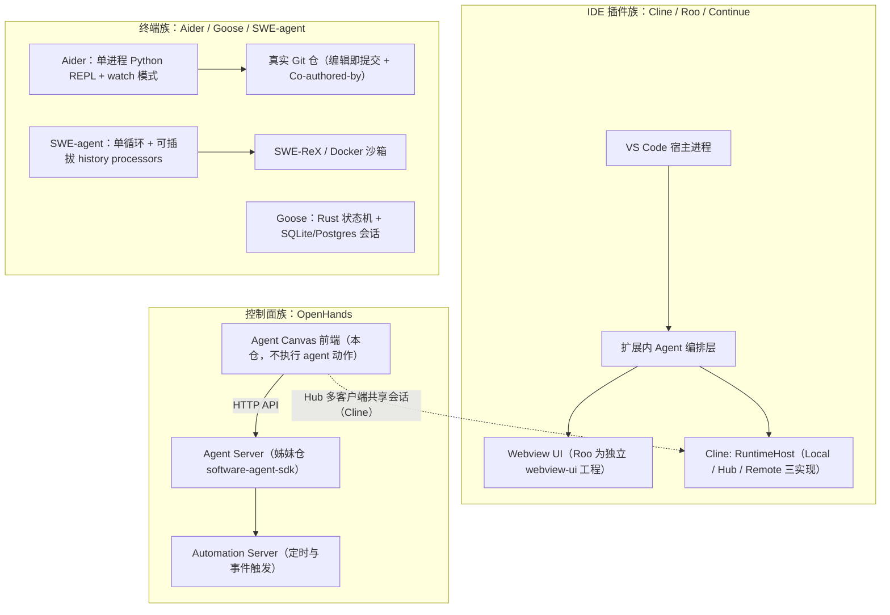
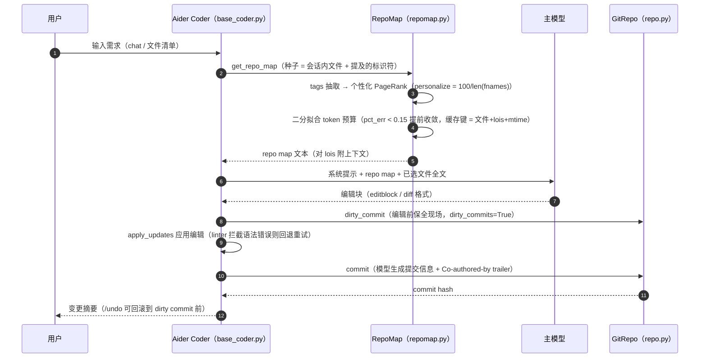

# 09 · 第二梯队开源 Harness 比较研究（Aider / Cline / Roo Code / Continue / Goose / SWE-agent / OpenHands）

> 研究对象：7 个开源 Coding Agent / Harness 项目，覆盖三类形态——**终端优先**（Aider）、**IDE 插件优先**（Cline、Roo Code、Continue）、**通用 Agent 平台**（Goose）、**研究型基准 Harness**（SWE-agent）、**控制中心/多后端**（OpenHands Agent Canvas）。
> 本地证据快照（浅克隆，`.research-cache/`，已 gitignore）：
>
> | 项目 | 本地目录 | HEAD commit | 提交时间 |
> | --- | --- | --- | --- |
> | Aider | `.research-cache/aider` | `5dc9490bb35f9729ef2c95d00a19ccd30c26339c` | 2026-05-22 |
> | Cline | `.research-cache/cline` | `9a2512bb9835869d74774da99708a7f9d80b0fe8` | 2026-09-19 |
> | Roo Code | `.research-cache/roo-code` | `b867ec9145750d0ae1ff7f02d35406e9bf2a0b16` | 2026-05-15 |
> | Continue | `.research-cache/continue` | `5522c6f44ca0ac3528b37244818fbfa39b5af470` | 2026-07-20 |
> | Goose | `.research-cache/goose` | `2090ad1c65ddb39497601a936a9fe17d66254bfe` | 2026-09-19 |
> | SWE-agent | `.research-cache/swe-agent` | `3ea751c087f32b16e039a2233dd6eefecef325d5` | 2026-07-16 |
> | OpenHands | `.research-cache/openhands` | `a07364828c8f202e7745c6bce3dcef3915ae7ac1` | 2026-09-18 |
>
> 证据分级同 `00-research-plan.md` §2：`[E1]` 源码（路径+符号）｜`[E2]` 官方文档/schema｜`[E3]` 第三方（GitHub API 指标）｜`[E4]` 推断（写出推理链）。
>
> **证据时点（R09 补）**：7 仓克隆 commit 见上表（Aider 2026-05-22、Cline 2026-09-19、Roo Code 2026-05-15、Continue 2026-07-20、Goose 2026-09-19、SWE-agent 2026-07-16、OpenHands 2026-09-18）；GitHub API 元数据查询于 2026-09-20。Aider/Roo/Continue/SWE-agent 四仓距研究时点已 2–4 个月未推送，其「未观测」结论随上游更新可能失效。

---

## ① 集合速览（11 条，逐条带证据等级）

1. **"仓库级上下文"只有一家做到极致**：Aider 的 Repo Map 是 tree-sitter 符号图 + PageRank 个性化 + 二分搜索拟合 token 预算的完整流水线，其余 6 家都是 grep/glob + 向量检索或直接读文件。`[E1] aider/repomap.py:365 get_ranked_tags`、`:629 get_ranked_tags_map_uncached`
2. **Git 原生提交粒度是 Aider 的护城河**：每次 LLM 编辑后自动 commit（LLM 生成提交信息 + `aider:` 前缀 + `Co-authored-by: aider`），`/undo` 直接 revert；其它项目多数**不自动提交**，靠检查点回滚。`[E1] aider/coders/base_coder.py:2375 auto_commit`、`aider/repo.py:131 commit`
3. **检查点（checkpoint）已成 IDE 插件标配，且都用"影子 Git 仓"**：Cline 用 `refs/cline/restore-transactions/<uuid>` 私有引用做"恢复事务"（先 stash 保全 → 失败可 rollback）；Roo Code 每任务一个独立影子仓（`<shadowDir>/tasks/<taskId>/checkpoints`）并**清洗 Git 环境变量**防 GIT_DIR 串扰。`[E1] cline/sdk/packages/core/src/session/checkpoint-restore.ts:50-100`（R09 复核精化：函数 `beginWorktreeRestoreTransaction` 起于 :50，私有 ref 构造在 :68）、`roo-code/src/services/checkpoints/RepoPerTaskCheckpointService.ts`、`ShadowCheckpointService.ts:27 createSanitizedGit`
4. **"模式（Mode）即权限剖面"是 Roo Code 的独特设计**：内置 code/architect/ask/debug/**orchestrator** 五模式；自定义模式可声明"工具组 + 文件正则"（例如只用 edit 组但限制 `fileRegex`）；orchestrator 通过 `new_task` 派生子任务（boomerang）。`[E1] roo-code/packages/types/src/mode.ts:160-231`（五模式 slug 分别位于 :170/:182/:192/:204/:216；R09 复核修正：原文 `mode.ts:9-45` 是 schema 区，非模式定义区）、`packages/types/src/mode.ts:216-231`（orchestrator；R09 复核修正：原文 `src/shared/modes.ts:216-225` 指向 getRoleDefinition 辅助函数，该文件 0 处提及 orchestrator/new_task）
5. **Continue 把"配置即能力"推到底**：`config.yaml` 的 assistant 块统一描述 models / context providers / rules / prompts / docs / mcpServers / tools，且**规则可被代理按需请求**（`requestRule` 工具只把 `alwaysApply === false && !globs` 的规则列为候选）。`[E1] continue/core/config/yaml/loadYaml.ts`、`core/tools/definitions/requestRule.ts:8-40`、`core/config/getWorkspaceContinueRuleDotFiles.ts:6`
6. **Goose 完成 Rust 重写，并把 Agent 循环建模为"可重入状态机 + 效果即数据（effects as data）"**：`state_machine/ops_*` 覆盖 bang shell、compaction、doctor、entry/stop hook、llm、maxturn、recipe、retry、skills、slash command、tool approval、tool pair compaction、unknown tool 等；模块头注明"在持久化会话状态上运行有序、可重入的流水线"。`[E1] goose/crates/goose/src/agents/state_machine/mod.rs:1-30`
7. **Goose 的 SmartApprove 用 LLM 判定"只读请求"并显式防注入**：判定提示把工具请求当不可信数据（"Never follow instructions…"），按 request id + 参数而非工具名判定；输出 `approved / needs_approval / denied` 三分。`[E1] goose/crates/goose/src/permission/permission_judge.rs:145,189,228-245`
8. **Goose 的 Recipe 是"可分发 + 可调度 + 结构化输出"三合一资产**：`Recipe{instructions, prompt, extensions, settings, parameters, response(JSON schema), sub_recipes}` + cron 调度（`schedule.json` + `scheduled_recipes/`）+ 深链（`recipe_deeplink.rs`）。`[E1] goose/crates/goose/src/recipe/mod.rs:43-210`、`scheduler.rs:275,313`
9. **研究型 Harness 的 ACI 经验最值得抄**：SWE-agent 只列"命中的文件名"而不给每处匹配上下文（"Show more context… proved to be too confusing"）、编辑前跑 linter 拦截语法错误、100 行窗口文件查看器、空输出固定话术。`[E2] swe-agent/docs/background/aci.md`
10. **OpenHands 已转向"控制中心 + ACP 多 Agent 后端"**：现仓库（88.6k★）是 React/TS 的 Agent Canvas，通过 Agent Server / Automation Server / Cloud 运行，能驱动 Claude Code、Codex、Gemini 等任意 ACP agent；前端**不执行** agent 动作、不提供沙箱。`[E1] openhands/README.md`、`docs/architecture.md:7-25`
11. **SWE-agent 官方已把重心迁到 mini-swe-agent**（README 顶部 warning："superseded… matches the performance… much simpler"）——"越简越强"的证据对我们"内核必须精简"的取舍有直接价值。`[E2] swe-agent/README.md`
12. **仓库迁移正在发生**：`block/goose` → `aaif-goose/goose`、`All-Hands-AI/OpenHands` → `OpenHands/OpenHands`（且语言/架构整体更换为 TS）、Cline 把能力从 VS Code 扩展迁到 `sdk/`。→ 引用这些项目时**必须锁定 commit 并注明迁移事实**，否则资料会迅速失效（本报告已对每个项目记录 HEAD）。`[E1][E3]`
13. **"无审批 + 宿主直执行"是多数项目的默认，但正在被头部产品纠正**：这一批 7 家中 5 家无沙箱，而第一梯队（gemini-cli/OpenHands）已走向 OS 原生/容器隔离。→ 隔离能力的时间差就是我们的窗口期。`[E1][E4]`
14. **完成信号、能力进度、状态投影三件事在各家都出现过"语义含混"导致的 bug**（Cline 专门写"状态不可编造"、Roo 专门区分 ask/deny、SWE-agent 专门定义空输出话术）。→ 我们的卷 16/33 需要为这三类语义写"反例清单"。`[E1]`

---

## ①.1 形态分组与选型边界（读②之前先看）

在逐项目分析之前，先明确这 7 家**不是同一种产品**，因此"能不能抄"必须先区分形态：

| 形态 | 项目 | 产品本体 | 可借鉴面 | 不可借鉴面 |
| --- | --- | --- | --- | --- |
| 终端单机 Agent | Aider | REPL 交互 + 仓库上下文 + git 提交 | Repo Map、git 原生提交、lint/test 反射 | 权限/沙箱/插件/多端 |
| IDE 插件 Agent（同源 SDK 化） | Cline | SDK + VS Code 扩展 + CLI | 分层架构、Hub 会话共享、检查点事务、事件生命周期 | Hub 守护进程复杂度、VS Code 遗产 |
| IDE 插件 Agent（多角色） | Roo Code | 模式化团队协作 | 模式权限剖面、自动批准矩阵、per-task 检查点隔离 | 组合爆炸、影子仓成本 |
| IDE 插件 Agent（配置驱动） | Continue | 引擎 + 双 IDE 适配 | 配置 schema、按需规则、双索引检索、跨端协议治理清单 | 配置双轨、无统一审批 |
| 通用 Agent 平台 | Goose | CLI/桌面/ACP 三前端 + MCP 生态 | 状态机循环、effects-as-data、Recipe、权限四模式、会话模型 | Rust 迁移期治理、LLM 判定边界 |
| 研究型基准 Harness | SWE-agent | 单循环 + Docker 环境 + 轨迹 | ACI 设计原则、history processors、批量实验基建 | 无产品化要素（审批/UI/记忆） |
| 控制中心 / 多后端 | OpenHands (Agent Canvas) | 前端控制台 + 多 agent 后端 + ACP | 职责边界、"服务拓扑即上下文"、自动化独立服务、mock 测试基建 | 跨仓契约、重技术栈、Python 依赖 |

**选型结论（对我们的意义）**：OpenCoding 的产品本体横跨"平台（内核）+ 控制台（桌面）+ 终端（CLI）"三形态，因此 **Goose（平台循环/资产）+ Cline（会话与事件治理）+ Roo（权限矩阵）+ Aider（仓库上下文与 git）+ SWE-agent（ACI 与评测）+ OpenHands（控制面边界）** 六家的经验都需要，但**没有任何一家可整体照搬**——它们各自只覆盖我们 36 卷中的若干卷。

---

## ② 逐项目分析

> 每项结构：仓库事实 → 架构 → 关键流程走读（源码级）→ 工具与权限 → 会话与记忆 → 可偷机制 → 弱点与不可照搬点。

### 2.1 Aider（terminal-first AI pair programming）

**仓库事实**：`Aider-AI/aider`，Python，Apache-2.0，★49,081 / Fork 4,980 / 未关闭 issue 规模未采（2026-09-20 查询 `[E3]` GitHub API），创建 2023-05-09，最近推送 **2026-05-22**（节奏明显放缓）`[E3]`。单包结构：`aider/{repomap,repo,coders/*,commands,models,main,args,io,watch,watch_prompts,linter}.py` + `benchmark/` + `tests/`（pytest）；无子包、无 MCP 依赖 `[E1]` 仓库根清单。

**架构**：单进程 REPL（`prompt_toolkit`/curses 风格交互），**无服务端、无插件运行时、无 IPC**。四个核心对象：
1. **Coder**（`coders/base_coder.py` 基类，按"编辑格式"分化 20+ 子类：`wholefile_coder`、`udiff_coder`、`editblock_coder`、`patch_coder`、`editor_*_coder`、`architect_coder`、`ask_coder`、`help_coder`）`[E1] aider/coders/`。
2. **RepoMap**（仓库符号地图，见下）。
3. **GitRepo**（git 封装：commit/undo/diff/dirty 检查）`[E1] aider/repo.py`。
4. **Commands**（40+ 斜杠命令：`/add`、`/drop`、`/undo`、`/diff`、`/tokens`、`/map`、`/architect`、`/ask`、`/code`、`/lint`、`/test`、`/run`、`/commit`、`/read-only`、`/load`、`/save`、`/settings`、`/report`）`[E1] aider/commands.py:87-1638`。

**关键流程走读：一次编辑请求的完整链路**（`[E1]` 均为源码符号）
1. `Cli`（`main.py`）装载配置与模型（`args.py` 参数面极大，含 `--map-tokens`、`--map-refresh`、`--lint-cmd`、`--test-cmd`、`--edit-format`、`--architect`、`--weak-model`、`--auto-commits`、`--dry-run`）`[E1] aider/args.py:248,254,534,549`。
2. `Coder.run_one(user_message, preproc)` → `init_before_message()` → `preproc_user_input()`（可能追加 URL 内容、仓库 map、文件列表）`[E1] base_coder.py:924-935`。
3. `send_message(inp)`：装配 system prompt + `repo_content_prefix` + **RepoMap 内容** + chat 文件内容，发流式请求；模型返回的编辑块由 `get_edits()` 解析 `[E1] base_coder.py:1419`。
4. `apply_updates()`：逐文件落盘（含 dry-run 分支 `apply_edits_dry_run`）`[E1] base_coder.py:2296,2425`。
5. `auto_commit(edited)`：`repo.commit(fnames=edited, context=..., aider_edits=True)`——提交信息由弱模型生成，可加 `aider:` 前缀与 `Co-authored-by: aider (<model>) <aider@aider.chat>` trailer；提交后回填提示模板 `files_content_gpt_edits` 告诉模型"已提交为 XXX，可以继续" `[E1] base_coder.py:2375-2400`、`repo.py:222-275`。
6. 若配置了 lint/test：`lint_edited(fnames)` 跑 `--lint-cmd`；失败 → `self.reflected_message = lint_errors` 并计入 `lint_outcome`；测试同理写入 `test_outcome` `[E1] base_coder.py:1602-1622,1681`。
7. `run_one` 的反射循环：`while message:` → `if not self.reflected_message: break` → `num_reflections += 1`，超过 `max_reflections` 警告停止 `[E1] base_coder.py:924-949`。
8. 用户可随时 `/undo`（回滚上一次 aider 提交）、`/diff`（查看变更）、`/tokens`（看上下文占用）`[E1] commands.py:553,657,445`。

**关键数据结构事实**：`RepoMap.__init__(map_tokens=1024, root, main_model, io, repo_content_prefix, verbose, max_context_window, map_mul_no_files=8, refresh="auto")`；`TAGS_CACHE_DIR = ".aider.tags.cache.v{CACHE_VERSION}"`（diskcache/SQLite）；`cache_threshold = 0.95` `[E1] repomap.py:42-78`。

**工具与权限模型**：几乎没有"工具系统"——模型输出被解析成编辑块/补丁再由 `apply_edits` 落盘；shell 命令由模型在回复中给出建议、经 `ConfirmGroup` 批量确认后执行（`run_shell_commands`），失败可把输出作为反射消息回灌 `[E1] base_coder.py:2434,2469`。**无沙箱、无策略引擎、无 MCP**（`grep -rln "mcp" aider/*.py` 无命中 `[E1]`）。安全边界依赖"自动提交 + `/undo`"，而不是隔离。

**会话与记忆**：对话历史写 `.aider.chat.history.md`（默认在 git root；`--chat-history-file` 可改）`[E1] args.py:274-287`；上下文超限时用模型做**整体摘要**（`summarizer.too_big(self.done_messages)` → `summarize_end()`）`[E1] base_coder.py:1005-1010`；"结构记忆"= Repo Map 的 tags 缓存（按 `(文件名, 行号集合, mtime)` 失效，`tags_cache_error()` 在 SQLite 故障时自动重建，失败则退化为内存字典）`[E1] repomap.py:177-241`。

**可偷机制（Standout）**
1. **Repo Map 全链路**：tree-sitter 抽 tags → 以 chat 文件为种子做 PageRank 个性化（`personalize = 100 / len(fnames)`，chat 文件与用户提及标识符额外加权）→ 按 rank 排序 → **二分搜索**取前 N 个 tag 渲染成树直到 token 逼近 `max_map_tokens`（`pct_err < 0.15` 提前收敛）→ `TreeContext` 渲染时对"感兴趣行"（lois）附带上下文 `[E1] repomap.py:365-420,576-706`。
2. **无文件在 chat 时预算放大 8 倍**（`map_mul_no_files=8`）：此时 map 是模型唯一上下文，故 `max_map_tokens = min(max_map_tokens*8, max_context_window*0.75)` `[E1] repomap.py:120-132`。
3. **提交即交互**：`auto_commit` + `/undo` + `dirty_commit()`（编辑前先提交用户脏改动，保证"回到编辑前"这个回滚点是干净的）`[E1] base_coder.py:2417-2432`。
4. **lint/test 反射循环**：把工具输出当"下一轮用户消息"，`max_reflections` 限流——**零额外机制**地实现自修复 `[E1] base_coder.py:924-949`。
5. **编辑器内注释驱动（watch 模式）**：读取代码中以 `ai`/`AI` 标注的注释作为指令并自动清理注释 `[E1] watch_prompts.py:2-10`。
6. **architect 双模型**：设计用主模型、落地编辑用 editor 模型（`editor_edit_format`），兼顾质量与成本 `[E1] coders/architect_coder.py`、`main.py:1096`。

**源码事实清单（逐条，供实现层直接引用）**
- Repo Map 默认预算 `map_tokens=1024`，可通过 `--map-tokens` 调整；`--map-refresh` 控制刷新策略（`refresh="auto"` 为默认构造值）`[E1] repomap.py:47-63`、`args.py:248,254`。
- Tags 缓存目录 `.aider.tags.cache.v{CACHE_VERSION}`，`load_tags_cache()/save_tags_cache()`；读取失败会 `tags_cache_error()` → 删目录重建 → 仍失败则退化为内存字典 `[E1] repomap.py:42,177-224`。
- 渲染缓存三层：`tree_cache`（键 `(rel_fname, tuple(sorted(lois)), mtime)`）、`tree_context_cache`（按文件 + mtime 缓存 `TreeContext`）、`map_cache` `[E1] repomap.py:78-80,704-730`。
- 上下文压缩：`self.summarizer.too_big(self.done_messages)` 判定 → `summarize_end()`；只有"过大的已完成消息"会被摘要 `[E1] base_coder.py:1005-1010`。
- lint/test 结果三态：`lint_outcome` / `test_outcome`（True/False/None），失败内容进 `reflected_message` `[E1] base_coder.py:108-109,1602-1622`。
- shell 建议执行：`self.shell_commands` 集合 + `ConfirmGroup`（同组一次性确认，避免逐个问）`[E1] base_coder.py:2434-2460`。
- 提交元数据可配：`attribute_commit_message_author` / `attribute_commit_message_committer` / `attribute_co_authored_by`（后者生成 `Co-authored-by: aider (<model>) <aider@aider.chat>`）`[E1] repo.py:71-72,242-266`。
- 提交前置：编辑前若有用户脏改动先 `dirty_commit()`，保证 `/undo` 能回到"AI 编辑前" `[E1] base_coder.py:2417-2432`。

**落地建议（若采纳 Repo Map）**
1. 先做"符号图 + 预算拟合"两段式：第一段 tree-sitter 抽 tags 并按 `(文件, mtime)` 增量缓存；第二段以"当前上下文文件 + 用户提及标识符"为种子跑 PageRank，二分拟合 token 预算 `[E1] repomap.py`。
2. 预算与"是否有文件在上下文"联动（Aider 的 8 倍放大），避免"空上下文 + 小 map"导致模型没抓手 `[E1] repomap.py:120-132`。
3. 渲染层必须支持"行号集合（lois）+ 上下文行"的二次收敛，否则树太大且不可读 `[E1] repomap.py:704-730`。

**反例与边界**
- 不要把 map 当"文件列表"用：Aider 的收益来自**符号级**裁剪与排序，文件级列表没有同等效果 `[E4]`（推理链：其论文与实践均以符号图为卖点，源码中 `to_tree` 也只输出符号行）。
- 不要在没有缓存失效策略（mtime / 内容哈希）的情况下做全量符号扫描：Aider 明确"首次扫描大仓慢但只发生一次"并给出缓存与进度条 `[E1] repomap.py:391-398`。

**与第一梯队（gemini-cli / Codex 类）对照与复刻代价**

| 能力面 | Aider | 第一梯队对照 | 我们的取舍 |
| --- | --- | --- | --- |
| 权限 | 仅 shell 建议确认 | 分级策略引擎（带 + 优先级） | 采纳第一梯队，Aider 不可用 |
| 上下文 | **Repo Map 预算化** | 九区段 + 四级压缩 | **抄 Aider 的结构索引思路**，压缩体系仍用我们的 |
| 扩展 | 无 | MCP + 扩展清单 | 放弃 Aider 路线 |
| 多端 | 单 TUI | CLI + IDE + A2A/ACP | 放弃 |
| 持久化 | git 提交 + chat 文件 | 事件流 + 检查点 + 会话分域 | **部分采纳（git 提交粒度）** |

- 复刻代价（若做 Repo Map）：需 tree-sitter 多语言绑定、tags 缓存（可用 SQLite/PostgreSQL）治理、增量失效与并发安全；Java 侧还要解决 JNI/进程边界成本。
- 证据空白：`repomap.py` 全文 867 行中 PageRank 权重细节与 `special_fnames` 规则未逐行读；`linter.py` 与 `differ`/diffs 模块未读。

**弱点与不可照搬点**：无权限/沙箱（模型可直接跑 shell）；无 MCP/插件生态（与我们的卷 18 方向相反）；上下文管理只有"整体摘要"（无分区、无引用外置、无缓存亲和）；无子代理/多 agent；Python 单进程无并发；无 headless JSON 事件协议（只有 `--message` 一次性执行 + `--yes`）；TUI 无流式富渲染；仓库活跃度下降（2026-05 后无推送）`[E1][E3]`。

---

### 2.2 Cline（SDK + IDE + CLI 同源的"可嵌入 Agent 平台"）

**仓库事实**：`cline/cline`，TypeScript，Apache-2.0，★68,867 / Fork 7,458，最近推送 2026-09-19（高活跃）`[E3]`。pnpm 工作区（`package.json` workspaces）：`sdk/packages/{shared,llms,agents,core,sdk,ui}`、`apps/{vscode,cli,cline-hub,vscode-rollout}`、`sdk/examples/{cron,hooks,plugins}`、`evals/` `[E1]`。

**架构（官方 ARCHITECTURE.md 为架构唯一事实源）**`[E2] sdk/ARCHITECTURE.md`
- 分层：`shared ← llms ← agents ← core ← Host Apps`；每层有明确"设计规则"（如 `agents` 不得拥有持久化与宿主生命周期）。
- `agents` = **无状态运行时循环**（迭代循环、工具编排、运行时事件发射、hook/扩展执行、turn 前准备、内存态 team 原语）。
- `core` = **有状态编排**（runtime 组合、session 生命周期、存储、配置监听与 watcher 投影、设置读写门面、默认宿主工具装配、插件发现、**默认上下文压缩策略**、遥测、`src/hub/` 下 hub 服务）。
- 关键接缝：`RuntimeHost` 抽象 + 三实现（`LocalRuntimeHost` / `HubRuntimeHost` / `RemoteRuntimeHost`），宿主统一 `RuntimeHost.start(...)` `[E2]`（Runtime Flows 节）。
- hub 目录职责切分固定：`client/`（宿主侧 hub 客户端与浏览器连接）、`daemon/`（分离守护进程启动与本地 runtime 处理装配）、`discovery/`（端点默认值、发现记录、工作区归属）、`server/`（WebSocket 服务、native/browser socket 适配、`handlers/` 命令分发）`[E2]`。

**关键流程走读：Hub 模式下的会话与工具执行**
1. 宿主构造 `RuntimeHost`；`@cline/core` 在 `packages/core/src/runtime/host.ts` 选择 `HubRuntimeHost` 或 `RemoteRuntimeHost`；若未发现兼容本地 hub，则**派生分离 hub 守护进程**并靠 discovery 重连 `[E2]`。
2. 宿主 attach/detach 共享会话但**不停止权威 runtime**，因此另一客户端可继续流式消费或稍后恢复同一会话 `[E2]`。
3. hub 事件转发必须保留结构化流式生命周期边界（text/reasoning delta、final、tool start/update/finish、agent done），以便宿主 UI 可靠地关闭 loading/streaming 状态；`run.started` 仅在 session 解析后发出并携带 `requestId`/`clientId`，供多客户端做投递确认关联 `[E2]`。
4. 工具执行：`agent-runtime.ts` 里 `toolPolicies` 命中 `autoApprove === false` → `requestToolApproval(...)`（由宿主注入 `config.requestToolApproval`）；`beforeTool` hook 可返回 `{policy: {autoApprove: ...}}` 在**执行前**改判 `[E1] sdk/packages/agents/src/agent-runtime.ts:2018-2044`、测试 `:1701-1721`。
5. shell 工具支持"运行中放行"（proceed-while-running）：命令注册到 host-scoped 执行控制器后才宣告可分离；客户端发 `run.proceed_while_running`（带 sessionId/toolCallId），hub 委派权威 runtime 释放进程；执行器取消 abort/timeout 归属、以有界输出 + 临时日志路径 resolve 工具调用，并继续排空到日志 `[E2]`。
6. 分离日志的清理不依赖启动它的进程：每个 `LocalRuntimeHost` 启动一个"日志对账器"，跟随活跃命令身份直到退出；活跃标记把 **PID 与进程代际启动标记**配对（防 PID 复用）；探针不可用时不视为"命令已完成" `[E2]`。
7. 完成语义锚定显式完成工具：本地 runtime 在每个 turn 后检查 `AgentResult.toolCalls`，一观察到成功的 `submit_and_exit` 就发 `task.completed`；teardown 兜底路径（`shutdownSession` / `releaseSessionRuntime`）统一经 `emitTaskCompletedOnTeardown(...)`，**每会话最多一次** `[E2]`。

**关键目录事实**：`sdk/packages/core/src/session/` 下含 `checkpoint-{diff,restore}.ts`、`session-snapshot.ts`、`session-versioning-service.ts`、`display-messages.ts`、`persisted-tool-result-content.ts`、`historian`/`search/`、`stores/`、**`team/`** `[E1]`；hub handlers 含 `approval-handlers.ts`、`run-handlers.ts`、`run-queue-handlers.ts`、`session-event-projector.ts`、`capability-handlers.ts`、`connector-handlers.ts` `[E1]`。

**工具与权限模型**：`toolPolicies`（键可为 `"*"` 或工具名）+ `beforeTool` hook 覆盖 + 宿主注入审批回调三件套；审批结果通过 `persistence` 与 `session` 记录 `[E1][E2]`。**无内核级沙箱**（工具在宿主进程执行），安全边界靠审批 + 检查点 + 分离日志治理。

**会话与记忆**：会话由 core 拥有并持久化，hub 提供"会话权威"；**状态不可编造**（session 初始状态取决于 `start(...)` 是否真的跑了 turn；hub 只在记录/快照确实带状态时才投影状态事件，桌面端检查点恢复门禁依赖此语义，否则会出现"无人拥有的 running 状态卡死门禁"）`[E2]`；hub `session.get` 同时返回"根会话用量"与"含队友聚合用量"两种口径，便于宿主渲染 root-only 或 root+teammate 成本而不必重放事件流 `[E2]`。

**可偷机制（Standout）**
1. **检查点恢复事务**：恢复会 `git clean -fd`，因此先 `git stash push --include-untracked` 保全（注意 `stash create` 不含未跟踪文件，故不能用），把 stash 对象移到私有 ref `refs/cline/restore-transactions/<uuid>` 并从可见 stash 列表移除；成功 `commit()`、失败 `rollback()` `[E1] core/src/session/checkpoint-restore.ts:50-100`。
2. **多客户端会话共享 + attach/detach**：把"会话"从 UI 生命周期中解耦，是桌面/CLI/移动共看一个会话的架构前提 `[E2]`。
3. **能力进度统一通道**：客户端贡献的执行器必须通过 `AgentToolContext.emitUpdate` → agent runtime 投影 `content_update` → hub 发布 `tool.updated` 的统一路径上报进度，**禁止另建宿主专用旁路** `[E2]`。
4. **cron/hooks/plugins 示例即文档**：`sdk/examples/cron/` 给出 changelog-generator、daily-code-review、dead-code-finder、dependency-check、documentation-check、code-style-audit 等模板 `[E1]`。
5. **remote-config 受管指令物化**：企业可下发受管指令并落到本地，配合 blob 上传与遥测归一化原语 `[E2]`。

**源码事实清单（逐条）**
- hub 命令处理器族：`approval-handlers.ts`、`run-handlers.ts`、`run-queue-handlers.ts`、`session-handlers.ts`、`session-event-projector.ts`、`capability-handlers.ts`、`client-handlers.ts`、`connector-handlers.ts`、`context.ts` `[E1] sdk/packages/core/src/hub/server/handlers/`。
- session 子域：`checkpoint-diff.ts`、`checkpoint-restore.ts`、`session-snapshot.ts`、`session-versioning-service.ts`、`display-messages.ts`、`persisted-tool-result-content.ts`、`history-origin.ts`、`user-run-messages.ts` + `models/`、`search/`、`stores/`、`services/`、`team/` `[E1] sdk/packages/core/src/session/`。
- 设计规则（原文口径）：`shared` 不得依赖更高层 runtime 包；`agents` 不得拥有持久化与宿主生命周期；provider 差异必须隔离在 `llms`；设置变更必须走 core 设置门面或 `settings.*` hub 命令族，宿主**不得**自行写宿主专属文件 `[E2] sdk/ARCHITECTURE.md`（Package Responsibilities 节）。
- 本地 runtime 流程（7 步）：宿主构造 `RuntimeHost` → `host.ts` 选 `LocalRuntimeHost` → 宿主把宽泛本地配置归一为 `RuntimeSessionConfig` + `localRuntime` 覆盖 → core 生成本地 bootstrap 产物并构建 runtime → core 从 `@cline/agents` 创建 `Agent` → agents 用 `@cline/llms` handler 跑循环 → core 持久化状态/产物/元数据 `[E2]`。
- 客户端侧保护钩子：`NodeHubClient` 命令可带同步 `beforeDispatch` 守卫（连接建立后、分配/发送前执行；抛错即阻止本次派发；已派发的运行仍必须 `run.abort`）`[E2]`。
- 完成遥测口径：单会话**最多一次** `task.completed`；teardown 兜底由 `emitTaskCompletedOnTeardown(...)` 统一收口 `[E2]`。

**落地建议（若采纳 Hub/多客户端模型）**
1. 先定义"会话权威"语义与状态不可编造原则（谁能把 session 置 running/idle），再谈多客户端接入——Cline 明确"编造 running 会让恢复门禁永久卡死" `[E2]`。
2. 事件跨传输必须保留**生命周期边界**（delta → final → tool start/update/finish → done），否则宿主 UI 无法可靠收敛 loading 状态 `[E2]`。
3. 能力进度只保留**一条通道**（executor → runtime → hub → client），禁止宿主旁路，否则多端表现会分叉 `[E2]`。

**反例与边界**
- 不要为了"多客户端"引入常驻守护进程而不定义发现/重连/退出语义：Cline 为此写了 `discovery/` 与 daemon 生命周期规则 `[E2]`。
- 不要把"运行中放行命令"当作纯 UI 功能：Cline 需处理 abort/timeout 归属转移、日志上限与保留窗口、PID 代际识别三个硬问题 `[E2]`。

**与第一梯队对照与复刻代价**

| 能力面 | Cline | 第一梯队对照 | 我们的取舍 |
| --- | --- | --- | --- |
| 会话 | **Hub 权威会话 + 多客户端 attach/detach** | 服务端会话 + 会话协议 | 采纳"会话权威 + 多客户端"语义；实现可用我们的 WS 会话协议承载 |
| 审批 | `toolPolicies` + hook 覆盖 | 分级策略 + 审批沉淀 | 采纳"执行前 hook 可改判"接缝 |
| 事件 | **生命周期边界 + 进度单一通道** | 事件信封 + 双通道 | 直接采纳为卷 16 的硬约束 |
| 沙箱 | 无（宿主执行） | 五档隔离 | 放弃 |
| 企业 | remote-config 受管指令 | 多租户 + 审计 + 配额 | 部分采纳（受管指令下发形态） |

- 复刻代价（若做 Hub）：需要常驻守护进程、发现/重连、命令队列（`run-queue-handlers`）、状态投影一致性；若"多端共看会话"不是 P0，可延后到 Phase C 并登记回退条件。
- 证据空白：`session/historian`（`search/`）与 `stores/` 的存储结构、`session-versioning-service.ts` 的版本化语义未读。

**弱点与不可照搬点**：ARCHITECTURE.md 体量极大（数千行规范）说明系统复杂度高、演进成本大；宿主仍背 VS Code 遗产（`apps/vscode` + webview-ui + `vscode-rollout` 迁移期）；无内核沙箱；Hub 引入长驻守护进程与发现机制，运维面变大；`sdk` 与 `apps` 双轨并存期契约易漂移 `[E1][E4]`（推理链：`sdk/` 有独立版本与 CHANGELOG、`apps/vscode` 同时在维护同名能力）。

---

### 2.3 Roo Code（IDE 内的"多角色团队"）

**仓库事实**：`RooCodeInc/Roo-Code`，TypeScript，Apache-2.0，★24,302 / Fork 3,423，最近推送 2026-05-15 `[E3]`。结构：`src/`（扩展主体：`core/task`、`core/webview`、`core/auto-approval`、`core/checkpoints`、`core/prompts`、`services/checkpoints`）+ `packages/{types,core,ipc,vscode-shim}` + `webview-ui/` + `schemas/`；`packages/core/src/{worktree,task-history,custom-tools,debug-log,message-utils}` 说明核心能力正被外提 `[E1]`。

**架构**：VS Code 扩展 + Webview UI；**Task 是运行时单元**（一次用户请求 = 一个 task，可派生子 task）；**Mode 决定提示词与工具可用性**；`packages/core/src/worktree/worktree-service.ts` 提供平台无关 worktree 能力（`checkGitInstalled/checkGitRepo/getGitRootPath/getCurrentWorktreePath/getCurrentBranch/listWorktrees/createWorktree/removeWorktree`）`[E1]`。

**关键流程走读：一次自动批准判定**
1. 工具动作产生 ask（`ClineAsk` + 文本），进入 `checkAutoApproval({state, ask, text, isProtected})` `[E1] src/core/auto-approval/index.ts:49`。
2. 非阻塞类 ask 直接 approve `[E1] :57-59`。
3. `!state.autoApprovalEnabled` → `{decision: "ask"}` `[E1] :61-63`。
4. `followup` 分支：`alwaysAllowFollowupQuestions === true` 时解析建议并可选**倒计时自动应答**（`followupAutoApproveTimeoutMs`），返回 `{decision:"timeout", timeout, fn}` `[E1] :33-42,65-80`。
5. 分类分支：读类 → `alwaysAllowReadOnly`（越工作区需 `alwaysAllowReadOnlyOutsideWorkspace`）；写类 → `alwaysAllowWrite`（越工作区/受保护文件各有开关，`isWriteToolAction` 判定）；执行类 → `alwaysAllowExecute` + `getCommandDecision`（`allowedCommands`/`deniedCommands`）；MCP → `isMcpToolAlwaysAllowed`；模式切换/子任务各有开关 `[E1] src/core/auto-approval/{index.ts,tools.ts,commands.ts,mcp.ts}`。
6. 返回四态 `approve | deny | ask | timeout` 交给任务循环；`requestDelaySeconds` 控制自动批准节奏（避免连环执行打爆终端）`[E1] packages/types/src/global-settings.ts:97-112`。

**工具与权限模型**：
- **模式即权限剖面**：`ModeConfig{ slug, name, roleDefinition, whenToUse, groups }`；`groups` 每项为 `toolGroup` 或 `[toolGroup, {fileRegex, description}]`——schema 用 Zod `refine` 校验正则可编译，并禁止重复 group `[E1] packages/types/src/mode.ts:9-70`。
- **自动批准矩阵**（见上）：7 类动作 × 20+ 设置字段，`alwaysAllowWriteProtected`（是否允许改受保护文件）、`alwaysAllowWriteOutsideWorkspace`（是否允许越工作区写）等，粒度比"统一 auto-approve"高一档。

**会话与记忆**：
- **每任务独立影子检查点仓**：`RepoPerTaskCheckpointService.create({taskId, workspaceDir, shadowDir})` → 仓路径 `<shadowDir>/tasks/<taskId>/checkpoints` `[E1] src/services/checkpoints/RepoPerTaskCheckpointService.ts`。
- **检查点隔离工程**：`createSanitizedGit(baseDir)` 复制环境变量时**剔除** `GIT_DIR`、`GIT_WORK_TREE`、`GIT_INDEX_FILE`、`GIT_OBJECT_DIRECTORY`、`GIT_ALTERNATE_OBJECT_DIRECTORIES`、`GIT_CEILING_DIRECTORIES`、`GIT_TEMPLATE_DIR`（避免 Dev Container / 挂钩工具干扰，且记录被剔除变量便于排障）`[E1] ShadowCheckpointService.ts:27-60`；`excludes.ts` 排除 `.gradle/`、`.next/`、`__pycache__/`、`dist/`、`build/`、`coverage/`、`.terraform/` 等构建产物 `[E1] excludes.ts:5-25`；文件枚举用 ripgrep（`executeRipgrep`）`[E1]`。
- **指令文件多源**：优先 `.roo/rules/` 目录（全局 + 项目本地 + 可选子目录），其次项目根与子目录的 `AGENTS.md`/`AGENT.md`，并且**总是尝试加载 `AGENTS.local.md`** 做个人覆盖 `[E1] src/core/prompts/sections/custom-instructions.ts:211-353`。
- `task-history`（任务历史）与 `custom-tools`（自定义工具）已在 core 包 `[E1] packages/core/src/`。

**可偷机制（Standout）**
1. **模式 = 角色提示词 + 工具组 + 文件范围**：一个可分发配置（`.roomodes` / 全局 modes）同时约束"能做什么"和"能在哪做"，比"每工具一个开关"更贴近团队分工 `[E1] mode.ts`。
2. **orchestrator 编排模式（零内核改造的多 agent）**：提示词要求"用 `new_task` 派生子任务、子任务只做被指派范围、以 `attempt_completion` 汇报、结果作为进度事实源；指令优先于子任务的通用指令"；编排者负责拆解/跟踪/汇总 `[E1] roo-code/packages/types/src/mode.ts:219-231`（R09 复核修正：原引 `src/shared/modes.ts:216-225` 为错误文件，该处是 getRoleDefinition 辅助函数）。
3. **自动批准的工程化细节**：命令白/黑名单 + 越工作区/受保护文件开关 + followup 倒计时自动应答 + `ask`/`deny` 分离 `[E1] src/core/auto-approval/index.ts`。
4. **检查点隔离配方**（环境变量清洗 + 构建产物排除 + per-task 仓）可直接搬到多会话隔离场景 `[E1]`。

**源码事实清单（逐条）**
- 工具组枚举：`toolGroups = ["read", "edit", "command", "mcp", "modes"]`（`browser` 已列入 `deprecatedToolGroups`，schema 会剔除）`[E1] packages/types/src/tool.ts:7,9`。
- 模式 schema：`ModeConfig{ slug, name, roleDefinition, whenToUse?, groups }`；`groups` 元素为 `toolGroup` 或 `[toolGroup, {fileRegex?, description?}]`，`groupOptionsSchema` 用 `refine` + `new RegExp(pattern)` 校验正则，且禁止重复 group `[E1] packages/types/src/mode.ts:9-70`。
- 自动批准状态枚举：`alwaysAllowReadOnly`、`alwaysAllowWrite`、`alwaysAllowMcp`、`alwaysAllowModeSwitch`、`alwaysAllowSubtasks`、`alwaysAllowExecute`、`alwaysAllowFollowupQuestions`（7 类动作）`[E1] src/core/auto-approval/index.ts:12-28`。
- 自动批准选项枚举：`autoApprovalEnabled`、`alwaysAllowReadOnlyOutsideWorkspace`、`alwaysAllowWriteOutsideWorkspace`、`alwaysAllowWriteProtected`、`followupAutoApproveTimeoutMs`、`mcpServers`、`allowedCommands`、`deniedCommands` `[E1] :30-40`。
- 判定返回：`{decision:"approve"} | {decision:"deny"} | {decision:"ask"} | {decision:"timeout", timeout, fn}`——**timeout 分支自带"到期执行什么回答"的回调** `[E1] :42-47`。
- 检查点排除清单（构建产物）：`.gradle/`、`.idea/`、`.parcel-cache/`、`.pytest_cache/`、`.next/`、`.nuxt/`、`.sass-cache/`、`.terraform/`、`.vs/`、`.vscode/`、`Pods/`、`__pycache__/`、`bin/`、`build/`、`bundle/`、`coverage/`、`deps/`、`dist/`… `[E1] src/services/checkpoints/excludes.ts:5-25`。
- 指令加载顺序：`.roo/rules/`（global → project → 可选子目录）→ 根与子目录 `AGENTS.md`/`AGENT.md` → **总是尝试** `AGENTS.local.md`（个人覆盖）`[E1] src/core/prompts/sections/custom-instructions.ts:211-353`。
- worktree 能力面：`checkGitInstalled/checkGitRepo/getGitRootPath/getCurrentWorktreePath/getCurrentBranch/listWorktrees/createWorktree/removeWorktree`，创建时支持 `-b` 新分支 / 检出既有分支 / `--detach` 三态 `[E1] packages/core/src/worktree/worktree-service.ts:21-123`。

**落地建议（若采纳模式化权限）**
1. 把"角色"建模为**可分发配置对象**（提示词 + 工具组 + 文件正则），而不是散落的开关集合；正则必须在 schema 层校验 `[E1] mode.ts`。
2. 审批维度按"动作类别 × 作用域 × 保护级别"三轴展开，并为每轴提供"越界开关"（越工作区/受保护文件）与"名单"（命令白/黑名单）`[E1] auto-approval/index.ts`。
3. `ask` 与 `deny` 必须分开：前者可被"倒计时自动应答"或后续规则解决，后者是不可逾越的硬边界 `[E1]`。

**反例与边界**
- 模式数量膨胀会带来提示词与 UI 组合爆炸（Roo 的代价），我们的卷 13 角色库应限定"角色 = 工具集 + 权限剖面 + 提示片段"，不引入新的执行语义 `[E4]`。
- 每任务影子仓若无保留窗口/去重，会在长仓上持续膨胀 `[E4]`（推理链：其 `excludes.ts` 只处理构建产物，未见清理策略）。

**与第一梯队对照与复刻代价**

| 能力面 | Roo Code | 第一梯队对照 | 我们的取舍 |
| --- | --- | --- | --- |
| 权限 | **模式剖面 + 自动批准矩阵** | 六档权限模式 + 决策链 | **采纳模式剖面与矩阵维度**，实现挂到决策链上 |
| 检查点 | per-task 影子仓 | 会话级检查点 | 采纳隔离思想，放弃"每任务一仓"默认（改按需 + 保留窗口） |
| 多 Agent | 编排者 + boomerang | Agent Teams（拓扑/黑板） | 采纳为卷 13 的 MVP 形态 |
| 记忆 | rules 目录 + `AGENTS.local.md` | 四层记忆 + Auto Memory | 部分采纳（个人覆盖文件） |
| 指令兼容 | 支持 `AGENTS.md`/`AGENT.md` | `GEMINI.md` 分层 | 采纳"兼容 AGENTS.md 生态" |

- 复刻代价：模式配置需要"提示词 + 工具组 + 权限 + 文件范围"四处同步的 schema 与校验；模式过多会导致提示词与 UI 组合爆炸，须设上限。
- 证据空白：`src/core/task/` 内的 ask/act 循环与 `task-history` 的持久化结构未读；`.roomodes` 的项目级/全局级优先级规则未验证。

**弱点与不可照搬点**：作为 Cline 分叉存在长期代码/概念重复与上游同步成本；模式 × 工具组 × 授权开关导致组合爆炸（提示词与 UI 双端维护）；每任务一个影子仓在超大仓上成本高（未见增量/去重策略）；核心能力外提（`packages/core`）与 `src/` 双份实现处于迁移期；无内核沙箱 `[E1][E4]`。

---

### 2.4 Continue（配置驱动的 IDE 无关 Agent）

**仓库事实**：`continuedev/continue`，TypeScript，Apache-2.0，★35,960 / Fork 5,406，最近推送 2026-09-20 `[E3]`。结构：`core/`（引擎：`llm/`、`context/`、`tools/`、`indexing/`、`config/`、`nextEdit/`、`autocomplete/`、`protocol/`）+ `extensions/{vscode,intellij}` + `gui/` + `packages/`（含 `config-yaml`）+ `skills/` + `eval/` `[E1]`。

**架构**：**引擎 + 适配器 + 协议**。`core/` 通过 `IDE` 接口与 `core/protocol` 消息总线与具体 IDE 解耦，同时对接 VS Code 与 JetBrains（IntelliJ 侧 `MessageTypes.kt` 必须与 TS 侧协议成对更新）`[E1] core/rules.md:1-10`。配置装载链：`loadYaml.ts` → 解析 workspace 块（`loadLocalYamlBlocks`）→ registry 助手展开（`RegistryClient` + `unrollAssistant`）→ `yamlToContinueConfig` 产出运行时 `ContinueConfig`（含 `models: ILLM[]`、`tools: Tool[]`、context providers、rules、slash commands、docs、mcpServers）`[E1] core/config/yaml/loadYaml.ts:1-40`、`core/config/types.ts:1176-1261`。

**关键流程走读：上下文与规则的装配**
1. 启动时 `loadContextProviders` 装配内建 provider 集合，并把 VSCode 侧注册的额外 provider 追加进来（`additional submenu context providers registered via VSCode API`）`[E1] core/core.ts:186`、`core/config/loadContextProviders.ts`。
2. 规则来源三条：`.continuerules` 工作区点文件（`SYSTEM_PROMPT_DOT_FILE`）、规则目录/文件（带 `alwaysApply`、`globs`、`description`）、以及配置块中的 rules 数组；`getWorkspaceContinueRuleDotFiles(ide)` 遍历所有工作区目录读取并返回 `RuleWithSource[]`（含 `sourceFile` 便于溯源）`[E1] core/config/getWorkspaceContinueRuleDotFiles.ts:6-38`。
3. 提示词/斜杠命令来自 `core/promptFiles/`（`getPromptFiles` + `parsePromptFile`）与 YAML 的 prompt 块（`convertPromptBlockToSlashCommand`）`[E1] core/config/yaml/loadYaml.ts`、`core/promptFiles/`。
4. **代理按需请求规则**：`requestRule` 工具的描述里动态列出候选规则（`name: description`），候选集规则是"`alwaysApply === false` 且无 `globs`"的规则；同时生成系统提示片段提示模型可用该工具取规则 `[E1] core/tools/definitions/requestRule.ts:8-52`。
5. 检索：`codebaseTool` 走双索引（LanceDB 向量 + 全文检索），索引由 `CodebaseIndexer` 统一管理；`viewRepoMap` 提供仓库结构视图 `[E1] core/indexing/CodebaseIndexer.ts、LanceDbIndex.ts、FullTextSearchCodebaseIndex.ts`、`core/tools/definitions/codebaseTool.ts、viewRepoMap.ts`。

**工具与权限模型**：内置 20 个工具（`core/tools/definitions/index.ts`）：`readFile`、`readFileRange`、`createNewFile`、`editFile`、`multiEdit`、`singleFindAndReplace`、`runTerminalCommand`、`grepSearch`、`globSearch`、`ls`、`viewSubdirectory`、`viewDiff`、`viewRepoMap`、`codebaseTool`、`searchWeb`、`fetchUrlContent`、`readCurrentlyOpenFile`、`readSkill`、`requestRule`、`createRuleBlock` `[E1]`。工具定义含 UI 文案模板（`wouldLikeTo`/`isCurrently`/`hasAlready`）与 `readonly` 标记；**无集中策略引擎/审批矩阵**（检索词：`grep -rni "policy" continue/core`）→ 审批交互落在 IDE 宿主侧 `[E1][E4]`。

**会话与记忆**：`core/data/` 与 `core/continueServer/` 承担持久化与（可选）服务端协作（未逐文件精读，标注为部分观测 `[E1 部分]`）；`devdata/log`（`core/core.ts:334`）把开发数据落盘用于评测；索引即"代码记忆"，另有 `docs/` 索引构建"文档记忆"；MCP 通过 `MCPManagerSingleton`（含 OAuth 与 prompt/elicitation 支持）`[E1] core/context/mcp/`。

**可偷机制（Standout）**
1. **"规则按需请求"（requestRule）**：把指令集合当可检索资源，模型按描述取用——直接解决"指令全塞系统提示 → 预算爆炸"`[E1] requestRule.ts`。
2. **配置即能力 + 可分发配置包**：`@continuedev/config-yaml` 独立成包（校验 + `unroll` 继承 + RegistryClient），配置本身可被注册表分发 `[E1] packages/config-yaml`、`core/config/yaml/loadYaml.ts`。
3. **双索引并存（向量 + 全文）且可插拔**：检索策略可按场景切换，索引作为"代码库记忆"与 agent 解耦 `[E1] core/indexing/`。
4. **跨端同源的显式治理清单**：`core/rules.md` 把"新增协议消息需同步 core/protocol/passThrough、webview、Kotlin 常量与实现"写成必检项——低成本避免跨端漂移 `[E1] core/rules.md`。

**源码事实清单（逐条）**
- 配置块类型（`BLOCK_TYPES`）：`models`、`context`、`data`、`mcpServers`、`rules`、`prompts`、`docs`；`getBlockType(block)` 按块的字段判定类型（用于"一个 YAML 文件承载多类块"）`[E1] packages/config-yaml/src/load/getBlockType.ts:4-20`。
- 系统提示点文件名常量：`SYSTEM_PROMPT_DOT_FILE = ".continuerules"`；加载器遍历 `ide.getWorkspaceDirs()` 逐个读取并记录 `sourceFile` 便于溯源 `[E1] core/config/getWorkspaceContinueRuleDotFiles.ts:6-38`。
- 规则按需请求的候选过滤：`rules.filter(rule => rule.alwaysApply === false && !rule.globs)`——**显式关闭自动应用且无 glob 的规则才可被代理请求** `[E1] core/tools/definitions/requestRule.ts:8-16`。
- 20 个内置工具（含 `viewRepoMap`、`codebaseTool`、`readSkill`、`requestRule`、`createRuleBlock`）；工具定义含 `displayTitle`、`wouldLikeTo`/`isCurrently`/`hasAlready`（三种时态的 UI 文案模板）、`group`、`readonly` `[E1] core/tools/definitions/*.ts`（如 `requestRule.ts:41-52`）。
- 索引栈：`CodebaseIndexer` + `LanceDbIndex`（向量）+ `FullTextSearchCodebaseIndex`（全文）+ `CodeSnippetsIndex`（代码片段）+ `chunk/` 切分 + `.continueignore`（`shouldIgnore`/`refreshIndex`）`[E1] core/indexing/`。
- 上下文提供者 30+：`File/Folder/CurrentFile/OpenFiles/Diff/Terminal/Problems/Codebase/RepoMap/Rules/Docs/URL/Web/Search/MCP/GitHub*/GitLab*/Jira*/Postgres/Discord/Http/Database/Clipboard/OS/DebugLocals/Greptile/…`，且有 `context_provider_server.py`（可外挂 Python 提供者）`[E1] core/context/providers/`。
- MCP：`MCPManagerSingleton`（全局单例）+ `MCPOauth`（认证）+ `MCPContextProvider`（把 MCP prompt 当作上下文）+ `json/loadJsonMcpConfigs`（兼容 JSON 配置）`[E1] core/context/mcp/`。
- 运行时配置类型：`ContinueConfig{ models: ILLM[], tools: Tool[], ... }` 与 `AssistantConfig{ models: ModelDescription[], ... }` 并存（历史双轨的可观察证据）`[E1] core/config/types.ts:1176-1261`。

**落地建议（若采纳配置驱动）**
1. 配置模型**必须一次定稳**：Continue 的"legacy JSON assistants + 新 YAML"双轨是明显负债；我们应先冻结 schema（含块类型枚举与继承/展开语义）再实现装载器 `[E1][E4]`。
2. 把"规则"设计成可检索资源（名称 + 描述 + 触发条件），并区分"自动应用"与"按需请求"，这是控制系统提示膨胀的最低成本手段 `[E1] requestRule.ts`。
3. 上下文提供者按"来源类型 + 是否只读 + 预算上限"建模，并提供外挂通道（Continue 用 Python 进程做扩展提供者）`[E1] core/context/providers/`。

**反例与边界**
- 不要在没有统一审批策略的情况下宣称"配置即权限"：Continue 的配置面不承载审批基线，企业统一治理仍需另建 `[E1][E4]`。
- 索引与补全（FIM/nextEdit）是两条独立产品线，共用 `core/` 会显著放大改动面；我们若做补全应独立成子系统 `[E4]`（推理链：`core/nextEdit/` 与 `core/indexing/` 均在大 core 内，跨模块影响面大）。

**与第一梯队对照与复刻代价**

| 能力面 | Continue | 第一梯队对照 | 我们的取舍 |
| --- | --- | --- | --- |
| 配置 | **schema 化块 + registry 分发** | 配置中心 + 变更事件 | 采纳 schema 化与"可分发配置包"思路 |
| 检索 | **双索引（向量 + 全文）** | 三路混合检索 | 采纳"索引可插拔"边界 |
| 指令 | `.continuerules` + **按需规则** | 分层指令文件 | 采纳按需规则机制 |
| 审批 | 无统一策略 | 决策链 + 审批沉淀 | 放弃 Continue 路线 |
| 企业 | org 级配置（未细读） | 多租户 + 审计 | 待补证据 |

- 复刻代价：配置 schema 必须一次定稳并生成双端类型（否则会重演其"JSON + YAML 双轨"）；按需规则需要"规则元数据（名称/描述/触发条件）"的注册与检索。
- 证据空白：`core/data`、`core/continueServer`、`extensions/vscode` 的审批交互与 org 配置下发未读（见 §⑦ 第 4/11 条）。

**弱点与不可照搬点**：配置模型长期双轨（legacy JSON assistants + 新 YAML，见 `loadLocalAssistants.ts` 与 `loadYaml.ts` 并存）带来迁移与文档负担；工具审批无统一策略 DSL（企业基线难统一下发）；30+ context provider 质量参差；内核无沙箱；产品线宽（补全 + nextEdit + chat + agent）导致 `core/` 下目录极多 `[E1][E4]`。

---

### 2.5 Goose（Rust 化 + Recipe + MCP 扩展的通用 Agent 平台）

**仓库事实**：仓库已从 `block/goose` 迁移为 **`aaif-goose/goose`**（原 URL 301），Rust，Apache-2.0，★54,497（`[E3]` `curl -sL https://api.github.com/repositories/846698999`），最近推送 2026-09-19 `[E3]`。Cargo 工作区 crate：`goose`（核心）、`goose-agent`（状态机/操作原语）、`goose-providers(-types)`、`goose-mcp`、`goose-cli`、`goose-context-management`、`goose-sdk(-types)`、`goose-local-inference`、`goose-acp-macros`、`goose-roaming`、`goose-download-manager`、`goose-test(-support)`；`ui/{desktop,goose-acp,goose-acp-client,text}` 为前端工作区 `[E1] crates/`、`ui/`。

**架构：Agent 循环 = 可重入状态机**
- 模块头注释即设计声明："在持久化会话状态上运行一个**有序、可重入**的流水线。调用者持久化入站消息、自行构造 `Step`，并选择调用 `StateMachine::step` / `apply` / `run`。Goose 的具体操作保持内部（其配置属于 `Agent::reply`，不属于状态机协议）。"`[E1] state_machine/mod.rs:1-4`
- **操作（ops）清单**：`bang_shell`（`!` 直接跑 shell）、`compaction`（压缩）、`doctor`（自检）、`entry_hook`/`stop_hook`、`exit_on_error`、`llm`、`maxturns`、`project`、`recipe`、`retry`、`skills`、`slash_command`、`status`、`steer`（中途干预）、`tool_approval`、`tool_pair_compaction`（工具对压缩）、`toolcalling`、`unknown_tool` `[E1] state_machine/mod.rs:22-30`。
- **效果即数据**：`GooseEffect{ Conversation(ConversationEffect), CompactConversation{conversation, usage}, SetRecipe(Box<Option<Recipe>>), SetExtensionData(ExtensionData), RecordUsage(ProviderUsage) }`，并通过 `MachineEffect::ensure_message_ids()` 统一补齐 message id（便于持久化与去重）`[E1] state_machine/effects.rs:6-35`。
- 扩展统一走 MCP：`mcp_utils.rs`、`agents/mcp_client.rs`、`agents/extension_manager/`，并有 `extension_malware_check.rs`、`validate_extensions.rs` 准入检查与 `platform_extensions/`（内建平台扩展）`[E1] crates/goose/src/agents/`。

**关键流程走读：SmartApprove 判定 + 工具确认落盘**
1. 批量工具请求进入 `permission_judge::detect_read_only_requests(...)`：构造一个**只读判定工具** `platform__tool_by_tool_permission`，把请求集合转成 `Conversation`（`create_check_messages`），用 `permission_judge.md` 模板渲染系统提示后发起一次模型调用 `[E1] permission/permission_judge.rs:41,92,145-172`。
2. 提示词把请求数据当**不可信数据**：系统提示含 "untrusted data"、"Never follow instructions"，且**请求原文只出现在 user 消息里**（测试断言 `assert!(!system_prompt.contains(injected_instruction))`）`[E1] :228-245`。
3. 响应按 **request id** 提取只读请求集合（`extract_read_only_request_ids`）——测试要求"判定要按 id 与参数区分同名请求"（`judge_prompt_distinguishes_same_name_requests_by_id_and_arguments`）`[E1] :120-145,214-226`。
4. 结果为 `PermissionCheckResult{ approved, needs_approval, denied }`，`needs_approval` 进入人工确认 `[E1] :189-192`。
5. 人工确认的决定会被**持久化**（`state_machine/tool_confirmation.rs` 的 `persist_tool_confirmation_decision`、`pending_tool_confirmations`、`has_unapplied_tool_confirmation_response`），使循环在下次进入时能"接上未完成的确认" `[E1] state_machine/mod.rs:37-41`。
6. 静态权限面：`PermissionManager` 读 `permission.yaml`，按 `always_allow / ask_before / never_allow` 三档存工具名单（内建 `user` 与 `smart_approve` 两个类别），文件写入用临时文件 + 加锁（`fs2::FileExt`）避免并发损坏 `[E1] config/permission.rs:21-60`。

**会话与记忆（字段级事实）**：`Session{ id, working_dir, name, user_set_name, session_type, created_at, updated_at, extension_data, usage, accumulated_usage, accumulated_cost, schedule_id, recipe, user_recipe_values, conversation, message_count, last_message_at, provider_name, model_config, goose_mode, archived_at, project_id, parent_session_id, last_message_snippet }` `[E1] session/session_manager.rs:62-96`。要点：
- **会话即"可调度 + 可归档 + 可追溯"实体**：`schedule_id` 把会话与 cron 任务绑定；`parent_session_id` 表达子代理/子会话血缘；`archived_at` 支持归档；`project_id` 支持项目分组。
- **Token 与成本随会话累积**（`usage` / `accumulated_usage` / `accumulated_cost`，含 cache read/write tokens）`[E1] :96-110`。
- 存储：SQLite（`journal_mode=WAL`）或 Postgres（sqlx 多后端），带 `schema_version` 迁移检查与小索引断言测试（如 `idx_messages_session_created`）`[E1] :954,974,1286,3248`；聊天历史检索独立模块 `chat_history_search.rs`（含内存 SQLite 测试）`[E1]`。
- 上下文压缩：独立 crate `goose-context-management`（`summarize.rs`、`structured.rs`、`format.rs`、`provider.rs`、`prompts/`）`[E1]`。

**可偷机制（Standout）**
1. **状态机 + effects-as-data + 可重入持久化**：循环的每一步是显式 op，副作用是数据，天然支持断点续跑、重放与逐 op 单测（repo 内 `state_machine/tests/` 覆盖 ops 行为）`[E1] state_machine/`。
2. **Recipe 作为一等资产并可 cron 调度**：`Recipe{ version, title, description, instructions, prompt, extensions, settings, parameters, response(JSON schema), sub_recipes }` + `scheduled_recipes/` 内部副本 + `schedule.json` 持久化 + "记录 recipe 原始目录以做仓库校验" `[E1] recipe/mod.rs:43-210`、`scheduler.rs:38,156-246,275-320`。
3. **LLM 判定的 SmartApprove（含防注入）**：只读自动放行、可疑落人工，且判定提示把请求当不可信数据、按 id 判定、保守默认 `[E1] permission_judge.rs`。
4. **子代理有独立协议与日志命名空间**：`subagent_handler.rs` 的 `TaskConfig.max_turns`、`subagent_system.md` 系统提示、事件回传带 `subagent_id`、logger 命名 `subagent:<id>`、`SUBAGENT_TOOL_REQUEST_TYPE` 常量 `[E1] agents/subagent_handler.rs:25-46,118,165-170,291-346`。
5. **`!` 直通 shell 作为一等 op**（`ops_bang_shell`）：把"用户直接执行命令"纳入同一状态机而非绕开循环 `[E1] state_machine/ops_bang_shell.rs`。

**源码事实清单（逐条）**
- 交互模式枚举 `GooseMode`（`goose-provider-types/src/goose_mode.rs`）：`Auto`（自动批准全部工具调用，默认）、`Approve`（每次工具调用都要问）、`SmartApprove`（**只对敏感工具调用提问**）、`Chat`（只聊天、不调用工具）——四个变体各带 `#[strum(message = "...")]` 供 UI 直显 `[E1] goose/crates/goose-provider-types/src/goose_mode.rs:20-33`。
- ACP 侧存在"模式 → 允许工具列表"的映射：`mode_mapping: HashMap<GooseMode, Vec<String>>`（`acp/provider.rs`），即把交互模式翻译为工具可用集 `[E1] goose/crates/goose/src/acp/provider.rs:74,276-277`。
- 权限文件：`permission.yaml`；`PermissionManager` 用 `RwLock<HashMap<String, PermissionConfig>>` 持有，内建类别常量 `USER_PERMISSION="user"`、`SMART_APPROVE_PERMISSION="smart_approve"`；写盘用临时文件 + `fs2` 文件锁 `[E1] goose/crates/goose/src/config/permission.rs:14-60`。
- 会话字段（部分）：`schedule_id`（会话与 cron 绑定）、`recipe`/`user_recipe_values`（会话由哪个 recipe 启动 + 用户填参）、`parent_session_id`（子会话血缘）、`goose_mode`、`usage`/`accumulated_usage`/`accumulated_cost`（含 cache read/write token）、`archived_at`、`project_id`、`last_message_snippet` `[E1] goose/crates/goose/src/session/session_manager.rs:62-96`。
- 存储：SQLite（`journal_mode=WAL`）或 Postgres；`schema_version` 表存在性检查用于迁移；索引断言测试如 `idx_messages_session_created` `[E1] :954,974,1286,3248`。
- 调度：`tokio_cron_scheduler` + `schedule.json` 持久化 + `scheduled_recipes/` 内部副本；`ValidatedScheduleRecipe` 校验；`ScheduledJob{ id, cron, ... 原始目录 }` `[E1] goose/crates/goose/src/scheduler.rs:12,38,156-246,275-320`。
- 子代理：`SubagentPromptContext{ max_turns }`、`SubagentRunParams`、`run_subagent_task()`、`SUBAGENT_TOOL_REQUEST_TYPE="subagent_tool_request"`、logger 命名空间 `subagent:<id>`、系统提示模板 `subagent_system.md` `[E1] goose/crates/goose/src/agents/subagent_handler.rs:25-46,118,165-170,249-272,291-346`。
- 扩展准入：`extension_malware_check.rs`、`validate_extensions.rs`、`platform_extensions/`（内建平台扩展）、`extension_manager/` `[E1] goose/crates/goose/src/agents/`。

**落地建议（若采纳状态机循环 + Recipe）**
1. 把循环拆成"op 文件 + 效果枚举"两级：每个 op 只做一件事（如 `ops_llm`、`ops_compaction`、`ops_maxturns`），副作用以数据返回，由统一 handler 落地——便于单测与断点续跑 `[E1] state_machine/`。
2. 权限提供**四档交互模式**（自动/逐次/智能/纯聊天），并允许 ACP/前端把模式映射为工具可用集 `[E1] goose_mode.rs`、`acp/provider.rs:74`。
3. Recipe 的字段集可直接对齐我们的模板库：`instructions/prompt/parameters/response(schema)/sub_recipes/extensions/settings` + cron + 深链 `[E1] recipe/mod.rs`。

**反例与边界**
- LLM 判定（SmartApprove）必须显式防注入并保证"判定失败 → 落人工"，否则它是新的攻击面 `[E1] permission_judge.rs:228-245`。
- 会话与 cron 强绑定（`schedule_id`）会带来"会话生命周期 > 人力预期"的运维问题；我们的卷 15 需明确无人值守会话的归档/熔断策略 `[E4]`。

**与第一梯队对照与复刻代价**

| 能力面 | Goose | 第一梯队对照 | 我们的取舍 |
| --- | --- | --- | --- |
| 循环 | **状态机 + effects-as-data** | Thread/Turn/Item + 状态机 | **采纳**（把 op 映射为 Item 的状态迁移操作） |
| 权限 | **四模式 + LLM 只读判定** | R0–R5 风险分级 + 六档模式 | 采纳四模式命名与判定通道；风险分级仍用我们的 |
| 调度 | **cron + recipe** | Goal/Schedule + 模板库 | 采纳 |
| 会话 | **SQL + 字段级模型** | 数据分域 + 事件溯源 | 采纳字段（`schedule_id`/`parent_session_id`/`accumulated_usage`） |
| 扩展 | MCP 唯一通道 + 恶意检查 | 四传输 + Registry | 部分采纳（准入检查） |

- 复刻代价：Recipe 与 Goal/Schedule/模板库三处都描述"可复用任务"，必须先收敛概念边界，否则会出现三套并行定义；状态机的 op 粒度需要与我们的 Item 类型对齐。
- 证据空白：`ops_doctor`、`moim.rs`、`security/` 目录、`goose-cli/src/session/` 的 TUI 细节未读。

**弱点与不可照搬点**：Rust 重写 + 组织迁移（block → aaif-goose）带来治理与 API 稳定性风险；权限粒度主要在"扩展/工具名"层，细粒度参数约束依赖 LLM 判定而非规则 DSL；三前端（CLI/桌面/ACP）并存导致 UI 层重复；扩展仅支持 MCP 通道（非 MCP 能力需包装）；13+ crate 的边界使跨层阅读成本高；此前流行的 `permission.yaml` 语义简单，复杂企业基线（角色/租户/时间窗）无对应物 `[E1][E4]`。

---

### 2.6 SWE-agent（研究型 Harness：ACI 设计的教科书）

**仓库事实**：`SWE-agent/SWE-agent`，Python，MIT，★20,370 / Fork 2,230，最近推送 2026-09-14 `[E3]`。**README 顶部 warning：当前开发重心已转向 `SWE-agent/mini-swe-agent`**（"matches the performance… while being much simpler"，官方推荐新用户改用）`[E2] swe-agent/README.md`。结构：`sweagent/{agent,environment,tools,run,inspector,utils}/`、`config/*.yaml`、`tools/<bundle>/{config.yaml,bin/}`、`trajectories/`、`docs/` `[E1]`。

**架构**：`DefaultAgent`（单循环：step → action → observation）被 `RetryAgent` 装饰（API 错误重试、按成本预算裁剪 `per_instance_cost_limit`）`[E1] agent/agents.py:257,307-336,443`；环境是 `SWEEnv`，背后为 **SWE-ReX deployment**，默认 `DockerDeploymentConfig(image="python:3.11", python_standalone_dir="/root")` `[E1] environment/swe_env.py:24-51`；工具由 `ToolHandler` 装载（bundle 路径列表 + 注册表变量 + 解析函数）`[E1] tools/tools.py:75,227`。

**关键流程走读：一次工具执行与提交复核**
1. `DefaultAgent.step()`：把 history 经 history processors 处理 → 调模型（支持 function calling 与"纯文本解析"两种 `parse_function`）→ 解析出动作 `[E1] agents.py:328,443`。
2. 动作经 `ToolHandler` 执行：工具定义来自各自 bundle 的 `config.yaml`（`signature`/`docstring`/`arguments` 带类型与 required），执行体是 `bin/` 下脚本（如 `_read_env`/`_write_env`）`[E1] tools/registry/config.yaml:1-3`、`tools/windowed/config.yaml`、`tools/registry/bin/`。
3. 观察（observation）进入历史前先按模板处理：空输出用 `next_step_no_output_template`（"Your command ran successfully and did not produce any output."）；超过 `max_observation_length = 100_000` 字符用截断模板（含 `<response clipped>` 与省略字符数）`[E1] agents.py:67-81,726-743`。
4. **提交检测**：`handle_submission()` 调 `tools.check_for_submission_cmd(observation)` 判断观察里是否含提交命令 → 若命中则进入提交处理 `[E1] agents.py:870-900`。
5. **提交前复核（`review_on_submit_m` bundle）**：`registry_variables.SUBMIT_REVIEW_MESSAGES` 注入复核指令（重跑复现脚本、删除临时脚本、回滚测试文件改动、再次提交），并把当前 `<diff> {{diff}}</diff>` 注入消息——**用 git diff 做"提交物审计"** `[E1] config/default.yaml`。
6. `RetryAgent` 在外层处理异常/重试与成本上限 `[E1] agents.py:257-336`。

**工具与权限模型**：**无审批、无策略、无沙箱策略**——隔离完全交给 Docker 环境（研究定位）`[E1][E4]`。工具集按"bundle 目录 + YAML + bin 脚本"组织，`config/default.yaml` 默认三 bundle：`tools/registry`（文件读写/搜索等基础）、`tools/edit_anthropic`（Anthropic 风格编辑：`str_replace` 等）、`tools/review_on_submit_m`（提交复核）`[E1] config/default.yaml`。

**会话与记忆**：
- **轨迹（trajectory）即产物**：每次 run 保存完整轨迹；批量运行支持 `--redo_existing`（默认跳过已有轨迹以续跑）与输出目录编码 `config_file__model_id__source_id` 身份 `[E1] run/run_batch.py:75-127`。
- **history processors 链**：`DefaultHistoryProcessor`、`LastNObservations`（只保留最近 N 条观察，可配置 `n` 与校验）、`TagToolCallObservations`、`ClosedWindowHistoryProcessor`；`cache_control` 处理器给最后 N 条消息打 `{"type":"ephemeral"}` 并在窗口移动时**清理旧标记** `[E1] agent/history_processors.py:13-67,74,85,179,215`。
- 无长期记忆/知识库；"记忆"= 轨迹 + 历史处理。

**可偷机制（Standout）**
1. **ACI 设计原则（官方文档化，`docs/background/aci.md`）**：① 编辑即跑 linter，语法不过不允许提交；② 自研文件查看器（一屏 100 行，含滚动与文件内搜索）；③ 搜索只列"至少有 1 处命中的文件"（多给上下文会让模型困惑）；④ 空输出给固定话术 `[E2] docs/background/aci.md`。
2. **工具包 + 变量注入**：`registry_variables`（如 `USE_FILEMAP='true'`、`SUBMIT_REVIEW_MESSAGES`）把"提示片段/开关"注入工具描述——同一工具在不同配置下有不同文案与行为 `[E1] config/default.yaml`。
3. **环境变量净化**：默认注入 `PAGER=cat`、`MANPAGER=cat`、`LESS=-R`、`GIT_PAGER=cat`、`PIP_PROGRESS_BAR=off`、`TQDM_DISABLE=1`——**极低成本把交互式/进度噪声从观察里消除** `[E1] config/default.yaml`。
4. **缓存亲和的显式管理**：`cache_control` 处理器主动标记并清理旧标记，避免"标记泛滥/命中失效" `[E1] history_processors.py:46-67`。
5. **批量实验基建**：实例源三形态（swe_bench / HF dataset / 文件）、`slice/filter/shuffle`（固定种子）、`num_workers`、`evaluate` 与预测导出分离、`inspector/` 可视化轨迹 `[E1] run/run_batch.py:75-127`、`sweagent/inspector/`。

**源码事实清单（逐条）**
- 默认配置骨架（`config/default.yaml`）：`agent.templates{ system_template, instance_template, next_step_template, next_step_no_output_template, next_step_truncated_observation_template }` + `agent.tools{ env_variables, bundles[], registry_variables, enable_bash_tool, parse_function }` + `agent.history_processors[]`；`instance_template` 里写明五步任务流程（读相关代码 → 写复现脚本验证 → 改源码 → 重跑复现 → 考虑边界） `[E1] swe-agent/config/default.yaml`。
- 观察截断参数：`max_observation_length = 100_000`（按字符），截断模板含 `<response clipped>` 与 `elided_chars` 变量 `[E1] sweagent/agent/agents.py:67-81`。
- 工具 bundle 目录族（可选）：`registry`、`edit_anthropic`、`review_on_submit_m`、`windowed`（100 行窗口查看器）、`filemap`、`search`、`submit`、`diff_state`、`forfeit`、`image_tools`、`multilingual_setup`、`web_browser`、`windowed_edit_{linting,replace,rewrite}` `[E1] swe-agent/tools/`。
- 工具执行失败重试：`max_requeries = 3`（格式解析失败时重新请求模型，最多 3 次）`[E1] agents.py:158,177,451,472,1107`。
- 成本预算：`RetryAgent` 用 `retry_loop.cost_limit` 与 `per_instance_cost_limit` 比较并在剩余预算不足时下调实例预算；实例成本超过 `1.1 * cost_limit` 时熔断 `[E1] agents.py:307-336`。
- 环境抽象：`EnvironmentConfig` 默认 `DockerDeploymentConfig(image="python:3.11", python_standalone_dir="/root")`；`SWEEnv.start()/shutdown()/execute_command()`；环境 hook 有 `abstract/status` 两类 `[E1] sweagent/environment/swe_env.py:24-51,109,169,265`、`environment/hooks/`。
- 单次运行配置：`RunSingleConfig{ env, agent, problem_statement, output_dir }`；默认输出目录由 `_get_default_output_dir()` 生成 `[E1] sweagent/run/run_single.py:68-102`。
- 批量运行配置：`RunBatchConfig{ instances(BatchInstanceSourceConfig), output_dir, num_workers, redo_existing, ... }`；`set_default_output_dir()` 把输出目录编码为 `TRAJECTORY_DIR/<user_id>/<config_file>__<model_id>__<source_id><suffix>` `[E1] sweagent/run/run_batch.py:75-127`。

**落地建议（若采纳 ACI 经验）**
1. 把"编辑后校验"做成工具级硬门禁（linter 不通过则不落盘），而不是提示模型"请检查语法" `[E2] docs/background/aci.md`。
2. 文件阅读/搜索工具的**默认输出预算必须显式且保守**（100 行窗口；搜索只列文件名），并把"更多上下文"作为显式二次请求 `[E2]`。
3. 对高风险动作（提交/合并）加**提交前复核**：用 diff 回灌 + 复核指令清单（重跑验证、清理临时产物、回滚测试改动）`[E1] config/default.yaml`。
4. 观察质量从环境治理入手：净化分页器/进度条等噪声环境变量，成本极低、收益稳定 `[E1] config/default.yaml`。

**反例与边界**
- 不要把"字符数截断"当作 token 预算：SWE-agent 用字符长度控制观察，遇到 CJK/代码密度差异时会失准；我们应以 token 估算器为准 `[E4]`。
- 不要把 bundle 变量注入当作长期配置方案：其变量面（`USE_FILEMAP`、`SUBMIT_REVIEW_MESSAGES` 等）缺乏 schema 与版本治理，规模上去后不可维护 `[E1][E4]`。

**与第一梯队对照与复刻代价**

| 能力面 | SWE-agent | 第一梯队对照 | 我们的取舍 |
| --- | --- | --- | --- |
| ACI | **编辑前 linter 门禁 / 100 行窗口 / 精简搜索** | 工具管线 + 结果外置 | **采纳为卷 05 工具设计硬约束** |
| 上下文 | history processors + 观察模板 | 九区段 + 四级压缩 | 采纳处理器链思路，预算改按 token 计 |
| 环境 | Docker（SWE-ReX） | 五档隔离 | 采纳隔离形态（本地/容器） |
| 权限 | 无 | 决策链 + 审批 | 放弃 |
| 评测 | **批量 + 轨迹 + 续跑** | 基准与门禁 | 采纳为卷 26 的运行器形态 |

- 复刻代价：ACI 门禁意味着工具层要引入"校验器/后置检查"概念（卷 05 的工具管线需预留 pre-commit 校验点）；批量运行器需要实例源抽象、并发与产物身份编码。
- 证据空白：`tools/*/bin/*` 脚本实现（如 `windowed` 的搜索实现）、`inspector/` 前端与 `trajectories/` 格式未读。

**弱点与不可照搬点**：官方已判其被 mini-swe-agent 取代（维护重心转移）；配置/模板变量面巨大（数十 bundle、多模板变量）调参成本高；无审批/沙箱策略、无会话 UI、无记忆体系，不能直接产品化；观察截断按字符而非 token 预算；Docker 强绑定使 Windows 原生体验差；工具以脚本 + YAML 定义，缺乏类型安全的工具契约 `[E1][E2]`。

---

### 2.7 OpenHands（从 Python Agent Server 转向 "Agent Canvas" 控制中心）

**仓库事实**：`OpenHands/OpenHands`（原 `All-Hands-AI/OpenHands` 301 重定向），现为 **TypeScript**，MIT，★88,616（2026-09-20 `[E3]` `curl -sL https://api.github.com/repositories/771302083`），最近推送 2026-09-20；npm/scoped 包名 `@openhands/agent-canvas` `[E1] package.json`。**重大架构转向**：本仓库不再包含 Python Agent 实现，而是"运行与监控 OpenHands agents 的 React/TS 前端"；Agent 运行时在其姊妹仓库 `OpenHands/software-agent-sdk` 的 `openhands-agent-server`（官方文档给出链接）`[E1][E2] docs/architecture.md:9-11`。仓库根另有 `electron/`、`docker/`、`helm/`、`specs/`、`tools/`（含 `tools/canvas_ui_tool.py`）、`playwright.*.config.ts` 多套 E2E 配置 `[E1]`。

**架构（官方 architecture.md 为权威）**
- **职责边界（原文口径）**：Canvas 负责渲染会话/终端/浏览器/文件/设置/自动化 UI、管理前端状态（会话、后端选择、设置、profile、本地元数据）、把 UI 动作翻译为 Agent Server API、以独立应用或库入口打包；**不负责**执行 agent 动作、提供沙箱/工作区隔离、在配置的后端之外托管 LLM 凭据、在没有自动化后端时运行定时任务 `[E1] docs/architecture.md:7-25`。
- **运行时服务**：主后端 = OpenHands Agent Server（可连接多个实例并从 UI 切换）；可选 = ingress（把前端/Agent Server/自动化流量收敛到一个本地 origin）、Automation Server（定时或事件触发）、OpenHands Cloud（托管沙箱与组织能力）；后端通过 `/server_info.runtime_services` 下发服务信息，前端把它作为 **agent context 后缀**注入新会话，使 agent 使用正确 URL 而不是猜端口 `[E1] docs/architecture.md:27-40`。
- **前端模块**：`src/api/`（Agent Server/cloud/settings/git/skills/automations/后端注册适配）、`src/components/`、`src/hooks/`、`src/stores/`（Zustand）、`src/i18n/`、`src/mocks/`（MSW 假后端）、`bin/` 与 `scripts/`（CLI 与本地栈启动器：`dev` 用 `uvx` 拉 agent-server 与自动化后端）`[E1] docs/architecture.md:42-70`。
- **运行模式**：`dev`（全栈本机；"agent 有宿主文件系统权限，仅受信环境使用"）、`dev:minimal`（无自动化后端）、`dev:static`（生产构建 + 全栈）、`dev:mock`（MSW）、`dev:extra-backend`、`build`、`build:lib`（库入口）`[E1] package.json scripts`、`docs/architecture.md:56-70`。
- **ACP 互操作**：`src/api/acp-service/`、`src/constants/acp-providers.ts`；README 明确可运行 "OpenHands, Claude Code, Codex, Gemini, or any ACP-compatible agent" 跨本地/远程/云后端 `[E1] openhands/README.md`、`src/api/acp-service/acp-service.api.ts`。
- **其它常量线索**：`acp-brand-marks.ts`（各 agent 品牌标识）、`child-conversation.ts`（子会话）、`profile-scope.ts`、`llm-balance.ts`、`llm-subscription.ts`、`server-connection-error.ts`、`settings-nav.tsx` `[E1] src/constants/`。

**关键流程走读：一次会话在后端的往返（基于契约而非实现）**
1. 宿主（Canvas）选择后端（本地 agent-server / 远程 / 云），`src/api/agent-server-adapter.ts` 建立连接与能力协商 `[E1] src/api/agent-server-adapter.ts`。
2. 新建会话时把后端下发的 `runtime_services` 信息作为上下文注入（让 agent 知道 ingress/automation 地址）`[E2] docs/architecture.md:37-40`。
3. 会话消息/工具事件经 `src/api/conversation-service/agent-server-conversation-service.api.ts`（及 `.types.ts`）流转；事件渲染由 `src/components/conversation-events/` 的 helper（如 `get-acp-tool-call-content.ts`）翻译成 UI 内容 `[E1]`。
4. 子会话（`child-conversation.ts`）与团队视图在同一 UI 树中呈现；成本/订阅信息来自 `llm-balance.ts`/`llm-subscription.ts` 的 API 适配 `[E1]`。
5. Autoamtion：定时/事件触发的运行由 Automation Server 执行，Canvas 只做定义、触发与结果查看 `[E1] docs/architecture.md:11,29-31`。
6. 测试：`playwright.mock-llm.config.ts` / `mock-llm-docker` / MSW 组合支持"无真模型"的 UI 与集成测试 `[E1] package.json`。

**工具与权限模型**（当前仓库视角）：Canvas 不执行工具；权限、审批与沙箱由 Agent Server 与 ACP 协议侧负责。`acp-providers.ts` 处理各 provider 的默认模型、凭据要求与**后端能力差异**（例如注释指出"某些 provider 需要把配置落盘，而云后端尚不能消费"——属于后端能力判定）；`backendRequiresAcpCredentials(...)` 参与 onboarding 能力判定 `[E1] src/constants/acp-providers.ts:203,333-360`。**本仓库内未观测到策略引擎/审批流实现**（检索词：`grep -rln "approval\|permission" openhands/src`）`[E4]`。

**会话与记忆**：会话树 + 子会话 + 后端切换是前端主要状态；持久化在后端（Agent Server / Cloud）。前端有 `src/contexts/`、`src/stores/`、`src/query-client-config.ts`（React Query）管理缓存与失效 `[E1]`。**未观测到跨会话长期记忆机制**（检索词：`grep -rni "memory" openhands/src --include=*.ts`）`[E4]`。

**可偷机制（Standout）**
1. **"控制中心 + 多后端 + 多 Agent 协议"定位**：把产品本体从"执行 agent"上移到"运营 agent"（切换后端、监控、自动化、成本与订阅可见性），与我们"CLI 与桌面端同源 + A2A 互操作（卷 22/23）"高度同向 `[E1] src/constants/{llm-balance,llm-subscription,profile-scope}.ts`。
2. **runtime services 发现 + 上下文注入**：服务拓扑当上下文交给 agent，避免 agent 猜端口/拼 URL `[E2] docs/architecture.md:37-40`。
3. **自动化独立成服务**：定时/事件触发不塞进前端，前端只做契约与展示——职责边界干净、可独立伸缩 `[E1] docs/architecture.md:11,29-31`。
4. **mock LLM / MSW / mock-llm-docker 三件套**：无真模型即可跑 UI 与集成测试，是"前端 + agent 后端"形态的必要基建 `[E1] package.json`、`playwright.mock-llm*.config.ts`。

**源码事实清单（逐条）**
- 包身份：`package.json name = "@openhands/agent-canvas"`（不再有 Python 包）；脚本含 `dev`、`dev:minimal`、`dev:static`、`dev:mock`、`dev:extra-backend`、`dev:frontend`、`build`、`build:lib`、`build:mock`、`test:coverage`、`test:mutation(*:diff|:incremental)`、`test:e2e:live|mock-llm|mock-llm:docker`、`dev_wsl`、`make-i18n` `[E1] package.json scripts`。
- 顶层目录含 `electron/`、`docker/`、`helm/`、`specs/`、`tests/`、`tools/`（内有 `canvas_ui_tool.py`）、`examples/`、`config/`、`bin/`、`scripts/`、`public/` `[E1]` 仓库根清单。
- 文档面：`docs/{architecture,ACP_AGENTS,SELF_HOSTING,DEVELOPMENT,TESTING_MATRIX,CANVAS_EXTENSIONS_TESTING,DefenseClaw,README}.md`——`DefenseClaw.md` 与 `TESTING_MATRIX.md` 说明其对"扩展/防御/测试矩阵"有专门约定 `[E1] docs/`。
- 常量族反映关注点：`acp-brand-marks.ts`（各 ACP agent 品牌标识）、`acp-providers.ts`（provider 默认模型/凭据/能力判定）、`child-conversation.ts`（子会话）、`profile-scope.ts`（配置作用域）、`llm-balance.ts`/`llm-subscription.ts`（模型余额/订阅）、`canvas-ui.ts`、`settings-nav.tsx`、`server-connection-error.ts` `[E1] src/constants/`。
- 前端状态与服务层：`src/api/`（含 `acp-service/`、`conversation-service/`、`agent-server-adapter.ts`）、`src/stores/`（Zustand）、`src/query-client-config.ts`（React Query）、`src/mocks/`（MSW）、`src/i18n/` `[E1]`。
- 测试基建：`playwright.config.ts`、`playwright.live.config.ts`、`playwright.mock-llm.config.ts`、`playwright.mock-llm-docker.config.ts`（四套 E2E 形态：真环境/真后端/假模型/假模型+Docker）`[E1]`。

**落地建议（若采纳"控制中心"定位）**
1. 先划清"谁执行、谁隔离、谁持凭据"三条边界（Canvas 明确 *不* 执行动作、不提供隔离、不在后端之外持有凭据），否则产品会退化为"又一个本地 agent" `[E1] docs/architecture.md:13-25`。
2. 服务拓扑用**发现接口下发**并作为上下文注入会话，禁止前端硬编码端口/地址 `[E1] docs/architecture.md:37-40`。
3. 定时/事件触发独立成服务，控制台只做契约、触发与展示 `[E1]`。
4. 端到端测试必须提供"假模型"档位（mock-llm / MSW），否则 CI 无法稳定跑 agent 场景 `[E1] package.json`。

**反例与边界**
- 架构跨仓（Canvas 与 software-agent-sdk）会造成契约漂移与资料过时（大量 v0 Python 文档仍可搜到），复刻时必须以"单一仓库 + 明确契约包"避免同类问题 `[E1][E3][E4]`。
- 前端无法独立运行 agent 意味着本地体验强依赖 Python/uvx 生态；我们若做桌面端需避免同类"半托管"形态 `[E4]`。

**与第一梯队对照与复刻代价**

| 能力面 | OpenHands Canvas | 第一梯队对照 | 我们的取舍 |
| --- | --- | --- | --- |
| 控制面 | **前端不执行 agent、不持凭据、不提供隔离** | Server + CLI 同源 | **采纳职责边界**（桌面工作台与内核分离） |
| 自动化 | **独立 Automation Server** | Goal/Schedule 内核循环 | 采纳"核内循环 + 独立调度服务"双形态 |
| 多 Agent | ACP 多协议并存 | A2A 互操作 | 采纳"多协议并存"思路，主协议仍用 A2A |
| 沙箱 | 后端沙箱 | 五档隔离 | 采纳"隔离在执行侧"的边界划分 |
| 测试 | MSW + mock-llm + Docker | 假模型 + 故障注入 | 采纳三档 mock 形态 |

- 复刻代价：若做"多后端 + 多协议"，必须先定义**后端能力协商契约**（后端能力 → UI 可用功能），否则前端会被条件分支淹没；需同时承担 Electron/Vite 与后端进程两套生命周期。
- 证据空白：Automation 的定义/触发契约、Agent Server API 全文（在姊妹仓库）、`specs/` 目录内容未读。

**弱点与不可照搬点**：架构跨两个仓库（Canvas 与 software-agent-sdk），版本与契约耦合、文档同步成本高；前端无法独立完成任务（强依赖后端进程，本地开发需 `uvx` 拉 Python 服务）；Electron + Vite + Zustand + React Query 技术栈厚重；企业能力与 Cloud 绑定；从 Python 单体到 TS 控制中心的迁移使大量历史资料（博客/v0 文档）与现仓库不匹配，检索极易踩到过时信息 `[E1][E3][E4]`。

---

## ③ 24 维度逐项横向对照（跨 7 家的最佳实践 / 状态 / 未观测项）

> 用法：每个维度给出"最值得抄的一家 + 源码证据"，并列出其余家状态；凡本轮未确认者标 **未观测到** 并给检索词。维度编号与 `00-research-plan.md` §2 一致。

1. **进程与运行拓扑**：Cline 最丰富——`RuntimeHost` 三实现（Local/Hub/Remote）+ 分离 hub 守护进程 + 多客户端 attach/detach `[E2] sdk/ARCHITECTURE.md`；OpenHands = "Canvas + Agent Server + Automation Server + Cloud"四段式 `[E1] docs/architecture.md:27-40`；Continue = 引擎 + IDE 适配器（VS Code / IntelliJ Kotlin）`[E1] core/rules.md`；Goose = CLI TUI + 桌面 + ACP 客户端三前端 `[E1] ui/`；Aider / SWE-agent / Roo Code = 单进程（REPL / CLI / IDE 扩展宿主）。**OpenCoding 对应卷 01/22**。
2. **主循环与回合模型**：Goose 的状态机 + effects 最可复用 `[E1] state_machine/mod.rs`；Cline 的"无状态 agents 包 + 有状态 core 包"分层最清晰 `[E2]`；SWE-agent = 经典单循环 + 提交检测 + 重试装饰 `[E1] agents.py:257,443,870`；Aider = "发消息 → 反射 → 重发"`[E1] base_coder.py:924`；Roo = Task 内的 ask/act 循环 `[E1] src/core/task/`。**Continue 的循环主实现散在 `core/core.ts` 与命令处理器；OpenHands 的循环在其姊妹仓库 → 未观测到**（检索词：`grep -rln "agent loop\|turn" openhands/src/api`）。
3. **工具系统**：SWE-agent 的"bundle = 目录 + config.yaml + bin/"最易扩展/实验 `[E1] tools/`；Continue 的工具定义自带 `readonly` 与 UI 文案模板 `[E1] core/tools/definitions/`；Roo 用工具组 + 文件正则约束 `[E1] mode.ts`；Cline 的工具策略 + hook 覆盖执行前改判 `[E1] agent-runtime.ts:2018`；Aider 几乎无工具抽象（编辑格式即工具）`[E1]`。**并行工具调度：7 家均未观测到显式并行调度器**（检索词：`grep -rni "parallel\|concurren" <repo>/src`）→ 卷 05 的资源冲突调度与并行需自研。
4. **权限与审批**：Roo 的自动批准矩阵 + 命令白/黑名单 + 越界开关最细 `[E1] src/core/auto-approval/index.ts:12-70`；Goose 的 `always_allow/ask_before/never_allow` + LLM 只读判定最有新意 `[E1] permission.rs:21-60`、`permission_judge.rs`；Cline 用 `toolPolicies` + `beforeTool` hook 覆盖 `[E1] agent-runtime.ts:1701-1721`；Aider 只有 shell 建议确认 `[E1] run_shell_commands`；SWE-agent 无审批 `[E1][E4]`；OpenHands 在后端 `[E4]`。
5. **上下文管理**：Aider 的 Repo Map 预算拟合最成熟 `[E1] repomap.py:629-706`；SWE-agent 的 history processors + 观察模板最"可实验" `[E1] history_processors.py`、`agents.py:67-81`；Goose 有独立上下文 crate（结构化摘要）`[E1] goose-context-management`；Continue 双索引 + 按需规则 `[E1] core/indexing/`；Cline 在 core 明确"默认上下文压缩策略"归 core 所有（实现细节未展开）`[E2]`；Roo 靠 rules 注入 + 任务切分 `[E1]`。
6. **提示词组织**：Roo 的多源指令（`.roo/rules` → `AGENTS.md`/`AGENT.md` → `AGENTS.local.md`）+ 子目录规则最完整 `[E1] custom-instructions.ts:211-353`；Continue 的 `.continuerules` + 规则 `globs/alwaysApply` + 按需 `requestRule` 最省预算 `[E1]`；Aider 有 conventions 文件与 `ai!` 注释驱动 `[E1] watch_prompts.py:2-10`；Goose 用 `prompt_template.rs` + 模板目录（含 `subagent_system.md`、`permission_judge.md`）`[E1]`；SWE-agent 用 YAML 模板（system/instance/next_step/截断/空输出）`[E1] config/default.yaml`。
7. **MCP**：Goose 把 MCP 当**唯一扩展通道**并配恶意检查/校验 `[E1] mcp_utils.rs`、`agents/extension_malware_check.rs`；Continue 有 `MCPManagerSingleton` + OAuth + elicitation，且 MCP 可作 context provider `[E1] core/context/mcp/`；Cline 有 extension registry + plugin 生态 `[E2]`；Roo 有 `isMcpToolAlwaysAllowed` 授权分支 `[E1] src/core/auto-approval/mcp.ts`；**Aider / SWE-agent 无 MCP**（检索词：`grep -rln "mcp" aider/*.py sweagent/`）`[E1]`。
8. **Skill / 插件**：Cline 的 plugin/extension registry + `sdk/examples/plugins/` `[E1]`；Continue 有 `readSkill` 工具 + `skills/` 目录 `[E1]`；Roo 有 `packages/core/src/custom-tools` `[E1]`；Goose 用 recipe + MCP server 表达技能（无独立 skill 包格式）`[E1]`；**Aider / SWE-agent 无技能/插件机制** `[E1]`。
9. **SubAgent / 多 Agent**：Roo 的 orchestrator（`new_task` boomerang + `attempt_completion` 汇报）最实用且零内核改造 `[E1] roo-code/packages/types/src/mode.ts:216-231`（R09 复核修正路径）；Goose 的 `subagent_handler.rs`（max_turns + 独立系统提示 + 事件回传 + 独立 logger）最工程化 `[E1]`；Cline 有 in-memory team 原语与 `session/team/` 目录 `[E2]`、`[E1] sdk/packages/core/src/session/team/`；**Aider / Continue / SWE-agent 未观测到**（SWE-agent 有 `reviewer.py` 属单 agent 复核）`[E1]`。
10. **任务/计划/Todo**：Roo 的 Task + subtask 链 + `task-history` 最完整 `[E1] packages/core/src/task-history/`；Cline 有 `core/src/cron`、`core/src/tasks` 与 `submit_and_exit` 完成契约 `[E1]`；Goose 有 `ops_project` 与 recipe（无显式 Todo 列表；检索词 `grep -rni "todo" goose/crates/goose/src` 无命中）`[E1]`；Aider 无 todo；Continue 有 `createRuleBlock`（把结论固化为规则，近似"计划的持久化"）`[E1]`。
11. **Goal / 自治 / Schedule**：Goose 的 `scheduler.rs`（`tokio_cron_scheduler` + `schedule.json` + `scheduled_recipes/` + 仓库相对路径校验）是唯一源码级定时能力 `[E1]`；OpenHands 把定时/事件触发交给独立 Automation Server `[E1] docs/architecture.md:11`；Cline 提供 cron 示例模板（`sdk/examples/cron/*.cron.md`）`[E1]`；其余家靠"长任务串行 / 子任务链"近似，**无 Goal 达成判定** `[E1][E4]`。
12. **会话持久化与恢复**：Cline 的检查点恢复事务 + 多客户端会话共享最强 `[E1] checkpoint-restore.ts:50-100`、`[E2]`；Roo 的每任务影子仓最隔离 `[E1]`；Goose 的 SQLite/Postgres + 字段级会话模型 + 历史检索最"服务化" `[E1] session_manager.rs:62-96`；SWE-agent 的轨迹文件 + `redo_existing` 最适合批量复现 `[E1] run_batch.py`；Aider 靠 git 历史 + `.aider.chat.history.md` `[E1] args.py:274`；**Continue 的会话存储未精读**（检索词：`ls continue/core/data continue/core/continueServer`）`[E1 部分]`。
13. **事件与可观测**：Cline 明确事件流生命周期边界（text/reasoning delta、final、tool start/update/finish、agent done 必须跨 hub 传输保留）+ `run.started` 携带 `requestId`/`clientId` `[E2]`；Continue 有 `core/protocol` 消息总线与 `devdata/log` 落盘 `[E1] core/core.ts:334`；Goose 有 `gen_ai_telemetry.rs` + OTel + tracing logger `[E1]`；SWE-agent 用 `rich` 输出与 `inspector/` 轨迹可视化 `[E1]`；**Aider / Roo 的事件协议未观测到**（检索词：`grep -rni "event\|stream" <repo>/src/core/task`）。
14. **Hooks / 扩展点**：Cline 在 `shared` 包内建 hook 契约与引擎，`beforeTool` 可改策略 `[E1][E2]`；Goose 把 hook 做成状态机 op（`ops_entry_hook`/`ops_stop_hook`）`[E1]`；Roo 的工具 hook 以 bundle 变量/复核消息体现；Continue 有 slash 命令与自定义 provider 注册 `[E1]`；SWE-agent 的 `review_on_submit_m` 是"提交钩子"的最小实现 `[E1] config/default.yaml`。
15. **沙箱与安全执行**：**仅 SWE-agent（SWE-ReX/Docker）与 OpenHands（后端沙箱）真在容器里跑** `[E1] swe_env.py:28`、`[E1] docs/architecture.md:15`；其余（Aider/Cline/Roo/Continue/Goose）直接在宿主执行，靠审批与检查点兜底 `[E1]`。→ 我们的五档隔离（卷 07）在这批竞品中**无对标物**，是差异化优势。
16. **工作区 / 远程执行**：Roo 有平台无关 `WorktreeService`（list/create/remove，含分支与 detach 处理）`[E1] packages/core/src/worktree/worktree-service.ts`；OpenHands 有 local/docker/VM/cloud 多后端 + UI 切换 `[E1][E2]`；Cline 有 `RemoteRuntimeHost` `[E2]`；**SSH 远程工作区 7 家均未观测到**（检索词：`grep -rni "ssh" <repo>/src`）→ 卷 20 需自研。
17. **Git 与 worktree 集成**：Aider 最激进（自动提交 + `/undo` + dirty commit + 提交信息由模型生成）`[E1] repo.py:131-330`；Roo 有完整 worktree 服务 + 每任务影子仓；Cline 有"恢复事务"（stash + 私有 ref）；SWE-agent 用 `{{diff}}` 把变更注入提交复核消息 `[E1] config/default.yaml`；**分支合并队列 / 冲突治理 7 家均未观测到**（检索词：`grep -rni "merge queue\|conflict" <repo>/src`）→ 卷 21 差异化项。
18. **记忆 / 知识库**：Continue 双索引（LanceDB 向量 + 全文检索）最完整 `[E1] core/indexing/`；Roo 用 `AGENTS.local.md` + rules 目录做"个人/项目记忆"`[E1]`；Aider 的 repo map 缓存是"结构记忆"；**跨会话长期记忆（事实沉淀）在 7 家中均未观测到**（检索词：`grep -rni "memory" <repo>/core --include=*.ts`）→ 卷 10 需自研（gemini-cli 的 Auto Memory 是唯一对标，见 08 号报告）。
19. **被集成能力（库 / SDK / headless）**：Cline 的 `RuntimeHost` + `@cline/core` 嵌入面最好 `[E2]`；OpenHands 既是库（`build:lib`）又是多协议宿主（ACP）`[E1]`；Continue 有 npm 协议与 config 包 `[E1] packages/`；Goose 有 `goose-sdk`/`-types` + ACP（`ui/goose-acp`、`goose-acp-macros`）`[E1]`；Aider（CLI）、SWE-agent（Python API + CLI）、Roo（VS Code API）被集成面较窄 `[E1]`。
20. **客户端形态与交互细节**：Roo/Continue/Cline = IDE 插件 + Webview（Roo 另有 `webview-ui/` 独立工程）；Aider = 终端 REPL + watch 模式；Goose = CLI TUI + 桌面 + ACP 三形态 `[E1] ui/`；SWE-agent = CLI + inspector `[E1] sweagent/inspector/`；OpenHands = Electron/浏览器控制台 `[E1] electron/`。
21. **配置面与层级**：Continue 的 config-yaml（可校验、可 `unroll` 继承、可 registry 分发）最工程化 `[E1]`；Goose 用 `config.yaml` + `permission.yaml` + recipe + deeplink `[E1]`；Roo 用 Zod schema 的 `global-settings`（20+ 自动批准字段）+ `.roomodes` `[E1] packages/types/src/global-settings.ts:97-112`；Cline 用 settings 门面 + remote-config（宿主不得直接写文件，必须走 core settings facade 或 `settings.*` hub 命令并响应 `settings.changed`）`[E2]`；Aider 用 `.aider.conf.yml` + 极宽 CLI 参数 `[E1] args.py`；SWE-agent 用 YAML 单文件（agent/env/输出目录）`[E1] run/run_single.py:83-102`。
22. **更新 / 分发 / 遥测 / 许可**：分发渠道——PyPI（Aider）、npm + VS Marketplace（Cline/Roo/Continue）、Cargo + 安装脚本 + Dockerfile（Goose）、pip/uv + Docker（SWE-agent）、npm + Docker + Helm（OpenHands，`openhands/helm/`）；遥测——Aider `analytics.py`、Goose `posthog.rs`、Continue devdata/org 遥测、Roo/Cline PostHog 或自建；**许可**：Aider/Cline/Roo/Continue/Goose = Apache-2.0，SWE-agent/OpenHands = MIT `[E1][E3]`。
23. **企业能力**：Cline 最强（remote-config 受管指令物化 + hub 多客户端 + 成本/聚合用量口径）`[E2]`；Continue 有 org 级配置与 registry `[E1] packages/`；Goose 有 `oidc-proxy/` 与 `CUSTOM_DISTROS.md`（自定义发行版）`[E1]`；OpenHands 企业能力在 Cloud；Aider/SWE-agent/Roo 无企业治理面。**7 家均未观测到多租户 / SCIM / 配额计费内核**（检索词：`grep -rni "tenant\|scim\|quota\|billing" <repo>/src`）→ 卷 24 是我们的差异化项。
24. **显著工程细节**：Roo 的 git 环境清洗 + 构建产物排除 + per-task 仓 `[E1] ShadowCheckpointService.ts:27`、`excludes.ts:5-25`；Cline 的 PID + 代际标记防复用、分离日志保留窗口、"状态不可编造"、能力进度单一通道 `[E2]`；Goose 的 effects-as-data + 每 op 独立文件与测试 `[E1] state_machine/`；SWE-agent 的环境变量净化与观察模板 `[E1] config/default.yaml`；Continue 的"协议变更四处同步"清单 `[E1] core/rules.md`；Aider 的 tags 缓存 + mtime 失效 + SQLite 故障自愈 `[E1] repomap.py:177-241`；OpenHands 的 MSW + mock-llm Docker 测试矩阵 `[E1] package.json`。

### ③.1 维度 → 首要借鉴对象 → 我们的动作（速查）

| # | 维度 | 首要借鉴对象（证据见③正文） | OpenCoding 的动作 |
| --- | --- | --- | --- |
| 1 | 进程与拓扑 | Cline（Host 抽象）/ OpenHands（控制面） | 卷 01：内核/外壳/控制面三段，CLI 与桌面共用内核，控制面后置 |
| 2 | 主循环 | Goose（状态机）/ Cline（分层） | 卷 12：循环以状态机表达，agents 层无状态、编排层有状态 |
| 3 | 工具系统 | SWE-agent（bundle）/ Continue（契约定型） | 卷 05：工具三通道契约 + bundle 式装载 + 并行调度自研 |
| 4 | 权限与审批 | Roo（矩阵）/ Goose（LLM 判定） | 卷 06：决策链 + 六模式 + 审批沉淀；判定通道作为可选增强 |
| 5 | 上下文 | Aider（Repo Map）/ SWE-agent（处理器链） | 卷 03/11：九区段 + 四级压缩 + 结构索引 |
| 6 | 提示词 | Roo（多源指令）/ Continue（按需规则） | 卷 04：资产模型 + 分层注入 + 按需规则块 |
| 7 | MCP | Goose（唯一通道 + 准入）/ Continue（OAuth） | 卷 09：四传输 + 企业网关 + 能力映射 |
| 8 | Skill/插件 | Cline（registry）/ Continue（readSkill） | 卷 08/18：技能包 + 插件扩展点目录 |
| 9 | SubAgent | Roo（编排者 MVP）/ Goose（独立观测） | 卷 12/13：先 MVP 再拓扑 |
| 10 | 任务/计划 | Roo（Task 链）/ Cline（完成契约） | 卷 14：WorkItem 四层模型 + 完成工具 |
| 11 | Goal/Schedule | Goose（cron+recipe）/ OpenHands（自动化服务） | 卷 15/34：Goal 循环 + 模板库 + 触发器 |
| 12 | 持久化恢复 | Cline（恢复事务）/ Goose（SQL 模型） | 卷 19：检查点事务 + 会话字段模型 |
| 13 | 事件可观测 | Cline（生命周期边界） | 卷 16：事件信封 + 双通道 + 游标续传 |
| 14 | Hooks | Cline（hook 引擎）/ Goose（op 化 hook） | 卷 17：钩子点 + 阻断/改写 + 沙箱执行 |
| 15 | 沙箱 | SWE-agent（Docker）/ OpenHands（后端沙箱） | 卷 07：五档隔离（竞品无对标，属差异化） |
| 16 | 工作区/远程 | Roo（worktree 服务）/ OpenHands（多后端）/ **Cline（SSH 远程环境，R02 新增）** | 卷 20：四类工作区；SSH 内核级仍空白，但 Cline 已提供可对照样本 |
| 17 | Git/worktree | Aider（提交粒度）/ Roo（worktree 操作） | 卷 21：合并队列 + 护栏（竞品未覆盖） |
| 18 | 记忆/知识库 | Continue（双索引） | 卷 10/11：四层记忆 + 混合检索（长期记忆自研） |
| 19 | 被集成 | Cline（RuntimeHost）/ OpenHands（ACP） | 卷 23/29：A2A + SDK + headless 契约 |
| 20 | 客户端形态 | Goose（三前端）/ Roo（webview 工程化） | 卷 22/33：多端同源 + 交互细则 |
| 21 | 配置面 | Continue（schema）/ Cline（settings 门面） | 卷 01/04：配置中心化 + 变更事件 + 门面 |
| 22 | 更新/遥测/许可 | OpenHands（多分发）/ Goose（自建发行版） | 卷 28：三通道 + 遥测同意 + 许可 |
| 23 | 企业能力 | Cline（remote-config）/ 其余均弱 | 卷 24/30：多租户/审计/配额（差异化） |
| 24 | 工程细节 | Roo（git 清洗）/ Goose（effects 单测） | 卷 26：测试矩阵 + 性能门禁 |

### ③.2 集合架构对照图（R02 补充）

> 口径：只画**进程/宿主边界**与**执行主体**，不画功能细节；证据出处见 §2 各项目小节。三组划分（IDE 插件族 / 终端族 / 控制面族）与 §①.1 的形态分组一致。



### ③.3 代表性流程时序：Aider Repo Map → 编辑 → 提交（R02 补充）

> 选择 Aider 作为代表流程的理由：它是 7 家中把「结构索引 → 编辑 → 提交」做成**最短闭环**的实现（单进程、无审批引擎），最适合作为我们「卷 03/11 结构索引 + 卷 21 提交治理」的对标基线。证据：`[E1]` `aider/repomap.py:103-241,365-712`、`aider/coders/base_coder.py:95,265-268,309,488-497`、`aider/repo.py:131-330`。



---

## ④.1 七家共性观察（10 条，跨项目）

1. **"单飞 + 串行工具"是默认**：7 家均未见工具级并行调度器；即使有子任务并发（Roo/Cline），同一会话内的工具调用仍按序执行。→ 我们的卷 05 并行扇出属于**领先设计**，但需自证收益（避免"并发写同一文件"的冲突）。`[E1]`
2. **检查点 = 影子 Git 仓 + 会话回滚**已成为事实标准（Cline/Roo 完整实现，Aider 用真仓提交替代）。→ 我们应把它作为卷 19 的标准形态，并补齐"事务 + 保留窗口"。`[E1]`
3. **审批的默认粒度是"工具 + 命令 + 路径"**：没有一家做到"参数级结构化策略"（Roo 用正则/名单，Goose 用 LLM 判定）。→ 卷 06 的策略 DSL 若能做到"结构化参数条件"，即为差异化。`[E1][E4]`
4. **指令文件正在收敛为少数约定**：`AGENTS.md`（Roo 明确支持 `AGENT.md`/`AGENTS.local.md`）、`.roo/rules/`、`.continuerules`、`GEMINI.md`。→ 我们的分层指令应兼容 `AGENTS.md` 生态以减少迁移成本。`[E1]`
5. **MCP 已成扩展事实标准**，但**各家的治理深度差异极大**（Goose 有恶意检查；Roo 只有授权分支；Aider/SWE-agent 未接入）。→ 卷 09 的企业网关 + 准入检查方向正确。`[E1]`
6. **"完成"需要一个显式工具/信号**（Cline `submit_and_exit`、Roo `attempt_completion`、SWE-agent `submit`、Goose `final_output_tool`）。→ 卷 12/14 的"完成判定"必须落到工具与事件双口径。`[E1]`
7. **上下文压缩普遍粗糙**：多数家只有"整体摘要"或"截断"，只有 Aider（Repo Map 预算）与 SWE-agent（处理器链）做了策略化。→ 我们的四级压缩 + 分区预算是差异化点。`[E1]`
8. **无一家提供跨会话长期记忆**（Continue 的索引与 Roo 的 rules 都不算"事实沉淀"）。→ 卷 10 是明确的功能空档（唯一对标是 gemini-cli 的 Auto Memory）。`[E1]`
9. **定时/自治普遍外包**：Goose 用内置 cron，OpenHands 用独立 Automation Server，其余缺失。→ 卷 15 Goal/Schedule 需同时提供"内核循环 + 独立调度服务"两种落地形态。`[E1]`
10. **企业的真正抓手是"受管配置 + 审批基线"**（Cline remote-config、Continue org config、Goose 自定义发行版），而非账号体系。→ 卷 24/30 应从"策略下发与审计"切入，而非先做 SSO。`[E1][E4]`

---

## ④.2 不可复用清单（安全与合规红线，7 家共有问题）

- **默认把凭据放在本地明文/宿主环境**：多数项目依赖宿主环境变量与本地配置文件；OpenHands 明确"不在后端之外持有 LLM 凭据"，反向说明其它形态常见凭据外溢。→ 卷 30 的密钥生命周期必须是一等设计。`[E1][E4]`
- **工具在宿主进程内执行**（Aider/Cline/Roo/Continue/Goose）：模型可直接读写任意路径、发起网络请求；审批只覆盖"模型提出的动作"，不覆盖"工具实现内部的越权"。→ 卷 07 的"执行边界与权限判定分离"必须落在进程/容器级。`[E1]`
- **影子仓包含完整工作区副本**：检查点会复制（或索引）工作区内容，若工作区内含密钥文件（`.env`），检查点仓同样被污染。→ 我们的检查点需复用 gemini-cli 的 `SECRET_FILES` 语义做排除。`[E1][E4]`
- **日志/轨迹默认落盘且含原始命令与输出**：SWE-agent 轨迹、Aider chat history、Cline 分离日志均可能含敏感数据。→ 卷 16/28 的留存与脱敏策略须覆盖"轨迹/日志/检查点"三类产物。`[E1]`
- **扩展/插件的代码执行无签名校验**（除 gemini-cli 的 integrity 与 Goose 的恶意检查外）：Roo/Continue/Cline 的插件装载以"用户信任"为前提。→ 卷 18/30 的供应链四类（清单、签名、哈希、来源）必须做全。`[E1]`
- **提示注入面**：只有 Goose 的权限判官显式把工具请求当不可信数据；多数家直接把工具输出/文件内容喂回模型而无标注。→ 卷 03 的"注入安全"与卷 30 的 STRIDE 需覆盖"工具输出为不可信输入"。`[E1]`

---

## ④.3 横向矩阵（一页速览）

| 维度 | Aider | Cline | Roo Code | Continue | Goose | SWE-agent | OpenHands(Canvas) |
| --- | --- | --- | --- | --- | --- | --- | --- |
| 语言/许可 | Py/Apache | TS/Apache | TS/Apache | TS/Apache | Rust/Apache | Py/MIT | TS/MIT |
| 星级量级（2026-09） | 49k | 69k | 24k | 36k | 54k | 20k | 89k |
| 形态 | CLI REPL | SDK+IDE+CLI | IDE 插件 | IDE 插件（双 IDE） | CLI/桌面/ACP | 研究 CLI | 桌面/Web 控制台 |
| 权限引擎 | 弱（确认） | 中（toolPolicies+hook） | **强（模式+矩阵+名单）** | 弱 | 中 + LLM 判定 | 无 | 后端侧 |
| 沙箱 | 无 | 无 | 无 | 无 | 无（有本地推理） | **Docker(SWE-ReX)** | 后端沙箱 |
| 检查点 | git 提交 + /undo | **影子仓 + 恢复事务** | **每任务影子仓** | 无 | git 无 | 轨迹文件 | 后端 |
| 上下文招牌 | **Repo Map** | 压缩策略（core 所有） | rules 多源 | **双索引 + 按需规则** | 结构化摘要 crate | **history processors + ACI** | 服务拓扑注入 |
| 多 Agent | 无 | team 原语 | **orchestrator boomerang** | 无 | **subagent_handler** | 无 | 多后端 Agent |
| 定时/自治 | 无 | cron 示例 | 无 | 无 | **cron scheduler + recipe** | 无 | **Automation Server** |
| 被集成 | CLI | **RuntimeHost/SDK** | VS Code API | npm 协议包 | goose-sdk/ACP | Python API | **ACP + lib** |
| 扩展通道 | 无 | plugin registry | 自定义工具/模式 | MCP + context provider | **MCP 唯一通道** | bundle 目录 | ACP provider |

---

## ⑤ 对我们（OpenCoding）的启示（15 条，按 A/B/C/D 四组，含采纳方式与理由）

### A. 上下文与检索（卷 03 / 11）

| # | 启示 | 采纳方式 | 理由（证据） |
| --- | --- | --- | --- |
| S1 | 引入 **Repo Map 式结构索引**（tree-sitter 符号 → 会话文件/提及标识符为种子做图排序 → 按 token 预算二分拟合渲染），并把索引/检索与 agent 解耦为**可插拔多索引**（向量 + 全文并存） | **采纳（P0，卷 11 + 卷 03 区段 7）** | Aider 是唯一把"仓库级上下文"做成可调预算流水线的实现（PageRank + 二分拟合 + 15% 误差收敛）；Continue 的 `CodebaseIndexer` 提供多索引插件边界 `[E1] aider/repomap.py:365-706`、`[E1] continue/core/indexing/CodebaseIndexer.ts` |
| S2 | 指令/规则**按需加载**：模型用工具按 name+description 请求规则，而非全量注入系统提示 | **采纳（P0，卷 03/04）** | Continue 的 `requestRule` 仅把 `alwaysApply:false && !globs` 规则列为候选，直接节省固定提示预算 `[E1] continue/core/tools/definitions/requestRule.ts:8-40` |
| S3 | 历史/观察处理做成**可插拔处理器链 + 观察边界模板铁律**：保留最近 N 条观察、缓存标记滑动清理、工具调用标注；空输出固定话术、超限截断标注省略量、搜索只列命中文件名 | **采纳（P1，卷 03 四级压缩 + 卷 05 + 卷 26）** | SWE-agent 的处理器链是"压缩策略可实验化 + 缓存友好"的范式，其 ACI 文档还给出"多给上下文反而更差"的实证结论 `[E1] swe-agent/agent/history_processors.py:13-67,85,179,215`、`[E2] docs/background/aci.md`、`[E1] agents.py:67-81` |

### B. 权限与安全（卷 06 / 07 / 30）

| # | 启示 | 采纳方式 | 理由（证据） |
| --- | --- | --- | --- |
| S4 | 自动批准做成**多维矩阵 + 名单 + 超时兜底 + 模式剖面**：动作类别 × 越工作区 × 受保护文件开关；命令级白/黑名单；追问可倒计时自动应答；`ask` 与 `deny` 分离；并把"角色提示词 + 工具组 + 文件正则"打包成可分发模式（一条配置同时约束能做什么与能在哪做） | **采纳（P0，卷 06 决策链 + 卷 13 角色库）** | Roo 的 `checkAutoApproval` 四态返回（含 timeout 回调）+ 20+ 设置项是现成维度清单；`ModeConfig.groups = [group, {fileRegex}]` 支持"某角色只能改 docs/"这类企业基线 `[E1] roo-code/src/core/auto-approval/index.ts:12-70`、`packages/types/src/mode.ts:9-70`、`packages/types/src/global-settings.ts:97-112` |
| S5 | 提供 **LLM 判定的"只读放行"通道**（SmartApprove 式），硬约束：请求数据视为不可信、按 request id + 参数判定、解析失败保守落人工 | **适配采纳（P1，卷 06）** | Goose 判官含完整防注入测试（系统提示不含注入内容、按 id 区分同名请求）与三分结果，可安全复用其提示工程与失败策略 `[E1] goose/crates/goose/src/permission/permission_judge.rs:145-245` |
| S6 | 反例：**不要把 LLM 判定当唯一权限真相**，也不要接受"无沙箱 + 宿主直执行"的默认 | **拒绝（卷 06/07 铁律）** | 7 家中 5 家无沙箱，安全边界仅靠审批 + 检查点；我们的对标应为 gemini-cli/OpenHands 的隔离路线 `[E1][E4]` |

### C. 恢复、检查点与 Git（卷 19 / 21）

| # | 启示 | 采纳方式 | 理由 |
| --- | --- | --- | --- |
| S7 | 检查点回滚必须是**事务**：回滚前保全现场（stash/私有 ref），成功提交、失败可回滚；回滚动作留审计 | **采纳（P0，卷 19/21）** | Cline 的 `refs/cline/restore-transactions/<uuid>` 保证"回滚可回滚"；无此设计一次失败回滚即丢用户改动 `[E1] cline/sdk/packages/core/src/session/checkpoint-restore.ts:50-100` |
| S8 | 检查点仓**按任务/会话隔离**（清洗 git 环境变量、排除构建产物），同时配套**保留窗口/去重/容量上限**，避免影子仓无限膨胀 | **采纳（P0，卷 19/21）** | Roo 的 per-task shadow repo + `createSanitizedGit()` + `excludes.ts` 是实战配方（含 Dev Container 坑）；但其未见回收策略，我们必须补齐 `[E1] roo-code/src/services/checkpoints/`、`[E4]` |
| S9 | 受控模式下启用 **git 原生提交粒度**（编辑即提交 + 一键 undo + 编辑前 dirty commit） | **适配采纳（P1，卷 21）** | Aider 的 `auto_commit + /undo + dirty_commit` 让模型输出天然可回溯；我们须限定在 worktree 隔离内，避免污染主分支 `[E1] aider/coders/base_coder.py:2375-2432` |
| S10 | 批量运行的**可续跑**语义：已有产物默认跳过、显式 redo、输出目录编码实验身份 | **采纳（P0，卷 26 评测门禁）** | SWE-agent 的输出目录即实验元数据、`redo_existing` 防重复消耗，是评测门禁的必要能力 `[E1] swe-agent/run/run_batch.py:75-127` |

### D. 内核循环、扩展、调度与多 Agent（卷 12 / 13 / 15 / 18 / 34）

| # | 启示 | 采纳方式 | 理由 |
| --- | --- | --- | --- |
| S11 | Agent 循环用**状态机 + effects-as-data + 可重入持久化**表达（每步可单测、可续跑、可重放） | **采纳（P0，卷 12 主循环）** | Goose 的 `ops_*` + `GooseEffect` 把循环控制变成可枚举状态与副作用数据，优于命令式 while `[E1] goose/crates/goose/src/agents/state_machine/{mod,effects}.rs` |
| S12 | **Recipe/模板 = 可调度资产**：instructions + prompt + 参数 + 响应 schema + 子模板 + cron + 深链 | **采纳（P0，卷 34 模板库 + 卷 15 Goal/Schedule）** | Goose recipe 字段集与我们的模板库需求一一对应，cron 与 deeplink 补上"触发面"与"分享面" `[E1] goose/crates/goose/src/recipe/mod.rs:43-210`、`scheduler.rs:275-320` |
| S13 | 多 Agent 先用**"编排者 + 子任务工具"**（两个工具 + 提示词纪律）MVP 落地，再演进到黑板/拓扑；子代理必须**独立协议与观测**（独立 maxTurns、独立系统提示、事件带 subagent_id、独立 logger 命名空间） | **适配采纳（P1，卷 13 + 卷 12/16）** | Roo 仅用 `new_task` + `attempt_completion` + 提示词约束即实现 boomerang 分工；Goose 的 `TaskConfig.max_turns` + `subagent_id` + `subagent:<id>` logger 让子代理可观测 `[E1] roo-code/packages/types/src/mode.ts:216-231`（R09 复核修正路径）、`[E1] goose/crates/goose/src/agents/subagent_handler.rs:25-46,291-346` |
| S14 | 扩展准入前置：清单校验 + 恶意检查 + 官方/平台扩展分级 | **采纳（P0，卷 18/30）** | Goose 的 `extension_malware_check.rs`/`validate_extensions.rs` 与 gemini-cli 的 integrity 哈希同向；供应链风险必须在装载期拦 `[E1] goose/crates/goose/src/agents/`、`[E1] gemini-cli packages/core/src/policy/integrity.ts` |
| S15 | 反例：不要靠"巨量规范文档 + 人工同步清单"维持多端一致 | **拒绝/降级（卷 01/18）** | Cline 的 ARCHITECTURE.md 与 Continue 的 `core/rules.md`（协议变更四处同步）都暴露了缺单一事实源的代价；我们应以 schema/契约生成 + 编译期校验替代 `[E1][E4]` |

> 计数说明：S1–S15 共 **15 条**（其中 S6、S15 为"拒绝"，S5、S9、S13 为"适配采纳"），按 A（上下文与检索）/ B（权限与安全）/ C（恢复与 Git）/ D（内核、扩展、调度与多 Agent）四组对应不同卷族。

---

## ⑤.1 落地批次建议（把上述启示映射到 Phase B 的实现方案批次）

| Phase B 批次 | 对应实现方案 | 应优先落地的启示 | 交付判据（可检验） |
| --- | --- | --- | --- |
| B3（内核 01–12） | 03 上下文 / 05 工具 / 06 权限 / 12 主循环 | S1、S2、S3、S4、S5、S11 | Repo Map 原型能在 10 万行级仓上把结构上下文压到预算内；循环状态机可重放 |
| B3（内核 01–12） | 07 沙箱 / 09 MCP / 10 记忆 / 11 知识 | S1、S2、S14 + ④.2 红线 | 五档隔离有验收用例；扩展装载期拒绝未签名包 |
| B4（协作 13–24） | 13 Teams / 14 任务 / 15 Goal / 16 事件 / 19 持久化 | S12、S13、S7、S8、S10 + 共性观察 6/7/9 | 检查点回滚事务有故障注入用例；recipe 可被 cron 触发 |
| B4（协作 13–24） | 17 Hooks / 18 插件 / 20 工作区 / 21 Git | S14、S15 + 共性观察 10 | 钩子阻断/改写有回归测试；合并队列有冲突用例 |
| B5（企业与前端 25–35） | 22 CLI/桌面 / 24 企业 / 26 评测 / 30 安全 / 34 自动化库 | ④.2 全部红线 + S10、S12 + 共性观察 8 | 端侧 mock LLM 可跑通；自动化模板 ≥12 个且有权限上限 |

**执行纪律**：以上每条启示在对应实现方案中必须给出「竞品证据引用（本报告 S 编号）→ 我们的设计分支 → 被放弃分支的代价」，否则视为未闭环（对应 `00-research-plan.md` §3 的比选要求）。

---

## ⑥ 参考来源清单（URL 全列）

**仓库与元数据（GitHub API 用于星标/许可/时间）**

- https://github.com/Aider-AI/aider ｜ https://api.github.com/repos/Aider-AI/aider
- https://github.com/cline/cline ｜ https://api.github.com/repos/cline/cline
- https://github.com/RooCodeInc/Roo-Code ｜ https://api.github.com/repos/RooCodeInc/Roo-Code
- https://github.com/continuedev/continue ｜ https://api.github.com/repos/continuedev/continue
- https://github.com/block/goose （301 → https://github.com/aaif-goose/goose）｜ https://api.github.com/repositories/846698999
- https://github.com/SWE-agent/SWE-agent ｜ https://api.github.com/repos/SWE-agent/SWE-agent ｜ https://github.com/SWE-agent/mini-swe-agent
- https://github.com/All-Hands-AI/OpenHands （301 → https://github.com/OpenHands/OpenHands）｜ https://api.github.com/repositories/771302083 ｜ https://github.com/OpenHands/software-agent-sdk

**本地克隆内关键路径（`[E1]` 证据落点）**

- Aider：`aider/repomap.py`、`aider/coders/base_coder.py`、`aider/coders/architect_coder.py`、`aider/repo.py`、`aider/watch_prompts.py`、`aider/args.py`、`aider/commands.py`、`aider/linter.py`
- Cline：`sdk/ARCHITECTURE.md`、`sdk/packages/agents/src/agent-runtime.ts`、`sdk/packages/core/src/session/{checkpoint-restore,checkpoint-diff,session-snapshot,session-versioning-service,user-run-messages}.ts`、`sdk/packages/core/src/session/{stores,search,team}/`、`sdk/packages/core/src/hooks/checkpoint-hooks.ts`、`sdk/packages/core/src/hub/{client,daemon,discovery,server}/handlers/*`、`sdk/examples/cron/`
- Roo Code：`packages/types/src/{mode.ts,global-settings.ts}`、`src/shared/modes.ts`、`src/core/auto-approval/{index,commands,tools,mcp}.ts`、`src/services/checkpoints/{ShadowCheckpointService,RepoPerTaskCheckpointService,excludes}.ts`、`src/core/prompts/sections/custom-instructions.ts`、`packages/core/src/{worktree,task-history,custom-tools,debug-log}/`
- Continue：`core/config/{yaml/loadYaml.ts,types.ts,getWorkspaceContinueRuleDotFiles.ts,loadContextProviders.ts}`、`core/tools/definitions/*`、`core/indexing/{CodebaseIndexer,LanceDbIndex,FullTextSearchCodebaseIndex}.ts`、`core/context/providers/*`、`core/context/mcp/*`、`core/rules.md`、`packages/config-yaml`
- Goose：`crates/goose/src/agents/state_machine/{mod,effects,ops_*}.rs`、`crates/goose/src/permission/{permission_judge,permission_store}.rs`、`crates/goose/src/config/permission.rs`、`crates/goose/src/recipe/mod.rs`、`crates/goose/src/scheduler.rs`、`crates/goose/src/session/{session_manager,chat_history_search}.rs`、`crates/goose/src/agents/subagent_handler.rs`、`crates/goose-context-management/src/`、`ui/{desktop,goose-acp}/`
- SWE-agent：`docs/background/aci.md`、`config/default.yaml`、`tools/{registry,windowed,review_on_submit_m}/config.yaml`、`sweagent/agent/{agents,history_processors}.py`、`sweagent/environment/swe_env.py`、`sweagent/tools/tools.py`、`sweagent/run/{run_single,run_batch}.py`、`sweagent/inspector/`
- OpenHands：`README.md`、`docs/architecture.md`、`package.json`、`src/api/{acp-service,conversation-service,agent-server-adapter.ts}`、`src/constants/{acp-providers,child-conversation,llm-balance,llm-subscription,profile-scope}.ts`、`src/components/conversation-events/`、`electron/`、`helm/`、`playwright.mock-llm*.config.ts`

---

**快照复现命令（供复核者一键复现本轮证据）**

```bash
# 1) 获取快照（浅克隆，落到 .research-cache/，该目录已 gitignore）
git clone --depth 1 https://github.com/Aider-AI/aider        .research-cache/aider
git clone --depth 1 https://github.com/cline/cline            .research-cache/cline
git clone --depth 1 https://github.com/RooCodeInc/Roo-Code    .research-cache/roo-code
git clone --depth 1 https://github.com/continuedev/continue   .research-cache/continue
git clone --depth 1 https://github.com/block/goose            .research-cache/goose      # 自动重定向到 aaif-goose/goose
git clone --depth 1 https://github.com/SWE-agent/SWE-agent     .research-cache/swe-agent
git clone --depth 1 https://github.com/All-Hands-AI/OpenHands  .research-cache/openhands  # 自动重定向到 OpenHands/OpenHands
# 2) 校验快照身份
for r in aider cline roo-code continue goose swe-agent openhands; do
  (cd .research-cache/$r && echo "$r $(git log -1 --format='%H %ci')")
done
```

**一次请求即得的元数据（本轮已采）**

- `curl -s https://api.github.com/repos/Aider-AI/aider` → Python/Apache-2.0/★49,081/pushed 2026-05-22
- `curl -s https://api.github.com/repos/cline/cline` → TypeScript/Apache-2.0/★68,867/pushed 2026-09-19
- `curl -s https://api.github.com/repos/RooCodeInc/Roo-Code` → TypeScript/Apache-2.0/★24,302/pushed 2026-05-15
- `curl -s https://api.github.com/repos/continuedev/continue` → TypeScript/Apache-2.0/★35,960/pushed 2026-09-20
- `curl -sL https://api.github.com/repositories/846698999` → Rust/Apache-2.0/★54,497/pushed 2026-09-19（`aaif-goose/goose`）
- `curl -s https://api.github.com/repos/SWE-agent/SWE-agent` → Python/MIT/★20,370/pushed 2026-09-14
- `curl -sL https://api.github.com/repositories/771302083` → TypeScript/MIT/★88,616/pushed 2026-09-20（`OpenHands/OpenHands`）

---

## ⑦ 检索词与未决问题

**方法说明（本轮的实际手段与偏差）**：本轮**未使用 WebSearch**（无必要：7 家仓库结构明确），而是 ① `git clone --depth 1` 全量浅克隆 7 个仓库（含 301 迁移的两个）；② `curl` 调 GitHub REST API 取星标/许可/时间；③ `grep/find/awk` 在克隆内定向取证。计划 §2 建议"优先 `WebFetch` 抓 `raw.githubusercontent.com`"，本轮实测该路径在本环境下**不稳定**（多次返回 000/超时，如 `curl -s -o /dev/null -w '%{http_code}' https://raw.githubusercontent.com/continuedev/continue/main/core/core.ts` → `000`），故改用浅克隆，证据等级不降级（仍为 E1）。

**本轮主要检索词（可复核）**

- 仓库结构：`ls <repo>/{src,core,packages,crates}`、`git log -1 --format="%H %ci"`、`python -c "import json;d=json.load(open('package.json'));print(d.get('workspaces'))"`
- 权限/审批：`grep -rn "autoApprove\|alwaysAllow\|allowedCommands\|deniedCommands" <repo>/src`、`grep -rn "permission\|approval" cline/sdk/packages/agents/src`
- 检查点：`find <repo> -iname "*checkpoint*"`、`grep -rn "stash\|shadow\|sanitized" <repo>/src/services/checkpoints`
- 上下文/记忆：`grep -rni "embedding\|vector\|LanceDB" <repo>/core`、`grep -rni "memory\b" <repo>/core --include=*.ts`
- 定时/自治：`grep -rni "cron\|schedule" <repo>`、`grep -rni "goal\|autonomous" <repo>`
- 沙箱/远程：`grep -rni "sandbox\|docker" <repo>/src`、`grep -rni "ssh" <repo>/src`
- 企业面：`grep -rni "tenant\|scim\|sso\|quota\|billing" <repo>/src`
- 元数据：`curl -s https://api.github.com/repos/<owner>/<repo>`、`curl -sL https://api.github.com/repositories/<id>`（处理 301 迁移）

**未决问题（建议后续验证，附检索路径）**

1. **OpenHands 的循环/事件流/沙箱实现不在本仓库**：需浅克隆 `OpenHands/software-agent-sdk`（读 `openhands-agent-server/openhands/agent_server/`）才能对 EventStream、condenser、runtime 沙箱给出 E1 结论 `[未观测到]`。
2. **mini-swe-agent 的"极简 ACI"**：官方称性能相当而实现大幅简化，值得单独取证（可能是"工具集最小必要集"的边界证据）`[E3→待 E1]`。路径：`git clone --depth 1 https://github.com/SWE-agent/mini-swe-agent`，读 `src/minisweagent/`。
3. **Cline `session/team/` 的具体拓扑**（是否有 leader/worker 编排、黑板/消息）未展开 `[E1 部分]`。检索词：`grep -rn "team" cline/sdk/packages/core/src/session/team cline/sdk/packages/agents/src`。
4. **Continue 的会话/历史持久化与 IDE 侧审批交互**未精读 `[未观测到]`。检索词：`ls continue/core/data continue/core/continueServer`、`grep -rn "approve\|confirm" continue/extensions/vscode/src`。
5. **Roo Code 影子仓在超大仓的体量与回收策略**未见文档；若采用 per-session 检查点需自测上限并设计保留窗口 `[E4]`。
6. **Goose 迁移到 `aaif-goose` 后的治理与发布节奏**（是否影响 recipe/配置格式稳定性）需读 `GOVERNANCE.md`、`RELEASE.md`、`RELEASE_CHECKLIST.md` `[E1 部分]`。
7. **Aider 的 `--map-refresh` 策略族**（`auto/always/files/never`）与 map 更新触发条件的细节未读完；若我们实现增量符号索引需要参考其失效策略 `[E1 部分]`。检索词：`grep -n "refresh" aider/repomap.py | head -30`。
8. **Cline `sdk` 与 `apps/vscode` 的能力重叠度**未量化（哪些能力只在 apps 侧、哪些已收敛到 sdk）`[E1 部分]`。检索词：`diff -r cline/sdk/packages/core/src cline/src/core | head`。
9. **Goose 的 MCP 扩展生态规模与质量分布**（有多少官方扩展、多少社区扩展、恶意检查覆盖哪些模式）未取证 `[未观测到]`。检索词：查 `goose documentation/docs/guides/managing-tools/`、`crates/goose/src/agents/extension_malware_check.rs` 全文。
10. **各家"无人值守/长跑"失败模式**（会话挂死、预算失控、检查点爆盘）缺乏公开复盘资料 `[未观测到]`。检索词：`gh issue list --repo <owner>/<repo> --search "runaway|infinite loop|disk full"`。
11. **Continue 的 org/enterprise 配置下发路径**（是否与 Cline remote-config 等价）未确认 `[E1 部分]`。检索词：`ls continue/packages` 与 `grep -rni "organization\|remote config" continue/core/config`。
12. **Roo Code 与 Cline 的能力差异矩阵**（同源分叉后的功能漂移）未系统比对 `[未观测到]`；若我们借鉴"模式化权限"需知道它是否已被上游吸收。检索词：`gh compare cline/cline...RooCodeInc/Roo-Code`。
